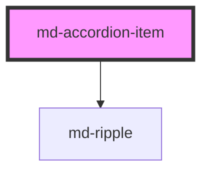

# md-accordion-item

<!-- llm:meta
tag: md-accordion-item
category: containment
status: sub-component
parent: md-accordion
standalone: partial
m3-guidelines: none — M3 has no accordion page
m3-derived-from: https://m3.material.io/components/lists/guidelines
form-associated: false
depends-on: md-ripple
used-by: none
-->

**One collapsible section: a header button and the panel it controls.** The
header carries a headline, optional supporting text and leading/trailing icons;
the panel holds your slotted content and is `inert` while collapsed.

> 🧩 **Sub-component.** Normally a child of `md-accordion`. It degrades to a
> usable standalone collapsible region, but group behaviour (`exclusive`,
> `keep-one-expanded`, arrow-key movement between headers, reordering) exists
> only inside `md-accordion`.

---

## When to use

- As a section inside **`md-accordion`**, which owns the group: it sets each
  item's `heading-level`, panel role and collapsible lock, coordinates
  `exclusive` / `keep-one-expanded`, moves focus between headers and performs
  reordering.
- As a **single** standalone collapsible region, where you need no group
  coordination. Standalone, Enter / Space still toggle, but ArrowUp /
  ArrowDown / Home / End do nothing, because the parent is what acts on them.

## When NOT to use

| Situation | Use instead |
|---|---|
| Sibling views the user switches between | `md-tab` inside `md-tabs` |
| A step in an ordered flow | `md-step` inside `md-stepper` |
| A list row that reveals detail | `md-list-item` |
| A rich content container | `md-card` |
| A menu row | `md-menu-item` |
| Two or more coordinated sections | Wrap them in `md-accordion` |

## Decision cues

| Need | Setting |
|---|---|
| Header title | `headline` (or the `headline` slot for markup) |
| Second line under the title | `supporting-text` |
| Leading glyph | `icon="local_shipping"` (or the `leading-icon` slot) |
| Replace the chevron | `trailing-icon` slot |
| Open on load | `expanded` |
| Header unavailable and unfocusable | `disabled` |
| Open and not closable | `collapsible="false"` (usually set by the parent) |
| Cap a long panel so it scrolls | `content-max-height="320px"` |
| Standalone heading depth | `heading-level` (ignored inside `md-accordion`) |

## API contract

```html
<md-accordion>
  <md-accordion-item
    headline="Shipping"                  <!-- default: "" -->
    supporting-text="Arrives in 3-5 days" <!-- default: "" -->
    icon="local_shipping"                <!-- default: "" (Material Symbols name) -->
    expanded                             <!-- default: false; reflects -->
    disabled                             <!-- default: false; reflects -->
    collapsible="true|false"             <!-- default: true -->
    heading-level="1|2|3|4|5|6"          <!-- default: 3 -->
    region-role="region|group|none"      <!-- default: region -->
    content-max-height="320px"           <!-- default: "" (grows to fit) -->
    density="-1|-2|-3|-4"                <!-- default: 0 (uncompacted; only -1…-4 have rules) -->
  >
    <p>Panel content.</p>
  </md-accordion-item>
</md-accordion>
```

**Events** — `mdItemToggle` (`CustomEvent<{ expanded: boolean; index: number }>`)
fires on every change of `expanded`, including programmatic ones. `index` comes
from the position the parent assigns and is `-1` for a standalone item.

**Internal events — do not build on these:** `mdItemRequestFocus` and
`mdItemRequestReorder` exist only so the parent `md-accordion` can act on
arrow-key navigation and `Alt + Arrow` reordering. Listen to the accordion's
`mdToggle` / `mdReorder` instead.

**Methods** — `toggle(): Promise<void>` and `focusHeader(): Promise<void>`.
`focusHeader()` focuses the header button and requests a visible focus ring.

**Slots** — `(default)` panel content · `headline` · `leading-icon` ·
`trailing-icon`. There is **no** `supporting-text` slot — that line is
prop-only.

**Parts** — `chassis-handle`, `chassis-handle-bar`, `heading`, `header`,
`state-layer`, `drag-handle`, `leading-icon`, `headline`, `supporting-text`,
`trailing-icon`, `panel`, `content`, `content-inner`.

### Behavioral contract worth knowing

- **Inside `md-accordion` the parent overwrites `heading-level`,
  `region-role` and `collapsible`** from its own `heading-level`, `region` /
  `region-threshold` and `keep-one-expanded` settings. Setting them on the item
  only sticks when the item is standalone.
- `expanded` is two-way: it reflects to the attribute and can be set directly.
  Every change emits `mdItemToggle`.
- **`toggle()` ignores `collapsible`.** It is blocked only by `disabled`, so it
  can close a panel that the header refuses to close. Use it deliberately.
- `disabled` and "locked open" are different states. `disabled` puts the native
  `disabled` attribute on the header button, so it is skipped by the keyboard
  entirely. A locked-open item (`collapsible="false"`, or the parent's
  `keep-one-expanded`) keeps the header focusable and advertises
  `aria-disabled="true"`, while click / Enter / Space stop toggling it.
- **The panel content is always in the DOM.** Collapsed, the panel is
  `aria-hidden="true"` and `inert`, so it is not focusable or exposed to
  assistive tech — but it is still parsed and mounted. Render expensive content
  on first expand yourself.
- `content-max-height` turns the panel body into a scroll container **and**
  gives it `tabindex="0"` so keyboard-only users can scroll it. Prefer it over
  a slotted `overflow: auto` wrapper, which the component cannot make
  focusable.
- Header keys: Enter / Space toggle; ArrowDown / ArrowUp / Home / End and
  `Alt + ArrowUp` / `Alt + ArrowDown` emit requests that only `md-accordion`
  acts on.
- The header renders a native `<h1>`–`<h6>` from `heading-level`, clamped to
  1–6, so the heading level is real and not just an ARIA attribute.
- `region-role="none"` omits the panel's role entirely; the panel is still
  labelled by its header in all three modes.
- `icon` renders a Material Symbols ligature and only shows a glyph if that
  font is loaded. Use `slot="leading-icon"` for any other artwork.
- The drag handle and the floating-chassis grip are always rendered but hidden;
  the parent reveals them via `reorderable` / `floating`.

---

## Do / Don't

House rules, informed by
[M3 · Lists · Guidelines](https://m3.material.io/components/lists/guidelines) —
no M3 accordion page exists.

| ✅ Do | ❌ Don't |
|---|---|
| Keep the headline short and scannable | Don't write a sentence as the headline |
| Use `supporting-text` for a one-line summary | Don't hide the summary inside the collapsed panel |
| Let the parent set `heading-level` | Don't hardcode a level that breaks the page outline |
| Cap very long panels with `content-max-height` | Don't let one panel push the page into an endless scroll |
| Render expensive content on first expand | Don't mount heavy widgets in every collapsed panel |
| Keep sibling sections structurally parallel | Don't mix wildly different content shapes |
| Use `disabled` for genuinely unavailable sections | Don't remove and re-add sections as state changes |

---

## Patterns

```html
<!-- Inside an accordion: listen on the PARENT -->
<md-accordion id="policies" heading-level="2" exclusive>
  <md-accordion-item headline="Shipping" supporting-text="3-5 days"
                     icon="local_shipping">
    <p>Standard delivery is free over 50.</p>
  </md-accordion-item>
  <md-accordion-item headline="Returns" icon="undo">
    <p>30 days, no questions asked.</p>
  </md-accordion-item>
</md-accordion>

<script type="module">
  document.getElementById('policies').addEventListener('mdToggle', (e) => {
    console.log(e.detail.index, e.detail.expanded, e.detail.expandedIndices);
  });
</script>
```

```html
<!-- Standalone collapsible region: set heading-level yourself -->
<md-accordion-item id="advanced" headline="Advanced options" heading-level="2">
  <p>Nothing here needs changing for most people.</p>
</md-accordion-item>

<script type="module">
  const item = document.getElementById('advanced');
  item.addEventListener('mdItemToggle', (e) => console.log(e.detail.expanded));
</script>
```

```html
<!-- Long panel that scrolls internally and stays keyboard-scrollable -->
<md-accordion-item headline="Terms" content-max-height="320px">
  <p>…several pages of terms…</p>
</md-accordion-item>
```

```html
<!-- Rich headline and a custom trailing icon -->
<md-accordion-item>
  <span slot="headline"><strong>Payment</strong> methods</span>
  <span slot="leading-icon" class="material-symbols-outlined">credit_card</span>
  <span slot="trailing-icon" class="material-symbols-outlined">expand_more</span>
  <p>Cards and bank transfer.</p>
</md-accordion-item>
```

```html
<!-- Lazy content on first expand -->
<md-accordion-item id="report" headline="Full report"></md-accordion-item>

<script type="module">
  const item = document.getElementById('report');
  item.addEventListener('mdItemToggle', (e) => {
    if (e.detail.expanded && !item.dataset.loaded) {
      item.dataset.loaded = '1';
      const p = document.createElement('p');
      p.textContent = 'Loaded on demand.';
      item.append(p);
    }
  });
</script>
```

## Anti-patterns

| ❌ Wrong | ✅ Right | Why |
|---|---|---|
| Listening for `mdItemRequestFocus` / `mdItemRequestReorder` | Use the accordion's `mdToggle` / `mdReorder` | Those are internal plumbing between item and parent. |
| Setting `heading-level` / `region-role` / `collapsible` on items inside an accordion | Set `heading-level` / `region` / `keep-one-expanded` on the parent | The parent overwrites all three. |
| Expecting ArrowUp / ArrowDown to work on a standalone item | Wrap the items in `md-accordion` | The parent is what moves focus between headers. |
| Using `toggle()` to respect a locked-open panel | Check `collapsible` first | `toggle()` is blocked only by `disabled`. |
| `disabled` to mean "open and not closable" | `collapsible="false"` | `disabled` removes the header from the keyboard entirely. |
| Mounting heavy content in every panel | Render on first expand | Collapsed panels are inert but still in the DOM. |
| A slotted `<div style="overflow:auto">` inside the panel | `content-max-height="320px"` | A light-DOM scroller cannot be made keyboard-focusable by the component. |
| `<span slot="supporting-text">` | Use the `supporting-text` prop | There is no such slot. |
| Overriding the panel's hidden state with your own CSS | Leave it alone | It relies on `inert` + `aria-hidden` to stay out of the a11y tree. |
| Controlling group state by setting each item's `expanded` | Use the parent's `default-expanded` / `exclusive` | Two sources of truth. |
| A headline that duplicates the supporting text | Differentiate them | Redundant announcement. |
| `region-role="region"` on dozens of items | Let the parent's `region` logic decide | Landmark noise. |
| Using it as a tab panel | `md-tab-panel` | Different model. |

## Accessibility, RTL, density, i18n

**Accessibility**
- The header renders a real `<h1>`–`<h6>` wrapping a `<button>` with
  `aria-expanded` and `aria-controls`; the panel is labelled by that button via
  `aria-labelledby`.
- `heading-level` places the section in the document outline — get it right, or
  heading navigation breaks. Inside an accordion, set it on the parent.
- `region-role` decides whether the panel is a landmark (`region`), a plain
  group (`group`), or roleless (`none`). Inside an accordion the parent's
  `region` / `region-threshold` logic manages this to avoid dozens of
  landmarks.
- `disabled` natively disables the header button, so it leaves the tab order. A
  locked-open item stays focusable and announces `aria-disabled="true"` so
  screen-reader users can hear which panel is the open one.
- A collapsed panel is `inert` and `aria-hidden="true"` — hidden from both the
  keyboard and assistive tech. Don't override that with your own CSS.
- `content-max-height` adds `tabindex="0"` to the scroll container so it is
  reachable without a pointer; its accessible name comes from the enclosing
  labelled panel.
- `focusHeader()` requests a visible focus ring even when called from a
  mouse-driven action.

**RTL** — header layout, icons, the drag handle and all padding are logical and
mirror under `dir="rtl"`. Swap a directional custom `trailing-icon` yourself;
the built-in chevron points down and needs no mirroring.

**Density** — set `density="-1"` … `density="-4"` for a local rung, or inherit
the rung from a `md-accordion` or a global `data-density` ancestor. Rung `0` is
the uncompacted default and has no rule of its own, so `density="0"` does
**not** opt an item out of an inherited rung; use
`style="--md-sys-density-scale: 0"` to reset the scale locally. Density drives
header min-height, header padding and content padding.

**i18n** — translate `headline`, `supporting-text` and panel content. Longer
headlines wrap onto more lines, which grows the header — check header height
per locale.

## Related components

`md-accordion` · `md-tabs` · `md-tab-panel` · `md-list-item` · `md-card` ·
`md-stepper` · `md-ripple`

## Theming

| Custom property | Purpose | Default |
|---|---|---|
| `--md-accordion-item-container-color` | Item surface | `--md-sys-color-surface-container-low` |
| `--md-accordion-item-container-color-expanded` | Item surface while expanded | `--md-sys-color-surface-container` |
| `--md-accordion-item-container-shape` | Corner radius, collapsed | `--md-sys-shape-corner-medium` (12px) |
| `--md-accordion-item-container-shape-expanded` | Corner radius, expanded | `--md-sys-shape-corner-large` (16px) |
| `--md-accordion-item-header-color` | Header background, collapsed | `transparent` |
| `--md-accordion-item-header-color-expanded` | Header background, expanded | `--md-sys-color-secondary-container` |
| `--md-accordion-item-headline-color` | Headline text, collapsed | `--md-sys-color-on-surface` |
| `--md-accordion-item-headline-color-expanded` | Headline text, expanded | `--md-sys-color-on-secondary-container` |
| `--md-accordion-item-supporting-color` | Supporting-text colour | `--md-sys-color-on-surface-variant` |
| `--md-accordion-item-icon-color` | Icon colour, collapsed | `--md-sys-color-on-surface-variant` |
| `--md-accordion-item-icon-color-expanded` | Icon colour, expanded | `--md-sys-color-on-secondary-container` |
| `--md-accordion-item-state-layer-color` | Hover/press overlay, collapsed | `--md-sys-color-on-surface` |
| `--md-accordion-item-state-layer-color-expanded` | Hover/press overlay, expanded | `--md-sys-color-on-secondary-container` |
| `--md-accordion-item-header-min-height` | Header height | `max(40px, 64px + density × 4px)` |
| `--md-accordion-item-header-padding` | Header padding | `max(4px, 16px + density × 2px) max(12px, 24px + density × 2px)` |
| `--md-accordion-item-content-padding` | Panel padding | `max(8px, 20px + density × 2px) max(12px, 24px + density × 2px)` |
| `--md-accordion-item-elevation` | Item shadow, collapsed | `--md-sys-elevation-0`, raised by the parent's `elevation` |
| `--md-accordion-item-elevation-expanded` | Item shadow, expanded | same as the collapsed shadow at `elevation="0"`; one level higher for `elevation="1"`-`"5"` |
| `--md-accordion-item-expand-duration` | Expand animation duration | preset-dependent, `--md-sys-motion-duration-medium3` (350ms) by default |
| `--md-accordion-item-collapse-duration` | Collapse animation duration | preset-dependent, `--md-sys-motion-duration-short4` (200ms) by default |
| `--md-accordion-item-container-color-dragging` | Opaque tile fill while it is being drag-reordered | `--md-sys-color-surface-container-low` |
| `--md-accordion-item-container-shape-dragging` | Tile corner radius while it is being drag-reordered | `--md-sys-shape-corner-medium` (12px) |
| `--md-accordion-item-chassis-handle-color` | Colour of the floating-panel grip bar | `--md-sys-color-on-surface-variant` |
| `--md-accordion-item-chassis-handle-bg-hover` | Tint behind the grip on hover/press | 10% (hover) / 16% (press) of the state-layer colour |

These properties inherit, so setting them on the `<md-accordion>` applies them
to every item in the group.

**CSS parts** — `chassis-handle`, `chassis-handle-bar`, `heading`, `header`,
`state-layer`, `drag-handle`, `leading-icon`, `headline`, `supporting-text`,
`trailing-icon`, `panel`, `content`, `content-inner`.

```css
md-accordion-item.compact {
  --md-accordion-item-header-min-height: 48px;
  --md-accordion-item-header-color-expanded: var(--md-sys-color-surface-container-high);
}

md-accordion-item.compact::part(headline) {
  font-weight: 600;
}
```

<!-- Auto Generated Below -->


## Properties

| Property           | Attribute            | Description                                                                                                                                                                                                                                                                                                                                                                                                                                                                                                                                                                                                                                                                                                                             | Type                            | Default    |
| ------------------ | -------------------- | --------------------------------------------------------------------------------------------------------------------------------------------------------------------------------------------------------------------------------------------------------------------------------------------------------------------------------------------------------------------------------------------------------------------------------------------------------------------------------------------------------------------------------------------------------------------------------------------------------------------------------------------------------------------------------------------------------------------------------------- | ------------------------------- | ---------- |
| `collapsible`      | `collapsible`        | Whether the item can be collapsed when it is expanded. Set to `false` to implement the APG variant where the accordion does not permit a panel to be collapsed — the open button then advertises `aria-disabled="true"`, and Enter / Space / click no longer toggle it. Typically managed by the parent's `keep-one-expanded` mode.                                                                                                                                                                                                                                                                                                                                                                                                     | `boolean`                       | `true`     |
| `contentMaxHeight` | `content-max-height` | Cap the panel body's block-size (e.g. `"220px"`, `"40vh"`). When set, the content region becomes a scroll container instead of growing to fit — and, crucially, it is made keyboard-focusable (`tabindex="0"`) so keyboard-only users can scroll it. A scrollable region whose content isn't itself focusable is otherwise unreachable without a pointer (WCAG 2.1.1 — axe `scrollable-region-focusable`). Its accessible name comes from the enclosing labelled panel region.  Prefer this over hand-rolling a slotted `overflow:auto` wrapper: an authored scroll `<div>` lives in light DOM the component can't make focusable, so it would trip the same axe rule. Leave empty (default) for a panel that grows to fit its content. | `string`                        | `''`       |
| `density`          | `density`            | Local density rung. Drives the same `--md-sys-density-scale` signal that a global `data-density` ancestor sets, so a local value simply overrides the inherited one. 0 = default, -4 = ultra-compact.                                                                                                                                                                                                                                                                                                                                                                                                                                                                                                                                   | `-1 \| -2 \| -3 \| -4 \| 0`     | `0`        |
| `disabled`         | `disabled`           | Disable interaction.                                                                                                                                                                                                                                                                                                                                                                                                                                                                                                                                                                                                                                                                                                                    | `boolean`                       | `false`    |
| `expanded`         | `expanded`           | Whether the item is expanded. Two-way bindable.                                                                                                                                                                                                                                                                                                                                                                                                                                                                                                                                                                                                                                                                                         | `boolean`                       | `false`    |
| `headingLevel`     | `heading-level`      | ARIA heading level (`aria-level`) for the item's heading wrapper. Renders a native `<h1>`–`<h6>` so the implicit semantics match the page's information architecture. Per WAI-ARIA APG: "an element with role heading that has a value set for aria-level that is appropriate for the information architecture of the page".  Set per-item, or let the parent `<md-accordion heading-level>` propagate the same value to every item.                                                                                                                                                                                                                                                                                                    | `1 \| 2 \| 3 \| 4 \| 5 \| 6`    | `3`        |
| `headline`         | `headline`           | Header text (or use the `headline` slot).                                                                                                                                                                                                                                                                                                                                                                                                                                                                                                                                                                                                                                                                                               | `string`                        | `''`       |
| `icon`             | `icon`               | Optional leading-icon (Material Symbols shorthand).                                                                                                                                                                                                                                                                                                                                                                                                                                                                                                                                                                                                                                                                                     | `string`                        | `''`       |
| `regionRole`       | `region-role`        | Role applied to the accordion panel. APG recommends `region` for structural clarity, but warns against using it when more than ~6 panels can be open at once (landmark proliferation). The parent `<md-accordion region>` orchestrates this automatically.  - `region` (default) — full landmark semantics. - `group` — semantically a group but not a landmark. - `none` — drop the role entirely (still labelled via aria-labelledby).                                                                                                                                                                                                                                                                                                | `"group" \| "none" \| "region"` | `'region'` |
| `supportingText`   | `supporting-text`    | Optional small caption below the headline.                                                                                                                                                                                                                                                                                                                                                                                                                                                                                                                                                                                                                                                                                              | `string`                        | `''`       |


## Events

| Event                  | Description                                                                                                                              | Type                                                                               |
| ---------------------- | ---------------------------------------------------------------------------------------------------------------------------------------- | ---------------------------------------------------------------------------------- |
| `mdItemRequestFocus`   | Internal event the parent listens to for arrow-key roving focus. Bubbles + composed so the parent receives it through the shadow.        | `CustomEvent<{ direction: "next" \| "prev" \| "first" \| "last"; from: number; }>` |
| `mdItemRequestReorder` | Internal event the parent listens to for Alt+Arrow keyboard reordering. Bubbles + composed so the parent receives it through the shadow. | `CustomEvent<{ direction: "up" \| "down"; from: number; }>`                        |
| `mdItemToggle`         | Emitted whenever the item toggles. The parent `md-accordion` uses this to coordinate exclusive mode.                                     | `CustomEvent<{ expanded: boolean; index: number; }>`                               |


## Methods

### `focusHeader() => Promise<void>`

Move keyboard focus to the item's header.

Uses `{ focusVisible: true }` so the focus ring is painted even when
the call originates from a mouse-driven action (e.g. another button
in the page calling `await item.focusHeader()`). Without it, browsers
inherit the last input modality and skip the focus-visible ring on
mouse-initiated programmatic focus, leaving the user wondering whether
the call did anything. The option is supported in evergreen Chromium
(137+), Firefox (134+) and Safari (17.4+); older runtimes ignore it
harmlessly and fall back to the prior behaviour.

#### Returns

Type: `Promise<void>`


### `toggle() => Promise<void>`

Programmatically toggle the item.

#### Returns

Type: `Promise<void>`


## Shadow Parts

| Part                   | Description |
| ---------------------- | ----------- |
| `"chassis-handle"`     |             |
| `"chassis-handle-bar"` |             |
| `"content"`            |             |
| `"content-inner"`      |             |
| `"drag-handle"`        |             |
| `"header"`             |             |
| `"heading"`            |             |
| `"headline"`           |             |
| `"leading-icon"`       |             |
| `"panel"`              |             |
| `"state-layer"`        |             |
| `"supporting-text"`    |             |
| `"trailing-icon"`      |             |


## Dependencies

### Depends on

- [md-ripple](../md-ripple)

### Graph


----------------------------------------------

*Built with [StencilJS](https://stenciljs.com/)*
