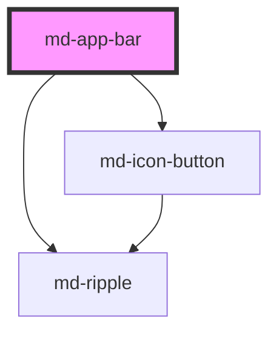

# md-app-bar

<!-- llm:meta
tag: md-app-bar
category: navigation
status: md3-mapped
m3-guidelines: https://m3.material.io/components/app-bars/guidelines
form-associated: false
depends-on: md-icon-button, md-ripple
used-by: none
-->

**The screen's header.** Title, a leading navigation affordance, and trailing
actions — in small / medium / large heights, plus a dedicated **search**
variant for apps where search is the primary global function.

> Setup, theming, density and i18n are configured once for the whole library.
> Quick start: `import '@awc-ui/core/define';`

---

## When to use

- The **top of a screen**: current context, a back or menu affordance, and a
  small number of actions.
- A taller header for a prominent page title (`medium` / `large`).
- **Global search as the primary function** (`variant="search"`).

## When NOT to use

| Situation | Use instead |
|---|---|
| Local, page-specific action clusters | `md-toolbar` |
| Top-level destinations | `md-navigation-bar` / `md-navigation-rail` |
| Sibling views inside a screen | `md-tabs` |
| Search scoped to one view, with a results panel | `md-search` |
| Where-am-I hierarchy | `md-breadcrumbs` |
| A row of related actions | `md-button-group` |

## Decision cues

| Need | Setting |
|---|---|
| Standard header | `variant="small"` (default) |
| Prominent page title, may wrap to two lines | `variant="medium"` / `"large"` |
| Search is the app's primary global function | `variant="search"` |
| Centred title | `title-alignment="center"` |
| Tonal container while the page is scrolled | `scrolled` |
| Back or menu affordance | `leading-icon` + `leading-icon-label` |
| A second line under the title | `subtitle` |
| Your own search UI in the pill | `slot="search"` |

## API contract

```html
<md-app-bar
  variant="small|medium|large|search"   <!-- default: small -->
  title-alignment="start|center"        <!-- default: start -->
  headline="Inbox"
  subtitle="12 unread"
  leading-icon="menu"
  leading-icon-label="Open navigation"
  scrolled
  search-placeholder="Search"           <!-- default: "Search" -->
  search-value=""
  search-aria-label="Search mail"
  search-disabled
  density="-1|-2|-3|-4"                 <!-- default: 0 (uncompacted) -->
>
  <md-icon-button slot="trailing" icon="more_vert" aria-label="More"></md-icon-button>
</md-app-bar>
```

**Events** — all three bubble and are `composed`.

| Event | Detail | Fires |
|---|---|---|
| `mdLeadingClick` | `MouseEvent` | The **prop-based** `leading-icon` button is clicked |
| `mdSearchActivate` | `{ value }` | The built-in search field is focused, or `Enter`/`Space` is pressed in it |
| `mdSearchInput` | `{ value }` | Every keystroke in the built-in search field |

**Methods** — none.

**Slots** — `leading`, `headline`, `subtitle`, `trailing`, `search`,
`search-trailing`.

**Parts** — `row`, `leading`, `leading-icon`, `title`, `subtitle`, `expanded`,
`expanded-headline`, `trailing`, `search-host`, `search`, `search-state-layer`,
`search-field`, `search-input`, `search-content`, `search-trailing`. The
`leading-icon` button also exports `icon` and `state-layer`.

### Behavioral contract worth knowing

- The host is **`position: sticky; inset-block-start: 0`** with
  `z-index: var(--md-sys-z-index-app-bar, 100)` — it sticks to the top of its
  scroll container on its own. You do not need to position it.
- The host carries **`role="banner"`**. Only one banner landmark per page.
- **`scrolled` is a prop you set**, not something the bar detects. Wire it to
  your own scroll listener; it swaps the container (and the search pill) from
  `surface` to `surface-container`.
- **The `headline` / `subtitle` props win over the matching slots** — the slot
  is only rendered when the prop is empty. Setting both silently ignores the
  slot.
- The **`leading` slot wins over the `leading-icon` prop**: the built-in
  `md-icon-button` is rendered only when nothing is slotted. `mdLeadingClick`
  therefore fires only for the prop-based button — a slotted control needs its
  own click listener.
- `mdLeadingClick` reports the press and nothing else. Opening a drawer or
  navigating is yours.
- The **`trailing` slot is capped at 3 elements.** Extras get `hidden` set on
  them and a `console.warn` is logged.
- On `medium` / `large` the expanded headline block is always rendered and the
  inline row title is hidden (`opacity: 0`, `aria-hidden="true"`), so the
  headline is announced once.
- `subtitle` grows a flexible bar: medium 112 → 136dp, large 120 → 152dp.
- **Filling `slot="search"` replaces the built-in `<input>` entirely.** With it
  filled, `search-value`, `search-placeholder`, `search-aria-label` and both
  `mdSearchInput` / `mdSearchActivate` events are inert — your slotted field
  owns the interaction.
- `search-value` is mutable and reflected: typing writes it back to the
  attribute.
- `search-disabled` suppresses `mdSearchActivate`, drops the ripple, and dims
  the pill to 0.38 opacity.
- On `variant="search"`, `title-alignment="center"` centres only the
  **placeholder** (`::placeholder`); the caret and typed text stay
  inline-start-aligned so nothing shifts on focus.
- Below 600px (container **or** viewport width) the search pill tightens its
  hint inset and hides every `search-trailing` child after the first. Add
  `data-compact-keep` to a child to keep it.
- M3 gives `medium` / `large` a two-line headline allowance; `small` must not
  wrap.

---

## Do / Don't

Sourced from [M3 · App bars · Guidelines](https://m3.material.io/components/app-bars/guidelines).

| ✅ Do | ❌ Don't |
|---|---|
| Use a filled or tonal button for the one important action | Don't put multiple filled or tonal buttons in the app bar |
| Keep the search variant's trailing content sparse | Don't use three icons **and** an avatar in a search app bar |
| Use straight corners | Don't use curved shapes — it implies the container expands on interaction |
| Keep the default heights | Don't make an app bar shorter than its default height |
| Use `medium`/`large` and wrap to **two lines max** for long headlines | Don't wrap text in a `small` app bar |
| Use filled icons for clear, visible actions | Outlined icons only as needed, or for toggle buttons |
| Keep the leading affordance predictable (back or menu) | Don't overload the leading slot |

---

## Patterns

```html
<md-app-bar id="bar" headline="Inbox" leading-icon="menu"
            leading-icon-label="Open navigation">
  <md-icon-button slot="trailing" icon="search" aria-label="Search"></md-icon-button>
  <md-icon-button slot="trailing" icon="more_vert" aria-label="More options"></md-icon-button>
</md-app-bar>

<script type="module">
  const bar = document.getElementById('bar');
  bar.addEventListener('mdLeadingClick', () => openDrawer());

  // `scrolled` is yours to drive
  addEventListener('scroll', () => { bar.scrolled = window.scrollY > 0; }, { passive: true });
</script>
```

```html
<!-- Long headline: medium/large, two lines max -->
<md-app-bar variant="large" headline="Quarterly performance review"
            subtitle="Updated 5 minutes ago"></md-app-bar>
```

```html
<!-- Search as the app's primary function -->
<md-app-bar id="sbar" variant="search" search-placeholder="Search mail"
            search-aria-label="Search mail" leading-icon="menu"
            leading-icon-label="Open navigation">
  <md-icon-button slot="search-trailing" icon="mic" aria-label="Search by voice"></md-icon-button>
  <md-avatar slot="trailing" name="Ada Lovelace" initials="AL"></md-avatar>
</md-app-bar>

<script type="module">
  const sbar = document.getElementById('sbar');
  sbar.addEventListener('mdSearchInput',    (e) => suggest(e.detail.value));
  sbar.addEventListener('mdSearchActivate', (e) => openSearchView(e.detail.value));
</script>
```

```html
<!-- Slotted headline (only read when the props are empty) -->
<md-app-bar>
  <h1 slot="headline">Inbox</h1>
  <span slot="subtitle">12 unread</span>
</md-app-bar>
```

## Anti-patterns

| ❌ Wrong | ✅ Right | Why |
|---|---|---|
| Expecting `scrolled` to update itself | Set it from a scroll listener | It is a plain prop; the bar never reads scroll position. |
| Wrapping the bar in a `position: fixed` div to pin it | Leave it alone | The host is already `position: sticky; top: 0`. |
| `headline="Inbox"` **and** `<span slot="headline">` | Pick one | The prop wins; the slot is never rendered. |
| Expecting `mdLeadingClick` from a slotted leading button | Listen on the slotted control | The event belongs to the prop-based button only. |
| Four `md-icon-button`s in `slot="trailing"` | Keep three; move the rest into a menu | The 4th is hidden and warned about. |
| Using the search variant to get a results panel | `md-search` | This variant is a bar-integrated field, not a search surface. |
| Listening for `mdSearchInput` while using `slot="search"` | Listen on your own slotted field | The built-in input is not rendered, so the events never fire. |
| Two filled/tonal buttons in the bar | One emphasised action | M3 explicit rule. |
| Three icons plus an avatar in a search bar | Trim the trailing content | M3 explicit rule. |
| Rounded corners on the app bar | Straight corners | M3 explicit rule. |
| Reducing the bar below its default height | Keep the default | M3 explicit rule. |
| A wrapping headline in `small` | Use `medium`/`large` | M3 explicit rule. |
| A second `md-app-bar` on the page | One header per page | The host is `role="banner"`. |
| App bar used for local page actions | `md-toolbar` | Different purpose. |

## Accessibility, RTL, density, i18n

**Accessibility**
- The host is the page's `banner` landmark — render exactly one per page.
- Give the leading affordance a localized `leading-icon-label`; it is an
  icon-only control and would otherwise be nameless.
- Every trailing `md-icon-button` needs its own `aria-label`.
- The headline styling is not a heading. Slot a real heading element
  (`<h1 slot="headline">`) or provide one elsewhere in the document.
- On flexible bars the inline copy of the title is `aria-hidden`, so the
  headline is announced once, from the expanded block.
- For the search variant set `search-aria-label`; it falls back to
  `search-placeholder`, and a placeholder is not a reliable name.
- The built-in search field is `role="searchbox"` with `inputmode="search"`.
  Its focus ring is drawn only for keyboard focus.

**RTL** — leading/trailing sides, title alignment and padding are all logical
properties and mirror under `dir="rtl"`. A directional slotted leading glyph
(`arrow_back`) mirrors when you mark it `data-directional`.

**Density** — `density="-1…-4"` shortens the action row (64 → 48dp), the icon
targets, the search pill and the expanded heights. Rung `0` is the uncompacted
default and is inert. M3 warns against going below the default height, so use
deep rungs sparingly here. To opt an app bar out of an inherited global
`data-density` rung, set `style="--md-sys-density-scale: 0"` on it.

**i18n** — translate `headline`, `subtitle`, `leading-icon-label`,
`search-placeholder`, `search-aria-label`, and the trailing controls' labels.
Long translated titles are exactly the case for `medium` / `large`.

## Related components

`md-toolbar` · `md-search` · `md-navigation-rail` · `md-navigation-bar` ·
`md-tabs` · `md-breadcrumbs` · `md-icon-button` · `md-avatar`

## Theming

| Custom property | Purpose | Default |
|---|---|---|
| `--md-app-bar-container-color` | Container background | `--md-sys-color-surface` |
| `--md-app-bar-container-color-scrolled` | Background while `scrolled` | `--md-sys-color-surface-container` |
| `--md-app-bar-container-shape` | Corner radius | `--md-sys-shape-corner-none` |
| `--md-app-bar-container-elevation` | Container shadow | `--md-sys-elevation-0` |
| `--md-app-bar-headline-color` | Title / expanded headline | `--md-sys-color-on-surface` |
| `--md-app-bar-subtitle-color` | Subtitle | `--md-sys-color-on-surface-variant` |
| `--md-app-bar-leading-icon-color` | Leading glyph | `--md-sys-color-on-surface` |
| `--md-app-bar-trailing-icon-color` | Trailing glyphs | `--md-sys-color-on-surface-variant` |
| `--md-app-bar-row-height` | Action row height | `64px` (tapers 4px/rung, floor 48px) |
| `--md-app-bar-padding-inline-start` / `-padding-inline-end` | Row gutters | `4px` |
| `--md-app-bar-row-padding-inline` | **Deprecated** alias, read only as the fallback for the two properties above. Do not use it in new code. | `4px` |
| `--md-app-bar-row-padding-block-start` | Row top padding | `0`; `20px` on `large` |
| `--md-app-bar-icon-gap` | Gap between icons and row content | `0px` |
| `--md-app-bar-icon-size` | Glyph size in the row | `24px` (tapers 1px/rung, floor 18px) |
| `--md-app-bar-icon-button-size` | Leading touch target | `48px` (tapers 4px/rung, floor 32px) |
| `--md-app-bar-trailing-icon-touch-size` | Trailing touch target | Same as the leading target |
| `--md-app-bar-trailing-gap` | Gap between trailing icons | `2px` |
| `--md-app-bar-avatar-size` | `md-avatar` size in `trailing` | `32px` (tapers 2px/rung, floor 24px) |
| `--md-app-bar-medium-height` / `-medium-height-with-subtitle` | Medium expanded height | `112px` / `136px` |
| `--md-app-bar-large-height` / `-large-height-with-subtitle` | Large expanded height | `120px` / `152px` |
| `--md-app-bar-expanded-padding-inline` | Expanded block gutters | `16px` |
| `--md-app-bar-expanded-padding-block-end` | Expanded block bottom padding | `24px`; `28px` on `large` |
| `--md-app-bar-search-container-color` | Search pill fill | `--md-sys-color-surface-container-highest` |
| `--md-app-bar-search-container-color-scrolled` | Search pill fill while `scrolled` | `--md-sys-color-surface-container` |
| `--md-app-bar-search-container-shape` | Search pill radius | `--md-sys-shape-corner-full` |
| `--md-app-bar-search-container-height` | Search pill height | `56px` (tapers 4px/rung, floor 40px) |
| `--md-app-bar-search-padding-inline-start` | Hint inset | `24px` (16px < 600px, 12px < 400px) |
| `--md-app-bar-search-padding-inline-end` | Pill end padding after in-pill icons | `8px` |
| `--md-app-bar-search-row-gap` | Gap between leading, pill and trailing | `8px` |
| `--md-app-bar-search-trailing-gap` | Gap between in-pill trailing icons | `4px` |
| `--md-app-bar-search-field-trailing-gap` | Gap between hint and in-pill icons | `6px` |
| `--md-app-bar-trailing-touch-size` | Outside trailing target on search bars | `48px` (tapers 4px/rung, floor 32px) |
| `--md-app-bar-search-placeholder-color` | Placeholder text | `--md-sys-color-on-surface-variant` |
| `--md-app-bar-search-input-color` | Typed search text | `--md-sys-color-on-surface` |
| `--md-app-bar-search-trailing-icon-color` | In-pill icons | `--md-sys-color-on-surface-variant` |

**CSS parts** — `row`, `leading`, `leading-icon`, `title`, `subtitle`,
`expanded`, `expanded-headline`, `trailing`, `search-host`, `search`,
`search-state-layer`, `search-field`, `search-input`, `search-content`,
`search-trailing`.

```css
md-app-bar.brand {
  --md-app-bar-container-color: var(--md-sys-color-primary-container);
  --md-app-bar-headline-color: var(--md-sys-color-on-primary-container);
}
```

<!-- Auto Generated Below -->


## Overview

`md-app-bar` — Material Design 3 App Bar.

Implements the current (M3 Expressive) app-bars specification:
  https://m3.material.io/components/app-bars/specs

Size variants: `small` (64dp), `medium` (112/136dp expanded), `large`
(120/152dp expanded), and `search` (inline search field in the 64dp row).
Flexible `medium` / `large` bars always render the expanded headline block.
Title alignment (`title-alignment`) is configuration, not a variant.

Selecting the search field should open an `md-search` view via `mdSearchActivate`.

## Properties

| Property            | Attribute            | Description                                                                                                                                                                                                                                                                                                   | Type                                         | Default    |
| ------------------- | -------------------- | ------------------------------------------------------------------------------------------------------------------------------------------------------------------------------------------------------------------------------------------------------------------------------------------------------------- | -------------------------------------------- | ---------- |
| `density`           | `density`            | Density scale: 0 (default 64dp row), -1 (60dp), -2 (56dp), -3 (52dp), -4 (48dp). Tightens the action row, icon targets, search field, and expanded heights.                                                                                                                                                   | `-1 \| -2 \| -3 \| -4 \| 0`                  | `0`        |
| `headline`          | `headline`           | Inline or expanded headline text. Falls back to the `headline` slot when empty.                                                                                                                                                                                                                               | `string`                                     | `''`       |
| `leadingIcon`       | `leading-icon`       | Material Symbols name for the leading navigation icon (slot takes priority).                                                                                                                                                                                                                                  | `string`                                     | `''`       |
| `leadingIconLabel`  | `leading-icon-label` | Accessible label for the prop-based leading icon button. Required when `leading-icon` is set.                                                                                                                                                                                                                 | `string`                                     | `''`       |
| `scrolled`          | `scrolled`           | When true, applies the scrolled container surface colour per M3 app bar common-colors (`surface` → `surface-container`). Wire from your scroll listener; the component does not observe scroll position itself.                                                                                               | `boolean`                                    | `false`    |
| `searchAriaLabel`   | `search-aria-label`  | Search variant only: accessible name for the inline search field. Per M3 labeling guidance, falls back to `search-placeholder` when unset.                                                                                                                                                                    | `string`                                     | `''`       |
| `searchDisabled`    | `search-disabled`    | Search variant only: disable the inline search field.                                                                                                                                                                                                                                                         | `boolean`                                    | `false`    |
| `searchPlaceholder` | `search-placeholder` | Search variant only: hinted search text shown in the inline search field. Falls back to `placeholder` on the optional `search` slot when empty.                                                                                                                                                               | `string`                                     | `'Search'` |
| `searchValue`       | `search-value`       | Search variant only: current search field value (two-way bindable).                                                                                                                                                                                                                                           | `string`                                     | `''`       |
| `subtitle`          | `subtitle`           | Optional subtitle. On flexible variants it sits below the expanded headline (and grows the container); on `small` it stacks under the inline title. Falls back to the `subtitle` slot when empty.                                                                                                             | `string`                                     | `''`       |
| `titleAlignment`    | `title-alignment`    | Title horizontal alignment — `start` (leading edge, default) or `center`. On search bars it centers the placeholder when empty and unfocused; once focused or when typing, the caret and text align to the inline-start edge.                                                                                 | `"center" \| "start"`                        | `'start'`  |
| `variant`           | `variant`            | App bar size variant.  - `small` — 64dp action row with inline title-large headline. - `medium` — flexible 112dp (136dp with subtitle) expanded headline block. - `large` — flexible 120dp (152dp with subtitle) expanded headline block. - `search` — 64dp row with inline search field (M3 search app bar). | `"large" \| "medium" \| "search" \| "small"` | `'small'`  |


## Events

| Event              | Description                                                                                                                                                                                  | Type                              |
| ------------------ | -------------------------------------------------------------------------------------------------------------------------------------------------------------------------------------------- | --------------------------------- |
| `mdLeadingClick`   | Emitted when the prop-based leading icon button is activated.                                                                                                                                | `CustomEvent<MouseEvent>`         |
| `mdSearchActivate` | Search variant only: emitted when the inline search field is selected (click, focus, Enter, or Space). Wire this to `md-search.show()` to open the full-screen search view per the MD3 spec. | `CustomEvent<{ value: string; }>` |
| `mdSearchInput`    | Search variant only: emitted on every inline search field input change.                                                                                                                      | `CustomEvent<{ value: string; }>` |


## Shadow Parts

| Part                   | Description |
| ---------------------- | ----------- |
| `"expanded"`           |             |
| `"expanded-headline"`  |             |
| `"leading"`            |             |
| `"leading-icon"`       |             |
| `"row"`                |             |
| `"search"`             |             |
| `"search-content"`     |             |
| `"search-field"`       |             |
| `"search-host"`        |             |
| `"search-input"`       |             |
| `"search-state-layer"` |             |
| `"search-trailing"`    |             |
| `"subtitle"`           |             |
| `"title"`              |             |
| `"trailing"`           |             |


## Dependencies

### Depends on

- [md-icon-button](../md-icon-button)
- [md-ripple](../md-ripple)

### Graph


----------------------------------------------

*Built with [StencilJS](https://stenciljs.com/)*
