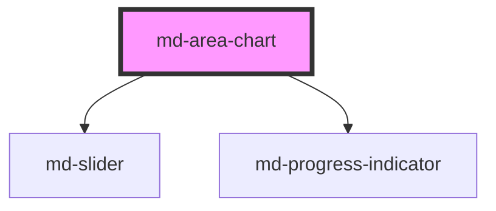

# md-area-chart

<!-- llm:meta
tag: md-area-chart
category: charts
status: custom
m3-guidelines: none — M3 has no chart components
form-associated: false
depends-on: md-slider, md-progress-indicator
used-by: none
engine: in-house Canvas2D + DOM overlay (utils/charts/engine)
-->

**A trend with cumulative volume.** A line chart with the region under the
curve filled — **stacked by default**, so composition over time is the natural
reading. Also does streamgraphs and low/high range bands.

> ⚠️ **Not a Material Design 3 component.** M3 ships no charts. The engine is
> **in-house Canvas2D with a DOM overlay** (`utils/charts/engine`).

> Setup, theming, density and i18n are configured once for the whole library —
> see [`main-llm.md`](../../../../../main-llm.md), the library-wide guide that ships
> alongside these component docs.

---

## When to use

- A trend where **total volume** matters as much as the shape.
- **Composition over time** — how a total splits between series
  (`stack="normal"`) or how shares move (`stack="percentage"`).
- A streamgraph off a free baseline (`stack="silhouette"` / `"wiggle"`).
- A confidence interval or min/max envelope, as a `range` band.
- A single cumulative measure (storage used, traffic).

## When NOT to use

| Situation | Use instead |
|---|---|
| Comparing the shape of several independent series | `md-line-chart` |
| Series carrying their own x values (irregular sampling) | `md-line-chart` — only it accepts per-point x |
| Discrete categories | `md-bar-chart` |
| Parts of a single, non-time whole | `md-pie-chart` |
| An inline micro-trend | `md-sparkline` |
| Series that cross each other frequently | `md-line-chart` — fills would obscure |
| Stacking data that can be negative | `md-line-chart` — stacked areas assume non-negative |

## Decision cues

| Need | Setting |
|---|---|
| Composition of a total | `stack="normal"` (default) |
| Share of total over time | `stack="percentage"` |
| Overlapping translucent areas | `stack="none"` (use sparingly) |
| Streamgraph | `stack="silhouette"` or `stack="wiggle"` |
| A low/high band | `series[].range` (JS property) |
| Fill strength | `fill-opacity="0.55"` |
| Fill with no stroke | `show-line="false"` |
| Curve style | `curve="linear\|smooth\|monotone\|step\|step-before\|step-middle"` |
| Points visible | `show-marks` |
| Bridge missing data | `connect-nulls` |
| Zoom into a dense range | `zoom="inside\|slider\|both"` |
| Category axis down the side | `inverted` |
| Async data | `loading` (+ `loading-label`) |

## API contract

```html
<md-area-chart
  label="Storage by type"
  subtitle="Last 90 days"
  title-align="start|center|end"                 <!-- default: start -->
  curve="linear|smooth|monotone|step|step-before|step-middle"   <!-- default: smooth -->
  stack="normal|percentage|none|silhouette|wiggle"   <!-- default: normal -->
  fill-opacity="0.55"                            <!-- default: 0.55 -->
  show-line                                      <!-- default: ON; set show-line="false" for fill only -->
  connect-nulls                                  <!-- default: off -->
  show-marks                                     <!-- default: off -->
  show-labels                                    <!-- default: off -->
  series-labels                                  <!-- default: off -->
  inverted                                       <!-- default: off -->
  line-width="2.5"                               <!-- default: 2.5 -->
  mark-size="4"                                  <!-- default: per-symbol -->
  grid="none|horizontal|vertical|both"           <!-- default: horizontal -->
  axis-ticks                                     <!-- default: off -->
  legend="top|bottom|left|right|top-start|top-end|bottom-start|bottom-end|none"
                                                 <!-- default: top-end -->
  tooltip="axis|item|none"                       <!-- default: axis -->
  zoom="none|inside|slider|both"                 <!-- default: none -->
  locale="en-US"                                 <!-- default: "" (browser locale) -->
  height="320px"                                 <!-- default: aspect-ratio driven -->
  summary=""                                     <!-- replaces the generated aria-label -->
  loading                                        <!-- default: off -->
  loading-label="Loading chart…"
  label-empty="No data to display"
  label-plot="Chart data. Use the arrow keys to move between points, Home and End for the first and last, Escape to leave."
  label-point="%x%: %values%"
  label-zoom-start="Zoom range start"
  label-zoom-end="Zoom range end"
  animation="expressive|grow|fade|draw|stagger|none"   <!-- default: expressive -->
  animation-duration="700"                       <!-- default: engine default -->
  no-animation                                   <!-- default: off -->
  density="-1|-2|-3|-4"                          <!-- default: 0 (uncompacted) -->
></md-area-chart>
```

Objects, arrays and functions have no attribute form — set them as JS
properties:

```js
const chart = document.querySelector('md-area-chart');

chart.xAxis  = { data: ['Jan', 'Feb', 'Mar'], scale: 'category' };
chart.yAxis  = { label: 'GB', min: 0 };
chart.series = [
  { label: 'Documents', data: [12, 15, 14] },
  { label: 'Media',     data: [30, 34, 41] },
  // A low/high band instead of a line: `range` replaces `data`.
  { label: 'Forecast range', range: [[10, 20], [12, 24], [14, 29]] },
];
chart.tableLabels    = { x: 'Month', series: 'Type' };
chart.valueFormatter = (v) => `${new Intl.NumberFormat('en-US').format(v ?? 0)} GB`;
chart.tooltipRenderer = (ctx) => `${ctx.axisLabel} — ${ctx.series.length} series`;
```

**Events** — `mdMarkerClick`, `mdLineClick`, `mdAreaClick` (all
`MdChartClickDetail`), `mdAxisClick` (`MdChartAxisClickDetail`),
`mdLegendClick` (`{ seriesIndex, seriesId?, selected }`), `mdHover` (throttled
to one per frame), `mdZoom` (`{ startIndex, endIndex, reset }`), `mdReady`. All
are the Stencil default — they bubble and cross shadow boundaries.

**Methods** — `resize()`, `replay()`, `toDataURL()`, `getInstance()`,
`setZoom(startIndex, endIndex)`, `resetZoom()`. All are async. There is no
`drill()` here.

**Slots** — `header` (above the plot), `footer` (below it), `empty` (replaces
`label-empty`), and `loader` (replaces the built-in spinner; `loading` is the
older alias for the same slot — `loader` wins if both are filled).

**Parts** — `header`, `canvas`, `empty`, `loading`, `footer`, `zoom`,
`zoom-slider`, `zoom-pan`, `zoom-band`, plus `zoom-track` / `zoom-window` /
`zoom-handle` forwarded from the inner `md-slider`. The engine additionally
marks the `<canvas>` as `plot-canvas` and the DOM overlay's legend and hover
card as `legend` and `tooltip`.

### Behavioral contract worth knowing

- **`stack` defaults to `"normal"`.** This is the one prop where the area chart
  deliberately differs from `md-line-chart`. `stack="none"` gives overlapping
  translucent fills, which get muddy fast.
- Stacked areas assume **non-negative** values — mixed signs produce a
  misleading stack. Use `md-line-chart` for data that can go negative.
- **`series[].data` is a bare list of y values only**, positioned by index
  against `xAxis.data`. Unlike `md-line-chart`, this component does not accept
  points that carry their own x.
- **A `range` series is a band, not a line**: give `range` (a list of
  `[low, high]` pairs, `{ low, high }` objects, or `null` for a gap) and `data`
  is ignored. A range series never participates in stacking and draws with no
  stroke, so a plain line series layered after it reads as the value inside the
  band.
- **`silhouette` and `wiggle` drop the stroke by default** — a streamgraph rides
  a free baseline, so a layer's top edge is not a value anyone can read. An
  explicit `series[i].stroke` still wins.
- **Zoom is a view, not a mutation.** `series` / `xAxis` are untouched and every
  index reported back to you stays **absolute**. `setZoom()` takes absolute
  indices, not fractions; `zoom="inside"` also resets on a double-click in the
  plot.
- **Legend toggles survive a data re-feed** — a series the reader hid stays
  hidden when `series` is reassigned, keyed by `id`, else `label`, else
  position. An explicit `series[i].hidden` still wins.
- **`loading` covers the plot** with the loader and sets `aria-busy="true"`.
  Unlike `md-line-chart` and `md-bar-chart`, clearing it does **not** replay the
  entry motion on its own — call `replay()` after the data lands if you want the
  areas to draw themselves in.
- Objects and functions (`series`, `xAxis`, `yAxis`, `tableLabels`,
  `valueFormatter`, `tooltipRenderer`) are **JS properties**, never attributes.
- Call `resize()` after a container reveal; gate `toDataURL()` on `mdReady`.
- `label-point` uses **`%x%` / `%values%`** percent tokens — keep both when
  translating. `summary` replaces the whole generated `aria-label` sentence.
- Charts re-read the theme tokens and repaint on their own when
  `prefers-color-scheme` changes. Any *other* theme swap (a manual light/dark
  class, a brand-token change) needs a nudge: reassign `series`. `resize()` will not
  do it — it returns early when the box has not changed.

---

## Do / Don't

House rules — M3 ships no chart component, so the guidance below is this
library's own.

| ✅ Do | ❌ Don't |
|---|---|
| Use it when the total, not just the trend, matters | Don't use it to compare independent series' shapes — that's a line chart |
| Keep the series count small (≤ ~4) | Don't stack eight bands; the middle ones become unreadable |
| Order the stack consistently (largest or most stable at the bottom) | Don't reorder the stack between renders |
| Use `stack="percentage"` when share is the story | Don't use percent stacking when absolute totals matter |
| Start the value axis at zero | Don't truncate — filled area encodes magnitude |
| Stack only non-negative values | Don't stack data that can be negative |
| Provide a data table alternative | Don't make the chart the only access |
| Honour reduced motion | Don't force the entrance animation |

---

## Patterns

```html
<md-area-chart id="c" label="Storage by type" height="320px"></md-area-chart>

<script type="module">
  const c = document.getElementById('c');
  c.xAxis  = { data: ['Jan', 'Feb', 'Mar', 'Apr'] };
  c.series = [
    { label: 'Documents', data: [12, 15, 14, 18] },
    { label: 'Media',     data: [30, 34, 41, 44] },
    { label: 'Other',     data: [5, 6, 6, 7] },
  ];
  c.valueFormatter = (v) => `${new Intl.NumberFormat('en-US').format(v ?? 0)} GB`;
  c.addEventListener('mdReady', () => console.log('drawn'));
</script>
```

```html
<!-- A forecast band with the actual line inside it -->
<md-area-chart id="band" label="Load forecast" stack="none"></md-area-chart>
<script type="module">
  const band = document.getElementById('band');
  band.xAxis  = { data: ['Mon', 'Tue', 'Wed', 'Thu'] };
  band.series = [
    { label: 'Confidence', range: [[8, 14], [9, 16], [11, 19], [10, 21]] },
    { label: 'Actual', data: [11, 12, 15, 16] },
  ];
</script>
```

```html
<!-- Share of total over time -->
<md-area-chart stack="percentage" label="Traffic share"></md-area-chart>

<!-- Streamgraph -->
<md-area-chart stack="silhouette" legend="bottom" label="Genres over time"></md-area-chart>

<!-- Single cumulative measure -->
<md-area-chart stack="none" label="Disk used"></md-area-chart>

<!-- Dense range with a zoom band -->
<md-area-chart zoom="slider"></md-area-chart>
```

## Anti-patterns

| ❌ Wrong | ✅ Right | Why |
|---|---|---|
| Assuming `stack="none"` is the default | It is `"normal"` here | Differs from `md-line-chart`. |
| `stack="percent"` | `stack="percentage"` | `percent` is not a value the prop accepts. |
| Stacking values that can be negative | `md-line-chart` | Stacks assume non-negative. |
| `data: [{ x, y }]` on a series | Use `xAxis.data` + bare y values | Per-point x is `md-line-chart` only. |
| Setting both `data` and `range` on one series | Pick one | `range` wins; `data` is ignored. |
| `series` as an HTML attribute | Assign it in JS | Arrays don't cross the attribute boundary. |
| `chart.setZoom(0.6, 1)` | `chart.setZoom(24, 40)` | Zoom takes absolute data indices, not fractions. |
| Comparing independent series' shapes on a stacked area | `md-line-chart` | Only the bottom band reads truthfully. |
| Eight stacked bands | Aggregate to a few | Middle bands become unreadable. |
| Reordering the stack between renders | Keep the order stable | Readers track bands by position. |
| Truncated y-axis | Start at zero | Area encodes magnitude. |
| `toDataURL()` before `mdReady` | Wait for the event | Nothing drawn yet. |
| Chart in a hidden container with no `resize()` | Call it on reveal | Renders at zero size. |

## Accessibility, RTL, density, i18n

**Accessibility**
- The host is `role="figure"` with a generated `aria-label` summary (`summary`
  replaces it wholesale), and the plot is a focusable `role="application"`
  region named by `label-plot`. Arrow keys move a keyboard cursor, Home/End jump
  to the ends, Escape leaves; each move is announced through a polite live
  region built from `label-point`.
- A screen-reader-only data table is rendered inside the component;
  `tableLabels` translates its column headings. **Provide the numbers as a
  visible table** wherever precision matters.
- Stacked bands are distinguished by colour and order — provide the legend and
  don't rely on hue alone. With `stack="percentage"`, say in the surrounding
  copy that the values are shares.
- The zoom slider is an `md-slider`; translate `label-zoom-start` /
  `label-zoom-end`.
- `loading` names the overlay with `loading-label`.
- The engine already honours `prefers-reduced-motion`; `no-animation` turns the
  entrance off outright.

**RTL** — the finished frame is mirrored under `dir="rtl"`: the value axis and
its gutter move to the right, the x axis runs right-to-left, and the legend's
**logical** anchors (`top-start`, `top-end`, `bottom-start`, `bottom-end`) swap
sides. `legend="left"` and `legend="right"` are physical by name and do **not**
swap — they stay on the side they name. Glyphs are left to the browser, never
reversed.

**Density** — `density="-1"` through `density="-4"` tighten the padding, corner
radius and minimum height. Rung `0` is the uncompacted default and has no rule
of its own. To step *out* of an inherited `data-density` rung, set
`style="--md-sys-density-scale: 0"` — `density="0"` will not do it.

**i18n** — set `locale` for the default number/date formatting, or take it over
with `valueFormatter` / axis `valueFormatter`, which always win. Translate
`label`, `subtitle`, `summary`, `label-empty`, `loading-label`, `label-plot`,
`label-point` (keeping `%x%` / `%values%`), `tableLabels` and the zoom labels.

## Related components

`md-line-chart` · `md-bar-chart` · `md-pie-chart` · `md-sparkline` ·
`md-slider` · `md-progress-indicator`

## Theming

| Custom property | Purpose | Default |
|---|---|---|
| `--md-area-chart-block-size` | Explicit chart height | `auto` |
| `--md-area-chart-min-block-size` | Floor the height never drops below | `max(120px, 160px + density × 8px)` |
| `--md-area-chart-aspect-ratio` | Ratio used when no block-size is set | `16 / 9` |
| `--md-area-chart-background` | Chart surface fill | `--md-sys-color-surface-container-low` |
| `--md-area-chart-padding` | Inset between host edge and canvas | `max(8px, 16px + density × 2px)` |
| `--md-area-chart-shape` | Corner radius of the chart surface | `max(8px, 16px + density × 2px)` |
| `--md-area-chart-empty-color` | Empty-state text colour | `--md-sys-color-on-surface-variant` |
| `--md-area-chart-empty-background` | Empty-state overlay fill | the chart background |
| `--md-area-chart-empty-font` | Empty-state font family | body-medium family |
| `--md-area-chart-empty-font-size` | Empty-state font size | body-medium size (14px) |
| `--md-area-chart-empty-icon-size` | Icon slotted into the empty state | `40px` |
| `--md-area-chart-zoom-size` | Height reserved for the zoom slider | `28px` |
| `--md-area-chart-zoom-track-color` | Zoom slider track | `--md-sys-color-surface-container-highest` |
| `--md-area-chart-zoom-window-color` | Zoom slider selected window | `--md-sys-color-secondary-container` |
| `--md-area-chart-zoom-handle-color` | Zoom thumb + drag-band edge | `--md-sys-color-primary` |
| `--md-area-chart-zoom-band-color` | Drag-to-zoom selection fill | 16% `--md-sys-color-primary` |

The fill strength is the `fill-opacity` prop, not a custom property. Series
colours come from the MD3 palette: set `series[].color` to an MD3 role
(`'primary'`, `'tertiary'`, `'success'`, …) or any CSS colour, and it re-themes
with the tokens.

**CSS parts** — `header`, `canvas`, `empty`, `loading`, `footer`, `zoom`,
`zoom-slider`, `zoom-pan`, `zoom-band`, `zoom-track`, `zoom-window`,
`zoom-handle`, plus the engine-set `plot-canvas`, `legend` and `tooltip`.

```css
md-area-chart {
  --md-area-chart-background: transparent;
  --md-area-chart-aspect-ratio: 21 / 9;
}
```

<!-- Auto Generated Below -->


## Overview

md-area-chart — Material Design 3 area / streamgraph chart,
rendered by the in-house engine (Canvas2D + a DOM text
overlay). No ECharts.

Differences from `md-line-chart`:
  • the line is always filled with a gradient
  • stacking defaults to `'normal'` (areas stack additively)
  • supports the `silhouette` streamgraph baseline
  • markers are off by default

## Properties

| Property            | Attribute            | Description                                                                                                                                                                                                                                                                                           | Type                                                                                                                                    | Default                                                                                                          |
| ------------------- | -------------------- | ----------------------------------------------------------------------------------------------------------------------------------------------------------------------------------------------------------------------------------------------------------------------------------------------------- | --------------------------------------------------------------------------------------------------------------------------------------- | ---------------------------------------------------------------------------------------------------------------- |
| `animation`         | `animation`          | Entry-animation variant: `expressive` (default), `grow`, `fade`, `draw`, or `none`.                                                                                                                                                                                                                   | `"draw" \| "expressive" \| "fade" \| "grow" \| "none" \| "stagger"`                                                                     | `'expressive'`                                                                                                   |
| `animationDuration` | `animation-duration` | Entry-animation duration override in ms (≤ 0 disables).                                                                                                                                                                                                                                               | `number \| undefined`                                                                                                                   | `undefined`                                                                                                      |
| `axisTicks`         | `axis-ticks`         | Draw small perpendicular tick marks on the axes.                                                                                                                                                                                                                                                      | `boolean`                                                                                                                               | `false`                                                                                                          |
| `connectNulls`      | `connect-nulls`      |                                                                                                                                                                                                                                                                                                       | `boolean`                                                                                                                               | `false`                                                                                                          |
| `curve`             | `curve`              |                                                                                                                                                                                                                                                                                                       | `"linear" \| "monotone" \| "smooth" \| "step" \| "step-before" \| "step-middle"`                                                        | `'smooth'`                                                                                                       |
| `density`           | `density`            | Local density rung. Drives the same `--md-sys-density-scale` signal that a global `data-density` ancestor sets, so a local value simply overrides the inherited one. 0 = default, -4 = ultra-compact.                                                                                                 | `-1 \| -2 \| -3 \| -4 \| 0`                                                                                                             | `0`                                                                                                              |
| `fillOpacity`       | `fill-opacity`       | Fill opacity for the gradient (0..1).                                                                                                                                                                                                                                                                 | `number`                                                                                                                                | `0.55`                                                                                                           |
| `grid`              | `grid`               | Gridlines: horizontal (y ticks), vertical (x ticks), both, or none.                                                                                                                                                                                                                                   | `"both" \| "horizontal" \| "none" \| "vertical"`                                                                                        | `'horizontal'`                                                                                                   |
| `heightProp`        | `height`             |                                                                                                                                                                                                                                                                                                       | `string \| undefined`                                                                                                                   | `undefined`                                                                                                      |
| `inverted`          | `inverted`           | Transpose the axes: the category / time axis runs down the side and values run across the bottom. Suits long category names (they read horizontally instead of rotated) and quantities naturally read as depth — altitude, ocean depth, a drill core. `stack` applies as usual, along the value axis. | `boolean`                                                                                                                               | `false`                                                                                                          |
| `label`             | `label`              |                                                                                                                                                                                                                                                                                                       | `string`                                                                                                                                | `''`                                                                                                             |
| `labelEmpty`        | `label-empty`        | Message shown when `series` is empty. The `empty` slot overrides it.                                                                                                                                                                                                                                  | `string`                                                                                                                                | `'No data to display'`                                                                                           |
| `labelPlot`         | `label-plot`         | Instructions announced when the plot receives keyboard focus. The plot is focusable so a keyboard user can walk the data with the arrow keys; this is what tells them so.                                                                                                                             | `string`                                                                                                                                | `'Chart data. Use the arrow keys to move between points, Home and End for the first and last, Escape to leave.'` |
| `labelPoint`        | `label-point`        | Template for the live announcement as keyboard focus moves. `%x%` is the axis value, `%values%` the series readings at it.                                                                                                                                                                            | `string`                                                                                                                                | `'%x%: %values%'`                                                                                                |
| `labelZoomEnd`      | `label-zoom-end`     | Accessible name for the zoom slider's end thumb.                                                                                                                                                                                                                                                      | `string`                                                                                                                                | `'Zoom range end'`                                                                                               |
| `labelZoomStart`    | `label-zoom-start`   | Accessible name for the zoom slider's start thumb.                                                                                                                                                                                                                                                    | `string`                                                                                                                                | `'Zoom range start'`                                                                                             |
| `legend`            | `legend`             |                                                                                                                                                                                                                                                                                                       | `"bottom" \| "bottom-end" \| "bottom-start" \| "left" \| "none" \| "right" \| "top" \| "top-end" \| "top-start"`                        | `'top-end'`                                                                                                      |
| `lineWidth`         | `line-width`         | Line stroke width in px, for every series. Per-series `series[].lineWidth` wins.                                                                                                                                                                                                                      | `number \| undefined`                                                                                                                   | `undefined`                                                                                                      |
| `loading`           | `loading`            | Show the loading overlay instead of the plot.                                                                                                                                                                                                                                                         | `boolean`                                                                                                                               | `false`                                                                                                          |
| `loadingLabel`      | `loading-label`      | Text (and the spinner's accessible name) for the loading overlay.                                                                                                                                                                                                                                     | `string`                                                                                                                                | `'Loading chart…'`                                                                                               |
| `locale`            | `locale`             | BCP-47 locale for the DEFAULT number / date formatting (axis ticks, tooltip values, screen-reader table). Empty follows the browser; an explicit `valueFormatter` always wins.                                                                                                                        | `string`                                                                                                                                | `''`                                                                                                             |
| `markSize`          | `mark-size`          | Marker RADIUS in px, for every series. Per-series `series[].markSize` wins.                                                                                                                                                                                                                           | `number \| undefined`                                                                                                                   | `undefined`                                                                                                      |
| `noAnimation`       | `no-animation`       | Disable all animation (shorthand for `animation="none"`).                                                                                                                                                                                                                                             | `boolean`                                                                                                                               | `false`                                                                                                          |
| `series`            | --                   |                                                                                                                                                                                                                                                                                                       | `MdChartSeries[]`                                                                                                                       | `[]`                                                                                                             |
| `seriesLabels`      | `series-labels`      | Label each series at its last point, so the name follows the end of the band — for racing / progression charts.                                                                                                                                                                                       | `boolean`                                                                                                                               | `false`                                                                                                          |
| `showLabels`        | `show-labels`        | Print each point's value as a data label beside its marker.                                                                                                                                                                                                                                           | `boolean`                                                                                                                               | `false`                                                                                                          |
| `showLine`          | `show-line`          | Draw the line on top of each area's fill. Default `true`. Set `false` for a fill-only area — useful when `fillOpacity` is high (a fully-opaque fill is the same colour as the line, so the line reads as part of it). A per-series `series[].stroke` still wins over this.                            | `boolean`                                                                                                                               | `true`                                                                                                           |
| `showMarks`         | `show-marks`         |                                                                                                                                                                                                                                                                                                       | `boolean`                                                                                                                               | `false`                                                                                                          |
| `stack`             | `stack`              | Default stacking is `'normal'` (additive).                                                                                                                                                                                                                                                            | `"none" \| "normal" \| "percentage" \| "silhouette" \| "wiggle"`                                                                        | `'normal'`                                                                                                       |
| `subtitle`          | `subtitle`           | Sub-title, drawn under the title in the muted text colour.                                                                                                                                                                                                                                            | `string \| undefined`                                                                                                                   | `undefined`                                                                                                      |
| `summary`           | `summary`            | Replaces the generated `aria-label` outright. The default summary is assembled in English ("Traffic, Area chart, with 3 series, from Jan to Dec."); rather than translate it piecewise, hand over the whole sentence built in your own language.                                                      | `string`                                                                                                                                | `''`                                                                                                             |
| `tableLabels`       | --                   | Translatable chrome for the screen-reader data table. `%shown%` and `%total%` are substituted in `truncated`.                                                                                                                                                                                         | `undefined \| { x?: string \| undefined; index?: string \| undefined; series?: string \| undefined; truncated?: string \| undefined; }` | `undefined`                                                                                                      |
| `titleAlign`        | `title-align`        | Title alignment over the plot: `start` (left), `center`, or `end` (right).                                                                                                                                                                                                                            | `"center" \| "end" \| "start"`                                                                                                          | `'start'`                                                                                                        |
| `tooltip`           | `tooltip`            |                                                                                                                                                                                                                                                                                                       | `"axis" \| "item" \| "none"`                                                                                                            | `'axis'`                                                                                                         |
| `tooltipRenderer`   | --                   | Replace the tooltip's content. See `md-line-chart`'s `tooltipRenderer`.                                                                                                                                                                                                                               | `((context: MdChartTooltipContext) => MdChartTooltipContent) \| undefined`                                                              | `undefined`                                                                                                      |
| `valueFormatter`    | --                   |                                                                                                                                                                                                                                                                                                       | `((value: number \| null \| undefined) => string) \| undefined`                                                                         | `undefined`                                                                                                      |
| `xAxis`             | --                   |                                                                                                                                                                                                                                                                                                       | `MdChartAxis \| undefined`                                                                                                              | `undefined`                                                                                                      |
| `yAxis`             | --                   |                                                                                                                                                                                                                                                                                                       | `MdChartAxis \| undefined`                                                                                                              | `undefined`                                                                                                      |
| `zoom`              | `zoom`               |                                                                                                                                                                                                                                                                                                       | `"both" \| "inside" \| "none" \| "slider"`                                                                                              | `'none'`                                                                                                         |


## Events

| Event           | Description                                                                                                                                         | Type                                                                                       |
| --------------- | --------------------------------------------------------------------------------------------------------------------------------------------------- | ------------------------------------------------------------------------------------------ |
| `mdAreaClick`   | Fires when a series' filled area is clicked — the band between its line and its base (its own band when stacked), excluding its line and points.    | `CustomEvent<MdChartClickDetail<MdChartSeries>>`                                           |
| `mdAxisClick`   | Fires when the plot background is clicked (inside the plot, but not on a mark, line or area): the nearest x plus every visible series' value there. | `CustomEvent<MdChartAxisClickDetail>`                                                      |
| `mdHover`       |                                                                                                                                                     | `CustomEvent<MdChartHoverDetail>`                                                          |
| `mdLegendClick` |                                                                                                                                                     | `CustomEvent<{ seriesIndex: number; seriesId?: string \| undefined; selected: boolean; }>` |
| `mdLineClick`   | Fires when a series' drawn line is clicked *between* its data points (a click on a point emits `mdMarkerClick` instead).                            | `CustomEvent<MdChartClickDetail<MdChartSeries>>`                                           |
| `mdMarkerClick` |                                                                                                                                                     | `CustomEvent<MdChartClickDetail<MdChartSeries>>`                                           |
| `mdReady`       |                                                                                                                                                     | `CustomEvent<void>`                                                                        |
| `mdZoom`        | Fires when the zoom window changes (drag, slider or `setZoom`/`resetZoom`).                                                                         | `CustomEvent<{ startIndex: number; endIndex: number; reset: boolean; }>`                   |


## Methods

### `getInstance() => Promise<LineChartEngine | null>`


#### Returns

Type: `Promise<LineChartEngine | null>`


### `replay() => Promise<void>`

Replay the entry animation from the start (uses the current `animation`).

#### Returns

Type: `Promise<void>`


### `resetZoom() => Promise<void>`

Drop the zoom window and show the full range.

#### Returns

Type: `Promise<void>`


### `resize() => Promise<void>`


#### Returns

Type: `Promise<void>`


### `setZoom(startIndex: number, endIndex: number) => Promise<void>`

Zoom to an absolute index range.

#### Parameters

| Name         | Type     | Description |
| ------------ | -------- | ----------- |
| `startIndex` | `number` |             |
| `endIndex`   | `number` |             |

#### Returns

Type: `Promise<void>`


### `toDataURL() => Promise<string>`


#### Returns

Type: `Promise<string>`


## Shadow Parts

| Part            | Description |
| --------------- | ----------- |
| `"canvas"`      |             |
| `"empty"`       |             |
| `"footer"`      |             |
| `"header"`      |             |
| `"loading"`     |             |
| `"zoom"`        |             |
| `"zoom-band"`   |             |
| `"zoom-pan"`    |             |
| `"zoom-slider"` |             |


## Dependencies

### Depends on

- [md-slider](../md-slider)
- [md-progress-indicator](../md-progress-indicator)

### Graph


----------------------------------------------

*Built with [StencilJS](https://stenciljs.com/)*
