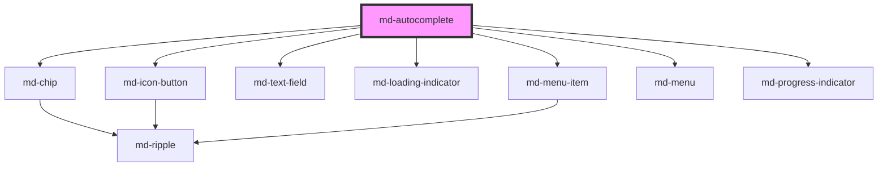

# md-autocomplete

<!-- llm:meta
tag: md-autocomplete
category: text-input
status: custom
m3-guidelines: none — M3 has no autocomplete page
m3-derived-from: https://m3.material.io/components/text-fields/guidelines
reference-parity: https://mui.com/material-ui/react-autocomplete/
form-associated: true
depends-on: md-chip, md-icon-button, md-text-field, md-loading-indicator, md-menu-item, md-menu, md-progress-indicator
used-by: none
accepts-children: md-select-option
-->

**Type to filter, then choose.** A text field with a suggestion listbox: single
or multiple selection, optional free-text values, custom filtering, async
loading, and virtualization for large option sets.

> ⚠️ **Not a Material Design 3 component.** M3 has no autocomplete page; the
> API deliberately mirrors MUI Autocomplete. The Do/Don't table below is house
> rules, informed by M3's menu and text-field guidance.

> Setup, theming, density and i18n are configured once for the whole library —
> see [`main-llm.md`](../../../../../main-llm.md) at the repo root.

---

## When to use

- A long or open-ended option set the user narrows **by typing**: cities,
  users, products, tags.
- Values that may not exist yet, where the user can enter their own
  (`free-solo`).
- Multi-value entry rendered as chips (`multiple`).

## When NOT to use

| Situation | Use instead |
|---|---|
| A short, closed list | `md-select` |
| Several values from a **known** closed list | `md-multi-select` |
| App-wide search with a results surface | `md-search` |
| Plain text with no suggestions | `md-text-field` |
| 2–5 exclusive options | `md-segmented-button-set` / `md-radio` |
| Assigning a subset from a pool | `md-transfer-list` |

## Decision cues

| Need | Setting |
|---|---|
| Options in markup | `md-select-option` children |
| Options from data | `options` property (array in JS, or a JSON-array attribute) |
| Multiple values as chips | `multiple` (+ `chip-position`) |
| Chips inside the field | `chip-position="inline"` |
| Allow values not in the list | `free-solo` |
| Keep a **single**-select menu open across picks | `disable-close-on-select` (`multiple` already stays open) |
| Custom matching logic | `filterer` (function property, client-side path only) |
| Built-in matching strategy for huge lists | `filter-mode` |
| Cap how many suggestions render | `limit-results` |
| Cap how many can be selected | `max-selected` |
| Discard unmatched text on blur | `clear-on-blur` |
| Huge option sets | `virtualize="always"` + `row-height` |

## API contract

```html
<md-autocomplete
  variant="filled|outlined"                 <!-- default: filled -->
  label="City"
  placeholder="Start typing…"
  input-value=""                            <!-- live text in the box -->
  name="city"
  required                                  <!-- default: false -->
  multiple                                  <!-- default: false -->
  chip-position="below|top|left|right|inline"   <!-- default: below -->
  free-solo                                 <!-- default: false -->
  max-selected="0"                          <!-- default: 0 = unlimited -->
  clearable                                 <!-- default: TRUE -->
  clear-icon="close"                        <!-- default: close -->
  dropdown-icon="arrow_drop_down"           <!-- default: arrow_drop_down -->
  clear-on-blur                             <!-- default: false -->
  disable-close-on-select                   <!-- default: false -->
  filter-mode="substring"                   <!-- default: substring -->
  limit-results="0"                         <!-- default: 0 = unlimited -->
  virtualize="auto|always|never"            <!-- default: auto -->
  row-height="48"                           <!-- default: measured from row 1 -->
  placement="bottom-start|bottom-end|top-start|top-end"   <!-- default: bottom-start -->
  match-trigger-width                       <!-- default: true -->
  max-height="320"                          <!-- pixels (number) -->
  loading                                   <!-- default: false -->
  loading-text="Loading…"                   <!-- default: Loading… -->
  no-options-text="No options"              <!-- default: No options -->
  no-results-text="No results"              <!-- default: No results -->
  status-template="{count} suggestions available"
  supporting-text="" error error-text=""
  reserve-supporting-space                  <!-- default: false -->
  value-missing-label="Please make a selection"
  disabled                                  <!-- default: false -->
  soft-disabled                             <!-- default: false -->
  open                                      <!-- default: false -->
  density="-1|-2|-3|-4"                     <!-- default: 0 = uncompacted -->
>
  <md-select-option value="par">Paris</md-select-option>
  <md-select-option value="ber">Berlin</md-select-option>
</md-autocomplete>
```

```js
// value (array form) and filterer are JS properties.
const el = document.querySelector('md-autocomplete');
el.options = cities.map((c) => ({ value: c.id, label: c.name }));
el.value = 'par';                     // string, or string[] when `multiple`
el.filterer = (options, { inputValue }) =>
  options.filter((o) => o.label.toLowerCase().startsWith(inputValue.toLowerCase()));
```

**Events** — `mdInput` (`CustomEvent<string>`, the typed text), `mdChange`
(`string | string[]`, the committed selection), `mdOpen` (`void`), `mdClose`
(`void`), `mdClear` (`void`) — all composed; `mdValidityChange`
(`{ valid, validationMessage, flags }`) bubbles but is **not composed**.

**Methods** — `focusInput()`, `showMenu()`, `closeMenu()`,
`loadOptions(source)`, `getLabels(values)`, `getValidity()`,
`checkValidity()`, `reportValidity()`, `setCustomValidity(message)`. All are
async. There is **no** `setQuery()` here, and no programmatic way to filter:
the query is only what the user typed since the popup opened. Assigning
`el.inputValue = 'par'` changes the visible text but leaves the query empty,
so the list stays unfiltered.

**Slots** — `loader` (replaces the trigger busy spinner) and `dropdown-icon`
(replaces the caret glyph). There is **no default slot**: `md-select-option`
children are read out of the light DOM as data carriers and are never
projected (they are `display: none` anyway).

**Parts** — `field`, `chips`, `chip`, `clear`, `caret`, `menu`, `option`,
`option-selected`, `option-icon`, `loading`, `loading-spinner`,
`loading-progress`. Forwarded out of `md-chip`: `chip-remove`, `chip-label`.
`option-selected` is applied alongside `option` on selected rows.

### Behavioral contract worth knowing

- **`value` and `inputValue` are different things.** `value` is the committed
  selection (a `string`, or `string[]` when `multiple`); `inputValue` is the
  raw text in the box. `mdInput` reports typing, `mdChange` reports selection.
  Typing never uncommits `value`.
- **Two option sources, with a defined winner.** Slotted `md-select-option`
  children take precedence; `options` is only read when there are none.
- `options` accepts the array as a **JS property** or a **JSON array string**
  as an attribute (`options='[{"value":"a","label":"Apple"}]'`). Malformed JSON
  warns on the console and degrades to an empty list. `description` is accepted
  as a legacy alias for `supportingText` on an entry.
- `filterer` and the array form of `value` are **JS properties** — a function
  and an array have no attribute form.
- Unlike `md-select` / `md-multi-select`, this component **ignores the
  `selected` hint** on `md-select-option` children (and the `selected` flag on
  an `options` entry). Set `value` to preselect, and `input-value` for the text
  that should show. Removing a child `md-select-option` at runtime also goes
  unnoticed here — there is no default slot to observe — so drive a shrinking
  option set from `options`.
- `clearable` defaults to **`true`** here (unlike `md-select` /
  `md-multi-select`, where it is `false`).
- Strict single mode (neither `multiple` nor `free-solo`): closing the popup
  snaps `inputValue` back to the committed option's label, or to `''` when
  nothing is committed — typed-but-uncommitted text never lingers.
- `clear-on-blur` only applies in that strict single mode, and only when the
  popup is already closed.
- Reopening the popup shows the **full** list: the filter only counts text
  typed since the popup opened, so a committed value does not filter the list
  down to itself.
- `free-solo` lets `value` hold text that is not in `options`; `Enter` commits
  the trimmed input. The component validates nothing — do it yourself.
- `max-selected="0"` means **unlimited**. When the cap is reached a pick is
  rejected, and the row (which self-toggles on click before the parent
  reconciles) is reverted via the event target.
- `limit-results` caps how many suggestions *render* on the client-side path
  only; matching still scans everything, and the virtualized path ignores it.
- `filterer` is ignored while virtualized — the WASM engine filters by
  `filter-mode` instead.
- `virtualize="auto"` switches to the virtualized path above 200 options. A
  virtualized menu needs a bounded viewport, so `max-height` defaults to `320`
  when unset. While a dataset is packing the component presents the same busy
  UI as `loading`.
- Keyboard: `ArrowDown` / `ArrowUp` open the popup and move **real focus** onto
  the first/last option; typing while an option has focus returns focus to the
  input and extends the query; `Enter` commits a free-solo value; `Escape`
  closes; `Backspace` on an empty `multiple` input removes the last chip.
- `multiple` stays open after each pick and clears the typed text; single mode
  closes unless `disable-close-on-select` is set.
- Flipping `multiple` at runtime reshapes `value` (string ⇄ array) and
  re-publishes the form value.
- `required` is published to the owning form through `ElementInternals`, so an
  empty required control really blocks submission. `error-text`, when set, is
  used as the validation message too. `setCustomValidity(msg)` wins over both;
  clear it with `''`.
- `mdValidityChange` never fires on mount, repeats nothing, and is **not
  composed** — listen on the `md-autocomplete` element itself. `mdOpen` /
  `mdClose` **are** composed, so they also fire on an embedding shadow host.
- **The combobox spans two shadow roots**, and is wired accordingly. The role,
  the expanded state and the typing relationship go to `md-text-field` as props
  — `input-role="combobox"`, `input-expanded`, `input-aria-autocomplete="list"`
  — so they land on the real `<input>`, the element assistive tech reads. The
  listbox is referenced with ARIA **element reflection**
  (`input.ariaControlsElements`), because an IDREF would have to resolve inside
  `md-text-field`'s tree, where the listbox is not. The reference exists only
  while the popup is open and is cleared on close. Where element reflection is
  unavailable you still get the role, a truthful expanded state, and the
  focus-moves-into-the-listbox pattern, which needs no reference at all.
- Automated checkers that read attributes rather than the accessibility tree
  may report `aria-required-attr` while the popup is open, because the
  reflection setter leaves an empty `aria-controls=""` behind. Do **not** "fix"
  it by writing the listbox id into that attribute: doing so clears the element
  reference and trades a real relation for a green checker.

---

## Do / Don't

House rules, informed by
[M3 · Menus · Guidelines](https://m3.material.io/components/menus/guidelines)
and
[M3 · Text fields · Guidelines](https://m3.material.io/components/text-fields/guidelines).

| ✅ Do | ❌ Don't |
|---|---|
| Always set a `label` | Don't use `placeholder` as the label |
| Debounce, or use `loadOptions`, for remote search | Don't fetch on every keystroke unthrottled |
| Show `loading` while suggestions are in flight | Don't leave an empty menu with no explanation |
| Distinguish "no options" from "no results" | Don't reuse one message for both states |
| Use `free-solo` only when arbitrary values are genuinely valid | Don't allow free text into a closed vocabulary |
| Validate free-solo input before saving | Don't trust an unmatched value |
| Cap rendering with `limit-results` on big sets | Don't render thousands of rows unvirtualized |
| Keep option labels short and scannable | Don't put sentences in suggestion rows |
| Localize every text prop | Don't ship the English defaults |
| Swap supporting text for error text | Don't show both |

---

## Patterns

```html
<!-- Options in markup -->
<md-autocomplete label="City" name="city" required>
  <md-select-option value="par">Paris</md-select-option>
  <md-select-option value="ber" supporting-text="Germany">Berlin</md-select-option>
  <md-select-option value="mad">Madrid</md-select-option>
</md-autocomplete>
```

```html
<!-- Remote search, debounced -->
<md-autocomplete id="city" label="City" name="city" required></md-autocomplete>

<script type="module">
  const el = document.getElementById('city');
  el.options = [];

  let t;
  el.addEventListener('mdInput', (e) => {          // typed text
    clearTimeout(t);
    t = setTimeout(async () => {
      el.loading = true;
      el.options = await searchCities(e.detail);
      el.loading = false;
    }, 250);
  });

  el.addEventListener('mdChange', (e) => console.log(e.detail)); // selection
</script>
```

```html
<!-- Multiple values as chips, capped. Multi stays open on every pick; it
     dismisses on an outside click, on the trigger, or on Escape. -->
<md-autocomplete label="Tags" multiple max-selected="5" chip-position="below">
  <md-select-option value="new">New</md-select-option>
  <md-select-option value="urgent">Urgent</md-select-option>
</md-autocomplete>
```

```html
<!-- Free text allowed — validate it yourself -->
<md-autocomplete id="tag" free-solo clear-on-blur label="Tag"></md-autocomplete>

<script type="module">
  const el = document.getElementById('tag');
  const known = new Set(['alpha', 'beta']);
  el.options = [...known].map((v) => ({ value: v, label: v }));

  el.addEventListener('mdChange', (e) => {
    el.setCustomValidity(known.has(e.detail) ? '' : 'Unknown tag');
  });
</script>
```

```html
<!-- Custom matching (prefix instead of substring), client-side path.
     `filterer` runs only while NOT virtualized, so keep the set small
     enough that `virtualize="auto"` stays on the client path (<= 200),
     or pin it with virtualize="never". -->
<md-autocomplete id="users" label="User"
                 virtualize="never" limit-results="50">
</md-autocomplete>

<script type="module">
  const el = document.getElementById('users');
  el.options = await fetchUsers();                 // a few hundred at most
  el.filterer = (opts, { inputValue }) =>
    opts.filter((o) => o.label.toLowerCase().startsWith(inputValue.toLowerCase()));
</script>
```

```html
<!-- Large virtualized set. The WASM engine filters here: `filter-mode`
     picks the matching strategy, and `filterer` / `limit-results` are
     both ignored on this path. -->
<md-autocomplete id="big-users" label="User"
                 virtualize="always" filter-mode="prefix" row-height="48">
</md-autocomplete>

<script type="module">
  const el = document.getElementById('big-users');
  await el.loadOptions(await fetchUsers());        // tens of thousands
</script>
```

## Anti-patterns

| ❌ Wrong | ✅ Right | Why |
|---|---|---|
| Treating `mdInput` as the selection | `mdInput` is typing; `mdChange` is selection | Two distinct signals. |
| Reading `value` to get the typed text | Use `inputValue` | `value` is the committed selection. |
| Setting `inputValue` to filter the list | Filter the data you pass to `options` (or use `filterer` / `filter-mode`) | Only text typed by the user counts as the query; assigning `inputValue` does not filter. |
| `filterer` as an HTML attribute | Assign the function in JS | A function has no attribute form. `options` does have one: a JSON array string. |
| `max-selected="0"` to block selection | `0` = unlimited; use `disabled` | Same trap as `md-multi-select`. |
| `limit-results` as a search limit | It caps **rendering**, on the client-side path only | Matching still scans everything. |
| Expecting `filterer` to run on a virtualized list | Use `filter-mode` | The WASM engine does the filtering there. |
| Unvalidated `free-solo` values | Validate in `mdChange` | The component accepts anything. |
| Fetching on every keystroke | Debounce, or use `loadOptions` | Hammering the backend. |
| Assuming `clearable` is off by default | It defaults to `true` — set `clearable="false"` to hide it | Unlike the selects. |
| Setting `role="combobox"` on the host from outside | It is already a combobox — on the inner input | A role on the host would wrap the real control in a second announcement. |
| Expecting `value` to be an array without `multiple` | It is a string in single mode | The type changes with `multiple`. |
| Supplying `md-select-option` children **and** `options` | Pick one source | Children win outright; the array is silently ignored. |
| Shipping English `no-results-text` etc. | Translate every text prop | They all default to English. |
| Using it for site-wide search | `md-search` | Different surface and semantics. |

## Accessibility, RTL, density, i18n

**Accessibility**
- `label` names the field. The visible suggestion count is announced through a
  polite live region driven by `status-template`; keep `{count}` when
  translating it.
- Arrow keys move focus into the suggestion list, `Enter` commits, `Escape`
  closes. Typing while an option has focus returns to the input.
- The real textbox reports `role="combobox"`, `aria-expanded` and
  `aria-autocomplete="list"`, and controls the listbox through an element
  reference — see the contract note for how that crosses the shadow boundary.
- Chips sit in a labelled `role="group"`; each ✕ is named `Remove {label}`.
- `reserve-supporting-space` avoids a layout jump when errors appear.

**RTL** — field, chips, caret and menu mirror under `dir="rtl"`.
`chip-position="left"` / `"right"` is **physical** — re-check per direction;
`placement` is logical.

**Density** — `density="-1"` … `density="-4"` compacts the field, the chips and
the rows. There is no `density="0"` rung: 0 is the uncompacted default and
setting it does nothing. To opt out of an inherited `data-density` rung, set
`style="--md-sys-density-scale: 0"` on the element — that only resets the
calc-driven scale, not the spacing tokens the ancestor rung declares.

**i18n** — translate `label`, `placeholder`, `supporting-text`, `error-text`,
`no-options-text`, `no-results-text`, `loading-text`, `value-missing-label`,
and `status-template` (keeping `{count}`). Two accessible names are **not**
localizable yet: the clear button's `"Clear value"` and each chip's
`"Remove {label}"` are hard-coded English.

## Related components

`md-select` · `md-multi-select` · `md-select-option` · `md-search` ·
`md-text-field` · `md-chip` · `md-menu` · `md-transfer-list`

## Theming

| Custom property | Purpose | Default |
|---|---|---|
| `--md-autocomplete-width` | Host inline size | `100%` |
| `--md-autocomplete-min-width` | Host minimum inline size | `220px` |
| `--md-autocomplete-chip-gap` | Gap between selection chips | `--md-sys-spacing-gap-xs` (4px) |
| `--md-autocomplete-chip-radius` | Chip corner radius | `8px` |
| `--md-autocomplete-caret-color` | Trailing caret colour | `--md-sys-color-on-surface-variant` |
| `--md-autocomplete-caret-size` | Caret glyph size | `24px` |
| `--md-autocomplete-clear-color` | Clear button colour | `--md-sys-color-on-surface-variant` |
| `--md-autocomplete-option-icon-color` | Suggestion leading-icon colour | `--md-sys-color-on-surface-variant` |
| `--md-autocomplete-option-icon-size` | Suggestion leading-icon size | `20px` |
| `--md-autocomplete-loading-color` | In-menu loading row colour | `--md-sys-color-on-surface-variant` |
| `--md-autocomplete-spinner-size` | Trigger busy-spinner size | `22px` |

**CSS parts** — `field`, `chips`, `chip`, `chip-remove`, `chip-label`, `clear`,
`caret`, `menu`, `option`, `option-selected`, `option-icon`, `loading`,
`loading-spinner`, `loading-progress`.

The composed field, chips and menu also expose their own `--md-text-field-*`,
`--md-chip-*`, `--md-menu-*` and `--md-menu-item-*` properties, which flow
through when set on the host.

```css
md-autocomplete {
  --md-autocomplete-min-width: 320px;
  --md-autocomplete-caret-color: var(--md-sys-color-primary);
}

md-autocomplete::part(option-selected) {
  font-weight: 600;
}
```

<!-- Auto Generated Below -->


## Overview

`md-autocomplete` — Material Design 3 combobox: a text field that filters
a dropdown listbox **as you type in the input** (no separate search row),
with single or multiple (chips) selection.

Built from the same primitives as `md-select` / `md-multi-select`:
  - the shared option model (`options` array of `{ value, label,
    supportingText?, icon?, iconColor?, disabled? }` or slotted
    `<md-select-option>` children),
  - `md-text-field` for the trigger (typing filters live),
  - `md-menu` as a WAI-ARIA listbox popup (options carry `aria-selected`),
  - `VirtualSelectController` for WASM-virtualized huge datasets
    (`virtualize`, `loadOptions()`, `filter-mode`) — the same engine as
    the selects, so tens of thousands of rows filter smoothly.

Keyboard: typing filters; ArrowDown moves focus into the listbox (the
focus-moves-into-popup combobox variant — option focus is announced
directly); Enter selects; Escape closes back to the input; Backspace on an
empty multi input removes the last chip.

ARIA: the real textbox — the `<input>` inside md-text-field's shadow root — is
promoted to `role="combobox"` with `aria-expanded` / `aria-autocomplete`
(handed over via `input-role`, since only that component renders the input),
and points at this component's listbox through ARIA element reflection. An
IDREF could not: it would have to resolve inside md-text-field's tree, where
the listbox is not.

Extras kept from the surface this API mirrors: `free-solo` (commit arbitrary text),
`max-selected`, `clearable`, `disable-close-on-select`, `clear-on-blur`,
a custom `filterer` and `limit-results` (client-side path only).

## Properties

| Property                 | Attribute                  | Description                                                                                                                                                                                                                                | Type                                                                                                                     | Default                           |
| ------------------------ | -------------------------- | ------------------------------------------------------------------------------------------------------------------------------------------------------------------------------------------------------------------------------------------ | ------------------------------------------------------------------------------------------------------------------------ | --------------------------------- |
| `chipPosition`           | `chip-position`            | Where the selection chips live (`multiple` only): around the field (`'below'` default, `'top'`, `'left'`, `'right'`) or `'inline'` inside it, before the input, wrapping onto new rows as the selection grows (the field grows with them). | `"below" \| "inline" \| "left" \| "right" \| "top"`                                                                      | `'below'`                         |
| `clearIcon`              | `clear-icon`               | Material Symbols glyph for the clear button.                                                                                                                                                                                               | `string`                                                                                                                 | `'close'`                         |
| `clearOnBlur`            | `clear-on-blur`            | Clear a non-matching input on blur (strict single mode only).                                                                                                                                                                              | `boolean`                                                                                                                | `false`                           |
| `clearable`              | `clearable`                | Show a clear (×) button on the trailing edge.                                                                                                                                                                                              | `boolean`                                                                                                                | `true`                            |
| `density`                | `density`                  | Density forwarded to the text-field.                                                                                                                                                                                                       | `-1 \| -2 \| -3 \| -4 \| 0`                                                                                              | `0`                               |
| `disableCloseOnSelect`   | `disable-close-on-select`  | Keep the menu open after a selection in **single** mode. `multiple` already stays open — picking several in a row is the point, and it dismisses on an outside click, on the trigger, or on Escape. This prop gives a single-select the same stickiness when a picker is being used to scan rather than to commit.                                                                                                                                                                       | `boolean`                                                                                                                | `false`                           |
| `disabled`               | `disabled`                 | Disabled — non-interactive.                                                                                                                                                                                                                | `boolean`                                                                                                                | `false`                           |
| `dropdownIcon`           | `dropdown-icon`            | Caret glyph; rotates 180° when open (matches md-select). Slot `dropdown-icon` overrides it.                                                                                                                                                | `string`                                                                                                                 | `'arrow_drop_down'`               |
| `error`                  | `error`                    | Error state — forwarded to the text-field.                                                                                                                                                                                                 | `boolean`                                                                                                                | `false`                           |
| `errorText`              | `error-text`               | Error text rendered in place of supporting text when `error` is true.                                                                                                                                                                      | `string`                                                                                                                 | `''`                              |
| `filterMode`             | `filter-mode`              | Filter strategy for the virtualized (WASM) path.                                                                                                                                                                                           | `"fuzzy" \| "prefix" \| "substring"`                                                                                     | `'substring'`                     |
| `filterer`               | --                         | Custom client-side filter (ignored while virtualized — the WASM engine filters by `filter-mode` instead).                                                                                                                                  | `((options: SelectOptionData[], state: { inputValue: string; selected: string[]; }) => SelectOptionData[]) \| undefined` | `undefined`                       |
| `freeSolo`               | `free-solo`                | Allow committing arbitrary text (not just options) with Enter.                                                                                                                                                                             | `boolean`                                                                                                                | `false`                           |
| `inputValue`             | `input-value`              | Live text of the input (separate from `value` so typing never commits).                                                                                                                                                                    | `string`                                                                                                                 | `''`                              |
| `label`                  | `label`                    | Floating label / accessible name.                                                                                                                                                                                                          | `string`                                                                                                                 | `''`                              |
| `limitResults`           | `limit-results`            | Max items shown in the dropdown (`0` = unlimited; client-side path only).                                                                                                                                                                  | `number`                                                                                                                 | `0`                               |
| `loading`                | `loading`                  | Busy state: progress bar in the menu while an async dataset loads.                                                                                                                                                                         | `boolean`                                                                                                                | `false`                           |
| `loadingText`            | `loading-text`             | Text shown while `loading` is true.                                                                                                                                                                                                        | `string`                                                                                                                 | `'Loading…'`                      |
| `matchTriggerWidth`      | `match-trigger-width`      | Match the dropdown width to the trigger.                                                                                                                                                                                                   | `boolean`                                                                                                                | `true`                            |
| `maxHeight`              | `max-height`               | Max height of the dropdown menu (px).                                                                                                                                                                                                      | `number \| undefined`                                                                                                    | `undefined`                       |
| `maxSelected`            | `max-selected`             | When `multiple`, the max number of selected items (`0` = no limit).                                                                                                                                                                        | `number`                                                                                                                 | `0`                               |
| `multiple`               | `multiple`                 | Multi-select mode — the selection renders as removable chips.                                                                                                                                                                              | `boolean`                                                                                                                | `false`                           |
| `name`                   | `name`                     | Form name. Multi-mode submits as repeated `name=value` pairs.                                                                                                                                                                              | `string`                                                                                                                 | `''`                              |
| `noOptionsText`          | `no-options-text`          | Empty-state text when the dataset has no options at all.                                                                                                                                                                                   | `string`                                                                                                                 | `'No options'`                    |
| `noResultsText`          | `no-results-text`          | Empty-state text when the typed filter matches nothing.                                                                                                                                                                                    | `string`                                                                                                                 | `'No results'`                    |
| `open`                   | `open`                     | Open state.                                                                                                                                                                                                                                | `boolean`                                                                                                                | `false`                           |
| `options`                | `options`                  | Programmatic options (shared select model; `description` is accepted as a legacy alias for `supportingText`). Slotted `<md-select-option>` children take precedence when present. Also accepts a **JSON array string** as an attribute — `options='[{"value":"a","label":"Apple"}]'` — so a plain-HTML page needs no script; malformed JSON degrades to an empty list rather than throwing. | `MdAutocompleteOption[] \| string`                                                                                       | `[]`                              |
| `placeholder`            | `placeholder`              | Placeholder for the input.                                                                                                                                                                                                                 | `string`                                                                                                                 | `''`                              |
| `placement`              | `placement`                | Menu placement.                                                                                                                                                                                                                            | `"bottom-end" \| "bottom-start" \| "top-end" \| "top-start"`                                                             | `'bottom-start'`                  |
| `required`               | `required`                 | Required for native form parity.                                                                                                                                                                                                           | `boolean`                                                                                                                | `false`                           |
| `reserveSupportingSpace` | `reserve-supporting-space` | Always occupy the supporting-text line, even when there is no message, so a validation error does not push the content below it down. Forwarded to the embedded md-text-field. See that component for why it is opt-in.                    | `boolean`                                                                                                                | `false`                           |
| `rowHeight`              | `row-height`               | Fixed virtualized row height (px). Auto-measured from the first row if unset.                                                                                                                                                              | `number \| undefined`                                                                                                    | `undefined`                       |
| `softDisabled`           | `soft-disabled`            | Soft-disabled — focusable but non-interactive.                                                                                                                                                                                             | `boolean`                                                                                                                | `false`                           |
| `statusTemplate`         | `status-template`          | Template for the polite screen-reader status while the popup is open (localisable). `{count}` is replaced with the visible option count.                                                                                                   | `string`                                                                                                                 | `'{count} suggestions available'` |
| `supportingText`         | `supporting-text`          | Supporting / helper text below the field.                                                                                                                                                                                                  | `string`                                                                                                                 | `''`                              |
| `value`                  | `value`                    | Single-mode value — option `value` or free-solo string. Multi-mode value — array of option `value`s.                                                                                                                                       | `string \| string[]`                                                                                                     | `''`                              |
| `valueMissingLabel`      | `value-missing-label`      | Localized constraint-validation message shown when `required` is unmet. `errorText` still wins when set, so an app-supplied inline message and the native bubble stay in agreement.                                                        | `string`                                                                                                                 | `'Please make a selection'`       |
| `variant`                | `variant`                  | Visual variant of the inner text-field.                                                                                                                                                                                                    | `"filled" \| "outlined"`                                                                                                 | `'filled'`                        |
| `virtualize`             | `virtualize`               | Virtualization strategy (same engine as `md-select`):   - `'auto'` (default): virtualize above 200 rows.   - `'always'`: always virtualize the `options` / `loadOptions` dataset.   - `'never'`: plain DOM rendering.                      | `"always" \| "auto" \| "never"`                                                                                          | `'auto'`                          |


## Events

| Event              | Description                                                                                                                                                                                                                                                                                                                                                                                                                                                                                                                                                              | Type                                                                                          |
| ------------------ | ------------------------------------------------------------------------------------------------------------------------------------------------------------------------------------------------------------------------------------------------------------------------------------------------------------------------------------------------------------------------------------------------------------------------------------------------------------------------------------------------------------------------------------------------------------------------ | --------------------------------------------------------------------------------------------- |
| `mdChange`         | Fires whenever the committed selection changes.                                                                                                                                                                                                                                                                                                                                                                                                                                                                                                                          | `CustomEvent<string \| string[]>`                                                             |
| `mdClear`          | Fires when the user clears the value.                                                                                                                                                                                                                                                                                                                                                                                                                                                                                                                                    | `CustomEvent<void>`                                                                           |
| `mdClose`          | Fires when the menu closes.                                                                                                                                                                                                                                                                                                                                                                                                                                                                                                                                              | `CustomEvent<void>`                                                                           |
| `mdInput`          | Fires whenever the live input string changes.                                                                                                                                                                                                                                                                                                                                                                                                                                                                                                                            | `CustomEvent<string>`                                                                         |
| `mdOpen`           | Fires when the menu opens.                                                                                                                                                                                                                                                                                                                                                                                                                                                                                                                                               | `CustomEvent<void>`                                                                           |
| `mdValidityChange` | Fires when this control's validity CHANGES — never on every keystroke, and never for a re-publish that lands on the same state.  `composed: false` is deliberate. Composites like md-select embed an md-text-field, and a composed event escapes that inner shadow root, so a listener on md-select would receive the inner field's event as well as the host's — two events, different payloads, for one logical control. Keeping it uncomposed means each component reports only for itself, while `bubbles: true` still lets a <form> or app root hear every control. | `CustomEvent<{ valid: boolean; validationMessage: string; flags: Record<string, boolean>; }>` |


## Methods

### `checkValidity() => Promise<boolean>`

Constraint-validation API, matching md-text-field and the native contract.
Validity was already published to the form here, but with no public method
a consumer could not ASK this control whether it was valid.

#### Returns

Type: `Promise<boolean>`


### `closeMenu() => Promise<void>`

Close the menu.

#### Returns

Type: `Promise<void>`


### `focusInput() => Promise<void>`

Programmatically focus the input.

#### Returns

Type: `Promise<void>`


### `getLabels(values: string[]) => Promise<Record<string, string>>`

Resolve labels for a set of values (virtual-safe).

#### Parameters

| Name     | Type       | Description |
| -------- | ---------- | ----------- |
| `values` | `string[]` |             |

#### Returns

Type: `Promise<Record<string, string>>`


### `getValidity() => Promise<{ valid: boolean; validationMessage: string; flags: Record<string, boolean>; }>`

Current validity: boolean, message and flags. Mirrors md-text-field.

#### Returns

Type: `Promise<{ valid: boolean; validationMessage: string; flags: Record<string, boolean>; }>`


### `loadOptions(source: SelectOptionInit[] | OptionRowSource) => Promise<void>`

Load a large dataset into the WASM-backed virtualized list (rows are
byte-packed off the JS heap). Accepts an array or a `{ count, getRow }`
factory. Falls back to plain DOM when `virtualize="never"` or WASM is
unavailable.

#### Parameters

| Name     | Type                                    | Description |
| -------- | --------------------------------------- | ----------- |
| `source` | `OptionRowSource \| SelectOptionInit[]` |             |

#### Returns

Type: `Promise<void>`


### `reportValidity() => Promise<boolean>`


#### Returns

Type: `Promise<boolean>`


### `setCustomValidity(message: string) => Promise<void>`


#### Parameters

| Name      | Type     | Description |
| --------- | -------- | ----------- |
| `message` | `string` |             |

#### Returns

Type: `Promise<void>`


### `showMenu() => Promise<void>`

Open the menu.

#### Returns

Type: `Promise<void>`


## Shadow Parts

| Part                 | Description |
| -------------------- | ----------- |
| `"caret"`            |             |
| `"chip"`             |             |
| `"chips"`            |             |
| `"clear"`            |             |
| `"field"`            |             |
| `"loading"`          |             |
| `"loading-progress"` |             |
| `"loading-spinner"`  |             |
| `"menu"`             |             |
| `"option-icon"`      |             |


## Dependencies

### Depends on

- [md-chip](../md-chip)
- [md-icon-button](../md-icon-button)
- [md-text-field](../md-text-field)
- [md-loading-indicator](../md-loading-indicator)
- [md-menu-item](../md-menu-item)
- [md-menu](../md-menu)
- [md-progress-indicator](../md-progress-indicator)

### Graph


----------------------------------------------

*Built with [StencilJS](https://stenciljs.com/)*
