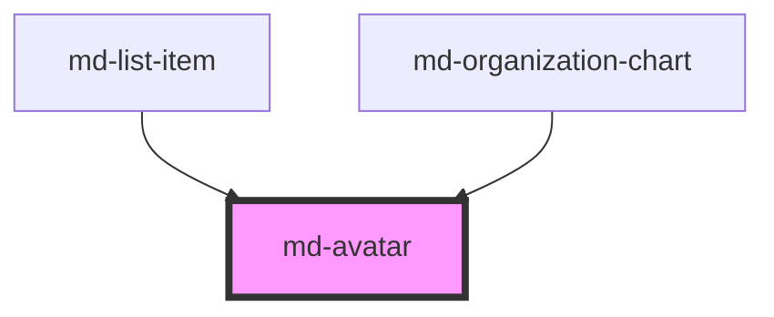

# md-avatar

<!-- llm:meta
tag: md-avatar
category: status
status: custom
m3-guidelines: none — M3 has no avatar page
form-associated: false
depends-on: none
used-by: md-list-item, md-organization-chart
-->

**A person or entity, as an image, initials, or a fallback glyph.**
It resolves one source from a fixed chain — image, then initials, then slotted
content, then a `person` icon — with a deterministic container colour hashed
from the identity.

> ⚠️ **Not a Material Design 3 component.** M3 has no avatar page, so the
> Do/Don't table below is house rules rather than sourced guidance.

> Setup, theming, density and i18n are configured once for the whole library —
> see [`main-llm.md`](../../../../../main-llm.md) at the repo root.

---

## When to use

- Representing a **person, team, or organisation** in a list, table, comment,
  app bar, or org chart.
- Anywhere a photo may be missing and initials should stand in.

## When NOT to use

| Situation | Use instead |
|---|---|
| A decorative or content image | `` |
| An icon-only action | `md-icon-button` |
| A removable person token | `md-chip variant="input"` |
| Presence state on its own | `md-status-dot` |
| A count marker | `md-badge` |
| A logo in an app bar | Plain `` in the `md-app-bar` slot |

## Decision cues

| Need | Setting |
|---|---|
| Photo | `src` (+ `alt`) |
| Initials from a full name | `name="Ada Lovelace"` → `AL` |
| Explicit initials | `initials="AL"` (bypasses `name` parsing) |
| Fixed preset size | `size="small\|medium\|large"` (24 / 40 / 56 px) |
| Arbitrary size | `size="72"` (unitless → px), `size="4rem"`, `size="clamp(28px,4vw,72px)"` |
| Squared corners | `shape="rounded"` (12px) or `shape="square"` (0) |
| One neutral colour instead of a name-derived tint | `color-from-name="false"` |
| Above-the-fold images | `loading="eager"` |
| Cross-origin images you read from a canvas | `crossorigin="anonymous"` |
| Custom fallback content (emoji, SVG, icon) | default slot, with `src` and `initials`/`name` all empty |

## API contract

```html
<md-avatar
  src="/u/ada.jpg"                       <!-- default: "" -->
  alt="Ada Lovelace"                     <!-- default: "" — describes the image -->
  name="Ada Lovelace"                    <!-- default: "" — initials are derived -->
  initials="AL"                          <!-- default: "" — overrides name parsing -->
  size="small|medium|large|72|4rem"      <!-- default: medium -->
  shape="circle|rounded|square"          <!-- default: circle -->
  label="Ada Lovelace"                   <!-- default: "" — accessible name -->
  color-from-name="true|false"           <!-- default: true -->
  loading="lazy|eager"                   <!-- default: lazy -->
  crossorigin="anonymous|use-credentials"<!-- default: "" (attribute omitted) -->
  density="-1|-2|-3|-4"                  <!-- default: 0 (uncompacted) -->
></md-avatar>
```

**Events** — `mdLoad` `{ src }` when the `` loads, `mdError` `{ src }`
when it fails. Both are Stencil defaults: they bubble and are composed.

**Methods** — none.

**Slots** — `(default)`: the **fourth** step of the five-step fallback chain.
Rendered only when there is no usable image **and** no initials. Slotted content does
not replace an image or initials.

**Parts** — `image` (the ``), `initials` (the letters), `icon` (the
built-in `person` glyph). Exactly one exists at a time.

### Behavioral contract worth knowing

- **Fallback chain, in order:** `src` (while it loads) → `initials` → initials
  derived from `name` → default slot → built-in `person` icon. An image that
  404s emits `mdError` and falls through automatically, so you don't need your
  own `onerror` handler. Changing `src` resets the failure flag and retries.
- **The component owns `role`, `aria-label` and `aria-hidden` on the host.**
  When `label`, `alt` or `name` is non-empty (checked in that order) it renders
  `role="img"` + `aria-label`. When all three are empty it renders
  `role="presentation"` + `aria-hidden="true"`. Attributes you set yourself are
  removed on the next render.
- Therefore, to make an avatar **decorative**, leave `label`, `alt` and `name`
  empty and use `initials` for the letters — adding your own `aria-hidden` does
  not work.
- The inner `` is always `aria-hidden="true"` and `draggable="false"`;
  `alt` reaches AT through the host's `aria-label`, not through the image.
- `size` is **not** a closed enum. The three presets get autocomplete, any CSS
  length passes through, and a bare number is treated as pixels. A non-preset
  value is written to `--md-avatar-size` as an inline style on the host, so a
  stylesheet rule setting the same property still wins.
- Preset sizes are density-aware (`medium` is `max(28px, 40px + density × 3px)`);
  a custom `size` is a fixed length and ignores density entirely.
- `color-from-name` (default **on**) hashes `initials || name || label` into one
  of seven tonal palette slots, so the same person keeps the same colour across
  sessions and devices. With no seed, or with `color-from-name="false"`, the
  neutral surface tone is used. The palette applies to initials/slot/icon modes
  only — never over an image.
- Initials are cut to the first **3 grapheme clusters** and upper-cased with
  `toLocaleUpperCase()`. Derivation from `name` takes the first letter of the
  first and last whitespace-separated token (`"Ada Lovelace"` → `AL`,
  `"Cher"` → `C`).

---

## Do / Don't

House rules — no M3 avatar page exists.

| ✅ Do | ❌ Don't |
|---|---|
| Provide `name` even when you have `src` | Don't leave the fallback blank if the image fails |
| Give a meaningful `label` when the avatar is the only identifier | Don't repeat the name when it is already adjacent text — leave `label`/`alt`/`name` empty instead |
| Keep `color-from-name` on for recognisability | Don't randomise colours per render — the hash is the point |
| Use `loading="lazy"` in long lists | Don't eager-load a hundred avatars |
| Use presets for consistency | Don't scatter arbitrary sizes without a reason |
| Wrap in a `position: relative` element when attaching `md-status-dot` or `md-badge` | Don't expect the marker to place itself otherwise |
| Use `shape="circle"` for people | Don't mix shapes for the same entity type |
| Set `crossorigin` for CDN images you read from a canvas | Don't ignore CORS and get a tainted canvas |

---

## Patterns

```html
<!-- Photo with initials fallback -->
<md-avatar src="/u/ada.jpg" alt="Ada Lovelace" name="Ada Lovelace"></md-avatar>

<!-- Initials only -->
<md-avatar name="Grace Hopper" size="large"></md-avatar>

<!-- Explicit initials, squared corners -->
<md-avatar initials="AC" shape="rounded" label="Acme Corp"></md-avatar>

<!-- Custom sizes: unitless is px, any CSS length passes through -->
<md-avatar name="Ada" size="72"></md-avatar>
<md-avatar name="Ada" size="clamp(28px, 4vw, 72px)"></md-avatar>

<!-- Neutral tone instead of the name-derived tint -->
<md-avatar name="Ada Lovelace" color-from-name="false"></md-avatar>
```

```html
<!-- Custom fallback: the default slot only renders with no image and no initials -->
<md-avatar label="Team Nebula">
  <span>🚀</span>
</md-avatar>
```

```html
<!-- Presence marker: the wrapper supplies the positioning context -->
<span style="position: relative; display: inline-block;">
  <md-avatar name="Ada Lovelace"></md-avatar>
  <md-status-dot state="online" label="Online"></md-status-dot>
</span>
```

```html
<!-- Decorative: the row already says the name, so leave label/alt/name empty -->
<md-list label="Team">
  <md-list-item headline="Ada Lovelace">
    <md-avatar slot="leading" initials="AL"></md-avatar>
  </md-list-item>
</md-list>
```

```js
const avatar = document.querySelector('md-avatar');
avatar.addEventListener('mdError', (e) => console.warn('avatar failed', e.detail.src));
avatar.addEventListener('mdLoad', (e) => console.log('avatar loaded', e.detail.src));
```

## Anti-patterns

| ❌ Wrong | ✅ Right | Why |
|---|---|---|
| Your own `onerror` fallback on a wrapper | Rely on the built-in chain | It already falls back and emits `mdError`. |
| `<md-avatar src>` with no `name`/`initials` | Provide a fallback identity | A failed image leaves a generic `person` glyph. |
| `aria-hidden="true"` on an avatar that has a `name` | Leave `label`/`alt`/`name` empty and pass `initials` | The component rewrites `aria-hidden` on every render. |
| Slotting an emoji next to `name="Ada"` and expecting to see it | Clear `name`/`initials` first | The default slot renders only when there are no initials and no image. |
| Randomising the palette per render | Let `color-from-name` hash it | Consistency is the feature. |
| Assuming `size` only takes three values | Any CSS length works | It is an open type. |
| `size="72px"` vs `size="72"` | Both work — unitless means px | No need to guess. |
| Eager-loading a long list | `loading="lazy"` | It is the default for a reason. |
| Expecting `alt` to reach the `` | `alt` becomes the host's `aria-label` | The inner image is always `aria-hidden`. |
| Nesting an avatar inside a button for an action | Use `md-icon-button`, or make the row interactive | Avatars aren't controls and are never focusable. |
| Expecting a custom `size` to shrink under `data-density` | Use a preset, or scale the length yourself | Only the presets read `--md-sys-density-scale`. |

## Accessibility, RTL, density, i18n

**Accessibility**
- Decide deliberately: either the avatar **carries** the identity (set `label`,
  or rely on `alt`/`name`) or it is **decorative** (all three empty, letters via
  `initials`). The component picks `role="img"` or `role="presentation"` from
  that choice — you cannot override it with your own ARIA.
- Beside a name that is already in the text, choose the decorative form so the
  name isn't announced twice.
- The initials palette pairs container and label tokens from the same tonal
  family, so contrast holds; custom container colours need checking.
- The avatar is never focusable. If the whole row is interactive, put the
  affordance on the row.

**RTL** — the avatar is symmetric and needs nothing.

**Density** — `density="-1…-4"` (or an inherited `data-density` rung) shrinks
the three preset sizes through `--md-sys-density-scale`; label and icon sizes
follow because they are `calc()`ed from the box. Rung `0` is the uncompacted
default and has no rule of its own. To pin one instance back to full size under
a global rung, set `style="--md-sys-density-scale: 0"` on it. A custom `size`
length is unaffected either way.

**i18n** — initials are derived with `Intl.Segmenter` grapheme segmentation
when available, so non-Latin scripts, diacritics and emoji survive intact. The
first-and-last-token heuristic still assumes a Western name order — pass
`initials` explicitly for locales where it doesn't hold (CJK in particular).

## Related components

`md-status-dot` · `md-badge` · `md-chip` · `md-list-item` ·
`md-organization-chart` · `md-app-bar`

## Theming

| Custom property | Purpose | Default |
|---|---|---|
| `--md-avatar-size` | Box size (also where a non-preset `size` is written) | `max(28px, 40px + density × 3px)` (`medium`) |
| `--md-avatar-container-color` | Container fill when no palette applies | `--md-sys-color-surface-container-highest` |
| `--md-avatar-container-shape` | Corner radius | `50%` / `12px` / `0` per `shape` |
| `--md-avatar-label-color` | Initials colour | `--md-sys-color-on-surface-variant` |
| `--md-avatar-label-font-family` | Initials font | `--md-sys-typescale-title-medium-font-family` |
| `--md-avatar-label-font-size` | Initials size | `calc(size × 0.4)` |
| `--md-avatar-label-font-weight` | Initials weight | `--md-sys-typescale-title-medium-font-weight` |
| `--md-avatar-label-letter-spacing` | Initials tracking | `0.05em` |
| `--md-avatar-icon-size` | Fallback glyph box | `calc(size × 0.6)` |
| `--md-avatar-outline-color` | Ring colour | `transparent` |
| `--md-avatar-outline-width` | Ring width (inset, so it doesn't grow the box) | `0` |
| `--md-avatar-palette-1-container` … `-7-container` | Name-derived container tints | M3 container roles |
| `--md-avatar-palette-1-label` … `-7-label` | Matching label tints | M3 on-container roles |

**CSS parts** — `image`, `initials`, `icon`.

```css
md-avatar.ringed {
  --md-avatar-outline-color: var(--md-sys-color-outline);
  --md-avatar-outline-width: 2px;
}
```

<!-- Auto Generated Below -->


## Overview

`md-avatar` — a presentational identity tile that resolves the first
available source from a clear fallback chain:

  1. `src` (image)  → `` is rendered.
     On error/empty, automatically falls through to step 2.
  2. `initials`     → explicit initials string (verbatim, max 3 chars).
  3. `name`         → auto-derived initials. Two tokens → first letter
                      of each; one token → first letter only. RTL- and
                      diacritic-safe via `Intl.Segmenter` when available.
  4. default slot   → caller-provided fallback (icon, emoji, SVG).
  5. person icon    → material-symbols fallback (always available).

## Properties

| Property        | Attribute         | Description                                                                                                                                                                                                                                                                                                                                                                                                                                                                                                                                                 | Type                                            | Default    |
| --------------- | ----------------- | ----------------------------------------------------------------------------------------------------------------------------------------------------------------------------------------------------------------------------------------------------------------------------------------------------------------------------------------------------------------------------------------------------------------------------------------------------------------------------------------------------------------------------------------------------------- | ----------------------------------------------- | ---------- |
| `alt`           | `alt`             | Alternative text for the image. When empty, the image is exposed to AT as decorative (`aria-hidden`); the host carries the accessible label instead (see `label`).                                                                                                                                                                                                                                                                                                                                                                                          | `string`                                        | `''`       |
| `colorFromName` | `color-from-name` | When `true` the avatar background is deterministically picked from a tonal palette using the initials/name as a hash seed. When `false`, the avatar uses the neutral on-surface tone.                                                                                                                                                                                                                                                                                                                                                                       | `boolean`                                       | `true`     |
| `crossorigin`   | `crossorigin`     | `` `crossorigin` attribute (forwarded only when set).                                                                                                                                                                                                                                                                                                                                                                                                                                                                                                  | `"" \| "anonymous" \| "use-credentials"`        | `''`       |
| `density`       | `density`         | Local density rung. Drives the same `--md-sys-density-scale` signal that a global `data-density` ancestor sets, so a local value simply overrides the inherited one. 0 = default, -4 = ultra-compact.                                                                                                                                                                                                                                                                                                                                                       | `-1 \| -2 \| -3 \| -4 \| 0`                     | `0`        |
| `initials`      | `initials`        | Explicit initials override. Bypasses the `name` parsing entirely. Truncated to the first 3 grapheme clusters at render time so a stray "WXYZ" can't blow out the layout.                                                                                                                                                                                                                                                                                                                                                                                    | `string`                                        | `''`       |
| `label`         | `label`           | Accessible label for the avatar. When empty:   - if `alt` is set, that is exposed instead   - if `name` is set, that is exposed instead   - otherwise the avatar is hidden from AT (`role="presentation"`)     so it doesn't add noise next to a labelled control.                                                                                                                                                                                                                                                                                          | `string`                                        | `''`       |
| `loading`       | `loading`         | `` `loading` attribute.                                                                                                                                                                                                                                                                                                                                                                                                                                                                                                                                | `"eager" \| "lazy"`                             | `'lazy'`   |
| `name`          | `name`            | Full name. The component derives initials automatically:   - `"Ada Lovelace"` → `"AL"`   - `"Cher"`         → `"C"`   - `"  john   doe"` → `"JD"`  Honored only when `src` is not set (or fails to load) and `initials` is empty.                                                                                                                                                                                                                                                                                                                           | `string`                                        | `''`       |
| `shape`         | `shape`           | Container shape. - `circle`  — fully rounded (`50%`)             [default] - `rounded` — `--md-sys-shape-corner-medium` (12px) - `square`  — sharp corners (`0`)                                                                                                                                                                                                                                                                                                                                                                                            | `"circle" \| "rounded" \| "square"`             | `'circle'` |
| `size`          | `size`            | Avatar size. Accepts either a named preset or any CSS length.  Presets: - `small`   — 24×24 (typography: label-medium) - `medium`  — 40×40 (typography: title-medium)  [default] - `large`   — 56×56 (typography: title-large)  Custom values: - Unitless number → pixels (`size="72"` → 72px) - Any CSS length  → passes through (`size="4rem"`, `size="10vw"`,   `size="clamp(28px, 4vw, 72px)"`)  Custom values are wired through the existing `--md-avatar-size` CSS custom property, so per-instance overrides via `style` / class still win when set. | `"large" \| "medium" \| "small" \| string & {}` | `'medium'` |
| `src`           | `src`             | Image URL. When set, the avatar renders as an `` element.                                                                                                                                                                                                                                                                                                                                                                                                                                                                                              | `string`                                        | `''`       |


## Events

| Event     | Description                                                  | Type                            |
| --------- | ------------------------------------------------------------ | ------------------------------- |
| `mdError` | Image failed to load — component fell back to initials/icon. | `CustomEvent<{ src: string; }>` |
| `mdLoad`  | Image successfully loaded.                                   | `CustomEvent<{ src: string; }>` |


## Shadow Parts

| Part         | Description |
| ------------ | ----------- |
| `"icon"`     |             |
| `"image"`    |             |
| `"initials"` |             |


## Dependencies

### Used by

 - [md-list-item](../md-list-item)
 - [md-organization-chart](../md-organization-chart)

### Graph


----------------------------------------------

*Built with [StencilJS](https://stenciljs.com/)*
