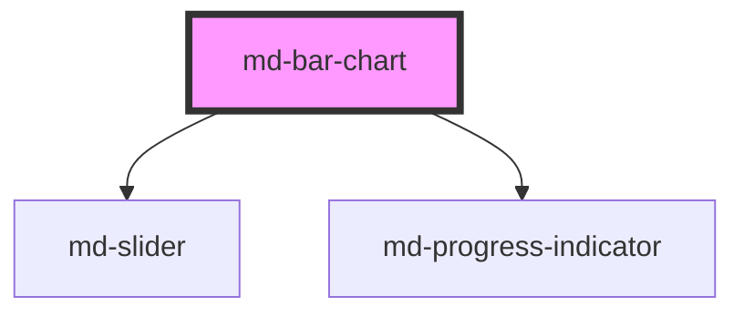

# md-bar-chart

<!-- llm:meta
tag: md-bar-chart
category: charts
status: custom
m3-guidelines: none — M3 has no chart components
form-associated: false
depends-on: md-slider, md-progress-indicator
used-by: none
engine: in-house Canvas2D + DOM overlay (utils/charts/engine)
-->

**Compare values across categories.** Vertical or horizontal bars, grouped or
stacked, with legend, tooltips, zoom, drill-down, a polar (radial) mode and an
expressive entrance animation.

> ⚠️ **Not a Material Design 3 component.** M3 ships no charts. The rendering
> engine is **in-house Canvas2D with a DOM overlay** (`utils/charts/engine`) —
> not a third-party charting library, whatever the dependency tree suggests.

> Setup, theming, density and i18n are configured once for the whole library —
> see [`main-llm.md`](../../../../../main-llm.md), the library-wide guide that ships
> alongside these component docs.

---

## When to use

- **Comparing magnitudes across categories**: revenue by region, count by
  status.
- Part-to-whole across categories (`stack="normal"` / `"percentage"`).
- Ranked comparisons with long category names (`layout="horizontal"`).

## When NOT to use

| Situation | Use instead |
|---|---|
| A trend over time | `md-line-chart` |
| Trend plus cumulative volume | `md-area-chart` |
| Parts of a single whole (≤ ~6) | `md-pie-chart` |
| An inline micro-trend | `md-sparkline` |
| Two or three numbers | Plain text |
| A hierarchy of nodes | `md-organization-chart` |

## Decision cues

| Need | Setting |
|---|---|
| Long category labels | `layout="horizontal"` |
| Compare composition | `stack="normal"` |
| Compare share | `stack="percentage"` |
| Values on the bars | `show-labels` |
| Stack totals past the column end | `show-totals` (stacked only) |
| Explore a long series | `zoom="inside\|slider\|both"` |
| Radial bars | `polar` (+ `polar-hole`, `polar-sweep`) |
| A second value scale | `yAxis2` (JS property) + `series[].yAxisIndex = 1` |
| One colour per bar, not per series | `series[].pointColors` (JS property) |
| Column width carries a second variable | `series[].pointWidths` (JS property) |
| Click-through | `clickable` (+ `mdBarClick`) |
| Data still loading | `loading` (+ `loading-label`) |
| Reduced motion | `no-animation`, or `animation="none"` |

## API contract

```html
<md-bar-chart
  label="Revenue by region"
  subtitle="FY26"
  title-align="start|center|end"                 <!-- default: start -->
  layout="vertical|horizontal"                   <!-- default: vertical -->
  stack="none|normal|percentage"                 <!-- default: none -->
  category-gap="30%"                             <!-- default: 30% -->
  bar-gap="20%"                                  <!-- default: 20% -->
  bar-width="24"                                 <!-- default: auto (fills the slot) -->
  corner-radius="6"                              <!-- default: 6 -->
  legend="top|bottom|left|right|top-start|top-end|bottom-start|bottom-end|none"
                                                 <!-- default: top-end -->
  tooltip="axis|item|none"                       <!-- default: axis; only "none" differs — see below -->
  zoom="none|inside|slider|both"                 <!-- default: none -->
  show-labels                                    <!-- default: off -->
  show-totals                                    <!-- default: off -->
  axis-ticks                                     <!-- default: off -->
  chevron                                        <!-- default: off -->
  clickable                                      <!-- default: off -->
  polar                                          <!-- default: off -->
  polar-hole="0.22"                              <!-- default: 0.22, clamped 0–0.9 -->
  polar-sweep="0.75"                             <!-- default: 0.75, clamped 0.1–1 -->
  locale="en-US"                                 <!-- default: "" (browser locale) -->
  height="320px"                                 <!-- default: aspect-ratio driven -->
  animation="expressive|grow|fade|draw|stagger|none"   <!-- default: expressive -->
  animation-duration="700"                       <!-- default: engine default -->
  no-animation                                   <!-- default: off -->
  loading                                        <!-- default: off -->
  loading-label="Loading chart…"
  label-plot="Chart data. Use the arrow keys to move between points, Home and End for the first and last, Escape to leave."
  label-point="%x%: %values%"
  label-zoom-start="Zoom range start"
  label-zoom-end="Zoom range end"
  density="-1|-2|-3|-4"                          <!-- default: 0 (uncompacted) -->
></md-bar-chart>
```

Objects, arrays and functions have no attribute form — set them as JS
properties:

```js
const chart = document.querySelector('md-bar-chart');

chart.series = [{ label: 'Revenue', data: [12, 19, 7] }];   // MdChartSeries[]
chart.xAxis  = { data: ['North', 'South', 'East'] };        // category axis
chart.yAxis  = { label: 'USD (m)', min: 0 };                // value axis
chart.yAxis2 = { label: 'Rate', position: 'right' };        // second value axis
chart.valueFormatter = (v) =>
  new Intl.NumberFormat('en-US', { style: 'currency', currency: 'USD' }).format(v ?? 0);
chart.tooltipRenderer = (ctx) => `${ctx.axisLabel}: ${ctx.series.length} series`;
```

**Events** — `mdBarClick` (`MdChartClickDetail`), `mdLegendClick`
(`{ seriesIndex, seriesId?, selected }`), `mdHover` (`MdChartHoverDetail`,
throttled to one per frame), `mdZoom` (`{ startIndex, endIndex, reset }`),
`mdReady` (fires once the first frame has drawn). All are the Stencil default —
they bubble and cross shadow boundaries.

**Methods** — `resize()`, `replay()`, `drill(index, direction?)`,
`toDataURL()`, `getInstance()`, `setZoom(startIndex, endIndex)`, `resetZoom()`.
All are async.

**Slots** — `header` (above the plot), `footer` (below it), `empty` (replaces
the built-in "No data to display"), and `loader` (replaces the built-in
spinner; `loading` is the older alias for the same slot — `loader` wins if both
are filled).

**Parts** — `header`, `canvas`, `empty`, `loading`, `footer`, `zoom`,
`zoom-slider`, `zoom-pan`, `zoom-band`, plus `zoom-track` / `zoom-window` /
`zoom-handle` forwarded from the inner `md-slider`. The engine additionally
marks the `<canvas>` as `plot-canvas` and the DOM overlay's legend and hover
card as `legend` and `tooltip`.

### Behavioral contract worth knowing

- **`series`, `xAxis`, `yAxis`, `yAxis2`, `valueFormatter` and
  `tooltipRenderer` are JS properties** — objects and functions never cross the
  attribute boundary.
- **Prop changes are batched.** A burst of assignments (`series` + `xAxis` +
  `yAxis` in one go) rebuilds and repaints once, on the next microtask, not once
  per property.
- **`bar-width` is auto by default** — the bar fills its slot (the band minus
  the category/bar gaps). A fixed width is centred in the slot and clamped to
  it, so it can never overrun a neighbour.
- **`show-totals` is stacked-only** — an unstacked bar already is its total.
- **`tooltip` is a two-state switch here.** `none` turns the hover card off;
  `axis` and `item` both render the axis-style card, because this component
  never forwards the trigger to the engine. (`md-line-chart` and
  `md-area-chart` *do* — there `item` gives a single-series card.)
- **Zoom is a view, not a mutation.** `series` / `xAxis` are never rewritten;
  the engine is fed the sliced window and every index reported by `mdHover`,
  `mdBarClick` and the keyboard cursor is rebased to your **absolute** data
  index. `setZoom()` takes absolute **indices**, not fractions. Zoom gestures
  are ignored while `polar` is set (a ring has no linear span). For a
  *value*-range zoom set `yAxis.min` / `yAxis.max` instead.
- **Legend toggles survive a data re-feed.** A series hidden by the reader stays
  hidden when `series` is reassigned, keyed by `id`, else `label`, else
  position. An explicit `series[i].hidden` still wins.
- **`drill()` must be awaited before the swap.** Like every Stencil `@Method` it
  resolves through a microtask, so a bare call lands *after* an assignment on the
  next line and the swap renders un-animated:
  `await chart.drill(i); chart.series = next;`
- **`loading` covers the plot** with the loader and sets `aria-busy="true"`;
  clearing it replays the entry animation so the arriving data draws itself in.
- `mdReady` fires when the chart has drawn — wait for it before `toDataURL()`.
- `getInstance()` returns the underlying engine. It is an escape hatch; anything
  done through it is outside this component's contract.
- The plot is focusable (`role="application"`) so the arrow keys walk the data;
  `label-plot` is what announces that, and `label-point` templates each move.
  Both **`%x%` and `%values%`** must survive translation.
- Charts re-read the theme tokens and repaint on their own when
  `prefers-color-scheme` changes. Any *other* theme swap (a manual
  light/dark class, a brand-token change) needs a nudge: reassign `series`.
  `resize()` will not do it — it returns early when the box has not changed.

---

## Do / Don't

House rules — M3 ships no chart component, so the guidance below is this
library's own.

| ✅ Do | ❌ Don't |
|---|---|
| Start the value axis at zero | Don't truncate the axis — bar length must be proportional |
| Use `layout="horizontal"` for long category names | Don't rotate labels to 90° to make them fit |
| Keep the category count readable | Don't render 200 bars — aggregate, or add `zoom` |
| Use `stack="percentage"` when share matters | Don't stack when readers need absolute per-series values |
| Set `valueFormatter` with units | Don't show bare numbers where currency or percent is meant |
| Provide a data table alternative | Don't make the chart the only access to the numbers |
| Honour reduced motion | Don't force the entrance animation on everyone |
| Order categories meaningfully (by value or natural order) | Don't leave an arbitrary order |
| Keep the series count small | Don't put eight series in a grouped bar chart |

---

## Patterns

```html
<md-bar-chart id="c" label="Revenue by region" height="320px" legend="top-end"></md-bar-chart>

<script type="module">
  const c = document.getElementById('c');
  c.xAxis  = { data: ['North', 'South', 'East', 'West'] };
  c.series = [
    { label: '2025', data: [12, 19, 7, 14] },
    { label: '2026', data: [15, 17, 11, 16] },
  ];
  c.valueFormatter = (v) =>
    new Intl.NumberFormat('en-US', { style: 'currency', currency: 'USD', maximumFractionDigits: 0 }).format(v ?? 0);

  c.addEventListener('mdReady', () => console.log('drawn'));
</script>
```

```html
<!-- Drill down into a clicked column -->
<md-bar-chart id="d" clickable label="Sales by region"></md-bar-chart>

<script type="module">
  const d = document.getElementById('d');
  d.xAxis  = { data: ['North', 'South', 'East'] };
  d.series = [{ label: 'Sales', data: [120, 90, 140] }];

  d.addEventListener('mdBarClick', async (e) => {
    await d.drill(e.detail.dataIndex);          // await, THEN swap
    d.xAxis  = { data: ['Q1', 'Q2', 'Q3', 'Q4'] };
    d.series = [{ label: 'Sales', data: [30, 35, 25, 30] }];
  });
</script>
```

```html
<!-- Horizontal, stacked share, values printed on the bars -->
<md-bar-chart layout="horizontal" stack="percentage" show-labels></md-bar-chart>

<!-- Long series with a zoom band, localised thumb labels -->
<md-bar-chart zoom="slider" label-zoom-start="Début" label-zoom-end="Fin"></md-bar-chart>

<!-- Radial bars -->
<md-bar-chart polar polar-hole="0.3" polar-sweep="0.8"></md-bar-chart>

<!-- Async data -->
<md-bar-chart id="async" loading loading-label="Loading revenue…"></md-bar-chart>
<script type="module">
  const el = document.getElementById('async');
  const rows = await fetch('/api/revenue').then((r) => r.json());
  el.xAxis  = { data: rows.map((r) => r.region) };
  el.series = [{ label: 'Revenue', data: rows.map((r) => r.value) }];
  el.loading = false;                            // entry animation replays here
</script>

<!-- Resize after revealing a hidden container -->
<script type="module">
  document.getElementById('tabs')
    .addEventListener('mdTabChange', () => document.getElementById('c').resize());
</script>
```

## Anti-patterns

| ❌ Wrong | ✅ Right | Why |
|---|---|---|
| `<md-bar-chart series='[…]'>` | `chart.series = [...]` | Arrays don't cross the attribute boundary. |
| `value-formatter` as an attribute | `chart.valueFormatter = fn` | Function prop — no attribute form. |
| `stack="percent"` | `stack="percentage"` | `percent` is not a value the prop accepts. |
| `tooltip="item"` to get a single-series card | Nothing — bar charts only honour `none` | The trigger isn't forwarded here; `item` renders the same axis card as the default. |
| `chart.setZoom(0.6, 1)` | `chart.setZoom(24, 40)` | Zoom takes absolute data indices, not fractions. |
| `chart.drill(i); chart.series = next;` | `await chart.drill(i)` first | The method resolves a microtask later, so the swap renders un-animated. |
| Rebasing `mdBarClick.dataIndex` for the zoom window | Use it as-is | Indices are already absolute. |
| `show-totals` on an unstacked chart | Use `show-labels` | An unstacked bar is its own total. |
| `zoom="inside"` together with `polar` | Drop one | Zoom gestures are ignored on a polar chart. |
| `toDataURL()` immediately after setting data | Wait for `mdReady` | Nothing has drawn yet. |
| A non-zero baseline | Start at zero | Bar length encodes magnitude. |
| 200 bars | Aggregate, or add `zoom` | Unreadable. |
| Stacked bars when per-series values must be compared | Grouped bars | Stacks hide individual magnitudes. |
| Chart in a hidden container with no `resize()` | Call it on reveal | It renders at zero size. |
| Translating `label-point` and dropping `%x%` | Keep the tokens | They interpolate the values. |
| Driving layout through `getInstance()` | Use props | Outside the contract; it will break. |

## Accessibility, RTL, density, i18n

**Accessibility**
- The host is `role="figure"` with a generated `aria-label` summary, and the
  plot is a focusable `role="application"` region whose name is `label-plot`.
  Arrow keys move a keyboard cursor, Home/End jump to the ends, Escape leaves;
  each move is announced through a polite live region built from `label-point`.
- A screen-reader-only data table of the series is rendered inside the
  component, so the numbers are reachable without the canvas.
- **Provide the same data as a visible table** for anything users must read
  precisely; the chart is a summary view.
- Don't rely on colour alone to distinguish series — the legend, direct labels
  (`show-labels`) and ordering all help.
- `loading` sets `aria-busy="true"` and names the overlay with `loading-label`.
- Honour `prefers-reduced-motion` (which the engine already respects) and offer
  `no-animation` where you need it off outright.
- The zoom slider is an `md-slider`; its thumbs need `label-zoom-start` /
  `label-zoom-end` translated.

**RTL** — the finished frame is mirrored under `dir="rtl"`: the value axis and
its gutter move to the right, the categories run right-to-left, and the legend's
**logical** anchors (`top-start`, `top-end`, `bottom-start`, `bottom-end`) swap
sides. `legend="left"` and `legend="right"` are physical by name and do **not**
swap — they stay on the side they name. Glyphs are left to the browser, never
reversed.

**Density** — `density="-1"` through `density="-4"` tighten the padding, the
corner radius and the minimum height. Rung `0` is the uncompacted default and
has no rule of its own. To step *out* of an inherited `data-density` rung, set
`style="--md-sys-density-scale: 0"` on the chart — `density="0"` will not do it.

**i18n** — set `locale` for the default number/date formatting, or take it over
entirely with `valueFormatter` / `xAxis.valueFormatter`, which always win.
Translate `label`, `subtitle`, `loading-label`, `label-plot`, `label-point`
(keeping `%x%` / `%values%`), and the zoom labels.

## Related components

`md-line-chart` · `md-area-chart` · `md-pie-chart` · `md-sparkline` ·
`md-organization-chart` · `md-slider` · `md-progress-indicator`

## Theming

| Custom property | Purpose | Default |
|---|---|---|
| `--md-bar-chart-block-size` | Explicit chart height | `auto` |
| `--md-bar-chart-min-block-size` | Floor the height never drops below | `max(120px, 160px + density × 8px)` |
| `--md-bar-chart-aspect-ratio` | Ratio used when no block-size is set | `16 / 9` |
| `--md-bar-chart-background` | Chart surface fill | `--md-sys-color-surface-container-low` |
| `--md-bar-chart-padding` | Inset between host edge and canvas | `max(8px, 16px + density × 2px)` |
| `--md-bar-chart-shape` | Corner radius of the chart surface | `max(8px, 16px + density × 2px)` |
| `--md-bar-chart-empty-color` | Empty-state text colour | `--md-sys-color-on-surface-variant` |
| `--md-bar-chart-empty-background` | Empty-state overlay fill | the chart background |
| `--md-bar-chart-empty-font` | Empty-state font family | body-medium family |
| `--md-bar-chart-empty-font-size` | Empty-state font size | body-medium size (14px) |
| `--md-bar-chart-empty-icon-size` | Icon slotted into the empty state | `40px` |
| `--md-bar-chart-zoom-size` | Height reserved for the zoom slider | `28px` |
| `--md-bar-chart-zoom-track-color` | Zoom slider track | `--md-sys-color-surface-container-highest` |
| `--md-bar-chart-zoom-window-color` | Zoom slider selected window | `--md-sys-color-secondary-container` |
| `--md-bar-chart-zoom-handle-color` | Zoom thumb + drag-band edge | `--md-sys-color-primary` |
| `--md-bar-chart-zoom-band-color` | Drag-to-zoom selection fill | 16% `--md-sys-color-primary` |

Series colours come from the MD3 palette, not from these properties: set
`series[].color` to an MD3 role (`'primary'`, `'tertiary'`, `'success'`, …) or
any CSS colour, and it re-themes with the tokens.

**CSS parts** — `header`, `canvas`, `empty`, `loading`, `footer`, `zoom`,
`zoom-slider`, `zoom-pan`, `zoom-band`, `zoom-track`, `zoom-window`,
`zoom-handle`, plus the engine-set `plot-canvas`, `legend` and `tooltip`.

```css
md-bar-chart {
  --md-bar-chart-background: transparent;
  --md-bar-chart-aspect-ratio: 21 / 9;
}
md-bar-chart::part(tooltip) {
  border-radius: 8px;
}
```

<!-- Auto Generated Below -->


## Overview

md-bar-chart — Material Design 3 Expressive bar chart, rendered
by the in-house engine (Canvas2D + a DOM text overlay). No
ECharts.

  • vertical (default) and horizontal layouts
  • grouped / stacked / percentage modes
  • category + bar gap configuration
  • rounded outer corners (top for vertical, end for horizontal)
  • legend toggle, hover tooltip, click events
  • role="figure" + screen-reader-only data table

## Properties

| Property            | Attribute            | Description                                                                                                                                                                                                                                                                                                                                                                                                                                                                                                                                                                                                                                                                     | Type                                                                                                             | Default                                                                                                          |
| ------------------- | -------------------- | ------------------------------------------------------------------------------------------------------------------------------------------------------------------------------------------------------------------------------------------------------------------------------------------------------------------------------------------------------------------------------------------------------------------------------------------------------------------------------------------------------------------------------------------------------------------------------------------------------------------------------------------------------------------------------- | ---------------------------------------------------------------------------------------------------------------- | ---------------------------------------------------------------------------------------------------------------- |
| `animation`         | `animation`          | Entry-animation variant: `expressive` (default), `grow`, `fade`, `draw`, or `none`.                                                                                                                                                                                                                                                                                                                                                                                                                                                                                                                                                                                             | `"draw" \| "expressive" \| "fade" \| "grow" \| "none" \| "stagger"`                                              | `'expressive'`                                                                                                   |
| `animationDuration` | `animation-duration` | Entry-animation duration override in ms (≤ 0 disables).                                                                                                                                                                                                                                                                                                                                                                                                                                                                                                                                                                                                                         | `number \| undefined`                                                                                            | `undefined`                                                                                                      |
| `axisTicks`         | `axis-ticks`         | Draw small perpendicular tick marks on the axes.                                                                                                                                                                                                                                                                                                                                                                                                                                                                                                                                                                                                                                | `boolean`                                                                                                        | `false`                                                                                                          |
| `barGap`            | `bar-gap`            | Bar gap between sibling grouped bars (`"20%"` or `20`).                                                                                                                                                                                                                                                                                                                                                                                                                                                                                                                                                                                                                         | `number \| string`                                                                                               | `'20%'`                                                                                                          |
| `barWidth`          | `bar-width`          | Fixed bar WIDTH in px, centred in each slot. Default: auto — the bar fills its slot (the band minus the category/bar gaps). Clamped to the slot so it can't overrun a neighbour.                                                                                                                                                                                                                                                                                                                                                                                                                                                                                                | `number \| undefined`                                                                                            | `undefined`                                                                                                      |
| `categoryGap`       | `category-gap`       | Category gap as a percentage of the band width (`"30%"` or `30`).                                                                                                                                                                                                                                                                                                                                                                                                                                                                                                                                                                                                               | `number \| string`                                                                                               | `'30%'`                                                                                                          |
| `chevron`           | `chevron`            | Draw the bars as CHEVRONS pointing away from the baseline instead of as rectangles. Along a stack they interlock, each segment's point sitting in the next one's notch — a force diagram, where the contributions are handed along in a direction rather than merely piled up.                                                                                                                                                                                                                                                                                                                                                                                                  | `boolean`                                                                                                        | `false`                                                                                                          |
| `clickable`         | `clickable`          | Show a hand (`pointer`) cursor over the bars, signalling they're actionable — e.g. clickable to drill into. The chart can't know an interaction is wired, so set this when a `mdBarClick` handler does something (like `drill`). The cursor tracks the bar itself (hit-tested like a click), not the empty column above a short bar.                                                                                                                                                                                                                                                                                                                                            | `boolean`                                                                                                        | `false`                                                                                                          |
| `cornerRadius`      | `corner-radius`      | Bar corner radius in pixels.                                                                                                                                                                                                                                                                                                                                                                                                                                                                                                                                                                                                                                                    | `number`                                                                                                         | `6`                                                                                                              |
| `density`           | `density`            | Local density rung. Drives the same `--md-sys-density-scale` signal that a global `data-density` ancestor sets, so a local value simply overrides the inherited one. 0 = default, -4 = ultra-compact.                                                                                                                                                                                                                                                                                                                                                                                                                                                                           | `-1 \| -2 \| -3 \| -4 \| 0`                                                                                      | `0`                                                                                                              |
| `heightProp`        | `height`             |                                                                                                                                                                                                                                                                                                                                                                                                                                                                                                                                                                                                                                                                                 | `string \| undefined`                                                                                            | `undefined`                                                                                                      |
| `label`             | `label`              |                                                                                                                                                                                                                                                                                                                                                                                                                                                                                                                                                                                                                                                                                 | `string`                                                                                                         | `''`                                                                                                             |
| `labelPlot`         | `label-plot`         | Instructions announced when the plot receives keyboard focus. The plot is focusable so a keyboard user can walk the data with the arrow keys; this is what tells them so.                                                                                                                                                                                                                                                                                                                                                                                                                                                                                                       | `string`                                                                                                         | `'Chart data. Use the arrow keys to move between points, Home and End for the first and last, Escape to leave.'` |
| `labelPoint`        | `label-point`        | Template for the live announcement as keyboard focus moves. `%x%` is the axis value, `%values%` the series readings at it.                                                                                                                                                                                                                                                                                                                                                                                                                                                                                                                                                      | `string`                                                                                                         | `'%x%: %values%'`                                                                                                |
| `labelZoomEnd`      | `label-zoom-end`     | Accessible label for the zoom slider's end thumb.                                                                                                                                                                                                                                                                                                                                                                                                                                                                                                                                                                                                                               | `string`                                                                                                         | `'Zoom range end'`                                                                                               |
| `labelZoomStart`    | `label-zoom-start`   | Accessible label for the zoom slider's start thumb.                                                                                                                                                                                                                                                                                                                                                                                                                                                                                                                                                                                                                             | `string`                                                                                                         | `'Zoom range start'`                                                                                             |
| `layout`            | `layout`             | Bar layout — `'horizontal'` swaps categories onto the y axis.                                                                                                                                                                                                                                                                                                                                                                                                                                                                                                                                                                                                                   | `"horizontal" \| "vertical"`                                                                                     | `'vertical'`                                                                                                     |
| `legend`            | `legend`             |                                                                                                                                                                                                                                                                                                                                                                                                                                                                                                                                                                                                                                                                                 | `"bottom" \| "bottom-end" \| "bottom-start" \| "left" \| "none" \| "right" \| "top" \| "top-end" \| "top-start"` | `'top-end'`                                                                                                      |
| `loading`           | `loading`            | Data is still on its way — the chart covers the plot with a loader instead of drawing an empty (or stale) axis, and marks itself `aria-busy`.  Set it while the fetch is in flight and clear it when `series` arrives; the entry animation replays on the way out, so the bars draw themselves in rather than appearing fully formed. Slot `loading` to replace the default indicator with your own skeleton.                                                                                                                                                                                                                                                                   | `boolean`                                                                                                        | `false`                                                                                                          |
| `loadingLabel`      | `loading-label`      | Accessible + visible text under the loader.                                                                                                                                                                                                                                                                                                                                                                                                                                                                                                                                                                                                                                     | `string`                                                                                                         | `'Loading chart…'`                                                                                               |
| `locale`            | `locale`             | BCP-47 locale for the DEFAULT number / date formatting (axis ticks, tooltip values, screen-reader table). Empty follows the browser; an explicit `valueFormatter` always wins.                                                                                                                                                                                                                                                                                                                                                                                                                                                                                                  | `string`                                                                                                         | `''`                                                                                                             |
| `noAnimation`       | `no-animation`       | Disable all animation (shorthand for `animation="none"`).                                                                                                                                                                                                                                                                                                                                                                                                                                                                                                                                                                                                                       | `boolean`                                                                                                        | `false`                                                                                                          |
| `polar`             | `polar`              | Wrap the bars around a circle: one concentric RING per category, with the value axis running as an ANGLE instead of a length. A radial (polar) bar chart.  Stacking, legend hiding and percentage normalisation all work unchanged — only the step from a value to geometry differs, and the value axis deliberately spans less than the full circle, since a ring that closes on itself has no readable start or end. The quarter it gives up is where the category names go; `polar-sweep` changes how much that is.                                                                                                                                                          | `boolean`                                                                                                        | `false`                                                                                                          |
| `polarHole`         | `polar-hole`         | Radius of the hole at the centre of a polar chart, 0..0.9. Default 0.22.                                                                                                                                                                                                                                                                                                                                                                                                                                                                                                                                                                                                        | `number \| undefined`                                                                                            | `undefined`                                                                                                      |
| `polarSweep`        | `polar-sweep`        | Fraction of the circle the value axis spans on a polar chart. Default 0.75.                                                                                                                                                                                                                                                                                                                                                                                                                                                                                                                                                                                                     | `number \| undefined`                                                                                            | `undefined`                                                                                                      |
| `series`            | --                   |                                                                                                                                                                                                                                                                                                                                                                                                                                                                                                                                                                                                                                                                                 | `MdChartSeries[]`                                                                                                | `[]`                                                                                                             |
| `showLabels`        | `show-labels`        | Show numeric data labels on each bar.                                                                                                                                                                                                                                                                                                                                                                                                                                                                                                                                                                                                                                           | `boolean`                                                                                                        | `false`                                                                                                          |
| `showTotals`        | `show-totals`        | Print each stack's TOTAL past the end of the column, alongside the per-segment values `show-labels` prints inside it. Stacked charts only — an unstacked bar already IS its total.                                                                                                                                                                                                                                                                                                                                                                                                                                                                                              | `boolean`                                                                                                        | `false`                                                                                                          |
| `stack`             | `stack`              | Stacking strategy: none (grouped) / normal / percentage.                                                                                                                                                                                                                                                                                                                                                                                                                                                                                                                                                                                                                        | `"none" \| "normal" \| "percentage" \| "silhouette" \| "wiggle"`                                                 | `'none'`                                                                                                         |
| `subtitle`          | `subtitle`           | A quieter line under the title — a source, a unit, the caveat a title should not have to carry.                                                                                                                                                                                                                                                                                                                                                                                                                                                                                                                                                                                 | `string \| undefined`                                                                                            | `undefined`                                                                                                      |
| `titleAlign`        | `title-align`        | Title alignment over the plot: `start` (left), `center`, or `end` (right).                                                                                                                                                                                                                                                                                                                                                                                                                                                                                                                                                                                                      | `"center" \| "end" \| "start"`                                                                                   | `'start'`                                                                                                        |
| `tooltip`           | `tooltip`            |                                                                                                                                                                                                                                                                                                                                                                                                                                                                                                                                                                                                                                                                                 | `"axis" \| "item" \| "none"`                                                                                     | `'axis'`                                                                                                         |
| `tooltipRenderer`   | --                   | Replace the tooltip's content. See `md-line-chart`'s `tooltipRenderer`.                                                                                                                                                                                                                                                                                                                                                                                                                                                                                                                                                                                                         | `((context: MdChartTooltipContext) => MdChartTooltipContent) \| undefined`                                       | `undefined`                                                                                                      |
| `valueFormatter`    | --                   |                                                                                                                                                                                                                                                                                                                                                                                                                                                                                                                                                                                                                                                                                 | `((value: number \| null \| undefined) => string) \| undefined`                                                  | `undefined`                                                                                                      |
| `xAxis`             | --                   | Category axis configuration.                                                                                                                                                                                                                                                                                                                                                                                                                                                                                                                                                                                                                                                    | `MdChartAxis \| undefined`                                                                                       | `undefined`                                                                                                      |
| `yAxis`             | --                   | Value axis configuration.                                                                                                                                                                                                                                                                                                                                                                                                                                                                                                                                                                                                                                                       | `MdChartAxis \| undefined`                                                                                       | `undefined`                                                                                                      |
| `yAxis2`            | --                   | A SECOND value axis, drawn in the opposite gutter and used by any series whose `yAxisIndex` is 1 — two quantities on one category axis that share no scale, like a count and a rate. Vertical charts.  It draws no gridlines of its own: two sets at two spacings turn the plot into a mesh nobody can read a value off.                                                                                                                                                                                                                                                                                                                                                        | `MdChartAxis \| undefined`                                                                                       | `undefined`                                                                                                      |
| `zoom`              | `zoom`               | Interactive zoom over the CATEGORY range — the same "zoom is a view" model as `md-line-chart`:   • `inside` — drag horizontally across the plot to zoom into that span of     bars; double-click the plot to reset.   • `slider` — a range slider under the plot; drag its thumbs to resize the     window, or the grip between them to pan it.   • `both` — both gestures.  `series` / `xAxis` are never mutated: the engine is simply fed the sliced window, and hover / click / keyboard indices are rebased so consumers still see ABSOLUTE data indices. Ignored on a `polar` chart (a ring has no span to zoom). For a *value*-range zoom, set `yAxis.min` / `yAxis.max`. | `"both" \| "inside" \| "none" \| "slider"`                                                                       | `'none'`                                                                                                         |


## Events

| Event           | Description                                                                  | Type                                                                                       |
| --------------- | ---------------------------------------------------------------------------- | ------------------------------------------------------------------------------------------ |
| `mdBarClick`    |                                                                              | `CustomEvent<MdChartClickDetail<MdChartSeries>>`                                           |
| `mdHover`       |                                                                              | `CustomEvent<MdChartHoverDetail>`                                                          |
| `mdLegendClick` |                                                                              | `CustomEvent<{ seriesIndex: number; seriesId?: string \| undefined; selected: boolean; }>` |
| `mdReady`       |                                                                              | `CustomEvent<void>`                                                                        |
| `mdZoom`        | Fires when the zoom window changes (drag, slider, or `setZoom`/`resetZoom`). | `CustomEvent<{ startIndex: number; endIndex: number; reset: boolean; }>`                   |


## Methods

### `drill(index: number, direction?: "down" | "up") => Promise<void>`

Animate the next data change as a drill through one column, so the levels
of a hierarchy read as connected rather than as unrelated charts.

AWAIT it, then assign the new `series` / `xAxis`. Like every Stencil
`@Method` this one resolves through a microtask, so a bare call lands AFTER
an assignment on the next line — the swap renders un-animated and the drill
arms itself for whatever change comes after.

```ts
await chart.drill(e.detail.dataIndex);   // descend into the clicked column
chart.series = childrenOf(clicked);

await chart.drill(0, 'up');              // …and back out
chart.series = parentLevel;
```

Descending, the incoming columns unfold out of the band the named column
occupies right now. `'up'` pivots on the whole plot instead, which is the
same motion run inside out — the level being returned to opens out of
everything the level being left was filling. Falls back to a plain swap
when the index doesn't resolve, or under `prefers-reduced-motion`.

#### Parameters

| Name        | Type             | Description |
| ----------- | ---------------- | ----------- |
| `index`     | `number`         |             |
| `direction` | `"up" \| "down"` |             |

#### Returns

Type: `Promise<void>`


### `getInstance() => Promise<BarChartEngine | null>`


#### Returns

Type: `Promise<BarChartEngine | null>`


### `replay() => Promise<void>`

Replay the entry animation from the start (uses the current `animation`).

#### Returns

Type: `Promise<void>`


### `resetZoom() => Promise<void>`

Drop the zoom window and show the full range.

#### Returns

Type: `Promise<void>`


### `resize() => Promise<void>`


#### Returns

Type: `Promise<void>`


### `setZoom(startIndex: number, endIndex: number) => Promise<void>`

Zoom to an absolute category range.

#### Parameters

| Name         | Type     | Description |
| ------------ | -------- | ----------- |
| `startIndex` | `number` |             |
| `endIndex`   | `number` |             |

#### Returns

Type: `Promise<void>`


### `toDataURL() => Promise<string>`


#### Returns

Type: `Promise<string>`


## Shadow Parts

| Part            | Description |
| --------------- | ----------- |
| `"canvas"`      |             |
| `"empty"`       |             |
| `"footer"`      |             |
| `"header"`      |             |
| `"loading"`     |             |
| `"zoom"`        |             |
| `"zoom-band"`   |             |
| `"zoom-pan"`    |             |
| `"zoom-slider"` |             |


## Dependencies

### Depends on

- [md-slider](../md-slider)
- [md-progress-indicator](../md-progress-indicator)

### Graph


----------------------------------------------

*Built with [StencilJS](https://stenciljs.com/)*
