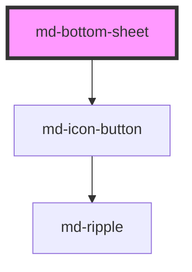

# md-bottom-sheet

<!-- llm:meta
tag: md-bottom-sheet
category: containment
status: md3-mapped
m3-guidelines: https://m3.material.io/components/bottom-sheets/guidelines
form-associated: false
depends-on: md-icon-button
used-by: none
-->

**Supplementary content anchored to the bottom of the screen.** Slides up over
the page with a drag handle, an optional headline and close button, and an
optional actions row. **Both variants are modal**: they render a scrim, trap
focus, lock body scroll and close on Escape.

> Setup, theming, density and i18n are configured once for the whole library —
> see the library-wide specification, shipped next to these manuals as
> `main-llm.md` at the root of the `@awc-ui/core` package.

---

## When to use

- **Mobile** supplementary content or a short task: share targets, filters,
  a picker, a set of actions on an item.
- Content the user can dismiss without consequence.
- A list of contextual actions where a menu would be too small to tap.

## When NOT to use

| Situation | Use instead |
|---|---|
| A blocking decision or critical information | `md-dialog` |
| Desktop supplementary content | `md-side-sheet` |
| Brief feedback | `md-snackbar` |
| A compact action list on desktop | `md-menu` |
| Primary content of the screen | A page |
| Explaining a control | `md-tooltip` |
| A full sub-task on mobile | `md-dialog fullscreen` |
| Non-modal content the user works alongside | `md-side-sheet` with `variant="standard"` |

## Decision cues

| Need | Setting |
|---|---|
| Anchored to the bottom edge, top corners rounded | `variant="standard"` (default) |
| Floating, inset from every edge, all corners rounded | `variant="detached"` |
| Drag-to-dismiss affordance | `show-drag-handle` (default `true`) |
| No handle, no drag gesture | `show-drag-handle="false"` |
| Explicit close button | `closeable` |
| Your own close control | `slot="close"` |
| Prevent click-away dismissal | `scrim-dismissible="false"` |
| Rule under the header | `top-divider` |
| Rule above the actions row | `bottom-divider` (needs `slot="actions"` content) |
| Centre the title or content | `headline-align="center"` / `content-align="center"` |
| Edge-to-edge lists or tables | `--md-bottom-sheet-content-padding-inline: 0` |
| Open/close from code | `show()` / `close()`, or set `open` |

## API contract

```html
<md-bottom-sheet
  open                                 <!-- default: false; reflects -->
  variant="standard|detached"          <!-- default: standard -->
  headline="Share to"                  <!-- default: "" -->
  show-drag-handle="true|false"        <!-- default: true -->
  closeable                            <!-- default: false -->
  scrim-dismissible="true|false"       <!-- default: true -->
  top-divider                          <!-- default: false -->
  bottom-divider                       <!-- default: false; needs slotted actions -->
  headline-align="start|center|end"    <!-- default: start -->
  content-align="start|center|end"     <!-- default: start -->
  aria-label="Share options"           <!-- default: "" -->
  density="-1|-2|-3|-4"                <!-- default: 0 (uncompacted; only -1…-4 have rules) -->
>
  <md-list>…</md-list>
  <md-button slot="actions" variant="text">Cancel</md-button>
</md-bottom-sheet>
```

**Deprecated / inert attribute — do not emit:** `scroll-shadow` is retained for
API compatibility and is a documented no-op. The content area always
plain-scrolls.

**Events** — `mdOpen`, `mdClose`, `mdCancel`, all `CustomEvent<void>` and all
default Stencil events (bubbling and composed).

**Methods** — `show(): Promise<void>` and `close(): Promise<void>`. Both just
set `open`, so `open` stays the single source of truth.

**Slots** — `(default)` main content · `headline` · `close` · `actions`.

**Parts** — `scrim`, `container`, `drag-handle`, `drag-handle-indicator`,
`header`, `headline`, `close`, `divider-top`, `content`, `divider-bottom`,
`actions`.

### Behavioral contract worth knowing

- **`variant` only changes the chrome, not the modality.** Unlike the M3
  "standard bottom sheet", `variant="standard"` here still renders a scrim,
  traps focus and locks body scroll — exactly like `detached`. If you need a
  genuinely non-modal surface, use `md-side-sheet`.
- **The `headline` slot only renders when the `headline` prop is non-empty.**
  The header is gated on the prop, so `<span slot="headline">…</span>` alone
  is silently dropped. Set `headline` to the plain-text version *and* slot the
  rich version if you need markup.
- **`bottom-divider` is double-gated.** The bottom rule renders only when the
  flag is set **and** there is slotted `[slot="actions"]` content — the actions
  row is what it separates. `<md-bottom-sheet bottom-divider>` with no actions
  renders no rule at all. `top-divider` has no such gate.
- The header row itself renders only when there is a `headline`, `closeable`,
  or a slotted `close` element. With none of those there is no header, no
  close button, and only the drag gesture and Escape can dismiss the sheet.
- **`mdOpen` fires on mount for a sheet rendered with `open`** (the mount
  handler calls the open path), and again on every later change. `mdClose`
  fires on every close.
- `mdCancel` fires only on dismissal — a scrim click, Escape, a completed
  drag-down, or the built-in close button. `mdClose` fires on *every* close,
  including those, so a dismissal emits `mdCancel` **and** `mdClose`.
- **A slotted `close` element does not close the sheet.** Only the built-in
  `closeable` icon-button is wired; your own control must call `close()`.
- Escape is handled by a **capture-phase listener on `document`** while the
  sheet is open, with `preventDefault()` and `stopPropagation()` — so an outer
  Escape handler will not also fire.
- **Drag-to-dismiss lives on the drag handle only** and needs
  `show-drag-handle`. Dragging down more than 100px emits `mdCancel` and
  closes; anything less snaps the sheet back.
- **The sheet is never removed from the DOM.** While closed the container is
  translated off-screen and marked `inert` + `aria-hidden="true"`, so it is not
  focusable or exposed to assistive tech, but its slotted content still exists.
- Focus enters the sheet on open and is kept inside by focus-guard sentinels
  plus a `focusin` listener on `document`; on close, focus returns to whatever
  was focused before, with `preventScroll`.
- The body scrolls internally when the content overflows — that is intended
  here, unlike `md-card`.
- **Width is responsive by default**: 100% below 640px, a centred 640px panel
  (capped at `calc(100% - 112px)`) at 640px and above. Override with
  `--md-bottom-sheet-width` / `--md-bottom-sheet-max-width`.
- Block size defaults to `auto`, capped at `80vh`
  (`--md-bottom-sheet-max-height`).
- The host is `display: contents`; the scrim and container are `position: fixed`
  in the library's popup/dialog stacking layer.

---

## Do / Don't

M3's bottom-sheet page carries guidance in prose rather than Do/Don't cards;
the rules below combine it with the closely-related
[side sheets](https://m3.material.io/components/side-sheets/guidelines) guidance
and this component's behavior.

| ✅ Do | ❌ Don't |
|---|---|
| Use bottom sheets for supplementary content on **mobile** | Don't use one for desktop side content — use `md-side-sheet` |
| Keep the drag handle so the gesture is discoverable | Don't hide the handle and then expect drag-to-dismiss to work |
| Let the body scroll vertically when content is long | Don't allow horizontal scrolling |
| Keep the sheet short enough to leave context visible | Don't cover the whole screen — that's a full-screen dialog |
| Provide an explicit close for keyboard and AT users | Don't rely on the drag gesture alone |
| Use it for dismissible, non-critical content | Don't put a blocking decision in a sheet — use a dialog |
| Give it a `headline` or `aria-label` | Don't ship a sheet named only by the built-in English fallback |
| Keep actions in the `actions` slot | Don't scatter actions through the body |

---

## Patterns

```html
<!-- Share sheet with a headline, a close button and an actions row -->
<md-button id="share-btn">Share</md-button>

<md-bottom-sheet id="share" headline="Share to" closeable>
  <md-list>
    <md-list-item>Copy link</md-list-item>
    <md-list-item>Email</md-list-item>
  </md-list>
  <md-button slot="actions" variant="text" id="share-cancel">Cancel</md-button>
</md-bottom-sheet>

<script type="module">
  const sheet = document.getElementById('share');

  document.getElementById('share-btn')
    .addEventListener('mdClick', () => sheet.show());

  // Slotted action buttons never close the sheet on their own.
  document.getElementById('share-cancel')
    .addEventListener('mdClick', () => sheet.close());

  // Dismissal only (scrim / Escape / drag / close button).
  sheet.addEventListener('mdCancel', () => console.log('dismissed'));
</script>
```

```html
<!-- Detached, centred headline, no click-away dismissal -->
<md-bottom-sheet id="plans" variant="detached" headline="Choose a plan"
                 headline-align="center" content-align="center"
                 scrim-dismissible="false" closeable>
  <p>Switch plans at any time.</p>
</md-bottom-sheet>

<script type="module">
  document.getElementById('plans').show();
</script>
```

```html
<!-- Long scrolling content with rules above and below -->
<md-bottom-sheet id="filters" headline="Filters" top-divider bottom-divider>
  <label><md-checkbox value="in-stock"></md-checkbox> In stock</label>
  <label><md-checkbox value="on-sale"></md-checkbox> On sale</label>
  <label><md-checkbox value="free-delivery"></md-checkbox> Free delivery</label>
  <md-button slot="actions" variant="text" id="filters-reset">Reset</md-button>
  <md-button slot="actions" variant="filled" id="filters-apply">Apply</md-button>
</md-bottom-sheet>

<script type="module">
  const sheet = document.getElementById('filters');
  document.getElementById('filters-apply')
    .addEventListener('mdClick', () => sheet.close());
</script>
```

```html
<!-- Rich headline: the prop is still required for the header to render -->
<md-bottom-sheet id="rich" headline="Recent activity">
  <span slot="headline"><strong>Recent</strong> activity</span>
  <p>Nothing new today.</p>
</md-bottom-sheet>
```

```html
<!-- Edge-to-edge list: drop the content gutter -->
<md-bottom-sheet id="edge" headline="Pick a folder"
                 style="--md-bottom-sheet-content-padding-inline: 0;">
  <md-list>
    <md-list-item>Documents</md-list-item>
    <md-list-item>Downloads</md-list-item>
  </md-list>
</md-bottom-sheet>
```

## Anti-patterns

| ❌ Wrong | ✅ Right | Why |
|---|---|---|
| `<span slot="headline">` with no `headline` prop | Set `headline` too | The header only renders when the prop is non-empty, so the slot never mounts. |
| Expecting `variant="standard"` to be non-modal | Use `md-side-sheet` for non-modal | Both bottom-sheet variants render a scrim and trap focus. |
| Expecting a slotted `close` or action button to close the sheet | Call `close()` in its handler | Only the built-in `closeable` button is wired. |
| Handling `mdCancel` and `mdClose` as mutually exclusive | `mdCancel` implies `mdClose` | A dismissal emits both — you'll double-handle. |
| Assuming `mdOpen` won't fire for a sheet rendered with `open` | Expect it on mount | The mount handler runs the open path. |
| `show-drag-handle="false"` while relying on drag-to-dismiss | Keep the handle, or add `closeable` | The drag listeners live on the handle element. |
| Setting `scroll-shadow` | Delete it | It is a documented no-op. |
| Drag-to-dismiss as the only exit | Add `closeable` or an actions-row cancel | Keyboard and AT users can't drag. |
| A blocking confirmation in a sheet | `md-dialog` | Sheets are dismissible by design. |
| Horizontal scrolling inside the sheet | Vertical only | Narrow surface; M3 explicit. |
| A sheet covering the full viewport | `md-dialog fullscreen` | That's a different component. |
| No `headline` and no `aria-label` | Provide one | It falls back to the literal, untranslated name "Bottom sheet". |
| Setting `role`/`aria-modal` on `<md-bottom-sheet>` | Leave them alone | The container inside the shadow root already carries them. |
| `scrim-dismissible` left on for a destructive flow | `scrim-dismissible="false"` | Accidental dismissal. |

## Accessibility, RTL, density, i18n

**Accessibility**
- The container is `role="dialog"` with `aria-modal="true"`. Focus moves into
  the sheet on open, is kept inside while open, and returns to the previously
  focused element on close.
- Escape dismisses, firing `mdCancel` then `mdClose`.
- Name the sheet with `headline` (wired to `aria-labelledby`) or the
  `aria-label` attribute. With neither, it falls back to the hard-coded English
  string "Bottom sheet" — always set one of them in a localized app.
- The drag handle is `aria-hidden` and pointer-only. Always provide `closeable`
  or an actions-row cancel so there is a keyboard path out.
- The built-in close button's accessible name is the hard-coded English
  "Close bottom sheet"; use `slot="close"` with your own `md-icon-button` and
  `aria-label` to localize it, and wire it to `close()`.
- While closed the container is `inert`, so nothing inside it is reachable by
  keyboard or exposed to assistive tech.

**RTL** — the container, header, dividers and content use logical properties,
and `headline-align` / `content-align` are logical: `start` reads left in LTR
and right in RTL. `center` is direction-agnostic.

**Density** — set `density="-1"` … `density="-4"` for a local rung, or inherit a
global `data-density` ancestor. Rung `0` is the uncompacted default and has no
rule of its own, so `density="0"` does **not** opt a sheet out of an inherited
rung; use `style="--md-sys-density-scale: 0"` to reset the scale locally.
Density compacts the corner radius, content gutter, header and actions row.

**i18n** — translate `headline`, `aria-label`, action labels and body content,
and replace the built-in close button via `slot="close"` when you need its label
translated. Longer translations may push the sheet taller — check it still
leaves context visible under the `80vh` cap.

## Related components

`md-side-sheet` · `md-dialog` · `md-snackbar` · `md-menu` · `md-list` ·
`md-icon-button`

## Theming

| Custom property | Purpose | Default |
|---|---|---|
| `--md-bottom-sheet-container-color` | Surface background | `--md-sys-color-surface-container-low` |
| `--md-bottom-sheet-container-shape` | Corner radius | `max(16px, 28px + density × 2px)` |
| `--md-bottom-sheet-content-color` | Body text colour | `--md-sys-color-on-surface` |
| `--md-bottom-sheet-headline-color` | Headline text colour | `--md-sys-color-on-surface` |
| `--md-bottom-sheet-scrim-color` | Backdrop colour | `rgba(0, 0, 0, 0.32)` |
| `--md-bottom-sheet-drag-handle-color` | Drag-handle bar colour | `--md-sys-color-on-surface-variant` |
| `--md-bottom-sheet-divider-color` | Top / bottom rules | `--md-sys-color-outline-variant` |
| `--md-bottom-sheet-icon-color` | Close glyph colour | `--md-sys-color-on-surface-variant` |
| `--md-bottom-sheet-width` | Inline size | `100%` below 640px, `640px` at 640px+ |
| `--md-bottom-sheet-min-width` | Minimum inline size | `0` |
| `--md-bottom-sheet-max-width` | Maximum inline size | `100%` below 640px, `calc(100% - 112px)` at 640px+ |
| `--md-bottom-sheet-height` | Block size | `auto` |
| `--md-bottom-sheet-min-height` | Minimum block size | `0` |
| `--md-bottom-sheet-max-height` | Maximum block size | `80vh` |
| `--md-bottom-sheet-detached-margin` | Inset on the `detached` variant | `16px` |
| `--md-bottom-sheet-content-padding-inline` | Gutter inside the scroll area | `max(12px, 24px + density × 2px)` |

**CSS parts** — `scrim`, `container`, `drag-handle`, `drag-handle-indicator`,
`header`, `headline`, `close`, `divider-top`, `content`, `divider-bottom`,
`actions`.

```css
md-bottom-sheet.compact-panel {
  --md-bottom-sheet-max-height: 50vh;
  --md-bottom-sheet-max-width: 480px;
  --md-bottom-sheet-scrim-color: rgba(0, 0, 0, 0.6);
}

md-bottom-sheet.compact-panel::part(headline) {
  font-weight: 600;
}
```

<!-- Auto Generated Below -->


## Overview

MD3 Bottom sheet — secondary content anchored to the bottom of the screen.

Two variants per the M3 spec
(https://m3.material.io/components/bottom-sheets/overview). Both are
modal dialogs — they always render a scrim, trap focus, lock body
scroll, close on Escape, and support drag-to-dismiss.

- `standard` (default) — anchored to the bottom edge of the viewport.
  Full-width up to a responsive max, with rounded top corners only.
- `detached` — floats with a margin on every side and rounded corners
  on every side. Best for compact, dialog-like sheets on larger
  screens.

Width and height are entirely token-driven, so the only thing you
change to switch from anchored to floating chrome is the `variant`
attribute. The default media query reflows the sheet between
full-width on mobile and a centred 640px panel on desktop; consumers
can opt out via `--md-bottom-sheet-width` / `--md-bottom-sheet-max-width`.

## Properties

| Property           | Attribute           | Description                                                                                                                                                                                                                                                                                                                  | Type                           | Default      |
| ------------------ | ------------------- | ---------------------------------------------------------------------------------------------------------------------------------------------------------------------------------------------------------------------------------------------------------------------------------------------------------------------------- | ------------------------------ | ------------ |
| `bottomDivider`    | `bottom-divider`    | Show divider between content and actions                                                                                                                                                                                                                                                                                     | `boolean`                      | `false`      |
| `closeable`        | `closeable`         | Show a close icon-button in the top-end corner of the header                                                                                                                                                                                                                                                                 | `boolean`                      | `false`      |
| `contentAlign`     | `content-align`     | Inline-axis alignment of the slotted content. Inherits to all default-slot children, so prose, lists, and forms all pick it up. `start` (default) reads left in LTR / right in RTL, `end` reads right in LTR / left in RTL, `center` is direction-agnostic. Slotted children that explicitly set their own `text-align` win. | `"center" \| "end" \| "start"` | `'start'`    |
| `density`          | `density`           | Local density rung. Drives the same `--md-sys-density-scale` signal that a global `data-density` ancestor sets, so a local value simply overrides the inherited one. 0 = default, -4 = ultra-compact.                                                                                                                        | `-1 \| -2 \| -3 \| -4 \| 0`    | `0`          |
| `headline`         | `headline`          | Headline text (or use the `headline` slot)                                                                                                                                                                                                                                                                                   | `string`                       | `''`         |
| `headlineAlign`    | `headline-align`    | Inline-axis alignment of the headline text. `start` (default) reads left in LTR / right in RTL, `end` reads right in LTR / left in RTL, `center` is direction-agnostic. Use the matching `::part(headline)` selector for finer control (e.g. `text-align: justify`).                                                         | `"center" \| "end" \| "start"` | `'start'`    |
| `open`             | `open`              | Whether the sheet is visible                                                                                                                                                                                                                                                                                                 | `boolean`                      | `false`      |
| `scrimDismissible` | `scrim-dismissible` | Whether clicking the scrim closes the sheet                                                                                                                                                                                                                                                                                  | `boolean`                      | `true`       |
| `scrollShadow`     | `scroll-shadow`     | Retained for API compatibility, but now a no-op: the content area always plain-scrolls when it overflows (no scroll shadow / edge fades). Setting this has no visual effect.                                                                                                                                                 | `boolean`                      | `true`       |
| `sheetAriaLabel`   | `aria-label`        | Custom aria-label for the container                                                                                                                                                                                                                                                                                          | `string`                       | `''`         |
| `showDragHandle`   | `show-drag-handle`  | Show the drag handle indicator                                                                                                                                                                                                                                                                                               | `boolean`                      | `true`       |
| `topDivider`       | `top-divider`       | Show divider between header and content                                                                                                                                                                                                                                                                                      | `boolean`                      | `false`      |
| `variant`          | `variant`           | `standard` (default) anchors the sheet to the bottom edge. `detached` floats it with margin on every side. Both variants always render a scrim and trap focus.                                                                                                                                                               | `"detached" \| "standard"`     | `'standard'` |


## Events

| Event      | Description                                                         | Type                |
| ---------- | ------------------------------------------------------------------- | ------------------- |
| `mdCancel` | Emits when dismissed via scrim click, Escape, drag, or close button | `CustomEvent<void>` |
| `mdClose`  | Emits when the sheet closes                                         | `CustomEvent<void>` |
| `mdOpen`   | Emits when the sheet opens                                          | `CustomEvent<void>` |


## Methods

### `close() => Promise<void>`


#### Returns

Type: `Promise<void>`


### `show() => Promise<void>`


#### Returns

Type: `Promise<void>`


## Slots

| Slot         | Description                                               |
| ------------ | --------------------------------------------------------- |
|              | Main content                                              |
| `"actions"`  | Bottom action buttons (optional)                          |
| `"close"`    | Custom close element (replaces default close icon button) |
| `"headline"` | Custom headline content                                   |


## Shadow Parts

| Part                      | Description                                                                                  |
| ------------------------- | -------------------------------------------------------------------------------------------- |
| `"actions"`               | Bottom action bar                                                                            |
| `"close"`                 | Close button wrapper                                                                         |
| `"container"`             | Sheet surface                                                                                |
| `"content"`               | Content area wrapper (inline padding, edge-to-edge frame); the content scrolls directly here |
| `"divider-bottom"`        | Bottom divider (between content and actions)                                                 |
| `"divider-top"`           | Top divider (between header and content)                                                     |
| `"drag-handle"`           | Drag handle hit area                                                                         |
| `"drag-handle-indicator"` | Drag handle visible bar                                                                      |
| `"header"`                | Header row (headline + close)                                                                |
| `"headline"`              | Headline text                                                                                |
| `"scrim"`                 | Scrim overlay                                                                                |


## Dependencies

### Depends on

- [md-icon-button](../md-icon-button)

### Graph


----------------------------------------------

*Built with [StencilJS](https://stenciljs.com/)*
