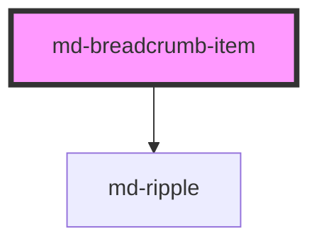

# md-breadcrumb-item

<!-- llm:meta
tag: md-breadcrumb-item
category: navigation
status: sub-component
parent: md-breadcrumbs
standalone: false
m3-guidelines: none — M3 has no breadcrumbs page
form-associated: false
depends-on: md-ripple
used-by: none
-->

**One crumb in the trail.** A link to an ancestor, or the non-interactive
current page, plus the separator that precedes it.

> 🧩 **Sub-component.** Only valid inside `md-breadcrumbs`, which supplies the
> navigation region, the position data and the collapse behaviour.

---

## When to use

- One level of the hierarchy inside `md-breadcrumbs`, which is the only valid
  parent — it writes `item-index` / `item-total`, promotes the last crumb to
  `current`, and drives collapsing.

## When NOT to use

| Situation | Use instead |
|---|---|
| A navigation destination | `md-navigation-tab` / `md-navigation-rail-tab` |
| A step in a flow | `md-step` |
| A menu row | `md-menu-item` |
| A list row | `md-list-item` |
| An inline text link | A plain `<a>` |

## Decision cues

| Need | Setting |
|---|---|
| A navigable ancestor | `href="/path"` |
| The page you are on | Leave `href` off — the parent marks the last crumb `current` |
| A crumb that isn't the last but is still "here" | `current` (this also disables the parent's auto-promotion) |
| An ancestor that exists but isn't reachable | `disabled` |
| Open elsewhere | `target="_blank"` (`rel` is set to `noopener noreferrer` for you) |
| A leading glyph | `icon="home"` |
| Your own glyph or SVG | the `icon` slot, present in the initial markup |
| Compact crumb | `density="-1…-4"` |

## API contract

```html
<md-breadcrumbs>
  <md-breadcrumb-item
    href="/library"        <!-- default: '' — with no href the crumb is plain text -->
    target=""              <!-- default: '' -->
    rel=""                 <!-- default: '' — becomes "noopener noreferrer" when target is set -->
    icon="folder"          <!-- default: '' -->
    disabled               <!-- default: absent -->
    density="-1|-2|-3|-4"  <!-- default: 0 — the uncompacted rung, which is inert -->
  >Library</md-breadcrumb-item>
  <md-breadcrumb-item>Tables</md-breadcrumb-item>
</md-breadcrumbs>
```

**Events** — `mdSelect` with detail
`{ href, label, current, itemIndex, itemTotal, originalEvent }`. **Cancelable**,
bubbles and composed — `preventDefault()` in the listener stops the anchor from
navigating, which is the SPA-routing hook.

**Methods** — none.

**Slots** — `(default)`: the crumb's text; `icon`: a custom leading glyph.

**Parts** — `separator`, `link`, `static`, `state-layer`, `icon`, `label`.

**Parent-managed props — never set these by hand:** `collapsed`, `item-index`,
`item-total`, and normally `current`. `md-breadcrumbs` writes all four.

### Behavioral contract worth knowing

- **The crumb draws its own leading separator** (`::part(separator)`), reading
  the glyph from the parent's `separator` prop. It is rendered only when
  `item-index > 0`, so the first crumb has none. `md-breadcrumbs` renders just
  one separator itself — the one inside the overflow control.
- **`current`, `collapsed`, `item-index` and `item-total` are set by
  `md-breadcrumbs`.** In particular the parent promotes the **last** crumb to
  `current` and clears it from the rest — unless you explicitly mark a
  *non-last* crumb `current`, which switches that promotion off for the whole
  trail.
- `current` renders the crumb as **static text with `aria-current="page"`**,
  never a link, even if `href` is set. `disabled` and an empty `href` produce
  the same static rendering (without `aria-current`).
- `href` is passed through a scheme allowlist — `http:`, `https:`, `mailto:`,
  `tel:`, `sms:`, `ftp:` and relative URLs. Anything else (a `javascript:` URL
  from a CMS field, say) is dropped, and the anchor renders with no `href`.
- Setting `target` without a `rel` sets `rel="noopener noreferrer"` for you; an
  explicit `rel` always wins.
- `mdSelect` fires **only** from the rendered anchor — so not on a `current`,
  `disabled` or href-less crumb. Pressing `Enter` on a focused anchor
  synthesises a click, so the keyboard path is covered by the same event.
- The `icon` slot is only rendered once the crumb has a slotted icon, and that
  is detected from the light DOM before the first render. **Appending a
  `[slot="icon"]` child later will not appear** — ship it in the initial
  markup, or use the `icon` prop.
- A `collapsed` crumb renders an empty, `aria-hidden` host with
  `display: none`. It stays in the DOM so expanding is instant.
- The label is a single line and ellipsizes past `32ch`.
- A `current` crumb's Material Symbols glyph switches to `FILL 1` / `wght 600`.

---

## Do / Don't

House rules, informed by general navigation practice — no M3 breadcrumbs page
exists.

| ✅ Do | ❌ Don't |
|---|---|
| Leave the last crumb without an `href` | Don't link the page the user is already on |
| Keep the label to the page's short name | Don't repeat the full title in the crumb |
| Use `icon` sparingly — usually only on Home | Don't icon every crumb |
| Let the parent handle separators, position and collapsing | Don't set `collapsed` / `item-index` / `item-total` yourself |
| Use real `href`s so middle-click and copy-link work | Don't fake navigation with click handlers alone |
| Intercept with `mdSelect` + `preventDefault()` for SPA routing | Don't strip the `href` to stop navigation |
| Use `disabled` for an ancestor that exists but isn't reachable | Don't silently drop levels from the trail |

## Patterns

```html
<md-breadcrumbs label="Breadcrumb">
  <md-breadcrumb-item href="/" icon="home">Home</md-breadcrumb-item>
  <md-breadcrumb-item href="/library">Library</md-breadcrumb-item>
  <md-breadcrumb-item>Tables</md-breadcrumb-item>
</md-breadcrumbs>
```

```html
<!-- SPA routing: keep real hrefs, intercept with one delegated listener.
     mdSelect bubbles and is composed, so the parent is enough. -->
<md-breadcrumbs id="crumbs" label="Breadcrumb">
  <md-breadcrumb-item href="/">Home</md-breadcrumb-item>
  <md-breadcrumb-item href="/library">Library</md-breadcrumb-item>
  <md-breadcrumb-item>Tables</md-breadcrumb-item>
</md-breadcrumbs>

<script type="module">
  document.getElementById('crumbs').addEventListener('mdSelect', (e) => {
    const { originalEvent, href } = e.detail;
    // Let the browser handle new-tab / new-window intents
    if (originalEvent.metaKey || originalEvent.ctrlKey || originalEvent.shiftKey) return;
    e.preventDefault();          // stop the <a> from navigating
    history.pushState({}, '', href);   // swap for your router's push()
  });
</script>
```

```html
<!-- Custom glyph: the slotted icon must be in the initial markup -->
<md-breadcrumbs>
  <md-breadcrumb-item href="/files">
    <svg slot="icon" viewBox="0 0 24 24" width="18" height="18" fill="currentColor">
      <path d="M10 4H4v16h16V8h-8l-2-4z"/>
    </svg>
    Files
  </md-breadcrumb-item>
  <md-breadcrumb-item>Archive</md-breadcrumb-item>
</md-breadcrumbs>
```

```html
<!-- An ancestor the user can't reach right now -->
<md-breadcrumbs>
  <md-breadcrumb-item href="/">Home</md-breadcrumb-item>
  <md-breadcrumb-item disabled>Restricted</md-breadcrumb-item>
  <md-breadcrumb-item>Report</md-breadcrumb-item>
</md-breadcrumbs>
```

## Anti-patterns

| ❌ Wrong | ✅ Right | Why |
|---|---|---|
| `current` **and** `href` on the same crumb | Drop the `href` | `current` renders static text; the `href` is silently ignored. |
| Setting `current` on the last crumb | Leave it off | The parent promotes it; setting it on a *non-last* crumb disables that promotion trail-wide. |
| Setting `collapsed` / `item-index` / `item-total` | Let the parent manage them | You'd break collapsing and the separators. |
| Expecting the parent to draw the separators | The item draws its own | `md-breadcrumbs` only renders the one inside the overflow control. |
| Looking for a `separator` slot | Use the `separator` prop or `::part(separator)` | Neither element has one. |
| Click handlers instead of `href` | Use `href` and intercept `mdSelect` | Breaks middle-click, copy-link, and AT link semantics. |
| Listening for `click` to intercept navigation | Listen for `mdSelect` | It carries the crumb's detail and its `preventDefault()` gates the anchor. |
| Intercepting without checking modifier keys | Let ⌘/Ctrl/Shift-click through | Otherwise you break open-in-new-tab. |
| Adding a `[slot="icon"]` child after first render | Ship it in the initial markup, or use `icon` | The icon slot isn't rendered, so it can never assign. |
| `md-breadcrumb-item` outside `md-breadcrumbs` | Nest it | No separators, no position data, no collapse, no region semantics. |
| Icons on every crumb | Reserve for Home, if at all | Visual noise in a dense trail. |

## Accessibility, RTL, density, i18n

**Accessibility**
- The host is `role="listitem"` inside the parent's `<ol>`. A navigable crumb
  renders a real `<a>`; the `current` one renders static text carrying
  `aria-current="page"`.
- The leading separator is `aria-hidden` and never announced.
- The leading `icon` is decorative (`aria-hidden`); the crumb's text is the
  accessible name. A crumb with an icon and no slotted text renders a link with
  **no accessible name** — always keep real text in the default slot. For a
  visually icon-only Home crumb, slot the text and hide it with your own
  visually-hidden class; `aria-label` on the `md-breadcrumb-item` host does
  **not** work, because the host is only `role="listitem"` and the component
  never forwards it to the inner `<a>`.
- `disabled` keeps the crumb announced but unnavigable — it renders as static
  text with `pointer-events: none`. Its disabled colour is deliberately 61%
  (not the M3 38% tint) so it still meets WCAG 1.4.3 contrast.
- Don't remove `href` from ancestors to "style" them as text — that removes
  real navigation.
- Focus ring: 3px `--md-sys-color-secondary` at 2px offset on the anchor.
- Under `forced-colors` links use `LinkText` and the current crumb gets a
  `CanvasText` outline instead of its tonal fill.

**RTL** — set `dir="rtl"` on the trail or an ancestor: icon side, padding and
the hover nudge all mirror.

**Density** — `density="-1…-4"` tightens the icon/label gap, the crumb padding
and the type scale. Only those four rungs exist. Rung `0` is the uncompacted
default and is inert — `density="0"` does **not** opt the crumb out of an
ancestor's `data-density` rung; use `style="--md-sys-density-scale: 0"` for
that (the ancestor's `--md-sys-spacing-*` payload still inherits).

**i18n** — translate the crumb text. Keep it short: the label ellipsizes past
`32ch`, and the parent's `max-items` collapsing is the safety valve for long
translations.

## Related components

`md-breadcrumbs` · `md-navigation-rail-tab` · `md-menu-item` ·
`md-list-item` · `md-app-bar` · `md-ripple`

## Theming

| Custom property | Purpose | Default |
|---|---|---|
| `--md-breadcrumb-item-link-color` | Ancestor link colour | `--md-sys-color-on-surface-variant` |
| `--md-breadcrumb-item-current-color` | Current-crumb text colour | `--md-sys-color-on-secondary-container` |
| `--md-breadcrumb-item-current-bg` | Current-crumb pill background | `--md-sys-color-secondary-container` |
| `--md-breadcrumb-item-hover-color` | Hover text colour | `--md-sys-color-primary` |
| `--md-breadcrumb-item-disabled-color` | Disabled text colour | `--md-sys-color-on-surface` at 61% |
| `--md-breadcrumb-item-state-layer-color` | Hover / focus / press overlay | `--md-sys-color-on-surface` |
| `--md-breadcrumb-item-gap` | Gap between icon and label | `calc(6px + density * 1px)` |
| `--md-breadcrumb-item-padding` | Interactive padding | `calc(8px + density * 2px)` block, `max(4px, calc(12px + density * 2px))` inline |

The item also reads the parent's `--md-breadcrumbs-gap` (spacing to its
separator) and `--md-breadcrumbs-separator-color`.

**CSS parts** — `separator`, `link`, `static`, `state-layer`, `icon`, `label`.
Note that `::part(icon)` matches the icon container in both cases, but a
slotted icon replaces the built-in glyph inside it.

```css
md-breadcrumb-item {
  --md-breadcrumb-item-current-bg: transparent;
  --md-breadcrumb-item-current-color: var(--md-sys-color-on-surface);
}
```

<!-- Auto Generated Below -->


## Properties

| Property    | Attribute    | Description                                                                                                                                                                                                                                                               | Type                        | Default |
| ----------- | ------------ | ------------------------------------------------------------------------------------------------------------------------------------------------------------------------------------------------------------------------------------------------------------------------- | --------------------------- | ------- |
| `collapsed` | `collapsed`  | Marks this item as part of the collapsed middle section. Usually set by the parent `md-breadcrumbs` when `max-items` is exceeded. Declared as a public prop (instead of just a `data-*` attribute) so Stencil re-renders the item when the parent toggles its visibility. | `boolean`                   | `false` |
| `current`   | `current`    | When `true`, mark this item as the current page. Usually the parent `md-breadcrumbs` auto-sets this on the last child, but explicit override is supported.                                                                                                                | `boolean`                   | `false` |
| `density`   | `density`    | Local density rung. Drives the same `--md-sys-density-scale` signal that a global `data-density` ancestor sets, so a local value simply overrides the inherited one. 0 = default, -4 = ultra-compact.                                                                     | `-1 \| -2 \| -3 \| -4 \| 0` | `0`     |
| `disabled`  | `disabled`   | Disable the item — renders without an anchor and is not focusable.                                                                                                                                                                                                        | `boolean`                   | `false` |
| `href`      | `href`       | Destination URL. When empty the item renders as a plain span.                                                                                                                                                                                                             | `string`                    | `''`    |
| `icon`      | `icon`       | Optional leading icon (Material Symbols shorthand).                                                                                                                                                                                                                       | `string`                    | `''`    |
| `itemIndex` | `item-index` | Position in the trail (0-indexed). Set automatically by the parent `md-breadcrumbs`. Exposed as a reactive prop so children re-render the leading separator when their position changes.                                                                                  | `number`                    | `0`     |
| `itemTotal` | `item-total` | Total number of items in the trail. Set automatically by the parent.                                                                                                                                                                                                      | `number`                    | `0`     |
| `rel`       | `rel`        | Anchor `rel` attribute.                                                                                                                                                                                                                                                   | `string`                    | `''`    |
| `target`    | `target`     | Anchor `target` attribute (e.g. `_blank`).                                                                                                                                                                                                                                | `string`                    | `''`    |


## Events

| Event      | Description                                                                                                                                                                                                                                                                                                                                                                                                                                                                                                                                                                                                                                                                                                                                                                                                                                                                                                                                                                                                                                                                                 | Type                                    |
| ---------- | ------------------------------------------------------------------------------------------------------------------------------------------------------------------------------------------------------------------------------------------------------------------------------------------------------------------------------------------------------------------------------------------------------------------------------------------------------------------------------------------------------------------------------------------------------------------------------------------------------------------------------------------------------------------------------------------------------------------------------------------------------------------------------------------------------------------------------------------------------------------------------------------------------------------------------------------------------------------------------------------------------------------------------------------------------------------------------------------- | --------------------------------------- |
| `mdSelect` | Fires when the user activates a navigable crumb — i.e. when an item with a non-empty `href` (and not marked `current` / `disabled`) is clicked or activated with `Enter` while focused. The event is **cancelable**: call `event.preventDefault()` from the listener to stop the browser's default navigation. This is the recommended hook for SPA routing — let the breadcrumb render a real `<a>` (so right-click / middle-click / "Open in new tab" still work), then intercept `mdSelect` to push the route through your client-side router instead of a full page reload.  The event bubbles, so consumers can attach a single listener on the parent `<md-breadcrumbs>` for delegation. The event is composed, so listeners outside the shadow tree (the typical case) receive it.  ```ts document.querySelector('md-breadcrumbs')!   .addEventListener('mdSelect', (e) => {     const { href, label, itemIndex } = (e as CustomEvent).detail;     e.preventDefault();              // stop the <a> from navigating     history.pushState({}, '', href); // swap for your router's push()   }); ``` | `CustomEvent<MdBreadcrumbSelectDetail>` |


## Shadow Parts

| Part            | Description |
| --------------- | ----------- |
| `"icon"`        |             |
| `"label"`       |             |
| `"link"`        |             |
| `"separator"`   |             |
| `"state-layer"` |             |
| `"static"`      |             |


## Dependencies

### Depends on

- [md-ripple](../md-ripple)

### Graph


----------------------------------------------

*Built with [StencilJS](https://stenciljs.com/)*
