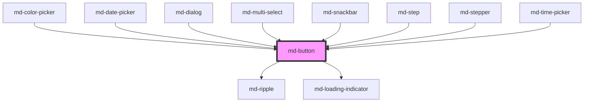

# md-button

<!-- llm:meta
tag: md-button
category: actions
status: md3-mapped
m3-guidelines: https://m3.material.io/components/buttons/guidelines
form-associated: true
depends-on: md-ripple, md-loading-indicator
used-by: md-color-picker, md-date-picker, md-dialog, md-multi-select, md-snackbar, md-step, md-stepper, md-time-picker
-->

**A discrete, committed action.** Five emphasis levels, five sizes, round/square
shape with M3-Expressive shape morphing, optional toggle mode, and native form
participation (`submit`/`reset`) via `ElementInternals`.

> Setup, theming, density and i18n are configured once for the whole library —
> see [`main-llm.md`](../../../../../main-llm.md), the library-wide manual that ships
> alongside these files. Quick start:
> `import '@awc-ui/core/define';`

---

## When to use

- A **discrete action** the user commits to: `Save`, `Confirm`, `Join now`, `Next`.
- Actions inside dialogs, forms, cards, toolbars, and bottom sheets.
- A **binary toggle with a visible label** (`toggle` prop) — Save / Favorite / Follow.
- A submit or reset control inside a `<form>` (`type="submit"` / `type="reset"`).

## When NOT to use

| Situation | Use instead |
|---|---|
| Icon-only affordance (no label) | `md-icon-button` |
| Navigating between app destinations | `md-navigation-bar` / `md-navigation-rail` / `md-tabs`, or a plain text link |
| The single most prominent action on a screen (mobile-first) | `md-fab` |
| 3+ related actions that act as one unit | `md-button-group` or `md-segmented-button-set` |
| One primary action + a menu of variations | `md-split-button` |
| Filtering, attributes, or removable entries | `md-chip` |
| Low-priority actions crowding the UI | Overflow `md-menu`, or `md-icon-button` |
| Inline navigation inside a sentence | A hyperlink — **not** an underlined text button |

## Decision cues

Pick `variant` by emphasis, highest first. M3: use the strongest style **sparingly**.

| Need | `variant` | Notes |
|---|---|---|
| The one important, flow-completing action | `filled` | Ideally **only one per screen** |
| Needs separation from a busy/imagery background | `elevated` | Uses a shadow — use only when necessary |
| Lower priority, but more emphasis than an outline | `tonal` | Good for `Next` in onboarding |
| Important but not primary; pairs with `filled` | `outlined` | Place on simple backgrounds only |
| Lowest priority; several options side by side | `text` | Default in dialogs, cards, snackbars |

Pick `size` by context (**default is `sm`, not `md`**):

| `size` | Min block-size | Icon | Typical use |
|---|---|---|---|
| `xs` | 32px | 20px | Dense tables, toolbars, inline row actions |
| `sm` | 40px | 20px | **Default.** Standard UI density |
| `md` | 56px | 24px | Comfortable / touch-first forms |
| `lg` | 96px | 32px | Primary CTA on a landing surface |
| `xl` | 136px | 40px | Hero / marketing CTA |

Heights are `min-block-size` floors, not fixed heights, and each size also
carries a `min-inline-size`. The label is `white-space: nowrap`, so a long
label widens the button rather than wrapping it. All five tiers taper with
density.

## API contract

The authoritative, generated property/event tables are at the bottom of this
file. This is the short form an implementer needs.

```html
<md-button
  variant="filled|outlined|text|elevated|tonal"   <!-- default: filled -->
  size="xs|sm|md|lg|xl"                            <!-- default: sm -->
  shape="round|square"                             <!-- default: round -->
  type="button|submit|reset"                       <!-- default: button -->
  icon="add"                 trailing-icon="arrow_forward"
  href="/settings" target="_self"
  toggle selected
  disabled | soft-disabled | loading
  full-width
  mirror-icon
  density="-1|-2|-3|-4"                          <!-- omit for the default rung -->
>Label</md-button>
```

**Slots** — default (the label), `leading-icon`, `trailing-icon`, `loader` (swap the built-in spinner for your own — e.g. `md-progress-indicator variant="circular" indeterminate`) while `loading`.
A named icon slot *replaces* the matching `icon` / `trailing-icon` prop.

**Events** — both bubble and are `composed`, so one delegated listener on an
ancestor catches every button.

| Event | Cancelable | Detail | Fires |
|---|---|---|---|
| `mdClick` | **yes** | `{ value, toggle, selected, href, target, originalEvent }` | Every activation (pointer, `Enter`, `Space`) |
| `mdChange` | yes, but ignored | `{ selected, value }` | Only when `toggle` mode flips `selected` |

`detail.selected` on `mdClick` is the **post-click** state — what the button
*will* become. `preventDefault()` on `mdClick` vetoes the toggle flip **and**
the `href` navigation (the underlying DOM `click` still bubbles).

`mdChange` is dispatched with `cancelable: true` as well — Stencil's default —
so `preventDefault()` on it succeeds but changes nothing: the state has already
flipped and the component never reads `defaultPrevented`. (The generated table
below still says "Not cancelable"; that describes the intent, not the DOM
property.) `mdClick` is the only real veto hook.

**Internal props — never set these by hand:** `connectedLeft`, `connectedRight`,
`groupTabindex`. `md-button-group` owns them; setting them manually breaks the
group's roving tabindex and border-trimming.

### Behavioral contract worth knowing

- `disabled`, `soft-disabled`, **and `loading`** all make the button inert.
  `loading` is not merely cosmetic.
- `disabled` sets `tabindex="-1"` (unfocusable). `soft-disabled` keeps
  `tabindex="0"` so the action stays discoverable — this is the M3-preferred
  form for contextually-unavailable actions.
- `href` **wins over** `type`. If `href` is set, the button navigates and never
  submits or resets the form.
- Navigation goes through `window.open(sanitizeHref(href), target)`. Unsafe
  schemes (`javascript:` etc.) are refused; the form is *not* submitted as a
  fallback.
- `type="submit"` calls `form.requestSubmit()` (not `submit()`), so the form's
  `submit` event fires and constraint validation runs.

---

## Do / Don't

Sourced from [M3 · Buttons · Guidelines](https://m3.material.io/components/buttons/guidelines).

| ✅ Do | ❌ Don't |
|---|---|
| Use buttons for discrete actions | Don't clutter the UI with too many buttons — move low-priority actions into overflow menus or icon buttons |
| Let the container width follow the label text | Don't set a fixed width narrower than the label |
| Let width be responsive/stretch where it helps (`full-width`) | Don't stretch a button into a long, flat bar with very little content inside |
| Use **sentence case** — capitalize the first word and proper nouns | Don't uppercase, truncate, or wrap the label — it must stay fully visible on one line |
| Keep labels brief, ideally 1–3 words | Don't let a toggle's label change dramatically in length between states |
| Place the icon on the **leading** side, before the label | Don't use two icons in one standard button (see note below) |
| Keep the icon and label grouped and centered | Don't anchor icon and label to opposite edges of the button |
| Use a filled button for the single most important action | Don't use several filled buttons on one screen — it destroys the hierarchy |
| Use `elevated` only when the button must separate from a prominent background | Don't reach for elevation for emphasis — use `filled` instead |
| Place `outlined` and `text` buttons on simple backgrounds | Don't put `outlined`/`text` buttons over images or video without a contrasting fill |
| Use an outlined icon when a toggle is unselected, filled when selected | Don't underline a `text` button — use a real hyperlink for links |
| Keep DOM order stable across breakpoints (position may move) | Don't reorder buttons responsively — it breaks screen-reader and keyboard order |

**Two-icon note.** M3 says a standard button should carry at most one icon, yet
this component exposes both `icon` and `trailing-icon`. The trailing slot exists
for *disclosure* affordances — dropdown/expand triggers where the trailing glyph
is a chevron, not a second semantic icon. Don't pair two meaning-bearing icons.

**Outlined-vs-chip caution.** M3 warns that outlined buttons read very much like
chips. If an outlined button sits near `md-chip`s, switch it to `filled` or
`tonal`.

---

## Patterns

```html
<!-- Primary action in a form -->
<form>
  <md-text-field label="Email" required></md-text-field>
  <md-button variant="filled" type="submit">Save</md-button>
  <md-button variant="text" type="reset">Cancel</md-button>
</form>

<!-- Dialog actions: text buttons, trailing-aligned -->
<md-dialog>
  <md-button slot="actions" variant="text">Cancel</md-button>
  <md-button slot="actions" variant="filled">Confirm</md-button>
</md-dialog>

<!-- Full-width CTA, capped so it never becomes a long flat bar -->
<md-button variant="filled" full-width style="--md-button-max-width: 360px;" icon="check">
  Confirm and continue
</md-button>

<!-- Toggle with a length-stable label -->
<md-button variant="tonal" toggle value="favorite" icon="favorite">Follow</md-button>

<!-- Loading state (inert while pending) -->
<md-button variant="filled" loading>Saving…</md-button>

<!-- Contextually unavailable, still discoverable -->
<md-button variant="filled" soft-disabled>Paste</md-button>

<!-- SPA-safe link interception -->
<md-button id="settings-btn" variant="text" href="/settings">Settings</md-button>
<script>
  document.getElementById('settings-btn').addEventListener('mdClick', (e) => {
    const { href } = e.detail;
    if (href.startsWith('/')) {
      e.preventDefault();          // vetoes window.open, keeps the SPA in place
      history.pushState({}, '', href);
    }
  });
</script>

<!-- Custom iconography via slot (SVG, icon font, emoji) -->
<md-button variant="outlined">
  <svg slot="leading-icon" viewBox="0 0 24 24" width="18" height="18" fill="currentColor">
    <path d="M12 17.3 6.2 21l1.6-6.8L2.5 9.6l6.9-.6L12 2l2.6 7 6.9.6-5.3 4.6 1.6 6.8z"/>
  </svg>
  Starred
</md-button>
```

## Anti-patterns

Mistakes that show up repeatedly in generated code.

| ❌ Wrong | ✅ Right | Why |
|---|---|---|
| `<button><md-button>Save</md-button></button>` | `<md-button>Save</md-button>` | The host *is* the button (`role="button"`, keyboard handling). Nesting produces nested interactive controls. |
| `<a href="/x"><md-button>Go</md-button></a>` | `<md-button href="/x">Go</md-button>` | Same reason; also double-activates on `Enter`. |
| `<md-button icon="delete"></md-button>` | `<md-icon-button icon="delete" aria-label="Delete">` | An icon-only `md-button` has no accessible name and the wrong metrics. |
| `<md-button size="md">` assumed to be the default | State the size explicitly | The default is **`sm`**, not `md`. |
| `md-button::part(label) { text-transform: uppercase }` | Sentence case in the label text | M3 explicitly requires sentence case. |
| Three `variant="filled"` buttons in one toolbar | One `filled`, the rest `outlined`/`text` | Competing high-emphasis actions flatten the hierarchy. |
| `disabled` on an action the user should still discover | `soft-disabled` | `disabled` removes it from tab order entirely. |
| Reading `detail.selected` as the *previous* state | It is the **next** state | It's a before-change hook by design. |
| `preventDefault()` on the native `click` to block navigation | `preventDefault()` on `mdClick` | Native `click` is not what gates the side effects. |
| Setting `connected-left` / `group-tabindex` manually | Let `md-button-group` manage them | They are `@internal`. |
| `mirror-icon` on `add` / `search` / `favorite` | Only on directional glyphs (arrows, chevrons, `send`, `reply`) | Mirroring a non-directional glyph corrupts its meaning. |
| Fixed `--md-button-width` smaller than the label | Leave width auto, or set `--md-button-max-width` | Truncated labels violate the spec. |

## Accessibility, RTL, density, i18n

**Accessibility**
- Host carries `role="button"` (override with `role-override` only for composite
  widgets, e.g. `gridcell` in `md-date-picker`), `Enter`/`Space` activation, and
  `aria-disabled` whenever `disabled`, `soft-disabled`, or `loading` is set.
- `aria-pressed` is emitted **only** in `toggle` mode.
- Put `aria-label` on the host for any button whose visible label is
  insufficient. Verified against axe-core with zero WCAG 2.1 AA violations.
- Focus ring: 3px `secondary` at 2px offset, visible on all five variants.

**RTL** — all box metrics use logical properties, so leading/trailing icons swap
automatically under `dir="rtl"`. Add `mirror-icon` for directional glyphs only.
M3 requires the icon to sit on the leading (right, in RTL) side — that is
automatic here.

**Density** — `density="-1…-4"` locally overrides the inherited
`data-density` rung; only those four rungs exist, and omitting the attribute
is the uncompacted default. `density="0"` does **not** opt a button out of an
ancestor's rung — to reset the calc-driven scale use
`style="--md-sys-density-scale: 0"` (the ancestor's `--md-sys-spacing-*`
payload still inherits). Prefer the global ancestor setting; use the prop for
one-off compact regions.

**i18n** — the label is your slotted text, so it comes straight from your i18n
layer. `lang` / `dir` are inherited from any ancestor. Localize `aria-label`
too. Watch M3's length-stability rule: a translated toggle label should not
swing wildly in length between states.

## Related components

`md-icon-button` · `md-fab` · `md-fab-menu` · `md-split-button` ·
`md-button-group` · `md-segmented-button-set` · `md-chip` · `md-ripple`

## Theming

| Custom property | Purpose | Default |
|---|---|---|
| `--md-button-container-color` | Container background | Per variant |
| `--md-button-label-color` | Label + icon color | Per variant |
| `--md-button-icon-color` | Icon-only color override | Inherits label color |
| `--md-button-icon-size` | Icon box | 20px (`xs`/`sm`) → 40px (`xl`) |
| `--md-button-container-shape` | Border radius | Per shape/size |
| `--md-button-outline-color` | `outlined` border color | `--md-sys-color-outline` |
| `--md-button-outline-width` | `outlined` border width | `1px` |
| `--md-button-width` | Fixed inline-size | `auto` (`100%` when `full-width`) |
| `--md-button-min-width` / `--md-button-max-width` | Inline-size bounds | Touch target / `none` |
| `--md-button-height` / `--md-button-min-height` | Block-size bounds | `auto` / touch target |
| `--md-button-loading-size` | Spinner box while `loading` | 70% of the icon size, 10px floor |

**CSS parts** — `state-layer`, `icon`, `trailing-icon`, `label`, `loading`.

```css
md-button.danger {
  --md-button-container-color: var(--md-sys-color-error);
  --md-button-label-color: var(--md-sys-color-on-error);
}
```

### Shape morphing

`shape-morph` (default `true`) animates the radius on press and on toggle:
pressed buttons square off by one step; `round` toggles morph to square when
selected, and `square` toggles morph to round.

<!-- Auto Generated Below -->


## Properties

| Property                 | Attribute                   | Description                                                                                                                                                                                                                                                                                                                                                                                                                                                                                                                                      | Type                                                        | Default    |
| ------------------------ | --------------------------- | ------------------------------------------------------------------------------------------------------------------------------------------------------------------------------------------------------------------------------------------------------------------------------------------------------------------------------------------------------------------------------------------------------------------------------------------------------------------------------------------------------------------------------------------------ | ----------------------------------------------------------- | ---------- |
| `density`                | `density`                   | Local density rung. Drives the same `--md-sys-density-scale` signal that a global `data-density` ancestor sets, so a local value simply overrides the inherited one. 0 = default, -4 = ultra-compact.                                                                                                                                                                                                                                                                                                                                            | `-1 \| -2 \| -3 \| -4 \| 0`                                 | `0`        |
| `disabled`               | `disabled`                  |                                                                                                                                                                                                                                                                                                                                                                                                                                                                                                                                                  | `boolean`                                                   | `false`    |
| `fullWidth`              | `full-width`                | Stretch the button to fill its inline-axis container.  Switches the host from `inline-flex` to `flex` and sets `inline-size: 100%` so the button consumes the full width of its parent — the standard pattern for primary CTAs in forms, modals, and bottom sheets. The size's `min-block-size` (touch target) is preserved.  For arbitrary fixed widths or heights, set the `--md-button-width`, `--md-button-height`, `--md-button-min-width`, `--md-button-min-height`, or `--md-button-max-width` CSS custom properties on the host instead. | `boolean`                                                   | `false`    |
| `href`                   | `href`                      |                                                                                                                                                                                                                                                                                                                                                                                                                                                                                                                                                  | `string`                                                    | `''`       |
| `icon`                   | `icon`                      |                                                                                                                                                                                                                                                                                                                                                                                                                                                                                                                                                  | `string`                                                    | `''`       |
| `loading`                | `loading`                   |                                                                                                                                                                                                                                                                                                                                                                                                                                                                                                                                                  | `boolean`                                                   | `false`    |
| `mirrorIcon`             | `mirror-icon`               | Mirror leading and trailing icons horizontally when the button is rendered in a right-to-left context. Set this on buttons that use **directional** Material Symbols (arrows, chevrons, send, reply…) — non-directional icons (add, search, favorite…) should leave it `false` so the glyph stays semantically correct.                                                                                                                                                                                                                          | `boolean`                                                   | `false`    |
| `ripple`                 | `ripple`                    |                                                                                                                                                                                                                                                                                                                                                                                                                                                                                                                                                  | `boolean`                                                   | `true`     |
| `roleOverride`           | `role-override`             | Override the default `role="button"`. Used by composite widgets such as `md-date-picker` day cells (`role="gridcell"`). Leave empty for `button`.                                                                                                                                                                                                                                                                                                                                                                                                | `string`                                                    | `''`       |
| `selected`               | `selected`                  | Current selected state (toggle mode)                                                                                                                                                                                                                                                                                                                                                                                                                                                                                                             | `boolean`                                                   | `false`    |
| `shape`                  | `shape`                     |                                                                                                                                                                                                                                                                                                                                                                                                                                                                                                                                                  | `"round" \| "square"`                                       | `'round'`  |
| `shapeMorph`             | `shape-morph`               | Enable M3 Expressive shape morphing on press and toggle                                                                                                                                                                                                                                                                                                                                                                                                                                                                                          | `boolean`                                                   | `true`     |
| `size`                   | `size`                      |                                                                                                                                                                                                                                                                                                                                                                                                                                                                                                                                                  | `"lg" \| "md" \| "sm" \| "xl" \| "xs"`                      | `'sm'`     |
| `softDisabled`           | `soft-disabled`             |                                                                                                                                                                                                                                                                                                                                                                                                                                                                                                                                                  | `boolean`                                                   | `false`    |
| `suppressExpandIconFlip` | `suppress-expand-icon-flip` | When true, suppresses the default 180° trailing-icon rotation while `aria-expanded="true"`. Use when the consumer swaps the glyph (e.g. docked `md-date-picker` month/year triggers use `chevron_right`).                                                                                                                                                                                                                                                                                                                                        | `boolean`                                                   | `false`    |
| `target`                 | `target`                    |                                                                                                                                                                                                                                                                                                                                                                                                                                                                                                                                                  | `string`                                                    | `'_self'`  |
| `toggle`                 | `toggle`                    | Enable toggle behavior (selected/unselected)                                                                                                                                                                                                                                                                                                                                                                                                                                                                                                     | `boolean`                                                   | `false`    |
| `trailingIcon`           | `trailing-icon`             |                                                                                                                                                                                                                                                                                                                                                                                                                                                                                                                                                  | `string`                                                    | `''`       |
| `type`                   | `type`                      | Activation behavior, mirroring the native `<button type>`: - `button` (default): no implicit form action. - `submit`: submits the associated form (`requestSubmit`, so the form's   `submit` event fires and constraint validation runs). - `reset`: resets the associated form.                                                                                                                                                                                                                                                                 | `"button" \| "reset" \| "submit"`                           | `'button'` |
| `variant`                | `variant`                   |                                                                                                                                                                                                                                                                                                                                                                                                                                                                                                                                                  | `"elevated" \| "filled" \| "outlined" \| "text" \| "tonal"` | `'filled'` |


## Events

| Event      | Description                                                                                                                                                                                                                                                                                                                                                                                                                                                                                                                                                                                                                                                                                                                                                                                                                    | Type                                |
| ---------- | ------------------------------------------------------------------------------------------------------------------------------------------------------------------------------------------------------------------------------------------------------------------------------------------------------------------------------------------------------------------------------------------------------------------------------------------------------------------------------------------------------------------------------------------------------------------------------------------------------------------------------------------------------------------------------------------------------------------------------------------------------------------------------------------------------------------------------ | ----------------------------------- |
| `mdChange` | Fires when toggle mode flips the `selected` state in response to a user activation. Not cancelable — the state change has already happened. Pair with `mdClick` (cancelable) when you need a veto.  Bubbles and is composed.                                                                                                                                                                                                                                                                                                                                                                                                                                                                                                                                                                                                   | `CustomEvent<MdButtonChangeDetail>` |
| `mdClick`  | Fires every time the user activates the button (mouse click, touch, or `Enter`/`Space` while focused). The event is **cancelable** and the detail payload describes what *would* happen: the post-click toggle state, the navigation `href`, and so on.  Calling `event.preventDefault()` from a listener suppresses the default side effects (toggle flip + `href` navigation) but lets the underlying DOM click bubble. This is the hook to use for SPA routing, "are you sure?" prompts, async confirmation, etc.  The event bubbles and is composed, so listeners outside the shadow tree (the typical case) receive it.  ```ts document.querySelector('md-button')!.addEventListener('mdClick', (e) => {   const { href, selected } = (e as CustomEvent).detail;   if (!confirm('Continue?')) e.preventDefault(); }); ``` | `CustomEvent<MdButtonClickDetail>`  |


## Shadow Parts

| Part              | Description |
| ----------------- | ----------- |
| `"icon"`          |             |
| `"label"`         |             |
| `"loading"`       |             |
| `"state-layer"`   |             |
| `"trailing-icon"` |             |


## Dependencies

### Used by

 - [md-color-picker](../md-color-picker)
 - [md-date-picker](../md-date-picker)
 - [md-dialog](../md-dialog)
 - [md-multi-select](../md-multi-select)
 - [md-snackbar](../md-snackbar)
 - [md-step](../md-step)
 - [md-stepper](../md-stepper)
 - [md-time-picker](../md-time-picker)

### Depends on

- [md-ripple](../md-ripple)
- [md-loading-indicator](../md-loading-indicator)

### Graph


----------------------------------------------

*Built with [StencilJS](https://stenciljs.com/)*
