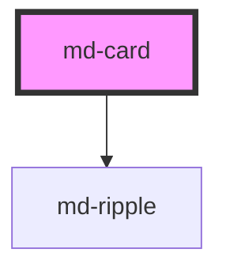

# md-card

<!-- llm:meta
tag: md-card
category: containment
status: md3-mapped
m3-guidelines: https://m3.material.io/components/cards/guidelines
form-associated: false
depends-on: md-ripple
used-by: none
-->

**A container for related content and actions about a single subject.** Three
variants (elevated, filled, outlined), an optional interactive mode with ripple
and state layers, and an optional pointer-drag gesture that reports movement but
never reorders anything itself.

> Setup, theming, density and i18n are configured once for the whole library —
> see the library-wide specification, shipped next to these manuals as
> `main-llm.md` at the root of the `@awc-ui/core` package.

---

## When to use

- Grouping **content and actions about one subject** — a product, an article, a
  contact — especially when several appear together as a collection.
- An entry point into a detail view (`interactive`).
- Reorderable tiles, where you own the reorder logic (`drag-enabled`).

## When NOT to use

| Situation | Use instead |
|---|---|
| A vertical list of records | `md-list` + `md-list-item` |
| A blocking decision | `md-dialog` |
| A transient message | `md-snackbar` |
| Content that spacing or a heading would organise better | Nothing — M3 warns against forcing content into cards |
| Collapsible sections | `md-accordion` |
| A single action | `md-button` |

## Decision cues

| Need | Setting |
|---|---|
| Default, subtly raised | `variant="elevated"` (default) |
| Flat, tonal surface | `variant="filled"` |
| Defined edge, no shadow | `variant="outlined"` |
| Whole card is one control | `interactive` (+ `mdClick`) |
| Interactive, but no ripple | `interactive ripple="false"` |
| Reorderable | `drag-enabled` (+ `mdDragStart` / `mdDragMove` / `mdDragEnd`) |
| Fill its grid cell | `full-width` / `full-height` |
| Cap a fluid card | `full-width` + `--md-card-max-width` |

## API contract

```html
<md-card
  variant="elevated|filled|outlined"   <!-- default: elevated -->
  interactive                          <!-- default: false -->
  drag-enabled                         <!-- default: false -->
  disabled                             <!-- default: false -->
  soft-disabled                        <!-- default: false -->
  ripple="true|false"                  <!-- default: true -->
  full-width                           <!-- default: false -->
  full-height                          <!-- default: false -->
  density="-1|-2|-3|-4"                <!-- default: 0 (uncompacted; only -1…-4 have rules) -->
>
  <h3>Headline</h3>
  <p>Supporting text</p>
</md-card>
```

**Events** — `mdClick` (`CustomEvent<MouseEvent>`), `mdDragStart` /
`mdDragMove` / `mdDragEnd` (`CustomEvent<MdCardDragDetail>`). All four are
default Stencil events, so they bubble and cross shadow boundaries.
`MdCardDragDetail` is `{ clientX, clientY, offsetX, offsetY, startX, startY }`,
where `offsetX`/`offsetY` are the distance travelled from the drag start point.

**Methods** — none.

**Slots** — one unnamed default slot. There are no named slots: the card is a
container, not a template, so media, headline and actions are your markup. The
host is `display: flex; flex-direction: column`, so slotted children stack and
are separated by `--md-card-gap`.

**Parts** — `state-layer` (rendered only when `interactive` or `drag-enabled`),
`outline` (rendered only for `variant="outlined"`).

### Behavioral contract worth knowing

- `mdClick` fires **only when `interactive` is set**. Without it the click
  handler returns immediately, so a plain card is inert.
- **The card decides its own `role`.** When `interactive` and the slotted
  content holds no focusable controls, the host sets `role="button"` and
  `tabindex="0"`, and Enter/Space activate it. Do not set `role` yourself —
  the render pass writes the attribute and will overwrite yours.
- **Focusable content demotes the card.** If the slotted content contains a
  focusable control (native `a[href]`, `button`, `input`, `select`,
  `textarea`, `[contenteditable]`, widget ARIA roles, or a library tag such as
  `md-button`, `md-icon-button`, `md-checkbox`, `md-switch`, `md-text-field`,
  `md-select`, `md-slider`, `md-chip`…), the host drops `role="button"` and
  `tabindex` to avoid a `nested-interactive` violation. It still emits
  `mdClick` on mouse click, but there is then **no keyboard path to the card
  action** — so either the card is the control, or its children are.
  The scan runs before first render and again on `slotchange` and on any
  light-DOM mutation, so it stays correct for content added later.
- `disabled` removes the card from the tab order (`tabindex="-1"`) and sets
  `pointer-events: none`.
- **`soft-disabled` is focusable but inert — not clickable.** It keeps
  `tabindex="0"` and still receives pointer events, but both the click handler
  and the keydown handler bail on `disabled || soft-disabled`, so a
  `soft-disabled` card emits **no `mdClick`** and does not activate on
  Enter / Space. Use it when the card must stay reachable and announceable
  (so a screen-reader user can find out why it is unavailable), not when you
  still want the action to run. Both flags also block the drag gesture.
- **The two flags mute the card differently.** The `disabled` look is gated on
  `interactive`: the host only gets its disabled class when
  `interactive && (disabled || soft-disabled)`, so `<md-card disabled>` or
  `<md-card drag-enabled disabled>` keeps its normal colours (the gesture is
  still blocked). The `soft-disabled` look is ungated — it comes from a plain
  `:host([soft-disabled])` rule — so even a bare `<md-card soft-disabled>`
  renders muted.
- **`drag-enabled` reports the gesture; it does not reorder anything.** The
  drag starts only after the pointer moves 5px (Manhattan distance) with the
  primary button held. While dragging, the component writes `transform` and
  `z-index: 1000` to the host's inline style and clears both on release, so the
  card snaps back to its original position — persisting a new order is yours.
- While dragging the card raises its own elevation (`elevation-4` elevated,
  `elevation-3` filled/outlined). You do not need to set elevation by hand.
- A click generated at the end of a drag is suppressed for one animation
  frame, so a drag never fires `mdClick`.
- `drag-enabled` also mirrors `aria-grabbed` (`"false"` at rest, `"true"` while
  dragging) onto the host.
- The host is `overflow: hidden` — a card never scrolls internally.

---

## Do / Don't

Sourced from [M3 · Cards · Guidelines](https://m3.material.io/components/cards/guidelines).

| ✅ Do | ❌ Don't |
|---|---|
| Show cards together as a collection | Don't force content into cards when spacing, headlines, or dividers would give a simpler hierarchy |
| Expand a card to reveal more information | Don't scroll **within** a card to reveal information |
| On mobile, let a card expand and the page scroll | Don't nest a scroller in a card — two scrollbars is the failure mode |
| Assign at most **one** swipe action to a card | Don't put swipeable content (carousels, pagination) inside a card, and don't let parts detach on swipe |
| Let elevation rise while a card is being moved | Don't let a dragged card bump other elements aside — it floats above everything except app bars and navigation |
| Ensure text over images meets contrast standards | Don't place text directly on a busy image without a bounding shape |
| Keep one subject per card | Don't mix unrelated content in one card |

---

## Patterns

```html
<!-- Content card with its own actions — NOT interactive -->
<md-card variant="elevated">
  
  <h3>Weekly report</h3>
  <p>Generated 2 hours ago.</p>
  <md-divider></md-divider>
  <md-button variant="text">Open</md-button>
  <md-button variant="text">Share</md-button>
</md-card>
```

```html
<!-- Interactive card: the WHOLE card is the control, so no inner controls -->
<md-card id="report-card" interactive variant="outlined"
         aria-label="Open weekly report">
  <h3>Weekly report</h3>
  <p>Generated 2 hours ago.</p>
</md-card>

<script type="module">
  document
    .getElementById('report-card')
    .addEventListener('mdClick', () => {
      window.location.href = '/reports/weekly';
    });
</script>
```

```html
<!-- Draggable tile — the card reports the gesture, you do the reordering -->
<md-card id="tile" drag-enabled>Tile A</md-card>

<script type="module">
  const tile = document.getElementById('tile');

  tile.addEventListener('mdDragMove', (e) => {
    // e.detail: { clientX, clientY, offsetX, offsetY, startX, startY }
    highlightDropZoneAt(e.detail.clientX, e.detail.clientY);
  });

  tile.addEventListener('mdDragEnd', (e) => {
    // The card has already snapped back — commit the new order yourself.
    commitReorder(e.detail.offsetX, e.detail.offsetY);
  });

  function highlightDropZoneAt() {}
  function commitReorder() {}
</script>
```

```html
<!-- Grid of equal-height cards, each capped at 360px -->
<div style="display: grid;
            grid-template-columns: repeat(auto-fill, minmax(240px, 1fr));
            gap: 16px;">
  <md-card full-width full-height style="--md-card-max-width: 360px;">
    <h3>One</h3>
  </md-card>
  <md-card full-width full-height style="--md-card-max-width: 360px;">
    <h3>Two</h3>
  </md-card>
</div>
```

## Anti-patterns

| ❌ Wrong | ✅ Right | Why |
|---|---|---|
| `interactive` card that also holds `md-button`s | Pick one: clickable card **or** card with actions | The host detects the focusable children and drops `role="button"`/`tabindex`, so the card action becomes mouse-only. |
| `<md-card interactive role="link">` | Let the card set its own `role` | Render writes `role="button"` on the host and overwrites the attribute. |
| Listening for `mdClick` on a card without `interactive` | Add `interactive` | The click handler returns early when `interactive` is false. |
| Setting `--md-card-container-elevation` on drag start | Nothing — the dragged state raises elevation itself | The `dragged` state rule sets the elevation directly and wins over the custom property. |
| `--md-card-container-elevation: 3` | `--md-card-container-elevation: var(--md-sys-elevation-3)` | The property is a `box-shadow` value, not an elevation number. |
| Expecting `drag-enabled` to reorder or to leave the card where it was dropped | Handle `mdDragEnd` and commit the order yourself | The component clears the inline `transform` on release. |
| `overflow: auto` on a card | Let the page scroll, or expand the card | The host is `overflow: hidden`; M3 says cards don't scroll internally. |
| Looking for `headline` / `media` / `actions` slots | Compose freely in the default slot | The card has no named slots. |
| `<md-card headline="…">` | Slot an `<h3>` | There is no `headline` prop. |
| A card per row of a plain list | `md-list` | Cards are heavy for simple rows. |
| `disabled` on a card that is not `interactive` | `interactive` + `disabled`, or `soft-disabled` when you only want the muted look | The disabled *styling* is gated on `interactive`; `drag-enabled` alone does not produce it (the drag gesture is still blocked either way). |
| Listening for `mdClick` on a `soft-disabled` card | Drop `soft-disabled`, or use plain `disabled` if it really is unavailable | The click and keydown handlers both return early on `soft-disabled`, so the card is focusable but emits nothing. |
| Text straight onto a photo | Add a scrim or bounding shape | M3 contrast caution. |
| Wrapping the card in an `<a href>` | Use `interactive` + `mdClick` | The focusable-content scan only looks at the card's own descendants, so an ancestor anchor never demotes it — you ship `role="button"` nested inside a link, a real nested-interactive violation. |

## Accessibility, RTL, density, i18n

**Accessibility**
- **Decide the interaction model once**: either the card is the control
  (`interactive`, with an `aria-label`, keyboard-activatable) or it is a
  container holding its own controls. The component enforces this by demoting
  its role when it finds focusable content, so trying to do both silently
  costs you the keyboard path.
- An `interactive` card needs a real accessible name — give it `aria-label`
  (or `aria-labelledby` pointing at an id in the same light-DOM tree). Its
  slotted text is not automatically a good name.
- Headings inside the card should fit the page's heading hierarchy.
- Text over images needs verified contrast; use a bounding shape or scrim.
- On a card that acts as a button (`interactive`, with no focusable slotted
  content), `disabled` sets `tabindex="-1"` and `aria-disabled="true"`, and
  `soft-disabled` sets `aria-disabled="true"` while keeping `tabindex="0"` —
  so screen-reader users can still reach it and are told it is unavailable.
  Neither attribute is written on a card that is not acting as a button.
- An `interactive` card shows a 3px `--md-sys-color-secondary` focus ring on
  `:focus-visible`.
- Drag is pointer-only — there is no keyboard drag. Always provide another way
  to reorder.

**RTL** — padding, sizing and content flow use logical properties
(`inline-size`, `block-size`, `padding`), so the card mirrors automatically.

**Density** — set `density="-1"` … `density="-4"` for a local rung, or inherit a
global `data-density` ancestor. Rung `0` is the uncompacted default and has no
rule of its own, so `density="0"` does **not** opt a card out of an inherited
rung; use `style="--md-sys-density-scale: 0"` to reset the scale locally.
Density drives the card's padding, gap, corner radius, font-size and
line-height.

**i18n** — all text is your slotted content. Translated text changes card
height; in a grid, prefer `full-height` so cards in a row stay even.

## Related components

`md-list` · `md-list-item` · `md-dialog` · `md-accordion` · `md-divider` ·
`md-button` · `md-ripple`

## Theming

| Custom property | Purpose | Default |
|---|---|---|
| `--md-card-container-color` | Container background | `--md-sys-color-surface-container-low` (elevated), `--md-sys-color-surface-container-highest` (filled), `--md-sys-color-surface` (outlined) |
| `--md-card-container-shape` | Corner radius | `--md-sys-shape-corner-medium`, falling back to `max(8px, 12px + density)` |
| `--md-card-container-elevation` | Resting `box-shadow` | `--md-sys-elevation-1` (elevated), `--md-sys-elevation-0` (filled, outlined) |
| `--md-card-outline-color` | `outlined` border colour | `--md-sys-color-outline-variant` |
| `--md-card-outline-width` | `outlined` border width | `1px` |
| `--md-card-state-layer-color` | Hover/press overlay colour | `--md-sys-color-on-surface` |
| `--md-card-width` | Explicit inline-size | `auto` (`100%` with `full-width`) |
| `--md-card-min-width` | Minimum inline-size | `auto` |
| `--md-card-max-width` | Maximum inline-size | `none` |
| `--md-card-height` | Explicit block-size | `auto` (`100%` with `full-height`) |
| `--md-card-min-height` | Minimum block-size | `auto` |
| `--md-card-max-height` | Maximum block-size | `none` |
| `--md-card-padding` | Internal padding | `max(8px, 16px + density × 2px)` |
| `--md-card-gap` | Gap between slotted children | `max(4px, 8px + density × 1px)` |

Hover, focus, pressed and dragged states set elevation directly and therefore
override `--md-card-container-elevation`; it controls the resting shadow.

**CSS parts** — `state-layer` (interactive/draggable only) and `outline`
(outlined only).

```css
md-card.dashboard-tile::part(outline) {
  border-style: dashed;
}

md-card.dashboard-tile {
  --md-card-container-color: var(--md-sys-color-surface-container);
  --md-card-max-width: 420px;
}
```

<!-- Auto Generated Below -->


## Properties

| Property       | Attribute       | Description                                                                                                                                                                                                                                                                                                                                                                                                                                                                                                                                                               | Type                                   | Default      |
| -------------- | --------------- | ------------------------------------------------------------------------------------------------------------------------------------------------------------------------------------------------------------------------------------------------------------------------------------------------------------------------------------------------------------------------------------------------------------------------------------------------------------------------------------------------------------------------------------------------------------------------- | -------------------------------------- | ------------ |
| `density`      | `density`       | Local density rung. Drives the same `--md-sys-density-scale` signal that a global `data-density` ancestor sets, so a local value simply overrides the inherited one. 0 = default, -4 = ultra-compact.                                                                                                                                                                                                                                                                                                                                                                     | `-1 \| -2 \| -3 \| -4 \| 0`            | `0`          |
| `disabled`     | `disabled`      | Disables the card — only meaningful when interactive                                                                                                                                                                                                                                                                                                                                                                                                                                                                                                                      | `boolean`                              | `false`      |
| `dragEnabled`  | `drag-enabled`  | Enables pointer-event-based drag on the card                                                                                                                                                                                                                                                                                                                                                                                                                                                                                                                              | `boolean`                              | `false`      |
| `fullHeight`   | `full-height`   | When `true` the card stretches to 100% of its container's block-size. The parent must have a definite block-size (e.g. a fixed height row in a CSS grid, or a flex item with `align-items: stretch`) for `100%` to resolve.                                                                                                                                                                                                                                                                                                                                               | `boolean`                              | `false`      |
| `fullWidth`    | `full-width`    | When `true` the card stretches to 100% of its container's inline-size. Pair with the `--md-card-max-width` custom property to cap the fluid width (useful inside dashboards and responsive grids).                                                                                                                                                                                                                                                                                                                                                                        | `boolean`                              | `false`      |
| `interactive`  | `interactive`   | Makes the card interactive (clickable, with ripple and state layers).  When the card's own content has no focusable controls the host exposes `role="button"` + `tabindex` and is keyboard-activatable. If the content *does* include its own focusable controls (buttons, links, form fields, interactive `md-*` components) the host does not claim `role="button"` — that would be a `nested-interactive` a11y violation — and instead stays a plain container that is still mouse-clickable (emits `mdClick`) while the inner controls remain the keyboard tab stops. | `boolean`                              | `false`      |
| `ripple`       | `ripple`        | Whether the ripple effect is enabled when interactive                                                                                                                                                                                                                                                                                                                                                                                                                                                                                                                     | `boolean`                              | `true`       |
| `softDisabled` | `soft-disabled` | Soft-disabled: disabled visuals but remains focusable — only meaningful when interactive                                                                                                                                                                                                                                                                                                                                                                                                                                                                                  | `boolean`                              | `false`      |
| `variant`      | `variant`       | Visual style variant                                                                                                                                                                                                                                                                                                                                                                                                                                                                                                                                                      | `"elevated" \| "filled" \| "outlined"` | `'elevated'` |


## Events

| Event         | Description                                                                                   | Type                            |
| ------------- | --------------------------------------------------------------------------------------------- | ------------------------------- |
| `mdClick`     | Emits when an interactive card is clicked or activated via keyboard                           | `CustomEvent<MouseEvent>`       |
| `mdDragEnd`   | Emits when a draggable card is released after dragging                                        | `CustomEvent<MdCardDragDetail>` |
| `mdDragMove`  | Emits continuously as a dragged card moves — use for drop-zone detection or position tracking | `CustomEvent<MdCardDragDetail>` |
| `mdDragStart` | Emits once when a draggable card starts being dragged (after crossing the movement threshold) | `CustomEvent<MdCardDragDetail>` |


## Shadow Parts

| Part            | Description |
| --------------- | ----------- |
| `"outline"`     |             |
| `"state-layer"` |             |


## Dependencies

### Depends on

- [md-ripple](../md-ripple)

### Graph


----------------------------------------------

*Built with [StencilJS](https://stenciljs.com/)*
