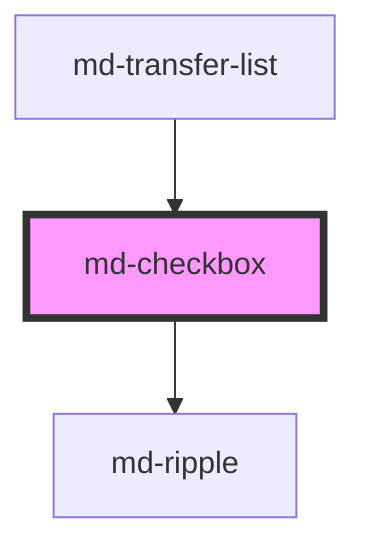

# md-checkbox

<!-- llm:meta
tag: md-checkbox
category: selection
status: md3-mapped
m3-guidelines: https://m3.material.io/components/checkbox/guidelines
form-associated: true
depends-on: md-ripple
used-by: md-transfer-list
-->

**Select none, one, or many from a related set.** Tri-state (checked /
unchecked / indeterminate), form-associated via `ElementInternals`, with the
full constraint-validation API and its own supporting/error line.

> Setup, theming, density and i18n are configured once for the whole library —
> see [`main-llm.md`](../../../../../main-llm.md) at the repo root.

---

## When to use

- Several **related** options where any number may be selected.
- A single opt-in that must be **submitted with a form** (terms, consent) —
  note this needs an explicit action to take effect, unlike a switch.
- A **parent/child** selection tree, using `indeterminate` for the partial
  state.

## When NOT to use

| Situation | Use instead |
|---|---|
| Exactly one option from a list | `md-radio` |
| A setting that takes effect **immediately** | `md-switch` |
| More than ~7 options, or space is tight | `md-multi-select` |
| Assigning a subset from a large pool | `md-transfer-list` |
| Filtering by removable criteria | `md-chip` |
| Two opposing choices (on/off framing) | `md-switch`, or `md-button-group` |
| Running an action | `md-button` |

## Decision cues

| Need | Setting |
|---|---|
| Partial selection of children | `indeterminate` (visual only — see contract) |
| Must be ticked to submit | `required` |
| Helper text under the box | `supporting-text` |
| Validation message under the box | `error` + `error-text` |
| Localized native "please check this box" | `value-missing-label` |
| Unavailable but still discoverable | `soft-disabled` |

## API contract

```html
<label>
  <md-checkbox
    name="terms" value="accepted"
    checked indeterminate
    required
    supporting-text="You can change this later"
    error error-text="You must accept to continue"
    value-missing-label="Please accept the terms."
    disabled | soft-disabled
    density="-1|-2|-3|-4"
  ></md-checkbox>
  I accept the terms
</label>
```

**Events**

| Event | Detail | Notes |
|---|---|---|
| `mdChange` | `{ checked, indeterminate }` | User activation only (click / `Space`). Bubbles and is composed |
| `mdValidityChange` | `{ valid, validationMessage, flags }` | Only when validity **changes**; `composed: false` — does **not** cross shadow boundaries |

**Methods** — all async: `getValidity()`, `checkValidity()`,
`reportValidity()`, `setCustomValidity(message)`.

**Slots** — none. The component renders no `<slot>`; the label is external
(wrap in `<label>`, or set `aria-label` / `aria-labelledby` on the host).

**Parts** — `target`, `state-layer`, `container`, `icon`, `supporting-text`.

### Behavioral contract worth knowing

- **It has no slot.** The label is not slotted content — wrap the checkbox in a
  `<label>`, or set `aria-label` / `aria-labelledby` on the host. A bare
  checkbox has **no accessible name** (axe `aria-toggle-field-name`).
- Form-associated: submits `value` (default `"on"`) under `name` **when
  checked**, and restores on form reset. Don't add a hidden `<input>`.
- `mdChange` fires for **user activation only**. Setting `checked` /
  `indeterminate` from script updates the control and the form value silently —
  so a script-driven change never re-enters your own `mdChange` handler.
- `disabled` and `soft-disabled` both block activation; `disabled` sets
  `tabindex="-1"` while `soft-disabled` keeps `tabindex="0"` so the control
  stays discoverable.
- `aria-hidden="true"` on the host makes the checkbox **decorative**: the
  `tabindex` attribute is dropped entirely so it leaves the tab order. Use this
  for a mirror glyph inside an interactive row that owns the real toggle.
- `indeterminate` is a **presentation state**: it never reaches the form
  (submission is decided by `checked` alone) and it does not survive a user
  click — clicking a mixed checkbox sets `checked = true`, `indeterminate =
  false`. Your parent-checkbox logic must recompute it.
- `mdValidityChange` is deliberately **not composed**, so a parent across a
  shadow boundary won't see it. Listen on the element itself.
- `error-text` exists because a checkbox otherwise has nowhere to show a failed
  `required` except the browser's transient balloon.
- `value-missing-label` is a prop, not a hardcoded string, so you localize it.
- **The mark is a Material Symbols glyph, not an SVG path** — `check` when
  checked, `remove` when `indeterminate`, at `FILL 1 / wght 600`. It is drawn
  with `--md-sys-icon-font-family` (default `Material Symbols Outlined`); if
  that font is not loaded the box renders the literal word `check`.
- **A message changes the host's box.** With `supporting-text` or `error-text`
  the host becomes a column — `[touch target, message]` — sized to the touch
  target, with the message overflowing horizontally. Two consequences:
  the message is inset to line up with the **visible box** rather than the
  wider touch target; and a bare text node beside the checkbox aligns to the
  *top of the touch target*, roughly 15px above the box. Wrap the label text
  and centre it against the target (see Patterns).

---

## Do / Don't

Sourced from [M3 · Checkbox · Guidelines](https://m3.material.io/components/checkbox/guidelines).

| ✅ Do | ❌ Don't |
|---|---|
| Use checkboxes to select one **or more** options from a list | Don't use switches for a list of options — checkboxes imply the items are related and use less space |
| Use a parent checkbox to select/deselect all items | Don't leave a parent checkbox out of sync with its children |
| Give every checkbox a real label | Don't ship an unlabelled checkbox |
| Keep the option set related and scoped | Don't mix unrelated settings into one checkbox list |
| Use `indeterminate` for genuinely partial parent state | Don't use `indeterminate` as a third user-selectable value |
| Put validation in `error-text` next to the control | Don't rely on the browser's validation balloon alone |
| Use `required` where consent is mandatory | Don't pre-check a consent box |

---

## Patterns

```html
<!-- Labelled (native label = accessible name + click target) -->
<label><md-checkbox name="news" value="yes"></md-checkbox> Email me updates</label>

<!-- WITH a message: the host stacks [touch target, message], so give the label
     text the target's height and centre it, or it sits ~15px above the box. -->
<label style="display: inline-flex; align-items: flex-start; gap: 8px;">
  <md-checkbox supporting-text="You can change this later"></md-checkbox>
  <span style="display: flex; align-items: center; min-block-size: 48px;">Email me updates</span>
</label>

<!-- Parent / child with indeterminate -->
<label><md-checkbox id="all"></md-checkbox> Select all</label>
<label><md-checkbox class="child" value="a"></md-checkbox> Analytics</label>
<label><md-checkbox class="child" value="b"></md-checkbox> Billing</label>

<script type="module">
  const all = document.getElementById('all');
  const kids = [...document.querySelectorAll('.child')];

  const sync = () => {
    const n = kids.filter(k => k.checked).length;
    all.checked = n === kids.length;
    all.indeterminate = n > 0 && n < kids.length;   // recompute — a click clears it
  };

  kids.forEach(k => k.addEventListener('mdChange', sync));
  all.addEventListener('mdChange', () => {
    kids.forEach(k => (k.checked = all.checked));
    all.indeterminate = false;
  });
  sync();
</script>

<!-- Required consent in a form -->
<form>
  <label style="display: inline-flex; align-items: flex-start; gap: 8px;">
    <md-checkbox name="terms" value="accepted" required
                 value-missing-label="Please accept the terms."
                 error-text="You must accept to continue"></md-checkbox>
    <span style="display: flex; align-items: center; min-block-size: 48px;">I accept the terms</span>
  </label>
  <md-button type="submit">Continue</md-button>
</form>

<!-- Server-side validation (the methods are async) -->
<md-checkbox id="region" name="region"></md-checkbox>
<script type="module">
  const cb = document.getElementById('region');
  await cb.setCustomValidity('This option is unavailable in your region');
  // clear with: await cb.setCustomValidity('')
</script>
```

## Anti-patterns

| ❌ Wrong | ✅ Right | Why |
|---|---|---|
| `<md-checkbox>Label</md-checkbox>` | Wrap in `<label>`, or use `aria-label` | There is **no default slot** — the text won't render. |
| A hidden `<input>` mirroring the value | Use `name` + `value` | It's form-associated; the mirror double-submits. |
| Expecting `indeterminate` to persist through a click | Recompute it in your handler | Clicking resolves to checked/unchecked. |
| Listening for `mdValidityChange` on an ancestor across a shadow root | Listen on the element | `composed: false` by design. |
| A switch for a list of related options | `md-checkbox` | M3 states this directly. |
| A checkbox for a setting that applies instantly | `md-switch` | Checkboxes imply a submit step. |
| Ten checkboxes in a form | `md-multi-select` | Past ~7 the list dominates the layout. |
| Both `supporting-text` and `error-text` visible at once | Swap supporting → error | Showing both shifts layout (M3 text-field rule, same logic). |
| Pre-checked consent | Leave it unchecked | Consent must be an affirmative act. |
| Hardcoded English `value-missing-label` in a localized app | Feed it from your dictionary | It's a prop precisely so you can. |
| A bare text node next to a checkbox that has a message | Wrap it and centre it on the touch target | With a message the host stacks, so the text aligns to the target's top, ~15px above the box. |

## Accessibility, RTL, density, i18n

**Accessibility**
- Wrapping in `<label>` gives both the accessible name and a larger hit target —
  the preferred pattern. Otherwise `aria-label` / `aria-labelledby`.
- Tri-state is exposed as `aria-checked="mixed"` when `indeterminate`.
- `disabled` leaves the tab order; `soft-disabled` stays focusable.
- Errors surface in `error-text` next to the control, not only in a transient
  browser balloon.
- `--md-checkbox-touch-target-size` keeps the hit area ≥48px even when the
  visual box shrinks with density — don't set it below that on touch.
- The message line is inset by `(touch-size − container-size) / 2` so it lines
  up with the visible box at every density rung and any custom touch-target
  size, rather than with the wider invisible target.

**RTL** — the control mirrors automatically; the label side follows the
document direction.

**Density** — `density="-1…-4"` locally overrides the inherited `data-density`
rung; rung `0` is the uncompacted default and is inert, so it is not an opt-out
from an ancestor rung (for that, set `style="--md-sys-density-scale: 0"`). Each
rung trims 1px off the box and icon (18px → 14px floor) and 4px off the touch
target (48px → 32px floor); the state layer is `min(40px, touch)` so it never
exceeds the target. Watch the touch target at deep rungs.

**i18n** — translate `supporting-text`, `error-text`, `value-missing-label`, and
the visible label text.

## Related components

`md-radio` · `md-switch` · `md-multi-select` · `md-transfer-list` ·
`md-chip` · `md-ripple`

## Theming

| Custom property | Purpose | Default |
|---|---|---|
| `--md-checkbox-container-color` | Box fill when unselected | `transparent` |
| `--md-checkbox-selected-container-color` | Box fill when checked / indeterminate | `--md-sys-color-primary` |
| `--md-checkbox-outline-color` | Box border colour | `--md-sys-color-on-surface-variant` |
| `--md-checkbox-outline-width` | Box border width | `2px` |
| `--md-checkbox-icon-color` | Checkmark / dash colour | `--md-sys-color-on-primary` |
| `--md-checkbox-icon-size` | Glyph box | `max(14px, 18px + density * 1px)` |
| `--md-checkbox-container-shape` | Box corner radius | `2px` |
| `--md-checkbox-container-size` | Visible box size | `max(14px, 18px + density * 1px)` |
| `--md-checkbox-touch-target-size` | Hit area before density trim (keep >= 48px on touch) | `48px` |
| `--md-checkbox-state-layer-size` | Hover/press overlay diameter | `min(40px, touch target)` |
| `--md-checkbox-state-layer-color` | Overlay colour, unselected | `--md-sys-color-on-surface` |
| `--md-checkbox-selected-state-layer-color` | Overlay colour, selected | `--md-sys-color-primary` |
| `--md-checkbox-supporting-text-color` | `supporting-text` colour | `--md-sys-color-on-surface-variant` |
| `--md-checkbox-error-text-color` | `error-text` colour | `--md-sys-color-error` |

**CSS parts** — `target`, `state-layer`, `container`, `icon`,
`supporting-text`.

```css
md-checkbox.brand {
  --md-checkbox-selected-container-color: var(--md-sys-color-tertiary);
  --md-checkbox-icon-color: var(--md-sys-color-on-tertiary);
}
```

<!-- Auto Generated Below -->


## Overview

`md-checkbox` — Material Design 3 checkbox (with tri-state / indeterminate).

Form-associated: inside a `<form>` it submits its `value` under `name` when
checked, and restores on form reset. It is a *labelable* element — wrap it in
a `<label>` (clicks on the label text toggle it AND give it its accessible
name natively), or pass `aria-label` / `aria-labelledby` on the host. A bare,
unlabeled checkbox has no accessible name (axe `aria-toggle-field-name`).

## Properties

| Property            | Attribute             | Description                                                                                                                                                                                                                                                                                                                                                                                                                                                                                                    | Type                        | Default                                           |
| ------------------- | --------------------- | -------------------------------------------------------------------------------------------------------------------------------------------------------------------------------------------------------------------------------------------------------------------------------------------------------------------------------------------------------------------------------------------------------------------------------------------------------------------------------------------------------------- | --------------------------- | ------------------------------------------------- |
| `checked`           | `checked`             | Whether the checkbox is checked                                                                                                                                                                                                                                                                                                                                                                                                                                                                                | `boolean`                   | `false`                                           |
| `density`           | `density`             | Local density rung. Drives the same `--md-sys-density-scale` signal that a global `data-density` ancestor sets, so a local value simply overrides the inherited one. 0 = default, -4 = ultra-compact.                                                                                                                                                                                                                                                                                                          | `-1 \| -2 \| -3 \| -4 \| 0` | `0`                                               |
| `disabled`          | `disabled`            | Disables the checkbox                                                                                                                                                                                                                                                                                                                                                                                                                                                                                          | `boolean`                   | `false`                                           |
| `error`             | `error`               | Show the supporting line in the error colour.                                                                                                                                                                                                                                                                                                                                                                                                                                                                  | `boolean`                   | `false`                                           |
| `errorText`         | `error-text`          | Supporting / error message shown beneath the control.  A checkbox previously had nowhere to put a message, so a failed `required` could only surface as the browser's own validation balloon — visually unrelated to the field, and gone the moment you click away. This gives it the same inline supporting line md-text-field has.  The host is a fixed-size touch target, so the line is positioned OUT of that box rather than laid out inside it; see the CSS for why that cannot simply be a flex child. | `string`                    | `''`                                              |
| `indeterminate`     | `indeterminate`       | Whether the checkbox is in the indeterminate (mixed) state                                                                                                                                                                                                                                                                                                                                                                                                                                                     | `boolean`                   | `false`                                           |
| `name`              | `name`                | Form name                                                                                                                                                                                                                                                                                                                                                                                                                                                                                                      | `string`                    | `''`                                              |
| `required`          | `required`            | Whether the checkbox is required in a form                                                                                                                                                                                                                                                                                                                                                                                                                                                                     | `boolean`                   | `false`                                           |
| `softDisabled`      | `soft-disabled`       | Soft-disabled: disabled visuals but remains focusable for discoverability                                                                                                                                                                                                                                                                                                                                                                                                                                      | `boolean`                   | `false`                                           |
| `supportingText`    | `supporting-text`     | Supporting text shown when there is no error.                                                                                                                                                                                                                                                                                                                                                                                                                                                                  | `string`                    | `''`                                              |
| `value`             | `value`               | Form value submitted when checked                                                                                                                                                                                                                                                                                                                                                                                                                                                                              | `string`                    | `'on'`                                            |
| `valueMissingLabel` | `value-missing-label` | Localized constraint-validation message shown when `required` is unmet.  A prop rather than a hardcoded string, matching md-time-picker's `value-missing-label`: components stay i18n-engine-agnostic and the consumer localizes through its own dictionary. Native inputs get their message from the browser's locale for free; a form-associated custom element supplies its own, so leaving this hardcoded would ship an English-only form to every locale.                                                 | `string`                    | `'Please check this box if you want to proceed.'` |


## Events

| Event              | Description                                                                                                                                                                                                                                                                                                                                                                                                                                                                                                                                                              | Type                                                                                          |
| ------------------ | ------------------------------------------------------------------------------------------------------------------------------------------------------------------------------------------------------------------------------------------------------------------------------------------------------------------------------------------------------------------------------------------------------------------------------------------------------------------------------------------------------------------------------------------------------------------------ | --------------------------------------------------------------------------------------------- |
| `mdChange`         | Emits when checked or indeterminate state changes                                                                                                                                                                                                                                                                                                                                                                                                                                                                                                                        | `CustomEvent<{ checked: boolean; indeterminate: boolean; }>`                                  |
| `mdValidityChange` | Fires when this control's validity CHANGES — never on every keystroke, and never for a re-publish that lands on the same state.  `composed: false` is deliberate. Composites like md-select embed an md-text-field, and a composed event escapes that inner shadow root, so a listener on md-select would receive the inner field's event as well as the host's — two events, different payloads, for one logical control. Keeping it uncomposed means each component reports only for itself, while `bubbles: true` still lets a <form> or app root hear every control. | `CustomEvent<{ valid: boolean; validationMessage: string; flags: Record<string, boolean>; }>` |


## Methods

### `checkValidity() => Promise<boolean>`

Constraint-validation API, matching md-text-field and the native contract.

#### Returns

Type: `Promise<boolean>`


### `getValidity() => Promise<{ valid: boolean; validationMessage: string; flags: Record<string, boolean>; }>`

Current validity: boolean, message and flags. Mirrors md-text-field.

#### Returns

Type: `Promise<{ valid: boolean; validationMessage: string; flags: Record<string, boolean>; }>`


### `reportValidity() => Promise<boolean>`

Like checkValidity(), but also shows the browser's validation message.

#### Returns

Type: `Promise<boolean>`


### `setCustomValidity(message: string) => Promise<void>`

App/server-side validation: a non-empty message marks the control invalid
for its form until cleared with an empty string.

#### Parameters

| Name      | Type     | Description |
| --------- | -------- | ----------- |
| `message` | `string` |             |

#### Returns

Type: `Promise<void>`


## Shadow Parts

| Part                | Description                        |
| ------------------- | ---------------------------------- |
| `"container"`       | Box container that holds the icon  |
| `"icon"`            | Material Symbols glyph: `check`, or `remove` when indeterminate |
| `"state-layer"`     | State-layer overlay                |
| `"supporting-text"` | The message line (`supporting-text` / `error-text`) |
| `"target"`          | The 48px touch target that clips the ripple |


## Dependencies

### Used by
 - [md-transfer-list](../md-transfer-list)

### Depends on

- [md-ripple](../md-ripple)

### Graph


----------------------------------------------

*Built with [StencilJS](https://stenciljs.com/)*
