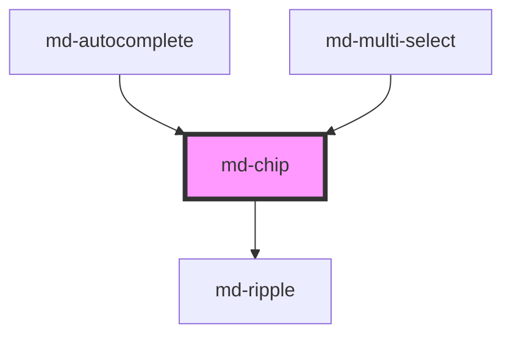

# md-chip

<!-- llm:meta
tag: md-chip
category: selection
status: md3-mapped
m3-guidelines: https://m3.material.io/components/chips/guidelines
form-associated: false
depends-on: md-ripple
used-by: md-autocomplete, md-multi-select
-->

**A compact, contextual option — always part of a set.**
Four semantic variants (assist / filter / input / suggestion) cross with three
surface appearances (outlined / filled / elevated), plus theme colour roles,
optional selection and optional removal.

> Setup, theming, density and i18n are configured once for the whole library —
> see [`main-llm.md`](../../../../../main-llm.md) at the repo root.

---

## When to use

- **Filters** over a result set (`variant="filter"`).
- **Entered values** the user can remove — recipients, tags (`variant="input"`).
- **Suggestions** the user can accept (`variant="suggestion"`).
- **Contextual, supplemental actions** related to nearby content
  (`variant="assist"`).

## When NOT to use

| Situation | Use instead |
|---|---|
| The primary or final action in a task | `md-button` |
| Moving to the next/previous step | `md-button` |
| A single standalone option | Nothing — M3: chips must appear in a set |
| Exclusive choice among 2–5 visible options | `md-segmented-button-set` |
| A long list of selectable values | `md-multi-select` |
| A status label that isn't interactive | `md-badge` / `md-status-dot` |
| Navigation | `md-tabs` / `md-navigation-bar` |
| A filter with only one possible value | Nothing — M3: filter chips need >1 option |

## Decision cues

| Variant | Purpose | Defaults it implies |
|---|---|---|
| `assist` (default) | A contextual action tied to nearby content | Not selectable, not removable |
| `filter` | Toggle a filter on/off | Selectable; shows a checkmark when selected with no leading icon |
| `input` | A value the user entered | Selectable **and** removable |
| `suggestion` | A recommendation to accept | Not selectable, not removable |

| Need | Setting |
|---|---|
| Standard look on a normal background | `appearance="outlined"` (default) |
| More weight | `appearance="filled"` |
| Sitting on an image | `appearance="elevated"` |
| A theme colour role | `color="primary\|secondary\|tertiary\|error\|success\|warning\|info"` |
| A remove "✕" on a non-input chip | `removable` |
| Suppress the input chip's ✕ | `removable="false"` |
| A display-only token whose ✕ is the only action | `selectable="false"` + `removable` |
| Turn off toggling on a filter chip | `selectable="false"` |

## API contract

```html
<md-chip
  variant="assist|filter|input|suggestion"    <!-- default: assist -->
  appearance="outlined|filled|elevated"       <!-- default: outlined -->
  color="primary|secondary|tertiary|error|success|warning|info"  <!-- default: none -->
  label="Unread"                              <!-- default: "" -->
  icon="mail"                                 <!-- default: "" — leading glyph -->
  trailing-icon="expand_more"                 <!-- default: "" -->
  selectable="true|false"                     <!-- default: derived from variant -->
  selected                                    <!-- default: false -->
  removable="true|false"                      <!-- default: derived from variant -->
  disabled                                    <!-- default: false -->
  soft-disabled                               <!-- default: false -->
  density="-1|-2|-3|-4"                       <!-- default: 0 (uncompacted) -->
></md-chip>
```

**Deprecated — don't emit it:** `elevated` (boolean). It is an alias that
forces `appearance="elevated"` and **wins over** an explicit `appearance`.
Write `appearance="elevated"` instead.

**Events** — all three bubble, are composed, and are dispatched with
`event.cancelable === true` (the framework default). Only `mdRemove` has a
**default action** for `preventDefault()` to cancel; calling it on the other two
does nothing.

| Event | Default action (cancelable) | Detail | Fires |
|---|---|---|---|
| `mdClick` | none | `void` | Chip body activated (click, Enter, Space), unless disabled |
| `mdSelect` | none | `{ selected }` | Selection toggled — only when the chip is selectable |
| `mdRemove` | **the chip removes itself from the DOM** | `void` | Remove ✕ used, or Delete/Backspace on a removable chip |

**Methods** — none.

**Slots** — `(default)`: label content, an alternative to `label`;
`leading-icon`: replaces the `icon` glyph; `trailing-icon`: replaces the
trailing glyph — and on a **removable** chip it replaces the ✕ artwork
*inside* the remove button rather than sitting beside it.

**Parts** — `state-layer`, `outline` (not rendered when the deprecated
`elevated` boolean is set), `primary`, `checkmark`, `icon`, `label`, `remove`,
`trailing-icon`.

### Behavioral contract worth knowing

- **`mdRemove` removes the chip.** The default action of the event is
  `this.el.remove()`. Call `event.preventDefault()` to keep the chip mounted —
  that is the hook for a confirmation step, or for when your state layer owns
  the list and will re-render without it. Do **not** also call `chip.remove()`
  in the handler; that is the default.
- `selectable` and `removable` are **tri-state** (`undefined` by default): left
  unset they are derived from `variant` — `filter` and `input` chips select,
  `input` chips remove. Set them explicitly only to override that.
- **The host role changes with the composition.** A chip whose body is
  interactive and which has **no** remove button is a single `role="button"`
  host with `tabindex` and `aria-pressed`. Add a remove button and the host
  steps down to `role="group"` with an `aria-label`, and the body action moves
  to an inner `part="primary"` element — so the chip then has **two** tab stops
  (body, then ✕), not one. `aria-roledescription="chip"` is present either way.
- `selectable="false"` **together with** `removable` makes the host a labelled
  `group` whose only tab stop is the ✕ — the display-token shape used by
  `md-multi-select`.
- `color` takes a **theme role name**, not a colour value. It is validated
  against `/^[a-z][a-z0-9-]*$/i` and expanded into
  `--md-sys-color-<name>` / `-<name>-container` / `--md-sys-color-on-<name>` /
  `-on-<name>-container`. A hex, `rgb()`, or any other CSS colour is rejected
  and the chip renders neutral. A role your theme does not define also falls
  back rather than breaking.
- The filter checkmark renders only for `variant="filter"` when `selected` and
  there is **no** leading icon — a leading icon takes the slot instead.
- `disabled` sets `tabindex="-1"` on the interactive elements and blocks
  activation; `soft-disabled` keeps `tabindex="0"` but blocks activation too.
- The accessible name for the ✕ button is generated as `Remove {label}`, where
  the label is `label` or the chip's own text content — you do not need to
  supply one.
- The chip does not manage a set: wrapping, scrolling and overflow are yours.

---

## Do / Don't

Sourced from [M3 · Chips · Guidelines](https://m3.material.io/components/chips/guidelines).

| ✅ Do | ❌ Don't |
|---|---|
| Use chips for contextual, supplemental options | Avoid replacing major actions with chips |
| Use buttons for the final step in a task | Avoid using chips to finish or progress a task |
| Show chips in a **set** | Don't display a single chip by itself |
| Let a chip set scroll horizontally when it overflows | Don't wrap a long set into a wall of chips without thought |
| Use an outline on regular backgrounds | Don't elevate chips placed directly on the page |
| Use elevation only when the chip sits on an image | Don't use elevation to indicate the pressed state — the ripple does that |
| Keep labels short | Avoid labels longer than about 20 characters |
| Offer more than one option in a filter set | Filter chips shouldn't present only a single option |
| In compact windows, make the **whole chip** open its menu | Don't shrink the target to just the trailing icon |

---

## Patterns

```html
<!-- Filter set -->
<div role="group" aria-label="Filters" style="display: flex; gap: 8px;">
  <md-chip variant="filter" label="Unread"></md-chip>
  <md-chip variant="filter" label="Starred" selected></md-chip>
  <md-chip variant="filter" label="Has attachment"></md-chip>
</div>

<script type="module">
  document.querySelectorAll('md-chip[variant="filter"]').forEach((chip) => {
    chip.addEventListener('mdSelect', (e) => applyFilter(chip.label, e.detail.selected));
  });
</script>
```

```html
<!-- Input chips: the chip removes itself, you just sync your model -->
<md-chip id="recipient" variant="input" label="alice@example.com"></md-chip>

<script type="module">
  const chip = document.getElementById('recipient');
  chip.addEventListener('mdRemove', () => {
    // The chip is about to remove itself from the DOM — drop it from state too.
    recipients.delete(chip.label);
  });
</script>
```

```html
<!-- Confirm before removing: preventDefault keeps the chip mounted -->
<md-chip id="tag" variant="input" label="urgent"></md-chip>

<script type="module">
  const chip = document.getElementById('tag');
  chip.addEventListener('mdRemove', (e) => {
    if (!confirm('Remove this tag?')) {
      e.preventDefault();   // chip stays in the DOM
    }
  });
</script>
```

```html
<!-- Assist chip with a leading icon -->
<md-chip variant="assist" label="Directions" icon="directions"></md-chip>

<!-- Theme colour roles -->
<md-chip label="Overdue" color="error" appearance="filled"></md-chip>
<md-chip label="Paid" color="success"></md-chip>

<!-- On imagery -->
<md-chip label="Featured" appearance="elevated"></md-chip>

<!-- Display-only token: only the ✕ is interactive -->
<md-chip variant="input" label="alice@example.com" selectable="false" removable></md-chip>

<!-- Horizontally scrolling set -->
<div role="group" aria-label="Tags" style="display: flex; gap: 8px; overflow-x: auto;">
  <md-chip variant="filter" label="Design"></md-chip>
  <md-chip variant="filter" label="Engineering"></md-chip>
</div>
```

## Anti-patterns

| ❌ Wrong | ✅ Right | Why |
|---|---|---|
| Calling `chip.remove()` inside an `mdRemove` handler | Just update your state | Removal is the event's default action; doing it twice is redundant. |
| Expecting the chip to stay after `mdRemove` | `event.preventDefault()` to keep it | Otherwise the chip removes itself. |
| `preventDefault()` on `mdSelect` or `mdClick` | Set `selected` back yourself | They report `cancelable: true` but have no default action, so cancelling them is a no-op — only `mdRemove` has one. |
| `color="#ff0000"` | `color="error"`, or set `--md-chip-container-color` | `color` is a theme **role name**; a hex is rejected and the chip renders neutral. |
| `elevated` | `appearance="elevated"` | `elevated` is deprecated and overrides `appearance`. |
| `aria-label="Remove"` on the chip to name the ✕ | Set `label` (or slot text) | The remove button is already named `Remove {label}`. |
| Assuming a removable chip is one tab stop | Expect two: body, then ✕ | A remove button forces the host down to `role="group"`. |
| A lone chip as a call to action | `md-button` | M3: chips appear in sets; actions are buttons. |
| "Next"/"Submit" as a chip | `md-button` | M3: don't progress tasks with chips. |
| `appearance="elevated"` on a plain page | `outlined` | Elevation is for chips over imagery. |
| Elevation as the pressed state | Let the ripple show press | M3 explicit rule. |
| A 40-character chip label | Keep under ~20 characters | M3 explicit rule. |
| A filter set containing one chip | Show the real options, or drop the filter | M3 explicit rule. |
| Only the trailing ✕ clickable on mobile | Make the whole chip the target | M3 compact-window caution. |
| `md-chip` for a non-interactive status | `md-badge` / `md-status-dot` | Chips imply interactivity. |

## Accessibility, RTL, density, i18n

**Accessibility**
- Wrap a set in a container with `role="group"` and an `aria-label` describing
  what the set filters or holds — the chip does not create the set.
- Selection is conveyed by the checkmark as well as by colour, and by
  `aria-pressed` on the interactive element.
- The remove button's accessible name (`Remove {label}`) is generated for you,
  so give every removable chip a real `label` or text content.
- `disabled` leaves the tab order (`tabindex="-1"`); `soft-disabled` stays
  focusable so the option remains discoverable. Both block activation and set
  `aria-disabled="true"`.
- A removable chip has two tab stops. Don't wrap it in another interactive
  element — nested interactive controls fail automated a11y checks.
- Keep the whole chip as the hit target on touch.

**RTL** — the leading/trailing regions use logical properties and mirror under
`dir="rtl"`. Directional glyphs passed to `icon` / `trailing-icon` still need
swapping by you.

**Density** — `density="-1…-4"` (or an inherited `data-density` rung) reduces
height, label size and icon size via `--md-sys-density-scale`; height floors at
24px. Rung `0` is the uncompacted default and has no rule of its own. To pin
one chip back to full size under a global rung, set
`style="--md-sys-density-scale: 0"` on it. Check the touch target and that
labels don't clip at deep rungs.

**i18n** — translate `label`. Note that the remove button's accessible name is
built as the English word `Remove` plus your label, and the component exposes no
prop to change that verb; in a non-English UI, name the surrounding group so the
context is still clear. Translated labels run longer than M3's ~20-character
guidance — plan for scrolling or truncation.

## Related components

`md-button` · `md-segmented-button-set` · `md-multi-select` · `md-autocomplete` ·
`md-badge` · `md-status-dot` · `md-menu` · `md-ripple`

## Theming

| Custom property | Purpose | Default |
|---|---|---|
| `--md-chip-container-color` | Container fill | `transparent` (outlined); role/surface tone for filled & elevated |
| `--md-chip-container-color-selected` | Fill while selected | `--md-sys-color-secondary-container` |
| `--md-chip-label-color` | Label colour | `--md-sys-color-on-surface-variant` |
| `--md-chip-label-color-selected` | Label colour while selected | `--md-sys-color-on-secondary-container` |
| `--md-chip-icon-color` | Leading / trailing glyph colour | `--md-sys-color-primary` (varies by variant) |
| `--md-chip-icon-size` | Glyph box | `max(14px, 18px + density × 1px)` |
| `--md-chip-container-shape` | Corner radius | `--md-sys-shape-corner-small` (`8px`) |
| `--md-chip-container-height` | Base height before the density trim | `32px` |
| `--md-chip-outline-color` | Outline colour | `--md-sys-color-outline` |
| `--md-chip-outline-width` | Outline width | `1px` |
| `--md-chip-state-layer-color` | Hover / press overlay | `--md-sys-color-on-surface` |
| `--md-chip-elevation` | Box-shadow | `--md-sys-elevation-0`; `--md-sys-elevation-1` for `elevated` |

**CSS parts** — `state-layer`, `outline`, `primary`, `checkmark`, `icon`,
`label`, `remove`, `trailing-icon`.

```css
md-chip.brand {
  --md-chip-outline-color: var(--md-sys-color-tertiary);
  --md-chip-label-color: var(--md-sys-color-tertiary);
}
```

<!-- Auto Generated Below -->


## Properties

| Property       | Attribute       | Description                                                                                                                                                                                                                                                                                                                                                                                                                                                                                                                                                                                                                                                                                                                                                                          | Type                                                                                                                | Default      |
| -------------- | --------------- | ------------------------------------------------------------------------------------------------------------------------------------------------------------------------------------------------------------------------------------------------------------------------------------------------------------------------------------------------------------------------------------------------------------------------------------------------------------------------------------------------------------------------------------------------------------------------------------------------------------------------------------------------------------------------------------------------------------------------------------------------------------------------------------ | ------------------------------------------------------------------------------------------------------------------- | ------------ |
| `appearance`   | `appearance`    | Surface style of the chip. Distinct from `variant`, which selects the M3 chip TYPE (assist / filter / input / suggestion); a chip has both.  - `outlined` (default) — transparent container with a 1px outline. - `filled` — tonal container, no outline. - `elevated` — tonal container with elevation and no outline.                                                                                                                                                                                                                                                                                                                                                                                                                                                              | `"elevated" \| "filled" \| "outlined"`                                                                              | `'outlined'` |
| `color`        | `color`         | Colour role applied to the chip's outline / label / container, depending on `appearance`. Omit for the neutral surface treatment.  Any role name the THEME defines is accepted, not just a fixed list — the chip resolves `<name>` to the `--md-sys-color-<name>` / `-<name>-container` / `-on-<name>-container` family at runtime. So `color="brand"` works as soon as a theme ships those tokens, and a name the theme does not define degrades to the neutral treatment rather than rendering broken.  `primary` \| `secondary` \| `tertiary` \| `error` are the baseline M3 roles; `success` \| `warning` \| `info` ship in packages/tokens on the same tonal recipe. The union below is a hint for editor autocomplete only — the `string` arm is what makes custom roles work. | `"error" \| "info" \| "primary" \| "secondary" \| "success" \| "tertiary" \| "warning" \| string & {} \| undefined` | `undefined`  |
| `density`      | `density`       | Local density rung. Drives the same `--md-sys-density-scale` signal that a global `data-density` ancestor sets, so a local value simply overrides the inherited one. 0 = default, -4 = ultra-compact.                                                                                                                                                                                                                                                                                                                                                                                                                                                                                                                                                                                | `-1 \| -2 \| -3 \| -4 \| 0`                                                                                         | `0`          |
| `disabled`     | `disabled`      | Disables the chip                                                                                                                                                                                                                                                                                                                                                                                                                                                                                                                                                                                                                                                                                                                                                                    | `boolean`                                                                                                           | `false`      |
| `elevated`     | `elevated`      | <span style="color:red">**[DEPRECATED]**</span> Use `appearance="elevated"`. Kept as an alias so existing markup keeps working: when true it forces the elevated appearance and wins over `appearance`, since a consumer setting it is being explicit.<br/><br/>Whether the chip is elevated (adds shadow instead of outline).                                                                                                                                                                                                                                                                                                                                                                                                                                                       | `boolean`                                                                                                           | `false`      |
| `icon`         | `icon`          | Material Symbols icon name for the leading icon                                                                                                                                                                                                                                                                                                                                                                                                                                                                                                                                                                                                                                                                                                                                      | `string`                                                                                                            | `''`         |
| `label`        | `label`         | Label text — alternative to default slot                                                                                                                                                                                                                                                                                                                                                                                                                                                                                                                                                                                                                                                                                                                                             | `string`                                                                                                            | `''`         |
| `removable`    | `removable`     | When `true`, the chip renders a trailing remove ("✕") button and responds to Delete / Backspace from the chip itself. Works on every variant.  `variant="input"` is removable by default (per MD3 spec) — setting `removable="false"` explicitly opts out of that behavior.                                                                                                                                                                                                                                                                                                                                                                                                                                                                                                          | `boolean \| undefined`                                                                                              | `undefined`  |
| `selectable`   | `selectable`    | Whether clicking the chip body toggles `selected`. Defaults to true for `filter`/`input` variants. Set `selectable="false"` for a token that is only a display of a value (e.g. a multi-select's removable chips) — clicking the body then does nothing and the ✕ remove button is the only action, so the chip doesn't flash a misleading "active" state.                                                                                                                                                                                                                                                                                                                                                                                                                           | `boolean \| undefined`                                                                                              | `undefined`  |
| `selected`     | `selected`      | Whether the chip is selected (filter/input variants)                                                                                                                                                                                                                                                                                                                                                                                                                                                                                                                                                                                                                                                                                                                                 | `boolean`                                                                                                           | `false`      |
| `softDisabled` | `soft-disabled` | Soft-disabled: disabled visuals but remains focusable                                                                                                                                                                                                                                                                                                                                                                                                                                                                                                                                                                                                                                                                                                                                | `boolean`                                                                                                           | `false`      |
| `trailingIcon` | `trailing-icon` | Material Symbols icon name for the trailing icon (filter/input only)                                                                                                                                                                                                                                                                                                                                                                                                                                                                                                                                                                                                                                                                                                                 | `string`                                                                                                            | `''`         |
| `variant`      | `variant`       | Chip variant                                                                                                                                                                                                                                                                                                                                                                                                                                                                                                                                                                                                                                                                                                                                                                         | `"assist" \| "filter" \| "input" \| "suggestion"`                                                                   | `'assist'`   |


## Events

| Event      | Description                                                                                                                                                                                                                                                                                                                                                                                       | Type                                  |
| ---------- | ------------------------------------------------------------------------------------------------------------------------------------------------------------------------------------------------------------------------------------------------------------------------------------------------------------------------------------------------------------------------------------------------- | ------------------------------------- |
| `mdClick`  | Emits when the chip is clicked or activated via keyboard                                                                                                                                                                                                                                                                                                                                          | `CustomEvent<void>`                   |
| `mdRemove` | Fires when the trailing remove ("✕") button is activated on a removable chip (by click, Enter, Space, Delete, or Backspace).  The event is **cancelable**: by default, after `mdRemove` is dispatched the chip removes itself from the DOM. Call `event.preventDefault()` in a handler to keep the chip mounted (e.g. when your state layer owns the list and will re-render with the chip gone). | `CustomEvent<void>`                   |
| `mdSelect` | Emits when the selected state changes (filter/input)                                                                                                                                                                                                                                                                                                                                              | `CustomEvent<{ selected: boolean; }>` |


## Shadow Parts

| Part              | Description |
| ----------------- | ----------- |
| `"checkmark"`     |             |
| `"icon"`          |             |
| `"label"`         |             |
| `"outline"`       |             |
| `"primary"`       |             |
| `"remove"`        |             |
| `"state-layer"`   |             |
| `"trailing-icon"` |             |


## Dependencies

### Used by

 - [md-autocomplete](../md-autocomplete)
 - [md-multi-select](../md-multi-select)

### Depends on

- [md-ripple](../md-ripple)

### Graph


----------------------------------------------

*Built with [StencilJS](https://stenciljs.com/)*
