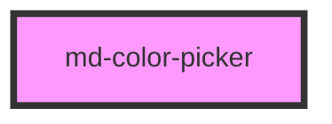

# md-color-picker

<!-- llm:meta
tag: md-color-picker
category: selection
status: custom
m3-guidelines: none — M3 has no color-picker component
form-associated: false
depends-on: none
used-by: none
-->

**Pick an arbitrary colour.** A saturation/value plate with hue and optional
alpha sliders, numeric fields in hex / RGB / HSL, and an optional preset swatch
row. Renders inline or as a popover behind a trigger **you** supply.

> ⚠️ **Not a Material Design 3 component.** M3 has no colour-picker page. The
> Do/Don't below are house rules derived from this component's behavior and
> general form-control practice.

> ⚠️ **Not form-associated.** It does not participate in `FormData` — read
> `mdChange` and submit the value yourself.

> Setup, theming, density and i18n are configured once for the whole library —
> see [`main-llm.md`](../../../../../main-llm.md), the library-wide specification shipped
> alongside these manuals.

---

## When to use

- The user genuinely needs **arbitrary colour** selection: theming, drawing,
  labels, calendars, design tools.
- A brand or accent colour in a settings screen.

## When NOT to use

| Situation | Use instead |
|---|---|
| A small fixed palette (e.g. 8 label colours) | `md-chip` / `md-segmented-button-set` swatches, or `presets` only |
| Choosing a semantic status | `md-select` with named options |
| A value that must submit with a form | Mirror it into a hidden field yourself |
| A greyscale/intensity amount | `md-slider` |
| Only a hex string typed by hand | `md-text-field` with a pattern |

## Decision cues

| Need | Setting |
|---|---|
| Embedded in a panel | `variant="inline"` (default) |
| Behind a trigger of your own | `variant="popover"` + a slotted `trigger` |
| Transparency | `alpha` |
| Output format | `format="hex"` (default) / `"rgb"` / `"hsl"` |
| Palette shortcuts | `presets="#f00,#0f0,#00f"` (or an array property) |
| Plate and sliders only, no numeric entry | `show-inputs="false"` `show-hex="false"` |
| Hide the hex field specifically | `show-hex="false"` |
| Click-away dismissal (popover) | `dismiss-on-outside-click` |

## API contract

```html
<md-color-picker
  variant="inline|popover"      <!-- default: inline -->
  value="#6750A4"               <!-- default: #6750A4 -->
  format="hex|rgb|hsl"          <!-- default: hex -->
  alpha                         <!-- default: false -->
  show-hex="true"               <!-- default: true -->
  show-inputs="true"            <!-- default: true -->
  presets="#6750A4,#B3261E,#146C2E"
  open                          <!-- popover only; default: false -->
  dismiss-on-outside-click      <!-- default: false -->
  aria-label="Color picker"
  disabled
  density="-1|-2|-3|-4"         <!-- omit for the default rung -->
></md-color-picker>
```

**Events**

| Event | Detail | Fires |
|---|---|---|
| `mdInput` | `{ value: string }` | On every change while dragging or typing |
| `mdChange` | `{ value: string }` | On commit: pointer release, input blur, Enter, or a preset click |
| `mdOpenChange` | `{ open: boolean }` | Every time `open` changes, for any reason |

All three are default Stencil events (`bubbles: true`, `composed: true`).

**Methods** — `show()` and `close()`; both async, both no-ops unless
`variant="popover"` (and `show()` also no-ops while `disabled`).

**Slots** — `trigger`, and only that one. It is **required** for
`variant="popover"`; the inline variant renders no slot at all.

**Parts** — `panel`, `plate`, `thumb`, `hue`, `alpha`, `sliders`, `preview`,
`field-hex`, `label`, `inputs`, `field-r`, `field-g`, `field-b`, `field-h`,
`field-s`, `field-l`, `field-a`, `presets`, `preset`, `popover`.

### Behavioral contract worth knowing

- **`value` is a string in the current `format`**, and the component rewrites it
  on every change. Changing `format` changes the shape of the string a consumer
  reads, so pick one and keep it.
- **`value` accepts more than it emits.** Any 3/4/6/8-digit hex (with or without
  `#`), `rgb()`, `rgba()`, `hsl()` or `hsla()` parses in; what comes out is
  always in `format`. An unparseable value leaves the current colour alone and
  flags the hex field invalid.
- **Alpha shows up in the output only when it is below 1.** `format="hex"` emits
  6 digits at full opacity and 8 digits when transparent; `rgb` emits `rgb()` or
  `rgba()`; `hsl` emits `hsl()` or `hsla()`. Setting `alpha` adds the slider —
  it does not force an alpha channel into the string.
- `presets` takes **either form**: the comma-separated attribute
  (`presets="#f00,#0f0"`) or an array property
  (`el.presets = ['#f00', '#0f0']`). Whitespace and empty entries are ignored in
  both.
- **`mdInput` fires continuously** while dragging the plate or sliders and on
  every keystroke. Preview on `mdInput`, persist on `mdChange`.
- **`variant="popover"` has NO built-in trigger.** Slot your own into
  `trigger` — any element: an `md-button` of whatever variant and size, an
  `md-icon-button`, a chip. The component attaches the click handler plus
  `aria-haspopup="dialog"` and a live `aria-expanded` onto it, but its
  accessible **name** is yours (an icon-only trigger needs an `aria-label`).
  Omit the slot and nothing can open the panel; the component warns on the
  console.
- `open`, `show()` and `close()` all control the panel, and every transition
  emits `mdOpenChange`. **`dismiss-on-outside-click` is off by default**, so a
  popover stays open until dismissed explicitly. `Escape` always closes an open
  popover, regardless of that prop.
- Three separate drag surfaces (plate, hue, alpha) each need a real pointer
  drag — synthetic clicks alone will not move them in tests.

---

## Do / Don't

House rules — no M3 page exists for this component.

| ✅ Do | ❌ Don't |
|---|---|
| Offer `presets` for the colours users actually pick | Don't make people hunt the plate for your brand colour |
| Pick one `format` and keep it stable | Don't switch `format` at runtime while consumers parse `value` |
| Save on `mdChange` | Don't persist on every `mdInput` — it fires per pointer move |
| Enable `dismiss-on-outside-click` for popovers in dense UIs | Don't leave a popover with no obvious way out |
| Show the chosen colour as text as well as a swatch | Don't rely on the swatch alone — colour-blind users need the value |
| Check contrast when the picked colour becomes UI | Don't let users pick unreadable foreground/background pairs unchecked |
| Give the control an `aria-label` | Don't ship the default English `"Color picker"` in a localized app |
| Use `md-select` with named colours for semantic choices | Don't ask for a free colour when only a few are valid |

---

## Patterns

```html
<!-- Inline, hex, with brand presets -->
<md-color-picker
  id="accent"
  value="#6750A4"
  presets="#6750A4,#B3261E,#146C2E,#1B5E9F"
  aria-label="Accent colour"
></md-color-picker>

<script type="module">
  const p = document.getElementById('accent');
  p.addEventListener('mdInput', (e) => {
    document.body.style.setProperty('--brand', e.detail.value);   // live preview
  });
  p.addEventListener('mdChange', (e) => {
    localStorage.setItem('brand', e.detail.value);                // commit
  });
</script>
```

```html
<!-- Popover — the trigger is yours -->
<md-color-picker id="label-colour" variant="popover" dismiss-on-outside-click
                 aria-label="Label colour">
  <md-button slot="trigger" variant="outlined" icon="palette">Label colour</md-button>
</md-color-picker>

<script type="module">
  document
    .getElementById('label-colour')
    .addEventListener('mdOpenChange', (e) => console.log('open:', e.detail.open));
</script>
```

```html
<!-- RGBA output; presets as a JS array -->
<md-color-picker id="brush" format="rgb" alpha value="rgba(103, 80, 164, 0.8)">
</md-color-picker>

<script type="module">
  document.getElementById('brush').presets = ['#000000', '#FFFFFF', '#FF5722'];
</script>
```

```html
<!-- Plate and sliders only -->
<md-color-picker show-hex="false" show-inputs="false" aria-label="Brush colour">
</md-color-picker>
```

```html
<!-- Submitting inside a form (the picker is NOT form-associated) -->
<form id="theme-form">
  <md-color-picker id="c" value="#6750A4" aria-label="Theme colour"></md-color-picker>
  <input type="hidden" name="colour" id="colour-field" value="#6750A4">
  <md-button type="submit">Save</md-button>
</form>

<script type="module">
  const field = document.getElementById('colour-field');
  document
    .getElementById('c')
    .addEventListener('mdChange', (e) => { field.value = e.detail.value; });
</script>
```

## Anti-patterns

| ❌ Wrong | ✅ Right | Why |
|---|---|---|
| `<md-color-picker name="c">` expecting `FormData` | Mirror `mdChange` into a hidden input | It is not form-associated; `name` is not even a prop. |
| Parsing `value` as hex with `format="rgb"` | Match your parser to `format` | `value` is rewritten in the current format. |
| Persisting on `mdInput` | Persist on `mdChange` | `mdInput` fires per pointer move. |
| Expecting 8-digit hex whenever `alpha` is set | Handle 6 **or** 8 digits | Alpha only appears in the string when it is below 1. |
| `variant="popover"` with no slotted `trigger` | Slot any element into `trigger` | There is no built-in trigger; nothing can open the panel. |
| An icon-only trigger with no `aria-label` | Name the trigger yourself | The component adds ARIA state, not a name. |
| A popover with no `dismiss-on-outside-click` and no close control | Enable it, or provide a close affordance | It is off by default. |
| `presets='["#f00","#0f0"]'` as a JSON attribute | `presets="#f00,#0f0"` or `el.presets = [...]` | The attribute is comma-separated, not JSON. |
| A free colour picker for 6 valid label colours | `presets`, or `md-chip` swatches | Too much freedom for a closed set. |
| Swatch-only display of the chosen value | Show the string too | Colour alone is not an accessible cue. |
| Styling `.md-color-picker__plate` | Use `::part(plate)` | Internals are encapsulated. |
| Simulating a click to set a colour in tests | Drive a real pointer drag | The plate, hue and alpha are drag surfaces. |

## Accessibility, RTL, density, i18n

**Accessibility** — set `aria-label`; the default is the English string
`"Color picker"` and it names the inline `role="group"` host and the popover
`role="dialog"` alike. The hue and alpha tracks are `role="slider"` with
`aria-valuemin` / `aria-valuemax` / `aria-valuenow` and full arrow-key control;
the saturation/value plate is a focusable `role="application"` driven by the
arrow keys (Shift for a 10-unit step), Home / End for saturation and
Page Up / Page Down for brightness — so the plate is operable without a pointer,
though the numeric fields remain the only way to enter an exact value. Presets
are a `role="listbox"` of focusable swatches named by their hex string. If
picked colours become UI foreground/background, validate contrast yourself; the
component does not.

**RTL** — the panel mirrors under `dir="rtl"`, and the plate, hue and alpha
tracks invert their pointer mapping, their gradients and their arrow-key
directions together, so hue 0 and saturation 0 stay at the inline-start edge in
both directions and an ArrowRight always moves the same logical way.

**Density** — `density="-1…-4"` locally overrides the inherited `data-density`
rung; only those four rungs exist, and omitting the attribute is the uncompacted
default. `density="0"` does **not** opt a picker out of an ancestor's rung — for
that, set `style="--md-sys-density-scale: 0"`. The rung tightens the panel
padding and the gaps between the sliders, the fields and the presets.

**i18n** — translate `aria-label` and any surrounding labels. The channel
abbreviations (R/G/B, H/S/L) and the "Hex" field label are rendered by the
component and are not translatable props; they are conventional and normally
stay untranslated.

## Related components

`md-slider` · `md-text-field` · `md-select` · `md-chip` · `md-button`

## Theming

| Custom property | Purpose | Default |
|---|---|---|
| `--md-color-picker-width` | Panel inline size (inline variant) | `296px` |
| `--md-color-picker-plate-height` | Saturation/value plate height | `176px` |
| `--md-color-picker-radius` | Panel corner radius | `--md-sys-shape-corner-extra-large` (28px) |
| `--md-color-picker-surface-color` | Panel background | `--md-sys-color-surface-container-high` |
| `--md-color-picker-on-surface` | Panel text | `--md-sys-color-on-surface` |
| `--md-color-picker-outline-color` | Field outlines | `--md-sys-color-outline-variant` |
| `--md-color-picker-outline-strong` | Emphasized borders | `--md-sys-color-outline` |
| `--md-color-picker-thumb-size` | Slider / plate thumb size | `18px` |
| `--md-color-picker-thumb-border` | Thumb ring colour | `#FFFFFF` |
| `--md-color-picker-preset-size` | Preset swatch size | `32px` |
| `--md-color-picker-popover-elevation` | Popover shadow | `--md-sys-elevation-3` |

**CSS parts** — see the **Parts** list in the API contract; the full generated
list is in **Shadow Parts** below.

```css
md-color-picker.compact {
  --md-color-picker-width: 240px;
  --md-color-picker-plate-height: 120px;
  --md-color-picker-preset-size: 24px;
}
```

<!-- Auto Generated Below -->


## Properties

| Property                | Attribute                  | Description                                                                                                                                                                                           | Type                        | Default          |
| ----------------------- | -------------------------- | ----------------------------------------------------------------------------------------------------------------------------------------------------------------------------------------------------- | --------------------------- | ---------------- |
| `alpha`                 | `alpha`                    | Show the alpha slider + alpha hex field.                                                                                                                                                              | `boolean`                   | `false`          |
| `ariaLabelProp`         | `aria-label`               | Accessible label for the whole picker. Defaults to "Color picker".                                                                                                                                    | `string`                    | `'Color picker'` |
| `density`               | `density`                  | Local density rung. Drives the same `--md-sys-density-scale` signal that a global `data-density` ancestor sets, so a local value simply overrides the inherited one. 0 = default, -4 = ultra-compact. | `-1 \| -2 \| -3 \| -4 \| 0` | `0`              |
| `disabled`              | `disabled`                 | Disable the entire control.                                                                                                                                                                           | `boolean`                   | `false`          |
| `dismissOnOutsideClick` | `dismiss-on-outside-click` | When true and `variant="popover"`, clicking outside the component closes the open panel. Defaults to `false` so existing popovers keep their current behaviour until opted in.                        | `boolean`                   | `false`          |
| `format`                | `format`                   | Output format for `value` and `mdChange` events.                                                                                                                                                      | `"hex" \| "hsl" \| "rgb"`   | `'hex'`          |
| `open`                  | `open`                     | Whether the popover is open. Only meaningful when variant=`popover`.                                                                                                                                  | `boolean`                   | `false`          |
| `presets`               | `presets`                  | Comma-separated swatch presets. When non-empty, a small palette appears below the sliders for one-tap colour selection.  Example: `presets="#000000,#FFFFFF,#FF5722,#4CAF50,#2196F3"`                 | `string`                    | `''`             |
| `showHex`               | `show-hex`                 | Show the hex input field below the sliders.                                                                                                                                                           | `boolean`                   | `true`           |
| `showInputs`            | `show-inputs`              | Show the RGB/HSL numeric inputs.                                                                                                                                                                      | `boolean`                   | `true`           |
| `value`                 | `value`                    | Current value. Accepts any 3/4/6/8-digit hex, `rgb()`, `rgba()`, or the formats emitted by this component. Two-way bindable.                                                                          | `string`                    | `'#6750A4'`      |
| `variant`               | `variant`                  | Layout variant. - `inline` (default) — picker UI is always visible. - `popover` — opens the picker in a floating panel anchored to itself,   behind a trigger YOU slot into `trigger`. There is no built-in trigger.                      | `"inline" \| "popover"`     | `'inline'`       |


## Events

| Event          | Description                                                                                    | Type                              |
| -------------- | ---------------------------------------------------------------------------------------------- | --------------------------------- |
| `mdChange`     | Emitted when the user commits a value (release pointer, blur input, Enter, or click a preset). | `CustomEvent<{ value: string; }>` |
| `mdInput`      | Emitted on every change while the user drags / types.                                          | `CustomEvent<{ value: string; }>` |
| `mdOpenChange` | Emitted when the popover opens or closes.                                                      | `CustomEvent<{ open: boolean; }>` |


## Methods

### `close() => Promise<void>`

Programmatically close the popover.

#### Returns

Type: `Promise<void>`


### `show() => Promise<void>`

Programmatically open the popover.

#### Returns

Type: `Promise<void>`


## Shadow Parts

| Part          | Description |
| ------------- | ----------- |
| `"alpha"`     |             |
| `"field-a"`   |             |
| `"field-b"`   |             |
| `"field-g"`   |             |
| `"field-h"`   |             |
| `"field-hex"` |             |
| `"field-l"`   |             |
| `"field-r"`   |             |
| `"field-s"`   |             |
| `"hue"`       |             |
| `"inputs"`    |             |
| `"label"`     |             |
| `"panel"`     |             |
| `"plate"`     |             |
| `"popover"`   |             |
| `"preset"`    |             |
| `"presets"`   |             |
| `"preview"`   |             |
| `"sliders"`   |             |
| `"thumb"`     |             |


## Dependencies

md-color-picker renders **no other AWC UI component**. Its plate, sliders,
numeric fields and preset swatches are all plain elements inside its own shadow
root, and the popover trigger is whatever you slot into `trigger`.

> The static analyser used to emit an `md-button` edge here. It is a false
> positive: the only `md-button` text in the source is inside a development
> warning string telling you to slot a trigger. Slotting `<md-button
> slot="trigger">` is a **consumer** choice — if you do it, register md-button
> yourself; it is not pulled in by md-color-picker.

### Graph


----------------------------------------------

*Built with [StencilJS](https://stenciljs.com/)*
