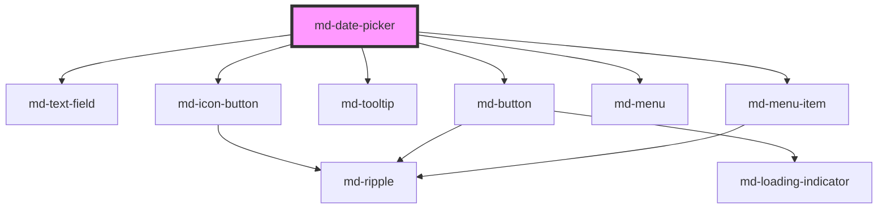

# md-date-picker

<!-- llm:meta
tag: md-date-picker
category: pickers
status: md3-mapped
m3-guidelines: https://m3.material.io/components/date-pickers/guidelines
form-associated: true
depends-on: md-text-field, md-icon-button, md-tooltip, md-button, md-menu, md-menu-item
used-by: none
-->

**Choose a date, by calendar or by typing.** Modal, modal-input, or docked,
with locale-aware formatting, min/max bounds, a custom disabled-date predicate,
and full constraint validation.

> Setup, theming, density and i18n are configured once for the whole library —
> see [`main-llm.md`](../../../../../main-llm.md), the library-wide specification shipped
> alongside these manuals.

---

## When to use

- Any **date** entry: booking, due date, filter bound, date of birth.
- Where the calendar context matters (weekday, nearby dates, month shape).
- Where typing is faster for the user (`modal-input` gives both).

## When NOT to use

| Situation | Use instead |
|---|---|
| A time of day | `md-time-picker` |
| A date range you want side by side | Two pickers with `min`/`max` wired |
| A far-past date like birth year | `md-select` for year, or a typed field |
| A month or year only | `md-select` |
| A relative choice (Today / Last 7 days) | `md-chip` / `md-select` presets |
| A free-text date string | `md-text-field` with validation |

## Decision cues

| Need | Setting |
|---|---|
| Calendar + text entry (recommended default) | `variant="modal-input"` (default) |
| Calendar only, in a modal | `variant="modal"` |
| Inline dropdown calendar anchored to the field | `variant="docked"` |
| Bound the range | `min` / `max` (ISO strings) |
| Disable arbitrary dates (weekends, holidays) | `isDateDisabled` (JS property) |
| Locale formatting | `locale` |
| Week starts on a given day | `first-day-of-week` (0=Sunday; `-1` = locale default) |
| Force a separator regardless of locale | `date-separator` |
| Allow clearing | `clearable` |
| Reserve space for the message line | `reserve-supporting-space` |
| One-click picking, no confirm step | `commit-on-select` |
| Keep a docked panel open on click-away | `outside-click-dismissible="false"` |
| Keep a modal open on scrim click | `scrim-dismissible="false"` |
| Filled trigger field instead of outlined | `field-variant="filled"` |

## API contract

```html
<md-date-picker
  variant="modal|modal-input|docked"   <!-- default: modal-input -->
  field-variant="outlined|filled"      <!-- default: outlined -->
  label="Date"
  value="2026-08-12"
  name="due"
  min="2026-01-01"
  max="2026-12-31"
  placeholder=""                       <!-- modal typed-entry field only -->
  locale="en-GB"
  first-day-of-week="1"                <!-- default: -1 (derive from locale) -->
  date-separator="/"                   <!-- default: "" (locale default) -->
  supporting-text=""
  error
  error-text=""
  reserve-supporting-space
  required
  disabled
  clearable
  open
  scrim-dismissible                    <!-- default: true -->
  outside-click-dismissible            <!-- default: true -->
  commit-on-select                     <!-- default: false -->
  calendar-icon="calendar_today"
  density="-1|-2|-3|-4"                <!-- omit for the default rung -->
></md-date-picker>
```

All user-facing strings are props, each defaulting to English:

```html
<md-date-picker
  headline="Select date"
  cancel-label="Cancel"
  ok-label="OK"
  select-date-label="Select date"
  enter-dates-label="Enter dates"
  invalid-date-label="Invalid date"
  value-missing-label="Please choose a date."
  clear-label="Clear date"
  previous-month-label="Previous month"
  next-month-label="Next month"
  previous-year-label="Previous year"
  next-year-label="Next year"
  choose-month-label="Choose month"
  choose-year-label="Choose year"
  choose-month-year-label="Choose a different month and year"
  choose-month-and-year-label="Choose month and year"
  toggle-calendar-label="Switch to calendar input"
  toggle-text-label="Switch to text input"
  open-calendar-label="Open calendar"
  close-calendar-label="Close calendar"
  year-grid-label="Year"
></md-date-picker>
```

`isDateDisabled` has no attribute — set it as a JS property:

```js
picker.isDateDisabled = (d) => d.getDay() === 0 || d.getDay() === 6;  // no weekends
```

**Events** — `mdChange` (committed), `mdSelected` (a day was picked),
`mdInput` (every keystroke), `mdOpen` / `mdClose`, `mdCancel`, `mdViewChange`,
`mdModeChange`, `mdMenuOpen` / `mdMenuSelect`, and `mdValidityChange`
(`bubbles: true`, **`composed: false`** — listen on the element or a light-DOM
ancestor, never across a shadow boundary).

**Methods** — `show()`, `close()`, `clear()`, `focusInput()`, `getValidity()`,
`checkValidity()`, `reportValidity()`, `setCustomValidity(message)`. All are
async; `await` them.

**Slots** — `leading-icon` (leading icon on the trigger field),
`calendar-icon` (replaces the trailing toggle glyph; makes the `calendar-icon`
prop inert), `header` (replaces the whole modal header), `actions` (replaces
the Cancel / OK row).

**Parts** — this hand-written list is the complete one. The generated
**Shadow Parts** table further down is produced by static analysis and is
missing every part whose name is computed at render time (the `day` and `year`
cell families, the menu options, the docked nav chevrons) — style from this
list, not from that table.

- Trigger field: `field`, `clear-button`, `calendar-button`
- Surface: `modal`, `scrim`, `panel`, `body`
- Header: `header`, `supporting`, `headline`, `mode-toggle`
- Modal nav: `nav`, `month-toggle`, `prev-button`, `next-button`
- Docked nav: `month-menu-button`, `year-menu-button`, `menu-caret`,
  `selection-divider`, `docked-below-nav`, and per chevron
  `prev-month-button` / `next-month-button` / `prev-year-button` /
  `next-year-button`, each inside a `<side>-<scope>-chevron-slot`
  (`prev-month-chevron-slot`, …) alongside a `<side>-<scope>-chevron-spacer`
  that holds the width while the button is hidden
- Docked menus: `month-menu-wrap`, `month-menu`, `year-menu-wrap`, `year-menu`,
  and the options themselves — `month-option` (plus
  `month-option-selected` on the current month) and `year-option` (plus
  `year-option-selected`)
- Calendar: `calendar`, `weekdays`, `weekday`, `grid`, `week`, and `day` — the
  day cell always carries `day` plus one or more of `day-selected` /
  `day-today` / `day-disabled` / `day-outside` / `day-unselected`
- Year grid: `year-grid-wrap`, `year-grid-scroll`, `year-grid-viewport`,
  `year-grid`, `year-row`, and `year` — the year cell always carries `year`
  plus exactly one of `year-selected` / `year-disabled` / `year-unselected`
- Typed entry: `entry`, `entry-input`
- Action row: `actions`, `cancel-button`, `ok-button`

```css
/* Emphasise the selected year in the year grid and the selected docked
   menu rows — hooks that only exist under the names listed above. */
md-date-picker::part(year-selected),
md-date-picker::part(year-option-selected),
md-date-picker::part(month-option-selected) {
  font-weight: 700;
}
md-date-picker::part(day-today) {
  outline: 1px solid var(--md-sys-color-primary);
}
```

### Behavioral contract worth knowing

- **`value` is an ISO date string** (`YYYY-MM-DD`), not a `Date`. `min` and
  `max` are the same. Only display formatting follows `locale` /
  `date-separator`; `value`, `mdChange.detail.value` and
  `mdSelected.detail.value` are always ISO.
- **A day click stages; OK commits.** Every variant — docked included — renders
  the same Cancel / OK row, so a click emits `mdSelected` and only OK emits
  `mdChange`. Set `commit-on-select` to collapse the two: the click stages and
  commits in one go and the built-in action row is not rendered at all. **Typed
  entry keeps its OK button either way**, because typing has no click to
  collapse. A slotted `actions` row is always rendered, `commit-on-select` or not.
- **Cancel, `Escape`, the modal scrim and a click outside a docked panel all
  emit `mdCancel`** and discard staging. `close()` and setting `open = false`
  do **not** emit `mdCancel` — they only animate out and emit `mdClose`.
  `mdClose` fires for every close, cancel or commit alike.
- **Click-away is opt-out per variant**, because the two catch the click
  differently: the modal has a scrim (`scrim-dismissible`), the docked panel has
  none and is dismissed from a document `pointerdown` listener
  (`outside-click-dismissible`). Both default to `true`; turning either off
  leaves `Escape`, the trigger toggle and Cancel / OK working.
- `isDateDisabled` is a **function property** — there is no attribute. It runs
  once per rendered day cell, so keep it cheap and pure.
- `first-day-of-week="-1"` means "use the locale's default"; `0` is Sunday.
- **`placeholder` applies only to the modal typed-entry field**, not to the
  trigger field. When it is empty the entry field falls back to the locale
  format hint (e.g. `MM/DD/YYYY`).
- **`supporting-text` has a fallback**: when it is empty the trigger field shows
  the locale date-format hint instead. Pass a space to blank it.
- `error` and `error-text` are **mutable** — the component sets them itself when
  a typed date cannot be parsed or is out of range (using `invalid-date-label`),
  and clears them on a successful parse or commit.
- The clear button only renders when `clearable` is set, `value` is non-empty
  and the picker is not `disabled`. It calls `clear()`, which resets `value` and
  emits `mdChange` with an empty value.
- **Form-associated via `ElementInternals`.** Give it a `name` and it submits
  the ISO string with the surrounding `<form>`; `required` blocks submit with
  `value-missing-label` as the message; form reset restores the `value` the
  element had at first render. Do not add a hidden input.
- `mdValidityChange` never fires on mount — the first evaluation only primes the
  baseline — and never re-fires for a state that did not change.
- **Nested `mdOpen` / `mdClose` from the internal tooltips and menus are
  swallowed** at the host, so a listener on the picker only ever hears the
  picker's own open/close.
- Day cells are `md-button` elements with `role-override="gridcell"`. Style them
  through the `day*` parts, not as buttons.
- The docked panel flips above the anchor and clamps its height when it would
  leave the viewport, and re-positions on window scroll and resize.

---

## Do / Don't

Sourced from [M3 · Date pickers · Guidelines](https://m3.material.io/components/date-pickers/guidelines).

| ✅ Do | ❌ Don't |
|---|---|
| Offer text entry alongside the calendar for known dates | Don't force calendar navigation for a date the user can type |
| Use the calendar when surrounding dates matter (weekday, availability) | Don't use a calendar to pick a birth year |
| Bound the selectable range with `min`/`max` | Don't let users pick impossible dates and fail on submit |
| Disable unavailable dates with `isDateDisabled` | Don't accept a date and reject it afterwards |
| Show validation inline with `error-text` | Don't rely on the browser's validation balloon |
| Set `locale` so format and week start match the user | Don't assume `en-US` ordering for every audience |
| Localize every label prop | Don't ship a half-translated dialog |
| Keep the field label short | Don't wrap the field label |
| Use `commit-on-select` on a low-stakes, reversible field | Don't drop the confirm step on a form the user submits once |
| Turn click-away off when a stray click would discard real input | Don't turn it off "for safety" — a popup you can't click away from feels stuck |

---

## Patterns

```html
<!-- Bounded, validated, weekdays only -->
<form id="booking">
  <md-date-picker
    id="due" label="Due date" name="due" required
    min="2026-01-01" max="2026-12-31" locale="en-GB" first-day-of-week="1"
    clearable reserve-supporting-space
    supporting-text="Weekdays only"
  ></md-date-picker>
  <md-button type="submit">Book</md-button>
</form>

<script type="module">
  const p = document.getElementById('due');
  p.isDateDisabled = (d) => d.getDay() === 0 || d.getDay() === 6;

  p.addEventListener('mdChange', (e) => console.log('committed', e.detail.value));
  p.addEventListener('mdCancel', () => console.log('dismissed without committing'));

  document.getElementById('booking').addEventListener('submit', (e) => {
    e.preventDefault();
    console.log(new FormData(e.currentTarget).get('due'));  // "2026-08-12"
  });
</script>
```

```html
<!-- Docked inline calendar -->
<md-date-picker variant="docked" label="Start"></md-date-picker>
```

```html
<!-- A range, as two coupled pickers -->
<md-date-picker id="from" label="From"></md-date-picker>
<md-date-picker id="to"   label="To"></md-date-picker>

<script type="module">
  const from = document.getElementById('from');
  const to = document.getElementById('to');
  from.addEventListener('mdChange', () => { to.min = from.value; });
  to.addEventListener('mdChange', () => { from.max = to.value; });
</script>
```

```html
<!-- One-click picking: no Cancel / OK row, the day click commits -->
<md-date-picker label="Filter from" commit-on-select></md-date-picker>

<!-- Docked panel that survives a click on the page behind it -->
<md-date-picker
  variant="docked" label="Start"
  outside-click-dismissible="false"
></md-date-picker>

<!-- Bare modal, opened from your own trigger -->
<md-button id="pick">Pick a date</md-button>
<md-date-picker id="modal" variant="modal"></md-date-picker>

<script type="module">
  const modal = document.getElementById('modal');
  document.getElementById('pick').addEventListener('mdClick', () => modal.show());
</script>
```

```html
<!-- Localized (abbreviated — translate all label props) -->
<md-date-picker
  locale="fr-FR" label="Date" headline="Sélectionner une date"
  cancel-label="Annuler" ok-label="OK"
  select-date-label="Sélectionner une date" enter-dates-label="Saisir les dates"
  previous-month-label="Mois précédent" next-month-label="Mois suivant"
  previous-year-label="Année précédente" next-year-label="Année suivante"
  choose-month-label="Choisir le mois" choose-year-label="Choisir l'année"
  open-calendar-label="Ouvrir le calendrier" close-calendar-label="Fermer le calendrier"
  clear-label="Effacer la date" invalid-date-label="Date invalide"
  year-grid-label="Année"
  value-missing-label="Veuillez choisir une date."
></md-date-picker>
```

## Anti-patterns

| ❌ Wrong | ✅ Right | Why |
|---|---|---|
| `picker.value = new Date()` | Assign an ISO `YYYY-MM-DD` string | `value` is a string, not a `Date`. |
| `is-date-disabled="fn"` as an attribute | `picker.isDateDisabled = fn` in JS | It is a function property with no attribute. |
| An expensive `isDateDisabled` | Keep it cheap and pure | It runs once per rendered day cell. |
| Wiring `mdInput`, `mdSelected` and `mdChange` to the same save | Use `mdChange` | You would save three times per pick. |
| Translating only `headline` and the buttons | Translate every label prop | Everything else stays English. |
| `first-day-of-week="0"` meaning "locale default" | `first-day-of-week="-1"` | `0` is Sunday; `-1` is the locale default. |
| A calendar for date of birth | Typed entry or a year select | M3 usage guidance. |
| Accepting a date then rejecting it server-side | `min` / `max` + `isDateDisabled` | Prevent, don't punish. |
| Listening for `mdValidityChange` on a shadow ancestor | Listen on the element itself | It is `composed: false`. |
| Removing the `outside-click-dismissible` attribute to turn it off | `outside-click-dismissible="false"` | It defaults to `true`, so an absent attribute means ON. |
| `commit-on-select` plus your own OK button in `actions` | Pick one | The click already committed; the button confirms nothing. |
| Treating `mdCancel` as "the user pressed Cancel" | Treat it as "dismissed without committing" | Esc, the scrim and an outside click all emit it. |
| Expecting `mdCancel` after `picker.close()` | Listen for `mdClose` | Programmatic close is not a user cancel. |
| A hidden `<input>` to submit the date | Give the picker a `name` | It is already form-associated. |
| Setting `placeholder` to hint the trigger field | Use `supporting-text` | `placeholder` only reaches the modal typed-entry field. |

## Accessibility, RTL, density, i18n

**Accessibility** — the calendar is a grid: day cells expose `gridcell`
semantics with `aria-selected`, `aria-current="date"` on today and a full
localized date as the accessible name; arrow keys move by day and week, Page
Up / Page Down by month, Shift + Page Up / Page Down by year. Disabled dates are
exposed as `disabled`, not merely greyed. The trigger toggle carries
`aria-haspopup="dialog"` and a live `aria-expanded`. Modal variants trap Tab
inside the panel and restore focus to the previously focused element on close.
`label` names the field and errors surface in the supporting line, so
`reserve-supporting-space` avoids the layout jump when one appears. The
navigation buttons are named entirely by the label props — untranslated, they are
the weakest part of a localized picker.

**RTL** — the calendar grid, the navigation chevrons and the field mirror under
`dir="rtl"`, and the docked panel's start/end alignment flips with it. Set
`locale` to a matching RTL locale so weekday order and formatting agree.

**Density** — `density="-1…-4"` locally overrides the inherited `data-density`
rung; only those four rungs exist, and omitting the attribute is the uncompacted
default. `density="0"` does **not** opt a picker out of an ancestor's rung — for
that, set `style="--md-sys-density-scale: 0"`. Day cells taper from 40px to
28px, so re-check tap targets at the deep rungs.

**i18n** — set `locale` (it drives `Intl` month and weekday names, field
formatting and the default week start) **and** translate every label prop listed
in the API contract. `date-separator` pins the separator when the locale default
is not what you want; it changes display and parsing only, never `value`.

## Related components

`md-time-picker` · `md-text-field` · `md-select` · `md-dialog` · `md-menu` ·
`md-icon-button` · `md-button` · `md-tooltip`

## Theming

| Custom property | Purpose | Default |
|---|---|---|
| `--md-date-picker-container-color` | Dialog / popup body background | `--md-sys-color-surface` |
| `--md-date-picker-container-shape` | Dialog / popup corner radius | `--md-sys-shape-corner-extra-large` (28px) |
| `--md-date-picker-header-color` | Modal header background | `--md-sys-color-surface-container-high` |
| `--md-date-picker-headline-color` | Modal headline (selected date) color | `--md-sys-color-on-surface` |
| `--md-date-picker-supporting-color` | Header supporting-text color | `--md-sys-color-on-surface-variant` |
| `--md-date-picker-field-color` | Trigger field resting outline | `--md-sys-color-outline` |
| `--md-date-picker-field-focus-color` | Trigger field focused outline / label | `--md-sys-color-primary` |
| `--md-date-picker-field-text-color` | Trigger field input text | `--md-sys-color-on-surface` |
| `--md-date-picker-field-container-color` | Filled-field container background | `--md-sys-color-surface-container-highest` |
| `--md-date-picker-field-container-shape` | Trigger field corner radius | `--md-sys-shape-corner-extra-small` (4px) |
| `--md-date-picker-field-filled-pill` | Filled field: `1` for a capsule shape | `0` |
| `--md-date-picker-field-supporting-color` | Supporting text below the field | `--md-sys-color-on-surface-variant` |
| `--md-date-picker-label-color` | Floating label color | `--md-sys-color-on-surface-variant` |
| `--md-date-picker-weekday-color` | Weekday column-header color | `--md-sys-color-on-surface` |
| `--md-date-picker-day-color` | Day cell text color | `--md-sys-color-on-surface` |
| `--md-date-picker-day-outside-color` | Adjacent-month day cell text | `--md-sys-color-on-surface-variant` |
| `--md-date-picker-day-selected-color` | Selected day text | `--md-sys-color-on-primary` |
| `--md-date-picker-day-selected-bg` | Selected day container | `--md-sys-color-primary` |
| `--md-date-picker-day-selected-shape` | Selected day corner radius | Half the day size (circle) |
| `--md-date-picker-day-today-shape` | Today ring corner radius | Half the day size (circle) |
| `--md-date-picker-today-outline-color` | Today's outline ring | `--md-sys-color-primary` |
| `--md-date-picker-action-color` | Cancel / OK label color | `--md-sys-color-primary` |
| `--md-date-picker-menu-color` | Docked month/year menu surface | `--md-sys-color-surface-container-high` |
| `--md-date-picker-scrim-color` | Modal scrim | `--md-sys-color-scrim` |
| `--md-date-picker-icon-color` | Trailing / nav icon color | `--md-sys-color-on-surface-variant` |
| `--md-date-picker-icon-size` | Icon box | 24px, tapering 1px per density rung (18px floor) |
| `--md-date-picker-panel-width` | Modal / docked panel inline size | 380px, tapering 20px per rung (288px floor) |
| `--md-date-picker-panel-max-block-size` | Panel max block size | `524px` |
| `--md-date-picker-docked-panel-width` | Docked panel inline size (wins over `panel-width`) | 360px, tapering 10px per rung |
| `--md-date-picker-year-inline-size` | Year cell inline size (modal) | 72px, tapering 6px per rung (48px floor) |
| `--md-date-picker-year-block-size` | Year cell block size (modal) | 36px, tapering 3px per rung (24px floor) |
| `--md-date-picker-year-grid-gap` | Year grid row/column gap | 12px, tapering 2px per rung (4px floor) |
| `--md-date-picker-year-grid-padding-inline` | Year grid inline padding | `30px` |
| `--md-date-picker-year-grid-viewport-block-size` | Year grid scroll viewport height | 288px, tapering 24px per rung (180px floor) |
| `--md-date-picker-selection-bloom-duration` | Docked month/year menu bloom-in | `--md-sys-motion-duration-long1` (450ms) |
| `--md-date-picker-selection-bloom-easing` | Docked menu bloom-in easing | `--md-sys-motion-easing-emphasized-decelerate` |
| `--md-date-picker-selection-bloom-out-duration` | Docked menu bloom-out on pick | `--md-sys-motion-duration-short4` (200ms) |
| `--md-date-picker-calendar-bloom-duration` | Day grid bloom-in after a pick | `--md-sys-motion-duration-medium2` (300ms) |
| `--md-date-picker-grid-slide-duration` | Day grid month/year slide | `--md-sys-motion-duration-medium2` (300ms) |
| `--md-date-picker-panel-bloom-out-duration` | Panel bloom-out on dismiss | `--md-sys-motion-duration-short4` (200ms) |

**CSS parts** — see the **Parts** list in the API contract; the full generated
list is in **Shadow Parts** below.

```css
md-date-picker.brand {
  --md-date-picker-day-selected-bg: var(--md-sys-color-tertiary);
  --md-date-picker-day-selected-color: var(--md-sys-color-on-tertiary);
  --md-date-picker-container-shape: 16px;
}
```

<!-- Auto Generated Below -->


## Overview

`md-date-picker` — a Material Design 3 date picker.

Variants:
- `modal-input` *(default)* — outlined text field + modal calendar dialog.
- `modal` — bare modal dialog surfaced via `show()` / `open`.
- `docked` — outlined text field + dropdown calendar anchored to the field.

The modal dialog can flip to a typed-entry view (date input) via the
header toggle, satisfying the MD3 "modal date input" pattern.

## Properties

| Property                  | Attribute                     | Description                                                                                                                                                                                                                                                                                                                                                                                                                                                    | Type                                     | Default                               |
| ------------------------- | ----------------------------- | -------------------------------------------------------------------------------------------------------------------------------------------------------------------------------------------------------------------------------------------------------------------------------------------------------------------------------------------------------------------------------------------------------------------------------------------------------------- | ---------------------------------------- | ------------------------------------- |
| `calendarIcon`            | `calendar-icon`               | Material Symbols name for the trailing calendar toggle on the field. Ignored when a `calendar-icon` slot is provided.                                                                                                                                                                                                                                                                                                                                          | `string`                                 | `'calendar_today'`                    |
| `cancelLabel`             | `cancel-label`                | Label of the cancel button in the modal action row.                                                                                                                                                                                                                                                                                                                                                                                                            | `string`                                 | `'Cancel'`                            |
| `chooseMonthAndYearLabel` | `choose-month-and-year-label` | Tooltip suffix on the modal month/year nav button.                                                                                                                                                                                                                                                                                                                                                                                                             | `string`                                 | `'Choose month and year'`             |
| `chooseMonthLabel`        | `choose-month-label`          | Accessible label for the docked month menu button.                                                                                                                                                                                                                                                                                                                                                                                                             | `string`                                 | `'Choose month'`                      |
| `chooseMonthYearLabel`    | `choose-month-year-label`     | Accessible label for the modal month/year toggle button.                                                                                                                                                                                                                                                                                                                                                                                                       | `string`                                 | `'Choose a different month and year'` |
| `chooseYearLabel`         | `choose-year-label`           | Accessible label for the docked year menu button.                                                                                                                                                                                                                                                                                                                                                                                                              | `string`                                 | `'Choose year'`                       |
| `clearLabel`              | `clear-label`                 | Accessible label for the clear button.                                                                                                                                                                                                                                                                                                                                                                                                                         | `string`                                 | `'Clear date'`                        |
| `clearable`               | `clearable`                   | Show a clear ("×") button on the field trigger while a date is selected, which resets the value (same as calling `clear()`). Applies to the `modal-input` and `docked` variants.                                                                                                                                                                                                                                                                               | `boolean`                                | `false`                               |
| `closeCalendarLabel`      | `close-calendar-label`        | Trigger calendar icon label when the panel is open.                                                                                                                                                                                                                                                                                                                                                                                                            | `string`                                 | `'Close calendar'`                    |
| `commitOnSelect`          | `commit-on-select`            | Commit a day the moment it is clicked, instead of staging it behind the Cancel / OK row. The built-in action row is then not rendered — there is nothing left for it to confirm. Input mode keeps its OK button, since typing has no click to collapse. A slotted `actions` row is always honoured.                                                                                                                                                             | `boolean`                                | `false`                               |
| `dateSeparator`           | `date-separator`              | Character between day, month, and year in the text field (display and parsing). Leave empty to use the locale default (e.g. `/` for `en-US`, `.` for `de-DE`). The `value` prop and `mdChange` / `mdSelected` events always use ISO `YYYY-MM-DD` regardless of this setting.                                                                                                                                                                                   | `string`                                 | `''`                                  |
| `density`                 | `density`                     | Local density rung. Drives the same `--md-sys-density-scale` signal that a global `data-density` ancestor sets, so a local value simply overrides the inherited one. 0 = default, -4 = ultra-compact.                                                                                                                                                                                                                                                          | `-1 \| -2 \| -3 \| -4 \| 0`              | `0`                                   |
| `disabled`                | `disabled`                    | Disabled — blocks all interaction and removes from tab order.                                                                                                                                                                                                                                                                                                                                                                                                  | `boolean`                                | `false`                               |
| `enterDatesLabel`         | `enter-dates-label`           | Large headline shown in typed-entry (input) mode.                                                                                                                                                                                                                                                                                                                                                                                                              | `string`                                 | `'Enter dates'`                       |
| `error`                   | `error`                       | Error state — paints the field with the error color and shows `error-text`.                                                                                                                                                                                                                                                                                                                                                                                    | `boolean`                                | `false`                               |
| `errorText`               | `error-text`                  | Error message shown below the field when `error` is true.                                                                                                                                                                                                                                                                                                                                                                                                      | `string`                                 | `''`                                  |
| `fieldVariant`            | `field-variant`               | Visual variant of the trigger `md-text-field` (`modal-input` and `docked`). Use `filled` with `--md-date-picker-field-container-color` for branded fills.                                                                                                                                                                                                                                                                                                      | `"filled" \| "outlined"`                 | `'outlined'`                          |
| `firstDayOfWeek`          | `first-day-of-week`           | First day of the week (0 = Sunday … 6 = Saturday). `-1` derives it from the locale.                                                                                                                                                                                                                                                                                                                                                                            | `number`                                 | `-1`                                  |
| `headline`                | `headline`                    | Headline / supporting text shown at the top of the modal header.                                                                                                                                                                                                                                                                                                                                                                                               | `string`                                 | `'Select date'`                       |
| `invalidDateLabel`        | `invalid-date-label`          | Default error when a typed date cannot be parsed or is out of range.                                                                                                                                                                                                                                                                                                                                                                                           | `string`                                 | `'Invalid date'`                      |
| `isDateDisabled`          | --                            | Predicate that disables individual dates (return `true` to disable).                                                                                                                                                                                                                                                                                                                                                                                           | `((date: Date) => boolean) \| undefined` | `undefined`                           |
| `label`                   | `label`                       | Floating label / accessible name for the field.                                                                                                                                                                                                                                                                                                                                                                                                                | `string`                                 | `'Date'`                              |
| `locale`                  | `locale`                      | BCP-47 locale for month/weekday names and date formatting.                                                                                                                                                                                                                                                                                                                                                                                                     | `string`                                 | `''`                                  |
| `max`                     | `max`                         | Latest selectable date, inclusive, as ISO `YYYY-MM-DD`.                                                                                                                                                                                                                                                                                                                                                                                                        | `string`                                 | `''`                                  |
| `min`                     | `min`                         | Earliest selectable date, inclusive, as ISO `YYYY-MM-DD`.                                                                                                                                                                                                                                                                                                                                                                                                      | `string`                                 | `''`                                  |
| `name`                    | `name`                        | Form-association name attribute.                                                                                                                                                                                                                                                                                                                                                                                                                               | `string`                                 | `''`                                  |
| `nextMonthLabel`          | `next-month-label`            | Accessible label for the "next month" nav chevron.                                                                                                                                                                                                                                                                                                                                                                                                             | `string`                                 | `'Next month'`                        |
| `nextYearLabel`           | `next-year-label`             | Accessible label for the "next year" nav chevron.                                                                                                                                                                                                                                                                                                                                                                                                              | `string`                                 | `'Next year'`                         |
| `okLabel`                 | `ok-label`                    | Label of the confirm button in the modal action row.                                                                                                                                                                                                                                                                                                                                                                                                           | `string`                                 | `'OK'`                                |
| `open`                    | `open`                        | Whether the modal / docked panel is open. Two-way bindable.                                                                                                                                                                                                                                                                                                                                                                                                    | `boolean`                                | `false`                               |
| `openCalendarLabel`       | `open-calendar-label`         | Trigger calendar icon label when the panel is closed.                                                                                                                                                                                                                                                                                                                                                                                                          | `string`                                 | `'Open calendar'`                     |
| `outsideClickDismissible` | `outside-click-dismissible`   | Clicking outside a **docked** panel dismisses it (the modal equivalent is `scrim-dismissible`). Set `false` to keep the panel open until Cancel / OK / Esc. Dismissing this way is a cancel: it emits `mdCancel` and discards staging.                                                                                                                                                                                                                          | `boolean`                                | `true`                                |
| `placeholder`             | `placeholder`                 | Placeholder shown inside the text-field input.                                                                                                                                                                                                                                                                                                                                                                                                                 | `string`                                 | `''`                                  |
| `previousMonthLabel`      | `previous-month-label`        | Accessible label for the "previous month" nav chevron.                                                                                                                                                                                                                                                                                                                                                                                                         | `string`                                 | `'Previous month'`                    |
| `previousYearLabel`       | `previous-year-label`         | Accessible label for the "previous year" nav chevron.                                                                                                                                                                                                                                                                                                                                                                                                          | `string`                                 | `'Previous year'`                     |
| `required`                | `required`                    | Marks the field as required (for form-validation contexts).                                                                                                                                                                                                                                                                                                                                                                                                    | `boolean`                                | `false`                               |
| `reserveSupportingSpace`  | `reserve-supporting-space`    | Always occupy the supporting-text line, even when there is no message, so a validation error does not push the content below it down. Forwarded to the embedded md-text-field. See that component for why it is opt-in.                                                                                                                                                                                                                                        | `boolean`                                | `false`                               |
| `scrimDismissible`        | `scrim-dismissible`           | Clicking the modal scrim closes the picker when true.                                                                                                                                                                                                                                                                                                                                                                                                          | `boolean`                                | `true`                                |
| `selectDateLabel`         | `select-date-label`           | Large headline when no date is staged in calendar mode.                                                                                                                                                                                                                                                                                                                                                                                                        | `string`                                 | `'Select date'`                       |
| `supportingText`          | `supporting-text`             | Helper text shown below the field. Hidden while an error is displayed.                                                                                                                                                                                                                                                                                                                                                                                         | `string`                                 | `''`                                  |
| `toggleCalendarLabel`     | `toggle-calendar-label`       | Mode-toggle label when in typed-entry mode (switch to calendar).                                                                                                                                                                                                                                                                                                                                                                                               | `string`                                 | `'Switch to calendar input'`          |
| `toggleTextLabel`         | `toggle-text-label`           | Mode-toggle label when in calendar mode (switch to text).                                                                                                                                                                                                                                                                                                                                                                                                      | `string`                                 | `'Switch to text input'`              |
| `value`                   | `value`                       | Selected date as ISO `YYYY-MM-DD`. Two-way bindable.                                                                                                                                                                                                                                                                                                                                                                                                           | `string`                                 | `''`                                  |
| `valueMissingLabel`       | `value-missing-label`         | Localized constraint-validation message shown when `required` is unmet.  A prop rather than a hardcoded string, matching md-time-picker's `value-missing-label`: components stay i18n-engine-agnostic and the consumer localizes through its own dictionary. Native inputs get their message from the browser's locale for free; a form-associated custom element supplies its own, so leaving this hardcoded would ship an English-only form to every locale. | `string`                                 | `'Please choose a date.'`             |
| `variant`                 | `variant`                     | Presentation variant.                                                                                                                                                                                                                                                                                                                                                                                                                                          | `"docked" \| "modal" \| "modal-input"`   | `'modal-input'`                       |
| `yearGridLabel`           | `year-grid-label`             | Accessible label for the modal year-selection grid.                                                                                                                                                                                                                                                                                                                                                                                                            | `string`                                 | `'Year'`                              |


## Events

| Event              | Description                                                                                                                                                                                                                                                                                                                                                                                                                                                                                                                                                              | Type                                                                                          |
| ------------------ | ------------------------------------------------------------------------------------------------------------------------------------------------------------------------------------------------------------------------------------------------------------------------------------------------------------------------------------------------------------------------------------------------------------------------------------------------------------------------------------------------------------------------------------------------------------------------ | --------------------------------------------------------------------------------------------- |
| `mdCancel`         | Emitted when the user dismisses without committing (scrim, Cancel, Esc).                                                                                                                                                                                                                                                                                                                                                                                                                                                                                                 | `CustomEvent<void>`                                                                           |
| `mdChange`         | Emitted when the user commits a selection.                                                                                                                                                                                                                                                                                                                                                                                                                                                                                                                               | `CustomEvent<MdDatePickerChangeDetail>`                                                       |
| `mdClose`          | Emitted when the picker closes for any reason.                                                                                                                                                                                                                                                                                                                                                                                                                                                                                                                           | `CustomEvent<void>`                                                                           |
| `mdInput`          | Emitted on every keystroke in a text-entry field.                                                                                                                                                                                                                                                                                                                                                                                                                                                                                                                        | `CustomEvent<{ value: string; }>`                                                             |
| `mdMenuOpen`       | Emitted when the user opens the month or year selection menu / grid.                                                                                                                                                                                                                                                                                                                                                                                                                                                                                                     | `CustomEvent<MdDatePickerMenuOpenDetail>`                                                     |
| `mdMenuSelect`     | Emitted when the user picks a month or year from a selection menu / grid.                                                                                                                                                                                                                                                                                                                                                                                                                                                                                                | `CustomEvent<MdDatePickerMenuSelectDetail>`                                                   |
| `mdModeChange`     | Emitted when the user toggles between calendar and typed-entry views.                                                                                                                                                                                                                                                                                                                                                                                                                                                                                                    | `CustomEvent<MdDatePickerModeChangeDetail>`                                                   |
| `mdOpen`           | Emitted when the picker opens.                                                                                                                                                                                                                                                                                                                                                                                                                                                                                                                                           | `CustomEvent<void>`                                                                           |
| `mdSelected`       | Emitted when the user selects a day in the calendar (click or keyboard).                                                                                                                                                                                                                                                                                                                                                                                                                                                                                                 | `CustomEvent<MdDatePickerSelectedDetail>`                                                     |
| `mdValidityChange` | Fires when this control's validity CHANGES — never on every keystroke, and never for a re-publish that lands on the same state.  `composed: false` is deliberate. Composites like md-select embed an md-text-field, and a composed event escapes that inner shadow root, so a listener on md-select would receive the inner field's event as well as the host's — two events, different payloads, for one logical control. Keeping it uncomposed means each component reports only for itself, while `bubbles: true` still lets a <form> or app root hear every control. | `CustomEvent<{ valid: boolean; validationMessage: string; flags: Record<string, boolean>; }>` |
| `mdViewChange`     | Emitted when the displayed calendar month/year changes from user navigation.                                                                                                                                                                                                                                                                                                                                                                                                                                                                                             | `CustomEvent<MdDatePickerViewChangeDetail>`                                                   |


## Methods

### `checkValidity() => Promise<boolean>`

Constraint-validation API, matching md-text-field and the native contract.

#### Returns

Type: `Promise<boolean>`


### `clear() => Promise<void>`

Clear the current selection.

#### Returns

Type: `Promise<void>`


### `close() => Promise<void>`

Close the picker without committing.

#### Returns

Type: `Promise<void>`


### `focusInput() => Promise<void>`

Move keyboard focus to the field's text input (if present).

#### Returns

Type: `Promise<void>`


### `getValidity() => Promise<{ valid: boolean; validationMessage: string; flags: Record<string, boolean>; }>`

Current validity: boolean, message and flags. Mirrors md-text-field.

#### Returns

Type: `Promise<{ valid: boolean; validationMessage: string; flags: Record<string, boolean>; }>`


### `reportValidity() => Promise<boolean>`


#### Returns

Type: `Promise<boolean>`


### `setCustomValidity(message: string) => Promise<void>`


#### Parameters

| Name      | Type     | Description |
| --------- | -------- | ----------- |
| `message` | `string` |             |

#### Returns

Type: `Promise<void>`


### `show() => Promise<void>`

Open the picker.

#### Returns

Type: `Promise<void>`


## Shadow Parts

| Part                   | Description |
| ---------------------- | ----------- |
| `"actions"`            |             |
| `"body"`               |             |
| `"calendar"`           |             |
| `"calendar-button"`    |             |
| `"cancel-button"`      |             |
| `"clear-button"`       |             |
| `"docked-below-nav"`   |             |
| `"entry"`              |             |
| `"entry-input"`        |             |
| `"field"`              |             |
| `"grid"`               |             |
| `"header"`             |             |
| `"headline"`           |             |
| `"menu-caret"`         |             |
| `"modal"`              |             |
| `"mode-toggle"`        |             |
| `"month-menu"`         |             |
| `"month-menu-button"`  |             |
| `"month-menu-wrap"`    |             |
| `"month-toggle"`       |             |
| `"nav"`                |             |
| `"ok-button"`          |             |
| `"panel"`              |             |
| `"scrim"`              |             |
| `"selection-divider"`  |             |
| `"supporting"`         |             |
| `"week"`               |             |
| `"weekday"`            |             |
| `"weekdays"`           |             |
| `"year-grid"`          |             |
| `"year-grid-scroll"`   |             |
| `"year-grid-viewport"` |             |
| `"year-grid-wrap"`     |             |
| `"year-menu"`          |             |
| `"year-menu-button"`   |             |
| `"year-menu-wrap"`     |             |
| `"year-row"`           |             |


## Dependencies

### Depends on

- [md-text-field](../md-text-field)
- [md-icon-button](../md-icon-button)
- [md-tooltip](../md-tooltip)
- [md-button](../md-button)
- [md-menu](../md-menu)
- [md-menu-item](../md-menu-item)

### Graph


----------------------------------------------

*Built with [StencilJS](https://stenciljs.com/)*
