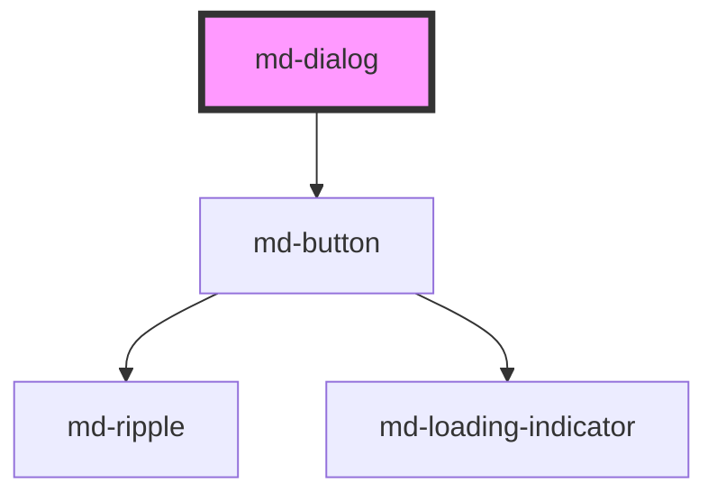

# md-dialog

<!-- llm:meta
tag: md-dialog
category: containment
status: md3-mapped
m3-guidelines: https://m3.material.io/components/dialogs/guidelines
form-associated: false
depends-on: md-button
used-by: none
-->

**A modal that interrupts to get a decision.** Basic or full-screen, with an
optional icon and headline, a scrim, a focus trap that reaches into slotted
shadow roots, body-scroll locking, and an actions row you normally slot
yourself.

> Setup, theming, density and i18n are configured once for the whole library —
> see the library-wide specification, shipped next to these manuals as
> `main-llm.md` at the root of the `@awc-ui/core` package.

---

## When to use

- A prompt that **blocks normal operation** and needs a decision,
  acknowledgement, or a specific task.
- **Critical** information the user must not miss.
- Confirming a destructive or irreversible action ("Discard unsaved changes?").
- A focused sub-task on mobile (`fullscreen`).

## When NOT to use

| Situation | Use instead |
|---|---|
| Low- or medium-priority information | `md-snackbar` |
| A brief confirmation of something that already happened | `md-snackbar` |
| Explaining a control | `md-tooltip` |
| Supplementary content, mobile | `md-bottom-sheet` |
| Supplementary content, desktop | `md-side-sheet` |
| A list of actions from a trigger | `md-menu` |
| Content that could just live on the page | A page or `md-card` |
| Field-level validation errors | Inline error text on the field |

## Decision cues

| Need | Setting |
|---|---|
| Standard modal | default (no `fullscreen`) |
| Immersive sub-task (mobile) | `fullscreen` |
| Prevent click-away dismissal (destructive flows) | `scrim-dismissible="false"` |
| Emphasis glyph above the headline | `icon="warning"` or `slot="icon"` (basic variant only) |
| Rich headline markup | `slot="headline"` instead of the `headline` prop (basic variant only) |
| A title on a `fullscreen` dialog | The `headline` **prop** — the bar renders plain text, not a slot |
| Rule between content and actions | `divider` |
| Rule under the full-screen app bar | `header-divider` (full-screen only) |
| An action in the full-screen app bar | `slot="header-action"` |
| Localized built-in buttons | `locale`, or `close-label` / `cancel-label` / `ok-label` |
| Open/close from code | `show()` / `close()`, or set `open` |

## API contract

```html
<md-dialog
  open                                 <!-- default: false; reflects -->
  headline="Discard draft?"            <!-- default: "" -->
  icon="delete"                        <!-- default: "" (Material Symbols name) -->
  fullscreen                           <!-- default: false -->
  scrim-dismissible="true|false"       <!-- default: true -->
  divider                              <!-- default: false -->
  header-divider                       <!-- default: false (full-screen only) -->
  close-label="Close"                  <!-- default: "" → derived from locale -->
  cancel-label="Cancel"                <!-- default: "" → derived from locale -->
  ok-label="OK"                        <!-- default: "" → derived from locale -->
  locale="en-US"                       <!-- default: en-US -->
  density="-1|-2|-3|-4"                <!-- default: 0 (uncompacted; only -1…-4 have rules) -->
>
  <p>Your changes will be lost.</p>
  <md-button slot="actions" variant="text">Cancel</md-button>
  <md-button slot="actions" variant="filled">Discard</md-button>
</md-dialog>
```

**Events** — `mdOpen`, `mdClose`, `mdCancel`, all `CustomEvent<void>` and all
default Stencil events (bubbling and composed).

**Methods** — `show(): Promise<void>` and `close(): Promise<void>`. Both just
set `open`, so `open` stays the single source of truth.

**Slots** — `(default)` body content · `actions` · `headline` and `icon`
(**basic variant only** — neither slot is rendered when `fullscreen`) ·
`header-action` (rendered only when `fullscreen`).

**Parts** — `scrim`, `container`, `header`, `icon`, `headline`, `close-button`,
`content`, `divider`, `actions`, `cancel-button`, `ok-button`.

### Behavioral contract worth knowing

- **You supply the action buttons** via `slot="actions"`. When that slot is
  empty the dialog renders two fallback buttons instead — a text Cancel (which
  emits `mdCancel` and closes) and a filled OK (which just closes). `cancel-label`
  / `ok-label` name only those fallbacks; any slotted button replaces both.
- **Slotted action buttons do not close the dialog.** They are your markup, so
  wire them to `close()` yourself.
- **Button order is yours to get right.** M3 puts dismissive actions on the
  leading side of confirming actions. The component does not reorder them.
- `mdCancel` fires only on dismissal — Escape, a scrim click, the full-screen
  close button, or the built-in fallback Cancel. `mdClose` fires on *every*
  close, including those. A dismissal therefore emits `mdCancel` **and**
  `mdClose`; don't handle the same case twice.
- `mdOpen` / `mdClose` fire from a watcher on `open`, so they do **not** fire on
  mount for a dialog that starts `open` — only on a subsequent change.
- **The role differs by variant**: the basic dialog's container is
  `role="alertdialog"`, the full-screen one is `role="dialog"`. Both are
  `aria-modal="true"`.
- **Full-screen dialogs have no scrim.** The scrim element (and therefore
  `scrim-dismissible`) exists only for the basic variant.
- **A full-screen dialog titles itself from the `headline` prop only.** Its app
  bar renders the prop as bare text; there is no `<slot name="headline">` and no
  `<slot name="icon">` outside the basic header. Passing
  `<md-dialog fullscreen><span slot="headline">…</span></md-dialog>` therefore
  renders an empty `part="headline"` element that `aria-labelledby` still points
  at — a full-screen dialog with no visible title **and no accessible name**.
  Use `headline="…"` there, and put rich markup in the body or in
  `slot="header-action"`.
- **Focus is handled for you.** On open the dialog focuses the first visible
  tabbable element — the trap descends into open shadow roots, so the `<input>`
  inside a slotted `md-text-field` counts — or the container itself if there is
  none. Tab and Shift+Tab wrap inside the dialog. On close, focus returns to
  whatever was focused before, with `preventScroll`.
- Escape closes the dialog and calls `preventDefault()` + `stopPropagation()`,
  so an outer Escape handler will not also fire.
- The dialog sets `document.body.style.overflow = 'hidden'` while open and
  clears it on close and on disconnect.
- The host is `display: contents`; the scrim and container are `position: fixed`
  at `z-index` 2147483646 / 2147483647, so the dialog paints above host-app
  chrome. Override with `--md-dialog-scrim-z-index` / `--md-dialog-z-index`.
- `icon` renders a Material Symbols ligature; it only shows a glyph if the
  Material Symbols font is loaded. Use `slot="icon"` for any other artwork.
- M3 wants confirming actions **disabled until a choice is made**; dismissive
  actions are never disabled. That is your logic, not the component's.

---

## Do / Don't

Sourced from [M3 · Dialogs · Guidelines](https://m3.material.io/components/dialogs/guidelines).

| ✅ Do | ❌ Don't |
|---|---|
| Use dialogs for prompts that block normal operation and need a decision or acknowledgement | Don't use dialogs for low/medium-priority information — use a snackbar |
| Pose a specific question, explain what's involved, give clear actions | Don't use an ambiguous headline |
| Shorten app-bar text and put long headlines in the content area of a full-screen dialog | Avoid long headlines in a full-screen dialog's app bar — truncation misleads |
| Disable confirming actions until a choice is made | Never disable dismissive actions |
| Place dismissive actions on the **leading** side of confirming actions | Don't put dismissive actions after the confirming one |
| Provide a single action only when it's an acknowledgement | Avoid unclear choices — "Cancel" makes no sense with no proposed action |
| Display two text buttons side by side | Stack them only for long labels; confirming above dismissive |
| Label the confirming action with the verb ("Create") | Don't use vague "OK" when a verb is clearer |
| Use a basic dialog to confirm discarding unsaved changes | Don't trigger a second dialog from a confirming action |
| Show field errors inline | Don't put field-level validation in a dialog |
| Keep the dialog self-contained | Beware actions that navigate away and leave it indeterminate |

---

## Patterns

```html
<!-- Destructive confirmation: no click-away, dismissive first -->
<md-button id="open-confirm">Discard draft</md-button>

<md-dialog id="confirm" headline="Discard draft?" icon="delete"
           scrim-dismissible="false">
  <p>Your changes will be lost.</p>
  <md-button slot="actions" variant="text" id="confirm-cancel">Cancel</md-button>
  <md-button slot="actions" variant="filled" id="confirm-discard">Discard</md-button>
</md-dialog>

<script type="module">
  const dlg = document.getElementById('confirm');

  document.getElementById('open-confirm')
    .addEventListener('mdClick', () => dlg.show());

  // Slotted buttons never close the dialog on their own.
  document.getElementById('confirm-cancel')
    .addEventListener('mdClick', () => dlg.close());

  document.getElementById('confirm-discard')
    .addEventListener('mdClick', () => {
      discardDraft();
      dlg.close();
    });

  // Dismissal only (Escape / close button). mdClose also fires here.
  dlg.addEventListener('mdCancel', () => console.log('dismissed'));

  function discardDraft() {}
</script>
```

```html
<!-- Full-screen sub-task: short app-bar headline, detail in the body -->
<md-dialog id="new-event" fullscreen headline="New event" header-divider>
  <md-button slot="header-action" variant="text" id="event-save">Save</md-button>

  <h2>Create a calendar event</h2>
  <md-text-field id="event-title" label="Title"></md-text-field>
</md-dialog>

<script type="module">
  const dlg = document.getElementById('new-event');
  const save = document.getElementById('event-save');

  // M3: keep the confirming action disabled until a choice is made.
  save.disabled = true;
  document.getElementById('event-title')
    .addEventListener('mdInput', (e) => { save.disabled = !e.detail; });

  save.addEventListener('mdClick', () => dlg.close());
</script>
```

```html
<!-- Acknowledgement only: one action -->
<md-dialog id="updated" headline="Update installed" icon="check_circle">
  <p>Version 2.4 is now active.</p>
  <md-button slot="actions" variant="text" id="updated-ok">Got it</md-button>
</md-dialog>

<script type="module">
  const dlg = document.getElementById('updated');
  document.getElementById('updated-ok')
    .addEventListener('mdClick', () => dlg.close());
</script>
```

```html
<!-- No slotted actions: the built-in Cancel / OK fallback, localized -->
<md-dialog id="simple" headline="Continuer ?" locale="fr-FR"></md-dialog>

<script type="module">
  const dlg = document.getElementById('simple');
  dlg.addEventListener('mdCancel', () => console.log('Annuler pressed'));
  dlg.addEventListener('mdClose', () => console.log('closed'));
  dlg.show();
</script>
```

## Anti-patterns

| ❌ Wrong | ✅ Right | Why |
|---|---|---|
| Expecting a slotted action button to close the dialog | Call `close()` in its handler | Only the built-in fallback buttons close by themselves. |
| Setting `ok-label` while also slotting `[slot="actions"]` | Pick one source of actions | The slot replaces the fallback buttons, so the label is dead config. |
| Handling `mdCancel` and `mdClose` as mutually exclusive | `mdCancel` implies `mdClose` | A dismissal emits both — you'll double-handle. |
| Waiting for `mdOpen` on a dialog rendered with `open` | Assume it is open, or call `show()` after mount | The event comes from the `open` watcher and does not fire on mount. |
| Dismissive action after the confirming one | Dismissive on the leading side | M3 explicit rule; the component won't reorder. |
| `scrim-dismissible` left on for a destructive confirm | `scrim-dismissible="false"` | Accidental click-away destroys data. |
| `scrim-dismissible="false"` on a `fullscreen` dialog | Drop it | Full-screen dialogs render no scrim, so the prop is inert. |
| A disabled Cancel button | Never disable dismissive actions | M3 explicit rule. |
| Writing your own focus trap or restore-focus code around it | Let the dialog do it | It traps Tab, focuses the first tabbable on open and restores focus on close. |
| Setting `role` or `aria-modal` on `<md-dialog>` | Leave them alone | The container inside the shadow root already carries them. |
| A dialog for "Saved successfully" | `md-snackbar` | Low priority, non-blocking. |
| Opening a second dialog from the confirming action | Resolve in one | M3 explicit rule. |
| A long headline in a `fullscreen` dialog's bar | Short bar text, detail in the body | Truncation misleads. |
| `slot="headline"` or `slot="icon"` on a `fullscreen` dialog | `headline="…"`; drop the icon | Both slots live inside the basic header only. The slotted node never renders, and the empty headline element still gets `aria-labelledby` — the dialog loses its accessible name. |
| Field validation errors in a dialog | Inline on the field | M3 explicit rule. |

## Accessibility, RTL, density, i18n

**Accessibility**
- The dialog is modal: `aria-modal="true"`, focus is trapped while open, and
  Escape dismisses (firing `mdCancel` then `mdClose`). Focus restoration on
  close is automatic.
- The container is `role="alertdialog"` for the basic variant and
  `role="dialog"` when `fullscreen`.
- `headline` (the prop, or the `headline` slot in the basic variant) is wired to
  `aria-labelledby`; the content region is wired to `aria-describedby`. If you
  slot a headline, keep real text in it or the dialog loses its accessible name
  — and note the slot is not rendered when `fullscreen`, so a full-screen dialog
  must use the `headline` prop. An `aria-label` on the `<md-dialog>` host is not
  a fallback: `role="dialog"` sits on the container inside the shadow root, not
  on the host.
- The full-screen close button gets its accessible name from `close-label`, or
  from `locale` when that is empty.
- The focus trap only sees **open** shadow roots. A third-party component with a
  closed shadow root inside the dialog contributes no tab stop.
- Keep DOM order of the actions meaningful — that is the order screen readers
  and keyboard users get.

**RTL** — the container, header and actions row use logical properties and
mirror under `dir="rtl"`. "Dismissive first" means **leading**, so it renders on
the right in RTL automatically; do not hardcode a side.

**Density** — set `density="-1"` … `density="-4"` for a local rung, or inherit a
global `data-density` ancestor. Rung `0` is the uncompacted default and has no
rule of its own, so `density="0"` does **not** opt a dialog out of an inherited
rung; use `style="--md-sys-density-scale: 0"` to reset the scale locally.
Density compacts corner radius, header/content padding, headline and body type,
and the full-screen app-bar height.

**i18n** — translate `headline`, body content and your slotted action labels.
`locale` picks the built-in Close / Cancel / OK strings; `ar`, `de`, `es`, `fr`,
`hi`, `it`, `ja`, `ko`, `nl`, `pl`, `pt`, `ro`, `ru` and `zh` are built in and
anything else falls back to English. `close-label` / `cancel-label` / `ok-label`
override the resolved string. Translated action labels run longer — check
whether buttons need stacking.

## Related components

`md-snackbar` · `md-bottom-sheet` · `md-side-sheet` · `md-menu` ·
`md-card` · `md-button` · `md-tooltip`

## Theming

| Custom property | Purpose | Default |
|---|---|---|
| `--md-dialog-container-color` | Surface background | `--md-sys-color-surface-container-high` |
| `--md-dialog-container-shape` | Corner radius | `max(16px, 28px + density × 2px)` |
| `--md-dialog-headline-color` | Headline text colour | `--md-sys-color-on-surface` |
| `--md-dialog-content-color` | Supporting-text colour | `--md-sys-color-on-surface-variant` |
| `--md-dialog-icon-color` | Header glyph colour | `--md-sys-color-secondary` |
| `--md-dialog-icon-size` | Header glyph box | `24px` |
| `--md-dialog-scrim-color` | Backdrop colour (basic only) | `rgba(0, 0, 0, 0.32)` |
| `--md-dialog-divider-color` | Divider rules | `--md-sys-color-outline-variant` |
| `--md-dialog-z-index` | Surface stacking | `2147483647` |
| `--md-dialog-scrim-z-index` | Scrim stacking | `2147483646` |

**CSS parts** — `scrim`, `container`, `header`, `icon`, `headline`,
`close-button`, `content`, `divider`, `actions`, `cancel-button`, `ok-button`.

```css
md-dialog.branded {
  --md-dialog-container-color: var(--md-sys-color-surface-container-highest);
  --md-dialog-scrim-color: rgba(0, 0, 0, 0.6);
}

md-dialog.branded::part(headline) {
  text-align: center;
}
```

<!-- Auto Generated Below -->


## Properties

| Property           | Attribute           | Description                                                                                                                                                                                           | Type                        | Default   |
| ------------------ | ------------------- | ----------------------------------------------------------------------------------------------------------------------------------------------------------------------------------------------------- | --------------------------- | --------- |
| `cancelLabel`      | `cancel-label`      | Label for the default cancel action button (slot fallback). Leave empty to derive from `locale`.                                                                                                      | `string`                    | `''`      |
| `closeLabel`       | `close-label`       | Accessible label for the full-screen close button. Leave empty to derive from `locale`.                                                                                                               | `string`                    | `''`      |
| `density`          | `density`           | Local density rung. Drives the same `--md-sys-density-scale` signal that a global `data-density` ancestor sets, so a local value simply overrides the inherited one. 0 = default, -4 = ultra-compact. | `-1 \| -2 \| -3 \| -4 \| 0` | `0`       |
| `divider`          | `divider`           | Show divider between content and actions                                                                                                                                                              | `boolean`                   | `false`   |
| `fullscreen`       | `fullscreen`        | Full-screen variant                                                                                                                                                                                   | `boolean`                   | `false`   |
| `headerDivider`    | `header-divider`    | Show divider between header and content (full-screen)                                                                                                                                                 | `boolean`                   | `false`   |
| `headline`         | `headline`          | Headline text (or use the headline slot)                                                                                                                                                              | `string`                    | `''`      |
| `icon`             | `icon`              | Icon name (Material Symbols shorthand, or use the icon slot)                                                                                                                                          | `string`                    | `''`      |
| `locale`           | `locale`            | BCP-47 locale for built-in button labels (Close, Cancel, OK).                                                                                                                                         | `string`                    | `'en-US'` |
| `okLabel`          | `ok-label`          | Label for the default confirm action button (slot fallback). Leave empty to derive from `locale`.                                                                                                     | `string`                    | `''`      |
| `open`             | `open`              | Whether the dialog is open                                                                                                                                                                            | `boolean`                   | `false`   |
| `scrimDismissible` | `scrim-dismissible` | Whether clicking the scrim closes the dialog                                                                                                                                                          | `boolean`                   | `true`    |


## Events

| Event      | Description                              | Type                |
| ---------- | ---------------------------------------- | ------------------- |
| `mdCancel` | Emits when dismissed via scrim or Escape | `CustomEvent<void>` |
| `mdClose`  | Emits when the dialog closes             | `CustomEvent<void>` |
| `mdOpen`   | Emits when the dialog opens              | `CustomEvent<void>` |


## Methods

### `close() => Promise<void>`

Close the dialog

#### Returns

Type: `Promise<void>`


### `show() => Promise<void>`

Open the dialog

#### Returns

Type: `Promise<void>`


## Shadow Parts

| Part              | Description |
| ----------------- | ----------- |
| `"actions"`       |             |
| `"cancel-button"` |             |
| `"close-button"`  |             |
| `"container"`     |             |
| `"content"`       |             |
| `"divider"`       |             |
| `"header"`        |             |
| `"headline"`      |             |
| `"icon"`          |             |
| `"ok-button"`     |             |
| `"scrim"`         |             |


## Dependencies

### Depends on

- [md-button](../md-button)

### Graph


----------------------------------------------

*Built with [StencilJS](https://stenciljs.com/)*
