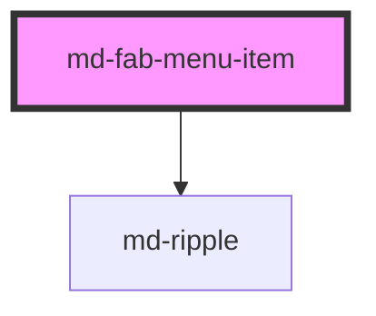

# md-fab-menu-item

<!-- llm:meta
tag: md-fab-menu-item
category: actions
status: sub-component
parent: md-fab-menu
standalone: false
m3-guidelines: https://m3.material.io/components/fab-menu/guidelines
form-associated: false
depends-on: md-ripple
used-by: none
-->

**One action row inside a `md-fab-menu`.** An icon, a label, and a pill
container. The parent menu owns opening, roving focus, and dismissal.

> 🧩 **Sub-component.** Only valid as a direct child of `md-fab-menu`.
> Standalone it renders a row that nothing manages — no keyboard model, no
> dismissal, no ARIA menu context.

---

## When to use

- As a child of `md-fab-menu`, one per branch action (M3 allows **2–6**).

## When NOT to use

| Situation | Use instead |
|---|---|
| A row in a normal dropdown menu | `md-menu-item` inside `md-menu` |
| A standalone action | `md-button` / `md-icon-button` / `md-fab` |
| A list row | `md-list-item` |
| An option that selects a value | `md-select-option`, `md-menu-item` |
| Anywhere outside `md-fab-menu` | Nothing — it won't be managed |

## API contract

```html
<md-fab-menu anchor="fab">
  <md-fab-menu-item icon="description" label="Document"></md-fab-menu-item>
  <md-fab-menu-item icon="photo" label="Photo" disabled></md-fab-menu-item>
</md-fab-menu>
```

| Prop | Attribute | Type | Default | Purpose |
|---|---|---|---|---|
| `icon` | `icon` | `string` | `''` | Material Symbols glyph |
| `label` | `label` | `string` | `''` | Row text |
| `disabled` | `disabled` | `boolean` | `false` | Inert — clicks and `Enter`/`Space` emit nothing |
| `softDisabled` | `soft-disabled` | `boolean` | `false` | Inert, styled the same way, kept for parity with the other action components |
| `rovingFocusVisible` | `roving-focus-visible` | `boolean` | `false` | **Managed by the parent** — paints the focus ring during arrow-key roving |
| `density` | `density` | `-1…-4` | `0` | Density rung (`0` is the uncompacted default; only the four negative rungs do anything) |

**Slots** — `(default)` for label content, `icon` for a custom glyph. The
`label` prop **wins**: the default slot only renders when `label` is empty.
Element content in the `icon` slot suppresses the `icon` prop's glyph.

**Event** — `mdClick`, `void` detail (`event.detail` is `null`), fired on
pointer activation and on `Enter`/`Space`. It bubbles and is composed.

There are no `@Method()`s on this component.

**Parts** — `state-layer`, `icon`, `label`.

### Behavioral contract worth knowing

- `rovingFocusVisible` is **set by `md-fab-menu`** during arrow-key navigation
  so the ring appears on the roved item even when DOM focus hasn't moved. Don't
  set it yourself.
- The item does not close the menu **itself**, but the menu closes anyway:
  `md-fab-menu` listens for the item's `mdClick` and calls `close()` plus
  `restoreFocusToAnchor()`. Run your action in the handler; leave dismissal
  alone.
- **`mdClick` has no `detail`** (it is `null`). Identify the pressed item from
  `e.target` — that is this element, even when the listener is on the parent
  `md-fab-menu`, because the event bubbles and is composed. `e.currentTarget` is
  whatever you attached the listener to, which is the menu in that case.
- The item **writes `tabindex="-1"` on itself** at load unless you already put a
  `tabindex` on it. The parent then hands `tabindex="0"` to whichever row is
  currently roved. Don't set `tabindex` yourself.
- `disabled` and `soft-disabled` behave **identically** here: both set
  `aria-disabled="true"`, disable the ripple, and swallow activation. Neither
  removes the row from the parent's roving order — a disabled row can still be
  arrowed to, it just does nothing. This differs from `md-button`, where
  `disabled` sets `tabindex="-1"`.
- The ripple is always rendered; there is no `ripple` prop to turn it off.

---

## Do / Don't

Sourced from [M3 · FAB menu · Guidelines](https://m3.material.io/components/fab-menu/guidelines).

| ✅ Do | ❌ Don't |
|---|---|
| Always provide a `label` | Don't remove the label — M3 requires it |
| Give each item an `icon` to differentiate the rows | Only omit the icon if truly necessary |
| Keep labels short and parallel in phrasing | Don't mix verb styles ("New doc" vs "Uploading a photo") |
| Keep container padding consistent across items | Don't expand or restyle individual item containers |
| Keep 2–6 items in the parent menu | Don't pad the menu out with marginal actions |
| Use positive, creation-flavored actions | Don't put destructive actions in a FAB menu |
| Use `disabled` to show an unavailable branch | Don't silently omit rows that come and go |

## Patterns

```html
<md-fab-menu anchor="fab" placement="up">
  <md-fab-menu-item icon="description" label="Document"></md-fab-menu-item>
  <md-fab-menu-item icon="table_chart" label="Spreadsheet"></md-fab-menu-item>
  <md-fab-menu-item icon="slideshow"   label="Presentation"></md-fab-menu-item>
</md-fab-menu>

<script type="module">
  const menu = document.querySelector('md-fab-menu');
  for (const item of menu.querySelectorAll('md-fab-menu-item')) {
    item.addEventListener('mdClick', () => {
      console.log('create', item.label);   // menu closes itself
    });
  }
</script>

<!-- One delegated listener on the menu works too — mdClick bubbles -->
<script type="module">
  document.querySelector('md-fab-menu').addEventListener('mdClick', (e) => {
    console.log('create', e.target.label);
  });
</script>
```

```html
<!-- Custom glyph via slot -->
<md-fab-menu-item label="Starred">
  <svg slot="icon" viewBox="0 0 24 24" width="20" height="20" fill="currentColor">
    <path d="M12 17.3 6.2 21l1.6-6.8L2.5 9.6l6.9-.6L12 2l2.6 7 6.9.6-5.3 4.6 1.6 6.8z"/>
  </svg>
</md-fab-menu-item>
```

## Anti-patterns

| ❌ Wrong | ✅ Right | Why |
|---|---|---|
| `md-fab-menu-item` outside `md-fab-menu` | Nest it in the menu | Nothing manages focus, ARIA, or dismissal. |
| Calling `menu.close()` in your handler | Just run the action | The menu already closes on the item's `mdClick`. |
| Setting `roving-focus-visible` by hand | Leave it to the parent | It is parent-managed state. |
| An icon with no `label` | Always set `label` | M3 forbids label-less FAB-menu items. |
| Reading `event.detail` for the item identity | Use the listener's element or `label` | The detail is `void`. |
| `md-menu-item` inside `md-fab-menu` | `md-fab-menu-item` | The parent queries for `md-fab-menu-item` only — other tags get no focus management. |
| Setting `tabindex` on an item to make it focusable | Leave it alone | The item and its parent own `tabindex`; yours is overwritten on the first roving move. |
| Expecting `disabled` to skip the row during arrow navigation | Remove the row, or accept a roved-but-inert stop | Roving walks every item; `disabled` only blocks activation. |
| Restyling a single item's container | Theme all items via the parent's custom properties | M3: keep item containers uniform. |

## Accessibility, RTL, density, i18n

- The parent supplies the `role="menu"` context; each item is one of its rows.
  Arrow keys rove, `Escape` closes — all handled by `md-fab-menu`.
- Both `disabled` and `soft-disabled` set `aria-disabled="true"` on the host;
  the row stays reachable by arrow keys so an unavailable branch is still
  discoverable and announced.
- Host role is `menuitem`; the parent supplies the surrounding `role="menu"`.
- The `label` **is** the accessible name — no extra `aria-label` needed.
- **RTL** — the row is laid out with logical properties, so the icon and label
  swap sides under `dir="rtl"` automatically.
- **Density** — `density="-1…-4"`; only those four rungs exist, and the rung
  normally arrives by inheritance from the parent `md-fab-menu` (or a global
  `data-density` ancestor). `density="0"` does not opt a row out of an inherited
  rung — reset with `style="--md-sys-density-scale: 0"` instead.
- **i18n** — translate `label`. Keep translated labels short so rows don't wrap.

## Related components

`md-fab-menu` · `md-fab` · `md-menu-item` · `md-list-item` · `md-ripple`

## Theming

Set these on the parent `md-fab-menu` so all rows stay uniform:

| Custom property | Purpose | Default |
|---|---|---|
| `--md-fab-menu-item-container-color` | Row background | `--md-sys-color-primary-container` |
| `--md-fab-menu-item-label-color` | Label color | `--md-sys-color-on-primary-container` |
| `--md-fab-menu-item-icon-color` | Glyph color | Follows the label color |
| `--md-fab-menu-item-icon-size` | Glyph size | 20px, tapered by density (16px floor) |
| `--md-fab-menu-item-container-shape` | Row corner radius | `--md-sys-shape-corner-full` (9999px) |

**CSS parts** — `state-layer`, `icon`, `label`.

```css
md-fab-menu {
  --md-fab-menu-item-container-color: var(--md-sys-color-surface-container-high);
  --md-fab-menu-item-label-color: var(--md-sys-color-on-surface);
}
```

<!-- Auto Generated Below -->


## Properties

| Property             | Attribute              | Description                                                                                                                                                                                                  | Type                        | Default |
| -------------------- | ---------------------- | ------------------------------------------------------------------------------------------------------------------------------------------------------------------------------------------------------------ | --------------------------- | ------- |
| `density`            | `density`              | Local density rung. Drives the same `--md-sys-density-scale` signal that a global `data-density` ancestor sets, so a local value simply overrides the inherited one. 0 = default, -4 = ultra-compact.        | `-1 \| -2 \| -3 \| -4 \| 0` | `0`     |
| `disabled`           | `disabled`             | Whether the item is disabled (removed from tab order).                                                                                                                                                       | `boolean`                   | `false` |
| `icon`               | `icon`                 | Material Symbols icon name.                                                                                                                                                                                  | `string`                    | `''`    |
| `label`              | `label`                | Item label text.                                                                                                                                                                                             | `string`                    | `''`    |
| `rovingFocusVisible` | `roving-focus-visible` | When `true`, paints the keyboard-focus ring even if the item does not hold DOM focus (e.g. arrow-key navigation drove `focusItem()`). Set by `md-fab-menu` during programmatic roving — not on initial open. | `boolean`                   | `false` |
| `softDisabled`       | `soft-disabled`        | Whether the item is soft-disabled (still focusable but not activatable).                                                                                                                                     | `boolean`                   | `false` |


## Events

| Event     | Description                       | Type                |
| --------- | --------------------------------- | ------------------- |
| `mdClick` | Fires when the item is activated. | `CustomEvent<void>` |


## Shadow Parts

| Part            | Description |
| --------------- | ----------- |
| `"icon"`        |             |
| `"label"`       |             |
| `"state-layer"` |             |


## Dependencies

### Depends on

- [md-ripple](../md-ripple)

### Graph


----------------------------------------------

*Built with [StencilJS](https://stenciljs.com/)*
