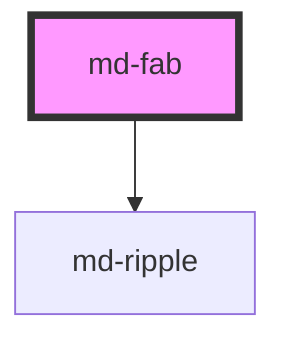

# md-fab

<!-- llm:meta
tag: md-fab
category: actions
status: md3-mapped
m3-guidelines: https://m3.material.io/components/floating-action-button/guidelines
m3-guidelines-extended: https://m3.material.io/components/extended-fab/guidelines
form-associated: false
depends-on: md-ripple
used-by: none
-->

**The single most prominent action on a screen.** Floats above the UI in seven
color mappings and three sizes, and morphs between an icon-only circle and an
**extended** pill that carries a label.

> Setup, theming, density and i18n are configured once for the whole library —
> see [`main-llm.md`](../../../../../main-llm.md), the library-wide manual that ships
> alongside these files.

---

## When to use

- **One** primary, constructive action per screen: compose, add, create, edit.
- The action is the reason the screen exists — not one option among several.
- Inside a `md-navigation-rail`, where it collapses to icon-only when the rail
  collapses.

## When NOT to use

| Situation | Use instead |
|---|---|
| A second prominent action on the same screen | `md-button variant="filled"` |
| Minor, overflow, unclear, or **destructive** actions | `md-button` / `md-menu` |
| An action scoped to a card or other container | `md-button` / `md-icon-button` inside it |
| One of a set of equal options | `md-button-group` |
| 2–6 related creation actions behind one trigger | `md-fab-menu` |
| Screens where imagery already represents the primary action | Nothing — M3 says a FAB isn't always needed |
| A destination change | `md-navigation-bar` / `md-navigation-rail` |

## Decision cues

| Need | Setting |
|---|---|
| Standard floating action | `size="standard"` (default) |
| More presence on a large screen | `size="medium"` or `"large"` — **icon-only FABs only** |
| Icon + label (extended FAB) | set `label` — `extended` follows automatically |
| Force icon-only despite a label | `extended="false"` |
| Force extended | `extended` |
| Reduced elevation (on a busy surface) | `lowered` |
| Highest color emphasis | `variant="primary"` |
| Softer, container-toned default | `variant="primary-container"` (default) |

`variant` accepts `surface`, `primary`, `secondary`, `tertiary` and the three
`-container` forms. The `-container` variants are the softer, standard look;
the bare roles are higher-contrast. `surface` is M3's own default and is the
only variant that changes container color under `lowered`
(`surface-container-high` → `surface-container-low`); this component keeps
`primary-container` as its default.

| `size` | Container (icon-only) | Icon |
|---|---|---|
| `standard` | 56 × 56px | 24px |
| `medium` | 80 × 80px | 28px |
| `large` | 96 × 96px | 36px |

A labelled FAB ignores `size` entirely — extended and collapsed forms are both
56px tall (`min-width` 80px extended, 56px collapsed).

## API contract

```html
<md-fab
  variant="surface|primary-container|secondary-container|tertiary-container|primary|secondary|tertiary"
  size="standard|medium|large"    <!-- default: standard -->
  icon="add"
  label="Compose"                 <!-- presence implies extended -->
  extended                        <!-- explicit override, tri-state -->
  lowered
  disabled | soft-disabled
  ripple
  density="-1|-2|-3|-4"           <!-- omit for the default rung -->
  aria-label="Compose"            <!-- REQUIRED when icon-only -->
></md-fab>
```

**Slot** — `icon`, for a custom glyph in place of the `icon` prop. Element
content in that slot suppresses the `icon` prop's glyph. There is no default
slot: the extended label comes from the `label` prop, not from slotted text.

**Event**

| Event | Cancelable | Detail | Fires |
|---|---|---|---|
| `mdClick` | yes, but ignored | `MouseEvent` | On activation |

`mdClick` is dispatched with `cancelable: true`, so `preventDefault()` succeeds
— but the component never reads `defaultPrevented`, so it changes nothing.
There is no veto hook on `md-fab`; use `md-button`, whose `mdClick` is honoured.

**Parts** — `state-layer`, `icon`, `label`.

### Behavioral contract worth knowing

- **`extended` is tri-state.** Left unset it is *derived*: extended whenever a
  `label` is present. Setting it explicitly (`true`/`false`) pins the state and
  lets the FAB **morph** between forms — this is how `md-navigation-rail`
  collapses it. Don't set it unless you're driving that transition.
- The detail of `mdClick` is the raw `MouseEvent`, not an object — there is no
  `detail.selected`. This FAB has **no toggle mode**.
- **`size` applies only to a FAB with no `label`.** The moment `label` is set
  the size class is dropped and the container follows the extended/collapsed
  metrics instead. `size="large" label="Compose"` is not a large extended FAB.
- The component writes `aria-label` from `label` **only when you did not author
  `aria-label` or `aria-labelledby` yourself**. Yours always wins.
- In collapsed form the visual label is `aria-hidden`, but the host's
  `aria-label` keeps the accessible name — the name survives the morph.
- In dev builds an icon-only FAB with no `label`, `aria-label` or
  `aria-labelledby` logs a `console.warn` naming the WCAG failure.
- A FAB does not position itself. Placement (fixed bottom-end, inside a rail,
  etc.) is yours to set with CSS.
- **While its menu is open**, `md-fab-menu` sets `data-shape="circle"` on its
  trigger FAB to force a full circle, and removes it again on close (and on
  disconnect). It is not a permanent marker on a FAB that anchors a menu. Don't
  set that attribute yourself.

---

## Do / Don't

Sourced from M3 · [FAB](https://m3.material.io/components/floating-action-button/guidelines)
and [Extended FAB](https://m3.material.io/components/extended-fab/guidelines).

| ✅ Do | ❌ Don't |
|---|---|
| Show **one** FAB per screen | Don't display multiple FABs on a single screen |
| Use it for primary, **positive** actions | Don't use it for minor, overflow, unclear, or destructive actions |
| Use clear, simple icons — `add`, `message`, `edit` | Don't use confusing or open-ended icons for uncommon actions |
| Place it within a navigation component such as a rail when appropriate | Don't give individual components, like cards, their own FAB |
| Let it disappear and reappear when switching pages | Don't keep the FAB on screen across page changes |
| Skip the FAB when imagery already represents the primary action | Don't force one onto every screen |
| Keep it above the rest of the UI, clear of app bars | Don't place it on top of toolbars — it breaks the elevation layering |
| Keep the extended label short; add an icon for context | Don't wrap or truncate the extended label |
| Remember an extended FAB may omit its icon | Don't give an extended FAB an icon **without** a text label |
| Keep it in the lower half of a mobile screen | Don't place an extended FAB in the upper half — it disrupts reading order |
| Show one prominent action at a time | Don't use several extended FABs — it destroys the hierarchy |
| Use a plain FAB alongside a floating toolbar | Don't pair an **extended** FAB with a floating toolbar |

---

## Patterns

```html
<!-- Standard: icon-only, fixed bottom-end -->
<md-fab icon="add" aria-label="New item"
        style="position:fixed; inset-block-end:24px; inset-inline-end:24px;"></md-fab>

<!-- Extended: label implies extended, icon adds context -->
<md-fab icon="edit" label="Compose"></md-fab>

<!-- Extended with no icon (allowed) -->
<md-fab label="Start a chat"></md-fab>

<!-- Large, high-emphasis -->
<md-fab variant="primary" size="large" icon="add" aria-label="Create"></md-fab>

<!-- Lowered, for a visually busy surface -->
<md-fab lowered icon="add" aria-label="Add"></md-fab>

<!-- Morphing: pinned extended state, driven by layout.
     `extended` is a tri-state boolean, so drive it as a JS property —
     removing the attribute would fall back to "derived", not to false. -->
<md-fab id="create-fab" icon="add" label="Create"></md-fab>
<script>
  const fab = document.getElementById('create-fab');
  const narrow = window.matchMedia('(max-width: 600px)');
  const sync = () => { fab.extended = !narrow.matches; };
  sync();
  narrow.addEventListener('change', sync);
</script>

<!-- Hide when the current view has no primary action, per M3 -->
<script>
  document.getElementById('create-fab').hidden = true;
</script>
```

## Anti-patterns

| ❌ Wrong | ✅ Right | Why |
|---|---|---|
| Two FABs on one screen | One FAB; demote the other to `md-button` | M3's clearest FAB rule. |
| A FAB for "Delete" | `md-button` or `md-icon-button` | FABs are for positive actions. |
| A FAB inside each `md-card` | One screen-level FAB, or per-card `md-button` | M3 forbids per-container FABs. |
| `<md-fab icon="add">` with no `aria-label` | Add `aria-label` | Icon-only FABs have no accessible name. |
| `<md-fab icon="add" extended>` with no `label` | Add a `label`, or drop `extended` | An extended FAB can't be icon-only. |
| Setting `extended="false"` to hide a label you didn't set | Just omit `label` | `extended` is derived unless pinned. |
| `e.detail.selected` in the click handler | `mdClick` detail is a `MouseEvent` | There's no toggle mode. |
| Expecting the FAB to position itself | Position it with CSS | The component is layout-agnostic. |
| `<md-fab size="large" label="Compose">` expecting a large pill | Drop `label`, or accept the 56px extended height | `size` is ignored once `label` is set. |
| `fab.setAttribute('extended', '')` / `removeAttribute` to collapse | `fab.extended = false` | Removing the attribute returns it to *derived*, which is extended whenever `label` is set. |
| Extended FAB overlapping a toolbar | Move it clear, or use a plain FAB | M3 calls out both cases. |
| A wrapping/truncating extended label | Shorten the text | M3: never wrap or truncate. |

## Accessibility, RTL, density, i18n

**Accessibility**
- Icon-only FABs **must** have `aria-label`. Extended FABs take their name from
  `label`, so an extra `aria-label` is redundant unless it adds detail.
- `Enter`/`Space` activate. `disabled` leaves the tab order;
  `soft-disabled` stays focusable.
- A fixed FAB can cover other controls — M3 requires the actionable element
  *and its focus indicator* to remain visible behind it. Check this at your
  smallest supported viewport.
- Its position in the DOM should match its importance in the reading order;
  don't append it last purely for CSS convenience.

**RTL** — position with logical properties (`inset-inline-end`) so it moves to
the correct corner. Swap directional glyphs yourself; `add`/`edit` need no
change.

**Density** — `density="-1…-4"` tightens the container; only those four rungs
exist and omitting the attribute is the uncompacted default. `density="0"` does
**not** opt out of an ancestor's `data-density` rung — reset the scale with
`style="--md-sys-density-scale: 0"` instead. The standard FAB floors at 40px,
so check the touch target on deep rungs.

**i18n** — `label` and `aria-label` come from your dictionary. Translated labels
run longer, so re-check M3's no-wrap/no-truncate rule per locale.

## Related components

`md-fab-menu` · `md-fab-menu-item` · `md-button` · `md-icon-button` ·
`md-navigation-rail` · `md-toolbar` · `md-ripple`

## Theming

| Custom property | Purpose | Default |
|---|---|---|
| `--md-fab-container-color` | Container background | Per variant (`--md-sys-color-primary-container`) |
| `--md-fab-icon-color` | Glyph color | Per variant (`--md-sys-color-on-primary-container`) |
| `--md-fab-icon-size` | Glyph size | 24px `standard` / 28px `medium` / 36px `large` |
| `--md-fab-container-shape` | Corner radius | `--md-sys-shape-corner-large` (`extra-large` on `medium`/`large`) |
| `--md-fab-label-color` | Extended-label color | `inherit` — the host color, i.e. the variant icon color |

**CSS parts** — `state-layer`, `icon`, `label`.

```css
md-fab.brand {
  --md-fab-container-color: var(--md-sys-color-tertiary);
  --md-fab-icon-color: var(--md-sys-color-on-tertiary);
  --md-fab-label-color: var(--md-sys-color-on-tertiary);
}
```

<!-- Auto Generated Below -->


## Properties

| Property       | Attribute       | Description                                                                                                                                                                                                                                                                                                                                                                                                        | Type                                                                                                                          | Default               |
| -------------- | --------------- | ------------------------------------------------------------------------------------------------------------------------------------------------------------------------------------------------------------------------------------------------------------------------------------------------------------------------------------------------------------------------------------------------------------------ | ----------------------------------------------------------------------------------------------------------------------------- | --------------------- |
| `density`      | `density`       | Local density rung. Drives the same `--md-sys-density-scale` signal that a global `data-density` ancestor sets, so a local value simply overrides the inherited one. 0 = default, -4 = ultra-compact.                                                                                                                                                                                                              | `-1 \| -2 \| -3 \| -4 \| 0`                                                                                                   | `0`                   |
| `disabled`     | `disabled`      |                                                                                                                                                                                                                                                                                                                                                                                                                    | `boolean`                                                                                                                     | `false`               |
| `extended`     | `extended`      | Whether the FAB shows its label (extended) or collapses to an icon-only circle. Leave unset for the default behaviour (extended whenever a `label` is provided). Set explicitly — e.g. by `<md-navigation-rail>` on collapse — to morph between extended and icon-only: the label width/opacity springs closed and the container shrinks to a 56px circle, while the label stays available as the accessible name. | `boolean \| undefined`                                                                                                        | `undefined`           |
| `icon`         | `icon`          |                                                                                                                                                                                                                                                                                                                                                                                                                    | `string`                                                                                                                      | `''`                  |
| `label`        | `label`         |                                                                                                                                                                                                                                                                                                                                                                                                                    | `string`                                                                                                                      | `''`                  |
| `lowered`      | `lowered`       |                                                                                                                                                                                                                                                                                                                                                                                                                    | `boolean`                                                                                                                     | `false`               |
| `ripple`       | `ripple`        |                                                                                                                                                                                                                                                                                                                                                                                                                    | `boolean`                                                                                                                     | `true`                |
| `size`         | `size`          |                                                                                                                                                                                                                                                                                                                                                                                                                    | `"large" \| "medium" \| "standard"`                                                                                           | `'standard'`          |
| `softDisabled` | `soft-disabled` |                                                                                                                                                                                                                                                                                                                                                                                                                    | `boolean`                                                                                                                     | `false`               |
| `variant`      | `variant`       |                                                                                                                                                                                                                                                                                                                                                                                                                    | `"primary" \| "primary-container" \| "secondary" \| "secondary-container" \| "surface" \| "tertiary" \| "tertiary-container"` | `'primary-container'` |


## Events

| Event     | Description                                                                                                                                                                                                                                                                                                                                                                                                                                         | Type                      |
| --------- | --------------------------------------------------------------------------------------------------------------------------------------------------------------------------------------------------------------------------------------------------------------------------------------------------------------------------------------------------------------------------------------------------------------------------------------------------- | ------------------------- |
| `mdClick` | Fires when the user activates the FAB (mouse click, touch, or `Enter`/`Space` while focused). Not emitted when `disabled` or `soft-disabled`. Bubbles and is composed so a delegated listener on a parent element works.  ```ts document.querySelector('md-fab')!.addEventListener('mdClick', (e) => {   const mouseEvent = (e as CustomEvent<MouseEvent>).detail;   console.log('FAB clicked at', mouseEvent.clientX, mouseEvent.clientY); }); ``` | `CustomEvent<MouseEvent>` |


## Shadow Parts

| Part            | Description |
| --------------- | ----------- |
| `"icon"`        |             |
| `"label"`       |             |
| `"state-layer"` |             |


## Dependencies

### Depends on

- [md-ripple](../md-ripple)

### Graph


----------------------------------------------

*Built with [StencilJS](https://stenciljs.com/)*
