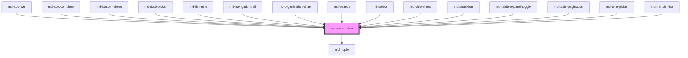

# md-icon-button

<!-- llm:meta
tag: md-icon-button
category: actions
status: md3-mapped
m3-guidelines: https://m3.material.io/components/icon-buttons/guidelines
form-associated: false
depends-on: md-ripple
used-by: md-app-bar, md-autocomplete, md-bottom-sheet, md-date-picker, md-list-item, md-navigation-rail, md-organization-chart, md-search, md-select, md-side-sheet, md-snackbar, md-table-expand-toggle, md-table-pagination, md-time-picker, md-transfer-list
-->

**A common action expressed as an icon alone.** Four emphasis styles, five
sizes, three container widths, round/square shape with shape morphing, and an
optional toggle mode with a distinct selected glyph.

> Setup, theming, density and i18n are configured once for the whole library —
> see [`main-llm.md`](../../../../../main-llm.md), the library-wide manual that ships
> alongside these files.

---

## When to use

- A **common, recognizable action** where the icon carries the meaning: close,
  delete, share, edit, more.
- A control that **opens something else** — a menu, a search field, a sheet.
- A **binary toggle** with no label: favorite, bookmark, mute, pin (`toggle`).
- Actions inside dense containers — app bars, toolbars, cards, list rows, table
  cells — where a labelled button would not fit.

## When NOT to use

| Situation | Use instead |
|---|---|
| The action needs a text label to be understood | `md-button` |
| The single most prominent action on the screen | `md-fab` |
| An action with no selected state, given `toggle` | Plain `md-icon-button` — M3 explicitly warns against this |
| Filtering, attributes, or removable entries | `md-chip` |
| Choosing between 2–5 exclusive options | `md-segmented-button-set` |
| Navigating between destinations | `md-navigation-bar` / `md-navigation-rail` |
| The icon's meaning isn't obvious without a tooltip *and* the action is critical | `md-button` with a label |

## Decision cues

Emphasis, highest first:

| Need | `variant` |
|---|---|
| High-emphasis, key action (download, delete) — use sparingly | `filled` |
| Secondary action paired with a high-emphasis one | `tonal` |
| Medium emphasis; not the focus of the interaction | `outlined` |
| Low emphasis, or on a colorful surface | `standard` (default) |

M3: use `filled`, `tonal`, or `outlined` when the button needs **visual
separation from its background**. `standard` has no container until interacted
with.

| `size` | Height | Icon | Typical use |
|---|---|---|---|
| `xs` | 32px | 20px | Table rows, dense toolbars |
| `sm` | 40px | 24px | **Default.** App bars, cards, list rows |
| `md` | 56px | 24px | Touch-first surfaces |
| `lg` | 96px | 32px | Prominent standalone control |
| `xl` | 136px | 40px | Hero / media control |

The icon ladder is not proportional to the container: `sm` and `md` share the
same 24px glyph.

`button-width` — `narrow`, `default`, `wide`. Widens the container without
changing the glyph or the height; use `wide` for a bigger hit area in sparse
layouts, `narrow` to tighten a dense cluster.

## API contract

```html
<md-icon-button
  variant="standard|filled|outlined|tonal"   <!-- default: standard -->
  size="xs|sm|md|lg|xl"                       <!-- default: sm -->
  shape="round|square"                        <!-- default: round -->
  button-width="narrow|default|wide"          <!-- default: default -->
  icon="favorite"
  toggle selected selected-icon="favorite"
  href="/settings" target="_self"
  disabled | soft-disabled
  shape-morph ripple
  density="-1|-2|-3|-4"                      <!-- omit for the default rung -->
  aria-label="Add to favorites"               <!-- REQUIRED -->
></md-icon-button>
```

**Slots** — `(default)` for a custom unselected glyph, `selected` for the
selected-state glyph in toggle mode. Meaningful content in a slot suppresses
the matching `icon` / `selected-icon` prop glyph. One exception: a slotted
`md-badge` in the default slot is treated as an adornment, not as the icon —
the `icon` prop still renders, and the host stops clipping so the badge can
straddle the corner.

**Event**

| Event | Cancelable | Detail | Fires |
|---|---|---|---|
| `mdClick` | yes, but ignored | `{ selected: boolean }` | Every activation. In toggle mode `selected` is the **already-flipped** state |

**Parts** — `state-layer`, `icon`, `selected-icon`.

**Internal props — never set by hand:** `connectedLeft`, `connectedRight`,
`value`, `groupTabindex`. `md-button-group` owns these.

### Behavioral contract worth knowing

- **`preventDefault()` on `mdClick` is ignored.** The event object *is*
  cancelable, but the toggle has already flipped by the time it fires and the
  component never reads `defaultPrevented` — unlike `md-button`, there is no
  veto hook. To control selection externally, set `selected` back in your
  handler.
- The selected glyph renders only when `toggle` is on **and** a `selected-icon`
  or `selected` slot is provided. Otherwise the same icon shows in both states,
  differentiated by the container color.
- `aria-pressed` is emitted **only** in toggle mode.
- `disabled` removes it from tab order; `soft-disabled` keeps it focusable.
- There is **no `loading` prop** (unlike `md-button`).
- `href` does **not** short-circuit the rest of the handler: the button opens
  the link *and* flips the toggle *and* emits `mdClick`. Unsafe schemes
  (`javascript:` …) are refused; nothing else changes.
- Navigation uses `window.open(href, target)`, so `target="_self"` replaces the
  current document. This is not an `<a>` — no middle-click, no context menu,
  no `rel`.
- `xs` and `sm` icon buttons keep their glyph size across density rungs only
  down to a floor (16px on `xs`); the container itself floors at 32px, so a
  deep rung cannot collapse it entirely.

---

## Do / Don't

Sourced from [M3 · Icon buttons · Guidelines](https://m3.material.io/components/icon-buttons/guidelines).

| ✅ Do | ❌ Don't |
|---|---|
| Give a background (`filled`/`tonal`/`outlined`) so the button is visible on any surface | Don't rely on `standard` over busy or colorful backgrounds |
| When mixing variants, use color to make the primary action obvious | Don't give several icon buttons in one cluster the same high emphasis |
| Use `toggle` only when the icon genuinely has a selected state | Don't use a toggle icon button for actions without one — e.g. an overflow menu trigger |
| Use `filled` sparingly, for key actions like download or delete | Don't overuse `filled` on one screen |
| Use `tonal` as the middle ground for a secondary action beside a high-emphasis one | Don't jump straight from `filled` to `standard` when a middle step reads better |
| Use `standard` for low emphasis or on colorful surfaces | Don't use `standard` where the control must be discoverable at a glance |
| Pair with a `md-tooltip` so the meaning is discoverable | Don't ship an ambiguous glyph with no tooltip and no label |
| Always set `aria-label` | Don't ship an icon button with no accessible name |
| Swap outlined→filled glyph between unselected and selected | Don't leave the glyph identical when the state changes and nothing else does |

---

## Patterns

```html
<!-- App bar action -->
<md-icon-button icon="more_vert" aria-label="More options"
                aria-haspopup="menu"></md-icon-button>

<!-- Favorite toggle with a distinct selected glyph -->
<md-icon-button
  toggle icon="favorite_border" selected-icon="favorite"
  variant="standard" aria-label="Add to favorites"
></md-icon-button>

<!-- High-emphasis destructive action -->
<md-icon-button variant="filled" icon="delete" aria-label="Delete"></md-icon-button>

<!-- With a tooltip so the meaning is discoverable -->
<md-tooltip text="Download">
  <md-icon-button variant="tonal" icon="download" aria-label="Download"></md-icon-button>
</md-tooltip>

<!-- Custom glyphs via slots -->
<md-icon-button toggle aria-label="Bookmark">
  <svg viewBox="0 0 24 24" width="20" height="20" fill="none"
       stroke="currentColor" stroke-width="2">
    <path d="M6 3h12v18l-6-4-6 4z"/>
  </svg>
  <svg slot="selected" viewBox="0 0 24 24" width="20" height="20" fill="currentColor">
    <path d="M6 3h12v18l-6-4-6 4z"/>
  </svg>
</md-icon-button>

<!-- Controlled toggle (preventDefault on mdClick is ignored — revert instead) -->
<md-icon-button id="pin" toggle icon="push_pin" aria-label="Pin"></md-icon-button>
<script>
  const pin = document.getElementById('pin');
  pin.addEventListener('mdClick', async (e) => {
    const wanted = e.detail.selected;          // already-flipped state
    const res = await fetch('/api/pin', { method: 'POST', body: String(wanted) });
    if (!res.ok) pin.selected = !wanted;       // revert on failure
  });
</script>
```

## Anti-patterns

| ❌ Wrong | ✅ Right | Why |
|---|---|---|
| `<md-icon-button icon="close">` with no `aria-label` | Always add `aria-label` | There is no visible text — it has no accessible name otherwise. |
| `<md-button icon="delete"></md-button>` for an icon-only action | `md-icon-button` | `md-button` with no label has the wrong metrics and no name. |
| `toggle` on an overflow-menu trigger | Plain icon button + `aria-haspopup="menu"` | M3 names this exact anti-pattern; a menu has no selected state. |
| `preventDefault()` on `mdClick` to block a toggle | Set `selected` back in the handler | `preventDefault()` is **ignored** here — the toggle has already flipped and nothing checks `defaultPrevented`. Only `md-button` honours it. |
| Reading `detail.selected` as the pre-click state | It is the **post-flip** state | Opposite convention to `md-button`'s cancelable event. |
| `toggle` + `selected-icon` omitted, expecting a glyph change | Provide `selected-icon` or the `selected` slot | Without it only the container color changes. |
| Wrapping in `<button>` or `<a>` | Use the host, or its `href` | Nested interactive controls. |
| `loading` | No such prop — disable it and show progress elsewhere | Only `md-button` has `loading`. |
| Setting `connected-left` / `group-tabindex` | Let `md-button-group` do it | They are `@internal`. |
| A row of five `filled` icon buttons | One emphasized, the rest `standard`/`outlined` | M3: use filled sparingly. |

## Accessibility, RTL, density, i18n

**Accessibility**
- `aria-label` is **mandatory** — this is the single most common defect with
  this component. Localize it.
- `aria-pressed` is set automatically in toggle mode; don't set it yourself.
- `Enter`/`Space` activate. `disabled` → `tabindex="-1"`;
  `soft-disabled` stays focusable.
- If the button opens a popup, add `aria-haspopup` (and `aria-expanded` where
  you manage the open state).
- Keep the touch target ≥ 48px in touch contexts. `xs` (32px) and `sm` (40px)
  are already below that; the container floors at 32px, so density cannot
  shrink it further, but it cannot grow it either — pad the surrounding hit
  area yourself on touch surfaces.

**RTL** — the container is symmetric, so nothing flips automatically. If the
glyph is **directional** (`arrow_back`, `chevron_right`, `send`), swap the icon
name yourself for RTL locales.

**Density** — `density="-1…-4"` shrinks the container; only those four rungs
exist and omitting the attribute is the uncompacted default. `density="0"`
does **not** opt out of an ancestor's `data-density` rung — reset the scale
with `style="--md-sys-density-scale: 0"` instead. Combined with `size="xs"`
this gets small fast; verify the hit target.

**i18n** — `aria-label` and any tooltip text must come from your dictionary.
The component itself renders no text.

## Related components

`md-button` · `md-fab` · `md-button-group` · `md-segmented-button` ·
`md-chip` · `md-tooltip` · `md-menu` · `md-ripple`

## Theming

| Custom property | Purpose | Default |
|---|---|---|
| `--md-icon-button-container-color` | Container background | `transparent` (per variant) |
| `--md-icon-button-icon-color` | Glyph color | `--md-sys-color-on-surface-variant` |
| `--md-icon-button-state-layer-color` | Hover/focus/press overlay tint | `--md-sys-color-on-surface-variant` |
| `--md-icon-button-icon-size` | Glyph size | 20px `xs` / 24px `sm` / 24px `md` / 32px `lg` / 40px `xl`, tapered by density |
| `--md-icon-button-container-shape` | Corner radius | Half the size's height (`round`) |
| `--md-icon-button-outline-color` | `outlined` border color | `--md-sys-color-outline` |
| `--md-icon-button-outline-width` | `outlined` border width | `1px` |
| `--md-icon-button-container-width` | Container inline-size | Per size + `button-width` |
| `--md-icon-button-container-height` | Container block-size | 32/40/56/96/136px per size |

**CSS parts** — `state-layer`, `icon`, `selected-icon`.

```css
md-icon-button.danger {
  --md-icon-button-icon-color: var(--md-sys-color-error);
  --md-icon-button-state-layer-color: var(--md-sys-color-error);
}
```

<!-- Auto Generated Below -->


## Properties

| Property       | Attribute       | Description                                                                                                                                                                                           | Type                                              | Default      |
| -------------- | --------------- | ----------------------------------------------------------------------------------------------------------------------------------------------------------------------------------------------------- | ------------------------------------------------- | ------------ |
| `buttonWidth`  | `button-width`  | M3 Expressive width (narrow, default, wide)                                                                                                                                                           | `"default" \| "narrow" \| "wide"`                 | `'default'`  |
| `density`      | `density`       | Local density rung. Drives the same `--md-sys-density-scale` signal that a global `data-density` ancestor sets, so a local value simply overrides the inherited one. 0 = default, -4 = ultra-compact. | `-1 \| -2 \| -3 \| -4 \| 0`                       | `0`          |
| `disabled`     | `disabled`      | Prevents interaction and removes from tab order                                                                                                                                                       | `boolean`                                         | `false`      |
| `href`         | `href`          | Turns the button into a link                                                                                                                                                                          | `string`                                          | `''`         |
| `icon`         | `icon`          | Material Symbols icon name                                                                                                                                                                            | `string`                                          | `''`         |
| `ripple`       | `ripple`        | Whether to show the ripple effect                                                                                                                                                                     | `boolean`                                         | `true`       |
| `selected`     | `selected`      | Current selected state (toggle mode)                                                                                                                                                                  | `boolean`                                         | `false`      |
| `selectedIcon` | `selected-icon` | Icon shown when selected in toggle mode                                                                                                                                                               | `string`                                          | `''`         |
| `shape`        | `shape`         | Container shape                                                                                                                                                                                       | `"round" \| "square"`                             | `'round'`    |
| `shapeMorph`   | `shape-morph`   | Enable M3 Expressive shape morphing on press and toggle                                                                                                                                               | `boolean`                                         | `true`       |
| `size`         | `size`          | M3 Expressive size                                                                                                                                                                                    | `"lg" \| "md" \| "sm" \| "xl" \| "xs"`            | `'sm'`       |
| `softDisabled` | `soft-disabled` | Visually disabled but remains focusable for discoverability                                                                                                                                           | `boolean`                                         | `false`      |
| `target`       | `target`        | Link target attribute                                                                                                                                                                                 | `string`                                          | `'_self'`    |
| `toggle`       | `toggle`        | Enable toggle behavior (selected/unselected)                                                                                                                                                          | `boolean`                                         | `false`      |
| `variant`      | `variant`       | Visual style variant                                                                                                                                                                                  | `"filled" \| "outlined" \| "standard" \| "tonal"` | `'standard'` |


## Events

| Event     | Description                                                                       | Type                                  |
| --------- | --------------------------------------------------------------------------------- | ------------------------------------- |
| `mdClick` | Fires on pointer or keyboard activation. Detail includes toggle `selected` state. | `CustomEvent<{ selected: boolean; }>` |


## Shadow Parts

| Part              | Description |
| ----------------- | ----------- |
| `"icon"`          |             |
| `"selected-icon"` |             |
| `"state-layer"`   |             |


## Dependencies

### Used by

 - [md-app-bar](../md-app-bar)
 - [md-autocomplete](../md-autocomplete)
 - [md-bottom-sheet](../md-bottom-sheet)
 - [md-date-picker](../md-date-picker)
 - [md-list-item](../md-list-item)
 - [md-navigation-rail](../md-navigation-rail)
 - [md-organization-chart](../md-organization-chart)
 - [md-search](../md-search)
 - [md-select](../md-select)
 - [md-side-sheet](../md-side-sheet)
 - [md-snackbar](../md-snackbar)
 - [md-table-expand-toggle](../md-table-expand-toggle)
 - [md-table-pagination](../md-table-pagination)
 - [md-time-picker](../md-time-picker)
 - [md-transfer-list](../md-transfer-list)

### Depends on

- [md-ripple](../md-ripple)

### Graph


----------------------------------------------

*Built with [StencilJS](https://stenciljs.com/)*
