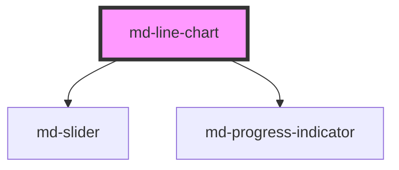

# md-line-chart

<!-- llm:meta
tag: md-line-chart
category: charts
status: custom
m3-guidelines: none — M3 has no chart components
form-associated: false
depends-on: md-slider, md-progress-indicator
used-by: none
engine: in-house Canvas2D + DOM overlay (utils/charts/engine)
-->

**A trend over a continuous axis.** One or many series, six curve types,
multiple y-axes, mark lines, drag-zoom and a slider band, plus a built-in
loading state.

> ⚠️ **Not a Material Design 3 component.** M3 ships no charts. The engine is
> **in-house Canvas2D with a DOM overlay** (`utils/charts/engine`).

> Setup, theming, density and i18n are configured once for the whole library —
> see [`main-llm.md`](../../../../../main-llm.md), the library-wide guide that ships
> alongside these component docs.

---

## When to use

- **Change over time** or over any continuous axis.
- Comparing the **shape** of several series.
- Dense series the user needs to zoom into.
- Irregular sampling — series whose points carry their own x values.

## When NOT to use

| Situation | Use instead |
|---|---|
| Comparing discrete categories | `md-bar-chart` |
| Emphasising cumulative volume | `md-area-chart` |
| Parts of a whole | `md-pie-chart` |
| An inline micro-trend in a cell | `md-sparkline` |
| Very few points (2–3) | Plain text or a bar chart |
| Unordered categories | `md-bar-chart` — lines imply continuity |

## Decision cues

| Need | Setting |
|---|---|
| Curve style | `curve="linear\|smooth\|monotone\|step\|step-before\|step-middle"` |
| Stack the series | `stack="normal\|percentage"` |
| Streamgraph baseline | `stack="silhouette"` or `stack="wiggle"` |
| Fill under the line | `area` (or use `md-area-chart`) |
| Points visible | `show-marks` |
| Scatter-like plot | `show-line="false"` + `show-marks` |
| Bridge gaps in data | `connect-nulls` |
| A second scale | `yAxes` (JS property) + `series[].yAxisIndex` |
| Thresholds / event markers | `markLines` (JS property) |
| Zoom | `zoom="inside\|slider\|both"` |
| Async data | `loading` (+ `loading-label`) |
| Swap the axes | `inverted` |
| Name each line at its end | `series-labels` |

## API contract

```html
<md-line-chart
  label="Sessions"
  subtitle="Last 30 days"
  title-align="start|center|end"                 <!-- default: start -->
  curve="linear|smooth|monotone|step|step-before|step-middle"   <!-- default: smooth -->
  stack="none|normal|percentage|silhouette|wiggle"   <!-- default: none -->
  connect-nulls                                  <!-- default: off -->
  show-marks                                     <!-- default: off -->
  area                                           <!-- default: off -->
  show-line                                      <!-- default: ON; set show-line="false" to drop the stroke -->
  inverted                                       <!-- default: off -->
  line-width="2.5"                               <!-- default: 2.5 -->
  mark-size="4"                                  <!-- default: per-symbol -->
  grid="none|horizontal|vertical|both"           <!-- default: horizontal -->
  axis-ticks                                     <!-- default: off -->
  show-labels                                    <!-- default: off -->
  series-labels                                  <!-- default: off -->
  legend="top|bottom|left|right|top-start|top-end|bottom-start|bottom-end|none"
                                                 <!-- default: top-end -->
  tooltip="axis|item|none"                       <!-- default: axis -->
  zoom="none|inside|slider|both"                 <!-- default: none -->
  locale="en-US"                                 <!-- default: "" (browser locale) -->
  height="320px"                                 <!-- default: aspect-ratio driven -->
  summary=""                                     <!-- replaces the generated aria-label -->
  loading                                        <!-- default: off -->
  loading-label="Loading chart…"
  label-empty="No data to display"
  label-plot="Chart data. Use the arrow keys to move between points, Home and End for the first and last, Escape to leave."
  label-point="%x%: %values%"
  label-zoom-start="Zoom range start"
  label-zoom-end="Zoom range end"
  animation="expressive|grow|fade|draw|stagger|none"   <!-- default: expressive -->
  animation-duration="700"                       <!-- default: engine default -->
  no-animation                                   <!-- default: off -->
  density="-1|-2|-3|-4"                          <!-- default: 0 (uncompacted) -->
></md-line-chart>
```

Objects, arrays and functions have no attribute form — set them as JS
properties:

```js
const chart = document.querySelector('md-line-chart');

// Bare y values, positioned by index against xAxis.data:
chart.xAxis  = { data: ['Jan', 'Feb', 'Mar'], scale: 'category' };
chart.series = [{ label: 'Sessions', data: [10, 14, 9] }];

// …or points that carry their own x (irregular sampling):
chart.xAxis  = { scale: 'time' };
chart.series = [{
  label: 'Sessions',
  data: [{ x: '2026-01-04', y: 10 }, { x: '2026-01-19', y: 14 }],
}];

chart.yAxis     = { label: 'Sessions', min: 0 };
chart.yAxes     = [{ label: 'Sessions' }, { label: 'Revenue', position: 'right' }];
chart.markLines = [{ value: '2026-03-01', label: 'Launch', dash: 'dashed' }];
chart.tableLabels    = { x: 'Date', series: 'Metric' };
chart.valueFormatter = (v) => new Intl.NumberFormat('en-US').format(v ?? 0);
chart.tooltipRenderer = (ctx) => `${ctx.axisLabel} — ${ctx.series.length} series`;
```

**Events** — `mdMarkerClick`, `mdLineClick`, `mdAreaClick` (all
`MdChartClickDetail`), `mdAxisClick` (`MdChartAxisClickDetail` — the nearest x
plus every visible series' value there), `mdLegendClick`
(`{ seriesIndex, seriesId?, selected }`), `mdHover` (throttled to one per
frame), `mdZoom` (`{ startIndex, endIndex, reset }`), `mdReady`. All are the
Stencil default — they bubble and cross shadow boundaries.

**Methods** — `resize()`, `replay()`, `toDataURL()`, `getInstance()`,
`setZoom(startIndex, endIndex)`, `resetZoom()`. All are async. There is **no
`drill()`** here — that lives on `md-bar-chart` and `md-pie-chart`.

**Slots** — `header` (above the plot), `footer` (below it), `empty` (replaces
`label-empty`), and `loader` (replaces the built-in spinner; `loading` is the
older alias for the same slot — `loader` wins if both are filled).

**Parts** — `header`, `canvas`, `empty`, `loading`, `footer`, `zoom`,
`zoom-slider`, `zoom-pan`, `zoom-band`, plus `zoom-track` / `zoom-window` /
`zoom-handle` forwarded from the inner `md-slider`. The engine additionally
marks the `<canvas>` as `plot-canvas` and the DOM overlay's legend and hover
card as `legend` and `tooltip`.

### Behavioral contract worth knowing

- **`series`, `xAxis`, `yAxis`, `yAxes`, `markLines`, `tableLabels`,
  `valueFormatter` and `tooltipRenderer` are JS properties.**
- **The axis field is `scale`, not `type`**: `{ scale: 'category' | 'time' |
  'value' | 'log' }`. A `type` key is silently ignored.
- **A series is either all bare values or all points.** Mixing them drops the
  bare ones, which have no x to sit at. A gap is `null` (or `{ x, y: null }`).
- `yAxes` (plural, array) is how you get a **second scale**, with
  `series[].yAxisIndex` selecting one; it supersedes the single `yAxis`. Don't
  set both.
- `show-line="false"` with `show-marks` gives a scatter-like plot. A per-series
  `series[].stroke` still wins over the chart-level prop.
- **`mdMarkerClick.dataIndex` addresses the clicked series' OWN `data` array**,
  which differs from the merged axis index when series carry their own x.
  `mdAxisClick` reports the axis `dataIndex` plus each series' own index.
- **Zoom is a view, not a mutation.** `series` / `xAxis` are untouched and every
  index reported back to you stays **absolute**. `setZoom()` takes absolute
  indices, not fractions; `zoom="inside"` also resets on a double-click in the
  plot.
- **Legend toggles survive a data re-feed** — a series the reader hid stays
  hidden when `series` is reassigned, keyed by `id`, else `label`, else
  position. An explicit `series[i].hidden` still wins.
- **`loading` covers the plot** with the loader and sets `aria-busy="true"`;
  clearing it replays the entry animation so the arriving data draws itself in.
- Call **`resize()`** when the container changes size in a way the layout
  doesn't propagate (e.g. a revealed tab panel).
- `mdReady` fires after the first frame is drawn — gate `toDataURL()` on it.
- `getInstance()` returns the underlying engine. It is an escape hatch; anything
  done through it is outside this component's contract.
- `label-point` uses **`%x%` / `%values%`** percent tokens — keep both when
  translating. `summary` replaces the whole generated `aria-label` sentence.
- Charts re-read the theme tokens and repaint on their own when
  `prefers-color-scheme` changes. Any *other* theme swap (a manual light/dark
  class, a brand-token change) needs a nudge: reassign `series`. `resize()` will not
  do it — it returns early when the box has not changed.

---

## Do / Don't

House rules — M3 ships no chart component, so the guidance below is this
library's own.

| ✅ Do | ❌ Don't |
|---|---|
| Use lines only for ordered, continuous data | Don't connect unordered categories — it implies continuity that isn't there |
| Keep the series count small (≤ ~5) | Don't draw a plate of spaghetti |
| Show gaps in the data as gaps | Don't `connect-nulls` when missing data is meaningful |
| Label the axes and provide units | Don't leave a bare numeric axis |
| Use `markLines` for targets and thresholds | Don't annotate with free-floating text |
| Use `zoom` for dense series | Don't downsample silently |
| Provide a data table alternative | Don't make the chart the only access to the numbers |
| Honour reduced motion | Don't force the entrance animation |
| Start the y-axis at zero when magnitude matters | Don't truncate the axis to exaggerate a trend |
| Show `loading` while fetching | Don't render an empty plot that looks like zero data |

---

## Patterns

```html
<md-line-chart id="c" label="Sessions" height="320px" zoom="both" grid="horizontal"></md-line-chart>

<script type="module">
  const c = document.getElementById('c');

  c.xAxis  = { scale: 'time', label: 'Date' };
  c.series = [
    { label: 'Sessions', data: [{ x: '2026-01-01', y: 120 }, { x: '2026-01-08', y: 168 }] },
    { label: 'Signups',  data: [{ x: '2026-01-01', y: 12 },  { x: '2026-01-08', y: 21 }] },
  ];
  c.markLines = [{ value: '2026-01-05', label: 'Launch' }];
  c.valueFormatter = (v) => new Intl.NumberFormat('en-US').format(v ?? 0);

  // setZoom takes absolute data INDICES — show points 10 through 40.
  c.addEventListener('mdReady', () => c.setZoom(10, 40));
  c.addEventListener('mdZoom',  (e) => syncOtherChart(e.detail.startIndex, e.detail.endIndex));
  c.addEventListener('mdMarkerClick', (e) => inspect(e.detail.seriesIndex, e.detail.dataIndex));
</script>
```

```html
<!-- Two independent scales -->
<md-line-chart id="dual" label="Sessions vs revenue"></md-line-chart>
<script type="module">
  const dual = document.getElementById('dual');
  dual.yAxes  = [{ label: 'Sessions' }, { label: 'Revenue', position: 'right' }];
  dual.xAxis  = { data: ['Mon', 'Tue', 'Wed'] };
  dual.series = [
    { label: 'Sessions', data: [120, 168, 140] },
    { label: 'Revenue',  data: [1.2, 1.9, 1.5], yAxisIndex: 1 },
  ];
</script>
```

```html
<!-- Scatter-like: marks, no stroke -->
<md-line-chart show-line="false" show-marks curve="linear"></md-line-chart>

<!-- Async -->
<md-line-chart loading loading-label="Loading sessions…"></md-line-chart>

<!-- Stepped, no animation -->
<md-line-chart curve="step-before" no-animation></md-line-chart>
```

## Anti-patterns

| ❌ Wrong | ✅ Right | Why |
|---|---|---|
| `chart.xAxis = { type: 'time' }` | `chart.xAxis = { scale: 'time' }` | The field is `scale`; `type` is ignored. |
| `series` / `markLines` as attributes | Assign them in JS | Arrays don't cross the attribute boundary. |
| `stack="percent"` | `stack="percentage"` | `percent` is not a value the prop accepts. |
| `chart.setZoom(0.6, 1)` | `chart.setZoom(24, 40)` | Zoom takes absolute data indices, not fractions. |
| Setting both `yAxis` and `yAxes` | Pick one | `yAxes` supersedes the single axis. |
| Mixing `[1, 2, null]` and `{ x, y }` in one series | Use one form throughout | The bare values are dropped — they have no x. |
| `chart.drill(...)` | Use `md-bar-chart` / `md-pie-chart` | The line chart has no `drill()`. |
| `connect-nulls` on genuinely missing data | Leave the gap | It fabricates data. |
| A line chart over unordered categories | `md-bar-chart` | Lines imply continuity. |
| `toDataURL()` before `mdReady` | Wait for the event | Nothing drawn yet. |
| Truncated y-axis to dramatise a trend | Start at zero, or state the range | Misleading. |
| Chart in a hidden tab with no `resize()` | Call it on reveal | Renders at zero size. |
| Driving state via `getInstance()` | Use props and methods | Outside the contract. |

## Accessibility, RTL, density, i18n

**Accessibility**
- The host is `role="figure"` with a generated `aria-label` summary (`summary`
  replaces it wholesale), and the plot is a focusable `role="application"`
  region named by `label-plot`. Arrow keys move a keyboard cursor, Home/End jump
  to the ends, Escape leaves; each move is announced through a polite live
  region built from `label-point`.
- A screen-reader-only data table is rendered inside the component;
  `tableLabels` translates its column headings.
- **Provide the numbers as a visible table** wherever precision matters.
- Don't distinguish series by colour alone — the legend, `series-labels`, and
  differing curve/mark styles all help.
- The zoom slider is an `md-slider`; translate `label-zoom-start` /
  `label-zoom-end`.
- `loading` sets `aria-busy="true"` and names the overlay with `loading-label`.
- The engine already honours `prefers-reduced-motion`; `no-animation` turns the
  entrance off outright.

**RTL** — the finished frame is mirrored under `dir="rtl"`: the value axis and
its gutter move to the right, the x axis runs right-to-left, and the legend's
**logical** anchors (`top-start`, `top-end`, `bottom-start`, `bottom-end`) swap
sides. `legend="left"` and `legend="right"` are physical by name and do **not**
swap — they stay on the side they name. Glyphs are left to the browser, never
reversed.

**Density** — `density="-1"` through `density="-4"` tighten the padding, corner
radius and minimum height. Rung `0` is the uncompacted default and has no rule
of its own. To step *out* of an inherited `data-density` rung, set
`style="--md-sys-density-scale: 0"` — `density="0"` will not do it.

**i18n** — set `locale` for the default number/date formatting, or take it over
with `valueFormatter` / axis `valueFormatter`, which always win. Translate
`label`, `subtitle`, `summary`, `label-empty`, `loading-label`, `label-plot`,
`label-point` (keeping `%x%` / `%values%`), `tableLabels` and the zoom labels.

## Related components

`md-area-chart` · `md-bar-chart` · `md-pie-chart` · `md-sparkline` ·
`md-slider` · `md-progress-indicator`

## Theming

| Custom property | Purpose | Default |
|---|---|---|
| `--md-line-chart-block-size` | Explicit chart height | `auto` |
| `--md-line-chart-min-block-size` | Floor the height never drops below | `max(120px, 160px + density × 8px)` |
| `--md-line-chart-aspect-ratio` | Ratio used when no block-size is set | `16 / 9` |
| `--md-line-chart-background` | Chart surface fill | `--md-sys-color-surface-container-low` |
| `--md-line-chart-padding` | Inset between host edge and canvas | `max(8px, 16px + density × 2px)` |
| `--md-line-chart-shape` | Corner radius of the chart surface | `max(8px, 16px + density × 2px)` |
| `--md-line-chart-empty-color` | Empty-state text colour | `--md-sys-color-on-surface-variant` |
| `--md-line-chart-empty-background` | Empty-state overlay fill | the chart background |
| `--md-line-chart-empty-font` | Empty-state font family | body-medium family |
| `--md-line-chart-empty-font-size` | Empty-state font size | body-medium size (14px) |
| `--md-line-chart-empty-icon-size` | Icon slotted into the empty state | `40px` |
| `--md-line-chart-zoom-size` | Height reserved for the zoom slider | `28px` |
| `--md-line-chart-zoom-track-color` | Zoom slider track | `--md-sys-color-surface-container-highest` |
| `--md-line-chart-zoom-window-color` | Zoom slider selected window | `--md-sys-color-secondary-container` |
| `--md-line-chart-zoom-handle-color` | Zoom thumb + drag-band edge | `--md-sys-color-primary` |
| `--md-line-chart-zoom-band-color` | Drag-to-zoom selection fill | 16% `--md-sys-color-primary` |

Series colours come from the MD3 palette, not from these properties: set
`series[].color` to an MD3 role (`'primary'`, `'tertiary'`, `'success'`, …) or
any CSS colour, and it re-themes with the tokens.

**CSS parts** — `header`, `canvas`, `empty`, `loading`, `footer`, `zoom`,
`zoom-slider`, `zoom-pan`, `zoom-band`, `zoom-track`, `zoom-window`,
`zoom-handle`, plus the engine-set `plot-canvas`, `legend` and `tooltip`.

```css
md-line-chart {
  --md-line-chart-background: transparent;
  --md-line-chart-aspect-ratio: 21 / 9;
}
md-line-chart::part(tooltip) {
  border-radius: 8px;
}
```

<!-- Auto Generated Below -->


## Overview

md-line-chart — Material Design 3 line chart rendered by the
in-house chart engine (Canvas2D + a DOM text overlay). No
ECharts.

Pattern parity with MUI X Charts:
  • multi-series with per-series colour / label / curve
  • category, time, value, log scales
  • curve types: linear / smooth / monotone / step variants
  • stacking: normal / percentage
  • markers, area fills, gap bridging (`connectNulls`)
  • legend with toggle + custom position
  • hover crosshair + tooltip
  • emits `mdMarkerClick`, `mdLineClick`, `mdAreaClick`, `mdAxisClick`,
    `mdLegendClick`, `mdHover`

MD3 expressive layer on top:
  • palette resolves to `--md-sys-color-*` tokens
  • dark theme + brand re-themes via CSS variables only
  • a11y: role="figure" + screen-reader-only data table
  • fully responsive via ResizeObserver

## Properties

| Property            | Attribute            | Description                                                                                                                                                                                                                                                                                                                                                                                                                                                                                                                                                                                                                                                      | Type                                                                                                                                    | Default                                                                                                          |
| ------------------- | -------------------- | ---------------------------------------------------------------------------------------------------------------------------------------------------------------------------------------------------------------------------------------------------------------------------------------------------------------------------------------------------------------------------------------------------------------------------------------------------------------------------------------------------------------------------------------------------------------------------------------------------------------------------------------------------------------- | --------------------------------------------------------------------------------------------------------------------------------------- | ---------------------------------------------------------------------------------------------------------------- |
| `animation`         | `animation`          | Entry-animation variant: `expressive` (default), `grow`, `fade`, `draw`, or `none`.                                                                                                                                                                                                                                                                                                                                                                                                                                                                                                                                                                              | `"draw" \| "expressive" \| "fade" \| "grow" \| "none" \| "stagger"`                                                                     | `'expressive'`                                                                                                   |
| `animationDuration` | `animation-duration` | Entry-animation duration override in ms (≤ 0 disables).                                                                                                                                                                                                                                                                                                                                                                                                                                                                                                                                                                                                          | `number \| undefined`                                                                                                                   | `undefined`                                                                                                      |
| `area`              | `area`               | Render the line area as a filled gradient below the line.                                                                                                                                                                                                                                                                                                                                                                                                                                                                                                                                                                                                        | `boolean`                                                                                                                               | `false`                                                                                                          |
| `axisTicks`         | `axis-ticks`         | Draw small perpendicular tick marks on the axes.                                                                                                                                                                                                                                                                                                                                                                                                                                                                                                                                                                                                                 | `boolean`                                                                                                                               | `false`                                                                                                          |
| `connectNulls`      | `connect-nulls`      | Whether `null` values are bridged with a straight line.                                                                                                                                                                                                                                                                                                                                                                                                                                                                                                                                                                                                          | `boolean`                                                                                                                               | `false`                                                                                                          |
| `curve`             | `curve`              | Default curve interpolation. Overridable per-series.                                                                                                                                                                                                                                                                                                                                                                                                                                                                                                                                                                                                             | `"linear" \| "monotone" \| "smooth" \| "step" \| "step-before" \| "step-middle"`                                                        | `'smooth'`                                                                                                       |
| `density`           | `density`            | Local density rung. Drives the same `--md-sys-density-scale` signal that a global `data-density` ancestor sets, so a local value simply overrides the inherited one. 0 = default, -4 = ultra-compact.                                                                                                                                                                                                                                                                                                                                                                                                                                                            | `-1 \| -2 \| -3 \| -4 \| 0`                                                                                                             | `0`                                                                                                              |
| `grid`              | `grid`               | Gridlines: horizontal (y ticks), vertical (x ticks), both, or none.                                                                                                                                                                                                                                                                                                                                                                                                                                                                                                                                                                                              | `"both" \| "horizontal" \| "none" \| "vertical"`                                                                                        | `'horizontal'`                                                                                                   |
| `heightProp`        | `height`             | Force a specific height (CSS length).                                                                                                                                                                                                                                                                                                                                                                                                                                                                                                                                                                                                                            | `string \| undefined`                                                                                                                   | `undefined`                                                                                                      |
| `inverted`          | `inverted`           | Transpose the axes — the x-axis data runs vertically and the values run horizontally (e.g. a temperature-by-altitude spline). Best with `curve="smooth"`.                                                                                                                                                                                                                                                                                                                                                                                                                                                                                                        | `boolean`                                                                                                                               | `false`                                                                                                          |
| `label`             | `label`              | Optional chart title rendered above the plot.                                                                                                                                                                                                                                                                                                                                                                                                                                                                                                                                                                                                                    | `string`                                                                                                                                | `''`                                                                                                             |
| `labelEmpty`        | `label-empty`        | Text shown when there is no data. The `empty` slot still overrides it — this is the prop form, for handing a string straight from a dictionary.                                                                                                                                                                                                                                                                                                                                                                                                                                                                                                                  | `string`                                                                                                                                | `'No data to display'`                                                                                           |
| `labelPlot`         | `label-plot`         | Instructions announced when the plot receives keyboard focus. The plot is focusable so a keyboard user can walk the data with the arrow keys; this is what tells them so.                                                                                                                                                                                                                                                                                                                                                                                                                                                                                        | `string`                                                                                                                                | `'Chart data. Use the arrow keys to move between points, Home and End for the first and last, Escape to leave.'` |
| `labelPoint`        | `label-point`        | Template for the live announcement made as keyboard focus moves. `%x%` is the axis value and `%values%` the series readings at it.                                                                                                                                                                                                                                                                                                                                                                                                                                                                                                                               | `string`                                                                                                                                | `'%x%: %values%'`                                                                                                |
| `labelZoomEnd`      | `label-zoom-end`     | Accessible label for the zoom slider's end thumb.                                                                                                                                                                                                                                                                                                                                                                                                                                                                                                                                                                                                                | `string`                                                                                                                                | `'Zoom range end'`                                                                                               |
| `labelZoomStart`    | `label-zoom-start`   | Accessible label for the zoom slider's start thumb.                                                                                                                                                                                                                                                                                                                                                                                                                                                                                                                                                                                                              | `string`                                                                                                                                | `'Zoom range start'`                                                                                             |
| `legend`            | `legend`             | Legend position. `'none'` hides the legend.                                                                                                                                                                                                                                                                                                                                                                                                                                                                                                                                                                                                                      | `"bottom" \| "bottom-end" \| "bottom-start" \| "left" \| "none" \| "right" \| "top" \| "top-end" \| "top-start"`                        | `'top-end'`                                                                                                      |
| `lineWidth`         | `line-width`         | Line stroke width in px, for every series. Default 2.5; a per-series `series[].lineWidth` overrides it.                                                                                                                                                                                                                                                                                                                                                                                                                                                                                                                                                          | `number \| undefined`                                                                                                                   | `undefined`                                                                                                      |
| `loading`           | `loading`            | Data is still on its way — the chart covers the plot with a loader instead of drawing an empty (or stale) axis, and marks itself `aria-busy`.  Set it while the fetch is in flight and clear it when `series` arrives; the entry animation replays on the way out, so the data draws itself in rather than appearing fully formed. Slot `loading` to replace the default indicator with your own skeleton.                                                                                                                                                                                                                                                       | `boolean`                                                                                                                               | `false`                                                                                                          |
| `loadingLabel`      | `loading-label`      | Accessible + visible text under the loader.                                                                                                                                                                                                                                                                                                                                                                                                                                                                                                                                                                                                                      | `string`                                                                                                                                | `'Loading chart…'`                                                                                               |
| `locale`            | `locale`             | BCP-47 locale for the DEFAULT number / date formatting — axis ticks, tooltip values and the screen-reader table. Empty follows the browser. An explicit `valueFormatter` / `xAxis.valueFormatter` always wins, so a consumer that formats its own values is unaffected.                                                                                                                                                                                                                                                                                                                                                                                          | `string`                                                                                                                                | `''`                                                                                                             |
| `markLines`         | --                   | Vertical reference lines across the plot (e.g. a "current time" divider).                                                                                                                                                                                                                                                                                                                                                                                                                                                                                                                                                                                        | `MdChartMarkLine[] \| undefined`                                                                                                        | `undefined`                                                                                                      |
| `markSize`          | `mark-size`          | Marker RADIUS in px, for every series. Overrides the per-symbol default; a per-series `series[].markSize` wins.                                                                                                                                                                                                                                                                                                                                                                                                                                                                                                                                                  | `number \| undefined`                                                                                                                   | `undefined`                                                                                                      |
| `noAnimation`       | `no-animation`       | Disable all animation (shorthand for `animation="none"`).                                                                                                                                                                                                                                                                                                                                                                                                                                                                                                                                                                                                        | `boolean`                                                                                                                               | `false`                                                                                                          |
| `series`            | --                   | Series array. Each entry is one line. Empty → empty state.  `data` is either a bare list of y values, positioned by index against `xAxis.data`, or a list of points carrying their own x — `{ x: '2021-11-13', y: 0.12 }` / `['2021-11-13', 0.12]`. Points are what irregular data needs: uneven sampling, or several series measured on completely different dates. Set `xAxis.scale = 'time'` (or `'value'`) so the gaps render proportionally; series carrying their own x need no `xAxis.data` at all.                                                                                                                                                       | `MdChartXYSeries[]`                                                                                                                     | `[]`                                                                                                             |
| `seriesLabels`      | `series-labels`      | Label each series at its last point with its name (follows the line end).                                                                                                                                                                                                                                                                                                                                                                                                                                                                                                                                                                                        | `boolean`                                                                                                                               | `false`                                                                                                          |
| `showLabels`        | `show-labels`        | Print each point's value as a data label beside its marker.                                                                                                                                                                                                                                                                                                                                                                                                                                                                                                                                                                                                      | `boolean`                                                                                                                               | `false`                                                                                                          |
| `showLine`          | `show-line`          | Draw the line for each series. Default `true`. Set `false` for a fill-only chart (with `area`) or a marks-only chart — handy when a high `fillOpacity` makes the same-coloured line vanish into the fill. A per-series `series[].stroke` still wins over this.                                                                                                                                                                                                                                                                                                                                                                                                   | `boolean`                                                                                                                               | `true`                                                                                                           |
| `showMarks`         | `show-marks`         | Show data-point markers on every series by default.                                                                                                                                                                                                                                                                                                                                                                                                                                                                                                                                                                                                              | `boolean`                                                                                                                               | `false`                                                                                                          |
| `stack`             | `stack`              | Stacking strategy.                                                                                                                                                                                                                                                                                                                                                                                                                                                                                                                                                                                                                                               | `"none" \| "normal" \| "percentage" \| "silhouette" \| "wiggle"`                                                                        | `'none'`                                                                                                         |
| `subtitle`          | `subtitle`           | Optional sub-title rendered under the title in the muted text colour.                                                                                                                                                                                                                                                                                                                                                                                                                                                                                                                                                                                            | `string \| undefined`                                                                                                                   | `undefined`                                                                                                      |
| `summary`           | `summary`            | Replaces the generated `aria-label` outright. The default summary is assembled in English ("Revenue, Line chart, with 2 series, from Jan to Dec."); rather than translate it piecewise, hand over the whole sentence built in your own language.                                                                                                                                                                                                                                                                                                                                                                                                                 | `string`                                                                                                                                | `''`                                                                                                             |
| `tableLabels`       | --                   | Translatable chrome for the screen-reader data table. `%shown%` and `%total%` are substituted in `truncated`.                                                                                                                                                                                                                                                                                                                                                                                                                                                                                                                                                    | `undefined \| { x?: string \| undefined; index?: string \| undefined; series?: string \| undefined; truncated?: string \| undefined; }` | `undefined`                                                                                                      |
| `titleAlign`        | `title-align`        | Title alignment over the plot: `start` (left), `center`, or `end` (right).                                                                                                                                                                                                                                                                                                                                                                                                                                                                                                                                                                                       | `"center" \| "end" \| "start"`                                                                                                          | `'start'`                                                                                                        |
| `tooltip`           | `tooltip`            | Tooltip interaction model.                                                                                                                                                                                                                                                                                                                                                                                                                                                                                                                                                                                                                                       | `"axis" \| "item" \| "none"`                                                                                                            | `'axis'`                                                                                                         |
| `tooltipRenderer`   | --                   | Replace the tooltip's content with your own. Receives everything the chart knows about the hovered x — the axis value + its formatted label, and per visible series the index, label, colour, raw and formatted value, and whether it is the emphasised one — split into `series` (has a reading here) and `missing` (does not).  Return a DOM `Node` (what React / Vue / Angular renderers produce), a string (inserted as TEXT, never parsed as markup), `{ unsafeHtml }` to opt into raw HTML, `undefined` to fall back to the built-in tooltip, or `null` for no tooltip at this x. The engine keeps positioning it, and it is still the `tooltip` CSS part. | `((context: MdChartTooltipContext) => MdChartTooltipContent) \| undefined`                                                              | `undefined`                                                                                                      |
| `valueFormatter`    | --                   | Format raw Y values for tooltips / a11y table.  The tooltip also asks it about series with NO value at the hovered x — `null` when the series has a null datum there, `undefined` when it has no datum at all. Return `''` (or leave those cases unhandled) to keep the default behaviour of omitting the series; return a string to show a row for it — e.g. `(v) => (v === null ? 'no reading' : v === undefined ? '—' : v + ' m')`.                                                                                                                                                                                                                           | `((value: number \| null \| undefined) => string) \| undefined`                                                                         | `undefined`                                                                                                      |
| `xAxis`             | --                   | X-axis configuration.                                                                                                                                                                                                                                                                                                                                                                                                                                                                                                                                                                                                                                            | `MdChartAxis \| undefined`                                                                                                              | `undefined`                                                                                                      |
| `yAxes`             | --                   | Multiple independent value (y) axes. When set (non-empty), each series is measured against `yAxes[series.yAxisIndex ?? 0]`, and the axes stack outward from the plot (first → left, rest → right, or per each axis' `position`). Supersedes the single `yAxis`. Each axis keeps its own `min`/`max`/`scale`/ `valueFormatter`/`label`.                                                                                                                                                                                                                                                                                                                           | `MdChartAxis[] \| undefined`                                                                                                            | `undefined`                                                                                                      |
| `yAxis`             | --                   | Y-axis configuration.                                                                                                                                                                                                                                                                                                                                                                                                                                                                                                                                                                                                                                            | `MdChartAxis \| undefined`                                                                                                              | `undefined`                                                                                                      |
| `zoom`              | `zoom`               | Interactive zoom over the x range.   • `inside` — drag horizontally across the plot to zoom into that span;     double-click anywhere in the plot to reset.   • `slider` — an `md-slider` in range mode under the plot: drag either     thumb to resize the window, click the track to jump the nearest thumb,     drag the window itself to pan. Thumbs are focusable and take     Arrow/Home/End/PageUp/PageDown.   • `both` — both of the above.  Zoom is a *view* over the data: `series`/`xAxis` are untouched, and `mdHover`/`mdMarkerClick` keep reporting absolute indices into your data.                                                               | `"both" \| "inside" \| "none" \| "slider"`                                                                                              | `'none'`                                                                                                         |


## Events

| Event           | Description                                                                                                                                                                                                     | Type                                                                                       |
| --------------- | --------------------------------------------------------------------------------------------------------------------------------------------------------------------------------------------------------------- | ------------------------------------------------------------------------------------------ |
| `mdAreaClick`   | Fires when a series' filled area is clicked (`area` charts only) — the region between that series' line and its baseline, excluding its line and points. `dataIndex` is the point the click is nearest along x. | `CustomEvent<MdChartClickDetail<MdChartXYSeries>>`                                         |
| `mdAxisClick`   | Fires when the plot background is clicked (inside the plot, but not on a mark, line or area): the nearest x position plus every visible series' value there.                                                    | `CustomEvent<MdChartAxisClickDetail>`                                                      |
| `mdHover`       | Fires (throttled to rAF) as the pointer crosses the plot.                                                                                                                                                       | `CustomEvent<MdChartHoverDetail>`                                                          |
| `mdLegendClick` | Fires when a legend entry is clicked.                                                                                                                                                                           | `CustomEvent<{ seriesIndex: number; seriesId?: string \| undefined; selected: boolean; }>` |
| `mdLineClick`   | Fires when a series' drawn line is clicked *between* its data points (a click on a point emits `mdMarkerClick` instead). `dataIndex` is the point the click is nearest along x.                                 | `CustomEvent<MdChartClickDetail<MdChartXYSeries>>`                                         |
| `mdMarkerClick` | Fires on marker click. `dataIndex` addresses the clicked series' own `data` array (its point index, for series that carry their own x).                                                                         | `CustomEvent<MdChartClickDetail<MdChartXYSeries>>`                                         |
| `mdReady`       | Fires after the chart finishes its initial render.                                                                                                                                                              | `CustomEvent<void>`                                                                        |
| `mdZoom`        | Fires when the zoom window changes (drag, slider or `setZoom`/`resetZoom`).                                                                                                                                     | `CustomEvent<{ startIndex: number; endIndex: number; reset: boolean; }>`                   |


## Methods

### `getInstance() => Promise<LineChartEngine | null>`

Return the underlying chart engine for advanced cases.

#### Returns

Type: `Promise<LineChartEngine | null>`


### `replay() => Promise<void>`

Replay the entry animation from the start (uses the current `animation`).

#### Returns

Type: `Promise<void>`


### `resetZoom() => Promise<void>`

Drop the zoom window and show the full range.

#### Returns

Type: `Promise<void>`


### `resize() => Promise<void>`

Force a resize — useful after the chart was hidden then shown.

#### Returns

Type: `Promise<void>`


### `setZoom(startIndex: number, endIndex: number) => Promise<void>`

Zoom to an absolute index range.

#### Parameters

| Name         | Type     | Description |
| ------------ | -------- | ----------- |
| `startIndex` | `number` |             |
| `endIndex`   | `number` |             |

#### Returns

Type: `Promise<void>`


### `toDataURL() => Promise<string>`

Render the current frame to a PNG data URL.

#### Returns

Type: `Promise<string>`


## Shadow Parts

| Part            | Description |
| --------------- | ----------- |
| `"canvas"`      |             |
| `"empty"`       |             |
| `"footer"`      |             |
| `"header"`      |             |
| `"loading"`     |             |
| `"zoom"`        |             |
| `"zoom-band"`   |             |
| `"zoom-pan"`    |             |
| `"zoom-slider"` |             |


## Dependencies

### Depends on

- [md-slider](../md-slider)
- [md-progress-indicator](../md-progress-indicator)

### Graph


----------------------------------------------

*Built with [StencilJS](https://stenciljs.com/)*
