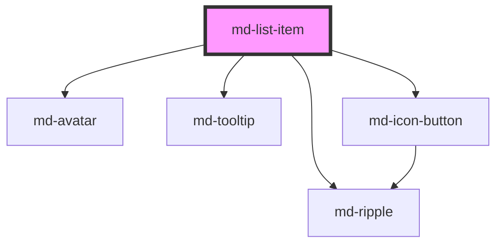

# md-list-item

<!-- llm:meta
tag: md-list-item
category: containment
status: md3-mapped
parent: md-list
standalone: partial
m3-guidelines: https://m3.material.io/components/lists/guidelines
form-associated: false
depends-on: md-avatar, md-tooltip, md-icon-button, md-ripple
used-by: none
-->

**One row of a list.** Up to three text lines, a leading visual, trailing content.
The leading visual is an icon, avatar, or image; an optional panel expands
detail in place. Normally a direct child of `md-list`, which supplies selection,
roving focus and reordering.

> Usable standalone, but `md-list` is what manages roving focus, selection,
> reordering, and the container ARIA role. A lone `md-list-item` renders and
> fires `mdClick`, and nothing coordinates it with siblings.

> Setup, theming, density and i18n are configured once for the whole library —
> see [`main-llm.md`](../../../../../main-llm.md) at the repo root.

---

## When to use

- A row in an `md-list`: contact, file, message, setting.
- A row that navigates (`type="link"` + `href`) or acts (`type="button"`).
- A row that expands in place to reveal detail (`expandable` +
  `slot="expanded-content"`).

## When NOT to use

| Situation | Use instead |
|---|---|
| A menu row | `md-menu-item` |
| A picker option | `md-select-option` |
| A rich, self-contained item | `md-card` |
| A collapsible content section on its own | `md-accordion-item` |
| A navigation destination | `md-navigation-tab` / `md-navigation-rail-tab` |
| A table row | `md-table-row` |

## Decision cues

| Need | Setting |
|---|---|
| Static row | `type="text"` (default) — not focusable |
| Row that performs an action | `type="button"` |
| Row that navigates | `type="link"` + `href` |
| Explicit row height | `lines="1\|2\|3"` (auto-promoted from content otherwise) |
| Leading glyph | `leading-icon` |
| Leading person | `leading-avatar` (image), `leading-avatar-name` (initials), `leading-avatar-label` (explicit initials), `leading-avatar-alt` |
| Leading thumbnail | `leading-image` (+ `leading-image-alt`) |
| Secondary/tertiary text | `overline`, `supporting-text` |
| Trailing metadata | `trailing-supporting-text` |
| Trailing glyph | `trailing-icon` |
| Reveal detail in place | `expandable` + `slot="expanded-content"` |
| Keep focusable but inert | `soft-disabled` |
| Remove from the tab order entirely | `disabled` |

## API contract

```html
<md-list-item
  type="text|button|link"                <!-- default: text -->
  headline="report.pdf"                  <!-- default: "" -->
  overline="Shared"                      <!-- default: "" -->
  supporting-text="2.4 MB · edited 2m ago"       <!-- default: "" -->
  trailing-supporting-text="12:04"       <!-- default: "" -->
  leading-icon="description"             <!-- default: "" -->
  trailing-icon="chevron_right"          <!-- default: "" -->
  leading-avatar="/u/ada.jpg"            <!-- default: "" -->
  leading-avatar-alt="Ada Lovelace"      <!-- default: "" -->
  leading-avatar-name="Ada Lovelace"     <!-- default: "" -->
  leading-avatar-label="AL"              <!-- default: "" -->
  leading-image="/thumb.jpg"             <!-- default: "" -->
  leading-image-alt="Preview"            <!-- default: "" -->
  lines="1|2|3"                          <!-- default: 1, auto-promoted -->
  href="/files/1"                        <!-- default: "" — type="link" only -->
  target="_self"                         <!-- default: _self -->
  selected                               <!-- default: false -->
  expandable                             <!-- default: false -->
  expanded                               <!-- default: false -->
  disabled                               <!-- default: false -->
  soft-disabled                          <!-- default: false -->
  density="-1|-2|-3|-4"                  <!-- default: 0 (uncompacted) -->
></md-list-item>
```

**Parent-managed — never set these by hand:** `tabbable`, `rovingFocusVisible`,
`selectionMode`, `interactionMode`, `containerRole`, `reorderable`. `md-list`
assigns them at load and on every child-list mutation, so any value you write
is overwritten.

**Events**

| Event | Bubbles / composed | Detail | Fires |
|---|---|---|---|
| `mdClick` | default (yes / yes) | `{ item }` | An interactive row is activated by click, `Enter`, or `Space` |
| `mdExpand` | default (yes / yes) | `{ expanded, index?, value?, item }` | The `expanded` state of an `expandable` row changes |
| `mdItemClick` | yes / yes | `{ index, selected }` | Internal — `md-list` consumes it to run selection |
| `mdItemSelect` | yes / yes | `{ index, value, selected, item }` | Internal — an `expanded-content` child was selected |
| `mdRequestActivation` | yes / yes | `void` | Internal — asks `md-list` for roving focus |
| `mdItemRequestReorder` | yes / yes | `{ direction, from }` | Internal — `Alt+Arrow` reorder request |

Listen to `mdClick` and `mdExpand`. Prefer `md-list`'s `mdSelect` /
`mdActivate` over the four internal events.

**Methods** — `setFocus(options?)`, `focusItem()` (delegates to `setFocus`),
`toggle()`, `expand()`, `collapse()`. The three expansion methods are no-ops
unless `expandable` is true and the row is not disabled.

**Slots** — `(default)` (used as the headline only when the `headline` prop and
the `headline` slot are both empty), `leading`, `overline`, `headline`,
`supporting-text`, `trailing`, `trailing-supporting-text`, `expanded-content`.

**Parts** — `row`, `primary`, `state-layer`, `leading`, `leading-icon`,
`avatar`, `image-wrap`, `image`, `image-selection-indicator`,
`image-selection-circle`, `image-selection-check`, `content`, `overline`,
`headline`, `supporting-text`, `trailing`, `trailing-icon`,
`trailing-supporting-text`, `expand-button`, `drag-handle`, `expanded-panel`,
`expanded-panel-inner`.

**Exported parts** (from the internal components):
`avatar-image`, `avatar-initials`, `avatar-icon`,
`expand-button-state-layer`, `expand-button-icon`,
`headline-tooltip-popup`, `supporting-tooltip-popup`.

### Behavioral contract worth knowing

- **`type="text"` is the default and is not interactive** — no focus, no
  ripple, no `mdClick`. Set `type="button"` or `type="link"`, or let a parent
  `md-list` with a `selection-mode` promote the row.
- **Props and slots are alternatives**, not additive. A named slot with content
  replaces the matching prop entirely (`headline` slot beats `headline` prop,
  `leading` slot beats every `leading-*` prop, `trailing` slot beats
  `trailing-icon` and `trailing-supporting-text`).
- The **expand caret and drag handle sit outside** the `trailing` slot, so they
  still render alongside your own slotted trailing content.
- Three ways to fill the leading edge — `leading-icon`, `leading-avatar*`,
  `leading-image` — and they are checked in the order avatar → image → icon.
  **Pick one.**
- **`lines` auto-promotes.** Left at `1`, the row becomes 2-line when either an
  overline or supporting text is present, and 3-line when both are. Set `lines`
  explicitly only to override that. It sets the height contract and does not
  truncate for you.
- **The host role depends on context**, and you should not set it: `option` in
  a selection list, `menuitem` when the parent uses `role-override="menu"` on
  an interactive row, and `listitem` otherwise. For a plain
  `type="button"`/`type="link"` row in a `role="list"`, the widget role and the
  tab stop live on an inner `part="primary"` element so trailing controls stay
  focusable siblings rather than nested inside a button.
- `aria-selected` is emitted **only** when the host role really is `option`.
  The `selected` prop still tints the row visually in other contexts.
- An `expandable` row cannot be selected — `selected` is forced to `false` on
  load and by the parent when a selection mode is applied.
- An **expandable `type="text"` row is not itself a tab stop**; the caret
  `md-icon-button` is. Rows that are also `button`/`link`/selection/reorderable
  keep their own focusability, and then `ArrowRight` expands / `ArrowLeft`
  collapses.
- The expanded panel carries `role="list"` when its slotted content is flat
  `md-list-item` rows, otherwise `region` (no selection mode) or `group`
  (selection mode), and it is `hidden` while collapsed.
- **Headline and supporting text are wrapped in an `md-tooltip` that is enabled
  only while the text is actually clipped**, so a truncated row shows its full
  text on hover/focus with no markup from you.
- `type="link"` runs `href` through a sanitizer. An unsafe scheme (e.g.
  `javascript:`) renders the inner `<a>` without an `href`, leaving it inert but
  keeping the row's layout, ripple and focus behaviour. Cross-origin targets get
  a safe `rel`.
- `disabled` blocks activation and removes the row from the tab order;
  `soft-disabled` also blocks activation but keeps the tab stop. Both set
  `aria-disabled="true"`.
- Rows in `expanded-content` are light-DOM children of the parent row, not of
  the list, so `md-list` reports them through `mdSelect`'s `childIndex` /
  `expanded` fields instead of as top-level indices.

---

## Do / Don't

Sourced from [M3 · Lists · Guidelines](https://m3.material.io/components/lists/guidelines).

| ✅ Do | ❌ Don't |
|---|---|
| Put supporting visuals at the **leading** edge | Avoid visuals in the centre of the row — it breaks scanning |
| Keep rows to at most three lines | Don't cram a paragraph into `supporting-text` |
| Keep structure consistent across rows | Don't mix one-line and three-line rows arbitrarily |
| Use `trailing-supporting-text` for metadata (time, size) | Don't push metadata into the headline |
| Give trailing controls row-specific accessible names | Don't ship five identical "More" buttons |
| Use `type="link"` with `href` for navigation | Don't wrap the row in an `<a>` |
| Choose one leading visual | Don't combine icon, avatar and image |
| Match `lines` to the content you actually render | Don't rely on `lines` to truncate |

---

## Patterns

```html
<!-- Two-line row with avatar and trailing metadata -->
<md-list label="Messages">
  <md-list-item
    type="button"
    leading-avatar="/u/ada.jpg"
    leading-avatar-name="Ada Lovelace"
    leading-avatar-alt="Ada Lovelace"
    headline="Ada Lovelace"
    supporting-text="Analytical engine notes"
    trailing-supporting-text="12:04"
  ></md-list-item>
</md-list>
```

```html
<!-- Navigating row -->
<md-list label="Files">
  <md-list-item type="link" href="/files/1" headline="report.pdf"
                leading-icon="description" trailing-icon="chevron_right"></md-list-item>
</md-list>
```

```html
<!-- Row with its own control: the parent must be multi-action -->
<md-list label="Files" interaction-mode="multi-action">
  <md-list-item type="button" headline="report.pdf">
    <md-icon-button slot="trailing" icon="more_vert"
                    aria-label="More actions for report.pdf"></md-icon-button>
  </md-list-item>
</md-list>
```

```html
<!-- Expandable detail: the caret is the control -->
<md-list label="Checkout">
  <md-list-item id="addr" expandable headline="Shipping address">
    <div slot="expanded-content">221B Baker Street, London</div>
  </md-list-item>
</md-list>

<script type="module">
  const row = document.getElementById('addr');
  row.addEventListener('mdExpand', (e) => console.log('expanded:', e.detail.expanded));
  await row.expand();      // or row.toggle() / row.collapse()
</script>
```

```html
<!-- Slotted content wins over the matching prop -->
<md-list label="Repos">
  <md-list-item type="button">
    <span slot="overline">Public</span>
    <span slot="headline">awc-ui / <strong>core</strong></span>
    <span slot="supporting-text">Updated 3 days ago</span>
    <md-chip slot="trailing" label="TypeScript"></md-chip>
  </md-list-item>
</md-list>
```

```html
<!-- Prefer parent-level events for app logic -->
<md-list id="contacts" label="Contacts" selection-mode="single-select">
  <md-list-item headline="Ada Lovelace"></md-list-item>
  <md-list-item headline="Grace Hopper"></md-list-item>
</md-list>

<script type="module">
  document.getElementById('contacts')
    .addEventListener('mdSelect', (e) => open(e.detail.index, e.detail.value));
</script>
```

## Anti-patterns

| ❌ Wrong | ✅ Right | Why |
|---|---|---|
| `<md-list-item headline="Open">` and expecting a click | Add `type="button"` | `type="text"` is the default and is inert. |
| `headline` prop **and** `headline` slot | Pick one | The slot wins; the prop becomes dead config. |
| `leading-icon` + `leading-avatar` + `leading-image` | One leading visual | They compete for the same region; avatar wins, then image, then icon. |
| Setting `selection-mode` / `interaction-mode` / `reorderable` / `tabbable` on the item | Set the first three on `md-list`; leave the rest alone | The parent overwrites them on load and on every child mutation. |
| `role="listitem"` / `role="option"` written by hand | Let the component derive it | It rewrites `role` on every render from the parent's context. |
| `selected` on an `expandable` row | Track expansion with `expanded` | The component forces `selected` back to `false`. |
| Trailing button with the list in `single-action` | Set `interaction-mode="multi-action"` | Otherwise the row treats the whole body as one target. |
| Five trailing buttons all labelled "More" | Include the row's subject in each name | Ambiguous for screen readers. |
| Wrapping the row in `<a href>` | `type="link"` + `href` | Nested interactive controls fail a11y checks. |
| `lines="1"` with three lines of text | Set `lines` to match, or shorten | It sets the height contract, it does not truncate. |
| Adding your own tooltip for truncated text | Let the built-in one handle it | Headline and supporting text already tooltip when clipped. |
| Listening to `mdItemClick` for app logic | Use the list's `mdSelect` / `mdActivate`, or `mdClick` | The `mdItem*` events are the internal parent channel. |
| `md-list-item` inside `md-menu` | `md-menu-item` | Different role and keyboard model. |

## Accessibility, RTL, density, i18n

**Accessibility**
- The parent `md-list` provides the container role and roving focus; a
  standalone row has neither.
- `headline` is the row's primary accessible text. Decorative leading visuals
  are already `aria-hidden`; an avatar repeating the headline should be left
  unnamed (see the `md-avatar` readme).
- Row-scoped names for embedded trailing controls are the most common defect
  here — "More actions for report.pdf", never "More actions".
- The expand caret is a real `md-icon-button` with `aria-expanded`,
  `aria-controls` and a generated `Expand {headline}` / `Collapse {headline}`
  label, so keyboard users reach it without extra work.
- `leading-image-alt` should be empty for purely decorative thumbnails; the
  `` is then marked `aria-hidden`.
- `disabled` leaves the tab order; `soft-disabled` stays focusable so the row
  remains discoverable. Both are announced via `aria-disabled`.

**RTL** — leading/trailing regions, padding and the expanded panel use logical
properties and mirror under `dir="rtl"`. A directional `trailing-icon` (e.g.
`chevron_right`) must be swapped by you.

**Density** — `density="-1…-4"` compacts row padding, icon sizes and text
sizes. Normally you set it once on the parent `md-list` and it inherits through
`--md-sys-density-scale`. Rung `0` is the uncompacted default and has no rule
of its own; to pin one row back to full size under a global rung, set
`style="--md-sys-density-scale: 0"` on it.

**i18n** — translate `headline`, `overline`, `supporting-text`,
`trailing-supporting-text`, and every trailing control's accessible name. Note
that the caret's label is composed from the English verbs `Expand` / `Collapse`
plus the headline, with no prop to override them. Longer translations push a
row past its `lines` budget — the built-in truncation tooltip covers the
overflow but the layout still needs checking.

## Related components

`md-list` · `md-divider` · `md-menu-item` · `md-select-option` · `md-card` ·
`md-accordion-item` · `md-avatar` · `md-icon-button` · `md-table-row`

## Theming

The full set is large; these are the ones worth reaching for.

| Custom property | Purpose | Default |
|---|---|---|
| `--md-list-item-container-color` | Row surface | `--md-sys-color-surface` (`#fef7ff`) |
| `--md-list-item-container-shape` | Row radius (all corners) | `0px` |
| `--md-list-item-container-shape-start-start` … `-end-end` | Per-corner radii, used for the ends of a `standard` group | `--md-list-item-container-shape` |
| `--md-list-item-label-text-color` | Headline colour | `--md-sys-color-on-surface` |
| `--md-list-item-label-text-font` | Headline font family | `--md-sys-typescale-body-large-font-family` |
| `--md-list-item-supporting-text-color` | Supporting text colour | `--md-sys-color-on-surface-variant` |
| `--md-list-item-supporting-text-font` | Supporting text font family | `--md-sys-typescale-body-medium-font-family` |
| `--md-list-item-overline-color` | Overline colour | `--md-sys-color-on-surface-variant` |
| `--md-list-item-trailing-supporting-text-color` | Trailing metadata colour | `--md-sys-color-on-surface-variant` |
| `--md-list-item-leading-icon-color` / `-size` | Leading glyph | `--md-sys-color-on-surface-variant` / `max(18px, 24px + density × 1px)` |
| `--md-list-item-trailing-icon-color` / `-size` | Trailing glyph | `--md-sys-color-on-surface-variant` / `max(18px, 24px + density × 1px)` |
| `--md-list-item-leading-avatar-size` / `-shape` | Internal avatar box | `40px` / `--md-sys-shape-corner-full` |
| `--md-list-item-leading-image-width` / `-height` / `-shape` | Thumbnail box | `56px` / `56px` / `--md-sys-shape-corner-none` |
| `--md-list-item-selected-container-color` | Selected row fill | `--md-sys-color-secondary-container` |
| `--md-list-item-selected-label-text-color` | Selected headline colour | `--md-sys-color-on-secondary-container` |
| `--md-list-item-hover-state-layer-opacity` | Hover overlay | `--md-sys-state-hover-state-layer-opacity` (`0.08`) |
| `--md-list-item-focus-state-layer-opacity` | Focus overlay | `0.1` |
| `--md-list-item-pressed-state-layer-opacity` | Press overlay | `0.1` |
| `--md-list-item-dragged-state-layer-opacity` / `-container-elevation` | While dragging | `0.16` / `--md-sys-elevation-4` |
| `--md-list-item-leading-space` / `-trailing-space` | Inline padding | `--md-sys-spacing-inset-lg` (`16px`) |
| `--md-list-item-top-space` / `-bottom-space` | Block padding (1–2 line) | `max(2px, 8px + density × 1.5px)` |
| `--md-list-item-three-line-top-space` / `-bottom-space` | Block padding (3 line) | `max(2px, 12px + density × 2.5px)` |
| `--md-list-item-between-space` | Gap between leading / content / trailing | `max(8px, --md-sys-spacing-gap-md)` (`12px`) |
| `--md-list-item-expand-duration` / `-collapse-duration` | Disclosure timing | `--md-sys-motion-duration-medium3` (`350ms`) / `--md-sys-motion-duration-short4` (`200ms`) |
| `--md-list-item-expanded-panel-background` | Disclosure panel fill | `transparent` |
| `--md-list-item-expanded-panel-padding-block` / `-padding-inline` | Disclosure panel padding | `0px` |
| `--md-list-item-expand-chevron-color` / `-size` | Caret glyph | `--md-sys-color-on-surface-variant` |

```css
md-list-item.compact-card {
  --md-list-item-container-color: var(--md-sys-color-surface-container-low);
  --md-list-item-container-shape: 12px;
  --md-list-item-leading-space: 12px;
}
```

<!-- Auto Generated Below -->


## Properties

| Property                 | Attribute                  | Description                                                                                                                                                                                                                                                                                                                                                                                                                                                                                                                                                                                                                                                                                                                                                                                                                                                                                                                                                       | Type                                          | Default           |
| ------------------------ | -------------------------- | ----------------------------------------------------------------------------------------------------------------------------------------------------------------------------------------------------------------------------------------------------------------------------------------------------------------------------------------------------------------------------------------------------------------------------------------------------------------------------------------------------------------------------------------------------------------------------------------------------------------------------------------------------------------------------------------------------------------------------------------------------------------------------------------------------------------------------------------------------------------------------------------------------------------------------------------------------------------- | --------------------------------------------- | ----------------- |
| `containerRole`          | `container-role`           | The resolved ARIA role of the parent `md-list` container, propagated imperatively by that parent — authors should not touch this. It lets a row adapt its own role to its container: when the container is a `menu` / `menubar` (via `role-override`) an interactive row exposes `role="menuitem"` on the HOST itself (the host IS the widget, like `option`) and skips the inner primary widget, because a `menu` owns its direct light-DOM children (the hosts) and must own `menuitem`s — a `listitem` / `role="none"` host is a disallowed menu child (axe `aria-required-children`). Empty for a plain `list` / `listbox`, where the default `listitem` / `option` roles apply.                                                                                                                                                                                                                                                                              | `string`                                      | `''`              |
| `density`                | `density`                  | Local density rung. Drives the same `--md-sys-density-scale` signal that a global `data-density` ancestor sets, so a local value simply overrides the inherited one. 0 = default, -4 = ultra-compact.                                                                                                                                                                                                                                                                                                                                                                                                                                                                                                                                                                                                                                                                                                                                                             | `-1 \| -2 \| -3 \| -4 \| 0`                   | `0`               |
| `disabled`               | `disabled`                 | Disables interaction, removes from tab order, and dims content to 38 % opacity.                                                                                                                                                                                                                                                                                                                                                                                                                                                                                                                                                                                                                                                                                                                                                                                                                                                                                   | `boolean`                                     | `false`           |
| `expandable`             | `expandable`               | Turns the row into a single-level collapsible disclosure. When `true`:   - a trailing **`md-icon-button`** caret renders after any author-supplied     trailing content. It is the disclosure control: it carries     `aria-expanded` + `aria-controls`, gets the icon-button pill/squircle     shape morph when selected (expanded), and its `expand_more` glyph     rotates 180° (points up) when expanded.   - the `expanded-content` slot reveals one level of flat `md-list-item`     child rows (not a nested `md-list` chassis) inline below the parent     with an MD3 expressive open (emphasized-decelerate) / retract     (emphasized-accelerate) height + opacity animation.   - clicking the row body also toggles the panel as a convenience; the     caret button additionally toggles on Enter / Space when focused.   - ArrowRight expands, ArrowLeft collapses (when the row itself is     focusable, e.g. `type="button"` / reorderable rows). | `boolean`                                     | `false`           |
| `expanded`               | `expanded`                 | Reflects/controls the expanded state of an `expandable` row.                                                                                                                                                                                                                                                                                                                                                                                                                                                                                                                                                                                                                                                                                                                                                                                                                                                                                                      | `boolean`                                     | `false`           |
| `headline`               | `headline`                 | Headline text. Overridden by `slot="headline"`.                                                                                                                                                                                                                                                                                                                                                                                                                                                                                                                                                                                                                                                                                                                                                                                                                                                                                                                   | `string`                                      | `''`              |
| `href`                   | `href`                     | Link href. Honored when `type='link'`.                                                                                                                                                                                                                                                                                                                                                                                                                                                                                                                                                                                                                                                                                                                                                                                                                                                                                                                            | `string`                                      | `''`              |
| `interactionMode`        | `interaction-mode`         | Interaction mode propagated from parent `md-list`. Set imperatively by the parent — authors should not need to touch this directly.  - `single-action`: the whole row is one primary action. - `multi-action`: trailing slot may host secondary controls (icon   buttons, switches) that keep their own focus/click semantics.                                                                                                                                                                                                                                                                                                                                                                                                                                                                                                                                                                                                                                    | `"multi-action" \| "single-action"`           | `'single-action'` |
| `leadingAvatar`          | `leading-avatar`           | Avatar image URL — forwarded to an internal `md-avatar` rendered in the leading slot. Falls back to `leadingAvatarName` / `leadingAvatarLabel` if the image fails to load.                                                                                                                                                                                                                                                                                                                                                                                                                                                                                                                                                                                                                                                                                                                                                                                        | `string`                                      | `''`              |
| `leadingAvatarAlt`       | `leading-avatar-alt`       | Alt text for `leadingAvatar`. Also surfaced as the avatar's accessible label.                                                                                                                                                                                                                                                                                                                                                                                                                                                                                                                                                                                                                                                                                                                                                                                                                                                                                     | `string`                                      | `''`              |
| `leadingAvatarLabel`     | `leading-avatar-label`     | Explicit initials shown by the internal `md-avatar`. Overrides the `leadingAvatarName` parsing. Used for "C", "JD" style labels.                                                                                                                                                                                                                                                                                                                                                                                                                                                                                                                                                                                                                                                                                                                                                                                                                                  | `string`                                      | `''`              |
| `leadingAvatarName`      | `leading-avatar-name`      | Full name forwarded to the internal `md-avatar` so it can auto-derive initials when no image is available (`"Ada Lovelace"` → `"AL"`). When both this and `leadingAvatarLabel` are empty the avatar falls back to a `person` icon.                                                                                                                                                                                                                                                                                                                                                                                                                                                                                                                                                                                                                                                                                                                                | `string`                                      | `''`              |
| `leadingIcon`            | `leading-icon`             | Material Symbols name for the leading slot (24 dp container, 18 dp icon).                                                                                                                                                                                                                                                                                                                                                                                                                                                                                                                                                                                                                                                                                                                                                                                                                                                                                         | `string`                                      | `''`              |
| `leadingImage`           | `leading-image`            | Image thumbnail URL (56 dp square by default).                                                                                                                                                                                                                                                                                                                                                                                                                                                                                                                                                                                                                                                                                                                                                                                                                                                                                                                    | `string`                                      | `''`              |
| `leadingImageAlt`        | `leading-image-alt`        | Alt text for `leadingImage`.                                                                                                                                                                                                                                                                                                                                                                                                                                                                                                                                                                                                                                                                                                                                                                                                                                                                                                                                      | `string`                                      | `''`              |
| `lines`                  | `lines`                    | Number of text rows. Auto-detected when 1 + content suggests more (overline → 2-line, overline + supporting → 3-line). Set explicitly to override the auto-promotion.                                                                                                                                                                                                                                                                                                                                                                                                                                                                                                                                                                                                                                                                                                                                                                                             | `1 \| 2 \| 3`                                 | `1`               |
| `overline`               | `overline`                 | Overline text shown above the headline. Overridden by `slot="overline"`.                                                                                                                                                                                                                                                                                                                                                                                                                                                                                                                                                                                                                                                                                                                                                                                                                                                                                          | `string`                                      | `''`              |
| `reorderable`            | `reorderable`              | Whether this row can be reordered via drag-and-drop. Set imperatively by the parent `md-list[reorderable]` — authors should not need to touch this directly. When `true` the row renders a trailing drag handle (grab it to drag) and supports `Alt + ArrowUp / ArrowDown` to move when focused. Disabled rows ignore it.                                                                                                                                                                                                                                                                                                                                                                                                                                                                                                                                                                                                                                         | `boolean`                                     | `false`           |
| `rovingFocusVisible`     | `roving-focus-visible`     | When `true`, paints the keyboard-focus ring even if the row does not hold DOM focus (e.g. toolbar buttons drove `activateNext()`). Set imperatively by `md-list` during programmatic / arrow-key navigation — not on initial load.                                                                                                                                                                                                                                                                                                                                                                                                                                                                                                                                                                                                                                                                                                                                | `boolean`                                     | `false`           |
| `selected`               | `selected`                 | Selected state. Toggled by `md-list` when `selection-mode` is on.                                                                                                                                                                                                                                                                                                                                                                                                                                                                                                                                                                                                                                                                                                                                                                                                                                                                                                 | `boolean`                                     | `false`           |
| `selectionMode`          | `selection-mode`           | Selection mode propagated from parent `md-list`. Set imperatively by the parent — authors should not need to touch this directly. When non-`none`, the item becomes focusable + clickable regardless of `type` and renders with `role="option"` + `aria-selected`.                                                                                                                                                                                                                                                                                                                                                                                                                                                                                                                                                                                                                                                                                                | `"multi-select" \| "none" \| "single-select"` | `'none'`          |
| `softDisabled`           | `soft-disabled`            | Visually disabled but remains focusable for discoverability. Does not emit activation events.                                                                                                                                                                                                                                                                                                                                                                                                                                                                                                                                                                                                                                                                                                                                                                                                                                                                     | `boolean`                                     | `false`           |
| `supportingText`         | `supporting-text`          | Supporting text below the headline. Overridden by `slot="supporting-text"`.                                                                                                                                                                                                                                                                                                                                                                                                                                                                                                                                                                                                                                                                                                                                                                                                                                                                                       | `string`                                      | `''`              |
| `tabbable`               | `tabbable`                 | Whether this item is the currently tabbable one in its parent list. Managed by `md-list`'s roving tabindex. Standalone items leave this as `true` and become focusable when `type !== 'text'`.                                                                                                                                                                                                                                                                                                                                                                                                                                                                                                                                                                                                                                                                                                                                                                    | `boolean`                                     | `true`            |
| `target`                 | `target`                   | Link target. Honored when `type='link'`.                                                                                                                                                                                                                                                                                                                                                                                                                                                                                                                                                                                                                                                                                                                                                                                                                                                                                                                          | `string`                                      | `'_self'`         |
| `trailingIcon`           | `trailing-icon`            | Material Symbols name for the trailing slot (24 dp icon).                                                                                                                                                                                                                                                                                                                                                                                                                                                                                                                                                                                                                                                                                                                                                                                                                                                                                                         | `string`                                      | `''`              |
| `trailingSupportingText` | `trailing-supporting-text` | Trailing supporting text on the right. Overridden by `slot="trailing-supporting-text"`.                                                                                                                                                                                                                                                                                                                                                                                                                                                                                                                                                                                                                                                                                                                                                                                                                                                                           | `string`                                      | `''`              |
| `type`                   | `type`                     | Behavior of the row.  - `text` (default): non-interactive content row. No focus, no ripple,   no click event. Use for static labels and section headers. - `button`: focusable, ripples, fires `mdClick` on activation. - `link`: same as `button` but also navigates to `href` in `target`.  When the row sits inside an `md-list` with `selection-mode` set, the row becomes focusable + clickable regardless of `type` so users can pick from a list of plain rows without authoring extra props.                                                                                                                                                                                                                                                                                                                                                                                                                                                              | `"button" \| "link" \| "text"`                | `'text'`          |


## Events

| Event                  | Description                                                                                                                                                                                 | Type                                                                                                                                       |
| ---------------------- | ------------------------------------------------------------------------------------------------------------------------------------------------------------------------------------------- | ------------------------------------------------------------------------------------------------------------------------------------------ |
| `mdClick`              | Fired when an interactive row is activated (click, Enter, or Space).                                                                                                                        | `CustomEvent<{ item: HTMLElement; }>`                                                                                                      |
| `mdExpand`             | Fires whenever the expanded state of an expandable row changes.                                                                                                                             | `CustomEvent<{ expanded: boolean; index?: number \| undefined; value?: string \| undefined; item?: HTMLMdListItemElement \| undefined; }>` |
| `mdItemClick`          | Bubbles to parent `md-list` so it can manage selection state.                                                                                                                               | `CustomEvent<{ index: number; selected: boolean; }>`                                                                                       |
| `mdItemRequestReorder` | Internal event the parent `md-list` listens to for keyboard reordering (`Alt + ArrowUp / ArrowDown`). Bubbles + composed so it crosses the shadow boundary up to the list.                  | `CustomEvent<{ direction: "up" \| "down"; from: number; }>`                                                                                |
| `mdItemSelect`         | Bubbles to parent `md-list` when an `expanded-content` child row is selected. The list re-emits `mdSelect` with the parent's list index, `childIndex`, `expanded`, and the child in `item`. | `CustomEvent<{ index: number; value: string; selected: boolean; item: HTMLMdListItemElement; }>`                                           |
| `mdRequestActivation`  | Asks the parent `md-list` to give this row roving focus.                                                                                                                                    | `CustomEvent<void>`                                                                                                                        |


## Methods

### `collapse() => Promise<void>`

Collapse the row. No-op when `expandable` is false.

#### Returns

Type: `Promise<void>`


### `expand() => Promise<void>`

Expand the row. No-op when `expandable` is false.

#### Returns

Type: `Promise<void>`


### `focusItem() => Promise<void>`

Programmatically focus this row (delegates to {@link setFocus}).

#### Returns

Type: `Promise<void>`


### `setFocus(options?: FocusOptions) => Promise<void>`

Reliable imperative focus used by the parent `md-list`'s roving tabindex /
`activateNext` / `activatePrevious`. It does NOT depend on the async Stencil
render having flushed the roving `tabindex` onto the target: it ensures the
target is focusable *now* (adding a tabindex if the render hasn't written
one yet), then focuses it. This fixes the case where `md-list` calls
`.focus()` right after toggling `tabbable` — before the re-render — which
otherwise left focus on `<body>`.

#### Parameters

| Name      | Type                        | Description |
| --------- | --------------------------- | ----------- |
| `options` | `FocusOptions \| undefined` |             |

#### Returns

Type: `Promise<void>`


### `toggle() => Promise<void>`

Toggles the `expanded` state. No-op when `expandable` is false.

#### Returns

Type: `Promise<void>`


## Shadow Parts

| Part                          | Description |
| ----------------------------- | ----------- |
| `"avatar"`                    |             |
| `"content"`                   |             |
| `"drag-handle"`               |             |
| `"expand-button"`             |             |
| `"expanded-panel"`            |             |
| `"expanded-panel-inner"`      |             |
| `"headline"`                  |             |
| `"image"`                     |             |
| `"image-selection-check"`     |             |
| `"image-selection-circle"`    |             |
| `"image-selection-indicator"` |             |
| `"image-wrap"`                |             |
| `"leading"`                   |             |
| `"leading-icon"`              |             |
| `"overline"`                  |             |
| `"primary"`                   |             |
| `"row"`                       |             |
| `"state-layer"`               |             |
| `"supporting-text"`           |             |
| `"trailing"`                  |             |
| `"trailing-icon"`             |             |
| `"trailing-supporting-text"`  |             |


## Dependencies

### Depends on

- [md-avatar](../md-avatar)
- [md-tooltip](../md-tooltip)
- [md-icon-button](../md-icon-button)
- [md-ripple](../md-ripple)

### Graph


----------------------------------------------

*Built with [StencilJS](https://stenciljs.com/)*
