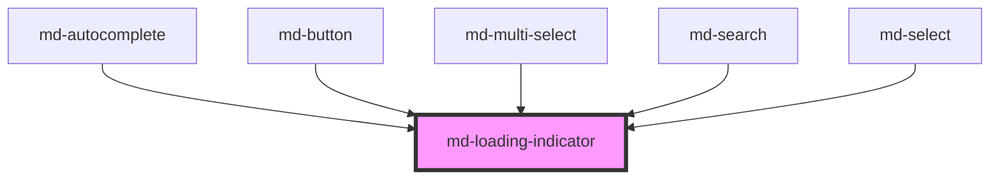

# md-loading-indicator

<!-- llm:meta
tag: md-loading-indicator
category: status
status: md3-mapped
m3-guidelines: https://m3.material.io/components/loading-indicator/guidelines
form-associated: false
depends-on: none
used-by: md-autocomplete, md-button, md-multi-select, md-search, md-select
-->

**The M3 Expressive loading moment.** A morphing-shape indicator for
indeterminate waits — distinct from a progress indicator, which reports *how
far along* something is.

> Setup, theming, density and i18n are configured once for the whole library —
> see [`main-llm.md`](../../../../../main-llm.md) at the repo root.

---

## When to use

- An **indeterminate** wait where you cannot report progress: a refresh, a
  search, an initial fetch.
- Pull-to-refresh and similar whole-screen refresh moments.
- Inside pickers while options load (which is how `md-select`,
  `md-multi-select`, `md-autocomplete` and `md-search` use it).

## When NOT to use

| Situation | Use instead |
|---|---|
| You know how far along the operation is | `md-progress-indicator` (determinate) |
| Content whose shape is known | `md-skeleton` |
| A button working after a click | `md-button loading` |
| An operation that will become determinate | `md-progress-indicator` — M3 says don't transition *from* a loading indicator |
| A long background job not blocking the view | Linear `md-progress-indicator` |
| A picker that is fetching its own options | The picker's own `loading` prop (`md-select`, `md-multi-select`, `md-autocomplete`, `md-search`) |

## Decision cues

| Need | Setting |
|---|---|
| Bare indicator on an existing surface | `variant="uncontained"` (default) |
| Indicator with its own container/backdrop | `variant="contained"` |
| Screen-reader text | `label` (default `"Loading"`) |
| A different size | `--md-loading-indicator-size` (there is no `size` prop) |

## API contract

The authoritative, generated property table is at the bottom of this file. This
is the short form an implementer needs.

```html
<md-loading-indicator
  variant="uncontained|contained"   <!-- default: uncontained -->
  label="Loading"                   <!-- default: "Loading" -->
  density="-1|-2|-3|-4"             <!-- default: 0 (uncompacted) -->
></md-loading-indicator>
```

**Events** — none.

**Methods** — none.

**Slots** — none; the component renders no `<slot>`. It is a self-contained
graphic — put any caption in a sibling element.

**Parts** — `shape` (the morphing indicator shape).

### Behavioral contract worth knowing

- **Always indeterminate.** There is no `value`, `max` or `indeterminate` prop
  — that's the whole distinction from `md-progress-indicator`.
- Three props total, on purpose. There is **no `size` prop**: resize it with
  `--md-loading-indicator-size`, which also scales the inner shape (the shape
  is derived from the overall size, so you rarely need
  `--md-loading-indicator-shape-size` as well).
- `label` defaults to the English `"Loading"`. It is both the host's
  `aria-label` and the text of an internal visually-hidden `role="status"`
  element, so changing `label` while it is mounted re-announces politely.
- `variant="contained"` also swaps the shape colour to `on-primary-container`
  so it stays legible on the container fill.
- **Reduced motion is already handled.** Under
  `prefers-reduced-motion: reduce` the shape morph is replaced by a gentle
  opacity pulse on a circle — do not add your own gating.
- It has no timeout: it animates until you remove it. Always resolve it on
  error as well as on success.

---

## Do / Don't

Sourced from [M3 · Loading indicator · Guidelines](https://m3.material.io/components/loading-indicator/guidelines).

| ✅ Do | ❌ Don't |
|---|---|
| Keep the loading indicator **in view** until the activity completes | Don't let it scroll off-screen — that hides the status and implies the refresh belongs to one component rather than the screen |
| Transition from an **indeterminate progress indicator** to a determinate one | Avoid transitioning from a *loading indicator* to a determinate progress indicator |
| Use it for whole-screen refresh moments | Don't attach it to a single card when the whole screen is refreshing |
| Pick `md-progress-indicator` when you can measure progress | Don't use a loading indicator to avoid computing real progress |
| Remove it on failure and show an error | Don't leave it spinning forever |
| Localize `label` | Don't ship the English default |

---

## Patterns

```html
<!-- Whole-screen refresh, pinned in view -->
<div style="position: sticky; inset-block-start: 0; display: flex; justify-content: center;">
  <md-loading-indicator label="Refreshing"></md-loading-indicator>
</div>

<!-- Contained, over a surface -->
<md-loading-indicator variant="contained" label="Loading results">
</md-loading-indicator>

<!-- Larger: one custom property scales the whole thing -->
<md-loading-indicator label="Loading" style="--md-loading-indicator-size: 72px;">
</md-loading-indicator>

<!-- A picker fetching its own options uses its own loading prop -->
<md-select label="User" loading></md-select>
```

```html
<div id="host"></div>

<script type="module">
  const host = document.getElementById('host');
  const indicator = document.createElement('md-loading-indicator');
  indicator.label = 'Loading results';
  host.append(indicator);

  try {
    render(await fetchData());
  } catch {
    renderError();
  } finally {
    indicator.remove();          // success or failure — it has no timeout
  }
</script>
```

## Anti-patterns

| ❌ Wrong | ✅ Right | Why |
|---|---|---|
| Looking for a `value` prop | Use `md-progress-indicator` | This one is always indeterminate. |
| `size="48"` | `style="--md-loading-indicator-size: 48px"` | There is no `size` prop; the attribute is ignored. |
| Gating it yourself on `prefers-reduced-motion` | Leave it alone | The component already swaps to a pulse. |
| Swapping this for a determinate bar mid-operation | Start with an indeterminate `md-progress-indicator` | M3 explicitly discourages this transition. |
| Letting it scroll out of view during a refresh | Pin it (sticky/fixed) | M3 explicit rule. |
| Leaving it mounted after an error | Remove it in `finally` | It has no timeout. |
| One per card during a full-screen refresh | One for the screen | It misattributes the activity. |
| Using it where the content shape is known | `md-skeleton` | Better perceived performance. |
| Default English `label` in a localized app | Translate it | It's the accessible name. |
| Adding a spinner inside `md-button` | Use the button's `loading` prop | Already built in. |

## Accessibility, RTL, density, i18n

**Accessibility**
- The host carries `role="progressbar"`, `aria-label` (from `label`) and
  `aria-live="polite"`; an internal visually-hidden `role="status"` element
  repeats the label so it is announced without stealing focus.
- No `aria-valuenow` is published — correctly, since the wait is indeterminate.
- Make `label` specific ("Refreshing messages" beats "Loading").
- Because it's indeterminate, screen-reader users get no completion cue from
  the component: announce the **result** yourself when loading ends.
- Reduced motion is honoured internally (morph → opacity pulse), so you do not
  need to gate the component.
- Keep it in view, per M3 — an off-screen indicator is invisible to everyone.

**RTL** — the shape morph is radially symmetric and the host uses logical
sizing; nothing to flip.

**Density** — `density="-1…-4"` locally overrides the inherited `data-density`
rung, shrinking the default 48 px box (floor 32 px) and the shape with it. Rung
`0` is the uncompacted default and is inert — it does **not** opt an indicator
out of an inherited rung; for that, set `style="--md-sys-density-scale: 0"`.
An explicit `--md-loading-indicator-size` overrides density scaling entirely.

**i18n** — translate `label`.

## Related components

`md-progress-indicator` · `md-skeleton` · `md-select` · `md-multi-select` ·
`md-autocomplete` · `md-search`

## Theming

| Custom property | Purpose | Default |
|---|---|---|
| `--md-loading-indicator-color` | Shape colour | `--md-sys-color-primary` (`on-primary-container` when `contained`) |
| `--md-loading-indicator-size` | Overall box | `48px`, density-scaled, floor `32px` |
| `--md-loading-indicator-shape-size` | Inner morphing shape | `0.792 × size` (the M3 38/48 ratio) |
| `--md-loading-indicator-container-color` | `contained` backdrop | `--md-sys-color-primary-container` |
| `--md-loading-indicator-container-shape` | `contained` corner radius | `--md-sys-shape-corner-full` |

**CSS parts** — `shape`.

```css
md-loading-indicator.hero {
  --md-loading-indicator-size: 96px;
  --md-loading-indicator-color: var(--md-sys-color-tertiary);
}
```

<!-- Auto Generated Below -->


## Properties

| Property  | Attribute | Description                                                                                                                                                                                           | Type                           | Default         |
| --------- | --------- | ----------------------------------------------------------------------------------------------------------------------------------------------------------------------------------------------------- | ------------------------------ | --------------- |
| `density` | `density` | Local density rung. Drives the same `--md-sys-density-scale` signal that a global `data-density` ancestor sets, so a local value simply overrides the inherited one. 0 = default, -4 = ultra-compact. | `-1 \| -2 \| -3 \| -4 \| 0`    | `0`             |
| `label`   | `label`   | Accessible label for screen readers                                                                                                                                                                   | `string`                       | `'Loading'`     |
| `variant` | `variant` | Visual style: uncontained (default) or contained (with background container)                                                                                                                          | `"contained" \| "uncontained"` | `'uncontained'` |


## Shadow Parts

| Part      | Description |
| --------- | ----------- |
| `"shape"` |             |


## Dependencies

### Used by

 - [md-autocomplete](../md-autocomplete)
 - [md-button](../md-button)
 - [md-multi-select](../md-multi-select)
 - [md-search](../md-search)
 - [md-select](../md-select)

### Graph


----------------------------------------------

*Built with [StencilJS](https://stenciljs.com/)*
