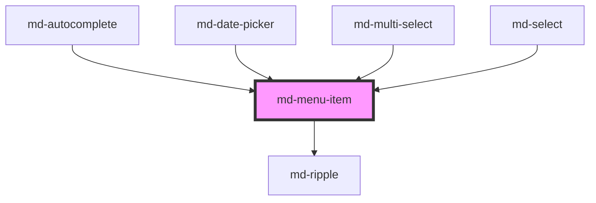

# md-menu-item

<!-- llm:meta
tag: md-menu-item
category: navigation
status: sub-component
parent: md-menu
standalone: false
m3-guidelines: https://m3.material.io/components/menus/guidelines
form-associated: false
depends-on: md-ripple
used-by: md-autocomplete, md-date-picker, md-multi-select, md-select
-->

**One row in a `md-menu`.** A command, or a checkbox/radio option, with
optional icons, supporting text, a badge and trailing text.

> 🧩 **Sub-component.** Only valid inside `md-menu` (directly or in a
> `md-menu-item-group`). Standalone it has no keyboard model and no dismissal.

---

## When to use

- A row inside `md-menu` — the parent that owns it: a command, or a selectable
  option in a menu-style picker.
- Inside a `md-menu-item-group`, which is itself inside a `md-menu`.

## When NOT to use

| Situation | Use instead |
|---|---|
| A list row | `md-list-item` |
| A picker option declared in markup | `md-select-option` |
| A row that opens a nested menu | `md-sub-menu-item` |
| A FAB-menu action | `md-fab-menu-item` |
| A standalone action | `md-button` / `md-icon-button` |
| A tab | `md-tab` |

## Decision cues

| Need | Setting |
|---|---|
| A command | `type="button"` (default) |
| A toggleable option | `type="checkbox"` |
| One-of-many within a group | `type="radio"` |
| Keep the menu open after activation | `keep-open` |
| Checkmark on the leading side | `check-position="start"` (default `"end"`) |
| A rule **below** the row | `divider` |
| Extra space **below** the row (baseline variant, direct menu child) | `gap` |
| Count or shortcut on the trailing side | `badge` / `trailing-text` |
| Listbox option semantics instead of menu semantics | `presentation="option"` |
| Partly-checked "select all" | `indeterminate` on a `type="checkbox"` row |

## API contract

```html
<md-menu anchor="trigger">
  <md-menu-item
    headline="Duplicate"                <!-- default: "" -->
    supporting-text="Creates a copy"    <!-- default: "" -->
    trailing-text="Ctrl+D"              <!-- default: "" -->
    badge="3"                           <!-- default: "" -->
    type="button|checkbox|radio"        <!-- default: button -->
    selected                            <!-- default: false -->
    indeterminate                       <!-- default: false; checkbox rows only -->
    check-position="start|end"          <!-- default: end -->
    keep-open                           <!-- default: false -->
    divider                             <!-- default: false -->
    gap                                 <!-- default: false -->
    disabled                            <!-- default: false -->
    presentation="menuitem|option"      <!-- default: menuitem -->
    density="-1|-2|-3|-4"               <!-- default: 0 (uncompacted; there is no density="0" rule) -->
  >
    <span slot="leading-icon" class="material-symbols-outlined">content_copy</span>
  </md-menu-item>
</md-menu>
```

**Event** — `mdClick`, a `CustomEvent<void>` with **no payload**. It uses
Stencil's defaults (`bubbles: true, composed: true`), so it can be handled with
one delegated listener on the `md-menu`.

**Methods** — none.

**Slots** — `leading-icon`, `trailing-icon`. There is **no default slot**: the
row's text comes from the `headline` / `supporting-text` / `trailing-text`
props, and light-DOM children without a `slot` attribute are not rendered.

**Parts** — `state-layer`, `leading-icon`, `content`, `headline`,
`supporting-text`, `badge`, `trailing`.

**Integration-only prop — never set this by hand:** `role-override` replaces the
computed ARIA role and is used by the composite pickers for rows that sit
outside a real menu.

### Behavioral contract worth knowing

- ⚠️ **The item self-toggles `selected` on click, before your handler runs.** A
  controlled parent that rejects the change (e.g. a max-selected cap) must
  revert with `e.target.selected = false` — otherwise you get a phantom check.
  This is the same trap as `md-checkbox` inside composites.
- **`type="radio"` deselects its siblings automatically.** The scope is the
  nearest enclosing `md-menu-item-group`, or the `md-menu` when there is no
  group. You do not need to enforce exclusivity yourself.
- Activating an item **closes the whole menu tree** (after a 150 ms delay) and
  returns focus to the root menu's anchor — unless `keep-open` is set here, in
  which case nothing is closed.
- **Enter and Space are not equivalent.** `Enter` re-dispatches a click, so it
  runs the full activation path including the close. `Space` on a
  `checkbox`/`radio` row toggles and emits `mdClick` directly and does **not**
  close the menu; on a `button` row it falls through to a click and does close.
- `divider` draws a 1px rule at the **bottom** of the row, and `gap` adds space
  **below** it. `gap` only renders in `variant="baseline"` and only when the item
  is a direct child of the `md-menu` (it is applied via `::slotted([gap])`).
- `indeterminate` shows a dash instead of a tick and exposes
  `aria-checked="mixed"`. It is ignored when `selected` is true and on
  `button`/`radio` rows.
- `presentation="option"` swaps `role="menuitem*"` + `aria-checked` for
  `role="option"` + `aria-selected`. Use it only when the popup is a listbox.
- A `trailing-icon` slotted element **replaces** `trailing-text` — they share
  the same trailing region, where `trailing-text` is the slot's fallback
  content.
- `disabled` rows keep their role and stay announced, but swallow clicks and
  keyboard activation.

---

## Do / Don't

Sourced from [M3 · Menus · Guidelines](https://m3.material.io/components/menus/guidelines).

| ✅ Do | ❌ Don't |
|---|---|
| Keep the headline a short command verb | Don't write sentences in a menu row |
| Use `supporting-text` for the clarifying detail | Don't cram two facts into the headline |
| Use `trailing-text` for keyboard shortcuts | Don't fake shortcuts inside the headline string |
| Use `divider` to separate destructive actions | Don't divide every row |
| Use icons consistently across the menu | Don't icon only some rows |
| Use `disabled` to show an unavailable command | Don't silently drop rows |
| Keep the row's slotted content simple | Don't stuff arbitrary interactive widgets into a row |
| Use `keep-open` for multi-select menus | Don't let a checkbox menu close on every tick |

---

## Patterns

```html
<!-- Commands with a shortcut and a destructive separator -->
<md-icon-button id="more" icon="more_vert" aria-label="More actions"></md-icon-button>
<md-menu id="menu" anchor="more">
  <md-menu-item headline="Rename" trailing-text="F2"></md-menu-item>
  <md-menu-item headline="Duplicate" trailing-text="Ctrl+D"></md-menu-item>
  <md-menu-item headline="Delete" divider>
    <span slot="leading-icon" class="material-symbols-outlined">delete</span>
  </md-menu-item>
</md-menu>

<script type="module">
  const menu = document.getElementById('menu');
  document.getElementById('more').addEventListener('mdClick', () => menu.show());

  // mdClick bubbles, so one delegated listener covers every row.
  menu.addEventListener('mdClick', (e) => {
    const item = e.target.closest('md-menu-item');
    // The event carries no payload — read what you need off the row.
    if (item) console.log('chose', item.headline);
  });
</script>
```

```html
<!-- Column toggles: the rows and the menu both stay open -->
<md-icon-button id="cols" icon="view_column" aria-label="Columns"></md-icon-button>
<md-menu anchor="cols" persistent>
  <md-menu-item headline="Name"  type="checkbox" keep-open selected></md-menu-item>
  <md-menu-item headline="Owner" type="checkbox" keep-open></md-menu-item>
</md-menu>
```

```html
<!-- Radio rows: exclusivity is scoped to the group, no handler needed -->
<md-menu anchor="cols" variant="standard" layout="grouped" use-gap>
  <md-menu-item-group label="Sort by">
    <md-menu-item headline="Name" type="radio" selected></md-menu-item>
    <md-menu-item headline="Date" type="radio"></md-menu-item>
  </md-menu-item-group>
</md-menu>
```

```html
<!-- Controlled: reject a pick and revert the optimistic self-toggle -->
<md-icon-button id="tags" icon="label" aria-label="Tags"></md-icon-button>
<md-menu id="tag-menu" anchor="tags" persistent>
  <md-menu-item headline="Urgent"  type="checkbox" keep-open></md-menu-item>
  <md-menu-item headline="Blocked" type="checkbox" keep-open></md-menu-item>
  <md-menu-item headline="Review"  type="checkbox" keep-open></md-menu-item>
  <md-menu-item headline="Later"   type="checkbox" keep-open></md-menu-item>
</md-menu>

<script type="module">
  const MAX = 2;
  const menu = document.getElementById('tag-menu');
  document.getElementById('tags').addEventListener('mdClick', () => menu.show());

  // `selected` reflects, so the DOM is the source of truth. The row has ALREADY
  // toggled itself by the time mdClick fires, so the count includes this pick.
  menu.addEventListener('mdClick', (e) => {
    const row = e.target.closest('md-menu-item');
    if (!row || !row.selected) return;
    if (menu.querySelectorAll('md-menu-item[selected]').length > MAX) {
      row.selected = false;   // undo the self-toggle
    }
  });
</script>
```

## Anti-patterns

| ❌ Wrong | ✅ Right | Why |
|---|---|---|
| Rejecting a selection without reverting `e.target.selected` | Revert it | The row already toggled itself — phantom check otherwise. |
| Writing your own radio-exclusivity handler | Put the radio rows in one `md-menu-item-group` | The row deselects its siblings for you. |
| Expecting the menu to stay open | `keep-open` on the row, `persistent` on the menu | Activation closes the whole menu tree by default. |
| Reading `event.detail` for the item | Use `e.target` or `headline` | `mdClick` has no payload. |
| Putting text between the tags as the label | Set `headline` | The component renders no default slot. |
| `trailing-text` alongside a slotted `trailing-icon` | Pick one | The slotted icon replaces the text. |
| `indeterminate` on a `type="radio"` or `type="button"` row | Only on `type="checkbox"` | It is ignored elsewhere. |
| `presentation="option"` in a plain menu | Leave it `menuitem` | It announces a listbox option in a menu. |
| Setting `role-override` in app code | Leave it default | It replaces the announced semantics. |
| `md-menu-item` outside `md-menu` | Nest it | No keyboard model or dismissal. |
| `md-list-item` inside `md-menu` | `md-menu-item` | Wrong role. |
| A shortcut typed into `headline` | `trailing-text` | Keeps the accessible name clean. |
| A divider before every item | Reserve it for real grouping | Visual noise. |

## Accessibility, RTL, density, i18n

**Accessibility**
- The parent `md-menu` supplies the menu role, roving focus, typeahead and
  `Escape`; the row is one item within it and carries `tabindex="-1"` until the
  menu seats focus on it.
- The row's role is computed: `menuitem` for `type="button"`,
  `menuitemcheckbox` / `menuitemradio` for the other two, and `option` when
  `presentation="option"`.
- `headline` is the accessible name; `supporting-text` and `trailing-text` are
  read as additional content, so keep them genuinely useful.
- `indeterminate` maps to `aria-checked="mixed"`; `presentation="option"` maps
  selection to `aria-selected` instead of `aria-checked`.
- `disabled` sets `aria-disabled="true"` and keeps the row announced — better
  than removing it when the user needs to know the command exists.
- The **leading-icon** region is `aria-hidden`, so a leading icon can never be
  the only label. The **trailing** region is *not* hidden — it has to announce
  `trailing-text` — so anything you slot into `trailing-icon` is exposed to the
  accessibility tree. Give a meaningful trailing glyph an `aria-label`, or add
  `aria-hidden="true"` to it yourself if it is decorative.

**RTL** — leading/trailing regions and `check-position="start"`/`"end"` are
logical and mirror under `dir="rtl"`.

**Density** — inherited from the menu's rung; a local override is
`density="-1"` through `density="-4"`. `0` is the uncompacted default and has no
rule of its own, so it cannot opt a row out of an inherited rung — use
`style="--md-sys-density-scale: 0"` for that, remembering the ancestor's
`--md-sys-spacing-*` values still inherit.

**i18n** — translate `headline`, `supporting-text`, `trailing-text` and `badge`.
Longer translations widen the whole menu surface, and shortcut strings differ per
platform.

## Related components

`md-menu` · `md-menu-item-group` · `md-sub-menu-item` · `md-select-option` ·
`md-list-item` · `md-fab-menu-item` · `md-ripple`

## Theming

| Custom property | Purpose | Default |
|---|---|---|
| `--md-menu-item-height` | Row min-height (opts out of the density curve) | `calc(48px + var(--md-sys-density-scale, 0) * 4px)` |
| `--md-menu-item-padding-inline` | Horizontal padding | `12px` |
| `--md-menu-item-gap` | Space between the row's regions | `12px` |
| `--md-menu-item-icon-size` | Leading/trailing glyph size | `max(18px, calc(24px + var(--md-sys-density-scale, 0) * 1px))` — retargeted to a 20px base in the `standard`/`vibrant` variants |
| `--md-menu-item-check-size` | Selection check/dash glyph size | `max(16px, calc(20px + var(--md-sys-density-scale, 0) * 1px))` |

**CSS parts** — `state-layer`, `leading-icon`, `content`, `headline`,
`supporting-text`, `badge`, `trailing`.

```css
md-menu-item {
  --md-menu-item-height: 40px;
  --md-menu-item-padding-inline: 16px;
}
md-menu-item::part(headline) {
  font-weight: 500;
}
```

<!-- Auto Generated Below -->


## Properties

| Property         | Attribute         | Description                                                                                                                                                                                                                                                                                                                                             | Type                                | Default      |
| ---------------- | ----------------- | ------------------------------------------------------------------------------------------------------------------------------------------------------------------------------------------------------------------------------------------------------------------------------------------------------------------------------------------------------- | ----------------------------------- | ------------ |
| `badge`          | `badge`           | Small badge label (e.g. "New") displayed before the trailing area.                                                                                                                                                                                                                                                                                      | `string`                            | `''`         |
| `checkPosition`  | `check-position`  | Position of the selection checkmark indicator.                                                                                                                                                                                                                                                                                                          | `"end" \| "start"`                  | `'end'`      |
| `density`        | `density`         | Local density rung. Drives the same `--md-sys-density-scale` signal that a global `data-density` ancestor sets, so a local value simply overrides the inherited one. 0 = default, -4 = ultra-compact.                                                                                                                                                   | `-1 \| -2 \| -3 \| -4 \| 0`         | `0`          |
| `disabled`       | `disabled`        | Whether the item is disabled.                                                                                                                                                                                                                                                                                                                           | `boolean`                           | `false`      |
| `divider`        | `divider`         | Render a divider line below this item.                                                                                                                                                                                                                                                                                                                  | `boolean`                           | `false`      |
| `gap`            | `gap`             | Render a gap (extra space) below this item — an alternative separator to divider.                                                                                                                                                                                                                                                                       | `boolean`                           | `false`      |
| `headline`       | `headline`        | Primary label text.                                                                                                                                                                                                                                                                                                                                     | `string`                            | `''`         |
| `indeterminate`  | `indeterminate`   | Mixed/partial state for a `checkbox` item — renders a dash in the check slot instead of a tick and exposes `aria-checked="mixed"`. Used for a "select all" affordance where only some children are selected. Ignored for `button`/`radio` types and when `selected` is true.                                                                            | `boolean`                           | `false`      |
| `keepOpen`       | `keep-open`       | Prevent the parent menu from closing when this item is clicked.                                                                                                                                                                                                                                                                                         | `boolean`                           | `false`      |
| `presentation`   | `presentation`    | ARIA presentation. `'menuitem'` (default) exposes the item with the menu role family (`menuitem` / `menuitemradio` / `menuitemcheckbox`, state via `aria-checked`). `'option'` exposes it as a listbox option (`role="option"`, state via `aria-selected`) — used by `md-select` so the popup is a proper WAI-ARIA combobox/listbox rather than a menu. | `"menuitem" \| "option"`            | `'menuitem'` |
| `roleOverride`   | `role-override`   | Override the computed ARIA role. Used when a checkbox/radio item is NOT inside a menu — e.g. a "select all" toggle in a listbox popup, which is semantically a `checkbox` (keeps `aria-checked`, drops the menu-only required-parent). Empty = the default menuitem/option role family.                                                                 | `string`                            | `''`         |
| `selected`       | `selected`        | Whether the item is currently selected.                                                                                                                                                                                                                                                                                                                 | `boolean`                           | `false`      |
| `supportingText` | `supporting-text` | Secondary descriptive text below the headline.                                                                                                                                                                                                                                                                                                          | `string`                            | `''`         |
| `trailingText`   | `trailing-text`   | Trailing text (e.g. keyboard shortcut).                                                                                                                                                                                                                                                                                                                 | `string`                            | `''`         |
| `type`           | `type`            | Type of item: 'button' (default action), 'checkbox' (toggle), or 'radio' (single-select within group).                                                                                                                                                                                                                                                  | `"button" \| "checkbox" \| "radio"` | `'button'`   |


## Events

| Event     | Description                       | Type                |
| --------- | --------------------------------- | ------------------- |
| `mdClick` | Fires when the item is activated. | `CustomEvent<void>` |


## Shadow Parts

| Part                | Description |
| ------------------- | ----------- |
| `"badge"`           |             |
| `"content"`         |             |
| `"headline"`        |             |
| `"leading-icon"`    |             |
| `"state-layer"`     |             |
| `"supporting-text"` |             |
| `"trailing"`        |             |


## Dependencies

### Used by

 - [md-autocomplete](../md-autocomplete)
 - [md-date-picker](../md-date-picker)
 - [md-multi-select](../md-multi-select)
 - [md-select](../md-select)

### Depends on

- [md-ripple](../md-ripple)

### Graph


----------------------------------------------

*Built with [StencilJS](https://stenciljs.com/)*
