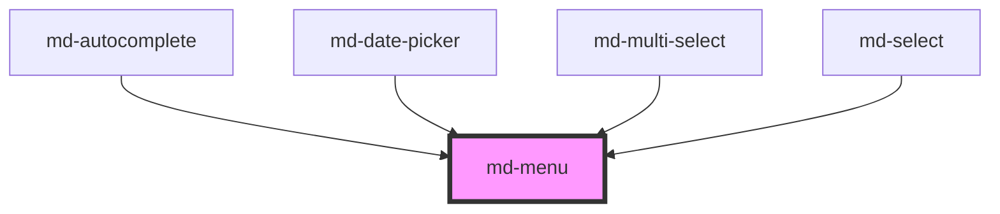

# md-menu

<!-- llm:meta
tag: md-menu
category: navigation
status: md3-mapped
m3-guidelines: https://m3.material.io/components/menus/guidelines
form-associated: false
depends-on: none
used-by: md-autocomplete, md-date-picker, md-multi-select, md-select
accepts-children: md-menu-item, md-menu-item-group, md-sub-menu-item
-->

**A temporary set of actions or options, anchored to a trigger.** Handles
placement, viewport flipping and clamping, roving focus, typeahead and
dismissal. It is also the dropdown surface inside `md-select`,
`md-multi-select`, `md-autocomplete` and `md-date-picker`.

> Setup, theming, density and i18n are configured once for the whole library —
> see the [AWC UI documentation](https://awcui.io).

---

## When to use

- A **temporary** set of actions from a trigger: overflow menus, context menus,
  row actions.
- More options than fit comfortably on screen — M3 notes a menu takes less space
  than a set of radio buttons or chips.
- Nested action groups (`md-sub-menu-item`).

## When NOT to use

| Situation | Use instead |
|---|---|
| Actions that should always be visible | `md-toolbar` |
| Choosing a value in a form | `md-select` / `md-multi-select` |
| 2–5 exclusive options | `md-segmented-button-set` |
| A list of records | `md-list` |
| A blocking decision | `md-dialog` |
| Supplementary panel content | `md-side-sheet` / `md-bottom-sheet` |
| Top-level navigation | `md-navigation-bar` / `md-navigation-rail` |
| One default action plus variants | `md-split-button` |

## Decision cues

| Need | Setting |
|---|---|
| MD3 baseline surface | `variant="baseline"` (default) |
| M3 Expressive rounded surface | `variant="standard"` |
| Higher emphasis — use sparingly | `variant="vibrant"` |
| Grouped section cards | `variant="standard"` or `"vibrant"` + `layout="grouped"` + `use-gap` |
| Match the trigger's width | `match-anchor-width` |
| Stay open across outside clicks | `persistent` |
| Stay open after one row is clicked | `keep-open` on that `md-menu-item` |
| Don't move focus into the menu on open | `auto-focus="false"` |
| Option semantics instead of menu semantics | `listbox` |
| Cap the scrollable height | `max-height` |
| Near-full-width below 600px | `responsive` |
| No open/close animation | `quick` |
| Message when every row is filtered out | `empty-text` |

## API contract

```html
<md-icon-button id="trigger" icon="more_vert" aria-label="More actions"></md-icon-button>

<md-menu
  anchor="trigger"                              <!-- id of the trigger; default "" -->
  open                                          <!-- default: false -->
  placement="bottom-start|bottom-end|top-start|top-end"  <!-- default: bottom-start -->
  variant="baseline|standard|vibrant"           <!-- default: baseline -->
  layout="standard|grouped"                     <!-- default: standard; ignored when variant="baseline" -->
  use-gap                                       <!-- default: false -->
  match-anchor-width                            <!-- default: false -->
  responsive                                    <!-- default: false -->
  persistent                                    <!-- default: false -->
  quick                                         <!-- default: false -->
  auto-focus="true"                             <!-- default: true -->
  listbox                                       <!-- default: false -->
  max-height="320"                              <!-- number = px, or any CSS length like "50vh"; default: unset -->
  empty-text="No actions"                       <!-- default: "" (empty state disabled) -->
  density="-1|-2|-3|-4"                         <!-- default: 0 (uncompacted; there is no density="0" rule) -->
>
  <md-menu-item headline="Rename"></md-menu-item>
  <md-menu-item headline="Duplicate"></md-menu-item>
  <md-menu-item headline="Delete" divider></md-menu-item>
</md-menu>
```

**Events** — `mdOpen`, `mdClose`, both `CustomEvent<void>` and both declared
`bubbles: false, composed: false`. They fire **only on the `md-menu` element
itself**: they do not bubble up the light DOM and do not cross a shadow
boundary. Always `menu.addEventListener('mdOpen', …)` — a listener on a parent
element or on a host that embeds the menu will never fire.

**Methods** — `show(opts?: { autoFocus?: boolean })`, `close()`,
`reposition()`, `getScrollViewport()`, `setComboboxElement(el)`,
`setVirtualProvider(provider)`. All return promises.

**Slots** — `(default)`: `md-menu-item` / `md-menu-item-group` /
`md-sub-menu-item` children. `header`: pinned content rendered above the
scroll area (used by the filterable pickers for their search field).

**Parts** — `surface`, `menu-viewport`, `empty-text`.

**Integration-only props — never set these by hand:** `list-label` is accepted
but the menu renders it into no ARIA attribute, so it does not label anything on
its own; the composite pickers set it. `setComboboxElement()` and
`setVirtualProvider()` are the virtualization hooks those pickers use.

### Behavioral contract worth knowing

- **`anchor` is an element `id`, resolved in the menu's own root node first,
  then in the document.** A menu and its trigger inside the same shadow root
  work; an id that lives in a *different* shadow root is unreachable and the
  menu will not position.
- **The menu writes ARIA onto the anchor for you** while it is open:
  `aria-haspopup="menu"` (or `"listbox"` in `listbox` mode), `aria-controls`
  (menu mode only), and `aria-expanded` — but `aria-expanded` is only written
  when the anchor's role supports it (an explicit `role` of button, combobox,
  link, menuitem, tab, treeitem, checkbox, gridcell, row, rowheader or
  columnheader, or a native `<button>`, `<summary>` or `<a href>`). A roleless
  custom-element trigger deliberately gets none.
- **A closed menu stays in the DOM**, at `opacity: 0` with `aria-hidden="true"`
  and `inert`. Don't try to focus into a closed menu; nothing inside it is
  tabbable.
- **Auto-dismiss is on by default.** The menu closes on an outside click, and
  when another non-persistent top-level menu opens. `persistent` opts out of
  both. Ancestors and descendants of the menu are never dismissed this way, so
  submenus are unaffected regardless.
- `Escape` closes and returns focus to the anchor. `Tab` closes the **whole**
  menu tree and also returns focus to the anchor.
- `close()` plays a 150 ms close animation before `open` flips to `false`;
  `quick` makes it immediate.
- On open, focus moves to the first item unless `auto-focus="false"` or
  `show({ autoFocus: false })`. The visible focus ring only appears when the
  open was keyboard-initiated; a mouse-opened menu focuses ring-less until the
  user presses a key.
- Typeahead: single printable characters build a 500 ms buffer and jump to the
  first item whose `headline` (falling back to its text content) starts with it.
- **Every menu without a `md-sub-menu-item` scrolls** — with or without
  `max-height`. The body is wrapped in the `menu-viewport` scroll container and
  bounded by `max-height`, the space on the chosen side, and the viewport. A
  menu that *does* contain a submenu keeps `overflow: visible` instead, so
  `max-height` has no effect there.
- `empty-text` renders a `role="status"` message, and only when it is set **and**
  no visible item remains. Items hidden with the `hidden` attribute or inline
  `style="display: none"` count as hidden — that is the type-to-filter contract.
- **Group cards need three settings together**: `variant="standard"` or
  `"vibrant"`, `layout="grouped"`, and `use-gap`. `layout` is ignored entirely
  while `variant="baseline"`.
- `reposition()` exists because the menu tracks scroll, resize and its own
  surface size — but not the anchor moving because sibling content reflowed.
- ⚠️ **Never ship `open` in the initial markup.** Positioning, outside-click and
  scroll dismissal, `mdOpen` and the anchor's ARIA are all wired by the `open`
  change handler, which does not run for an attribute that is already present at
  first render. Such a menu paints unpositioned (the host is `position: fixed`
  with no offsets) floating over the surrounding content, and clicking away will
  not close it. Open it from an interaction instead — `menu.show()`, or set
  `.open = true` from script after mount.

---

## Do / Don't

Sourced from [M3 · Menus · Guidelines](https://m3.material.io/components/menus/guidelines).

| ✅ Do | ❌ Don't |
|---|---|
| Use a menu for a **temporary** set of actions | To show actions at all times, use a toolbar instead |
| Prefer a menu over many radio buttons or chips when space is tight | Don't use a menu where two visible options would do |
| Open on a clear trigger — button, icon, field, right-click, long-press | Don't open menus on hover alone |
| Use `baseline`/`standard` for utilitarian menus | Use `vibrant` sparingly — it's high emphasis |
| Reserve slots for uses that keep the menu accessible and functional | Don't stuff arbitrary interactive content into the menu surface |
| Let the menu float above other UI | Don't clip it inside an `overflow: hidden` ancestor |
| Group related commands | Don't present a flat list of twenty unrelated actions |

---

## Patterns

```html
<!-- Overflow menu -->
<md-icon-button id="more" icon="more_vert" aria-label="More actions"></md-icon-button>
<md-menu id="more-menu" anchor="more" placement="bottom-end">
  <md-menu-item headline="Rename"></md-menu-item>
  <md-menu-item headline="Duplicate"></md-menu-item>
  <md-menu-item headline="Delete" divider></md-menu-item>
</md-menu>

<script type="module">
  const menu = document.getElementById('more-menu');
  document.getElementById('more').addEventListener('mdClick', () => menu.show());

  // mdOpen/mdClose do not bubble and do not cross shadow roots —
  // listen on the menu element itself.
  menu.addEventListener('mdOpen', () => console.log('opened'));
  menu.addEventListener('mdClose', () => console.log('closed'));
</script>
```

```html
<!-- Grouped section cards: variant + layout + use-gap are all required -->
<md-icon-button id="sort-btn" icon="sort" aria-label="Sort"></md-icon-button>
<md-menu anchor="sort-btn" variant="standard" layout="grouped" use-gap>
  <md-menu-item-group label="Order">
    <md-menu-item headline="Newest" type="radio" selected></md-menu-item>
    <md-menu-item headline="Oldest" type="radio"></md-menu-item>
  </md-menu-item-group>
  <md-menu-item-group label="View">
    <md-menu-item headline="Compact" type="checkbox"></md-menu-item>
  </md-menu-item-group>
</md-menu>
```

```html
<!-- Column toggles: the menu survives outside clicks AND row clicks -->
<md-icon-button id="cols" icon="view_column" aria-label="Columns"></md-icon-button>
<md-menu anchor="cols" persistent>
  <md-menu-item headline="Name"  type="checkbox" keep-open selected></md-menu-item>
  <md-menu-item headline="Owner" type="checkbox" keep-open></md-menu-item>
</md-menu>
```

```html
<!-- Type-to-filter with an empty state and a capped, scrolling body -->
<md-text-field id="filter" label="Filter"></md-text-field>
<md-menu id="cmds" anchor="filter" max-height="320" empty-text="No matches" auto-focus="false">
  <md-menu-item headline="Archive"></md-menu-item>
  <md-menu-item headline="Assign"></md-menu-item>
  <md-menu-item headline="Delete"></md-menu-item>
</md-menu>

<script type="module">
  const menu = document.getElementById('cmds');
  document.getElementById('filter').addEventListener('mdInput', (e) => {
    const q = e.detail.toLowerCase();   // mdInput detail is the string value
    for (const item of menu.querySelectorAll('md-menu-item')) {
      item.hidden = !item.headline.toLowerCase().includes(q);   // drives empty-text
    }
    if (!menu.open) menu.show({ autoFocus: false });
  });
</script>
```

```html
<!-- Reposition after a reflow moves the anchor -->
<script type="module">
  const menu = document.getElementById('more-menu');
  new ResizeObserver(() => { if (menu.open) menu.reposition(); })
    .observe(document.getElementById('more'));
</script>
```

## Anti-patterns

| ❌ Wrong | ✅ Right | Why |
|---|---|---|
| `document.addEventListener('mdOpen', …)` or listening on a wrapper element | Listen on the `md-menu` element itself | `mdOpen`/`mdClose` are `bubbles: false, composed: false`. |
| Expecting the menu to stay open on an outside click | `persistent` | It auto-dismisses by default. |
| Expecting the menu to stay open after a row is clicked | `keep-open` on the item | Item activation closes the root menu. |
| `layout="grouped"` on the default `variant="baseline"` | Add `variant="standard"` (or `"vibrant"`) and `use-gap` | `layout` is ignored while the variant is baseline. |
| Nesting `md-menu` inside an `overflow: hidden` container | Let it float | It gets clipped. |
| `anchor` pointing at an id in a different shadow root | Keep the trigger in the same root as the menu, or in the document | The id lookup only searches the menu's own root, then the document. |
| Adding `aria-expanded` / `aria-haspopup` to the trigger by hand | Let the menu write them | It manages them while open and removes `aria-expanded` from roles that can't carry it. |
| `list-label` expecting it to name the popup | Name the list from the trigger | The menu renders it into no ARIA attribute. |
| `max-height` on a menu containing `md-sub-menu-item` | Flatten the menu, or drop the cap | Submenu flyouts must not be clipped, so the cap is not applied. |
| `md-list-item` as menu children | `md-menu-item` | Wrong role and keyboard model. |
| A menu for a form value | `md-select` | Menus are commands; selects are values. |
| Always-visible actions in a menu | `md-toolbar` | M3 explicit rule. |
| `variant="vibrant"` everywhere | Reserve it | M3: high emphasis, use sparingly. |
| Calling `setVirtualProvider` / `setComboboxElement` in app code | Leave them to the composite pickers | Integration hooks. |

## Accessibility, RTL, density, i18n

**Accessibility**
- The surface is `role="menu"` with `aria-orientation="vertical"`, and
  `aria-labelledby` pointing at the `anchor` id — so give the trigger a real
  accessible name. In `listbox` mode the surface becomes `role="presentation"`
  and the owning component supplies the real `listbox`.
- Roving focus, typeahead, `Escape`, `Tab` and focus return to the anchor are all
  handled for you.
- The menu maintains `aria-haspopup` / `aria-controls` / `aria-expanded` on the
  anchor — don't duplicate them by hand.
- A **closed** menu is `inert` and `aria-hidden="true"`; that is what keeps
  hidden rows out of the accessibility tree and out of the tab order.
- `auto-focus="false"` is for composites where focus must stay in a text field.
  Note that ARIA IDREFs cannot cross shadow boundaries, so an
  `aria-activedescendant` relationship has to be built inside one root.

**RTL** — row *content* mirrors (`md-menu-item` lays its regions out with
logical properties, and an `md-sub-menu-item` opens toward the inline start).
The menu's own `placement` does **not**: `-start` / `-end` are mapped straight
onto physical left / right, so `placement="bottom-start"` aligns to the anchor's
physical **left** edge in every direction, and the overflow flip still measures
physical right-hand space. Under `dir="rtl"`, ask for `bottom-end` / `top-end`
when you want the menu aligned to the anchor's inline start.

**Density** — a local override is `density="-1"` through `density="-4"`; `0` is
the uncompacted default and has no rule of its own. The value drives the same
`--md-sys-density-scale` signal a global `data-density` ancestor sets, so a
local rung wins over the inherited one. To reset an inherited rung on a subtree
use `style="--md-sys-density-scale: 0"` — note that the ancestor's
`--md-sys-spacing-*` values still inherit.

**i18n** — translate `empty-text`, `header` slot content and every item's text.
Menu width follows content, so longer translations widen the surface — cap it
with `--md-menu-max-width` if your layout depends on it.

## Related components

`md-menu-item` · `md-menu-item-group` · `md-sub-menu-item` · `md-select` ·
`md-multi-select` · `md-autocomplete` · `md-toolbar` · `md-split-button`

## Theming

| Custom property | Purpose | Default |
|---|---|---|
| `--md-menu-min-width` | Minimum surface width | `112px` |
| `--md-menu-max-width` | Maximum surface width (still clamped to the viewport) | `100vw` |
| `--md-menu-viewport-margin` | Shrinks the surface's `max-width` / `max-height` to the viewport minus twice this value. It does **not** move the surface — the positional gap kept from each viewport edge is a fixed `8px` and is not themeable. | `8px` |
| `--md-menu-group-gap` | Space between grouped section cards | `4px` |
| `--md-menu-section-gap` | Space below a `gap` child in the baseline variant | `2px` |
| `--md-menu-inline-surface-color` | Background for the inline-fill embed only | `transparent` |
| `--md-menu-inline-fill-radius-end` | Bottom corner radius for the inline-fill embed | `0` |

**CSS parts** — `surface` (the floating panel), `menu-viewport` (the scroll
container, present on every non-submenu menu), `empty-text` (the empty-state
message).

```css
md-menu {
  --md-menu-min-width: 200px;
  --md-menu-max-width: 360px;
}
md-menu::part(surface) {
  box-shadow: 0 8px 24px rgb(0 0 0 / 0.18);
}
```

<!-- Auto Generated Below -->


## Properties

| Property           | Attribute            | Description                                                                                                                                                                                                                                                                                                                                                                                                                                                                                                                                                                                                                                                                                                                                                                                                           | Type                                                         | Default          |
| ------------------ | -------------------- | --------------------------------------------------------------------------------------------------------------------------------------------------------------------------------------------------------------------------------------------------------------------------------------------------------------------------------------------------------------------------------------------------------------------------------------------------------------------------------------------------------------------------------------------------------------------------------------------------------------------------------------------------------------------------------------------------------------------------------------------------------------------------------------------------------------------- | ------------------------------------------------------------ | ---------------- |
| `anchor`           | `anchor`             | ID of the anchor element to position relative to.                                                                                                                                                                                                                                                                                                                                                                                                                                                                                                                                                                                                                                                                                                                                                                     | `string`                                                     | `''`             |
| `autoFocus`        | `auto-focus`         | When false, opening the menu initializes roving tabindex without moving focus to the first item. The consumer handles focus (e.g. docked pickers that scroll to the selected option). `show({ autoFocus: false })` still takes precedence for a single open.                                                                                                                                                                                                                                                                                                                                                                                                                                                                                                                                                          | `boolean`                                                    | `true`           |
| `density`          | `density`            | Local density rung. Drives the same `--md-sys-density-scale` signal that a global `data-density` ancestor sets, so a local value simply overrides the inherited one. 0 = default, -4 = ultra-compact.                                                                                                                                                                                                                                                                                                                                                                                                                                                                                                                                                                                                                 | `-1 \| -2 \| -3 \| -4 \| 0`                                  | `0`              |
| `emptyText`        | `empty-text`         | Message shown when all menu items are hidden (e.g. no filter results). Empty string disables.                                                                                                                                                                                                                                                                                                                                                                                                                                                                                                                                                                                                                                                                                                                         | `string`                                                     | `''`             |
| `layout`           | `layout`             | Layout style for vertical menus. 'standard' is flat, 'grouped' uses visual section separators.                                                                                                                                                                                                                                                                                                                                                                                                                                                                                                                                                                                                                                                                                                                        | `"grouped" \| "standard"`                                    | `'standard'`     |
| `listLabel`        | `list-label`         |                                                                                                                                                                                                                                                                                                                                                                                                                                                                                                                                                                                                                                                                                                                                                                                                                       | `string \| undefined`                                        | `undefined`      |
| `listbox`          | `listbox`            | Present the popup as a WAI-ARIA listbox (surface `role="presentation"`, anchor `aria-haspopup="listbox"`) rather than a menu. `md-select` sets this for both its virtual and non-virtual lists so the popup is a listbox of options regardless of size. (The virtual path additionally registers a provider, which adds the aria-activedescendant focus model.)                                                                                                                                                                                                                                                                                                                                                                                                                                                       | `boolean`                                                    | `false`          |
| `matchAnchorWidth` | `match-anchor-width` | When true, the menu surface min-width matches the anchor element's width. The menu still grows wider if items need more space.                                                                                                                                                                                                                                                                                                                                                                                                                                                                                                                                                                                                                                                                                        | `boolean`                                                    | `false`          |
| `maxHeight`        | `max-height`         | Cap the menu surface block-size. When the items exceed it the list scrolls vertically inside a plain scroll viewport. A number is treated as pixels; any CSS length is passed through (e.g. `'50vh'`). Ignored when the menu has submenus — their flyouts must not be clipped by an overflow container.                                                                                                                                                                                                                                                                                                                                                                                                                                                                                                               | `number \| string \| undefined`                              | `undefined`      |
| `open`             | `open`               | Whether the menu is open.                                                                                                                                                                                                                                                                                                                                                                                                                                                                                                                                                                                                                                                                                                                                                                                             | `boolean`                                                    | `false`          |
| `persistent`       | `persistent`         | When set, the menu does NOT auto-dismiss in response to interaction elsewhere on the page. By default a menu closes when:   1. The user clicks outside the menu and its anchor.   2. Another non-persistent menu opens (single-open coordination —      opening menu B closes menu A so two top-level menus never      overlap each other on screen).  `persistent` opts out of both auto-dismiss paths. The menu then only closes via `close()`, the anchor's toggle, item activation, or Escape. Useful for modal-style pickers, multi-step menus, and any context where the consumer manages dismissal explicitly.  Submenus (an `<md-menu>` rendered inside a parent menu's `submenu` slot) are never affected by sibling-menu dismissal even without this flag — ancestors and descendants are always preserved. | `boolean`                                                    | `false`          |
| `placement`        | `placement`          | Position of the menu relative to the anchor.                                                                                                                                                                                                                                                                                                                                                                                                                                                                                                                                                                                                                                                                                                                                                                          | `"bottom-end" \| "bottom-start" \| "top-end" \| "top-start"` | `'bottom-start'` |
| `quick`            | `quick`              | Skip open/close animation.                                                                                                                                                                                                                                                                                                                                                                                                                                                                                                                                                                                                                                                                                                                                                                                            | `boolean`                                                    | `false`          |
| `responsive`       | `responsive`         | Adapt to compact viewports. The menu is *always* clamped within the viewport (it never overflows the screen and pins to the edges with a margin). When `responsive` is set, on viewports at or below the compact breakpoint (600px) the menu additionally expands to near-full-width below the trigger for comfortable touch use.                                                                                                                                                                                                                                                                                                                                                                                                                                                                                     | `boolean`                                                    | `false`          |
| `useGap`           | `use-gap`            | Use gap separators instead of dividers between groups (vertical menu only).                                                                                                                                                                                                                                                                                                                                                                                                                                                                                                                                                                                                                                                                                                                                           | `boolean`                                                    | `false`          |
| `variant`          | `variant`            | Visual variant. - 'baseline': MD3 baseline menu (square corners, surface container) - 'standard': M3 Expressive vertical menu (rounded, surface-based colors) - 'vibrant': M3 Expressive vertical menu (rounded, tertiary-based colors)                                                                                                                                                                                                                                                                                                                                                                                                                                                                                                                                                                               | `"baseline" \| "standard" \| "vibrant"`                      | `'baseline'`     |


## Events

| Event     | Description                                                                                                                                                                                                                                                                                                                                                                                                                                                                                                                                                                                        | Type                |
| --------- | -------------------------------------------------------------------------------------------------------------------------------------------------------------------------------------------------------------------------------------------------------------------------------------------------------------------------------------------------------------------------------------------------------------------------------------------------------------------------------------------------------------------------------------------------------------------------------------------------- | ------------------- |
| `mdClose` | Fires when the menu closes. Scoped like `mdOpen` — see its note.                                                                                                                                                                                                                                                                                                                                                                                                                                                                                                                                   | `CustomEvent<void>` |
| `mdOpen`  | Fires when the menu opens. Scoped to the menu element: `bubbles: false` stops it climbing the light-DOM tree, and `composed: false` stops it escaping the shadow root of a host that embeds this menu (md-select, md-multi-select, md-date-picker …). Without `composed: false` a `composed` event still surfaces at the embedding host as an `AT_TARGET` event — so a consumer's `mdOpen` listener on the wrapper would fire for both the wrapper's own event and this inner one (duplicate open/close). Wrappers listen via `onMdOpen` on the menu element itself, which still fires regardless. | `CustomEvent<void>` |


## Methods

### `close() => Promise<void>`

Closes the menu programmatically.

#### Returns

Type: `Promise<void>`


### `getScrollViewport() => Promise<HTMLElement | null>`

The scrollable viewport element (the menu's `.md-menu__scroll-shadow`
scroll div), or null when the menu isn't capped/scrollable. A virtualized
host attaches its scroll listener and reads `scrollTop`/`clientHeight`
from this.

#### Returns

Type: `Promise<HTMLElement | null>`


### `reposition() => Promise<void>`

Recompute the menu's position against its anchor. md-menu already reacts to
scroll/resize, but not to the anchor MOVING because sibling content reflowed
(e.g. a multi-select whose button trigger shifts as chips are added beside
it). Call this after such a reflow to keep the popup glued to the anchor.

#### Returns

Type: `Promise<void>`


### `setComboboxElement(el: HTMLElement | null) => Promise<void>`

Register (or clear with `null`) the combobox element that holds focus while
a virtual provider drives the list. When set, keyboard navigation manages
`aria-activedescendant` on it rather than calling `.focus()` on options —
the canonical pattern for a listbox whose rows are virtualized/recycled.

#### Parameters

| Name | Type                  | Description |
| ---- | --------------------- | ----------- |
| `el` | `HTMLElement \| null` |             |

#### Returns

Type: `Promise<void>`


### `setVirtualProvider(provider: VirtualMenuProvider | null) => Promise<void>`

Register (or clear with `null`) a virtual provider. With a provider set,
keyboard nav, typeahead, and roving focus run against the data model so a
windowed list of millions of options behaves like a normal menu. Without
one the menu is unchanged.

#### Parameters

| Name       | Type                          | Description |
| ---------- | ----------------------------- | ----------- |
| `provider` | `VirtualMenuProvider \| null` |             |

#### Returns

Type: `Promise<void>`


### `show(opts?: { autoFocus?: boolean; }) => Promise<void>`

Opens the menu programmatically. Pass `{ autoFocus: false }` to keep focus on the caller (e.g. a text field).

#### Parameters

| Name   | Type                                                 | Description |
| ------ | ---------------------------------------------------- | ----------- |
| `opts` | `{ autoFocus?: boolean \| undefined; } \| undefined` |             |

#### Returns

Type: `Promise<void>`


## Shadow Parts

| Part              | Description |
| ----------------- | ----------- |
| `"empty-text"`    |             |
| `"menu-viewport"` |             |
| `"surface"`       |             |


## Dependencies

### Used by

 - [md-autocomplete](../md-autocomplete)
 - [md-date-picker](../md-date-picker)
 - [md-multi-select](../md-multi-select)
 - [md-select](../md-select)

### Graph


----------------------------------------------

*Built with [StencilJS](https://stenciljs.com/)*
