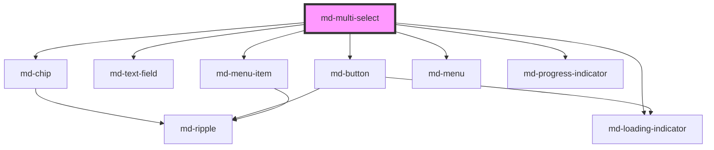

# md-multi-select

<!-- llm:meta
tag: md-multi-select
category: selection
status: md3-mapped
m3-guidelines: https://m3.material.io/components/menus/guidelines
form-associated: true
depends-on: md-chip, md-text-field, md-loading-indicator, md-button, md-menu-item, md-menu, md-progress-indicator
used-by: none
accepts-children: md-select-option
-->

**Pick several values from a list.** Everything `md-select` does, plus multiple
selection shown as removable chips / a count / plain text, an optional
select-all row, a selection cap, and a field, button or fully custom trigger.

> Setup, theming, density and i18n are configured once for the whole library —
> see [`main-llm.md`](../../../../../main-llm.md) at the repo root.

---

## When to use

- **Several** values from a list of roughly 5+ options.
- The chosen values should stay visible (as chips) after the menu closes.
- Optionally capped (`max-selected`) or with a select-all shortcut.

## When NOT to use

| Situation | Use instead |
|---|---|
| Exactly one value | `md-select` |
| Few options, all worth showing | `md-checkbox` group |
| Assigning a subset from a large pool, side by side | `md-transfer-list` |
| Free text with suggestions | `md-autocomplete` |
| A handful of toggleable filters | `md-chip` set |
| 2–5 exclusive options | `md-segmented-button-set` |

## Decision cues

| Need | Setting |
|---|---|
| Chips below the field | `display-mode="chips"` (default) |
| Chips inside the field | `display-mode="chips-inline"` |
| Just "3 selected" | `display-mode="count"` (+ `countFormatter` in JS) |
| Comma-joined labels | `display-mode="text"` |
| Inline chips: "+5" counter vs wrapping | `chip-overflow="count"` / `"wrap"` |
| Chips above / beside the field | `chip-position="top\|left\|right"` |
| A button trigger instead of a field | `trigger="button"` + `trigger-label` |
| Your own opener (any element) | `slot="trigger"` |
| Cap the selection | `max-selected="3"` |
| Select-all row | `show-select-all` |
| Search inside the menu | `filterable` (+ `filter-mode`) |
| Huge lists | `virtualize="always"` + `row-height` |
| Custom empty states | `no-options` / `no-results` slots |
| Pinned content above the list | `menu-header` slot |

## API contract

```html
<md-multi-select
  variant="filled|outlined"                 <!-- default: outlined -->
  label="Teams"
  placeholder="Choose…"
  name="teams"
  required                                  <!-- default: false -->
  display-mode="chips|chips-inline|count|text"   <!-- default: chips -->
  chip-overflow="count|wrap"                <!-- default: count (chips-inline only) -->
  chip-position="bottom|top|left|right"     <!-- default: bottom -->
  trigger="field|button"                    <!-- default: field -->
  trigger-icon="add"                        <!-- default: add -->
  trigger-label="Add teams"                 <!-- default: '' → falls back to label -->
  max-selected="0"                          <!-- default: 0 = unlimited -->
  show-select-all                           <!-- default: false -->
  select-all-label="Select all"             <!-- default: Select all -->
  filterable                                <!-- default: false -->
  filter-mode="substring"                   <!-- default: substring -->
  virtualize="auto|always|never"            <!-- default: auto -->
  row-height="48"                           <!-- default: measured from row 1 -->
  placement="bottom-start|bottom-end|top-start|top-end"   <!-- default: bottom-start -->
  match-trigger-width                       <!-- default: true -->
  max-height="320"                          <!-- pixels (number) -->
  clearable                                 <!-- default: false -->
  clear-icon="close"                        <!-- default: close -->
  clear-label="Clear selection"             <!-- default: Clear selection -->
  dropdown-icon="arrow_drop_down"           <!-- default: arrow_drop_down -->
  search-placeholder="Search…"              <!-- default: Search… -->
  filter-label="Filter teams"               <!-- default: 'Filter <label>' -->
  no-results-text="No results"              <!-- default: No results -->
  no-options-text="No options"              <!-- default: No options -->
  searching-label="Searching"               <!-- default: Searching -->
  loading                                   <!-- default: false -->
  loading-text="Loading…"                   <!-- default: Loading… -->
  supporting-text="Pick up to three"
  error error-text="Choose at least one"
  value-missing-label="Please select at least one option"
  reserve-supporting-space                  <!-- default: false -->
  disabled                                  <!-- default: false -->
  soft-disabled                             <!-- default: false -->
  open                                      <!-- default: false -->
  density="-1|-2|-3|-4"                     <!-- default: 0 = uncompacted -->
>
  <md-select-option value="eng">Engineering</md-select-option>
  <md-select-option value="des">Design</md-select-option>
</md-multi-select>
```

```js
// value, options and countFormatter are JS properties.
const el = document.querySelector('md-multi-select');
el.options = teams.map((t) => ({ value: t.id, label: t.name }));
el.value = ['eng', 'des'];                   // string[]
el.countFormatter = (n) => `${n} teams selected`;
```

**Events** — `mdChange` (`CustomEvent<string[]>`, the full new selection),
`mdRemove` (`string`, the value a chip removed), `mdClear` (`void`), `mdOpen`
(`void`), `mdClose` (`void`) — all composed; `mdValidityChange`
(`{ valid, validationMessage, flags }`) bubbles but is **not composed**.

**Methods** — `show()`, `close()`, `focusTrigger()`, `reset()`,
`loadOptions(source)`, `setQuery(query)`, `getLabels(values)` *(virtualized
lists only — it returns `{}` on a plain list)*, `getValidity()`,
`checkValidity()`, `reportValidity()`, `setCustomValidity(message)`. All are
async.

**Slots** — default: the `md-select-option` children (hidden data carriers);
`trigger` (replaces the built-in field/button with your own element);
`trigger-leading`, `trigger-trailing` (content inside the field trigger);
`menu-header` (pinned above the search / select-all); `no-options`,
`no-results` (replace the empty-state text); `loader` (trigger spinner),
`menu-loader` (in-menu progress bar); `dropdown-icon` (caret glyph).

**Parts** — `frame`, `field`, `button`, `button-desc`, `caret-box`, `caret`,
`clear`, `chips`, `chip`, `overflow-chip`, `menu`, `menu-header`, `listbox`,
`option`, `option-selected`, `option-icon`, `select-all`, `select-all-item`,
`search-wrap`, `search`, `search-spinner`, `empty`, `loading-spinner`,
`loading-bar`, `loading-progress`, `live-region`. Forwarded out of the inner
components: `field-container`, `field-input`, `field-label`, `chip-remove`,
`chip-label`, `menu-surface`, `empty-text`.

### Behavioral contract worth knowing

- **`value` is a `string[]`** and has **no attribute** — set it as a JS
  property. Same for `countFormatter` (a function). There is no `filterer`
  prop here: in-menu search is `filterable` + `filter-mode`.
- `options` accepts the array as a **JS property** or a **JSON array string**
  as an attribute (`options='[{"value":"eng","label":"Engineering"}]'`).
  Malformed JSON warns on the console and degrades to an empty list.
- **Two option sources, with a defined winner.** Slotted `md-select-option`
  children take precedence; `options` is only read when there are none.
- Options carrying `selected` are adopted at load, and only while `value` is
  still empty.
- `max-selected="0"` means **no cap**, not "none allowed".
- When the cap is reached the component **rejects** further picks. Rows
  (`md-menu-item`) self-toggle on click *before* the parent reconciles, so the
  component reverts the rejected row via the event target. If you wrap this in
  your own controlled layer, replicate that or you get a phantom check.
- `mdRemove` fires with the single removed value when a chip's ✕ is used, and
  `mdChange` fires straight after with the new full array. `mdClear` fires
  after `mdChange` when the clear button empties the selection. Don't
  double-handle.
- `reset()` empties the selection and emits `mdChange([])`; it is a no-op when
  nothing is selected, and emits no `mdClear`. A `<form>` reset restores the
  selection the element loaded with and emits **nothing**.
- **`slot="trigger"` replaces the built-in trigger entirely.** Any element
  works; the component wires it rather than rendering it — a click opens, its
  `id` becomes the menu anchor (one is stamped if it has none),
  `aria-haspopup="listbox"` is set, and `Escape` closes and returns focus. The
  chips keep their `chip-position` relationship to it. It does **not** inherit
  `disabled` styling (mirror that yourself), and the supporting/error line is
  announced with `role="alert"` instead of `aria-describedby`, because that
  IDREF would have to cross the shadow boundary.
- `trigger="button"` and a slotted trigger **always** show chips, whatever
  `display-mode` says — there is no in-field value display to summarise into.
- `chip-position="left"` / `"right"` also forces the field trigger to
  `density="-3"`, so the field height sits closer to the 32px chips beside it.
- `display-mode="chips-inline"` puts the chips inside the field. With the
  default `chip-overflow="count"` the field stays one line high and the chips
  that don't fit collapse into a trailing `+N` button (click it to open the
  menu); with `chip-overflow="wrap"` the chips wrap and the field grows.
- `show-select-all` is **skipped for virtualized lists** (it would have to
  materialise every value) and while `loading`. It honours `max-selected`: a
  capped "select all" selects up to the cap and the row lands on the
  indeterminate dash, not the tick.
- `filterable` renders a search box inside the menu and moves focus to it on
  open, for both the plain and the virtualized list. A plain list filters
  client-side on **label or supporting text**, case-insensitively and
  synchronously; a virtualized one filters inside the WASM engine, debounced,
  with a spinner. Closing the menu clears the query.
- `setQuery(q)` filters exactly as typing into that box would and mirrors `q`
  into it. Apply it **after `loadOptions()` resolves** — loading replaces the
  option set and discards an earlier filter.
- `virtualize="auto"` switches to the virtualized path above 200 options.
  Virtualized rows carry label, supporting text and selection only — a
  per-option `iconColor` is dropped there (rows fall back to
  `--md-multi-select-option-icon-color`). A virtualized menu needs a bounded
  viewport, so `max-height` defaults to `320` when unset.
- `soft-disabled` blocks every interaction but keeps the trigger focusable;
  `disabled` also disables the inner field.
- `required` is published to the owning form through `ElementInternals`, so an
  empty required control really blocks submission. `error-text`, when set, is
  used as the validation message too, so the inline text and the native bubble
  agree. `setCustomValidity(msg)` wins over both; clear it with `''`.
- `mdValidityChange` never fires on mount, repeats nothing, and is **not
  composed** — listen on the `md-multi-select` element itself. `mdOpen` /
  `mdClose` **are** composed, so they also fire on an embedding shadow host.
- A polite live region announces the selection count on every change.

---

## Do / Don't

Menu and row guidance sourced from
[M3 · Menus · Guidelines](https://m3.material.io/components/menus/guidelines);
chip behaviour follows
[M3 · Chips · Guidelines](https://m3.material.io/components/chips/guidelines).

| ✅ Do | ❌ Don't |
|---|---|
| Keep chosen values visible with chips | Don't hide the selection behind a closed menu with no summary |
| Switch to `count` display when selections get numerous | Don't let 30 chips push the form apart |
| Use `chip-overflow="count"` in tight layouts | Don't wrap dozens of chips into a wall |
| Turn on `filterable` past ~15 options | Don't force scrolling through a long unfiltered list |
| Explain a cap in `supporting-text` | Don't let a `max-selected` rejection happen with no explanation |
| Offer `show-select-all` for long, commonly all-selected lists | Don't offer select-all where selecting everything is meaningless |
| Keep option labels short | Don't put sentences in chips |
| Localize every text prop and `select-all-label` | Don't ship the English defaults |
| Swap supporting text for error text | Don't show both |

---

## Patterns

```html
<md-multi-select id="teams" label="Teams" name="teams"
                 filterable clearable show-select-all
                 max-selected="3" supporting-text="Pick up to three">
</md-multi-select>

<script type="module">
  const el = document.getElementById('teams');
  el.options = [
    { value: 'eng', label: 'Engineering', supportingText: '24 members' },
    { value: 'des', label: 'Design', supportingText: '6 members' },
    { value: 'ops', label: 'Operations' },
  ];
  el.value = ['eng'];

  el.addEventListener('mdChange', (e) => console.log(e.detail)); // string[]
  el.addEventListener('mdRemove', (e) => console.log('removed', e.detail));
  el.addEventListener('mdClear', () => console.log('cleared'));
</script>
```

```html
<!-- Compact: a count summary instead of chips -->
<md-multi-select id="filters" label="Filters" display-mode="count"></md-multi-select>
<script type="module">
  const el = document.getElementById('filters');
  el.options = [{ value: 'a', label: 'Active' }, { value: 'b', label: 'Archived' }];
  el.countFormatter = (n) => (n === 1 ? '1 filter' : `${n} filters`);
</script>
```

```html
<!-- Chips inside the field, wrapping instead of collapsing to "+N" -->
<md-multi-select label="Tags" display-mode="chips-inline" chip-overflow="wrap">
  <md-select-option value="new">New</md-select-option>
  <md-select-option value="urgent">Urgent</md-select-option>
</md-multi-select>

<!-- Your own opener; the chips sit to its right -->
<md-multi-select label="Tags" chip-position="right">
  <md-button slot="trigger" variant="outlined" size="xs" icon="add">Add tags</md-button>
  <md-select-option value="new">New</md-select-option>
  <md-select-option value="urgent">Urgent</md-select-option>
</md-multi-select>
```

```html
<!-- Large, virtualized, loaded on first open -->
<md-multi-select id="users" label="Users" filterable
                 virtualize="always" row-height="48"></md-multi-select>

<script type="module">
  const el = document.getElementById('users');
  let loaded = null;
  el.addEventListener('mdOpen', () => {
    loaded ??= (async () => {
      el.loading = true;
      await el.loadOptions(await fetchUsers());  // resolves once packed
      el.loading = false;
    })();
  });
</script>
```

## Anti-patterns

| ❌ Wrong | ✅ Right | Why |
|---|---|---|
| `max-selected="0"` to block selection | `0` means unlimited; use `disabled` | Common and costly misreading. |
| `value="a,b"` as an attribute | Assign `el.value = ['a','b']` in JS | `value` is a `string[]` with no attribute. |
| `count-formatter` as an attribute | Assign `countFormatter` in JS | A function has no attribute form. |
| Handling both `mdRemove` and `mdChange` as removals | `mdChange` already carries the new array | You'd process the removal twice. |
| A controlled wrapper that rejects a pick without reverting the row | Revert via the event target | Rows self-toggle before the parent reconciles — otherwise a phantom check. |
| Supplying `md-select-option` children **and** `options` | Pick one source | Children win outright; the array is silently ignored. |
| 40 chips in `chips` mode | `display-mode="count"` | The form becomes unusable. |
| `show-select-all` on a virtualized list | Drop it, or `virtualize="never"` | It is skipped there by design. |
| Expecting `display-mode="count"` to hide chips under `trigger="button"` | Use the field trigger | Button and slotted triggers always show chips. |
| Listening for `mdValidityChange` on a shadow ancestor | Listen on the element | It is `composed: false`. |
| `setQuery()` straight after kicking off a fetch | `await` the `loadOptions()` promise first | Loading replaces the option set and discards the filter. |
| Shipping English `select-all-label` etc. in a localized app | Translate every text prop | They all default to English. |
| Using it to assign from a huge pool | `md-transfer-list` | Better for side-by-side batch moves. |

## Accessibility, RTL, density, i18n

**Accessibility**
- `label` names the control. The popup is a `role="listbox"` with
  `aria-multiselectable="true"`; rows are `role="option"` with `aria-selected`.
  The host carries `aria-haspopup="listbox"` and deliberately no
  `aria-expanded` (the host has no role, so it would be ignored) — the state
  lives on the button trigger and on the filterable search, which are the
  elements that actually have a role.
- With `filterable`, the in-menu search is the `role="combobox"`; it owns focus
  while the list is open and points at the listbox with `aria-controls` and
  `aria-activedescendant`. Both live in this shadow root — don't try to wire
  those IDREFs from outside.
- The selection chips sit in a labelled `role="group"`, outside the field's
  aria-hidden icon slot, so each ✕ is reachable and announced. Removing a chip
  moves focus to the chip that takes its place, or back to the trigger.
- A polite live region reports the selection count after every change.
- `Escape` closes the menu and returns focus to the trigger.
- Announce cap rejections through `supporting-text` / `error-text`; a silent
  rejection is invisible to screen-reader users.

**RTL** — field, chips, caret and menu mirror under `dir="rtl"`.
`chip-position="left"` / `"right"` is **physical**, so re-check it per
direction; `placement` is logical.

**Density** — `density="-1"` … `density="-4"` compacts the trigger, the chips
and the menu rows together. There is no `density="0"` rung: 0 is the
uncompacted default and setting it does nothing. To opt out of an inherited
`data-density` rung, set `style="--md-sys-density-scale: 0"` on the element —
that only resets the calc-driven scale, not the spacing tokens the ancestor
rung declares.

**i18n** — translate `label`, `placeholder`, `supporting-text`, `error-text`,
`select-all-label`, `search-placeholder`, `filter-label`, `no-results-text`,
`no-options-text`, `clear-label`, `searching-label`, `loading-text`,
`trigger-label` and `value-missing-label`, and make `countFormatter`
pluralization-aware. Three accessible strings are **not** localizable yet: the
live region's `"{n} selected"` / `"None selected"`, the inline overflow
button's `"{n} more selected — open to manage"`, and each chip's
`"Remove {label}"`.

## Related components

`md-select` · `md-select-option` · `md-transfer-list` · `md-autocomplete` ·
`md-checkbox` · `md-chip` · `md-menu` · `md-text-field`

## Theming

| Custom property | Purpose | Default |
|---|---|---|
| `--md-multi-select-width` | Host inline size | `100%` |
| `--md-multi-select-min-width` | Host minimum inline size | `200px` |
| `--md-multi-select-trigger-width` | Width of the button / slotted trigger row | `max-content` |
| `--md-multi-select-frame-gap` | Gap between the trigger and the chips row | density-scaled: 8px at rung 0 (default `chip-position`), 16px at rung 0 with `chip-position="top"`; floor 6px either way |
| `--md-multi-select-chip-gap` | Gap between chips | `--md-sys-spacing-gap-xs` (4px) |
| `--md-multi-select-chip-radius` | Chip corner radius | `8px` |
| `--md-multi-select-chip-height` | Chip height | `32px` |
| `--md-multi-select-chip-outline` | Chip outline colour | `--md-sys-color-outline-variant` |
| `--md-multi-select-inline-chips-block-start` | Top offset of the in-field chips row | `--md-sys-spacing-gap-xs` (4px) |
| `--md-multi-select-caret-color` | Caret colour | `--md-sys-color-on-surface-variant` |
| `--md-multi-select-caret-size` | Caret glyph size | `24px` |
| `--md-multi-select-caret-box-size` | Caret box size | `24px` |
| `--md-multi-select-clear-color` | Clear button colour | `--md-sys-color-on-surface-variant` |
| `--md-multi-select-clear-bg` | Clear button background | `transparent` |
| `--md-multi-select-clear-hover-bg` | Clear button hover background | tinted on-surface |
| `--md-multi-select-clear-size` | Clear button box | `28px` |
| `--md-multi-select-clear-radius` | Clear button radius | `50%` |
| `--md-multi-select-clear-icon-size` | Clear glyph size | `18px` |
| `--md-multi-select-clear-focus-ring-color` | Clear focus ring colour | `--md-sys-color-primary` |
| `--md-multi-select-clear-focus-ring-width` | Clear focus ring width | `2px` |
| `--md-multi-select-clear-focus-ring-offset` | Clear focus ring offset | `1px` |
| `--md-multi-select-option-icon-color` | Option row leading-icon colour | `--md-sys-color-on-surface-variant` |
| `--md-multi-select-option-icon-size` | Option row leading-icon size | `20px` |
| `--md-multi-select-search-bg` | In-menu search background | `--md-sys-color-surface-container` |
| `--md-multi-select-search-color` | In-menu search text colour | `--md-sys-color-on-surface` |
| `--md-multi-select-search-placeholder-color` | In-menu search placeholder colour | `--md-sys-color-on-surface-variant` |
| `--md-multi-select-search-padding` | In-menu search padding | `12px 44px 12px 16px` |
| `--md-multi-select-search-border-color` | Search bottom border colour | `--md-sys-color-outline-variant` |
| `--md-multi-select-search-border-width` | Search bottom border width | `1px` |
| `--md-multi-select-search-spinner-size` | Filtering spinner size | `24px` |
| `--md-multi-select-select-all-divider-color` | Select-all separator colour | `--md-sys-color-outline-variant` |
| `--md-multi-select-select-all-divider-width` | Select-all separator width | `1px` |
| `--md-multi-select-empty-color` | Empty-state text colour | `--md-sys-color-on-surface-variant` |
| `--md-multi-select-empty-padding` | Empty-state padding | `12px 16px` |
| `--md-multi-select-empty-font` | Empty-state font | `--md-sys-typescale-body-medium` |
| `--md-multi-select-spinner-size` | Trigger busy-spinner glyph size | `22px` |
| `--md-multi-select-loader-size` | Trigger busy-spinner box | `24px` |
| `--md-multi-select-loading-padding` | Padding around the in-menu progress bar | `--md-sys-spacing-inset-lg` (16px) |

The menu height is the `max-height` **prop**, not a custom property. The
composed field, chips and menu also expose their own `--md-text-field-*`,
`--md-chip-*`, `--md-menu-*` and `--md-menu-item-*` properties, which flow
through when set on the host.

```css
md-multi-select {
  --md-multi-select-min-width: 280px;
  --md-multi-select-chip-radius: 16px;
}

md-multi-select::part(option-selected) {
  font-weight: 600;
}
```

<!-- Auto Generated Below -->


## Overview

`md-multi-select` — Material Design 3 multi-value dropdown.

Shares its internals with `md-select`: an `md-text-field` trigger and an
`md-menu` option surface. Options come from slotted `<md-select-option>`
children (primary API) or the programmatic `options` array. Each becomes a
`type="checkbox"` `md-menu-item` so several can be selected at once, and the
menu uses `keep-open` so multiple toggles don't dismiss it.

Selected values render in the trigger as removable chips (`display-mode="chips"`),
a "{n} selected" count, or comma-joined text.

## Properties

| Property                 | Attribute                  | Description                                                                                                                                                                                                                                                                                                                                                                                              | Type                                                         | Default                               |
| ------------------------ | -------------------------- | -------------------------------------------------------------------------------------------------------------------------------------------------------------------------------------------------------------------------------------------------------------------------------------------------------------------------------------------------------------------------------------------------------- | ------------------------------------------------------------ | ------------------------------------- |
| `chipOverflow`           | `chip-overflow`            | For `display-mode="chips-inline"`, how the in-field chips handle running out of room:   - `'count'` (default): chips stay on ONE line; the field keeps its normal     height and the chips that don't fit collapse into a trailing `+N` counter     chip (click it — or the field — to open the menu and manage the full set).   - `'wrap'`: chips wrap onto new rows and the field grows to fit them.   | `"count" \| "wrap"`                                          | `'count'`                             |
| `chipPosition`           | `chip-position`            | Where the removable chips sit relative to the trigger, for `display-mode="chips"` (ignored for `chips-inline`/`count`/`text`): `'bottom'` (default), `'top'`, `'left'`, or `'right'`. `left`/`right` place the chips beside the trigger and are the natural pairing for `trigger="button"`.                                                                                                              | `"bottom" \| "left" \| "right" \| "top"`                     | `'bottom'`                            |
| `clearIcon`              | `clear-icon`               | Material Symbols glyph for the clear button.                                                                                                                                                                                                                                                                                                                                                             | `string`                                                     | `'close'`                             |
| `clearLabel`             | `clear-label`              | Accessible label for the clear button (localization).                                                                                                                                                                                                                                                                                                                                                    | `string`                                                     | `'Clear selection'`                   |
| `clearable`              | `clearable`                | Show a clear (×) button in the trigger that removes all selections.                                                                                                                                                                                                                                                                                                                                      | `boolean`                                                    | `false`                               |
| `countFormatter`         | --                         | Custom formatter for `display-mode="count"`.                                                                                                                                                                                                                                                                                                                                                             | `((count: number) => string) \| undefined`                   | `undefined`                           |
| `density`                | `density`                  | Density forwarded to the inner field.                                                                                                                                                                                                                                                                                                                                                                    | `-1 \| -2 \| -3 \| -4 \| 0`                                  | `0`                                   |
| `disabled`               | `disabled`                 | Disabled — non-interactive.                                                                                                                                                                                                                                                                                                                                                                              | `boolean`                                                    | `false`                               |
| `displayMode`            | `display-mode`             | How selected values appear in the trigger:   - `'chips'` (default): removable chips in a region BELOW the field.   - `'chips-inline'`: removable chips INSIDE the trigger input, on a single     line — the field keeps its normal height and never grows; chips that     overflow are clipped (the open menu is the source of truth).   - `'count'`: "{n} selected".   - `'text'`: comma-joined labels. | `"chips" \| "chips-inline" \| "count" \| "text"`             | `'chips'`                             |
| `dropdownIcon`           | `dropdown-icon`            | Caret glyph (Material Symbol) for the field trigger; rotates 180° when open. Override the whole glyph with the `dropdown-icon` slot.                                                                                                                                                                                                                                                                     | `string`                                                     | `'arrow_drop_down'`                   |
| `error`                  | `error`                    | Error state — forwarded to the inner field.                                                                                                                                                                                                                                                                                                                                                              | `boolean`                                                    | `false`                               |
| `errorText`              | `error-text`               | Error text rendered in place of supporting text when `error` is set.                                                                                                                                                                                                                                                                                                                                     | `string`                                                     | `''`                                  |
| `filterLabel`            | `filter-label`             | Accessible label for the filter search input. Defaults to "Filter {label}".                                                                                                                                                                                                                                                                                                                              | `string`                                                     | `''`                                  |
| `filterMode`             | `filter-mode`              | Filter strategy used by `filterable` / `setQuery`.                                                                                                                                                                                                                                                                                                                                                       | `"fuzzy" \| "prefix" \| "substring"`                         | `'substring'`                         |
| `filterable`             | `filterable`               | Show a search field in the menu header that filters via the WASM engine.                                                                                                                                                                                                                                                                                                                                 | `boolean`                                                    | `false`                               |
| `label`                  | `label`                    | Floating label / accessible name.                                                                                                                                                                                                                                                                                                                                                                        | `string`                                                     | `''`                                  |
| `loading`                | `loading`                  | Show a busy state: the trigger shows a spinner instead of the caret and the host is `aria-busy`, and the menu shows a wavy progress bar instead of the option list. Use while an async dataset loads (e.g. before/around a large `loadOptions`). Replace the trigger spinner with the `loader` slot.                                                                                                     | `boolean`                                                    | `false`                               |
| `loadingText`            | `loading-text`             | Text shown in the trigger / menu while `loading` is true.                                                                                                                                                                                                                                                                                                                                                | `string`                                                     | `'Loading…'`                          |
| `matchTriggerWidth`      | `match-trigger-width`      | Match the dropdown width to the trigger. When `false` the menu sizes to content. Maps to `md-menu`'s `match-anchor-width`. Default `true`.                                                                                                                                                                                                                                                               | `boolean`                                                    | `true`                                |
| `maxHeight`              | `max-height`               | Max height of the dropdown menu (px), forwarded to `md-menu`. Virtualized lists fall back to 320 when unset (they need a bounded scroll viewport).                                                                                                                                                                                                                                                       | `number \| undefined`                                        | `undefined`                           |
| `maxSelected`            | `max-selected`             | Maximum number of selected items. `0` = unlimited.                                                                                                                                                                                                                                                                                                                                                       | `number`                                                     | `0`                                   |
| `name`                   | `name`                     | Form name. Selected values submit as repeated `name=value` pairs.                                                                                                                                                                                                                                                                                                                                        | `string`                                                     | `''`                                  |
| `noOptionsText`          | `no-options-text`          | Text shown when there are no options at all (localization).                                                                                                                                                                                                                                                                                                                                              | `string`                                                     | `'No options'`                        |
| `noResultsText`          | `no-results-text`          | Text shown when the filter matches no options (localization).                                                                                                                                                                                                                                                                                                                                            | `string`                                                     | `'No results'`                        |
| `open`                   | `open`                     | Open state of the menu. Reflected so `:host([open])` rules apply.                                                                                                                                                                                                                                                                                                                                        | `boolean`                                                    | `false`                               |
| `options`                | --                         | Programmatic options. Ignored when `<md-select-option>` children exist.                                                                                                                                                                                                                                                                                                                                  | `SelectOptionInit[]`                                         | `[]`                                  |
| `placeholder`            | `placeholder`              | Placeholder shown when nothing is selected.                                                                                                                                                                                                                                                                                                                                                              | `string`                                                     | `''`                                  |
| `placement`              | `placement`                | Menu placement relative to the trigger — forwarded to `md-menu`.                                                                                                                                                                                                                                                                                                                                         | `"bottom-end" \| "bottom-start" \| "top-end" \| "top-start"` | `'bottom-start'`                      |
| `required`               | `required`                 | Required (form validation parity).                                                                                                                                                                                                                                                                                                                                                                       | `boolean`                                                    | `false`                               |
| `reserveSupportingSpace` | `reserve-supporting-space` | Always occupy the supporting-text line, even when there is no message, so a validation error does not push the content below it down. Forwarded to the embedded md-text-field. See that component for why it is opt-in.                                                                                                                                                                                  | `boolean`                                                    | `false`                               |
| `rowHeight`              | `row-height`               | Fixed virtualized row height (px). Auto-measured from the first row if unset.                                                                                                                                                                                                                                                                                                                            | `number \| undefined`                                        | `undefined`                           |
| `searchPlaceholder`      | `search-placeholder`       | Placeholder for the filter search input (localization).                                                                                                                                                                                                                                                                                                                                                  | `string`                                                     | `'Search…'`                           |
| `searchingLabel`         | `searching-label`          | Accessible label for the search spinner (localization).                                                                                                                                                                                                                                                                                                                                                  | `string`                                                     | `'Searching'`                         |
| `selectAllLabel`         | `select-all-label`         | Label for the "Select all" item.                                                                                                                                                                                                                                                                                                                                                                         | `string`                                                     | `'Select all'`                        |
| `showSelectAll`          | `show-select-all`          | Render an inline "Select all" checkbox at the top of the menu.                                                                                                                                                                                                                                                                                                                                           | `boolean`                                                    | `false`                               |
| `softDisabled`           | `soft-disabled`            | Soft-disabled — disabled visuals but still focusable.                                                                                                                                                                                                                                                                                                                                                    | `boolean`                                                    | `false`                               |
| `supportingText`         | `supporting-text`          | Supporting / helper text below the field.                                                                                                                                                                                                                                                                                                                                                                | `string`                                                     | `''`                                  |
| `trigger`                | `trigger`                  | Trigger style: `'field'` (default) is the readonly md-text-field; `'button'` is a compact button (leading icon + label) that only opens the drawer — the selection shows as removable chips beside it (pair with `chip-position` `left`/`right`). The button always shows chips regardless of `display-mode`.                                                                                            | `"button" \| "field"`                                        | `'field'`                             |
| `triggerIcon`            | `trigger-icon`             | Leading icon (Material Symbol name) for `trigger="button"`.                                                                                                                                                                                                                                                                                                                                              | `string`                                                     | `'add'`                               |
| `triggerLabel`           | `trigger-label`            | Button text for `trigger="button"`. Falls back to `label`.                                                                                                                                                                                                                                                                                                                                               | `string`                                                     | `''`                                  |
| `value`                  | --                         | Currently selected values.                                                                                                                                                                                                                                                                                                                                                                               | `string[]`                                                   | `[]`                                  |
| `valueMissingLabel`      | `value-missing-label`      | Localized constraint-validation message shown when `required` is unmet. `errorText` still wins when set, so an app-supplied inline message and the native bubble stay in agreement.                                                                                                                                                                                                                      | `string`                                                     | `'Please select at least one option'` |
| `variant`                | `variant`                  | Visual variant — forwarded to the inner `md-text-field`.                                                                                                                                                                                                                                                                                                                                                 | `"filled" \| "outlined"`                                     | `'outlined'`                          |
| `virtualize`             | `virtualize`               | Virtualization mode for large option lists (backed by a WASM data engine):   - `'auto'` (default): virtualize only above `VIRTUALIZE_THRESHOLD` rows.   - `'always'`: always virtualize.   - `'never'`: keep the classic DOM rendering. Virtualized rows render label + selection only (no per-row icon / supporting text), assume a uniform row height, and disable "Select all".                       | `"always" \| "auto" \| "never"`                              | `'auto'`                              |


## Events

| Event              | Description                                                                                                                                                                                                                                                                                                                                                                                                                                                                                                                                                              | Type                                                                                          |
| ------------------ | ------------------------------------------------------------------------------------------------------------------------------------------------------------------------------------------------------------------------------------------------------------------------------------------------------------------------------------------------------------------------------------------------------------------------------------------------------------------------------------------------------------------------------------------------------------------------ | --------------------------------------------------------------------------------------------- |
| `mdChange`         | Emits the full selected-value array whenever the selection changes.                                                                                                                                                                                                                                                                                                                                                                                                                                                                                                      | `CustomEvent<string[]>`                                                                       |
| `mdClear`          | Emits when the clear button empties the selection.                                                                                                                                                                                                                                                                                                                                                                                                                                                                                                                       | `CustomEvent<void>`                                                                           |
| `mdClose`          | Emits when the menu closes.                                                                                                                                                                                                                                                                                                                                                                                                                                                                                                                                              | `CustomEvent<void>`                                                                           |
| `mdOpen`           | Emits when the menu opens.                                                                                                                                                                                                                                                                                                                                                                                                                                                                                                                                               | `CustomEvent<void>`                                                                           |
| `mdRemove`         | Emits the removed value when a chip is dismissed.                                                                                                                                                                                                                                                                                                                                                                                                                                                                                                                        | `CustomEvent<string>`                                                                         |
| `mdValidityChange` | Fires when this control's validity CHANGES — never on every keystroke, and never for a re-publish that lands on the same state.  `composed: false` is deliberate. Composites like md-select embed an md-text-field, and a composed event escapes that inner shadow root, so a listener on md-select would receive the inner field's event as well as the host's — two events, different payloads, for one logical control. Keeping it uncomposed means each component reports only for itself, while `bubbles: true` still lets a <form> or app root hear every control. | `CustomEvent<{ valid: boolean; validationMessage: string; flags: Record<string, boolean>; }>` |


## Methods

### `checkValidity() => Promise<boolean>`

Constraint-validation API, matching md-text-field and the native contract.
Validity was already published to the form here, but with no public method
a consumer could not ASK this control whether it was valid.

#### Returns

Type: `Promise<boolean>`


### `close() => Promise<void>`

Close the dropdown programmatically.

#### Returns

Type: `Promise<void>`


### `focusTrigger() => Promise<void>`

Move focus to the trigger field.

#### Returns

Type: `Promise<void>`


### `getLabels(values: string[]) => Promise<Record<string, string>>`

Resolve labels for values that may be outside the current filter/window.

#### Parameters

| Name     | Type       | Description |
| -------- | ---------- | ----------- |
| `values` | `string[]` |             |

#### Returns

Type: `Promise<Record<string, string>>`


### `getValidity() => Promise<{ valid: boolean; validationMessage: string; flags: Record<string, boolean>; }>`

Current validity: boolean, message and flags. Mirrors md-text-field.

#### Returns

Type: `Promise<{ valid: boolean; validationMessage: string; flags: Record<string, boolean>; }>`


### `loadOptions(source: SelectOptionInit[] | OptionRowSource) => Promise<void>`

Load a large dataset into the WASM-backed virtualized list. Accepts a
materialised `SelectOptionInit[]` or a row factory (`{ count, getRow }`) —
the factory streams rows into WASM one at a time, so tens of millions of
options never exist as JS objects at once. Falls back to plain DOM rendering
when `virtualize="never"` or WebAssembly is unavailable.

#### Parameters

| Name     | Type                                    | Description |
| -------- | --------------------------------------- | ----------- |
| `source` | `OptionRowSource \| SelectOptionInit[]` |             |

#### Returns

Type: `Promise<void>`


### `reportValidity() => Promise<boolean>`


#### Returns

Type: `Promise<boolean>`


### `reset() => Promise<void>`

Clear all selections.

#### Returns

Type: `Promise<void>`


### `setCustomValidity(message: string) => Promise<void>`


#### Parameters

| Name      | Type     | Description |
| --------- | -------- | ----------- |
| `message` | `string` |             |

#### Returns

Type: `Promise<void>`


### `setQuery(query: string) => Promise<void>`

Filter the menu exactly as typing into the in-menu search field would — the text
is mirrored into that field too, so the list and the box agree. Apply it AFTER
`loadOptions()` has resolved: loading replaces the whole option set and would
overwrite the filter.

#### Parameters

| Name    | Type     | Description |
| ------- | -------- | ----------- |
| `query` | `string` |             |

#### Returns

Type: `Promise<void>`


### `show() => Promise<void>`

Open the dropdown programmatically.

#### Returns

Type: `Promise<void>`


## Shadow Parts

| Part                 | Description |
| -------------------- | ----------- |
| `"button"`           |             |
| `"button-desc"`      |             |
| `"caret"`            |             |
| `"caret-box"`        |             |
| `"chip"`             |             |
| `"chips"`            |             |
| `"clear"`            |             |
| `"empty"`            |             |
| `"field"`            |             |
| `"frame"`            |             |
| `"listbox"`          |             |
| `"live-region"`      |             |
| `"loading-bar"`      |             |
| `"loading-progress"` |             |
| `"loading-spinner"`  |             |
| `"menu"`             |             |
| `"menu-header"`      |             |
| `"option-icon"`      |             |
| `"overflow-chip"`    |             |
| `"search"`           |             |
| `"search-spinner"`   |             |
| `"search-wrap"`      |             |
| `"select-all"`       |             |
| `"select-all-item"`  |             |


## Dependencies

### Depends on

- [md-chip](../md-chip)
- [md-text-field](../md-text-field)
- [md-loading-indicator](../md-loading-indicator)
- [md-button](../md-button)
- [md-menu-item](../md-menu-item)
- [md-menu](../md-menu)
- [md-progress-indicator](../md-progress-indicator)

### Graph


----------------------------------------------

*Built with [StencilJS](https://stenciljs.com/)*
