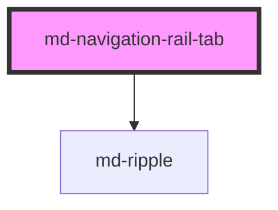

# md-navigation-rail-tab

<!-- llm:meta
tag: md-navigation-rail-tab
category: navigation
status: sub-component
parent: md-navigation-rail
standalone: false
m3-guidelines: https://m3.material.io/components/navigation-rail/guidelines
form-associated: false
depends-on: md-ripple
used-by: none
accepts-children: md-menu
-->

**One destination in a `md-navigation-rail`.** Icon, label, active indicator,
optional badge, a stable `value` for routing, and an optional dropdown.

> 🧩 **Sub-component.** Only valid inside `md-navigation-rail`, which owns the
> active index, expansion state and roving focus.

---

## When to use

- One destination inside a `md-navigation-rail` — that parent owns selection,
  label visibility, the expand/collapse state and keyboard movement for every
  destination it contains.

## When NOT to use

| Situation | Use instead |
|---|---|
| A destination in a bottom bar | `md-navigation-tab` |
| A view tab within a screen | `md-tab` |
| A mode toggle | `md-segmented-button` |
| A menu row | `md-menu-item` |
| An action | `md-button` / `md-icon-button` / `md-fab` |

## Decision cues

| Need | Setting |
|---|---|
| Stable routing key | `value` |
| Real anchor semantics | `href` (+ `target`) |
| Unread dot | `badge` |
| Unread count | `badge-value` |
| Custom glyph | the `icon` slot |
| Sub-destinations under one entry | a `md-menu` in the `submenu` slot |
| Label policy for this tab | `label-visibility` (normally inherited) |

## API contract

```html
<md-navigation-rail>
  <md-navigation-rail-tab
    icon="folder"
    label="Files"
    value="files"
    badge
    badge-value="4"
    href="/files"
    target="_self"
    active
    disabled
    label-visibility="all|selected|none"  <!-- default: all; set by the rail -->
    expanded                              <!-- set by the rail -->
    density="-1|-2|-3|-4"                 <!-- default: 0 (uncompacted) -->
  ></md-navigation-rail-tab>
</md-navigation-rail>
```

**Events** — both bubble and are composed.

| Event | Detail | Fires |
|---|---|---|
| `mdTabClick` | `{ value }` | Activation (click / `Enter` / `Space`), or a row chosen in the slotted `submenu`. The rail consumes it to move `active-index`. |
| `mdSubmenuToggle` | `{ open }` | The slotted `submenu` menu opens or closes. It exists because `md-menu`'s own `mdOpen` / `mdClose` neither bubble nor compose, so the rail listens for this instead. |

**Method** — `clearSubmenuSelection()` — unmarks whatever row this
destination's dropdown had selected. The rail calls it when another destination
becomes active; call it yourself only if you drive selection manually.

**Slots** — `icon` (replaces the `icon` prop), `submenu` (a `md-menu` that
turns this destination into a disclosure).

**Parts** — `indicator`, `state-layer`, `icon-wrapper`, `icon`, `label`,
`badge` (plus the modifier part `badge-dot` or `badge-large`), `caret`, and
`anchor` (the internal `<a>`, only when `href` is set).

### Behavioral contract worth knowing

- **`active`, `expanded` and `label-visibility` are rail-managed.** The rail
  writes them on every sync, so setting them by hand does not survive —
  especially `expanded`, which drives the expand/collapse icon glide.
- **`value` is the routing key.** The rail's `mdTabChange` reports it, and it is
  stabler than an index when destinations change.
- Unlike `md-navigation-tab`, there is **no `active-icon`** — the active state
  is carried by the indicator pill and colour, not a glyph swap.
- `badge` alone renders the dot; `badge-value` renders the large capsule (with
  or without `badge`). A numeric `badge-value` above 999 renders `999+`; the cap
  is fixed — there is no `badge-max` here.
- The badge is announced: it is a `role="status"` with an `aria-label` of
  `"<value> new notifications"` / `"new notifications"`.
- **`href` renders a real `<a>`** (the `anchor` part) that fills the tab. The
  host takes `role="link"` and `aria-current="page"` when active, and the
  anchor itself is `aria-hidden` / `tabindex="-1"` so it is not a second stop.
  Don't wrap the tab in your own `<a>`.
- The URL is sanitized: an unsafe scheme (`javascript:` and friends) renders no
  anchor and the host stays `role="tab"`. `disabled` also suppresses link mode.
- Because a link destination cannot be a `tab`, **one `href` anywhere in the
  rail makes the rail drop the `tablist` role** from its destinations region.
- A slotted `submenu` makes this destination a **disclosure**: clicking or
  pressing `Enter` / `Space` opens the dropdown instead of activating. The tab
  gains `aria-haspopup="menu"`, `aria-expanded`, and a caret next to the label.
  It also gives itself an `id` if it has none and points the menu's `anchor` at
  it, defaulting `placement` to `bottom-start` when you did not set one.
- Choosing a row in that dropdown marks the row `selected` (clearing its
  siblings) and emits `mdTabClick`, which is what makes this destination the
  current one.
- `disabled` sets `tabindex="-1"`, blocks activation and stops the click with
  `stopImmediatePropagation()`.
- In development the tab logs a console warning when it has neither `label` nor
  `aria-label` / `aria-labelledby`.
- The expand/collapse icon glide is skipped under
  `prefers-reduced-motion: reduce`.

---

## Do / Don't

Sourced from [M3 · Navigation rail · Guidelines](https://m3.material.io/components/navigation-rail/guidelines).

| ✅ Do | ❌ Don't |
|---|---|
| Write clear, concise labels naming the destination | Don't truncate or show an ellipsis instead of the label |
| Let a long label wrap to two lines if needed | Don't reduce the type size to fit more characters |
| Give every tab a stable `value` | Don't rely on index position for routing |
| Let the rail own the active indicator | Don't mark more than one tab active |
| Use `href` for real destinations | Don't wrap the tab in an anchor |
| Use `badge` for genuinely new items | Don't ship a permanent badge |
| Put sub-*destinations* in the `submenu` dropdown | Don't put commands (Cut, Copy, Export) there |
| Keep icons recognisable | Don't use ambiguous glyphs with `label-visibility="none"` |

## Patterns

```html
<md-navigation-rail id="rail" active-index="0" label="Main navigation">
  <md-navigation-rail-tab icon="home"     label="Home"     value="home"></md-navigation-rail-tab>
  <md-navigation-rail-tab icon="folder"   label="Files"    value="files" badge-value="4"></md-navigation-rail-tab>
  <md-navigation-rail-tab icon="settings" label="Settings" value="settings" href="/settings"></md-navigation-rail-tab>
</md-navigation-rail>

<script type="module">
  const rail = document.getElementById('rail');
  rail.addEventListener('mdTabChange', (e) => router.go(e.detail.value));  // listen on the RAIL
</script>
```

```html
<!-- Custom glyph -->
<md-navigation-rail-tab label="Saved" value="saved">
  <svg slot="icon" viewBox="0 0 24 24" width="24" height="24" fill="currentColor">…</svg>
</md-navigation-rail-tab>
```

```html
<!-- A destination that discloses sub-destinations instead of navigating -->
<md-navigation-rail-tab icon="bar_chart" label="Reports" value="reports">
  <md-menu slot="submenu" variant="vibrant">
    <md-menu-item headline="Usage"></md-menu-item>
    <md-menu-item headline="Revenue"></md-menu-item>
  </md-menu>
</md-navigation-rail-tab>
```

## Anti-patterns

| ❌ Wrong | ✅ Right | Why |
|---|---|---|
| Setting `expanded` yourself | The rail toggles it | You would desync the expand transition. |
| Setting `active` on tabs | Use the rail's `active-index` | The rail rewrites it on every sync. |
| Listening for `mdTabClick` to route | Use the rail's `mdTabChange` | `mdTabClick` also fires for a re-click and for submenu rows. |
| Routing on the index | Route on `value` | Indices shift. |
| Looking for `active-icon` | Not available here | The indicator conveys the state. |
| Looking for `badge-max` | Not available here | The cap is fixed at `999+`. |
| Assuming `badge-value` needs `badge` | Either alone works | `badge` = dot, `badge-value` = capsule. |
| Wrapping in `<a>` | Use `href` | Nested interactive controls; the tab renders its own anchor. |
| Expecting a click to navigate when a `submenu` is slotted | Route from the chosen menu row | A destination with a dropdown discloses; it does not activate on click. |
| Setting `anchor` / `placement` on the slotted `md-menu` and expecting them kept | Leave `anchor` alone; set `placement` only if you want a non-default one | The tab overwrites `anchor` and only fills `placement` when it is absent. |
| `label-visibility="none"` with an ambiguous icon | Keep labels, or pick a clearer glyph | Unlabelled destinations are guesswork. |
| `md-navigation-tab` in a rail | This component | Different geometry and API. |

## Accessibility, RTL, density, i18n

**Accessibility**
- The parent rail supplies the `navigation` landmark and roving focus; this tab
  is one stop, `role="tab"` normally and `role="link"` in link mode.
- `label` is the accessible name. With `label-visibility="none"` the label is
  still needed by assistive tech — never drop the prop just because it is not
  painted. In link mode the label is carried on the host as `aria-label`,
  because the visible copy lives inside the `aria-hidden` anchor.
- The badge is exposed as `role="status"`, so its count is already announced.
- `disabled` announces `aria-disabled="true"` and leaves the tab order.
- A destination with a dropdown carries `aria-haspopup="menu"` and
  `aria-expanded`, and shows a caret so it does not look identical to one that
  navigates.
- The focus ring is drawn around the indicator pill so it is not clipped by the
  rail's rounded corners.

**RTL** — the rail sits on the leading edge and the tab's internals use logical
properties, so they mirror under `dir="rtl"`.

**Density** — `density="-1…-4"` shrinks the indicator pill, glyph and gaps.
Rung `0` is the uncompacted default and is inert. Normally set the rung on the
rail (or a global `data-density` ancestor) and let it inherit; keep the target
≥48px on touch-capable machines.

**i18n** — translate `label`. Two-line wrapping is allowed by M3, truncation is
not; keep `value` untranslated.

## Related components

`md-navigation-rail` · `md-navigation-tab` · `md-tab` · `md-menu` ·
`md-badge` · `md-fab` · `md-ripple`

## Theming

| Custom property | Purpose | Default |
|---|---|---|
| `--md-navigation-rail-tab-icon-color` | Glyph when inactive | `--md-sys-color-on-surface-variant` |
| `--md-navigation-rail-tab-active-icon-color` | Glyph when active | `--md-sys-color-on-secondary-container` |
| `--md-navigation-rail-tab-label-color` | Label when inactive | `--md-sys-color-on-surface-variant` |
| `--md-navigation-rail-tab-active-label-color` | Label when active | `--md-sys-color-secondary` |
| `--md-navigation-rail-tab-indicator-color` | Active pill fill | `--md-sys-color-secondary-container` |
| `--md-navigation-rail-tab-indicator-shape` | Active pill radius | `--md-sys-shape-corner-full` |
| `--md-navigation-rail-tab-indicator-width` | Active pill width | `56px` (tapers 4px/rung, floor 40px) |
| `--md-navigation-rail-tab-indicator-height` | Active pill height | `32px` (tapers 2px/rung, floor 24px) |
| `--md-navigation-rail-tab-icon-size` | Glyph size | `24px` (tapers 1px/rung, floor 18px) |
| `--md-navigation-rail-tab-min-height` | Destination min height | `56px` |
| `--md-navigation-rail-tab-badge-color` | Badge background | `--md-sys-color-error` |
| `--md-navigation-rail-tab-badge-content-color` | Badge text | `--md-sys-color-on-error` |
| `--md-navigation-rail-tab-state-layer-color` | Hover / focus / press tint | `--md-sys-color-on-secondary-container` |
| `--md-navigation-rail-tab-focus-state-layer-opacity` | Focus tint opacity | `0.10` |
| `--md-navigation-rail-tab-press-state-layer-opacity` | Pressed tint opacity | `0.10` |
| `--md-navigation-rail-tab-focus-ring-color` | Focus outline | `--md-sys-color-secondary` |
| `--md-navigation-rail-tab-caret-duration` | Caret rotation duration | `--md-sys-motion-duration-medium2` (300ms) |

**CSS parts** — `indicator`, `state-layer`, `icon-wrapper`, `icon`, `label`,
`badge`, `badge-dot`, `badge-large`, `caret`, `anchor`.

```css
md-navigation-rail-tab {
  --md-navigation-rail-tab-indicator-color: var(--md-sys-color-primary-container);
  --md-navigation-rail-tab-active-icon-color: var(--md-sys-color-on-primary-container);
}
```

<!-- Auto Generated Below -->


## Overview

Material Design 3 — Navigation Rail Destination (Tab)

A single destination within a `<md-navigation-rail>`. Renders the MD3
active-indicator pill (56×32) around the icon, with an optional label
underneath (or inline when the parent rail is expanded). Supports badges,
disabled state, link mode (`href`) and slotted custom icons.

Spec:
  - https://m3.material.io/components/navigation-rail/specs
  - https://m3.material.io/components/navigation-rail/guidelines
  - https://m3.material.io/components/navigation-rail/accessibility

## Properties

| Property          | Attribute          | Description                                                                                                                                                                                           | Type                            | Default |
| ----------------- | ------------------ | ----------------------------------------------------------------------------------------------------------------------------------------------------------------------------------------------------- | ------------------------------- | ------- |
| `active`          | `active`           | Active / selected state. Reflected. Managed by `<md-navigation-rail>`.                                                                                                                                | `boolean`                       | `false` |
| `badge`           | `badge`            | Show a small dot badge (notification indicator).                                                                                                                                                      | `boolean`                       | `false` |
| `badgeValue`      | `badge-value`      | Numeric / textual badge value (renders large badge).                                                                                                                                                  | `string`                        | `''`    |
| `density`         | `density`          | Local density rung. Drives the same `--md-sys-density-scale` signal that a global `data-density` ancestor sets, so a local value simply overrides the inherited one. 0 = default, -4 = ultra-compact. | `-1 \| -2 \| -3 \| -4 \| 0`     | `0`     |
| `disabled`        | `disabled`         | Disabled — destination cannot be activated and is removed from tab order.                                                                                                                             | `boolean`                       | `false` |
| `expanded`        | `expanded`         | True when the parent rail is expanded; managed by the parent.                                                                                                                                         | `boolean`                       | `false` |
| `href`            | `href`             | When set, the tab is rendered as a link (anchor) with the given href. Activates link semantics (uses `aria-current="page"` when active).                                                              | `string`                        | `''`    |
| `icon`            | `icon`             | Material Symbols Outlined icon name (shorthand). Ignored when the `icon` slot is filled.                                                                                                              | `string`                        | `''`    |
| `label`           | `label`            | Visible text label. Recommended for all destinations (MD3 a11y).                                                                                                                                      | `string`                        | `''`    |
| `labelVisibility` | `label-visibility` | Controls label visibility. Usually set automatically by the parent `<md-navigation-rail>` based on its `label-visibility` prop.                                                                       | `"all" \| "none" \| "selected"` | `'all'` |
| `target`          | `target`           | Optional target for the link (when `href` is set).                                                                                                                                                    | `string`                        | `''`    |
| `value`           | `value`            | Optional value emitted alongside `mdTabClick`.                                                                                                                                                        | `string`                        | `''`    |


## Events

| Event             | Description                                                                                                                                                                                                                                                              | Type                                |
| ----------------- | ------------------------------------------------------------------------------------------------------------------------------------------------------------------------------------------------------------------------------------------------------------------------ | ----------------------------------- |
| `mdSubmenuToggle` | Fired when this destination's slotted dropdown opens or closes. `md-menu`'s own `mdOpen` / `mdClose` are deliberately non-bubbling and non-composed, so the rail has no way to hear them — this is the signal it listens for (it lifts its stacking context so the fixed-position menu is not trapped). | `CustomEvent<{ open: boolean; }>`   |
| `mdTabClick`      | Fired when the user activates the destination (click / Enter / Space).                                                                                                                                                                                                     | `CustomEvent<{ value: string; }>`   |


## Methods

### `clearSubmenuSelection() => Promise<void>`

Drop whatever row this destination's dropdown had marked as chosen.

The rail calls this when a *different* destination becomes active. Without
it the bar ends up with two highlighted destinations: the newly active one,
and the one still wearing the child-selected pill because its menu row was
never unmarked.

#### Returns

Type: `Promise<void>`


## Shadow Parts

| Part             | Description |
| ---------------- | ----------- |
| `"anchor"`       |             |
| `"badge"`        |             |
| `"badge-dot"`    |             |
| `"badge-large"`  |             |
| `"caret"`        |             |
| `"icon"`         |             |
| `"icon-wrapper"` |             |
| `"indicator"`    |             |
| `"label"`        |             |
| `"state-layer"`  |             |


## Dependencies

### Depends on

- [md-ripple](../md-ripple)

### Graph


----------------------------------------------

*Built with [StencilJS](https://stenciljs.com/)*
