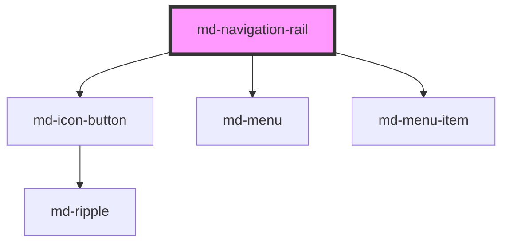

# md-navigation-rail

<!-- llm:meta
tag: md-navigation-rail
category: navigation
status: md3-mapped
m3-guidelines: https://m3.material.io/components/navigation-rail/guidelines
form-associated: false
depends-on: md-icon-button, md-menu, md-menu-item
used-by: none
accepts-children: md-navigation-rail-tab
-->

**Top-level destinations on a large screen.** A rail that can expand to a
labelled drawer, host a FAB and a logo, and optionally float modally — laid out
**vertically** (the M3 default) or **horizontally** as a top-of-page
application bar.

> Setup, theming, density and i18n are configured once for the whole library.
> Quick start: `import '@awc-ui/core/define';`

---

## When to use

- Top-level destinations (3–7) on **desktop / large** layouts.
- A persistent navigation surface that can collapse to icons and expand to
  labels (`expandable`).
- Navigation that hosts a primary action (FAB) at the top.
- A top-of-page **application bar** — brand, destinations, account — via
  `orientation="horizontal"`.

## When NOT to use

| Situation | Use instead |
|---|---|
| Compact / mobile layouts | `md-navigation-bar`, docked to the bottom |
| Sibling views inside one screen | `md-tabs` |
| A title bar with page actions (back, search, overflow) | `md-app-bar` — a horizontal rail carries *destinations*, not page actions |
| A temporary set of commands | `md-menu` |
| Supplementary panel content | `md-side-sheet` |
| A linear flow | `md-stepper` |

## Decision cues

| Need | Setting |
|---|---|
| Icons with labels underneath | `variant="standard"` (default) |
| Expanded drawer look | `variant="expanded"` |
| User can toggle between them | `expandable` (+ `toggle-label`) |
| Expanded rail floats over the content | `modal` |
| Rail spans the viewport height | `full-height` |
| Push destinations down/centre | `alignment="middle"` / `"bottom"` |
| Show labels only for the active item | `label-visibility="selected"` |
| Your own focus handling | `disable-focus-management` |
| A top-of-page bar instead of a side rail | `orientation="horizontal"` |
| Too many destinations for the width | `max-visible="N"` (+ `overflow-label`, `overflow-icon`) |
| A destination that opens a dropdown | `md-menu` in the tab's `submenu` slot |
| Brand at the leading edge | `slot="logo"` (+ `slot="logo-expanded"`) |
| Signed-in user at the trailing edge | `slot="footer"` |

**Choosing an orientation**

| Window | Use |
|---|---|
| Compact (< 600px) | `md-navigation-bar`, docked to the bottom |
| Medium / expanded, content is wide (tables, canvases, editors) | `orientation="horizontal"` — a bar spends height, not the width the content wants |
| Medium / expanded, content is narrow or reading-width | `orientation="vertical"` (default) — the M3 rail |

## API contract

```html
<md-navigation-rail
  orientation="vertical|horizontal"   <!-- default: vertical -->
  variant="standard|expanded"         <!-- default: standard -->
  expandable
  toggle-label="Toggle navigation"    <!-- default: "Toggle navigation" -->
  modal
  full-height
  alignment="top|middle|bottom"       <!-- default: top -->
  label-visibility="all|selected|none"<!-- default: all -->
  active-index="0"                    <!-- default: -1 (nothing selected) -->
  label="Main navigation"             <!-- default: "Navigation" -->
  max-visible="5"                     <!-- default: unset (no overflow) -->
  overflow-label="More"               <!-- default: "More" -->
  overflow-icon="more_horiz"          <!-- default: more_horiz -->
  disable-focus-management
  density="-1|-2|-3|-4"               <!-- default: 0 (uncompacted) -->
>
  
  
  <md-fab slot="fab" icon="add" label="Create"></md-fab>

  <md-navigation-rail-tab icon="home"   label="Home"   value="home"></md-navigation-rail-tab>
  <md-navigation-rail-tab icon="search" label="Search" value="search"></md-navigation-rail-tab>

  <div slot="footer">…</div>
</md-navigation-rail>
```

**Events** — `mdTabChange` `{ index, value }`, `mdExpand` (no detail),
`mdCollapse` (no detail). All bubble and are composed.

**Methods** — `expand()`, `collapse()`, `toggle()`, `focusTab(index)`.

**Slots** — the default slot (destinations: `md-navigation-rail-tab`
children), `logo`, `logo-expanded`, `header`, `fab`, `footer`.

**Parts** — `scrim`, `container`, `logo`, `logo-contracted`, `logo-expanded`,
`toggle`, `header`, `fab`, `destinations`, `overflow`, `overflow-trigger`,
`footer`.

### Behavioral contract worth knowing

- **`active-index` defaults to `-1`** — nothing selected. Either set it, or mark
  one child with the `active` attribute: on first load (and only while
  `active-index` is still negative) the rail adopts that child's index.
- `mdTabChange` fires **only when the index actually moves**. Re-activating the
  current destination replays the ripple and emits nothing.
- `mdTabChange` carries both `index` and `value`; `value` comes from the child's
  `value` prop and is the stabler key for routing.
- The rail writes `active`, `label-visibility`, `expanded`, `data-orientation`
  and `tabindex` onto every destination on each sync. Setting those on a child
  yourself does not survive.
- A `md-fab` in the `fab` slot is **morphed by the rail**: it sets the FAB's
  `extended` property from the rail's expanded state. Don't pin `extended`
  yourself.
- `expand()` / `collapse()` / `toggle()` change `variant`, which is what emits
  `mdExpand` / `mdCollapse` — so setting `variant` directly emits them too.
- **`expandable` is ignored while `orientation="horizontal"`** — a bar has
  nowhere to grow, so no toggle button is rendered.
- **`modal` is a presentation mode, not a dialog.** Expanded, the rail's
  container becomes an absolutely-positioned overlay with a 32%-opacity scrim,
  while the host keeps its collapsed 80px footprint so the page never reflows.
  `Escape` and a scrim click collapse it, and focus returns to the **built-in**
  toggle button — which is only rendered when `expandable` is also set on a
  vertical rail. A `modal` rail driven from your own control in the `header`
  slot leaves focus on `<body>` after a dismiss, so restore it yourself from
  `mdCollapse`. It
  does **not** trap focus and does not make the page inert — the scrim is
  positioned against the rail's nearest positioned ancestor, so that ancestor
  needs `position: relative`.
- `full-height` switches the rail from filling its container to `100dvh`.
- With `max-visible="N"`, destinations past N get `data-overflowed` and move
  into a menu behind an overflow trigger. Overflowed destinations are skipped by
  the arrow keys, exactly like disabled ones, and choosing one from the menu
  still activates it and emits `mdTabChange`.
- The **overflow trigger is a `button` with `aria-haspopup="menu"`, deliberately
  outside the `tablist`** — a tablist may only contain tabs.
- **If any destination sets `href`, the destinations container drops its
  `tablist` role** (and its `aria-orientation`), because a tablist may only
  contain `tab` children. It stays inside the `navigation` landmark.
- A destination with a slotted `submenu` is a **disclosure, not a target**:
  activating it opens the dropdown instead of selecting. Choosing a *row* is
  what selects the destination — that emits `mdTabChange` and clears any row
  chosen in another destination's dropdown, so two destinations never read as
  current at once.
- The rail drops its `isolation: isolate` while **any** slotted `md-menu` is
  open (a destination's dropdown, or an account menu in the `footer`);
  otherwise the fixed-position menu would be trapped in the rail's stacking
  context and painted over.
- Keyboard: `ArrowUp` / `ArrowDown` always move between destinations;
  `ArrowLeft` / `ArrowRight` do too, following the writing direction when
  `orientation="horizontal"`. `Home` / `End` jump to the ends, and movement
  wraps. Focus moves without selecting — `Enter` / `Space` on a destination is
  what activates it.
- `disable-focus-management` turns off the roving tabindex and the arrow keys
  entirely; you own keyboard navigation from that point.

---

## Do / Don't

Sourced from [M3 · Navigation rail · Guidelines](https://m3.material.io/components/navigation-rail/guidelines).
The horizontal layout is this library's extension, so the rows about it are
house rules.

| ✅ Do | ❌ Don't |
|---|---|
| Keep 3–7 destinations; cap the rest with `max-visible` | Don't let destinations squeeze until labels truncate |
| Reach for `orientation="horizontal"` only on wide layouts, where a side rail would spend width the content wants | Don't ship a horizontal rail on compact — that's `md-navigation-bar`, at the bottom |
| Keep a horizontal rail to *destinations* | Don't fill it with page actions — that's `md-app-bar` |
| Ship one top-level navigation surface per screen | Don't stack a rail above an app bar that also navigates |
| Place the FAB at the **top** of the rail | Avoid placing the FAB below the navigation items |
| Use the active indicator for the one current page | Don't indicate more than one item at a time |
| Slot a `md-menu` into `submenu` for sub-*destinations* | Don't put commands (Cut, Copy, Export) in a destination's dropdown |
| Write clear, concise labels describing the destination | Don't truncate or show an ellipsis in place of label text |
| Break a longer phrase into two lines if needed | Don't reduce the type size to fit more characters |
| Be careful with logos in the rail | Don't place a logo where it reads as an action or destination |
| Use a rail on desktop, a bar on compact | Don't ship a bar on desktop |

---

## Patterns

```html
<md-navigation-rail id="rail" expandable full-height active-index="0" label="Main navigation">
  
  <md-fab slot="fab" icon="add" label="Create"></md-fab>

  <md-navigation-rail-tab icon="home"     label="Home"     value="home"></md-navigation-rail-tab>
  <md-navigation-rail-tab icon="folder"   label="Files"    value="files"></md-navigation-rail-tab>
  <md-navigation-rail-tab icon="settings" label="Settings" value="settings"></md-navigation-rail-tab>
</md-navigation-rail>

<script type="module">
  const rail = document.getElementById('rail');
  rail.addEventListener('mdTabChange', (e) => router.go(e.detail.value));  // prefer value
  rail.addEventListener('mdExpand',   () => localStorage.setItem('railExpanded', '1'));
  rail.addEventListener('mdCollapse', () => localStorage.removeItem('railExpanded'));
</script>
```

```html
<!-- Modal rail: the overlay is positioned against the nearest positioned
     ancestor, so give the layout `position: relative`. -->
<div style="position: relative; display: flex; min-block-size: 100dvh;">
  <md-navigation-rail id="modal-rail" modal expandable label="Main navigation">
    <md-navigation-rail-tab icon="home"   label="Home"   value="home"></md-navigation-rail-tab>
    <md-navigation-rail-tab icon="folder" label="Files"  value="files"></md-navigation-rail-tab>
  </md-navigation-rail>
  <main>…</main>
</div>
```

```html
<!-- Destinations pushed to the middle, utilities in the footer -->
<md-navigation-rail alignment="middle" label="Main navigation">
  <md-navigation-rail-tab icon="home"  label="Home"  value="home"></md-navigation-rail-tab>
  <md-navigation-rail-tab icon="inbox" label="Inbox" value="inbox"></md-navigation-rail-tab>
  <div slot="footer">
    <md-icon-button icon="help" aria-label="Help"></md-icon-button>
  </div>
</md-navigation-rail>
```

```html
<!-- Application bar: brand leads, destinations take the middle, account trails -->
<md-navigation-rail orientation="horizontal" label="Main navigation" active-index="0">
  <span slot="logo">…brand…</span>

  <md-navigation-rail-tab icon="home"      label="Home"      value="home"></md-navigation-rail-tab>
  <md-navigation-rail-tab icon="dashboard" label="Dashboard" value="dashboard"></md-navigation-rail-tab>

  <!-- A destination that discloses instead of navigating -->
  <md-navigation-rail-tab icon="bar_chart" label="Reports" value="reports">
    <md-menu slot="submenu" variant="vibrant">
      <md-menu-item headline="Usage"></md-menu-item>
      <md-menu-item headline="Revenue"></md-menu-item>
    </md-menu>
  </md-navigation-rail-tab>

  <div slot="footer">
    <md-icon-button id="account" size="md" aria-haspopup="menu" aria-label="Account">
      <md-avatar name="Ada Lovelace" initials="AL" size="40px"></md-avatar>
    </md-icon-button>
    <md-menu id="account-menu" anchor="account" placement="bottom-end" variant="vibrant">
      <md-menu-item headline="Profile"></md-menu-item>
      <md-menu-item headline="Sign out"></md-menu-item>
    </md-menu>
  </div>
</md-navigation-rail>

<script type="module">
  document.getElementById('account').addEventListener('click', () => {
    document.getElementById('account-menu').show();
  });
</script>
```

```html
<!-- Overflow: keep four in the bar, collapse the rest into a menu -->
<md-navigation-rail orientation="horizontal" max-visible="4" overflow-label="More"
                    label="Main navigation">
  <md-navigation-rail-tab icon="home"      label="Home"      value="home"></md-navigation-rail-tab>
  <md-navigation-rail-tab icon="dashboard" label="Dashboard" value="dashboard"></md-navigation-rail-tab>
  <md-navigation-rail-tab icon="folder"    label="Files"     value="files"></md-navigation-rail-tab>
  <md-navigation-rail-tab icon="group"     label="Team"      value="team"></md-navigation-rail-tab>
  <md-navigation-rail-tab icon="settings"  label="Settings"  value="settings"></md-navigation-rail-tab>
</md-navigation-rail>
```

## Anti-patterns

| ❌ Wrong | ✅ Right | Why |
|---|---|---|
| Leaving `active-index` at `-1` | Set it, or mark one child `active` | The default is "nothing selected". |
| Routing on `detail.index` | Route on `detail.value` | Indices shift when destinations change. |
| Waiting for `mdTabChange` when the user re-clicks the current destination | Don't — it does not fire | The event is selection-*changed*, not activation. |
| Pinning `extended` on the slotted FAB | Let the rail morph it | The rail drives that transition. |
| A horizontal rail on compact | `md-navigation-bar` | M3: compact gets a bottom bar. |
| `expandable` on a horizontal rail | Drop it | Ignored — a bar cannot expand. |
| Routing off a click on a destination that owns a submenu | Route off `mdTabChange` | That click only opens the dropdown; choosing a row is the selection. |
| More destinations than fit, left to squeeze | `max-visible` | Overflow keeps the collapsed ones reachable and first-class. |
| `modal` used where a focus-trapping dialog is needed | `md-dialog`, or trap focus yourself | The modal rail dims and dismisses, but does not trap focus. |
| `modal` inside a `position: static` layout | Give the layout `position: relative` | The overlay and scrim are absolutely positioned against the nearest positioned ancestor. |
| FAB below the destinations | Top of the rail | M3 explicit rule. |
| A clickable logo that looks like a destination | Make it clearly distinct | M3 caution; the `logo` slot sits outside the `tablist`. |
| Truncated labels | Two lines, or shorter words | M3 explicit rule. |
| `disable-focus-management` without replacing it | Leave focus management on | You would ship a keyboard-inaccessible rail. |
| `md-navigation-tab` children | `md-navigation-rail-tab` | Different component; the rail only syncs its own tag. |

## Accessibility, RTL, density, i18n

**Accessibility**
- The host is a `navigation` landmark named by `label` — set it to something
  meaningful ("Main navigation"). It defaults to "Navigation".
- The destinations container is a `tablist` with `aria-orientation` matching
  `orientation`, unless a destination is a link — see the behavioral contract.
- The rail manages roving focus across destinations unless you set
  `disable-focus-management`, in which case it is entirely your responsibility.
- `modal` dims the page and dismisses on `Escape` / scrim click, returning
  focus to the toggle button. It does not trap focus — add a trap yourself if
  the interaction demands one.
- Exactly one destination is current; the rail clears the others, including a
  row chosen inside another destination's dropdown.
- The expand/collapse toggle carries `aria-expanded` and needs a localized
  `toggle-label`.
- A decorative logo should have empty `alt`; a meaningful one needs real text.
- The overflow trigger is a `button` with `aria-haspopup="menu"` and a
  localized `overflow-label`, kept outside the `tablist`.
- Anything in `logo` / `header` / `fab` / `footer` is outside the `tablist` —
  an account avatar needs its own accessible name (and `aria-haspopup="menu"`
  when it opens one).

**RTL** — the rail sits on the leading edge and all internals use logical
properties. In a horizontal rail the left/right arrow keys follow the writing
direction, so `ArrowRight` moves toward the start under `dir="rtl"`.

**Density** — `density="-1…-4"` narrows the rail (80 → 56px collapsed), tightens
the destination gap and the block padding. Rung `0` is the uncompacted default
and is inert. To opt a rail out of an inherited global `data-density` rung, set
`style="--md-sys-density-scale: 0"` on it.

**i18n** — translate destination labels, `label`, `toggle-label` and
`overflow-label`; keep each destination's `value` untranslated. Long labels can
wrap to two lines (M3 allows this) but must not truncate — check the expanded
width per locale.

## Related components

`md-navigation-rail-tab` · `md-navigation-bar` · `md-tabs` · `md-fab` ·
`md-side-sheet` · `md-app-bar` · `md-menu` · `md-icon-button`

## Theming

| Custom property | Purpose | Default |
|---|---|---|
| `--md-navigation-rail-container-color` | Rail background | `--md-sys-color-surface` (`surface-container` when `modal` and expanded) |
| `--md-navigation-rail-content-color` | Default foreground | `--md-sys-color-on-surface-variant` |
| `--md-navigation-rail-container-width` | Collapsed width | `80px` (tapers 4px/rung, floor 56px) |
| `--md-navigation-rail-expanded-width` | Expanded width | `220px` (tapers 20px/rung, floor 140px) |
| `--md-navigation-rail-expanded-max-width` | Expanded width cap | `360px` |
| `--md-navigation-rail-container-shape` | Corner radius | `0px` (`corner-large` when `modal` and expanded) |
| `--md-navigation-rail-container-elevation` | Box-shadow | `none` (`elevation-3` when `modal` and expanded) |
| `--md-navigation-rail-padding-block` | Block padding | `44px` (tapers 4px/rung, floor 24px) |
| `--md-navigation-rail-padding-inline` | Inline padding while collapsed | `0px` — the expanded rail hard-codes a 12px inset and ignores this |
| `--md-navigation-rail-gap` | Gap between sections | `--md-sys-spacing-gap-md` (12px) |
| `--md-navigation-rail-header-space` | Space under the header/FAB group | `40px` (tapers 4px/rung, floor 20px) |
| `--md-navigation-rail-destinations-gap` | Gap between destinations | `8px` (tapers 2px/rung, floor 0) |
| `--md-navigation-rail-logo-icon-size` | Brand glyph footprint in the logo slots | `24px` |
| `--md-navigation-rail-horizontal-height` | Bar height when `orientation="horizontal"` | `72px` (tapers 4px/rung, floor 64px) |
| `--md-navigation-rail-horizontal-padding-block` | Bar block gutter | `0px` (so a destination's ripple reaches the edges) |
| `--md-navigation-rail-horizontal-padding-inline` | Bar inline gutter | `--md-sys-spacing-inset-md` (12px) |

**CSS parts** — `scrim`, `container`, `logo`, `logo-contracted`,
`logo-expanded`, `toggle`, `header`, `fab`, `destinations`, `overflow`,
`overflow-trigger`, `footer`.

Destination appearance is themed with the `--md-navigation-rail-tab-*`
properties.

```css
md-navigation-rail.brand {
  --md-navigation-rail-container-color: var(--md-sys-color-surface-container);
  --md-navigation-rail-expanded-width: 280px;
}
```

<!-- Auto Generated Below -->


## Overview

Material Design 3 — Navigation Rail

A vertical navigation surface for the left or right edge of medium / large
window sizes. Holds 3–7 top-level destinations and optionally a header
(menu / brand), a FAB, and a footer.

Implements MD3 specs:
  - https://m3.material.io/components/navigation-rail/overview
  - https://m3.material.io/components/navigation-rail/specs
  - https://m3.material.io/components/navigation-rail/guidelines
  - https://m3.material.io/components/navigation-rail/accessibility

## Properties

| Property                 | Attribute                  | Description                                                                                                                                                                                                                                                                                                                                                                                   | Type                            | Default               |
| ------------------------ | -------------------------- | --------------------------------------------------------------------------------------------------------------------------------------------------------------------------------------------------------------------------------------------------------------------------------------------------------------------------------------------------------------------------------------------- | ------------------------------- | --------------------- |
| `activeIndex`            | `active-index`             | Index of the currently active destination. -1 means no destination is active. Two-way bound: updates when the user selects a destination and can be set externally to programmatically change the active destination.                                                                                                                                                                         | `number`                        | `-1`                  |
| `alignment`              | `alignment`                | Vertical alignment of destinations relative to the rail.                                                                                                                                                                                                                                                                                                                                      | `"bottom" \| "middle" \| "top"` | `'top'`               |
| `density`                | `density`                  | Local density rung. Drives the same `--md-sys-density-scale` signal that a global `data-density` ancestor sets, so a local value simply overrides the inherited one. 0 = default, -4 = ultra-compact.                                                                                                                                                                                         | `-1 \| -2 \| -3 \| -4 \| 0`     | `0`                   |
| `disableFocusManagement` | `disable-focus-management` | Set to `true` to disable focus management (roving tabindex + arrow keys). Use when embedding inside a custom focus management system.                                                                                                                                                                                                                                                         | `boolean`                       | `false`               |
| `expandable`             | `expandable`               | Render a built-in leading menu button that toggles between the collapsed (`standard`) and `expanded` variants. The icon animates between `menu` (collapsed) and `menu_open` (expanded) per the MD3 navigation rail figure. When you'd rather supply your own control, leave this `false` and place a button in the `header` slot wired to the `expand()` / `collapse()` / `toggle()` methods. | `boolean`                       | `false`               |
| `fullHeight`             | `full-height`              | Stretch the rail to the full viewport height (`100dvh`) instead of filling its parent container. Opt-in: by default the rail fills whatever height its container gives it (`100%`), which keeps it embeddable in split-pane / nested / modal-docked layouts. Set this when the rail is the app's top-level side navigation and should always span the screen.                                 | `boolean`                       | `false`               |
| `label`                  | `label`                    | Accessible name announced for the rail's `navigation` landmark. Required for screen reader users (WAI-ARIA APG / WCAG 2.4.1).                                                                                                                                                                                                                                                                 | `string`                        | `'Navigation'`        |
| `labelVisibility`        | `label-visibility`         | Controls whether destination labels are shown.  - `all`: every destination shows its label (default — recommended by MD3 for 3–7 destinations)  - `selected`: only the active destination shows its label  - `none`: icons only                                                                                                                                                               | `"all" \| "none" \| "selected"` | `'all'`               |
| `maxVisible`             | `max-visible`              | Cap on how many destinations stay in the rail. Any beyond it collapse into an overflow trigger that opens a menu of the rest; choosing one activates that destination. Leave unset for no overflow. The trigger is a `button` with `aria-haspopup="menu"`, deliberately OUTSIDE the `tablist`.                                                                                                  | `number \| undefined`           | `undefined`           |
| `modal`                  | `modal`                    | Modal styling for the expanded variant per spec: `surface-container` background, level-3 elevation, large corner shape. Use when the expanded rail floats over content instead of being docked. The rail renders its own overlay container **and its own 32%-opacity scrim** (clicking it collapses the rail), positioned against the nearest positioned ancestor. No effect while collapsed.                                                                                                       | `boolean`                       | `false`               |
| `orientation`            | `orientation`              | Layout axis. `vertical` is the M3 rail on the leading edge; `horizontal` lays the same parts out as a top-of-page bar (logo leading, destinations in a row, FAB and footer trailing). The expand/collapse affordance is vertical-only, so `expandable` is ignored while horizontal.                                                                                                             | `"horizontal" \| "vertical"`    | `'vertical'`          |
| `overflowIcon`           | `overflow-icon`            | Material Symbols ligature for the overflow trigger.                                                                                                                                                                                                                                                                                                                                          | `string`                        | `'more_horiz'`        |
| `overflowLabel`          | `overflow-label`           | Accessible name and label for the overflow trigger. Localize per page.                                                                                                                                                                                                                                                                                                                       | `string`                        | `'More'`              |
| `toggleLabel`            | `toggle-label`             | Accessible label for the built-in toggle button (only rendered when `expandable` is set). Announced to assistive tech as the button's name.                                                                                                                                                                                                                                                   | `string`                        | `'Toggle navigation'` |
| `variant`                | `variant`                  | Visual variant — `standard` (the spec's *collapsed* rail: 80px wide, stacked icon + label) or `expanded` (icons + label inline, 220–360px wide).                                                                                                                                                                                                                                              | `"expanded" \| "standard"`      | `'standard'`          |


## Events

| Event         | Description                                                  | Type                                             |
| ------------- | ------------------------------------------------------------ | ------------------------------------------------ |
| `mdCollapse`  | Emitted when the rail transitions from expanded → collapsed. | `CustomEvent<void>`                              |
| `mdExpand`    | Emitted when the rail transitions from collapsed → expanded. | `CustomEvent<void>`                              |
| `mdTabChange` | Emitted when the user selects a destination.                 | `CustomEvent<{ index: number; value: string; }>` |


## Methods

### `collapse() => Promise<void>`

Programmatically collapse the rail (standard 80px width).

#### Returns

Type: `Promise<void>`


### `expand() => Promise<void>`

Programmatically expand the rail (shows labels inline with icons).

#### Returns

Type: `Promise<void>`


### `focusTab(index: number) => Promise<void>`

Move keyboard focus to the destination at `index`.

#### Parameters

| Name    | Type     | Description |
| ------- | -------- | ----------- |
| `index` | `number` |             |

#### Returns

Type: `Promise<void>`


### `toggle() => Promise<void>`

Toggle between expanded and standard.

#### Returns

Type: `Promise<void>`


## Shadow Parts

| Part                | Description |
| ------------------- | ----------- |
| `"container"`       |             |
| `"destinations"`    |             |
| `"fab"`             |             |
| `"footer"`          |             |
| `"header"`          |             |
| `"logo"`            |             |
| `"logo-contracted"` |             |
| `"logo-expanded"`   |             |
| `"overflow"`        |             |
| `"overflow-trigger"`|             |
| `"scrim"`           |             |
| `"toggle"`          |             |


## Dependencies

### Depends on

- [md-icon-button](../md-icon-button)
- [md-menu](../md-menu)
- [md-menu-item](../md-menu-item)

### Graph


----------------------------------------------

*Built with [StencilJS](https://stenciljs.com/)*
