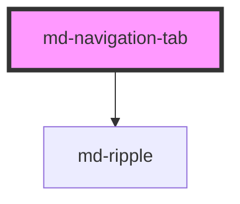

# md-navigation-tab

<!-- llm:meta
tag: md-navigation-tab
category: navigation
status: sub-component
parent: md-navigation-bar
standalone: false
m3-guidelines: https://m3.material.io/components/navigation-bar/guidelines
form-associated: false
depends-on: md-ripple
used-by: none
-->

**One destination in a `md-navigation-bar`.** Icon, label, active indicator,
and an optional badge, with optional URL navigation on activation.

> 🧩 **Sub-component.** Only valid inside `md-navigation-bar`, which owns the
> active index and roving focus.

---

## When to use

- One of the 3–5 destinations inside a `md-navigation-bar` — that parent owns
  selection, label policy and keyboard movement for every tab it contains.

## When NOT to use

| Situation | Use instead |
|---|---|
| A destination in a rail | `md-navigation-rail-tab` |
| A view tab inside a screen | `md-tab` |
| A mode toggle | `md-segmented-button` |
| A menu row | `md-menu-item` |
| An action | `md-button` / `md-icon-button` |

## Decision cues

| Need | Setting |
|---|---|
| Filled glyph when active (M3) | `active-icon` |
| Navigate to a URL on activation | `href` (+ `target`) |
| Unread dot | `badge` |
| Unread count | `badge-value` (+ `badge-max`) |
| Custom glyphs | `icon` / `active-icon` slots |
| Custom label markup | the default slot |
| Temporarily unavailable but discoverable | `soft-disabled` |

## API contract

```html
<md-navigation-bar>
  <md-navigation-tab
    label="Profile"
    icon="person"
    active-icon="person"
    badge
    badge-value="12"
    badge-max="999"                       <!-- default: 999; 0 disables the cap -->
    href="/profile"
    target="_self"
    active
    disabled
    soft-disabled
    label-behavior="always|selected|none" <!-- default: always; inherited from the bar -->
    density="-1|-2|-3|-4"                 <!-- default: 0 (uncompacted) -->
  ></md-navigation-tab>
</md-navigation-bar>
```

**Event** — `mdTabClick` `{ index }`, bubbles and is composed. The parent bar
consumes it and calls `stopPropagation()`, so it cannot be heard above the bar.

**Method** — `focusEl()` — focuses the host; a no-op while `disabled`.

**Slots** — the default slot (custom label markup, replaces `label`), `icon`,
`active-icon`.

**Parts** — `container`, `indicator`, `state-layer`, `icon-container`, `icon`,
`badge`, `label`.

### Behavioral contract worth knowing

- **`active` is managed by `md-navigation-bar`** via its `active-index`. The bar
  rewrites `active`, `tabindex` and `aria-selected` on every sync, so setting
  them by hand does not survive.
- The tab sets `role="tab"` on itself (unless you supplied a `role`), mirrors
  `active` into `aria-selected`, and mirrors `disabled` / `soft-disabled` into
  `aria-disabled`.
- `active-icon` is how you satisfy M3's filled-when-active requirement. With no
  `active-icon`, the same glyph shows in both states. The `icon` /
  `active-icon` **slots win over the props**.
- `badge` alone renders the small dot; `badge-value` renders the large capsule
  (with or without `badge`). Both absent → no badge.
- `badge-max` caps a **purely numeric** `badge-value`: `badge-value="1200"` with
  the default cap renders `999+`. `badge-max="0"` disables the cap; a
  non-numeric value like `"New"` is never capped.
- The badge is announced: it is a `role="status"` with an `aria-label` of
  `"<value> new"`, or `"New"` for the dot.
- **`href` does not render an anchor.** The host stays `role="tab"`; on
  activation the tab navigates itself — `window.location.assign()` normally, or
  `window.open(href, target, 'noopener,noreferrer')` when `target` is set.
  Unsafe schemes
  (`javascript:` and friends) are refused. There is no middle-click or
  open-in-new-tab affordance.
- For SPA routing, call `preventDefault()` on the native `click` (checked before
  the tab acts) or drop `href` and route from the bar's `mdChange`.
- `Enter` / `Space` trigger the ripple and then synthesize a click, so pointer
  and keyboard follow exactly one path.
- `disabled` and `soft-disabled` both block activation and stop the click from
  reaching the bar; `soft-disabled` stays keyboard-reachable so the destination
  can still be discovered.
- With `label-behavior="selected"` the label element is still rendered (so the
  row height never jumps), but on an **inactive** tab CSS hides it with
  `visibility: hidden`, which also removes it from the accessibility tree. The
  host mirrors `label` into `aria-label` **only** when `label-behavior="none"`,
  so **inactive tabs in `"selected"` mode have no accessible name at all.** If
  you need `"selected"`, put an explicit `aria-label` on every
  `md-navigation-tab` yourself. With `"none"` the label element is not rendered
  at all and `label` becomes the host's `aria-label` automatically.

---

## Do / Don't

Sourced from [M3 · Navigation bar · Guidelines](https://m3.material.io/components/navigation-bar/guidelines).

| ✅ Do | ❌ Don't |
|---|---|
| Always show the label | Don't remove labels from navigation items |
| Use a filled `active-icon` (or heavier weight) when active | Don't leave active and inactive glyphs identical |
| Keep labels brief and descriptive | Don't wrap, truncate, or shrink label text |
| Let the bar own the active indicator | Don't mark more than one destination active |
| Use `badge` for genuinely new items | Don't leave a permanent badge that never clears |
| Keep positions fixed | Don't reorder destinations dynamically |
| Give every destination a `label` | Don't ship an icon-only destination with no accessible name |

## Patterns

```html
<md-navigation-bar id="nav" aria-label="Main navigation">
  <md-navigation-tab label="Home"   icon="home"   active-icon="home"></md-navigation-tab>
  <md-navigation-tab label="Search" icon="search"></md-navigation-tab>
  <md-navigation-tab label="Inbox"  icon="inbox" badge-value="12" badge-max="99"></md-navigation-tab>
</md-navigation-bar>

<script type="module">
  const nav = document.getElementById('nav');
  nav.addEventListener('mdChange', (e) => go(e.detail.index));  // listen on the BAR
</script>
```

```html
<!-- Navigate on activation. Intercept the click for SPA routing. -->
<md-navigation-tab id="home" label="Home" icon="home" href="/"></md-navigation-tab>

<script type="module">
  document.getElementById('home').addEventListener('click', (e) => {
    e.preventDefault();       // stops the tab's own navigation
    router.push('/');
  });
</script>
```

```html
<!-- Custom glyphs and custom label markup -->
<md-navigation-tab>
  <svg slot="icon" viewBox="0 0 24 24" width="24" height="24" fill="currentColor">…</svg>
  <svg slot="active-icon" viewBox="0 0 24 24" width="24" height="24" fill="currentColor">…</svg>
  <span>Saved</span>
</md-navigation-tab>
```

```html
<!-- Re-tapping the current destination (scroll-to-top, pop-to-root):
     the bar emits no mdChange, so listen on the tab itself. -->
<md-navigation-tab id="home-tab" label="Home" icon="home"></md-navigation-tab>

<script type="module">
  document
    .getElementById('home-tab')
    .addEventListener('mdTabClick', (e) => scrollToTop(e.detail.index));
</script>
```

## Anti-patterns

| ❌ Wrong | ✅ Right | Why |
|---|---|---|
| Setting `active` on tabs yourself | Use the bar's `active-index` / `select()` | The bar overwrites it on every sync. |
| Listening for `mdTabClick` on an ancestor of the bar | Listen on the tab, or use the bar's `mdChange` | The bar calls `stopPropagation()`. |
| Assuming `badge-value` needs `badge` | Either alone works | `badge` = dot, `badge-value` = capsule. |
| No `active-icon` | Provide a filled variant | M3 requires an active-state difference. |
| Wrapping the tab in `<a href>` | Use `href` on the tab | Nested interactive controls; the host is already `role="tab"`. |
| Expecting `href` to give a real `<a>` (middle-click, "open in new tab") | Build the nav from real links instead | The tab navigates in script; it renders no anchor. |
| Hiding labels via `label-behavior` | Keep them visible | M3 explicit rule. |
| An icon-only tab with no `label` | Always set `label` | With `label-behavior="none"` the label becomes the `aria-label`. |
| `md-navigation-tab` in a rail | `md-navigation-rail-tab` | Different component. |
| `md-tab` used for a destination | This component | Different navigation level. |

## Accessibility, RTL, density, i18n

**Accessibility**
- The parent bar supplies the `navigation` landmark and roving focus; each tab
  is one stop with `role="tab"` and `aria-selected`.
- `label` is the accessible name — that is why M3 forbids hiding it, and why
  `label-behavior="none"` promotes it to `aria-label`.
- The badge is exposed as `role="status"` ("12 new" / "New"). Do not also
  duplicate the count into the label.
- `disabled` leaves the arrow-key tour; `soft-disabled` stays reachable and
  announces `aria-disabled="true"`.
- The state layer marks keyboard focus separately from hover, so focus stays
  visible for keyboard users.

**RTL** — order, indicator and badge placement use logical properties and
mirror under `dir="rtl"`.

**Density** — `density="-1…-4"` shrinks the indicator pill, glyph and paddings.
Rung `0` is the uncompacted default and is inert. Normally set the rung on the
bar (or a global `data-density` ancestor) and let it inherit; keep the tap
target ≥48px on touch.

**i18n** — translate `label`. Since truncation and shrinking are both forbidden,
long translations mean choosing shorter words.

## Related components

`md-navigation-bar` · `md-navigation-rail-tab` · `md-tab` · `md-badge` ·
`md-ripple`

## Theming

| Custom property | Purpose | Default |
|---|---|---|
| `--md-navigation-tab-active-indicator-color` | Active pill fill | `--md-sys-color-secondary-container` |
| `--md-navigation-tab-active-indicator-width` | Active pill width | `56px` (tapers 4px/rung, floor 40px) |
| `--md-navigation-tab-active-indicator-height` | Active pill height | `32px` (tapers 2px/rung, floor 24px) |
| `--md-navigation-tab-active-indicator-shape` | Active pill radius | `--md-sys-shape-corner-full` |
| `--md-navigation-tab-active-icon-color` | Glyph when active | `--md-sys-color-on-secondary-container` |
| `--md-navigation-tab-inactive-icon-color` | Glyph when inactive | `--md-sys-color-on-surface-variant` |
| `--md-navigation-tab-active-label-color` | Label when active | `--md-sys-color-on-surface` |
| `--md-navigation-tab-inactive-label-color` | Label when inactive | `--md-sys-color-on-surface-variant` |
| `--md-navigation-tab-label-font` | Label `font` shorthand | label-medium |
| `--md-navigation-tab-label-font-size` | Label size | `12px` (tapers 0.5px/rung, floor 10px) |
| `--md-navigation-tab-label-font-weight` | Active label weight | `600` |
| `--md-navigation-tab-icon-size` | Glyph size | `24px` (tapers 1px/rung, floor 18px) |
| `--md-navigation-tab-padding-block-start` / `-padding-block-end` | Vertical padding | `5px` (tapers 1px/rung) |
| `--md-navigation-tab-hover-state-layer-color` | Hover tint | `--md-sys-color-on-surface` |
| `--md-navigation-tab-focus-state-layer-color` | Focus tint | `--md-sys-color-on-surface` |
| `--md-navigation-tab-focus-state-layer-opacity` | Focus tint opacity | `0.1` |
| `--md-navigation-tab-pressed-state-layer-color` | Pressed tint | `--md-sys-color-on-surface` |
| `--md-navigation-tab-badge-color` | Badge background | `--md-sys-color-error` |
| `--md-navigation-tab-badge-on-color` | Badge text | `--md-sys-color-on-error` |
| `--md-navigation-tab-disabled-opacity` | Disabled opacity | `0.38` |
| `--md-navigation-tab-slotted-icon-font` | Font for a slotted text glyph | `system-ui, sans-serif` |

**CSS parts** — `container`, `indicator`, `state-layer`, `icon-container`,
`icon`, `badge`, `label`.

```css
md-navigation-tab {
  --md-navigation-tab-active-indicator-color: var(--md-sys-color-primary-container);
  --md-navigation-tab-active-icon-color: var(--md-sys-color-on-primary-container);
}
```

<!-- Auto Generated Below -->


## Overview

`md-navigation-tab` — a single destination inside `md-navigation-bar`.

Renders an icon, an optional label, and an optional badge. Selecting
the tab swaps the icon to a filled variant (per M3 spec) and reveals
an "active indicator" pill behind the icon.

References:
  - {@link https://m3.material.io/components/navigation-bar/specs Specs}
  - {@link https://m3.material.io/components/navigation-bar/accessibility Accessibility}

## Properties

| Property        | Attribute        | Description                                                                                                                                                                                                                                                                                   | Type                               | Default    |
| --------------- | ---------------- | --------------------------------------------------------------------------------------------------------------------------------------------------------------------------------------------------------------------------------------------------------------------------------------------- | ---------------------------------- | ---------- |
| `active`        | `active`         | Whether this destination is currently selected.                                                                                                                                                                                                                                               | `boolean`                          | `false`    |
| `activeIcon`    | `active-icon`    | Material Symbols / Material Icons name shown when active. Per M3 spec, active destinations use the filled variant. Defaults to `icon` when empty (the same glyph in both states).                                                                                                             | `string`                           | `''`       |
| `badge`         | `badge`          | Show a small "notification dot" badge in the top-right of the icon. Use when there are new items but no count is needed.                                                                                                                                                                      | `boolean`                          | `false`    |
| `badgeMax`      | `badge-max`      | Maximum value rendered when `badgeValue` is purely numeric. Values greater than this render as `"{max}+"` (e.g. `99+`). Set to `0` to disable the cap.                                                                                                                                        | `number`                           | `999`      |
| `badgeValue`    | `badge-value`    | Numeric / textual badge value (e.g. `"3"`, `"99+"`, `"New"`). When set, the badge expands to a pill that accommodates the value (M3 calls this the "large badge" variant).                                                                                                                    | `string`                           | `''`       |
| `density`       | `density`        | Local density rung. Drives the same `--md-sys-density-scale` signal that a global `data-density` ancestor sets, so a local value simply overrides the inherited one. 0 = default, -4 = ultra-compact.                                                                                         | `-1 \| -2 \| -3 \| -4 \| 0`        | `0`        |
| `disabled`      | `disabled`       | Disable interaction. Disabled tabs are skipped by keyboard nav.                                                                                                                                                                                                                               | `boolean`                          | `false`    |
| `href`          | `href`           | When set, activating the tab also navigates to the URL — useful when each destination is a full route. For SPA routing, intercept the native `click` (call `preventDefault()`) or listen to the bar's `mdChange`; navigation only occurs when `href` is truthy and the click isn't prevented. | `string`                           | `''`       |
| `icon`          | `icon`           | Material Symbols / Material Icons name shown when inactive. Per M3 spec, inactive destinations use the outlined variant.                                                                                                                                                                      | `string`                           | `''`       |
| `label`         | `label`          | Destination label rendered below the icon.                                                                                                                                                                                                                                                    | `string`                           | `''`       |
| `labelBehavior` | `label-behavior` | Label visibility for this tab. Inherits from the parent `md-navigation-bar`'s `label-behavior` when not set.  Not reflected as an attribute — the parent bar uses `getAttribute('label-behavior')` to detect *explicit* author overrides, so reflecting the default would defeat that signal. | `"always" \| "none" \| "selected"` | `'always'` |
| `softDisabled`  | `soft-disabled`  | Soft-disable the destination: it cannot be activated or selected and is announced as `aria-disabled`, but — unlike `disabled` — it stays keyboard-reachable (the bar's arrow-key tour still lands on it) so screen-reader users can discover a temporarily-unavailable destination.           | `boolean`                          | `false`    |
| `target`        | `target`         | Link target (forwarded only when `href` is set).                                                                                                                                                                                                                                              | `string`                           | `''`       |


## Events

| Event        | Description                                                                                                                                                                                                                                                                                                       | Type                              |
| ------------ | ----------------------------------------------------------------------------------------------------------------------------------------------------------------------------------------------------------------------------------------------------------------------------------------------------------------- | --------------------------------- |
| `mdTabClick` | Fired when the tab is activated (click, Enter, or Space) and the tab is not disabled. The parent `md-navigation-bar` listens for this to drive selection; external code may also listen to detect per-tab activation (including a re-click of the already-active tab, which does not emit `mdChange` on the bar). | `CustomEvent<{ index: number; }>` |


## Methods

### `focusEl() => Promise<void>`

Focus the tab programmatically (skip when disabled).

#### Returns

Type: `Promise<void>`


## Slots

| Slot            | Description                                                                              |
| --------------- | ---------------------------------------------------------------------------------------- |
|                 | Default slot for a custom label    (replaces the `label` attribute).                     |
| `"active-icon"` | Custom icon for the active state                 (replaces the `active-icon` attribute). |
| `"icon"`        | Custom icon for the inactive state                 (replaces the `icon` attribute).      |


## Shadow Parts

| Part               | Description                                       |
| ------------------ | ------------------------------------------------- |
| `"badge"`          | The badge dot or text capsule (when present).     |
| `"container"`      | The full tab hit-area / touch target.             |
| `"icon"`           | The rendered icon glyph.                          |
| `"icon-container"` | The 56×32 wrapper around the icon (badge anchor). |
| `"indicator"`      | The 56×32 pill that highlights the active icon.   |
| `"label"`          | The destination label text.                       |
| `"state-layer"`    | The hover/focus/pressed tint overlay.             |


## Dependencies

### Depends on

- [md-ripple](../md-ripple)

### Graph


----------------------------------------------

*Built with [StencilJS](https://stenciljs.com/)*
