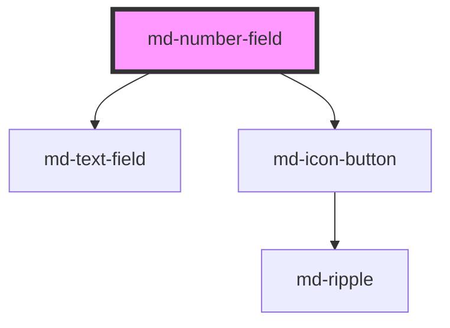

# md-number-field

<!-- llm:meta
tag: md-number-field
category: text-input
status: custom
m3-guidelines: none — M3 has no number-field page
m3-derived-from: https://m3.material.io/components/text-fields/guidelines
form-associated: true
depends-on: md-text-field, md-icon-button
used-by: none
-->

**A number, typed or stepped.** An `md-text-field` with locale-aware
`Intl.NumberFormat` display (currency, percent, units, grouping), arrow-key /
stepper-button / wheel stepping, and native form participation with the raw
numeric value.

> ⚠️ **Not a Material Design 3 component.** M3 has no number-field page, so
> there is no spec to point at: this is a plain text input with pointer-only
> steppers on M3 text-field visuals. The numeric behavior — Intl formatting,
> parsing, stepping, snapping, clamping — is this library's own contract.

> Setup, theming, density and i18n are configured once for the whole library —
> see [`main-llm.md`](../../../../../main-llm.md), shipped beside these manuals in
> the package's `docs/` folder.

---

## When to use

- A numeric quantity the user types **or** nudges: counts, amounts, prices,
  percentages, measurements.
- Values that read better locale-formatted (`1.234,5`, `12,50 €`, `50 %`) while
  the app always receives the **raw** number.
- Entry that benefits from **bounded** stepping — a `min`/`max` that arrows,
  steppers and wheel all clamp to.

## When NOT to use

| Situation | Use instead |
|---|---|
| Picking from a small numeric range visually | `md-slider` |
| A 1–5 style score | `md-rating` |
| Free text that merely *contains* digits (phone, ZIP, card) | `md-text-field` with `restrict` |
| Dates / times | `md-date-picker` / `md-time-picker` |
| A read-only numeric readout | `md-meter` / plain text |
| Two or three plausible numbers | `md-segmented-button-set` / `md-select` |

## Decision cues

| Need | Setting |
|---|---|
| Currency / percent / unit display | `format-options` (JSON attribute **or** object property) + `locale` |
| Bounds | `min` / `max` (every step-based interaction clamps) |
| Typed values may exceed the bounds | `allow-out-of-range` (typed text only) |
| Steps land on multiples | `snap-on-step` (grid base is `min`, else 0) |
| Fine / coarse keyboard steps | `small-step` (Alt) / `large-step` (Shift) |
| Stepper placement | `steppers="inline\|split\|none"` |
| Mouse-wheel stepping | `allow-wheel-scrub` (needs input focus) |
| Block submit when empty | `required` (+ `value-missing-label`) |
| Visible but uneditable, still submitted | `readonly` (`disabled` submits nothing) |
| A digit-only software keypad | `min="0"` + integer `step`, no fractional `format-options` |
| Server-side / cross-field errors | `setCustomValidity(msg)` (clear with `''`) |

## API contract

```html
<md-number-field
  name="qty" value="5"
  min="0" max="99"
  step="1" small-step="0.1" large-step="10"
  locale="de-DE"                   <!-- Intl only; empty = runtime locale -->
  format-options='{"style":"currency","currency":"EUR"}'
  required
  snap-on-step allow-out-of-range allow-wheel-scrub
  steppers="inline|split|none"     <!-- default: inline -->
  variant="filled|outlined"        <!-- default: filled -->
  label="Quantity" placeholder=""
  supporting-text="" error error-text="" reserve-supporting-space
  increment-label="Increment" decrement-label="Decrement"
  value-missing-label="Please enter a number."
  disabled readonly
  density="-1|-2|-3|-4"           <!-- default: 0 (uncompacted) -->
></md-number-field>
```

```js
el.formatOptions = { style: 'currency', currency: 'EUR' };  // object form of the attribute above
el.value = 1234.5;   // number | null — a numeric string coerces, garbage becomes null
```

**Events** — `mdInput` (every time the value actually moves, typing included),
`mdChange` (commit points only, and only when the value differs from the last
committed one), both `CustomEvent<MdNumberFieldChangeDetail>` =
`{ value: number | null, formattedValue: string, reason }`. `reason` is
`'input-change'` (typed text that parsed), `'input-clear'` (emptied),
`'input-blur'` (blur **and** Enter — they are the same commit), `'keyboard'`
(arrows, `Home`, `End`), `'increment-press'` / `'decrement-press'` (a stepper
press and every hold tick), `'wheel'`, or `'none'` (the programmatic `stepUp()`
/ `stepDown()`). On `'input-change'` and `'input-clear'`, `formattedValue` is
the **verbatim** text in the box; every other reason carries the reformatted
display string. `mdValidityChange`
(`{ valid, validationMessage, flags: Record<string, boolean> }`, `bubbles: true`,
**not composed**, and silent on mount). `mdInput` / `mdChange` **are** composed
— the value events cross a shadow boundary, the validity event does not.

**Typed vs stepped** — the two value paths are deliberately different. Typed
text is kept verbatim while editing, parses leniently, commits on blur or Enter,
is clamped there *unless* `allow-out-of-range`, and is never float-cleaned.
Stepping (arrows, steppers, wheel, `stepUp()` / `stepDown()`) commits
immediately, always clamps whatever `allow-out-of-range` says, optionally snaps
to the step grid first, and runs the result through a `toPrecision(15)` cleanup
so `0.1 + 0.2` commits as `0.3`. `Home`/`End` are a third path: they **jump** to
`min`/`max` rather than stepping — clamped and float-cleaned, never snapped.

**Methods** — `setFocus()`, `select()`, `stepUp(times?)`, `stepDown(times?)`,
`getValidity()`, `checkValidity()`, `reportValidity()`, `setCustomValidity(msg)`.

**Slots** — none (the steppers are internal `md-icon-button`s; the component
renders no `<slot>`).

**Parts** — `field` (the inner md-text-field), `increment`, `decrement`.

### Behavioral contract worth knowing

- **`value` is the raw number** (`null` = empty), submitted as `String(value)`
  under `name`; an empty field submits **no FormData entry**. The formatted
  string is display-only state. Framework proxies may write strings: `'12.5'`
  becomes `12.5`, while `''`, `undefined`, `NaN`, `Infinity` and unparseable
  text all normalize to `null`. A **programmatic write is a commit** — it
  reformats the display, resets the `mdChange` baseline and emits **nothing**,
  so a later blur on the same number stays silent.
- **`format-options` takes either form**, so a plain-HTML page needs no script:
  the `formatOptions` object property, or a `format-options` attribute holding
  a JSON object. Malformed JSON — or valid JSON that is not a plain object,
  arrays included — logs one `console.warn` per distinct string and falls back
  to plain number formatting rather than throwing. Invalid **Intl** options
  (`style: 'currency'` with no `currency`) are also survivable, but they are
  swallowed **silently** — the formatter falls back to the plain locale format
  with no warning, so an unexpectedly unformatted number is worth checking
  against `Intl.NumberFormat` directly. The formatter is memoised on
  `` `${locale}|${JSON.stringify(formatOptions)}` ``, recomputed per read: an
  in-place mutation therefore *does* invalidate the cache, but it schedules no
  re-render, so the display only catches up on the next render. Reassign the
  prop and both happen at once.
- **Percent formats keep Intl semantics**: a typed `50` parses to `0.5` and
  `value` `0.5` displays as `50%`. `min`, `max` and `step` are compared against
  the raw value, so use `step="0.01"` for one-point steps.
- **Typing is filtered, verbatim, and rejected wholesale on paste.** `keydown`
  blocks any printable character outside the active format's set (ASCII digits,
  locale numerals, group and decimal separators, locale minus/plus, currency /
  unit / literal characters, always ASCII `-` and `+`, plus `%` in percent
  formats). Ctrl/Meta shortcuts (copy, paste, select-all, undo), `Backspace`,
  `Delete`, `Tab`, ←/→, `PageUp`/`PageDown` and IME composition all pass through
  untouched — `PageUp`/`PageDown` are **not** bound to stepping. Accepted text
  is stored **as typed** —
  grouping and currency only reappear on commit. A lone `-` or `+` (or
  whitespace) updates the display without touching the value — those are the
  only partial states that do; `1,` and `1.` already parse to `1`, because the
  group separator is stripped and the locale decimal maps to `.`. A paste containing **any**
  disallowed character is rejected entirely: the box snaps back to the last
  accepted display and **no event fires** — a rejected edit is not a value
  change. Emptying the field emits `mdInput` with `reason: 'input-clear'` and
  `value: null`; the matching `mdChange` arrives at blur.
- **Blur and Enter are one commit path** and report the same `reason:
  'input-blur'` — a listener cannot tell them apart. Enter additionally calls
  `form.requestSubmit()` with the form's **default submit button**
  (`button[type="submit"]`, `input[type="submit"]`, or `button:not([type])`) as
  the submitter, so that button's `name`/`value` joins the entry list and
  `event.submitter` is set, matching native implicit submission. It does **not**
  click that button: `requestSubmit()` runs the submit steps directly, so a
  click handler on the submit button never sees this path — put the logic in the
  form's `submit` listener. `mdChange` is gated on
  "differs from the last committed value", so blurring without a change is
  silent.
- **Stepping always clamps**, even under `allow-out-of-range` — that flag
  exempts typed text only. Stepping bases off the **parsed visible text**, then
  the current value, then `0`, so an arrow press after typing steps from what is
  on screen and an empty field seeds from `0`. A `step` that is `0`, negative or
  `NaN` silently falls back to `1`; a non-finite `min`/`max` means no bound at
  all. `Home` and `End` only act when the matching bound is finite — otherwise
  the native caret-to-start / caret-to-end behaviour is left alone.
- **`snap-on-step`** snaps **before** clamping, so a non-aligned `min`/`max`
  stays exactly reachable. The grid base is `min` when defined, else `0` — not
  necessarily zero. Regular and Shift steps snap **directionally** (floor going
  up, ceil going down) so a step never reverses direction; Alt / `small-step`
  snaps to the **nearest** multiple. Epsilon is `amount × 1e-10`. `Home`, `End`
  and typed commits never snap.
- **Press-and-hold** on a stepper: one tick immediately on `pointerdown`, then
  auto-repeat after **400ms** at **60ms** intervals, deliberately with no
  acceleration — overshoot is one tap to correct. `Shift`/`Alt` are re-read per
  tick from live window listeners, so switching to `large-step` mid-hold works
  without releasing the button. Ticking stops at the bound (where the button
  also renders `disabled`), and on `pointerup`, `pointercancel`, `contextmenu`
  or `pointerleave`. A mouse or pen press focuses the input; a **touch** press
  deliberately does not, so tapping a stepper never summons the software
  keyboard over the field.
- **Wheel scrubbing is opt-in and focus-gated**: `allow-wheel-scrub`, the inner
  input focused, and neither `disabled` nor `readonly`. `Ctrl`+wheel is never
  hijacked, so pinch-zoom keeps working. The listener sits on the **host**,
  registered non-passive, and calls `preventDefault()` — while the input is
  focused the page will not scroll under the pointer. Scrolling down decrements.
  A drag-to-scrub surface is deliberately out of scope: a niche gesture built on
  pointer lock, whose behaviour is unreliable in Safari.
- **`readonly` blocks every edit path** — typing, arrow stepping, `Home`/`End`,
  wheel scrub and press-and-hold — and both steppers render `disabled`. The
  value stays visible, focusable and **submitted**. `disabled` instead takes the
  control out of submission and constraint validation — the platform's behaviour
  for a disabled form-associated element — and sets `pointer-events: none` on
  the host.
- **`stepUp()` / `stepDown()` are not gated by `disabled` or `readonly`** — they
  call the stepping path directly, so a disabled field still changes value and
  emits `mdInput`/`mdChange` (reason `'none'`). They also perform **one** step
  of `step × Math.max(1, times)`, not `times` repeated ticks, so `0`, `0.5`,
  a negative or `NaN` all collapse to a single plain step.
- **Validity has exactly two failure modes**: a non-empty `setCustomValidity()`
  message (`customError`, which outranks everything and is cleared by a form
  reset), and `required` with a `null` value (`valueMissing`, messaged with
  `error-text` when set, otherwise `value-missing-label`). There is **no**
  `rangeUnderflow` / `rangeOverflow` — an out-of-range typed value under
  `allow-out-of-range` is form-**valid**. The `error` / `error-text` props are
  display-only apart from supplying that message: `error="true"` does not make
  the control invalid.
- **`mdValidityChange` fires only on an actual change** — keyed on
  `` `${valid}|${validationMessage}` `` — and the first computation only primes
  the baseline, so **nothing fires on mount**. Read initial state with
  `getValidity()` instead. `composed: false` stops **this** event at the
  boundary of whatever shadow root the field sits in — a composite embedding
  md-number-field will not see it from outside (the inner md-text-field's own
  validity event is contained by its own flag, independently). `bubbles: true`
  still lets a `<form>` or app root in the same tree hear every control.
  `mdInput` / `mdChange` **are** composed, so the value events do cross that
  boundary while the validity event does not.
- **The form lifecycle is wired**, not just `name`: a form reset restores the
  `value` captured at load, clears any `setCustomValidity()` message and resets
  the commit baseline; an ancestor `<fieldset disabled>` or disabled form
  disables the field even without the `disabled` prop; and bfcache / session
  restore reinstates the value from the submitted string.
- **The inner field's own events never escape.** `md-text-field` emits
  `mdInput`/`mdChange` with a **string** detail; both are stopped at this host,
  which re-emits its own typed detail. A string-detail event from this element
  is not something you will ever see.
- **No `role="spinbutton"`, no `type="number"`**: the visible control is a plain
  textbox with `autocomplete="off"`, `spellcheck="false"` and an `inputmode` of
  `numeric` or `decimal`, so the locale-formatted value stays ordinary readable,
  editable text and no native spinner chrome fights the Intl display.
  `inputmode="numeric"` applies only when `min` is defined and `>= 0` **and**
  nothing implies fractions (integer `step`, and `format-options` sets no
  `min`/`maximumFractionDigits > 0` and is not `currency` or `percent`);
  everything else gets `decimal`, which also serves `min < 0` because iOS puts
  the minus key on that layout.

---

## Do / Don't

House rules, informed by [M3 · Text fields](https://m3.material.io/components/text-fields/guidelines).

| ✅ Do | ❌ Don't |
|---|---|
| Always set a `label` | Don't use `placeholder` as the label |
| Read `e.detail.value` (a number) | Don't parse the formatted text yourself |
| Listen to `mdChange` for commits | Don't treat every `mdInput` as a commit |
| Pass `format-options` whichever way suits the page — attribute or property | Don't add a script block just to configure formatting |
| Use `step="0.01"` for percent points | Don't expect `step="1"` to mean 1% |
| Set `min="0"` on counts so the digit keypad appears | Don't leave `min` off and wonder why iOS shows a decimal pad |
| Pair `min`/`max` with supporting text | Don't clamp silently without a hint |
| Clear a `setCustomValidity()` message with `''` | Don't leave a stale server error blocking submit |
| Localize the `*-label` props | Don't ship the English defaults |
| Use `steppers="none"` for dense forms | Don't stack steppers where space is scarce |

---

## Patterns

```html
<!-- Price in EUR, German display, raw number submitted — no script needed -->
<md-number-field
  name="price" label="Preis" locale="de-DE"
  format-options='{"style":"currency","currency":"EUR"}'
  min="0" step="0.5"
></md-number-field>

<!-- Percent with 1-point steps (Intl semantics: value 0.5 shows 50%) -->
<md-number-field
  name="discount" label="Discount"
  format-options='{"style":"percent"}'
  min="0" max="1" step="0.01"
></md-number-field>

<!-- Quantity: bounded, snapped, split steppers -->
<md-number-field label="Seats" steppers="split" min="1" max="12"
                 snap-on-step value="4"></md-number-field>
```

```html
<!-- Reading commits, and the object form of format-options -->
<md-number-field id="price" name="price" label="Price"></md-number-field>
<script type="module">
  const el = document.getElementById('price');
  el.formatOptions = { style: 'currency', currency: 'EUR' };
  el.addEventListener('mdChange', (e) => {
    console.log(e.detail.value, e.detail.reason);   // 12.5  'input-blur'
  });
</script>
```

```js
// Server-side validation, and initial state (mdValidityChange is silent on mount)
const el = document.querySelector('md-number-field');

const { valid, validationMessage, flags } = await el.getValidity();

el.setCustomValidity('That quantity is out of stock.');   // customError wins
el.setCustomValidity('');                                  // cleared

el.addEventListener('mdValidityChange', (e) => {
  showError(e.detail.valid ? '' : e.detail.validationMessage);
});
```

```html
<!-- Localized (translate every label prop; locale/format-options are Intl config) -->
<md-number-field
  name="menge" label="Menge" locale="de-DE"
  supporting-text="Zwischen 1 und 12"
  increment-label="Erhöhen" decrement-label="Verringern"
  value-missing-label="Bitte geben Sie eine Zahl ein."
  min="1" max="12" required
></md-number-field>
```

## Anti-patterns

| ❌ Wrong | ✅ Right | Why |
|---|---|---|
| Reading the input's text as the value | `el.value` / `e.detail.value` | The display is locale-formatted. |
| "`format-options` can't be an attribute" | `format-options='{"style":"percent"}'` | Attribute or property, both supported. |
| `el.value = '12,5'` in a German field | `el.value = 12.5` | The prop is coerced with `Number()`, not parsed by locale. |
| Expecting `50` for a typed "50%" | Percent value is `0.5` | Intl semantics. |
| Treating `mdInput` as the commit | `mdChange` fires at commit points | Typing is provisional. |
| Telling Enter from blur by `reason` | Both report `'input-blur'` | One commit path. |
| Expecting `mdValidityChange` on mount | `await el.getValidity()` | The first computation only primes the baseline. |
| Listening for `mdValidityChange` on a shadow ancestor | Listen on the element | `composed: false`. |
| `allow-out-of-range` to skip validation | Nothing to skip | There is no range validity — only `valueMissing` and `customError`. |
| `step="0"` to disable stepping | `readonly` (or `disabled`) | A non-positive `step` falls back to `1`, and `steppers="none"` only removes the buttons — arrows, `Home`/`End`, the wheel and `stepUp()` all still step. |
| `stepUp()` on a `disabled` field expecting a no-op | Guard the call yourself | The methods are ungated by design. |
| Mutating `el.formatOptions.currency` in place | Reassign the whole object | The formatter is memoised on the serialized options. |
| Relying on steppers for keyboard users | Arrows on the input | Steppers are pointer-only by design. |
| `density="0"` to escape an inherited rung | `style="--md-sys-density-scale: 0"` | There is no `density="0"` rule; rung 0 is the default and is inert. |

## Accessibility, RTL, density, i18n

**Accessibility**
- `label` supplies the accessible name. The input is a plain textbox with a
  numeric software keyboard (`inputmode`), so the formatted value is ordinary
  readable, selectable text.
- Keyboard: ↑/↓ step (`Alt` fine, `Shift` coarse), `Home`/`End` jump to defined
  bounds, `Enter` commits and submits. The input is the **only** tab stop — both
  steppers carry `tabindex="-1"` and only duplicate ↑/↓, so `Tab` never lands on
  them. They are labelled by `increment-label` / `decrement-label`.
- `required` with no value blocks submission; `value-missing-label` is the
  bubble message and `error-text` wins when set, so the inline and native
  messages agree. `reportValidity()` anchors its bubble on the inner field.
- `reserve-supporting-space` avoids layout jump when errors appear.
- ⚠️ There is no `role="spinbutton"` and no `aria-valuenow`/`valuemin`/`valuemax`
  — a spinbutton role makes assistive tech announce a bare number that fights
  the locale-formatted text on screen. State the bounds in `supporting-text`
  instead.
- ⚠️ A `disabled` host gets `pointer-events: none`, so a tooltip or popover
  targeting the field itself receives no pointer events either. Wrap a
  container when a disabled field needs a hover explanation.

**RTL** — logical properties throughout; the split-stepper row follows the
inline direction (decrement renders on the right under `dir="rtl"`). Stepping is
vertical-arrow / wheel driven, so there is nothing to mirror there. Locales with
native numerals (e.g. `ar-SA`) format **and** parse them, and bidi control
characters are stripped rather than rejected.

**Density** — set `density="-1"` … `density="-4"` to compact the field and both
stepper layouts, or let it inherit an ancestor's `data-density` rung. The prop
is forwarded to the inner `md-text-field` and mapped locally onto
`--md-sys-density-scale` for the stepper circles and gaps. There is no
`density="0"` rule — rung 0 is the uncompacted default and is inert.

**i18n** — translate `label`, `placeholder`, `supporting-text`, `error-text`,
`increment-label`, `decrement-label`, `value-missing-label`. `locale` and
`format-options` are Intl configuration, not translation.

## Related components

`md-text-field` · `md-slider` · `md-rating` · `md-select` · `md-meter`

## Theming

| Custom property | Purpose | Default |
|---|---|---|
| `--md-number-field-width` | Host inline size | `100%` |
| `--md-number-field-min-width` | Host minimum inline size | `200px` |
| `--md-number-field-stepper-icon-size` | Stepper glyph size | density-scaled, `20px` at rung 0 |
| `--md-number-field-stepper-color` | Stepper icon ink | `--md-sys-color-on-surface-variant` |
| `--md-number-field-split-stepper-size` | Split-layout stepper circle | density-scaled, `40px` at rung 0 |

**CSS parts** — `field` (the inner `md-text-field`), `increment`, `decrement`.

```css
md-number-field {
  --md-number-field-min-width: 120px;
  --md-number-field-stepper-color: var(--md-sys-color-primary);
}
```

The embedded field also honours every `--md-text-field-*` property. One
exception: under `steppers="inline"` the host itself sets
`--md-text-field-padding-inline-end`, so an outer override of that single hook
loses to the host rule.

<!-- Auto Generated Below -->


## Overview

`md-number-field` — Material Design 3 number input: an `md-text-field`
with locale-aware `Intl.NumberFormat` display, arrow-key / stepper-button /
wheel stepping, and native form participation.

Behavior contract:
  - the visible control is a **plain text input** (`inputmode` numeric or
    decimal) — deliberately NOT `role="spinbutton"` and NOT
    `type="number"`, so the locale-formatted value stays ordinary readable,
    editable text and no native spinner chrome fights the Intl display;
    the steppers are separate labeled buttons with `tabindex="-1"` (the
    input is the keyboard surface),
  - `value` is the raw number (`null` = empty); the formatted string is
    display-only state,
  - ArrowUp/Down step by `step`, Alt = `smallStep`, Shift = `largeStep`;
    Home/End jump to a defined `min`/`max`,
  - press-and-hold on a stepper auto-repeats (400ms delay, 60ms interval),
  - typing is filtered to the characters of the active locale/format,
    parsed leniently and kept verbatim; blur reformats (and clamps unless
    `allow-out-of-range`),
  - stepping (keys, buttons, wheel) always clamps and commits (`mdChange`).

A drag-to-scrub surface (pointer lock over the field) is deliberately out of
scope: a niche gesture built on pointer lock, whose behaviour is unreliable
in Safari. `allow-wheel-scrub` covers the "nudge without typing" case.

## Properties

| Property                 | Attribute                  | Description                                                                                                                                                                                                                                                                                                                                        | Type                                                | Default                     |
| ------------------------ | -------------------------- | -------------------------------------------------------------------------------------------------------------------------------------------------------------------------------------------------------------------------------------------------------------------------------------------------------------------------------------------------- | --------------------------------------------------- | --------------------------- |
| `allowOutOfRange`        | `allow-out-of-range`       | Let TYPED text exceed `min`/`max` unclamped (blur does not clamp). Step-based interactions (keys, buttons, wheel) always clamp.                                                                                                                                                                                                                     | `boolean`                                           | `false`                     |
| `allowWheelScrub`        | `allow-wheel-scrub`        | Enable wheel stepping while the inner input has focus.                                                                                                                                                                                                                                                                                             | `boolean`                                           | `false`                     |
| `decrementLabel`         | `decrement-label`          | Accessible name of the decrement stepper (localizable).                                                                                                                                                                                                                                                                                            | `string`                                            | `'Decrement'`               |
| `density`                | `density`                  | Density forwarded to the text-field and applied to the steppers.                                                                                                                                                                                                                                                                                   | `-1 \| -2 \| -3 \| -4 \| 0`                         | `0`                         |
| `disabled`               | `disabled`                 | Disabled — non-interactive.                                                                                                                                                                                                                                                                                                                        | `boolean`                                           | `false`                     |
| `error`                  | `error`                    | Error state — forwarded to the text-field.                                                                                                                                                                                                                                                                                                         | `boolean`                                           | `false`                     |
| `errorText`              | `error-text`               | Error text rendered in place of supporting text when `error` is true.                                                                                                                                                                                                                                                                              | `string`                                            | `''`                        |
| `formatOptions`          | `format-options`           | `Intl.NumberFormat` options for display formatting (currency, percent, unit, fraction digits…). Percent keeps Intl semantics: displayed 50% ⇔ value 0.5.  Takes either form, so a plain-HTML page needs no script: property — `el.formatOptions = { style: 'currency', currency: 'EUR' }`; attribute — `format-options='{"style":"currency","currency":"EUR"}'`.  Malformed JSON warns once and falls back to plain number formatting rather than throwing: a broken attribute must not take the whole field down. | `Intl.NumberFormatOptions \| string \| undefined`   | `undefined`                 |
| `incrementLabel`         | `increment-label`          | Accessible name of the increment stepper (localizable).                                                                                                                                                                                                                                                                                            | `string`                                            | `'Increment'`               |
| `label`                  | `label`                    | Floating label / accessible name.                                                                                                                                                                                                                                                                                                                  | `string`                                            | `''`                        |
| `largeStep`              | `large-step`               | Step while **Shift** is held.                                                                                                                                                                                                                                                                                                                      | `number`                                            | `10`                        |
| `locale`                 | `locale`                   | BCP-47 locale for `Intl.NumberFormat` display/parsing ONLY (an Intl-computed value — translatable copy stays in the `*-label` props). Empty = the runtime locale.                                                                                                                                                                                   | `string`                                            | `''`                        |
| `max`                    | `max`                      | Upper bound. Interactive stepping always clamps to it.                                                                                                                                                                                                                                                                                             | `number \| undefined`                               | `undefined`                 |
| `min`                    | `min`                      | Lower bound. Interactive stepping always clamps to it.                                                                                                                                                                                                                                                                                             | `number \| undefined`                               | `undefined`                 |
| `name`                   | `name`                     | Form name. The raw numeric value submits as `String(value)`.                                                                                                                                                                                                                                                                                       | `string`                                            | `''`                        |
| `placeholder`            | `placeholder`              | Placeholder for the input.                                                                                                                                                                                                                                                                                                                         | `string`                                            | `''`                        |
| `readOnly`               | `readonly`                 | Read-only: the value is visible and focusable but cannot be edited or stepped.                                                                                                                                                                                                                                                                     | `boolean`                                           | `false`                     |
| `required`               | `required`                 | Required for native form parity (`valueMissing` when empty).                                                                                                                                                                                                                                                                                       | `boolean`                                           | `false`                     |
| `reserveSupportingSpace` | `reserve-supporting-space` | Always occupy the supporting-text line, even when there is no message, so a validation error does not push the content below it down. Forwarded to the embedded md-text-field.                                                                                                                                                                      | `boolean`                                           | `false`                     |
| `smallStep`              | `small-step`               | Step while **Alt** is held.                                                                                                                                                                                                                                                                                                                        | `number`                                            | `0.1`                       |
| `snapOnStep`             | `snap-on-step`             | Snap stepped values to multiples of the active step (base = `min` when defined, else 0). Snapping happens BEFORE clamping, so non-aligned bounds stay reachable. Regular steps snap directionally; Alt (`smallStep`) snaps to the nearest multiple.                                                                                                  | `boolean`                                           | `false`                     |
| `step`                   | `step`                     | Step for arrows / steppers / wheel. A value that is not finite or is `<= 0` falls back to `1`.                                                                                                                                                                                                                                                      | `number`                                            | `1`                         |
| `steppers`               | `steppers`                 | Which stepper buttons render: inside the field, split around it, or none.                                                                                                                                                                                                                                                                          | `"inline" \| "none" \| "split"`                     | `'inline'`                  |
| `supportingText`         | `supporting-text`          | Supporting / helper text below the field.                                                                                                                                                                                                                                                                                                          | `string`                                            | `''`                        |
| `value`                  | `value`                    | The raw numeric value (`null` = empty). Never the formatted string — the display text is derived via `Intl.NumberFormat`. Non-finite numbers, empty strings, `undefined` and unparseable text all normalize to `null`.                                                                                                                              | `number \| null`                                    | `null`                      |
| `valueMissingLabel`      | `value-missing-label`      | Localized constraint-validation message shown when `required` is unmet. `errorText` still wins when set, so an app-supplied inline message and the native bubble stay in agreement.                                                                                                                                                                 | `string`                                            | `'Please enter a number.'`  |
| `variant`                | `variant`                  | Visual variant of the inner text-field.                                                                                                                                                                                                                                                                                                            | `"filled" \| "outlined"`                            | `'filled'`                  |


## Events

| Event              | Description                                                                                                                                                                                                                                                                                                                | Type                                                                                          |
| ------------------ | -------------------------------------------------------------------------------------------------------------------------------------------------------------------------------------------------------------------------------------------------------------------------------------------------------------------------- | --------------------------------------------------------------------------------------------- |
| `mdChange`         | Fires at commit points — blur/Enter reformat, keyboard stepping and Home/End, stepper presses and hold ticks, wheel scrub, and `stepUp()`/`stepDown()` — and only when the value differs from the last committed one. A blur without a change stays silent.                                                                  | `CustomEvent<MdNumberFieldChangeDetail>`                                                      |
| `mdInput`          | Fires on every value change (typing included), whenever the value actually moves. Typed text reports `formattedValue` verbatim; committed changes report the reformatted display string.                                                                                                                                    | `CustomEvent<MdNumberFieldChangeDetail>`                                                      |
| `mdValidityChange` | Fires when this control's validity CHANGES — never on every keystroke, never for a re-publish that lands on the same state, and never on mount (the first computation only primes the baseline).  `composed: false` is deliberate: a composite embedding this field would otherwise hear two events for one logical control. `bubbles: true` still lets a `<form>` or app root hear every control. | `CustomEvent<{ valid: boolean; validationMessage: string; flags: Record<string, boolean>; }>` |


## Methods

### `checkValidity() => Promise<boolean>`

Constraint-validation API, matching md-text-field and the native contract.
Returns `true` when the platform lacks the method — an unknown validity is
never reported as a failure.

#### Returns

Type: `Promise<boolean>`


### `getValidity() => Promise<{ valid: boolean; validationMessage: string; flags: Record<string, boolean>; }>`

Current validity: boolean, message and flags. Mirrors md-text-field.
`flags` omits the `valid` summary key and lists only the flags that are true.

#### Returns

Type: `Promise<{ valid: boolean; validationMessage: string; flags: Record<string, boolean>; }>`


### `reportValidity() => Promise<boolean>`

Like checkValidity(), but also shows the browser's validation message,
anchored on the inner md-text-field.

#### Returns

Type: `Promise<boolean>`


### `select() => Promise<void>`

Select the input's full contents.

#### Returns

Type: `Promise<void>`


### `setCustomValidity(message: string) => Promise<void>`

App/server-side validation: a non-empty message marks the field
invalid for its form until cleared with an empty string. It sets
`customError` and outranks `valueMissing`.

#### Parameters

| Name      | Type     | Description |
| --------- | -------- | ----------- |
| `message` | `string` |             |

#### Returns

Type: `Promise<void>`


### `setFocus() => Promise<void>`

Focus the inner input.

#### Returns

Type: `Promise<void>`


### `stepDown(times?: number) => Promise<void>`

Step down by `step` (× `times`), snapping/clamping like an arrow press.
One step of `step × Math.max(1, times)`, not `times` ticks. Not gated by
`disabled` or `readonly`. Emits with `reason: 'none'`.

#### Parameters

| Name    | Type     | Description |
| ------- | -------- | ----------- |
| `times` | `number` |             |

#### Returns

Type: `Promise<void>`


### `stepUp(times?: number) => Promise<void>`

Step up by `step` (× `times`), snapping/clamping like an arrow press.
One step of `step × Math.max(1, times)`, not `times` ticks. Not gated by
`disabled` or `readonly`. Emits with `reason: 'none'`.

#### Parameters

| Name    | Type     | Description |
| ------- | -------- | ----------- |
| `times` | `number` |             |

#### Returns

Type: `Promise<void>`


## Shadow Parts

| Part          | Description                                  |
| ------------- | -------------------------------------------- |
| `"decrement"` | The decrement stepper (`md-icon-button`).    |
| `"field"`     | The inner `md-text-field`.                   |
| `"increment"` | The increment stepper (`md-icon-button`).    |


## Dependencies

### Depends on

- [md-text-field](../md-text-field)
- [md-icon-button](../md-icon-button)

### Graph


----------------------------------------------

*Built with [StencilJS](https://stenciljs.com/)*
