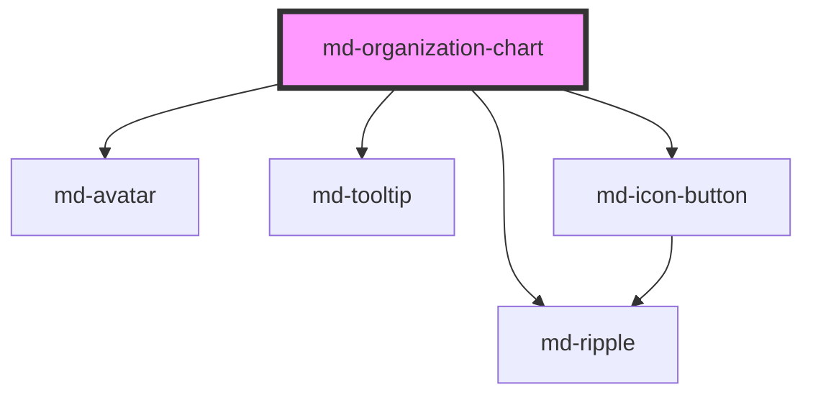

# md-organization-chart

<!-- llm:meta
tag: md-organization-chart
category: data
status: custom
m3-guidelines: none — not an M3 component
form-associated: false
depends-on: md-ripple, md-avatar, md-tooltip, md-icon-button
used-by: none
-->

**A tree of avatar cards joined by connectors.** Renders a hierarchy —
reporting lines, categories, taxonomies — with collapsible branches, optional
selection and the full WAI-ARIA tree keyboard model.

> ⚠️ **Not a Material Design 3 component.** M3 has no org-chart page; the
> guidance below is house rules.

> Setup, theming, density and i18n are configured once for the whole library —
> see [`main-llm.md`](../../../../../main-llm.md), the library-wide guide that ships
> alongside these component docs.

---

## When to use

- Visualising a **hierarchy** where the parent/child relationships are the
  point: org charts, category trees, dependency trees.
- The user needs to expand and collapse branches to manage size.
- Nodes are people or units that read well as an avatar + name + role card.

## When NOT to use

| Situation | Use instead |
|---|---|
| A flat list | `md-list` |
| A file-tree navigation sidebar | `md-list` with indentation, or a tree control |
| Where-am-I in a path | `md-breadcrumbs` |
| Progressive disclosure of sections | `md-accordion` |
| Quantities or trends | The chart components |
| A very large graph (thousands of nodes) | A dedicated graph library |

## Decision cues

| Need | Setting |
|---|---|
| Top-down chart | `orientation="vertical"` (default) |
| Left-to-right chart | `orientation="horizontal"` |
| Branches can be folded | `collapsible` (default on) |
| A branch starts folded | `expanded: false` on that node |
| Pick one node | `selection-mode="single"` |
| Pick several | `selection-mode="multiple"` |
| Exempt a node from selection | `selectable: false` on that node |
| Preselect | `selectedIds` (JS property) |
| Tint one node | `accent` on that node |
| Custom empty state | `empty` slot |

## API contract

```html
<md-organization-chart
  selection-mode="none|single|multiple"          <!-- default: none -->
  collapsible                                    <!-- default: ON; set collapsible="false" to lock branches open -->
  orientation="vertical|horizontal"              <!-- default: vertical -->
  label="Organization chart"                     <!-- accessible name of the tree -->
  expand-label="Expand"
  collapse-label="Collapse"
  density="-1|-2|-3|-4"                          <!-- default: 0 (uncompacted) -->
>
  <div slot="empty">No people yet.</div>
</md-organization-chart>
```

```js
const chart = document.querySelector('md-organization-chart');

chart.nodes = [{
  id: 'ceo', name: 'Ada Lovelace', title: 'CEO', avatar: '/u/ada.jpg',
  children: [
    { id: 'cto', name: 'Grace Hopper', title: 'CTO', accent: '#6750A4' },
    { id: 'cfo', name: 'Katherine Johnson', title: 'CFO',
      avatarInitials: 'KJ', expanded: false, selectable: false },
  ],
}];
chart.selectedIds = ['cto'];       // JS property — no attribute form
```

Each node (`OrgChartNode`): `id` and `name` are required; `title` (the muted
second line), `avatar` (image URL), `avatarInitials`, `accent` (a CSS colour
for the avatar ring and selected tint), `expanded` (`false` starts the subtree
folded), `selectable` (`false` exempts it) and `children` are optional.

**Events** — `mdSelectionChange` (`{ node, selectedIds }`), `mdNodeToggle`
(`{ node, expanded }` — `node` is the whole `OrgChartNode`, so read
`e.detail.node.id`). Both are the Stencil default — they bubble and cross
shadow boundaries.

**Methods** — none.

**Slots** — `empty` (replaces the default "No data" message; shown when `nodes`
resolves to an empty list).

**Parts** — `viewport`, `tree`, `group`, `node`, `node-selected` (present on a
node only while it is selected), `state-layer`, `avatar`, `avatar-image`
(forwarded from the inner `md-avatar`), `name`, `title`, `toggle`, `empty`.

### Behavioral contract worth knowing

- **`nodes` accepts either form.** As a JS property it takes an
  `OrgChartNode[]`; as an attribute it takes a **JSON string**, which is parsed
  (invalid JSON yields an empty tree). The property is the sane choice for
  anything non-trivial. `selectedIds` is property-only.
- **Multiple roots are supported** — a top-level array with several entries
  renders them side by side.
- **Reassigning `nodes` resets expand/collapse state.** The collapsed set is
  rebuilt from each node's `expanded` field, so branches the reader opened or
  closed revert. If you rebuild the tree (lazy loading, polling), carry the
  reader's state back into the data as `expanded: true/false`.
- **`selectedIds` is mutable and written back** by the component as the user
  selects. Watch `mdSelectionChange` rather than diffing the array.
- In `selection-mode="single"`, clicking the only selected node **deselects**
  it. In `multiple`, each click toggles that node.
- **Enter / Space selects** when the node is selectable, and otherwise
  **toggles** the branch. The chart uses a **roving tabindex** — exactly one
  node is in the tab order — with Arrow Down/Up moving through the visible
  nodes, Arrow forward expanding then descending, Arrow backward collapsing then
  ascending, and Home/End jumping to the ends. The forward/backward arrows swap
  under `dir="rtl"`.
- The expand/collapse button is **`aria-hidden` and out of the tab order** on
  purpose: expansion is already exposed on the tree item via `aria-expanded` and
  the arrow keys. Its visible name rides in an `md-tooltip` fed by
  `expand-label` / `collapse-label`.
- The **avatar is decorative** (`aria-hidden`), because the node's name is
  already the tree item's accessible text.
- The chart **doesn't fetch or lazy-load** branches. `mdNodeToggle` tells you a
  branch opened — load children there and reassign `nodes`.
- It doesn't virtualize. A few hundred nodes is fine; thousands will be slow —
  collapse by default, or use a graph library.
- The `viewport` part scrolls when the tree outgrows its container. **No
  panning or zooming is built in.**

---

## Do / Don't

House rules — M3 has no org-chart page, so the guidance below is this library's
own.

| ✅ Do | ❌ Don't |
|---|---|
| Give every node a stable, unique `id` | Don't reuse ids across branches |
| Collapse deep branches with `expanded: false` | Don't render a 500-node tree fully expanded |
| Load children on `mdNodeToggle` for big trees | Don't build the whole tree up front if it's huge |
| Carry expand state back into the data when you reassign `nodes` | Don't reassign and expect the reader's folds to survive |
| Keep node labels short (name + title) | Don't put a paragraph in a node |
| Use `orientation="horizontal"` for deep, narrow trees | Don't force vertical when it forces horizontal scrolling |
| Provide an `empty` slot state | Don't render a blank area |
| Localize `label`, `expand-label`, `collapse-label` | Don't ship the English defaults |
| Offer a non-visual alternative for the hierarchy | Don't make the chart the only representation |

---

## Patterns

```html
<md-organization-chart id="org" selection-mode="single" label="Reporting structure">
  <div slot="empty">No people yet.</div>
</md-organization-chart>

<script type="module">
  const org = document.getElementById('org');

  org.nodes = [{
    id: 'ceo', name: 'Ada Lovelace', title: 'CEO',
    children: [
      { id: 'cto', name: 'Grace Hopper', title: 'CTO',
        children: [{ id: 'eng1', name: 'Alan Turing', title: 'Engineer' }] },
      { id: 'cfo', name: 'Katherine Johnson', title: 'CFO' },
    ],
  }];

  org.addEventListener('mdSelectionChange', (e) => {
    showProfile(e.detail.node.id, e.detail.selectedIds);
  });
</script>
```

```html
<!-- Lazy branches: mdNodeToggle carries the whole node -->
<md-organization-chart id="lazy" label="Reporting structure"></md-organization-chart>
<script type="module">
  const lazy = document.getElementById('lazy');
  const loaded = new Set();

  // A branch needs at least one REAL child to be togglable: `hasChildren` is
  // length-based, so `children: []` is a leaf — no toggler renders and
  // `mdNodeToggle` can never fire. Seed a placeholder and swap it out.
  lazy.nodes = [{
    id: 'ceo',
    name: 'Ada Lovelace',
    title: 'CEO',
    children: [{ id: 'ceo-placeholder', name: '…', selectable: false }],
  }];

  // Branches start EXPANDED (there is no initially-collapsed prop), so the
  // first toggle on a branch is a collapse. Fetch on the first toggle in
  // either direction rather than gating on `expanded`.
  lazy.addEventListener('mdNodeToggle', async (e) => {
    const { node } = e.detail;
    if (loaded.has(node.id)) return;
    loaded.add(node.id);
    // Rebuild the tree, marking already-open branches so the reassignment
    // doesn't fold them back up.
    lazy.nodes = insertChildren(lazy.nodes, node.id, await fetchReports(node.id));
  });
</script>
```

```html
<!-- Horizontal, dense, JSON via the attribute (small trees only) -->
<md-organization-chart
  orientation="horizontal"
  density="-2"
  nodes='[{"id":"a","name":"Root","children":[{"id":"b","name":"Child"}]}]'
></md-organization-chart>
```

## Anti-patterns

| ❌ Wrong | ✅ Right | Why |
|---|---|---|
| `const { id } = e.detail` on `mdNodeToggle` | `const { node } = e.detail; node.id` | The detail is `{ node, expanded }`, not the node itself. |
| `selected-ids="a,b"` as an attribute | `chart.selectedIds = ['a', 'b']` | `selectedIds` has no attribute form. |
| Reassigning `nodes` and expecting folds to persist | Write `expanded` back into the data | The collapsed set is rebuilt from the data. |
| Duplicate node `id`s | Unique ids | Selection, toggling and focus key off them. |
| Expecting lazy loading | Load in `mdNodeToggle` | It renders what you give it. |
| Thousands of nodes fully expanded | Collapse, or use a graph library | No virtualization. |
| Expecting pan/zoom, or a `resize()` method | Wrap the `viewport` yourself | Neither is built in; the component has no methods. |
| Composing your own `md-avatar` inside a node | Feed the node data | The chart renders the node chrome itself. |
| Tabbing to the expand/collapse buttons | Use the arrow keys | The toggles are `aria-hidden` and untabbable by design. |
| Shipping English `expand-label` / `collapse-label` | Translate them | They name the toggles in the tooltip. |
| The chart as the only view of the hierarchy | Offer a list/table too | Visual-only structure excludes some users. |

## Accessibility, RTL, density, i18n

**Accessibility**
- The chart is a real `role="tree"` with `role="treeitem"` nodes carrying
  `aria-level`, `aria-setsize`, `aria-posinset`, `aria-expanded` and
  `aria-selected`; `aria-multiselectable` is set in `multiple` mode. `label`
  names the tree.
- Keyboard: roving tabindex (one node in the tab order), Arrow Up/Down between
  visible nodes, Arrow forward/backward to expand/descend and collapse/ascend
  (swapped in RTL), Home/End, Enter/Space to select — or to toggle when the node
  isn't selectable.
- The expand/collapse buttons are deliberately `aria-hidden` and untabbable, so
  there is no nested interactive control inside a tree item; `expand-label` /
  `collapse-label` name them for pointer users through `md-tooltip`.
- A connector-drawn tree is still a **visual** representation of structure.
  Offering an equivalent list or table view is the accessible thing to do for
  anything important.
- Keep `selection-mode` honest — `none` when nodes aren't selectable, so
  `aria-selected` isn't advertised on nodes that can't take it.

**RTL** — the layout is authored with logical properties, so the tree mirrors
under `dir="rtl"`; `orientation="horizontal"` flows from the reading start, and
the horizontal arrow keys swap with it.

**Density** — `density="-1"` through `density="-4"` tighten the toggler size and
the level/sibling gaps; check that names stay legible. Rung `0` is the
uncompacted default and has no rule of its own. To step *out* of an inherited
`data-density` rung, set `style="--md-sys-density-scale: 0"` — `density="0"`
will not do it.

**i18n** — node `name` / `title` come from your data. Translate `label`,
`expand-label`, `collapse-label`, and the `empty` slot content. Longer names
widen nodes — `--md-org-chart-node-max-width` caps them.

## Related components

`md-list` · `md-accordion` · `md-breadcrumbs` · `md-avatar` · `md-tooltip` ·
`md-icon-button` · `md-ripple`

## Theming

| Custom property | Purpose | Default |
|---|---|---|
| `--md-org-chart-connector-color` | Connector line colour | `--md-sys-color-outline-variant` |
| `--md-org-chart-connector-width` | Connector line thickness | `1.5px` |
| `--md-org-chart-node-color` | Node card background | `--md-sys-color-surface-container-low` |
| `--md-org-chart-node-outline-color` | Node card border colour | `--md-sys-color-outline-variant` |
| `--md-org-chart-node-outline-width` | Node card border width | `1px` |
| `--md-org-chart-node-shape` | Node card corner radius | `--md-sys-shape-corner-medium` (12px) |
| `--md-org-chart-node-min-width` | Node card minimum width | `176px` |
| `--md-org-chart-node-max-width` | Node card maximum width | `260px` |
| `--md-org-chart-selected-color` | Selected node accent (border + tint) | `--md-sys-color-primary` |
| `--md-org-chart-focus-ring-color` | Focus outline colour | `--md-sys-color-secondary` |
| `--md-org-chart-state-layer-color` | Hover / selected overlay colour | `--md-sys-color-on-surface` |
| `--md-org-chart-toggle-size` | Expand/collapse toggler diameter | `max(20px, 24px + density × 1px)` |
| `--md-org-chart-level-gap` | Gap between levels | `max(24px, 28px + density × 1px)` |
| `--md-org-chart-sibling-gap` | Gap between siblings | `max(8px, 12px + density × 1px)` |
| `--md-org-chart-duration` | Motion duration | `--md-sys-motion-duration-medium2` (300ms) |

A single node's tint is its `accent` field, not a custom property — it colours
that node's avatar ring and selected state only.

**CSS parts** — `viewport`, `tree`, `group`, `node`, `node-selected`,
`state-layer`, `avatar`, `avatar-image`, `name`, `title`, `toggle`, `empty`.

```css
md-organization-chart {
  --md-org-chart-node-max-width: 220px;
  --md-org-chart-connector-color: var(--md-sys-color-primary);
}
md-organization-chart::part(node-selected) {
  outline: 2px solid var(--md-sys-color-primary);
}
```

<!-- Auto Generated Below -->


## Overview

`md-organization-chart` — Material Design 3 Expressive organization chart.

Visualises hierarchical org data as a top-down tree of avatar cards joined
by connector lines. Data-driven (`nodes`), with collapsible subtrees,
optional single/multiple selection, and the full WAI-ARIA **tree** pattern
(roving tabindex, Arrow/Home/End navigation, Enter/Space to select).

The surface pans horizontally when it outgrows its container, so a wide org
stays usable on small screens. Direction-aware (RTL mirrors the layout and
swaps the horizontal arrow keys); every affordance label is a prop for
localisation.

```html
<md-organization-chart selection-mode="single"></md-organization-chart>
<script>
  document.querySelector('md-organization-chart').nodes = [{
    id: 'ceo', name: 'Amy Elsner', title: 'Founder & CEO',
    children: [{ id: 'prod', name: 'Asiya Javayant', title: 'Product Lead' }],
  }];
</script>
```

## Properties

| Property        | Attribute        | Description                                                                                                                                                                                                                                                                                 | Type                                            | Default                |
| --------------- | ---------------- | ------------------------------------------------------------------------------------------------------------------------------------------------------------------------------------------------------------------------------------------------------------------------------------------- | ----------------------------------------------- | ---------------------- |
| `collapseLabel` | `collapse-label` | Toggler accessible label when a node is expanded (localisable).                                                                                                                                                                                                                             | `string`                                        | `'Collapse'`           |
| `collapsible`   | `collapsible`    | Show expand/collapse togglers on nodes that have children.                                                                                                                                                                                                                                  | `boolean`                                       | `true`                 |
| `density`       | `density`        | Local density rung. Drives the same `--md-sys-density-scale` signal that a global `data-density` ancestor sets, so a local value simply overrides the inherited one. 0 = default, -4 = ultra-compact.                                                                                       | `-1 \| -2 \| -3 \| -4 \| 0`                     | `0`                    |
| `expandLabel`   | `expand-label`   | Toggler accessible label when a node is collapsed (localisable).                                                                                                                                                                                                                            | `string`                                        | `'Expand'`             |
| `label`         | `label`          | Accessible name for the tree (localisable).                                                                                                                                                                                                                                                 | `string`                                        | `'Organization chart'` |
| `nodes`         | `nodes`          | The organization tree. Accepts an `OrgChartNode[]` (property) or a JSON string (attribute). Multiple roots are supported (rendered side by side).                                                                                                                                           | `OrgChartNode[] \| null \| string \| undefined` | `[]`                   |
| `orientation`   | `orientation`    | Layout direction of the tree:   - `'vertical'`   — top-down (default).   - `'horizontal'` — left-to-right; RTL mirrors it right-to-left.  Only the visual layout changes — the tree's ARIA semantics and keyboard model (Arrow Left/Right = collapse/expand, Up/Down = move) are unchanged. | `"horizontal" \| "vertical"`                    | `'vertical'`           |
| `selectedIds`   | --               | Selected node ids (controlled + initial). Kept in sync as the user selects.                                                                                                                                                                                                                 | `string[]`                                      | `[]`                   |
| `selectionMode` | `selection-mode` | Selection behaviour:   - `'none'`     — nodes are not selectable (default).   - `'single'`   — one node at a time.   - `'multiple'` — any number of nodes.                                                                                                                                  | `"multiple" \| "none" \| "single"`              | `'none'`               |


## Events

| Event               | Description                                 | Type                                         |
| ------------------- | ------------------------------------------- | -------------------------------------------- |
| `mdNodeToggle`      | Fired when a node is expanded or collapsed. | `CustomEvent<OrgChartToggleDetail>`          |
| `mdSelectionChange` | Fired when the selection changes.           | `CustomEvent<OrgChartSelectionChangeDetail>` |


## Shadow Parts

| Part            | Description |
| --------------- | ----------- |
| `"avatar"`      |             |
| `"empty"`       |             |
| `"group"`       |             |
| `"name"`        |             |
| `"state-layer"` |             |
| `"title"`       |             |
| `"toggle"`      |             |
| `"tree"`        |             |
| `"viewport"`    |             |


## Dependencies

### Depends on

- [md-ripple](../md-ripple)
- [md-avatar](../md-avatar)
- [md-tooltip](../md-tooltip)
- [md-icon-button](../md-icon-button)

### Graph


----------------------------------------------

*Built with [StencilJS](https://stenciljs.com/)*
