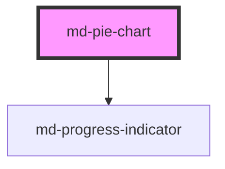

# md-pie-chart

<!-- llm:meta
tag: md-pie-chart
category: charts
status: custom
m3-guidelines: none — M3 has no chart components
form-associated: false
depends-on: md-progress-indicator
used-by: none
engine: in-house Canvas2D + DOM overlay (utils/charts/engine)
-->

**Parts of a single whole.** Pie, donut (`inner-radius`), or nested rings, with
a centre slot for a headline figure and drill-down support.

> ⚠️ **Not a Material Design 3 component.** M3 ships no charts. The engine is
> **in-house Canvas2D with a DOM overlay** (`utils/charts/engine`).

> Setup, theming, density and i18n are configured once for the whole library —
> see [`main-llm.md`](../../../../../main-llm.md), the library-wide guide that ships
> alongside these component docs.

---

## When to use

- **Composition of one whole** with a small number of slices (≈ 2–6).
- A donut with a headline total in the middle (`inner-radius` + `center` slot).
- A breakdown of a breakdown, as nested rings (`children` on a slice).
- A quick "most of it is X" read.

## When NOT to use

| Situation | Use instead |
|---|---|
| More than ~6 categories | `md-bar-chart` |
| Comparing values precisely | `md-bar-chart` |
| Change over time | `md-line-chart` / `md-area-chart` |
| Composition **over time** | `md-area-chart` with `stack="percentage"` |
| Values that don't sum to a meaningful whole | `md-bar-chart` |
| Negative values | `md-bar-chart` — angles can't encode them |
| An inline micro-trend | `md-sparkline` |
| An org / node hierarchy | `md-organization-chart` |

## Decision cues

| Need | Setting |
|---|---|
| Donut | `inner-radius="60%"` |
| Headline figure in the middle | `center` slot (needs a donut) |
| Nested rings | `children` on a slice (+ `ringWidths`, a JS property) |
| Slice labels | `show-labels` (on by default) + `label-mode="value\|name\|both"` |
| Single-hue palette | `monochrome` (bare = `primary`) or `monochrome="tertiary"` |
| Separated slices | `padding-angle="2"` |
| Half-donut / gauge look | `start-angle` / `end-angle` |
| A second dimension per slice | `radius` on the datum (0–1) |
| Highlight behaviour | `highlight="slice\|series\|none"` |
| Drill into a slice | `mdSliceClick` + `await chart.drill(i)` |
| Async data | `loading` (+ `loading-label`) |

## API contract

```html
<md-pie-chart
  label="Traffic by source"
  subtitle="Last 30 days"
  title-align="start|center|end"                 <!-- default: start -->
  inner-radius="0%"                              <!-- default: 0% (a solid pie) -->
  outer-radius="75%"                             <!-- default: 75% -->
  start-angle="90"                               <!-- default: 90 (12 o'clock) -->
  end-angle="-270"                               <!-- default: -270 (a full circle) -->
  padding-angle="0"                              <!-- default: 0 -->
  corner-radius="4"                              <!-- default: 4 -->
  show-labels                                    <!-- default: ON; set show-labels="false" to hide -->
  label-mode="value|name|both"                   <!-- default: unset — resolved per ring, see below -->
  monochrome="primary"                           <!-- default: off; bare attribute = primary -->
  gradient                                       <!-- default: off -->
  highlight="slice|series|none"                  <!-- default: slice -->
  legend="top|bottom|left|right|top-start|top-end|bottom-start|bottom-end|none"
                                                 <!-- default: right -->
  tooltip="item|axis|none"                       <!-- ACCEPTED BUT INERT — see below -->
  locale="en-US"                                 <!-- default: "" (browser locale) -->
  height="320px"                                 <!-- default: aspect-ratio driven (1 / 1) -->
  summary=""                                     <!-- replaces the generated aria-label -->
  loading                                        <!-- default: off -->
  loading-label="Loading chart…"
  label-empty="No data to display"
  label-plot="Chart data. Use the arrow keys to move between slices, Home and End for the first and last, Escape to leave."
  label-point="%label%: %value% (%percent%)"
  animation="expressive|grow|fade|draw|stagger|none"   <!-- default: expressive -->
  animation-duration="700"                       <!-- default: engine default -->
  no-animation                                   <!-- default: off -->
  density="-1|-2|-3|-4"                          <!-- default: 0 (uncompacted) -->
>
  <div slot="center"><strong>12,480</strong><br>visits</div>
</md-pie-chart>
```

Arrays and functions have no attribute form — set them as JS properties:

```js
const chart = document.querySelector('md-pie-chart');

chart.data = [
  { label: 'Organic',  value: 5200 },
  { label: 'Direct',   value: 3900, color: 'tertiary' },
  { label: 'Referral', value: 3380, children: [       // becomes a second ring
    { label: 'Blogs', value: 2000 },
    { label: 'Forums', value: 1380 },
  ] },
];
chart.ringWidths     = [2, 1];                        // inner ring twice as wide
chart.tableLabels    = { category: 'Source', value: 'Visits', share: 'Share' };
chart.valueFormatter = (v) => new Intl.NumberFormat('en-US').format(v);
chart.tooltipRenderer = (ctx) => {
  const hovered = ctx.series.find((s) => s.focused);
  return `${ctx.axisLabel}: ${hovered?.formattedValue ?? ''}`;
};
```

Each datum (`MdPieDatum`): `label` and `value` are required; `color`, `id`,
`selected` (drawn exploded), `hidden`, `radius` (0–1, a second dimension) and
`children` (a nested ring) are optional.

**Events** — `mdSliceClick` (`MdChartClickDetail<MdPieDatum>`), `mdLegendClick`
(`{ dataIndex, selected }` — note this differs from the other charts, which
report `seriesIndex`), `mdReady`. All are the Stencil default — they bubble and
cross shadow boundaries. There is **no `mdHover` and no `mdZoom`** here.

**Methods** — `resize()`, `replay()`, `drill(index, direction?)`,
`toDataURL()`, `getInstance()`. All are async. There is no `setZoom()` /
`resetZoom()` — a ring has no span to zoom.

**Slots** — `header` (above the chart), `center` (inside the donut hole),
`footer` (below), `empty` (replaces `label-empty`), and `loader` (replaces the
built-in spinner; `loading` is the older alias for the same slot — `loader`
wins if both are filled).

**Parts** — `header`, `canvas`, `center`, `empty`, `loading`, `footer`. The
engine additionally marks the `<canvas>` as `plot-canvas` and the DOM overlay's
legend and hover card as `legend` and `tooltip`.

### Behavioral contract worth knowing

- **The data prop is `data`, not `series`** — unlike the other four charts. It
  is a flat array of `{ label, value }` objects, set as a JS property.
- The **`center` slot only makes sense with a donut** (`inner-radius` > 0); with
  a solid pie the content sits over the slices. It is `aria-hidden="true"`, so
  whatever it says must also exist in the surrounding copy.
- **`show-labels` is ON by default** here (the other charts default it off).
  `label-mode` is undefined by default and resolves **per ring**, not once for
  the chart:
  - single ring **with** a legend → `value`, drawn inside the slice;
  - single ring **without** a legend → `both` (`name · value`), outside on a
    leader line;
  - nested rings → the innermost ring labels as `name` (inside), the outermost
    as `both` (outside, on a leader), and the rings in between are not labelled
    at all — there is no room in the band.

  Setting `label-mode` explicitly overrides all of that, everywhere.
- **`tooltip` is inert on this component.** The prop exists for parity with the
  other four charts, but nothing reads it: the hover card is always on, and
  `tooltip="none"` will **not** suppress it. Change what the card says with
  `tooltipRenderer`; there is no switch to turn it off.
- **`monochrome` present with no value means `primary`.** Absent means off — so
  `monochrome=""` is the "on, with the default" case, not an accident.
- A slice's `children` are drawn as a further ring subdividing exactly that
  slice's arc, to arbitrary depth. Children are taken in proportion to each
  other, so they need not add up to the parent's value. `ringWidths` (relative
  weights, innermost first) divides the radial band between rings.
- **Legend toggles survive a data re-feed**; setting `hidden` on a datum takes
  visibility back from the reader. A hidden slice keeps its legend chip (struck
  through) but contributes nothing to the ring.
- **`drill()` must be awaited before the swap.** Like every Stencil `@Method` it
  resolves through a microtask, so a bare call lands *after* an assignment on the
  next line and the swap renders un-animated:
  `await chart.drill(i); chart.data = next;` For `'up'`, the index names a slice
  of the data about to be shown.
- `start-angle` / `end-angle` default to `90` / `-270` — a full circle starting
  at the top. A 180° span gives a gauge look.
- Slices assume **non-negative** values that sum to a meaningful whole.
- `label-point` uses **`%label%`, `%value%` and `%percent%`** — note these differ
  from the other charts' `%x%` / `%values%`.
- Call `resize()` after a container reveal; gate `toDataURL()` on `mdReady`.
- `getInstance()` returns the underlying engine. It is an escape hatch; anything
  done through it is outside this component's contract.
- Charts re-read the theme tokens and repaint on their own when
  `prefers-color-scheme` changes. Any *other* theme swap (a manual light/dark
  class, a brand-token change) needs a nudge: reassign `data`. `resize()` will not
  do it — it returns early when the box has not changed.

---

## Do / Don't

House rules — M3 ships no chart component, so the guidance below is this
library's own.

| ✅ Do | ❌ Don't |
|---|---|
| Keep to about 2–6 slices | Don't render a dozen slivers — use a bar chart |
| Group the tail into "Other" | Don't show fifteen 1% slices |
| Use a donut with a centre total when the total matters | Don't put content in the centre of a solid pie |
| Order slices by size (largest first) | Don't use an arbitrary order |
| Label slices or provide a legend | Don't rely on colour alone |
| Use it only when values sum to a whole | Don't pie-chart unrelated quantities |
| Use a bar chart when precise comparison matters | Don't ask readers to compare similar angles |
| Honour reduced motion | Don't force the entrance animation |
| Provide a data table alternative | Don't make the chart the only access |

---

## Patterns

```html
<md-pie-chart id="c" label="Traffic by source" inner-radius="60%" height="320px">
  <div slot="center"><strong>12,480</strong><br>visits</div>
</md-pie-chart>

<script type="module">
  const c = document.getElementById('c');
  c.data = [
    { label: 'Organic',  value: 5200 },
    { label: 'Direct',   value: 3900 },
    { label: 'Referral', value: 2100 },
    { label: 'Other',    value: 1280 },
  ];
  c.valueFormatter = (v) => new Intl.NumberFormat('en-US').format(v);
  c.addEventListener('mdReady', () => console.log('drawn'));
</script>
```

```html
<!-- Drill into a slice -->
<md-pie-chart id="d" label="Traffic by source"></md-pie-chart>
<script type="module">
  const d = document.getElementById('d');
  d.data = [
    { label: 'Organic', value: 5200, id: 'organic' },
    { label: 'Direct',  value: 3900, id: 'direct' },
  ];

  d.addEventListener('mdSliceClick', async (e) => {
    await d.drill(e.detail.dataIndex);          // await, THEN swap
    d.data = [
      { label: 'Search', value: 3100 },
      { label: 'Images', value: 2100 },
    ];
  });
</script>
```

```html
<!-- Labels on the slices -->
<md-pie-chart show-labels label-mode="both"></md-pie-chart>

<!-- Single-hue, separated slices -->
<md-pie-chart monochrome padding-angle="2"></md-pie-chart>

<!-- Gauge-style half donut -->
<md-pie-chart inner-radius="70%" start-angle="180" end-angle="0"></md-pie-chart>

<!-- Async -->
<md-pie-chart loading loading-label="Loading traffic…"></md-pie-chart>
```

## Anti-patterns

| ❌ Wrong | ✅ Right | Why |
|---|---|---|
| `chart.series = [...]` | `chart.data = [...]` | Pie uses `data`, unlike the other charts. |
| `<md-pie-chart data='[…]'>` | Assign the array in JS | Arrays don't cross the attribute boundary. |
| `center` slot on a solid pie | Set `inner-radius` first | Content would sit over the slices. |
| Relying on the `center` slot to announce the total | Repeat it in page copy | The centre overlay is `aria-hidden`. |
| `chart.drill(i); chart.data = next;` | `await chart.drill(i)` first | The method resolves a microtask later, so the swap renders un-animated. |
| `e.detail.seriesIndex` on `mdLegendClick` | `e.detail.dataIndex` | Pie's legend detail is `{ dataIndex, selected }`. |
| Listening for `mdHover` / calling `setZoom()` | Neither exists here | Pie has no hover event and no zoom. |
| Twelve slices | Group into "Other", or use `md-bar-chart` | Slivers are unreadable. |
| `<md-pie-chart tooltip="none">` | Nothing — the hover card can't be turned off here | `tooltip` is declared but never read on this component. |
| Negative values | `md-bar-chart` | Angles can't encode sign. |
| `%x%` in `label-point` | `%label%` / `%value%` / `%percent%` | Different tokens from the other charts. |
| `toDataURL()` before `mdReady` | Wait for the event | Nothing drawn yet. |
| Chart in a hidden tab with no `resize()` | Call it on reveal | Renders at zero size. |

## Accessibility, RTL, density, i18n

**Accessibility**
- The host is `role="figure"` with a generated `aria-label` summary (`summary`
  replaces it wholesale), and the chart is a focusable `role="application"`
  region named by `label-plot`. Arrow keys move a keyboard cursor between
  slices, Home/End jump to the ends, Escape leaves; each move is announced
  through a polite live region built from `label-point`.
- A screen-reader-only data table is rendered inside the component;
  `tableLabels` translates its `category` / `value` / `share` headings.
- Pie charts are the hardest chart type to read non-visually **and** visually —
  **always** offer the numbers as a table or list.
- The `center` slot is `aria-hidden="true"`; anything it says must be in the
  page text too.
- Never distinguish slices by colour alone: use `show-labels` with
  `label-mode="both"`, or a legend with values.
- `monochrome` produces a single-hue ramp, which is harder to tell apart —
  pair it with labels.
- `loading` sets `aria-busy="true"` and names the overlay with `loading-label`.
- The engine already honours `prefers-reduced-motion`; `no-animation` turns the
  entrance off outright.

**RTL** — the header, footer and centre overlay are DOM and follow `dir`. The
ring itself is **not** mirrored: slice order and sweep direction stay as
configured, which is correct for a shape with no reading direction. The legend
**is** mirrored, and unlike the cartesian charts it mirrors *every* anchor,
physical ones included. Under `dir="rtl"`, `legend="right"` lays out on the
physical **left**, `legend="left"` on the right, `top-start` becomes `top-end`,
`bottom-end` becomes `bottom-start`; plain `top` / `bottom` have no side to
swap. (`md-bar-chart`, `md-line-chart` and `md-area-chart` differ: there
`left` / `right` keep the side they name.)

**Density** — `density="-1"` through `density="-4"` tighten the padding, corner
radius and minimum height. Rung `0` is the uncompacted default and has no rule
of its own. To step *out* of an inherited `data-density` rung, set
`style="--md-sys-density-scale: 0"` — `density="0"` will not do it.

**i18n** — set `locale` for the default number formatting, or take it over with
`valueFormatter`, which always wins. Translate `label`, `subtitle`, `summary`,
`label-empty`, `loading-label`, `label-plot`, `label-point` (keeping `%label%` /
`%value%` / `%percent%`) and `tableLabels`.

## Related components

`md-bar-chart` · `md-area-chart` · `md-line-chart` · `md-sparkline` ·
`md-progress-indicator`

## Theming

| Custom property | Purpose | Default |
|---|---|---|
| `--md-pie-chart-block-size` | Explicit chart height | `auto` |
| `--md-pie-chart-min-block-size` | Floor the height never drops below | `max(140px, 200px + density × 12px)` |
| `--md-pie-chart-aspect-ratio` | Ratio used when no block-size is set | `1 / 1` (square) |
| `--md-pie-chart-background` | Chart surface fill | `--md-sys-color-surface-container-low` |
| `--md-pie-chart-padding` | Inset between host edge and canvas | `max(8px, 16px + density × 2px)` |
| `--md-pie-chart-shape` | Corner radius of the chart surface | `max(8px, 16px + density × 2px)` |
| `--md-pie-chart-center-color` | Text colour of the donut centre | `--md-sys-color-on-surface` |
| `--md-pie-chart-empty-color` | Empty-state text colour | `--md-sys-color-on-surface-variant` |
| `--md-pie-chart-empty-background` | Empty-state overlay fill | the chart background |
| `--md-pie-chart-empty-font` | Empty-state font family | body-medium family |
| `--md-pie-chart-empty-font-size` | Empty-state font size | body-medium size (14px) |
| `--md-pie-chart-empty-icon-size` | Icon slotted into the empty state | `40px` |

Slice colours come from the MD3 palette, not from these properties: set a
datum's `color` to an MD3 role (`'primary'`, `'tertiary'`, `'success'`, …) or
any CSS colour, or switch the whole ring to one hue with `monochrome`.

**CSS parts** — `header`, `canvas`, `center`, `empty`, `loading`, `footer`,
plus the engine-set `plot-canvas`, `legend` and `tooltip`.

```css
md-pie-chart {
  --md-pie-chart-background: transparent;
  --md-pie-chart-center-color: var(--md-sys-color-primary);
}
```

<!-- Auto Generated Below -->


## Properties

| Property            | Attribute            | Description                                                                                                                                                                                                                                                                                                                                                                                                                                                                                                                                                                                             | Type                                                                                                             | Default                                                                                                          |
| ------------------- | -------------------- | ------------------------------------------------------------------------------------------------------------------------------------------------------------------------------------------------------------------------------------------------------------------------------------------------------------------------------------------------------------------------------------------------------------------------------------------------------------------------------------------------------------------------------------------------------------------------------------------------------- | ---------------------------------------------------------------------------------------------------------------- | ---------------------------------------------------------------------------------------------------------------- |
| `animation`         | `animation`          | Entry-animation variant: `expressive` (default), `grow`, `fade`, `draw`, or `none`.                                                                                                                                                                                                                                                                                                                                                                                                                                                                                                                     | `"draw" \| "expressive" \| "fade" \| "grow" \| "none" \| "stagger"`                                              | `'expressive'`                                                                                                   |
| `animationDuration` | `animation-duration` | Entry-animation duration override in ms (≤ 0 disables).                                                                                                                                                                                                                                                                                                                                                                                                                                                                                                                                                 | `number \| undefined`                                                                                            | `undefined`                                                                                                      |
| `cornerRadius`      | `corner-radius`      | Border radius applied to each slice (reserved).                                                                                                                                                                                                                                                                                                                                                                                                                                                                                                                                                         | `number`                                                                                                         | `4`                                                                                                              |
| `data`              | --                   |                                                                                                                                                                                                                                                                                                                                                                                                                                                                                                                                                                                                         | `MdPieDatum[]`                                                                                                   | `[]`                                                                                                             |
| `density`           | `density`            | Local density rung. Drives the same `--md-sys-density-scale` signal that a global `data-density` ancestor sets, so a local value simply overrides the inherited one. 0 = default, -4 = ultra-compact.                                                                                                                                                                                                                                                                                                                                                                                                   | `-1 \| -2 \| -3 \| -4 \| 0`                                                                                      | `0`                                                                                                              |
| `endAngle`          | `end-angle`          | End angle in degrees.                                                                                                                                                                                                                                                                                                                                                                                                                                                                                                                                                                                   | `number`                                                                                                         | `-270`                                                                                                           |
| `gradient`          | `gradient`           | Fill each slice with a gradient running outward from the centre, for depth. Purely decorative — it changes nothing about what a slice means, which is why it is off by default.                                                                                                                                                                                                                                                                                                                                                                                                                         | `boolean`                                                                                                        | `false`                                                                                                          |
| `heightProp`        | `height`             |                                                                                                                                                                                                                                                                                                                                                                                                                                                                                                                                                                                                         | `string \| undefined`                                                                                            | `undefined`                                                                                                      |
| `highlight`         | `highlight`          | Hover highlight scope: slice / series / none.                                                                                                                                                                                                                                                                                                                                                                                                                                                                                                                                                           | `"none" \| "series" \| "slice"`                                                                                  | `'slice'`                                                                                                        |
| `innerRadius`       | `inner-radius`       | Inner radius (`"0%"` = pie, `"60%"` = donut, or px number).                                                                                                                                                                                                                                                                                                                                                                                                                                                                                                                                             | `number \| string`                                                                                               | `'0%'`                                                                                                           |
| `label`             | `label`              |                                                                                                                                                                                                                                                                                                                                                                                                                                                                                                                                                                                                         | `string`                                                                                                         | `''`                                                                                                             |
| `labelEmpty`        | `label-empty`        | Message shown when `data` is empty. The `empty` slot overrides it.                                                                                                                                                                                                                                                                                                                                                                                                                                                                                                                                      | `string`                                                                                                         | `'No data to display'`                                                                                           |
| `labelMode`         | `label-mode`         | What each slice's label says: its `value`, its `name`, or `both`. Defaults to the value when a legend is present (it already names the slices) and to both when there isn't one.                                                                                                                                                                                                                                                                                                                                                                                                                        | `"both" \| "name" \| "value" \| undefined`                                                                       | `undefined`                                                                                                      |
| `labelPlot`         | `label-plot`         | Instructions announced when the plot receives keyboard focus. The plot is focusable so a keyboard user can walk the slices; this is what tells them.                                                                                                                                                                                                                                                                                                                                                                                                                                                    | `string`                                                                                                         | `'Chart data. Use the arrow keys to move between slices, Home and End for the first and last, Escape to leave.'` |
| `labelPoint`        | `label-point`        | Template for the live announcement as focus moves. `%label%` is the slice name, `%value%` its formatted value and `%percent%` its share.                                                                                                                                                                                                                                                                                                                                                                                                                                                                | `string`                                                                                                         | `'%label%: %value% (%percent%)'`                                                                                 |
| `legend`            | `legend`             |                                                                                                                                                                                                                                                                                                                                                                                                                                                                                                                                                                                                         | `"bottom" \| "bottom-end" \| "bottom-start" \| "left" \| "none" \| "right" \| "top" \| "top-end" \| "top-start"` | `'right'`                                                                                                        |
| `loading`           | `loading`            | Show the loading overlay instead of the chart.                                                                                                                                                                                                                                                                                                                                                                                                                                                                                                                                                          | `boolean`                                                                                                        | `false`                                                                                                          |
| `loadingLabel`      | `loading-label`      | Text (and the spinner's accessible name) for the loading overlay.                                                                                                                                                                                                                                                                                                                                                                                                                                                                                                                                       | `string`                                                                                                         | `'Loading chart…'`                                                                                               |
| `locale`            | `locale`             | BCP-47 locale for the DEFAULT number formatting (tooltip values, the screen-reader table). Empty follows the browser, which is the right default only until the page has said otherwise; an explicit `valueFormatter` always wins over it.                                                                                                                                                                                                                                                                                                                                                              | `string`                                                                                                         | `''`                                                                                                             |
| `monochrome`        | `monochrome`         | Render every slice as a shade of ONE colour instead of the categorical palette — darkest first, lightening around the ring.  Worth reaching for when the slices are ordered (a ranking, a funnel) rather than merely different: a single hue stops the reader hunting for meaning in colour that isn't there, and it survives most colour-vision deficiencies, which a five-hue palette does not.  Takes an MD3 role or any CSS colour. Present with no value (`monochrome`) uses `primary`; absent means off — so an explicit empty string is the "on, with the default" case rather than an accident. | `string \| undefined`                                                                                            | `undefined`                                                                                                      |
| `noAnimation`       | `no-animation`       | Disable all animation (shorthand for `animation="none"`).                                                                                                                                                                                                                                                                                                                                                                                                                                                                                                                                               | `boolean`                                                                                                        | `false`                                                                                                          |
| `outerRadius`       | `outer-radius`       | Outer radius. Defaults to `"75%"`.                                                                                                                                                                                                                                                                                                                                                                                                                                                                                                                                                                      | `number \| string`                                                                                               | `'75%'`                                                                                                          |
| `paddingAngle`      | `padding-angle`      | Padding angle (degrees) between adjacent slices.                                                                                                                                                                                                                                                                                                                                                                                                                                                                                                                                                        | `number`                                                                                                         | `0`                                                                                                              |
| `ringWidths`        | --                   | How the radial band is divided between the rings of a nested chart — relative weights, innermost first. `[2, 1]` gives the inner ring twice the width of the outer one.  The default is not an even split: every ring but the outermost puts its labels INSIDE its own band, so it has to be wide enough to hold a word, while the outermost labels on leaders and needs no more than its arc.                                                                                                                                                                                                          | `number[] \| undefined`                                                                                          | `undefined`                                                                                                      |
| `showLabels`        | `show-labels`        | Show slice labels around the ring.                                                                                                                                                                                                                                                                                                                                                                                                                                                                                                                                                                      | `boolean`                                                                                                        | `true`                                                                                                           |
| `startAngle`        | `start-angle`        | Start angle in degrees (90 = 12-o'clock).                                                                                                                                                                                                                                                                                                                                                                                                                                                                                                                                                               | `number`                                                                                                         | `90`                                                                                                             |
| `subtitle`          | `subtitle`           | Sub-title, drawn under the title in the muted text colour.                                                                                                                                                                                                                                                                                                                                                                                                                                                                                                                                              | `string \| undefined`                                                                                            | `undefined`                                                                                                      |
| `summary`           | `summary`            | Replaces the generated `aria-label` outright. The default summary is assembled in English; rather than translate it piecewise, hand over the whole sentence built in your own language.                                                                                                                                                                                                                                                                                                                                                                                                                 | `string`                                                                                                         | `''`                                                                                                             |
| `tableLabels`       | --                   | Translatable chrome for the screen-reader data table.                                                                                                                                                                                                                                                                                                                                                                                                                                                                                                                                                   | `undefined \| { category?: string \| undefined; value?: string \| undefined; share?: string \| undefined; }`     | `undefined`                                                                                                      |
| `titleAlign`        | `title-align`        | Title alignment over the chart: `start` (left), `center`, or `end` (right).                                                                                                                                                                                                                                                                                                                                                                                                                                                                                                                             | `"center" \| "end" \| "start"`                                                                                   | `'start'`                                                                                                        |
| `tooltip`           | `tooltip`            |                                                                                                                                                                                                                                                                                                                                                                                                                                                                                                                                                                                                         | `"axis" \| "item" \| "none"`                                                                                     | `'item'`                                                                                                         |
| `tooltipRenderer`   | --                   | Replace the tooltip's content. See `md-line-chart`'s `tooltipRenderer`.                                                                                                                                                                                                                                                                                                                                                                                                                                                                                                                                 | `((context: MdChartTooltipContext) => MdChartTooltipContent) \| undefined`                                       | `undefined`                                                                                                      |
| `valueFormatter`    | --                   |                                                                                                                                                                                                                                                                                                                                                                                                                                                                                                                                                                                                         | `((value: number) => string) \| undefined`                                                                       | `undefined`                                                                                                      |


## Events

| Event           | Description | Type                                                     |
| --------------- | ----------- | -------------------------------------------------------- |
| `mdLegendClick` |             | `CustomEvent<{ dataIndex: number; selected: boolean; }>` |
| `mdReady`       |             | `CustomEvent<void>`                                      |
| `mdSliceClick`  |             | `CustomEvent<MdChartClickDetail<MdPieDatum>>`            |


## Methods

### `drill(index: number, direction?: "down" | "up") => Promise<void>`

Animate the next `data` change as a drill through one slice, so the levels
of a hierarchy read as connected rather than as unrelated charts.

AWAIT it, then assign the new `data`. Like every Stencil `@Method` this one
resolves through a microtask, so a bare call lands AFTER a `data` assignment
on the next line — the swap renders un-animated and the drill arms itself
for whatever change comes after.

```ts
await chart.drill(e.detail.dataIndex);          // descend into the clicked slice
chart.data = childrenOf(clicked);

await chart.drill(indexOfChildInParent, 'up');  // …and back out of it
chart.data = parentLevel;
```

`down` names a slice of the data currently shown; `up` names a slice of the
data about to be shown — in both cases, the wedge that connects the two
levels. The new ring unfurls out of it, which run in reverse is what makes
coming back up read as zooming out of that same wedge. Falls back to a plain
swap when the index doesn't resolve, or under `prefers-reduced-motion`.

#### Parameters

| Name        | Type             | Description |
| ----------- | ---------------- | ----------- |
| `index`     | `number`         |             |
| `direction` | `"up" \| "down"` |             |

#### Returns

Type: `Promise<void>`


### `getInstance() => Promise<PieChartEngine | null>`


#### Returns

Type: `Promise<PieChartEngine | null>`


### `replay() => Promise<void>`

Replay the entry animation from the start (uses the current `animation`).

#### Returns

Type: `Promise<void>`


### `resize() => Promise<void>`


#### Returns

Type: `Promise<void>`


### `toDataURL() => Promise<string>`


#### Returns

Type: `Promise<string>`


## Shadow Parts

| Part        | Description |
| ----------- | ----------- |
| `"canvas"`  |             |
| `"center"`  |             |
| `"empty"`   |             |
| `"footer"`  |             |
| `"header"`  |             |
| `"loading"` |             |


## Dependencies

### Depends on

- [md-progress-indicator](../md-progress-indicator)

### Graph


----------------------------------------------

*Built with [StencilJS](https://stenciljs.com/)*
