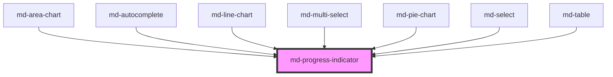

# md-progress-indicator

<!-- llm:meta
tag: md-progress-indicator
category: status
status: md3-mapped
m3-guidelines: https://m3.material.io/components/progress-indicators/guidelines
form-associated: false
depends-on: none
used-by: md-area-chart, md-autocomplete, md-line-chart, md-multi-select, md-pie-chart, md-select, md-table
-->

**How far along an activity is.** Linear or circular, determinate or
indeterminate, with the M3 Expressive wave treatment and four-colour mode.

> Setup, theming, density and i18n are configured once for the whole library —
> see [`main-llm.md`](../../../../../main-llm.md) at the repo root.

---

## When to use

- A **determinate** operation whose progress you can measure: upload, import,
  multi-step job.
- A short **indeterminate** wait where the shape of the incoming content is
  unknown.
- Overall progress of a **group** of items.

## When NOT to use

| Situation | Use instead |
|---|---|
| Loading structured content whose shape you know | `md-skeleton` |
| A page-level refresh / brand loading moment | `md-loading-indicator` |
| A button working after a click | `md-button loading` |
| Per-item progress inside a group | Nothing — M3: show the group total instead |
| A rating or score | `md-rating` |
| A static level or gauge reading (disk, battery, score) | `md-meter` |
| A value the user sets | `md-slider` |

## Decision cues

| Need | Setting |
|---|---|
| Inline bar under a header or row | `variant="linear"` (default) |
| Compact spinner | `variant="circular"` |
| Known progress | `value` + `max` |
| Unknown duration | `indeterminate` |
| Short wait (<5s), unknown duration | `variant="circular"` + `indeterminate` — M3's advice |
| Expressive wave motion | `wave` (+ `wave-amplitude` / `wave-length` / `wave-speed`) |
| Multi-colour cycling | `four-color` — **only** with `variant="circular" indeterminate` and no `wave` |
| Explicit sizing | `size` (circular only), `thickness` |
| Play the closing animation and get told when it ends | set `complete`, listen for `mdComplete` |

## API contract

The authoritative, generated property/event tables are at the bottom of this
file. This is the short form an implementer needs.

```html
<md-progress-indicator
  variant="linear|circular"     <!-- default: linear -->
  value="42"                    <!-- default: 0 -->
  max="100"                     <!-- default: 100 -->
  indeterminate                 <!-- default: false -->
  thickness="4"                 <!-- dp; default: 4 -->
  size="0"                      <!-- circular outer dp; 0 = auto; clamped 24-240 -->
  wave                          <!-- default: false -->
  wave-amplitude="0"            <!-- dp; 0 = auto (linear 3, circular 1.6) -->
  wave-length="0"               <!-- dp; 0 = auto (linear 40, circular 15) -->
  wave-speed="0"                <!-- dp/s; 0 = auto (= wavelength) -->
  four-color                    <!-- default: false -->
  label="Uploading"             <!-- default: "Progress" -->
  complete                      <!-- default: false -->
  density="-1|-2|-3|-4"         <!-- default: 0 (uncompacted) -->
></md-progress-indicator>
```

**Event** — `mdComplete` (`CustomEvent<void>`, bubbles and composed). It fires
when the **closing animation you triggered with `complete` has finished** — it
is *not* fired by `value` reaching `max`.

**Methods** — none.

**Slots** — none; the component renders no `<slot>`. Put your own caption text
in a sibling element.

**Parts** — `track`, `active-indicator`, `stop-indicator` (the stop dot exists
only on the linear determinate variant).

### Behavioral contract worth knowing

- `value` is interpreted against `max` (default `100`) — pass a raw count with
  a matching `max` rather than pre-computing a percentage. The fraction is
  clamped to `[0, 1]`.
- `indeterminate` **overrides** `value`; setting both silently ignores the
  number, and `aria-valuenow` is dropped entirely while indeterminate.
- **`mdComplete` only follows `complete`.** Reaching `value === max` changes
  nothing on its own — you must set `complete = true` to play the closing
  animation and get the event.
- `complete` is a **no-op while `indeterminate`**, and it is one-shot: once the
  sequence has run, re-setting it does nothing.
- After `complete` finishes, the host is hidden (`visibility: hidden`) — with
  one exception: the **flat (non-`wave`) circular** variant instead rests
  showing its empty track ring.
- `size` and the three `wave-*` props default to `0`, meaning "use the
  component default", **not** zero-sized / zero-amplitude. `size` applies to
  the circular variant only and is clamped to the M3 range 24–240 dp.
- `thickness` density-scales only while it is left at its default `4`. Any
  explicit `thickness` is used verbatim and ignores the density rung.
- `four-color` is honoured **only** on `variant="circular"` +
  `indeterminate` + no `wave`. On any other combination the attribute reflects
  but changes nothing.
- The **linear host stretches to 100% of its parent's inline size** and is only
  as tall as the track; the circular host is `inline-flex` and sized by `size`.
  Constrain the linear width with the parent, not with a width on the host.
- `label` (default English `"Progress"`) becomes `aria-label`; an empty `label`
  leaves the host with no accessible name.
- The **stop indicator** is the small dot at the linear track's end. M3 says
  keep it unless the track has ≥3:1 contrast with the surrounding surface.
- Under `prefers-reduced-motion: reduce` the wave flattens to a straight
  indicator and the indeterminate animations slow down; nothing stops entirely,
  so progress is still conveyed.

---

## Do / Don't

Sourced from [M3 · Progress indicators · Guidelines](https://m3.material.io/components/progress-indicators/guidelines).

| ✅ Do | ❌ Don't |
|---|---|
| Indicate the overall progress of a group of items | Don't show progress for each activity in a group |
| Use a stop indicator when the indicator sits in a low-contrast container | Only remove the end stop indicator when contrast with the surroundings is ≥3:1 |
| Use **circular** indicators for short indeterminate activities under 5 seconds | Don't use a long-running circular spinner where a linear bar with real progress would inform better |
| Keep one progress indicator per activity | Avoid applying progress indicators to every button in a list |
| Move from indeterminate to determinate once you know the total | Don't keep guessing when you have real numbers |
| Give it a meaningful `label` | Don't ship the default "Progress" in a localized app |
| Show completion, then remove it | Don't leave a finished bar sitting at 100% forever |

---

## Patterns

```html
<!-- Determinate upload. Note: mdComplete follows `complete`, not value===max. -->
<md-progress-indicator id="up" value="0" max="100" label="Uploading">
</md-progress-indicator>

<script type="module">
  const up = document.getElementById('up');
  const xhr = new XMLHttpRequest();

  xhr.upload.addEventListener('progress', (e) => {
    up.max = e.total;
    up.value = e.loaded;
  });

  xhr.addEventListener('load', () => {
    up.complete = true;               // plays the closing animation
  });

  up.addEventListener('mdComplete', () => up.remove());  // fires when it ends

  xhr.open('POST', '/upload');
  xhr.send(new FormData(document.querySelector('form')));
</script>
```

```html
<!-- Short indeterminate wait -->
<md-progress-indicator variant="circular" indeterminate label="Loading">
</md-progress-indicator>

<!-- Four-colour spinner: circular + indeterminate + no wave is the only
     combination that cycles colours -->
<md-progress-indicator variant="circular" indeterminate four-color label="Syncing">
</md-progress-indicator>

<!-- Expressive wave on a determinate linear bar -->
<md-progress-indicator wave value="60" max="100" label="Rendering">
</md-progress-indicator>

<!-- Group total, not per item -->
<md-progress-indicator value="3" max="12" label="Importing 12 files">
</md-progress-indicator>
```

```html
<!-- Start indeterminate, switch to determinate once the total is known -->
<md-progress-indicator id="job" indeterminate label="Preparing">
</md-progress-indicator>

<script type="module">
  const job = document.getElementById('job');
  const total = await getTotal();
  job.indeterminate = false;   // must clear it — it overrides value
  job.max = total;
  job.value = 0;
  job.label = `Importing ${total} files`;
</script>
```

## Anti-patterns

| ❌ Wrong | ✅ Right | Why |
|---|---|---|
| Waiting for `mdComplete` after `value = max` | Set `complete = true`, then listen | The event follows the closing animation, not the value. |
| `indeterminate` together with a live `value` | Clear `indeterminate` first | It overrides `value` silently. |
| `complete` on an indeterminate indicator | Clear `indeterminate` first | `complete` is a no-op while indeterminate. |
| `four-color` on a linear or wavy indicator | `variant="circular" indeterminate` without `wave` | That's the only combination the colour cycle applies to. |
| `size` on a linear indicator | Size the parent; use `thickness` for the bar | `size` is circular-only. |
| `size="0"` expecting an invisible indicator | `0` means "default" | Use CSS to hide it. |
| Setting `thickness` and expecting it to follow density | Leave `thickness` unset | Only the default 4 dp density-scales. |
| Pre-computing a percentage into `value` with `max="100"` | Pass the raw count and real `max` | Simpler and avoids rounding drift. |
| A progress bar per row in a list | One indicator for the group | M3 explicit rule. |
| A spinner for a 20-second determinate job | Linear + real `value` | Users need the estimate. |
| Removing the stop indicator on a low-contrast surface | Keep it, or verify ≥3:1 | M3 explicit rule. |
| Default English `label` in a localized app | Translate it | It's the accessible name. |
| Leaving a completed bar on screen | Remove it or show a result | Otherwise it reads as stalled. |
| Using it for a known-shape content load | `md-skeleton` | Better perceived performance. |

## Accessibility, RTL, density, i18n

**Accessibility**
- The host carries `role="progressbar"`, `aria-label` (from `label`),
  `aria-valuemin="0"`, `aria-valuemax` (from `max`) and `aria-valuenow` (from
  the clamped `value`). `aria-valuenow` is **omitted while `indeterminate`**,
  which is what tells assistive tech the duration is unknown.
- Everything inside the shadow root is `aria-hidden` — the host is the only
  accessible node, so don't try to label the internal parts.
- `label` is the accessible name — always set it to something specific
  ("Uploading invoice.pdf" beats "Progress").
- Determinate indicators expose their value; for long operations also surface a
  textual percentage or count near the bar, since not everyone tracks a moving
  indicator.
- Reduced motion is honoured automatically (the wave flattens, indeterminate
  motion slows); you do not need to gate the component yourself.
- Don't rely on colour alone for completion; pair with text or an icon.
- Keep the stop indicator unless contrast is verified.

**RTL** — the linear track, fill and stop dot all anchor to the reading start
and mirror under `dir="rtl"`, determinate and indeterminate alike.

**Density** — `density="-1…-4"` locally overrides the inherited `data-density`
rung, thinning the track and shrinking the default circular size and stop dot.
Rung `0` is the uncompacted default and is inert — it does **not** opt an
indicator out of an inherited rung; for that, set
`style="--md-sys-density-scale: 0"` on the element. An explicit `thickness` or
`size` opts that dimension out of density scaling entirely.

**i18n** — translate `label`. Format any accompanying percentage or counts with
`Intl.NumberFormat`.

## Related components

`md-loading-indicator` · `md-skeleton` · `md-meter` · `md-button` (its
`loading` state) · `md-slider`

## Theming

| Custom property | Purpose | Default |
|---|---|---|
| `--md-progress-indicator-active-indicator-color` | Filled portion | `--md-sys-color-primary` |
| `--md-progress-indicator-active-indicator-shape` | Filled-portion radius | Follows the track shape |
| `--md-progress-indicator-track-color` | Track background | `--md-sys-color-secondary-container` |
| `--md-progress-indicator-track-shape` | Track radius | `--md-sys-shape-corner-full` |
| `--md-progress-indicator-stop-indicator-color` | Stop-dot colour | `--md-sys-color-primary` |
| `--md-progress-indicator-stop-indicator-shape` | Stop-dot radius | `--md-sys-shape-corner-full` |
| `--md-progress-indicator-stop-indicator-size` | Stop-dot diameter | `4px`, density-scaled, clamped to the track thickness |
| `--md-progress-indicator-stop-indicator-trailing-space` | Space past the stop dot to the trailing edge | `0px` |
| `--md-progress-indicator-track-active-indicator-space` | Gap between track and fill | `4px`, density-scaled |
| `--md-progress-indicator-four-color-1` … `-4` | `four-color` cycle | `primary`, `primary-container`, `tertiary`, `tertiary-container` |

**CSS parts** — `track`, `active-indicator`, `stop-indicator`.

```css
md-progress-indicator.brand {
  --md-progress-indicator-active-indicator-color: var(--md-sys-color-tertiary);
  --md-progress-indicator-track-color: var(--md-sys-color-tertiary-container);
}
```

<!-- Auto Generated Below -->


## Properties

| Property        | Attribute        | Description                                                                                                                                                                                                                                                                                                                                           | Type                        | Default      |
| --------------- | ---------------- | ----------------------------------------------------------------------------------------------------------------------------------------------------------------------------------------------------------------------------------------------------------------------------------------------------------------------------------------------------- | --------------------------- | ------------ |
| `complete`      | `complete`       | Set to `true` to trigger the completion ("closing TV") animation. After it plays, the indicator self-hides (`visibility:hidden`) and emits `mdComplete` — EXCEPT the flat (non-wavy) circular variant, which instead rests showing its empty track ring (the active indicator erases away and the track fades in). No-op on indeterminate indicators. | `boolean`                   | `false`      |
| `density`       | `density`        | Local density rung. Drives the same `--md-sys-density-scale` signal that a global `data-density` ancestor sets, so a local value simply overrides the inherited one. 0 = default, -4 = ultra-compact.                                                                                                                                                 | `-1 \| -2 \| -3 \| -4 \| 0` | `0`          |
| `fourColor`     | `four-color`     | Four-color cycling animation (circular indeterminate only).                                                                                                                                                                                                                                                                                           | `boolean`                   | `false`      |
| `indeterminate` | `indeterminate`  | Indeterminate mode — looping animation when progress is unknown.                                                                                                                                                                                                                                                                                      | `boolean`                   | `false`      |
| `label`         | `label`          | Accessible label for screen readers.                                                                                                                                                                                                                                                                                                                  | `string`                    | `'Progress'` |
| `max`           | `max`            | Maximum progress value.                                                                                                                                                                                                                                                                                                                               | `number`                    | `100`        |
| `size`          | `size`           | Circular indicator outer size in dp. `0` = auto (non-wavy 40dp, wavy 48dp per the M3 expressive spec). Clamped to the M3 range 24–240dp.                                                                                                                                                                                                              | `number`                    | `0`          |
| `thickness`     | `thickness`      | Track / stroke thickness in dp.                                                                                                                                                                                                                                                                                                                       | `number`                    | `4`          |
| `value`         | `value`          | Current progress value (0 to max).                                                                                                                                                                                                                                                                                                                    | `number`                    | `0`          |
| `variant`       | `variant`        | Visual variant: linear (horizontal bar) or circular (ring).                                                                                                                                                                                                                                                                                           | `"circular" \| "linear"`    | `'linear'`   |
| `wave`          | `wave`           | Enable the wavy (M3 Expressive) active indicator.                                                                                                                                                                                                                                                                                                     | `boolean`                   | `false`      |
| `waveAmplitude` | `wave-amplitude` | Wave amplitude (center-to-peak) in dp. `0` = auto per M3 spec (linear 3dp, circular 1.6dp).                                                                                                                                                                                                                                                           | `number`                    | `0`          |
| `waveLength`    | `wave-length`    | Wavelength (peak-to-peak) in dp. `0` = auto (linear 40dp for both determinate + indeterminate, circular 15dp).                                                                                                                                                                                                                                        | `number`                    | `0`          |
| `waveSpeed`     | `wave-speed`     | Wave travel speed in dp/second. `0` = auto (= wavelength, i.e. one wavelength per second per the M3 default).                                                                                                                                                                                                                                         | `number`                    | `0`          |


## Events

| Event        | Description                                                                                                                                   | Type                |
| ------------ | --------------------------------------------------------------------------------------------------------------------------------------------- | ------------------- |
| `mdComplete` | Fired when the completion animation finishes (and the indicator has hidden itself, or — for flat circular — settled on its empty track ring). | `CustomEvent<void>` |


## Shadow Parts

| Part                 | Description |
| -------------------- | ----------- |
| `"active-indicator"` |             |
| `"stop-indicator"`   |             |
| `"track"`            |             |


## Dependencies

### Used by

 - [md-area-chart](../md-area-chart)
 - [md-autocomplete](../md-autocomplete)
 - [md-line-chart](../md-line-chart)
 - [md-multi-select](../md-multi-select)
 - [md-pie-chart](../md-pie-chart)
 - [md-select](../md-select)
 - [md-table](../md-table)

### Graph


----------------------------------------------

*Built with [StencilJS](https://stenciljs.com/)*
