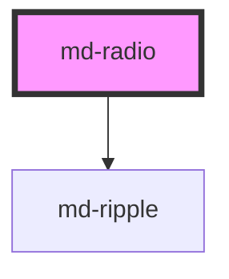

# md-radio

<!-- llm:meta
tag: md-radio
category: selection
status: md3-mapped
m3-guidelines: https://m3.material.io/components/radio-button/guidelines
form-associated: true
depends-on: md-ripple
used-by: none
-->

**Exactly one option from a small, visible set.** Radios sharing a `name` form
an exclusive group with a roving tabstop and arrow-key navigation, and
participate in form submission and validation.

> Setup, theming, density and i18n are configured once for the whole library —
> see [`main-llm.md`](../../../../../main-llm.md) at the repo root.

---

## When to use

- **Five or fewer** mutually exclusive options that should all be visible.
- The user must make a deliberate, single choice before continuing.
- One option can be sensibly **pre-selected** (M3 expects this).

## When NOT to use

| Situation | Use instead |
|---|---|
| More than one option may be chosen | `md-checkbox` |
| More than five options, or constrained space | `md-select` |
| A view/mode switch that stays visible | `md-segmented-button-set` |
| An immediate on/off setting | `md-switch` |
| Filtering | `md-chip` |
| Choosing from a long or remote list | `md-select` / `md-autocomplete` |
| Running an action | `md-button` |

## Decision cues

| Need | Setting |
|---|---|
| Group the options exclusively | Same `name` on every radio |
| Pre-select the default | `checked` on one radio (M3 expects one) |
| Require an explicit choice | `required` on the group members |
| Localized "please select" message | `value-missing-label` |
| Unavailable but discoverable | `soft-disabled` |

## API contract

Every attribute the component reads:

```html
<md-radio
  name="plan"                 <!-- group key; radios sharing it are exclusive -->
  value="pro"                 <!-- default: "" - an empty value submits "on" -->
  checked                     <!-- default: false -->
  required                    <!-- default: false; required on ANY member makes the whole group required -->
  disabled | soft-disabled    <!-- default: false -->
  value-missing-label="Please select one of these options."
  density="-1|-2|-3|-4"       <!-- default: 0 = uncompacted -->
></md-radio>
```

**Events** — all bubble; `mdChange` / `mdFocus` / `mdBlur` are composed,
`mdValidityChange` is **not**.

| Event | Detail | Fires |
|---|---|---|
| `mdChange` | `{ checked, value }` | When this radio **becomes** checked — by click, `Space`, arrow key, or `select()`. `detail.checked` is therefore always `true`; a radio being *un*checked by a sibling emits nothing |
| `mdFocus` / `mdBlur` | `void` | Host focus / blur |
| `mdValidityChange` | `{ valid, validationMessage, flags }` | Only when validity **changes**; `composed: false`, so listen on the element (or on a light-DOM ancestor such as the `<form>`) |

**Methods** — all async: `select()`, `setFocus()`, `setBlur()`,
`getValidity()`, `checkValidity()`, `reportValidity()`,
`setCustomValidity(message)`, `syncValidityFromGroup()`.

**Slots** — none. The component renders no `<slot>`; wrap it in a `<label>`, or
set `aria-label` / `aria-labelledby` on the host.

**Parts** — `state-layer`, `container`, `outer-circle`, `inner-circle`.

### Behavioral contract worth knowing

- **No slot.** Like `md-checkbox`, the label is not slotted — wrap in `<label>`
  or set `aria-label` / `aria-labelledby`.
- **`name` is the group.** Grouping is by matching `name`, not by DOM nesting.
  Two logically separate groups on one page must use different names.
- The group is resolved with `getRootNode().querySelectorAll('md-radio[name=…]')`,
  so it spans the whole document (or the whole shadow root) the radios live in
  — **not** the `<fieldset>` around them. Radios split across different shadow
  roots do not group.
- **Arrow keys select, not just move.** `ArrowDown` / `ArrowRight` (and
  `Up`/`Left`) move focus to the next enabled member, check it, and emit
  `mdChange` — the WAI-ARIA radiogroup pattern. `disabled` **and**
  `soft-disabled` members are skipped.
- The group has a **roving tabstop**: one `Tab` stop for the group. It lands on
  the checked radio; if none is checked, on the first enabled one.
- Clicking anywhere inside a wrapping `<label>` checks the radio. The wrapping
  label is re-resolved every time the element connects, so moving the radio into
  a different label keeps working.
- A checked radio **cannot be unchecked by the user**. Clicking it again, or
  calling `select()` on it, is a no-op — offer an explicit "None" option if the
  choice must be clearable.
- Only the checked member submits, under its `name`. An empty `value` submits
  the string `"on"`, mirroring a native radio.
- **`required` is a group property.** Setting it on one member makes every
  member report `valueMissing` until something in the group is checked, and
  every member exposes `aria-invalid` while the group is empty.
- `formResetCallback` restores the `checked` state each radio had at first
  render.
- `select()` checks this radio, unchecks siblings, and emits `mdChange` as if a
  user did it. It does nothing if the radio is disabled or already checked.
- `syncValidityFromGroup()` exists so siblings can agree on validity; it's a
  coordination hook between radios, not something you normally call.
- Put the **group's** label on a wrapping `role="radiogroup"` container; the
  component can't provide it.

---

## Do / Don't

Sourced from [M3 · Radio button · Guidelines](https://m3.material.io/components/radio-button/guidelines).

| ✅ Do | ❌ Don't |
|---|---|
| Use radios when only **one** option can be selected | Don't let radio buttons select multiple options |
| Use checkboxes when several may be selected | Don't reach for radios for multi-select |
| Use radios for **five or fewer** options | Don't build long radio lists |
| Consider a drop-down when space is constrained | Don't cram many radios into a narrow column |
| Always pre-select one option | Don't ship a radio group with nothing selected |
| Lay the group out vertically | Avoid horizontal radio lists |
| Keep the options flat | Don't nest radio buttons |
| Give the group a visible label | Don't leave a radiogroup unnamed |

---

## Patterns

```html
<!-- Labelled group with a pre-selection -->
<fieldset>
  <legend>Delivery speed</legend>
  <label><md-radio name="speed" value="std" checked></md-radio> Standard</label>
  <label><md-radio name="speed" value="exp"></md-radio> Express</label>
</fieldset>

<script type="module">
  document.querySelectorAll('md-radio[name="speed"]').forEach((r) =>
    r.addEventListener('mdChange', (e) => {
      console.log('speed =', e.detail.value);   // detail.checked is always true
    })
  );
</script>
```

```html
<!-- Required group in a form -->
<form>
  <div role="radiogroup" aria-labelledby="pay">
    <span id="pay">Payment method</span>
    <label><md-radio name="pay" value="card" required
                     value-missing-label="Please choose a payment method."></md-radio> Card</label>
    <label><md-radio name="pay" value="bank" required></md-radio> Bank transfer</label>
  </div>
  <md-button type="submit">Pay</md-button>
</form>

<!-- Programmatic selection (the method is async) -->
<script type="module">
  await document.querySelector('md-radio[value="bank"]').select();
</script>
```

## Anti-patterns

| ❌ Wrong | ✅ Right | Why |
|---|---|---|
| `<md-radio>Express</md-radio>` | Wrap in `<label>` or set `aria-label` | No default slot — the text won't render. |
| Two unrelated groups sharing a `name` | Distinct `name` per group | Grouping is by name, not nesting. |
| Relying on DOM nesting to scope a group | Set `name` | A `<fieldset>` alone doesn't group them. |
| No option pre-selected | Pre-select a sensible default | M3 expects one. |
| Eight radios | `md-select` | M3's limit is about five. |
| A horizontal row of radios | Stack them vertically | M3 advises against horizontal lists. |
| Nested radios for sub-options | Flatten, or use a second group | M3: don't nest. |
| Setting `checked` on two radios in a group | Set one | The group resolves it, but the intent is ambiguous. |
| Listening for `mdValidityChange` on a shadow ancestor | Listen on the element | `composed: false`. |
| Hidden `<input type=radio>` alongside | Use `name`/`value` | It's form-associated already. |
| Expecting `mdChange` with `checked: false` when a sibling takes over | Read the newly checked radio's event | Only the radio that becomes checked emits. |
| Clicking the checked radio to clear the group | Add an explicit "None" option | A radio cannot be unchecked by the user. |
| Relying on a `<fieldset>` to scope a `name` | Use a unique `name` per group | The group is resolved across the whole root node. |

## Accessibility, RTL, density, i18n

**Accessibility**
- Wrap each radio in a `<label>` for its name and hit target; give the **group**
  a name via `role="radiogroup"` + `aria-labelledby`, or a `<fieldset>`/`<legend>`.
- Roving tabstop: one `Tab` stop for the group, arrows to move — implemented for
  you.
- `disabled` leaves the tab order; `soft-disabled` stays focusable so an
  unavailable option is still discoverable.
- Selection is shown by the inner circle, not by color alone.

**RTL** — the control and its label side mirror automatically. Arrow-key
direction follows reading order.

**Density** — `density="-1…-4"` locally overrides the inherited `data-density`
rung; rung `0` is the uncompacted default and is inert, so it is not an opt-out
from an ancestor rung (for that, set `style="--md-sys-density-scale: 0"`). Each
rung trims 1px off the outer circle (20px → 16px floor), 0.5px off the dot, and
4px off both the touch target (48px → 32px floor) and the state layer. Stay at
`0` on touch surfaces so the target keeps its 48px.

**i18n** — translate the label text and `value-missing-label`.

## Related components

`md-checkbox` · `md-switch` · `md-select` · `md-segmented-button-set` ·
`md-chip` · `md-ripple`

## Theming

| Custom property | Purpose | Default |
|---|---|---|
| `--md-radio-icon-color` | Circle colour when unselected | `--md-sys-color-on-surface-variant` |
| `--md-radio-selected-icon-color` | Circle + dot colour when selected | `--md-sys-color-primary` |
| `--md-radio-icon-size` | Outer circle size | `max(16px, 20px + density * 1px)` |
| `--md-radio-inner-circle-size` | Selected dot size | `max(8px, 10px + density * 0.5px)` |
| `--md-radio-state-layer-size` | Hover/press overlay diameter before density trim | `40px` |
| `--md-radio-state-layer-color` | Overlay colour, unselected | `--md-sys-color-on-surface` |
| `--md-radio-selected-state-layer-color` | Overlay colour, selected | `--md-sys-color-primary` |

The 48px touch target is not themable; it is derived from the density scale.

**CSS parts** — `state-layer`, `container`, `outer-circle`, `inner-circle`.

```css
md-radio.brand {
  --md-radio-selected-icon-color: var(--md-sys-color-tertiary);
  --md-radio-selected-state-layer-color: var(--md-sys-color-tertiary);
}
```

<!-- Auto Generated Below -->


## Properties

| Property            | Attribute             | Description                                                                                                                                                                                                                                                                                                                                                                                                                                                    | Type                        | Default                                 |
| ------------------- | --------------------- | -------------------------------------------------------------------------------------------------------------------------------------------------------------------------------------------------------------------------------------------------------------------------------------------------------------------------------------------------------------------------------------------------------------------------------------------------------------- | --------------------------- | --------------------------------------- |
| `checked`           | `checked`             | Whether the radio button is selected                                                                                                                                                                                                                                                                                                                                                                                                                           | `boolean`                   | `false`                                 |
| `density`           | `density`             | Local density rung. Drives the same `--md-sys-density-scale` signal that a global `data-density` ancestor sets, so a local value simply overrides the inherited one. 0 = default, -4 = ultra-compact.                                                                                                                                                                                                                                                          | `-1 \| -2 \| -3 \| -4 \| 0` | `0`                                     |
| `disabled`          | `disabled`            | Disables the radio button                                                                                                                                                                                                                                                                                                                                                                                                                                      | `boolean`                   | `false`                                 |
| `name`              | `name`                | Form name — radios sharing a name form an exclusive group                                                                                                                                                                                                                                                                                                                                                                                                      | `string`                    | `''`                                    |
| `required`          | `required`            | Whether the radio is required in a form                                                                                                                                                                                                                                                                                                                                                                                                                        | `boolean`                   | `false`                                 |
| `softDisabled`      | `soft-disabled`       | Soft-disabled: disabled visuals but remains focusable for discoverability                                                                                                                                                                                                                                                                                                                                                                                      | `boolean`                   | `false`                                 |
| `value`             | `value`               | Form value submitted when checked                                                                                                                                                                                                                                                                                                                                                                                                                              | `string`                    | `''`                                    |
| `valueMissingLabel` | `value-missing-label` | Localized constraint-validation message shown when `required` is unmet.  A prop rather than a hardcoded string, matching md-time-picker's `value-missing-label`: components stay i18n-engine-agnostic and the consumer localizes through its own dictionary. Native inputs get their message from the browser's locale for free; a form-associated custom element supplies its own, so leaving this hardcoded would ship an English-only form to every locale. | `string`                    | `'Please select one of these options.'` |


## Events

| Event              | Description                                                                                                                                                                                                                                                                                                                                                                                                                                                                                                                                                              | Type                                                                                          |
| ------------------ | ------------------------------------------------------------------------------------------------------------------------------------------------------------------------------------------------------------------------------------------------------------------------------------------------------------------------------------------------------------------------------------------------------------------------------------------------------------------------------------------------------------------------------------------------------------------------ | --------------------------------------------------------------------------------------------- |
| `mdBlur`           | Emits when the radio loses focus                                                                                                                                                                                                                                                                                                                                                                                                                                                                                                                                         | `CustomEvent<void>`                                                                           |
| `mdChange`         | Emits when the checked state changes via user interaction                                                                                                                                                                                                                                                                                                                                                                                                                                                                                                                | `CustomEvent<{ checked: boolean; value: string; }>`                                           |
| `mdFocus`          | Emits when the radio receives focus                                                                                                                                                                                                                                                                                                                                                                                                                                                                                                                                      | `CustomEvent<void>`                                                                           |
| `mdValidityChange` | Fires when this control's validity CHANGES — never on every keystroke, and never for a re-publish that lands on the same state.  `composed: false` is deliberate. Composites like md-select embed an md-text-field, and a composed event escapes that inner shadow root, so a listener on md-select would receive the inner field's event as well as the host's — two events, different payloads, for one logical control. Keeping it uncomposed means each component reports only for itself, while `bubbles: true` still lets a <form> or app root hear every control. | `CustomEvent<{ valid: boolean; validationMessage: string; flags: Record<string, boolean>; }>` |


## Methods

### `checkValidity() => Promise<boolean>`

Constraint-validation API, matching md-text-field and the native contract.

#### Returns

Type: `Promise<boolean>`


### `getValidity() => Promise<{ valid: boolean; validationMessage: string; flags: Record<string, boolean>; }>`

Current validity: boolean, message and flags. Mirrors md-text-field.

#### Returns

Type: `Promise<{ valid: boolean; validationMessage: string; flags: Record<string, boolean>; }>`


### `reportValidity() => Promise<boolean>`


#### Returns

Type: `Promise<boolean>`


### `select() => Promise<void>`

Programmatically select this radio and uncheck siblings.
Emits mdChange like a user interaction.

#### Returns

Type: `Promise<void>`


### `setBlur() => Promise<void>`

Programmatically blur the radio

#### Returns

Type: `Promise<void>`


### `setCustomValidity(message: string) => Promise<void>`


#### Parameters

| Name      | Type     | Description |
| --------- | -------- | ----------- |
| `message` | `string` |             |

#### Returns

Type: `Promise<void>`


### `setFocus() => Promise<void>`

Programmatically focus the radio

#### Returns

Type: `Promise<void>`


### `syncValidityFromGroup() => Promise<void>`

Group-coordination hook. Sibling radios call this so the whole group agrees
on validity; exposed as a

#### Returns

Type: `Promise<void>`


## Shadow Parts

| Part             | Description |
| ---------------- | ----------- |
| `"container"`    |             |
| `"inner-circle"` |             |
| `"outer-circle"` |             |
| `"state-layer"`  |             |


## Dependencies

### Depends on

- [md-ripple](../md-ripple)

### Graph


----------------------------------------------

*Built with [StencilJS](https://stenciljs.com/)*
