# md-ripple

<!-- llm:meta
tag: md-ripple
category: status
status: custom
m3-guidelines: none — ripple is an M3 state-layer behavior, not a component page
form-associated: false
depends-on: none
used-by: md-accordion-item, md-app-bar, md-breadcrumb-item, md-button, md-card, md-checkbox, md-chip, md-fab, md-fab-menu-item, md-icon-button, md-list-item, md-menu-item, md-navigation-rail-tab, md-navigation-tab, md-organization-chart, md-radio, md-search, md-segmented-button, md-split-button, md-step, md-sub-menu-item, md-tab, md-time-picker, md-transfer-list
-->

**The touch-feedback primitive.** Paints the MD3 press ripple inside its
positioned parent. Used internally by 24 components — you only reach for it
directly when building a **custom** interactive surface.

> ⚠️ **Not a Material Design 3 component.** M3 specifies the ripple as
> state-layer *behavior*, so the Do / Don't table below is house rules rather
> than a quotation of a guidelines page.

> 🔧 **Infrastructure component.** If you're using a library component, it
> already has a ripple (usually behind a `ripple` prop). Add `md-ripple`
> yourself only for controls you build.

> Setup, theming, density and i18n are configured once for the whole library —
> see [`main-llm.md`](../../../../../main-llm.md) at the repo root.

---

## When to use

- A **custom interactive surface** — a bespoke card, tile, or row — that should
  match the library's press feedback.
- Extending a library component's clickable area with your own wrapper.

## When NOT to use

| Situation | Use instead |
|---|---|
| Any library component | It already ripples — use its `ripple` prop |
| A non-interactive surface | Nothing — ripples imply interactivity |
| Hover/focus styling | The component's state layer / your own CSS |
| Loading feedback | `md-progress-indicator` / `md-loading-indicator` |
| Turning ripples off globally | `data-ripple="off"` on an ancestor |

## API contract

```html
<div class="my-tile" style="position: relative;">
  <md-ripple></md-ripple>
  <span>Content</span>
</div>
```

| Prop | Attribute | Type | Default | Purpose |
|---|---|---|---|---|
| `disabled` | `disabled` | `boolean` | `false` | Suppress the ripple entirely (pointer and `trigger()`) |

**Events** — none.

**Slots** — none; the component renders no `<slot>`. Put your content beside
`md-ripple`, not inside it.

**Parts** — none. Style it through the custom properties below.

**Methods**

| Method | Signature | Purpose |
|---|---|---|
| `trigger()` | `() => Promise<void>` | Fire a **centered** ripple that fades on its own once the grow finishes — this is the keyboard (`Enter`/`Space`) path |
| `whenSettled()` | `() => Promise<void>` | Resolves when the active press ripple has faded out; resolves immediately when none is running |

### Behavioral contract worth knowing

- **The parent must be positioned** (`position: relative` or any other
  non-`static` value). The host itself is `display: contents`, so `md-ripple`
  occupies no layout space; its wave layer is absolutely positioned against the
  nearest positioned ancestor.
- The ripple binds a `pointerdown` listener to its **parent element** (or, when
  it is a shadow root's direct child, to that shadow host), and measures the
  wave against that element's rect. It does not wrap your content.
- It **clips itself**: the wave layer inherits the parent's `border-radius` and
  has its own `overflow: hidden`, so a rounded surface gets a rounded ripple
  without `overflow: hidden` on the parent — leave the parent unclipped if
  something must escape it, such as a badge.
- Keyboard activation does **not** ripple automatically — call `trigger()` from
  your `Enter`/`Space` handler, which is what the library components do.
- The wave fades on `pointerup` / `pointercancel` anywhere in the window. When
  the release beats the grow, the fade waits for the grow to finish first, so a
  quick tap still shows a full wave.
- Suppression is read from `--md-sys-ripple-enabled` **at press time**, so it
  responds instantly to a runtime theme or settings change:
  `data-ripple="off"` (or `ripple="off"`) on any ancestor turns ripples off,
  `data-ripple="on"` / `ripple="on"` turns a subtree back on, and this
  component's own `disabled` prop suppresses regardless.
- Timing: the grow is 450ms with the standard easing and is overridable; the
  release fade is a fixed 150ms. The component does **not** check
  `prefers-reduced-motion` — do that yourself if you need it (see Patterns).
- `--md-ripple-extend-inline` / `--md-ripple-extend-block` must be **concrete
  pixel values**. `calc()`, `clamp()` and percentage expressions are read as
  literal token text and ignored. They enlarge the wave's radius only; the wave
  still originates at the pointer.

---

## Do / Don't

House rules — MD3 treats the ripple as state-layer behavior, not a component.

| ✅ Do | ❌ Don't |
|---|---|
| Give the parent `position: relative` | Don't drop it into a static-positioned parent — the wave will anchor to some ancestor further up |
| Let the ripple inherit the parent's `border-radius` | Don't force `overflow: hidden` on a parent that has to let content escape |
| Call `trigger()` on keyboard activation | Don't leave keyboard users without feedback |
| Use it only on genuinely interactive surfaces | Don't ripple static content — it implies a control |
| Let library components manage their own ripple | Don't nest `md-ripple` inside `md-button` etc. |
| Respect the global `data-ripple` switch | Don't hardcode a ripple that ignores the user's setting |
| Await `whenSettled()` in tests | Don't race the animation |
| Neutralise the motion yourself under `prefers-reduced-motion` | Don't assume the component already does it |

---

## Patterns

```html
<!-- Custom interactive tile -->
<div class="tile" tabindex="0" role="button" style="position: relative;">
  <md-ripple></md-ripple>
  <h3>Reports</h3>
</div>

<script type="module">
  const tile = document.querySelector('.tile');
  const ripple = tile.querySelector('md-ripple');

  tile.addEventListener('keydown', (e) => {
    if (e.key === 'Enter' || e.key === ' ') {
      e.preventDefault();
      ripple.trigger();          // pointer ripples are automatic; keys aren't
      tile.click();
    }
  });
</script>
```

```html
<!-- Suppress locally while a row is busy: it is a property, not an attribute you toggle -->
<div class="row" style="position: relative;">
  <md-ripple></md-ripple>
  <span>Syncing…</span>
</div>

<script type="module">
  const ripple = document.querySelector('.row md-ripple');
  ripple.disabled = true;   // no wave until you set it back to false

  // Turn every ripple in the app off (and back on)
  document.documentElement.setAttribute('data-ripple', 'off');
  document.documentElement.setAttribute('data-ripple', 'on');
</script>
```

```css
/* Tint, opacity, and a reduced-motion-friendly grow */
.tile {
  --md-ripple-color: var(--md-sys-color-primary);
  --md-ripple-opacity: 0.16;
}

@media (prefers-reduced-motion: reduce) {
  .tile { --md-ripple-grow-duration: 1ms; }
}
```

```js
// Deterministic tests: wait for the wave to finish before asserting
await ripple.whenSettled();
```

## Anti-patterns

| ❌ Wrong | ✅ Right | Why |
|---|---|---|
| `<md-button><md-ripple></md-ripple></md-button>` | Use the button's `ripple` prop | It already has one; you get two overlapping waves. |
| Parent with the default `position: static` | `position: relative` on the parent | The wave layer is absolutely positioned and would anchor to a further ancestor. |
| Putting content inside `<md-ripple>…</md-ripple>` | Make it a sibling of your content | The component renders no slot, so that content never appears. |
| Placing `md-ripple` next to the surface instead of inside it | Make it a child of the surface it should respond to | It listens on its own parent element. |
| Expecting keyboard activation to ripple | Call `trigger()` | Only pointer input is automatic. |
| `--md-ripple-extend-inline: calc(8% * 2)` | Compute it in JS and set concrete pixels | Non-numeric values are read as literal text and ignored. |
| Assuming the component honours `prefers-reduced-motion` | Shorten `--md-ripple-grow-duration` in a media query | It has no reduced-motion branch of its own. |
| A ripple on a static text block | Remove it | It signals interactivity that isn't there. |
| Asserting immediately after a click in tests | `await ripple.whenSettled()` | The animation is async. |
| Custom CSS animation instead of `md-ripple` | Use the component | Hand-rolled effects bypass the global `data-ripple` switch. |

## Accessibility, RTL, density, i18n

**Accessibility** — the ripple is **purely decorative**: the host is
`aria-hidden="true"`, has no role, and is not focusable. Accessibility comes
from the surface you attach it to — give that a role, an accessible name, and
keyboard handling, and pair the ripple with a visible focus ring and a
state-layer colour change so feedback is never motion-only.

**RTL** — nothing direction-specific; the wave originates at the pointer and the
clip follows the parent's own logical radii.

**Density** — no density rung; the ripple sizes itself from the parent's rect,
so it tapers automatically with whatever the parent does.

**i18n** — no text, no locale-sensitive behaviour.

## Related components

`md-button` · `md-icon-button` · `md-card` · `md-list-item` · `md-menu-item` ·
`md-chip` · `md-tab`

## Theming

| Custom property | Purpose | Default |
|---|---|---|
| `--md-ripple-color` | Wave colour | `currentColor` |
| `--md-ripple-opacity` | Peak opacity (read from the parent at press time) | `0.12` |
| `--md-ripple-extend-inline` | Extra px per inline edge used when sizing the wave — for surfaces that grow during the press | `0` |
| `--md-ripple-extend-block` | Same, on the block axis | `0` |
| `--md-ripple-grow-duration` | Scale 0 → 1 duration | `450ms` |
| `--md-ripple-grow-easing` | Grow easing | `cubic-bezier(0.2, 0, 0, 1)` |

The release fade (150ms) is not themeable. **CSS parts** — none.

```css
.my-tile {
  --md-ripple-color: var(--md-sys-color-secondary);
  --md-ripple-opacity: 0.1;
}
```

<!-- Auto Generated Below -->


## Properties

| Property   | Attribute  | Description | Type      | Default |
| ---------- | ---------- | ----------- | --------- | ------- |
| `disabled` | `disabled` |             | `boolean` | `false` |


## Methods

### `trigger() => Promise<void>`

Programmatically trigger a centered ripple (for keyboard activations).

#### Returns

Type: `Promise<void>`


### `whenSettled() => Promise<void>`

Resolves when the active press ripple has fully faded out.

#### Returns

Type: `Promise<void>`


## Dependencies

### Used by

 - [md-accordion-item](../md-accordion-item)
 - [md-app-bar](../md-app-bar)
 - [md-breadcrumb-item](../md-breadcrumb-item)
 - [md-button](../md-button)
 - [md-card](../md-card)
 - [md-checkbox](../md-checkbox)
 - [md-chip](../md-chip)
 - [md-fab](../md-fab)
 - [md-fab-menu-item](../md-fab-menu-item)
 - [md-icon-button](../md-icon-button)
 - [md-list-item](../md-list-item)
 - [md-menu-item](../md-menu-item)
 - [md-navigation-rail-tab](../md-navigation-rail-tab)
 - [md-navigation-tab](../md-navigation-tab)
 - [md-organization-chart](../md-organization-chart)
 - [md-radio](../md-radio)
 - [md-search](../md-search)
 - [md-segmented-button](../md-segmented-button)
 - [md-split-button](../md-split-button)
 - [md-step](../md-step)
 - [md-sub-menu-item](../md-sub-menu-item)
 - [md-tab](../md-tab)
 - [md-time-picker](../md-time-picker)
 - [md-transfer-list](../md-transfer-list)

### Graph

```mermaid
graph TD;
  md-accordion-item --> md-ripple
  md-app-bar --> md-ripple
  md-breadcrumb-item --> md-ripple
  md-button --> md-ripple
  md-card --> md-ripple
  md-checkbox --> md-ripple
  md-chip --> md-ripple
  md-fab --> md-ripple
  md-fab-menu-item --> md-ripple
  md-icon-button --> md-ripple
  md-list-item --> md-ripple
  md-menu-item --> md-ripple
  md-navigation-rail-tab --> md-ripple
  md-navigation-tab --> md-ripple
  md-organization-chart --> md-ripple
  md-radio --> md-ripple
  md-search --> md-ripple
  md-segmented-button --> md-ripple
  md-split-button --> md-ripple
  md-step --> md-ripple
  md-sub-menu-item --> md-ripple
  md-tab --> md-ripple
  md-time-picker --> md-ripple
  md-transfer-list --> md-ripple
  style md-ripple fill:#f9f,stroke:#333,stroke-width:4px
```


----------------------------------------------

*Built with [StencilJS](https://stenciljs.com/)*
