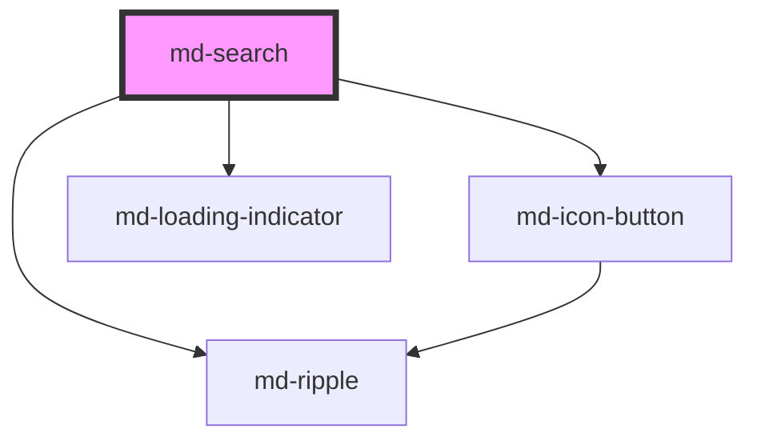

# md-search

<!-- llm:meta
tag: md-search
category: text-input
status: md3-mapped
m3-guidelines: https://m3.material.io/components/search/guidelines
form-associated: false
depends-on: md-icon-button, md-loading-indicator, md-ripple
used-by: none
-->

**A search entry point with its own results surface.** A bar (or icon trigger)
that expands into a full-screen or docked panel, with slotted suggestions and
results, optional voice input, and live-region announcements. It renders the
surface and reports the query — it never fetches or filters anything itself.

> ⚠️ **Not form-associated.** It is a search surface, not a form field — read
> `mdSearch` / `mdSubmit` and act on the query yourself.

> Setup, theming, density and i18n are configured once for the whole library —
> see [`main-llm.md`](../../../../../main-llm.md), shipped beside these manuals in
> the package's `docs/` folder.

---

## When to use

- Finding things across a **large collection** — messages, files, products.
- Search that needs a **results surface** (suggestions as you type, recent
  searches, grouped results).
- The M3 "search bar" entry point: search scoped to the current view.

## When NOT to use

| Situation | Use instead |
|---|---|
| Choosing from a known list | `md-select` / `md-autocomplete` |
| Filtering an already-visible list in place | `md-text-field type="search"` + your own filter |
| Picking one value with type-ahead | `md-autocomplete` |
| Search as the app's **global primary** function | An app bar search variant — `md-app-bar` |
| A plain text input | `md-text-field` |

## Decision cues

| Need | Setting |
|---|---|
| Mobile / immersive | `layout="full-screen"` |
| Desktop dropdown panel | `layout="docked"` |
| Always-visible bar | `trigger="bar"` |
| Collapsed icon that expands | `trigger="icon"` (+ `trigger-icon`) |
| Opener lives elsewhere on the page | `trigger-for="#app-bar-search"` |
| Opener is an element you already hold | `el.triggerElement = ref` |
| Bar with a hairline rule above the results | `variant="divided"` |
| Standard filled bar | `variant="contained"` (default) |
| Bar should fill its container edge to edge | `full-width` |
| Dictation | `voice-search` |
| Throttle remote queries | `debounce="300"` (+ `throttle` as a max-wait) |
| Cap the panel height | `max-block-size` |
| Compact bar | `density="-1"` … `density="-4"` |

## API contract

```html
<md-search
  variant="contained|divided"        <!-- default: contained -->
  layout="full-screen|docked"        <!-- default: full-screen -->
  trigger="bar|icon"                 <!-- default: icon for full-screen, bar for docked -->
  trigger-icon="search"              <!-- default: search -->
  trigger-for="#app-bar-search"      <!-- document selector for an external opener -->
  value=""
  placeholder="Search"               <!-- default: Search -->
  open
  disabled
  full-width
  elevation="0"                      <!-- default: 0; 1-5 map to MD3 elevation tiers -->
  leading-icon="search"              <!-- default: search -->
  open-leading-icon="arrow_back"     <!-- default: chevron_left (contained) / arrow_back (divided) -->
  show-clear-button                  <!-- default: true -->
  voice-search                       <!-- default: false -->
  escape-closes                      <!-- default: true -->
  dismiss-on-outside-click           <!-- default: true -->
  max-block-size="60vh"
  input-aria-label="Search messages" <!-- default: falls back to placeholder -->
  initial-focus="auto|input|leading" <!-- default: auto -->
  announce-results                   <!-- default: true -->
  results-label="{count} results available"
  no-results-label="No results available"
  loading                            <!-- you set this; the component never flips it -->
  loading-label="Searching"
  debounce="0" throttle="0"          <!-- default: 0 (both off) -->
  density="-1|-2|-3|-4"              <!-- default: 0 (uncompacted) -->
>
  <div slot="results">…suggestions or results…</div>
</md-search>
```

`triggerElement` is a **property**, not an attribute — assign an element
reference in JS. `scroll-shadow` still parses but is a documented no-op.

**Events**

| Event | Detail | Fires |
|---|---|---|
| `mdInput` | `{ value }` | Immediately, on every keystroke — never debounced |
| `mdSearch` | `{ value }` | The query to run: gated by `debounce` / `throttle`, de-duplicated on the **trimmed** query, and `value` is that trimmed string |
| `mdSubmit` | `{ value }` | Enter pressed while the panel is open (a pending `mdSearch` is flushed first) |
| `mdChange` | `{ value }` | Blur, only when the value differs from what it was at focus |
| `mdOpen` / `mdClose` | `void` | Panel opened / closed |
| `mdClear` | `void` | Built-in clear (×) button pressed |
| `mdVoice` | `{ value, final }` | Voice transcript, interim (`final: false`) and final |
| `mdLeadingIconClick` | `{ value, open }` | Leading affordance activated — the open-state back button, or a slotted `leading` element |
| `mdTrailingIconClick` | `{ value, open }` | A **slotted** `trailing` element was clicked (the built-in clear and mic emit `mdClear` / `mdVoice` instead) |

**Methods** — `show()`, `close()`, `toggle()`, `focusInput()`, `startVoice()`,
`stopVoice()`.

**Slots** — `results` (the panel body — **you render this**), `leading`,
`trailing`, `trigger` (replaces the built-in trigger), `loader` (replaces the
built-in loading indicator in the trailing cluster while `loading`).

**Parts** — `trigger`, `trigger-button`, `bar`, `state-layer`, `leading`,
`leading-state-layer`, `input`, `clear-button`, `voice-button`, `trailing`,
`loading`, `status`, `panel`, `divider`, `panel-body`, `empty`,
`results-host`, `results-viewport`.

### Behavioral contract worth knowing

- **The component does not search.** It gives you the surface, the query and
  the panel; you render results into the `results` slot and run the query.
- **Wire exactly one query source.** `mdInput` fires on every keystroke,
  `mdSearch` is the debounced/de-duplicated one, `mdSubmit` fires on Enter and
  `mdChange` on a changed blur. Use `mdSearch` for the fetch; the other three
  will re-run the same query if you also bind them to it.
- `debounce` and `throttle` gate **`mdSearch` only**. `throttle` is a max-wait
  safety net that forces an emit during sustained typing, and is only
  meaningful alongside a non-zero `debounce`.
- **`mdSearch` carries the trimmed query** and is distinct-until-changed on it,
  so re-typing the same term (or adding surrounding whitespace) does not
  re-fire. Enter and the clear button **flush** it immediately past any pending
  debounce — clearing therefore delivers an empty query at once.
- **Focus does not open the panel.** Tabbing into the bar only moves focus;
  the view opens on typing, on Enter/Space, or on a click on the bar or
  trigger. The focus ring is keyboard-modality only.
- **`trigger` defaults by layout**: `icon` for `full-screen`, `bar` for
  `docked`. Set it explicitly to override.
- **The built-in trigger and the `trigger` slot both live inside the element.**
  When the opener belongs elsewhere — an app-bar icon, a menu item — use
  `trigger-for` (a document selector) or the `triggerElement` property
  (which wins over `trigger-for`). The component wires that element instead of
  rendering it: activation opens the view, `aria-haspopup="dialog"` and
  `aria-expanded` are kept in step, and focus returns to it on close. With
  either set the component renders no resting affordance of its own.
- **`full-screen` locks document scroll** while open (compensating for the
  scrollbar width so the page does not shift) and **traps Tab** inside the
  overlay. `docked` is non-modal: Tab continues into the document.
- While open, **ArrowDown / ArrowUp move focus through the slotted results**;
  Down from the input lands on the first item, Up from the first item returns
  to the input. The steppable rows are the ones matching `md-list-item`,
  `[role="option"]`, `[role="menuitem"]`, `[data-search-result]` or `li`.
- `escape-closes` and `dismiss-on-outside-click` both default **on**. The
  outside-click watcher runs in both layouts on `mousedown` (capture) and
  deliberately ignores clicks on a wired external trigger, so that trigger owns
  its own toggle instead of closing and reopening in one gesture.
- `open-leading-icon` swaps the leading glyph while the panel is open. Its
  default is variant-aware — `chevron_left` for `contained`, `arrow_back` for
  `divided`. The **closed** resting search glyph is not a click target (a click
  there focuses the input), so it emits no `mdLeadingIconClick`.
- **`loading` is yours to control.** The component never sets it; set it true
  before awaiting your fetch and false once results are slotted. It only drives
  the trailing indicator and the live-region announcement.
- `announce-results` + `results-label` drive a polite live region; `{count}`
  is replaced with the number of detected items — elements in the `results`
  slot (or descendants of them) matching `md-list-item`, `[role="option"]`,
  `li` or `[data-search-result]`, falling back to the count of slotted
  elements. `no-results-label` covers the empty case, and the live region
  defers to the visible empty state to avoid duplicate speech.
- **`data-search-result` is the opt-in hook for custom rows.** If your result
  rows are none of those element types (a `<div>` card, say), put
  `data-search-result` on each one so it is counted *and* reachable with the
  arrow keys.
- **Voice search is doubly gated**: `voice-search` must be true **and** the
  browser must expose `SpeechRecognition` / `webkitSpeechRecognition`. When the
  API is missing the mic button is simply not rendered — there is no dead
  button to guard against. Closing the panel stops any active session.
- `elevation` (`0`–`5`) maps to the MD3 elevation tiers; setting
  `--md-search-container-elevation` overrides the prop entirely.
- `full-width` is exactly equivalent to setting `--md-search-expand-inset: 0`
  and `--md-search-expand-focused-inset: 0`, and has no effect on
  `full-screen` (already edge-to-edge).
- `scroll-shadow` is **retained for compatibility and does nothing** — the
  results viewport always plain-scrolls.

---

## Do / Don't

Sourced from [M3 · Search · Guidelines](https://m3.material.io/components/search/guidelines).

| ✅ Do | ❌ Don't |
|---|---|
| Use search for products with many items to manage — files, messages | Don't add search to a screen with a handful of items |
| Make the entry point easy to find | Don't bury search behind an ambiguous icon |
| Use a **search bar** to search the contents of a specific view | Don't use a bar when search is the app's global primary function — use an app-bar variant |
| Use a search **icon trigger** when search is a secondary action | Don't take a full bar's space for a rarely-used action |
| Place a search bar below the title for scoped content | Don't detach the bar from the content it searches |
| Show suggestions on focus, results as text is entered | Don't leave the panel empty with no guidance |
| Announce result counts | Don't change results silently for screen-reader users |
| Keep the placeholder descriptive ("Search messages") | Don't ship a bare "Search" when the scope matters |

---

## Patterns

```html
<!-- Docked bar, one query source (mdSearch), consumer-driven loading -->
<md-search id="s" layout="docked" trigger="bar" placeholder="Search messages"
           input-aria-label="Search messages" debounce="300" throttle="1000">
  <md-list slot="results" id="results"></md-list>
</md-search>

<script type="module">
  const s = document.getElementById('s');
  const list = document.getElementById('results');

  s.addEventListener('mdSearch', async (e) => {
    const query = e.detail.value;          // already trimmed and de-duplicated
    if (!query) { list.innerHTML = ''; return; }
    s.loading = true;
    try {
      const res = await fetch(`/api/search?q=${encodeURIComponent(query)}`);
      const items = await res.json();
      list.innerHTML = items
        .map((i) => `<md-list-item headline="${i.title}"></md-list-item>`)
        .join('');
    } finally {
      s.loading = false;
    }
  });

  s.addEventListener('mdSubmit', (e) => {
    location.href = `/search?q=${encodeURIComponent(e.detail.value)}`;
  });
  s.addEventListener('mdClose', () => { list.innerHTML = ''; });
</script>
```

```html
<!-- Collapsed icon trigger, full-screen overlay -->
<md-search trigger="icon" trigger-icon="search" layout="full-screen"
           placeholder="Search files" open-leading-icon="arrow_back">
  <md-list slot="results"></md-list>
</md-search>
```

```html
<!-- Opener outside the component: an app-bar button drives the search -->
<md-icon-button id="app-bar-search" icon="search" aria-label="Search"></md-icon-button>
<md-search trigger-for="#app-bar-search" layout="docked" placeholder="Search files">
  <md-list slot="results"></md-list>
</md-search>
```

```html
<!-- Voice input: act on the final transcript only -->
<md-search id="v" layout="docked" trigger="bar" voice-search debounce="300">
  <md-list slot="results"></md-list>
</md-search>
<script type="module">
  const v = document.getElementById('v');
  v.addEventListener('mdVoice', (e) => {
    if (e.detail.final) console.log('final transcript:', e.detail.value);
  });
</script>
```

```html
<!-- Divided bar, capped panel, full container width -->
<md-search variant="divided" layout="docked" trigger="bar"
           full-width max-block-size="60vh" elevation="2">
  <md-list slot="results"></md-list>
</md-search>
```

```html
<!-- Localized -->
<md-search placeholder="Rechercher des messages"
           input-aria-label="Rechercher des messages"
           results-label="{count} résultats disponibles"
           no-results-label="Aucun résultat"
           loading-label="Recherche">
  <md-list slot="results"></md-list>
</md-search>
```

## Anti-patterns

| ❌ Wrong | ✅ Right | Why |
|---|---|---|
| Expecting built-in search results | Render into the `results` slot | The component provides the surface only. |
| Wiring `mdInput`, `mdSearch`, `mdSubmit` and `mdChange` to the same query | Fetch on `mdSearch` alone | You would run the query up to four times per keystroke sequence. |
| Setting `debounce` and then listening to `mdInput` | Listen to `mdSearch` | `debounce`/`throttle` gate `mdSearch` only; `mdInput` is always immediate. |
| `throttle` on its own | Pair it with `debounce` | It is a max-wait for the debounce, not a standalone rate limiter. |
| Querying on every `mdVoice` | Wait for `final: true` | Interim transcripts stream continuously. |
| Waiting for the component to clear `loading` | Set `loading` yourself around the fetch | The component never flips it. |
| `triggerElement="..."` as an attribute | `el.triggerElement = ref` in JS | Element references cannot cross the attribute boundary. |
| A built-in trigger **and** `trigger-for` | Pick one | With `trigger-for` set, the component renders no resting affordance. |
| Guarding `voice-search` against a dead mic button | Just set it | The mic is not rendered when the Speech API is missing. |
| Translating `results-label` and dropping `{count}` | Keep the token | The count interpolates into it. |
| `md-search` for filtering a small visible list | `md-text-field type="search"` | An overkill surface for in-place filtering. |
| A search bar as the app's global search | Use an app-bar search variant | M3 explicit rule. |
| Expecting the value in `FormData` | Read `mdSearch` / `mdSubmit` | It is not form-associated. |
| `density="0"` to escape an inherited rung | `style="--md-sys-density-scale: 0"` | There is no `density="0"` rule; rung 0 is the default and is inert. |

## Accessibility, RTL, density, i18n

**Accessibility** — `input-aria-label` names the input; left empty it falls
back to `placeholder`, so set it explicitly only when the visible hint and the
accessible name should differ. `announce-results` publishes counts to a polite
live region via `results-label` / `no-results-label` — keep it on unless you
manage your own live region inside the `results` slot. `escape-closes` and
`dismiss-on-outside-click` are on by default. `full-screen` traps Tab and locks
document scroll while open; `docked` is non-modal. ArrowDown/ArrowUp move focus
through the slotted results. `initial-focus` controls where focus lands when
the panel opens (`auto`/`input` → the text field, `leading` → the leading
button, falling back to the input). A wired external trigger receives focus
back when the view closes, and carries `aria-haspopup="dialog"` plus a synced
`aria-expanded`. Anything you slot into `results` is **your** responsibility for
roles and keyboard semantics — `md-list` + `md-list-item` is the usual choice.

**RTL** — bar, icons and panel mirror under `dir="rtl"`. Set
`open-leading-icon` to the correct directional glyph for the locale if you
override the default.

**Density** — set `density="-1"` … `density="-4"` for a local override, or let
the bar inherit an ancestor's `data-density` rung; both drive the same
`--md-sys-density-scale` signal, which tapers the bar height, the icon-button
size and the icon size. There is no `density="0"` rule — rung 0 is the
uncompacted default. For dimensions density does not reach, use
`--md-search-container-height` and the padding properties.

**i18n** — translate `placeholder`, `input-aria-label`, `results-label` (keep
the `{count}` token), `no-results-label` and `loading-label`. Voice recognition
takes its language from the page, so set `lang` on `<html>`.

## Related components

`md-autocomplete` · `md-text-field` · `md-app-bar` · `md-icon-button` ·
`md-list` · `md-list-item` · `md-loading-indicator` · `md-menu`

## Theming

| Custom property | Purpose | Default |
|---|---|---|
| `--md-search-container-color` | Bar surface colour | `--md-sys-color-surface-container-high` |
| `--md-search-contained-background-color` | `contained` variant results surface | `--md-sys-color-surface-container-low` |
| `--md-search-container-shape` | Bar corner radius | `--md-sys-shape-corner-full` |
| `--md-search-container-height` | Bar height | density-scaled, `56px` at rung 0 |
| `--md-search-container-min-inline-size` | Docked bar / panel min width | `360px` |
| `--md-search-container-max-inline-size` | Docked bar / panel max width | `720px` |
| `--md-search-container-padding-inline` | Bar inner inline padding | `0px` |
| `--md-search-container-elevation` | Full custom bar shadow — overrides the `elevation` prop | unset (the `elevation` tier) |
| `--md-search-expand-inset` | Resting side gutter of the bar | `24px` |
| `--md-search-expand-focused-inset` | Focused side gutter of the bar | `12px` |
| `--md-search-leading-padding-inline` | Leading cluster inline padding | `4px` |
| `--md-search-trailing-padding-inline` | Trailing cluster inline padding | `8px` |
| `--md-search-icon-size` | Leading / trailing glyph size | density-scaled, `24px` at rung 0 |
| `--md-search-icon-button-size` | Leading / trailing hit target | density-scaled, `48px` at rung 0 |
| `--md-search-icon-color` | Fallback ink for the trailing icon | `--md-sys-color-on-surface-variant` |
| `--md-search-leading-icon-color` | Leading icon ink | `--md-sys-color-on-surface` |
| `--md-search-trailing-icon-color` | Trailing icon ink | `--md-search-icon-color`, else `--md-sys-color-on-surface-variant` |
| `--md-search-input-color` | Input text colour | `--md-sys-color-on-surface` |
| `--md-search-placeholder-color` | Placeholder colour | `--md-sys-color-on-surface-variant` |
| `--md-search-input-font-size` | Input type size | density-scaled, `16px` at rung 0 |
| `--md-search-panel-min-block-size` | Results panel minimum height | `0px` |
| `--md-search-panel-max-block-size` | Results panel maximum height | `min(400px, 60vh)` |
| `--md-search-max-block-size` | Cap on the whole open surface (same as `max-block-size`) | unset |
| `--md-search-panel-offset` | Gap between the docked bar and its panel | focus-ring offset + thickness + `3px` |
| `--md-search-docked-panel-shape` | Docked panel corner radius | `--md-sys-shape-corner-large` (16px) |
| `--md-search-divider-color` | `divided` variant rule colour | `--md-sys-color-outline` |
| `--md-search-divider-thickness` | `divided` variant rule thickness | `1px` |
| `--md-search-focus-indicator-color` | Keyboard focus ring colour | `--md-sys-color-secondary` |
| `--md-search-focus-indicator-thickness` | Keyboard focus ring thickness | `3px` |
| `--md-search-focus-indicator-offset` | Keyboard focus ring offset | `2px` |
| `--md-search-loading-color` | In-bar loading indicator ink | `--md-sys-color-primary` |
| `--md-search-empty-color` | Empty-state text colour | `--md-sys-color-on-surface-variant` |
| `--md-search-empty-padding-block` | Empty-state block padding | `--md-sys-spacing-inset-xl` (24px) |
| `--md-search-empty-padding-inline` | Empty-state inline padding | `--md-sys-spacing-inset-lg` (16px) |
| `--md-search-expand-easing` | Bar expand/collapse easing | `cubic-bezier(0.34, 1.56, 0.64, 1)` |
| `--md-search-expand-duration` | Bar expand/collapse duration | see stylesheet |
| `--md-search-fullscreen-expand-duration` | Full-screen open duration | see stylesheet |
| `--md-search-fullscreen-collapse-duration` | Full-screen close duration | see stylesheet |

**CSS parts** — `trigger`, `trigger-button`, `bar`, `state-layer`, `leading`,
`leading-state-layer`, `input`, `clear-button`, `voice-button`, `trailing`,
`loading`, `status`, `panel`, `divider`, `panel-body`, `empty`,
`results-host`, `results-viewport`.

```css
md-search {
  --md-search-container-max-inline-size: 560px;
  --md-search-panel-max-block-size: 50vh;
}
md-search::part(panel-body) {
  padding-block-end: 8px;
}
```

<!-- Auto Generated Below -->


## Overview

Material Design 3 Search.

Implements the M3 Search specification
(https://m3.material.io/components/search/specs).

Two orthogonal axes describe every spec configuration:
 - `variant`: `contained` (M3 Expressive default) | `divided` (baseline)
 - `layout` : `full-screen` (modal overlay) | `docked` (anchored panel)

The component renders a single resting bar plus a results panel. When the
`full-screen` layout is `open` the bar pins itself to the top of the
viewport via `position: fixed` so consumers don't need a portal — CSS does
the work, and the input keeps a stable identity throughout the open/close
lifecycle.

## Properties

| Property                | Attribute                  | Description                                                                                                                                                                                                                                                                                                                                                                                                                                                                                                                     | Type                             | Default                       |
| ----------------------- | -------------------------- | ------------------------------------------------------------------------------------------------------------------------------------------------------------------------------------------------------------------------------------------------------------------------------------------------------------------------------------------------------------------------------------------------------------------------------------------------------------------------------------------------------------------------------- | -------------------------------- | ----------------------------- |
| `announceResults`       | `announce-results`         | Announce the number of available suggestions / results to assistive technology via a polite live region whenever the slotted results change while the panel is open (M3 "autosuggest" requirement). Set to `false` if you manage your own live region in the results slot.                                                                                                                                                                                                                                                      | `boolean`                        | `true`                        |
| `debounce`              | `debounce`                 | Trailing debounce (ms) applied to the `mdSearch` event so a fetch only fires after the user pauses typing. `0` (default) emits on every change. `mdInput` always fires immediately on every keystroke regardless.                                                                                                                                                                                                                                                                                                               | `number`                         | `0`                           |
| `density`               | `density`                  | Local density rung. Drives the same `--md-sys-density-scale` signal that a global `data-density` ancestor sets, so a local value simply overrides the inherited one. 0 = default, -4 = ultra-compact.                                                                                                                                                                                                                                                                                                                           | `-1 \| -2 \| -3 \| -4 \| 0`      | `0`                           |
| `disabled`              | `disabled`                 | Whether interaction is blocked.                                                                                                                                                                                                                                                                                                                                                                                                                                                                                                 | `boolean`                        | `false`                       |
| `dismissOnOutsideClick` | `dismiss-on-outside-click` | Close on outside click (docked layout).                                                                                                                                                                                                                                                                                                                                                                                                                                                                                         | `boolean`                        | `true`                        |
| `elevation`             | `elevation`                | Resting bar elevation level, mapped to `--md-sys-elevation-{n}`. `0` (the M3 default) renders no shadow; `1`–`5` apply the matching MD3 elevation tier. For a fully custom shadow, set the CSS custom property `--md-search-container-elevation` instead (it overrides this prop).                                                                                                                                                                                                                                              | `0 \| 1 \| 2 \| 3 \| 4 \| 5`     | `0`                           |
| `escapeCloses`          | `escape-closes`            | Close on Escape key.                                                                                                                                                                                                                                                                                                                                                                                                                                                                                                            | `boolean`                        | `true`                        |
| `fullWidth`             | `full-width`               | Make the docked / inline bar span its container's full inline width with NO side gutters. This zeroes both expand insets for the instance (resting + focused = 0), so there is no 24 → 12dp margin animation and the aligned results drawer fills the same full width. Purely an ergonomic switch over the CSS vars — the identical effect is available by setting `--md-search-expand-inset: 0` and `--md-search-expand-focused-inset: 0`. Has no effect on `full-screen` layout (already edge-to-edge).                       | `boolean`                        | `false`                       |
| `initialFocus`          | `initial-focus`            | Where focus lands when the panel opens. `auto` (default) and `input` focus the text field so the user can type immediately. `leading` focuses the leading button instead (falling back to the input if it isn't focusable).  Note: the M3 "initial focus lands on a leading icon, else the text field" rule applies to the RESTING bar's first tab stop and is handled by DOM order — a slotted interactive leading icon button is the first tabbable element, otherwise the text field. This prop only controls the open view. | `"auto" \| "input" \| "leading"` | `'auto'`                      |
| `inputAriaLabel`        | `input-aria-label`         | Accessible label for the search bar / input. Per the M3 labeling guidance the hinted search text (`placeholder`) describes the bar, so when this is left empty the label falls back to `placeholder`. Set it explicitly only when the visible hint and the accessible name should differ.                                                                                                                                                                                                                                       | `string`                         | `''`                          |
| `layout`                | `layout`                   | How the focused panel appears. `full-screen` fills the viewport edge-to-edge with an opaque results surface and a focus trap (no scrim — open/close uses the same translateY + opacity motion as md-dialog fullscreen); `docked` anchors a popup beneath the bar (min 360dp / max 720dp wide; results drawer shrinks to content up to max ⅔ vh).                                                                                                                                                                                | `"docked" \| "full-screen"`      | `'full-screen'`               |
| `leadingIcon`           | `leading-icon`             | Material Symbols glyph for the resting leading icon.                                                                                                                                                                                                                                                                                                                                                                                                                                                                            | `string`                         | `'search'`                    |
| `loading`               | `loading`                  | Whether an async results fetch is in flight. When `true` the M3 loading indicator (the looping shape-morph) shows in the bar's trailing cluster. Controlled by the consumer: set it `true` before awaiting your fetch and back to `false` once results are slotted in. The component never flips this itself — it only reflects the state visually + to assistive tech.                                                                                                                                                         | `boolean`                        | `false`                       |
| `loadingLabel`          | `loading-label`            | Accessible label for the in-bar loading indicator.                                                                                                                                                                                                                                                                                                                                                                                                                                                                              | `string`                         | `'Searching'`                 |
| `maxBlockSize`          | `max-block-size`           | Maximum block-size of the open search surface (`"480px"`, `"66vh"`, etc.). Full-screen: caps the fixed overlay height. Docked: caps the results panel (bar height is unchanged). Prefer the CSS custom property `--md-search-max-block-size` for stylesheet-based theming.                                                                                                                                                                                                                                                      | `string`                         | `''`                          |
| `noResultsLabel`        | `no-results-label`         | Message shown when the panel is open, the user has entered a query, and there are no slotted results — both the on-screen empty state and the polite live-region announcement (unless the visible empty state is shown, in which case the live region defers to it to avoid duplicate speech).                                                                                                                                                                                                                                  | `string`                         | `'No results available'`      |
| `open`                  | `open`                     | Whether the focused panel is open.                                                                                                                                                                                                                                                                                                                                                                                                                                                                                              | `boolean`                        | `false`                       |
| `openLeadingIcon`       | `open-leading-icon`        | Material Symbols glyph used for the leading button when the bar is open. Defaults are variant-aware: the `contained` (Expressive) bar uses `chevron_left` so the caret matches the bar's softer, pill- shaped silhouette, while the `divided` (baseline) bar uses the classic `arrow_back` to match its squared, app-bar-like chrome. Pass an explicit value to override either default.                                                                                                                                        | `string \| undefined`            | `undefined`                   |
| `placeholder`           | `placeholder`              | Placeholder text — the spec calls this "supporting text" within the bar anatomy.                                                                                                                                                                                                                                                                                                                                                                                                                                                | `string`                         | `'Search'`                    |
| `resultsLabel`          | `results-label`            | Template for the results announcement. `{count}` is replaced with the number of detected result items (counts `md-list-item`, `[role="option"]`, or `<li>` descendants of the results slot, falling back to the number of slotted elements).                                                                                                                                                                                                                                                                                    | `string`                         | `'{count} results available'` |
| `scrollShadow`          | `scroll-shadow`            | Retained for API compatibility, but now a no-op: when the results list overflows it always plain-scrolls inside the results viewport (no scroll shadow / edge fades). Setting this has no visual effect.                                                                                                                                                                                                                                                                                                                        | `boolean`                        | `true`                        |
| `showClearButton`       | `show-clear-button`        | Show the trailing clear (×) button when the input has a value.                                                                                                                                                                                                                                                                                                                                                                                                                                                                  | `boolean`                        | `true`                        |
| `throttle`              | `throttle`                 | Maximum wait (ms) before `mdSearch` is forced to fire during sustained typing — a throttle/`maxWait` safety net so the user still sees interim results when they never pause long enough for the debounce to settle. `0` (default) disables it. Only meaningful alongside a non-zero `debounce`.                                                                                                                                                                                                                                | `number`                         | `0`                           |
| `trigger`               | `trigger`                  | What the user sees while the search view is closed. `bar` renders the resting search field (docked default). `icon` renders a compact search icon button that opens the view — the default for `full-screen` layout (contained and divided spec sheets). Docked layouts should keep `bar`.                                                                                                                                                                                                                                      | `"bar" \| "icon" \| undefined`   | `undefined`                   |
| `triggerElement`        | --                         | The external trigger as an element, for consumers that hold a reference (frameworks that pass a ref, or a button rendered in another shadow root where a document selector can't reach). Takes precedence over `trigger-for`.                                                                                                                                                                                                                                                                                                    | `HTMLElement \| undefined`       | `undefined`                   |
| `triggerFor`            | `trigger-for`              | Document selector for an opener that lives OUTSIDE this element — an app-bar button, a menu item, a shortcut hint. The component wires it rather than rendering it: activation toggles the view, `aria-haspopup="dialog"` and `aria-expanded` are kept in step, and closing returns focus to it. With one set the built-in trigger is not rendered and nothing shows at rest, so the page never offers two ways in. Use a real button — activation rides on `click`.                                                             | `string`                         | `''`                          |
| `triggerIcon`           | `trigger-icon`             | Material Symbols glyph for the built-in icon trigger (`trigger="icon"`). Ignored when a custom element is slotted in `trigger`.                                                                                                                                                                                                                                                                                                                                                                                                 | `string`                         | `'search'`                    |
| `value`                 | `value`                    | Current input text, two-way bindable.                                                                                                                                                                                                                                                                                                                                                                                                                                                                                           | `string`                         | `''`                          |
| `variant`               | `variant`                  | Visual style. `contained` is the M3 Expressive default with a filled surface and rounded shape; `divided` is the baseline pre-Expressive look that uses a hairline divider between bar and results.                                                                                                                                                                                                                                                                                                                             | `"contained" \| "divided"`       | `'contained'`                 |
| `voiceSearch`           | `voice-search`             | Opt-in voice search. When `true` AND the browser exposes the Web Speech API (`SpeechRecognition` / `webkitSpeechRecognition`), a microphone icon-button is rendered in the trailing cluster. Clicking it starts recognition and streams the interim + final transcript into the input, firing the normal `mdInput` / `mdSearch` flow as if typed. When the API is unavailable the mic is not rendered (graceful no-op). Default `false`.                                                                                        | `boolean`                        | `false`                       |


## Events

| Event                 | Description                                                                                                                                                                                                                                                                                                                                                               | Type                                              |
| --------------------- | ------------------------------------------------------------------------------------------------------------------------------------------------------------------------------------------------------------------------------------------------------------------------------------------------------------------------------------------------------------------------- | ------------------------------------------------- |
| `mdChange`            | Fires when the input loses focus with a different value than on focus.                                                                                                                                                                                                                                                                                                    | `CustomEvent<{ value: string; }>`                 |
| `mdClear`             | Fires when the user clicks the clear (×) button.                                                                                                                                                                                                                                                                                                                          | `CustomEvent<void>`                               |
| `mdClose`             | Fires when the panel closes.                                                                                                                                                                                                                                                                                                                                              | `CustomEvent<void>`                               |
| `mdInput`             | Fires on every input change (immediate, every keystroke).                                                                                                                                                                                                                                                                                                                 | `CustomEvent<{ value: string; }>`                 |
| `mdLeadingIconClick`  | Fires when the interactive leading affordance is clicked — the morphing back / dismiss button while the bar is open, or a custom slotted `leading` icon. The default back button still dismisses the panel as before; this event is additive. The closed resting search glyph is intentionally NOT a click target (a click there focuses the input), so it does not emit. | `CustomEvent<MdSearchLeadingIconClickDetail>`     |
| `mdOpen`              | Fires when the panel opens.                                                                                                                                                                                                                                                                                                                                               | `CustomEvent<void>`                               |
| `mdSearch`            | Debounced, de-duplicated query event — the one to wire an async results fetch to. Honours `debounce` / `throttle` and applies a distinct-until-changed guard on the trimmed query (so re-typing the same term, or only adding surrounding whitespace, won't re-trigger a fetch). Pressing Enter or clearing the field flushes it immediately.                             | `CustomEvent<{ value: string; }>`                 |
| `mdSubmit`            | Fires when the user presses Enter to submit a query.                                                                                                                                                                                                                                                                                                                      | `CustomEvent<{ value: string; }>`                 |
| `mdTrailingIconClick` | Fires when a slotted `trailing` affordance is clicked. The built-in clear (×) and voice (mic) buttons own their dedicated `mdClear` / `mdVoice` events and do NOT trigger this. Only emitted when slotted trailing content is actually present and was the click target.                                                                                                  | `CustomEvent<MdSearchTrailingIconClickDetail>`    |
| `mdVoice`             | Fires while voice search is active as the transcript streams in. `value` is the current (interim or final) transcript; `final` is `true` on the recognised final result. The component already mirrors the transcript into the input and fires `mdInput` / `mdSearch`, so listen to this only if you need voice-specific UI (e.g. a transcript preview).                  | `CustomEvent<{ value: string; final: boolean; }>` |


## Methods

### `close() => Promise<void>`

Close the focused panel.

#### Returns

Type: `Promise<void>`


### `focusInput() => Promise<void>`

Programmatically focus the input.

#### Returns

Type: `Promise<void>`


### `show() => Promise<void>`

Open the focused panel.

#### Returns

Type: `Promise<void>`


### `startVoice() => Promise<void>`

Start streaming voice transcription into the input. No-op if unsupported.

#### Returns

Type: `Promise<void>`


### `stopVoice() => Promise<void>`

Stop any active voice transcription.

#### Returns

Type: `Promise<void>`


### `toggle() => Promise<void>`

Toggle the focused panel.

#### Returns

Type: `Promise<void>`


## Shadow Parts

| Part                    | Description |
| ----------------------- | ----------- |
| `"bar"`                 |             |
| `"clear-button"`        |             |
| `"divider"`             |             |
| `"empty"`               |             |
| `"input"`               |             |
| `"leading"`             |             |
| `"leading-state-layer"` |             |
| `"loading"`             |             |
| `"panel"`               |             |
| `"panel-body"`          |             |
| `"results-host"`        |             |
| `"results-viewport"`    |             |
| `"state-layer"`         |             |
| `"status"`              |             |
| `"trailing"`            |             |
| `"trigger"`             |             |
| `"trigger-button"`      |             |
| `"voice-button"`        |             |


## Dependencies

### Depends on

- [md-icon-button](../md-icon-button)
- [md-loading-indicator](../md-loading-indicator)
- [md-ripple](../md-ripple)

### Graph


----------------------------------------------

*Built with [StencilJS](https://stenciljs.com/)*
