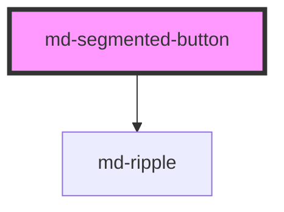

# md-segmented-button

<!-- llm:meta
tag: md-segmented-button
category: actions
status: sub-component
parent: md-segmented-button-set
standalone: false
m3-guidelines: https://m3.material.io/components/segmented-buttons/guidelines
form-associated: false
depends-on: md-ripple
used-by: none
-->

**One segment inside a `md-segmented-button-set`.** Carries a value, an
optional icon, a label, and the selected checkmark. The parent set owns
selection and stamps each segment with its position.

> 🧩 **Sub-component.** Only valid as a direct child of
> `md-segmented-button-set`. Standalone it still *renders* — with
> `segment-index="0"` / `segment-total="1"` it counts as both first and last, so
> it draws as a fully rounded pill — but nothing reconciles its selection, so
> clicking it changes nothing.

---

## When to use

- As a child of [`md-segmented-button-set`](../md-segmented-button-set), one per
  choice (M3 allows **2–5**). The set owns selection, keyboard reconciliation
  and the `mdChange` event; this element is the individual option.

## When NOT to use

| Situation | Use instead |
|---|---|
| A standalone toggle | `md-button toggle` |
| An action rather than a state | `md-button` / `md-icon-button` |
| A removable or filterable tag | `md-chip` |
| A panel switch | `md-tab` inside `md-tabs` |
| A form radio option | `md-radio` |
| Anywhere outside the set | Nothing — it won't be managed |

## API contract

```html
<md-segmented-button-set aria-label="Layout">
  <md-segmented-button value="grid" label="Grid" icon="grid_view" selected></md-segmented-button>
  <md-segmented-button value="list" label="List"></md-segmented-button>
</md-segmented-button-set>
```

| Prop | Attribute | Type | Default | Purpose |
|---|---|---|---|---|
| `value` | `value` | `string` | `''` | Identity reported in the set's `mdChange` |
| `label` | `label` | `string` | `''` | Segment text; wins over slotted text |
| `icon` | `icon` | `string` | `''` | Optional Material Symbols glyph |
| `selected` | `selected` | `boolean` | `false` | Selected state, and the way to express the initial selection |
| `disabled` | `disabled` | `boolean` | `false` | Inert, `tabindex="-1"`, skipped by arrow keys |
| `softDisabled` | `soft-disabled` | `boolean` | `false` | Looks disabled and ignores clicks, but stays focusable |
| `noCheckmark` | `no-checkmark` | `boolean` | `false` | **Suppresses** the selected checkmark |
| `ripple` | `ripple` | `boolean` | `true` | Render the `md-ripple` child |
| `density` | `density` | `-1` … `-4` | `0` | Local density rung; overrides the rung the set stamps |

`no-checkmark` **hides** the checkmark. (The one-line description in the
generated Properties table below reads the other way round; the behaviour above
is what the component does.)

**Parent-managed — never set these:** `segmentIndex`, `segmentTotal`,
`segmentDensity`, `segmentMultiselect`.

**Slots** — `(default)` for label content (used only when `label` is empty),
`icon` for a custom glyph in place of the `icon` prop.

**Events** — `mdSegmentClick` with `{ value, selected }`. **Internal**: the set
listens for it and calls `stopPropagation()`, so it never reaches an ancestor.
Listen to the set's `mdChange` instead.

**Methods** — none.

**Parts** — `state-layer`, `label`, plus the leading graphic, which carries
`part="icon"` while it shows the `icon` glyph and `part="checkmark"` while it
shows the selected check.

### Behavioral contract worth knowing

- The segment **does not toggle itself.** A click (or `Enter` / `Space`) only
  emits `mdSegmentClick`; the parent set is what writes `selected` — on this
  segment and, in single-select, on all of its siblings. Outside a set nothing
  ever changes.
- In single-select the emitted `selected` is always `true`: clicking the already
  selected segment cannot clear it. Only `multiselect` on the set produces a
  toggle.
- `selected` on a child is how you express the **initial** selection — the set
  has no `value` prop.
- **Every enabled segment is its own tab stop** (`tabindex="0"`); the set does
  not implement a roving tabindex. `disabled` sets `tabindex="-1"`;
  `soft-disabled` stays focusable and stays in the tab order.
- Arrow keys move focus to the previous/next non-disabled sibling and wrap
  around; `ArrowRight`/`ArrowDown` go forward, `ArrowLeft`/`ArrowUp` back. In
  single-select the arrow also activates the segment it lands on (the WAI-ARIA
  radiogroup pattern). `Home` / `End` are not handled.
- The accessible name comes from `label`, slotted text, or `aria-label`. With
  none of the three, a development-build console warning is logged.
- Slotted label text is read **once**, before the first render — text injected
  into the default slot later will not create the label box. Use the `label`
  prop for dynamic text.
- The checkmark is what conveys selection non-visually; `no-checkmark` removes
  that cue and leaves color alone.
- `segmentIndex` / `segmentTotal` drive the end-cap rounding. Wrong values (set
  by hand, or segments that the set never re-stamped) produce a broken
  container.

---

## Do / Don't

Sourced from [M3 · Segmented buttons · Guidelines](https://m3.material.io/components/segmented-buttons/guidelines).

| ✅ Do | ❌ Don't |
|---|---|
| Keep labels short and similar in length across segments | Don't let a label wrap to a second line |
| Use the same label type for every segment in the set | Don't mix icon-only segments with text segments |
| Use an icon only when its meaning is unmistakable | Don't use ambiguous icon-only segments |
| Give every segment a unique `value` | Don't omit `value` — the set reports values |
| Keep the checkmark unless you have a strong reason | Don't rely on color alone to show selection |
| Give icon-only segments an `aria-label` | Don't ship an unnamed icon-only segment |
| Use `disabled` for a genuinely unavailable choice | Don't add and remove segments as state changes |

---

## Patterns

```html
<!-- Text segments -->
<md-segmented-button-set aria-label="Time range">
  <md-segmented-button value="d" label="Day" selected></md-segmented-button>
  <md-segmented-button value="w" label="Week"></md-segmented-button>
  <md-segmented-button value="m" label="Month"></md-segmented-button>
</md-segmented-button-set>

<!-- Icon + label, consistent across the set -->
<md-segmented-button-set aria-label="Layout">
  <md-segmented-button value="list" icon="view_list" label="List" selected></md-segmented-button>
  <md-segmented-button value="grid" icon="grid_view" label="Grid"></md-segmented-button>
</md-segmented-button-set>

<!-- Icon-only, every segment labelled for AT -->
<md-segmented-button-set aria-label="Alignment">
  <md-segmented-button value="l" icon="format_align_left"   aria-label="Left" selected></md-segmented-button>
  <md-segmented-button value="c" icon="format_align_center" aria-label="Center"></md-segmented-button>
</md-segmented-button-set>

<!-- Custom glyph through the icon slot -->
<md-segmented-button-set aria-label="Filter">
  <md-segmented-button value="star" label="Starred">
    <svg slot="icon" viewBox="0 0 24 24" width="18" height="18" fill="currentColor" aria-hidden="true">
      <path d="M12 17.3 6.2 21l1.6-6.6L2.5 9.9l6.8-.6L12 3l2.7 6.3 6.8.6-5.3 4.5L17.8 21z"/>
    </svg>
  </md-segmented-button>
  <md-segmented-button value="all" label="All" selected></md-segmented-button>
</md-segmented-button-set>
```

## Anti-patterns

| ❌ Wrong | ✅ Right | Why |
|---|---|---|
| Standalone `md-segmented-button` | Nest it in `md-segmented-button-set` | The segment only *emits* `mdSegmentClick`; it never writes its own `selected`. With no set to listen, clicking does nothing. |
| Setting `segment-index` / `segment-total` | Let the set stamp them | Parent-owned; wrong values break the container shape. |
| Listening for `mdSegmentClick` | Listen to the set's `mdChange` | The set calls `stopPropagation()`, so the event never reaches your listener. |
| Toggling `selected` yourself in a click handler | Read the set's `mdChange` | The set already wrote it; a second write fights the set. |
| Segments wrapped in a `<div>` | Direct children only | The set's equal-width grid columns apply to direct children only, so a wrapper squeezes every segment inside it into a single column. (The shared seams still collapse — those come from this component's own CSS, driven by `segment-index` / `segment-total`, which the set stamps via a deep query.) |
| No `value` | Always set one | It is the identity in the set's change payload. |
| Icon-only segment with no `aria-label` | Add one | The glyph is `aria-hidden`, so it is not an accessible name. |
| `no-checkmark` in a multiselect set | Keep the checkmark | Without it, selection is color-only. |
| Expecting a `value` prop on the set to select this | Put `selected` here | The set has no `value` prop. |
| Expecting a click to deselect in single-select | Use `multiselect` on the set | Single-select always emits `selected: true`. |
| A long label that wraps | Shorten it | Labels are `white-space: nowrap`; M3 forbids wrapping segments. |
| `density="0"` to escape an inherited rung | `style="--md-sys-density-scale: 0"` | There is no `density="0"` rule; rung 0 is the inert default. |

## Accessibility, RTL, density, i18n

**Accessibility** — the host is `role="radio"` (or `role="checkbox"` when the
set is `multiselect`) with `aria-checked` mirroring `selected` and
`aria-disabled` when disabled or soft-disabled. `label`, slotted text or
`aria-label` supplies the name — icon-only segments need `aria-label`, since the
glyph is `aria-hidden`. The checkmark is the non-color selection cue; keep it
where you can. Focus shows a 3px inset `secondary` ring.

**RTL** — order and end-cap rounding flip automatically (the corner radii use
logical properties). Swap directional glyphs yourself.

**Density** — the set pushes its rung down to every segment; a local
`density="-1"`…`"-4"` on the segment overrides it. Each rung removes 4px from
the 40px height (`-4` = 24px) and tapers the icon, gap and label type with it.

**i18n** — translate `label`. Keep translated labels short and similar in
length so the set neither wraps nor jumps in width.

## Related components

`md-segmented-button-set` · `md-button-group` · `md-chip` · `md-tab` ·
`md-radio` · `md-ripple`

## Theming

| Custom property | Purpose | Default |
|---|---|---|
| `--md-segmented-button-container-color` | Unselected background | `transparent` |
| `--md-segmented-button-selected-container-color` | Selected background | `--md-sys-color-secondary-container` |
| `--md-segmented-button-label-color` | Unselected label/icon color | `--md-sys-color-on-surface` |
| `--md-segmented-button-selected-label-color` | Selected label/icon color | `--md-sys-color-on-secondary-container` |
| `--md-segmented-button-outline-color` | Divider / outline | `--md-sys-color-outline` |
| `--md-segmented-button-container-shape` | End-cap radius | `--md-sys-shape-corner-full` (`9999px`) |
| `--md-segmented-button-icon-size` | Glyph and checkmark box | `18px` at density 0 |

**CSS parts** — `state-layer`, `label`, `icon`, `checkmark`.

```css
/* Square-ended segments, tinted selection */
md-segmented-button {
  --md-segmented-button-container-shape: 8px;
  --md-segmented-button-selected-container-color: var(--md-sys-color-tertiary-container);
  --md-segmented-button-selected-label-color: var(--md-sys-color-on-tertiary-container);
}
```

<!-- Auto Generated Below -->


## Properties

| Property             | Attribute             | Description                                                                                                                                                                                           | Type                        | Default |
| -------------------- | --------------------- | ----------------------------------------------------------------------------------------------------------------------------------------------------------------------------------------------------- | --------------------------- | ------- |
| `density`            | `density`             | Local density rung. Drives the same `--md-sys-density-scale` signal that a global `data-density` ancestor sets, so a local value simply overrides the inherited one. 0 = default, -4 = ultra-compact. | `-1 \| -2 \| -3 \| -4 \| 0` | `0`     |
| `disabled`           | `disabled`            | Disable this segment                                                                                                                                                                                  | `boolean`                   | `false` |
| `icon`               | `icon`                | Material Symbols icon name (optional)                                                                                                                                                                 | `string`                    | `''`    |
| `label`              | `label`               | Label text                                                                                                                                                                                            | `string`                    | `''`    |
| `noCheckmark`        | `no-checkmark`        | Show checkmark icon when selected                                                                                                                                                                     | `boolean`                   | `false` |
| `ripple`             | `ripple`              | Enable/disable ripple                                                                                                                                                                                 | `boolean`                   | `true`  |
| `segmentDensity`     | `segment-density`     | Density value from parent set (managed by md-segmented-button-set)                                                                                                                                    | `number`                    | `0`     |
| `segmentIndex`       | `segment-index`       | Position index within the set (managed by md-segmented-button-set)                                                                                                                                    | `number`                    | `0`     |
| `segmentMultiselect` | `segment-multiselect` | Whether the parent set is in multiselect mode (managed by md-segmented-button-set)                                                                                                                    | `boolean`                   | `false` |
| `segmentTotal`       | `segment-total`       | Total number of segments in the set (managed by md-segmented-button-set)                                                                                                                              | `number`                    | `1`     |
| `selected`           | `selected`            | Whether this segment is selected                                                                                                                                                                      | `boolean`                   | `false` |
| `softDisabled`       | `soft-disabled`       | Visually disabled but remains focusable for screen readers                                                                                                                                            | `boolean`                   | `false` |
| `value`              | `value`               | Unique value identifying this segment                                                                                                                                                                 | `string`                    | `''`    |


## Events

| Event            | Description                        | Type                                                 |
| ---------------- | ---------------------------------- | ---------------------------------------------------- |
| `mdSegmentClick` | Internal event — caught by the set | `CustomEvent<{ value: string; selected: boolean; }>` |


## Shadow Parts

| Part            | Description |
| --------------- | ----------- |
| `"label"`       |             |
| `"state-layer"` |             |


## Dependencies

### Depends on

- [md-ripple](../md-ripple)

### Graph


----------------------------------------------

*Built with [StencilJS](https://stenciljs.com/)*
