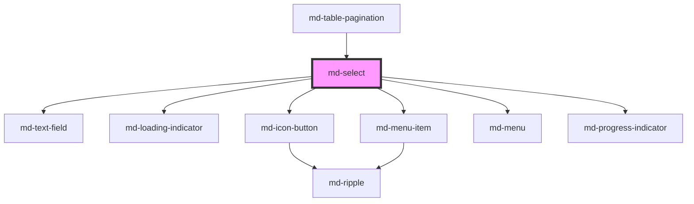

# md-select

<!-- llm:meta
tag: md-select
category: selection
status: md3-mapped
m3-guidelines: https://m3.material.io/components/menus/guidelines
form-associated: true
depends-on: md-text-field, md-loading-indicator, md-icon-button, md-menu-item, md-menu, md-progress-indicator
used-by: md-table-pagination
accepts-children: md-select-option
-->

**Pick exactly one value from a list.** A readonly `md-text-field` trigger with
an `md-menu` listbox popup, optional in-menu filtering, async option loading and
row virtualization for large lists. Form-associated with full constraint
validation.

> Setup, theming, density and i18n are configured once for the whole library —
> see [`main-llm.md`](../../../../../main-llm.md) at the repo root.

---

## When to use

- **One** value from a list of roughly **5 or more** options.
- Options are known (static, fetched, or filtered server-side).
- Space is constrained — the list should stay collapsed until needed.

## When NOT to use

| Situation | Use instead |
|---|---|
| Five or fewer options that should all be visible | `md-radio` |
| Several values may be chosen | `md-multi-select` |
| The user types free text with suggestions | `md-autocomplete` |
| 2–5 exclusive view/mode options | `md-segmented-button-set` |
| A date or time | `md-date-picker` / `md-time-picker` |
| Running actions rather than choosing a value | `md-menu` |
| A boolean | `md-switch` / `md-checkbox` |

## Decision cues

| Need | Setting |
|---|---|
| Options in markup | `md-select-option` children |
| Options from data | `options` property (array in JS, or a JSON-array attribute) |
| Async / very large datasets | `loadOptions(source)` + `loading` |
| Search box inside the menu | `filterable` (+ `filter-mode`) — works with children or `options` |
| Server-side search | `filterable` + `loadOptions()` then `setQuery()` |
| Thousands of rows | `virtualize="always"` (+ `row-height`) |
| Menu wider/narrower than the field | `match-trigger-width="false"` |
| Open upward | `placement="top-start"` |
| Allow clearing | `clearable` |
| Reserve space for the message line | `reserve-supporting-space` |
| Fill the parent's width | `full-width` |

## API contract

```html
<md-select
  variant="filled|outlined"                 <!-- default: outlined -->
  label="Country"
  placeholder="Choose…"
  value="fr"                                <!-- default: '' (nothing selected) -->
  name="country"
  required                                  <!-- default: false -->
  supporting-text="Where you're billed"
  error error-text="Select a country"
  clearable                                 <!-- default: false -->
  clear-icon="close"                        <!-- default: close -->
  clear-label="Clear selection"             <!-- default: Clear selection -->
  dropdown-icon="arrow_drop_down"           <!-- default: arrow_drop_down -->
  filterable                                <!-- default: false -->
  filter-mode="substring"                   <!-- default: substring -->
  virtualize="auto|always|never"            <!-- default: auto -->
  row-height="48"                           <!-- default: measured from row 1 -->
  placement="bottom-start|bottom-end|top-start|top-end"   <!-- default: bottom-start -->
  match-trigger-width                       <!-- default: true -->
  max-height="320"                          <!-- number = px, or any CSS length -->
  full-width                                <!-- default: false -->
  open                                      <!-- default: false; see contract note -->
  loading                                   <!-- default: false -->
  loading-text="Loading…"                   <!-- default: Loading… -->
  search-placeholder="Search…"              <!-- default: Search… -->
  filter-label="Filter countries"           <!-- default: 'Filter <label>' -->
  no-results-text="No results"              <!-- default: No results -->
  no-options-text="No options"              <!-- default: No options -->
  searching-label="Searching"               <!-- default: Searching -->
  value-missing-label="Please select an item in the list."
  reserve-supporting-space                  <!-- default: false -->
  disabled                                  <!-- default: false -->
  density="-1|-2|-3|-4"                     <!-- default: 0 = uncompacted -->
>
  <md-select-option value="fr">France</md-select-option>
  <md-select-option value="de">Germany</md-select-option>
</md-select>
```

**Events** — `mdChange` (`CustomEvent<string>`, the new value), `mdOpen`
(`void`), `mdClose` (`void`) — all three bubble and are composed;
`mdValidityChange` (`{ valid, validationMessage, flags }`) bubbles but is
**not composed**.

**Methods** — `show()`, `close()`, `focusTrigger()`, `reset()`,
`loadOptions(source)`, `setQuery(query)`, `getLabels(values)` *(virtualized
lists only — see below)*, `getValidity()`, `checkValidity()`,
`reportValidity()`, `setCustomValidity(message)`. All are async (they return a
promise).

**Slots** — default: the `md-select-option` children (kept hidden in the light
DOM as data carriers); `dropdown-icon` replaces the caret glyph; `loader`
replaces the trigger spinner shown while `loading`.

**Parts** — `field`, `field-container`, `trailing`, `clear`, `caret`,
`loading-spinner`, `loading-bar`, `loading-progress`, `menu`, `option`,
`option-selected`, `option-icon`, `search`, `search-wrap`, `search-spinner`.

### Behavioral contract worth knowing

- **Two option sources, with a defined winner.** Slotted `md-select-option`
  children take precedence; the `options` array is only read when there are no
  such children. Nothing merges — pick one source.
- `options` accepts the array as a **JS property** or a **JSON array string**
  as an attribute (`options='[{"value":"fr","label":"France"}]'`). Malformed
  JSON warns on the console and degrades to an empty list. An option entry
  without a `label` falls back to its `value`.
- `value` is a **single string**; `''` means nothing is selected.
- `getLabels(values)` only answers on the **virtualized** path, where it
  resolves values that are outside the current filter/window. On a plain
  (non-virtualized) list it returns `{}` — read the labels off your own
  `options` data or the `md-select-option` children instead.
- An option carrying `selected` is adopted **only at load, and only when
  `value` is still empty**. After that the parent's `value` is authoritative.
- Re-picking the option that is already selected closes the menu and emits
  **nothing**. Picking a different one sets `value`, emits `mdChange`, closes
  the menu and returns focus to the trigger.
- The clear (✕) button and `reset()` both set `value` to `''` and emit
  `mdChange('')`. `reset()` is a no-op when nothing is selected. A `<form>`
  reset restores the value the element loaded with and emits **nothing**.
- `open` is honoured as a *change*, not as an initial value: `<md-select open>`
  renders the trigger closed. Call `show()` (or set `.open = true`) after the
  element has upgraded.
- Keyboard on the trigger: `ArrowDown` / `Enter` / `Space` open; `Escape`
  closes and returns focus to the trigger. Arrow navigation and type-ahead
  inside the list come from `md-menu`.
- `filterable` renders a search box **inside the menu**, whichever way the
  options were supplied. A plain (non-virtualized) list filters client-side on
  **label or supporting text**, case-insensitively and synchronously; a
  virtualized one filters inside the WASM engine, debounced, with a spinner. No
  match shows `no-results-text`; an empty dataset shows `no-options-text`. The
  box is uncontrolled and unmounts with the menu, so closing clears the query.
- `setQuery(q)` filters the menu exactly as typing into that box would, and
  mirrors `q` into the box so the two agree. Apply it **after `loadOptions()`
  resolves** — loading replaces the whole option set, so a query applied
  against a store still packing is discarded.
- `virtualize="auto"` switches to the virtualized path above 200 options.
  Virtualized rows render label, supporting text and selection only: a
  per-option `iconColor` is **not** carried across (those rows fall back to
  `--md-select-option-icon-color`). Give a `row-height` when your rows are not
  a uniform height. A virtualized menu needs a bounded viewport, so `max-height`
  defaults to `320` there when you leave it unset.
- `loading` swaps the trigger caret for a spinner, sets `aria-busy` on the
  host, and replaces the menu body with a wavy indeterminate progress bar — the
  filter box is not rendered while it is on.
- `required` is published to the owning form through `ElementInternals`, so an
  empty required select really blocks submission. `setCustomValidity(msg)` wins
  over the `required` message; clear it with `''`.
- `mdValidityChange` never fires on mount — the first evaluation only primes the
  baseline — and it repeats nothing: identical validity stays silent.
- `mdValidityChange` is **not composed**, deliberately, so the embedded
  `md-text-field`'s own validity event cannot be mistaken for the select's.
  Listen on the `md-select` element itself.
- `mdOpen` / `mdClose` **are** composed, so they also fire on an embedding
  shadow host at `AT_TARGET` — guard against double handling if you wrap this
  component.
- `md-select-option` children are hidden data carriers; the visible rows are
  `md-menu-item`s the select renders into its own shadow root. Theme the
  select / menu, never the option.

---

## Do / Don't

Row and menu guidance sourced from
[M3 · Menus · Guidelines](https://m3.material.io/components/menus/guidelines);
the rest are contract rules for this component.

| ✅ Do | ❌ Don't |
|---|---|
| Use a select when the list is long enough to justify collapsing | Don't use one for two or three options — show radios |
| Always set a `label` | Don't rely on `placeholder` as the label |
| Order options meaningfully (frequency, alphabetical, numeric) | Don't order arbitrarily |
| Turn on `filterable` past ~15 options | Don't force scrolling through a long unfiltered list |
| Keep option labels short and scannable | Don't write sentence-length option rows |
| Use `disabled` options to show unavailable choices | Don't silently drop options |
| Localize every text prop | Don't ship the English defaults in a translated app |
| Swap supporting text for error text | Don't show both at once |
| Give the menu a sensible `max-height` | Don't let the dropdown run off-screen |

---

## Patterns

```html
<!-- Declarative options -->
<md-select id="priority" label="Priority" value="med" name="priority" required>
  <md-select-option value="low">Low</md-select-option>
  <md-select-option value="med">Medium</md-select-option>
  <md-select-option value="high" supporting-text="Pages on-call">High</md-select-option>
</md-select>

<script type="module">
  const sel = document.getElementById('priority');
  sel.addEventListener('mdChange', (e) => console.log(e.detail)); // string
</script>
```

```html
<!-- Options inline, with no script at all: a JSON array attribute -->
<md-select
  label="Country"
  options='[{"value":"fr","label":"France"},{"value":"de","label":"Germany"}]'
></md-select>
```

```html
<!-- A search box over markup-authored options — no virtualization involved -->
<md-select label="Country" filterable>
  <md-select-option value="fr">France</md-select-option>
  <md-select-option value="de" supporting-text="Berlin">Germany</md-select-option>
  <md-select-option value="es">Spain</md-select-option>
</md-select>
```

```html
<!-- Large list: virtualize with a fixed row height, load on first open -->
<md-select id="airports" label="Airport" filterable
           virtualize="always" row-height="48"></md-select>

<script type="module">
  const el = document.getElementById('airports');

  let loaded = null;
  const load = async () => {
    el.loading = true;
    // await the LOAD, not just the fetch: loadOptions resolves once the store
    // has finished packing, and filtering before that is discarded.
    await el.loadOptions(await fetchAirports());
    el.loading = false;
  };

  el.addEventListener('mdOpen', () => (loaded ??= load()));

  // Programmatic filtering, after the dataset is in place.
  document.getElementById('search-form')?.addEventListener('submit', async (e) => {
    e.preventDefault();
    await loaded;
    await el.setQuery('fra'); // filters the menu AND fills the search box
  });
</script>
```

```html
<!-- Localized: every default-English string replaced -->
<md-select label="Pays" filterable clearable
  search-placeholder="Rechercher…"
  no-results-text="Aucun résultat"
  no-options-text="Aucune option"
  clear-label="Effacer la sélection"
  searching-label="Recherche en cours"
  loading-text="Chargement…"
  value-missing-label="Veuillez sélectionner un élément."></md-select>
```

## Anti-patterns

| ❌ Wrong | ✅ Right | Why |
|---|---|---|
| Supplying `md-select-option` children **and** `options` | Pick one source | Children win outright; the array is silently ignored. |
| `<option>` or `<md-menu-item>` as children | `md-select-option` | Only its own carriers are read. |
| Styling `md-select-option` | Theme the select / menu | The carrier is `display: none`; the visible row is an `md-menu-item`. |
| Expecting `value` to be an array | It is a single string | Use `md-multi-select` for several. |
| `<md-select open>` to start expanded | Call `show()` after upgrade | The initial value of `open` does not trigger the watcher. |
| Listening for `mdValidityChange` on a shadow ancestor | Listen on the element | It is `composed: false`. |
| Handling `mdOpen` on both the select and its wrapper | Guard for `AT_TARGET` | Composed events also fire on an embedding host. |
| Virtualizing variable-height rows without `row-height` | Set it | The scroll position drifts otherwise. |
| `setQuery()` straight after kicking off a fetch | `await` the `loadOptions()` promise first | Loading replaces the option set and discards the filter. |
| Reaching for `virtualize` just to get a search box | `filterable` alone | It filters markup-authored options too. |
| Expecting a per-option `icon-color` in a virtualized list | Set `--md-select-option-icon-color` | The packed row store carries no colour column. |
| Shipping the default English strings in a localized app | Feed every text prop | They all default to English. |
| A hidden `<input>` to submit the value | Use `name` | The element is already form-associated. |

## Accessibility, RTL, density, i18n

**Accessibility**
- `label` supplies the accessible name; with no visible label, `aria-label` or
  `aria-labelledby` on the host is resolved and forwarded onto the real input.
- The popup is a `role="listbox"` whose rows are `role="option"` with
  `aria-selected`. The host carries `aria-haspopup="listbox"` and deliberately
  no `aria-expanded` (the host has no role, so it would be ignored).
- With `filterable`, the in-menu search input carries `role="combobox"`,
  `aria-haspopup="listbox"`, `aria-expanded` and `aria-controls` pointing at
  the listbox. Both live in this shadow root, so do not try to wire those
  IDREFs from outside — they cannot cross the boundary. Focus differs by path:
  on a **virtualized** filterable list the input keeps focus while the popup is
  open and the active row is conveyed on it via `aria-activedescendant`; on a
  plain (non-virtualized) filterable list the menu moves real focus to the
  first option row instead, and the input gets no `aria-activedescendant`.
- `Escape` closes the menu and returns focus to the trigger.
- Errors appear in the supporting line; keep `reserve-supporting-space` on in
  dense forms so the layout does not jump.
- Set `max-height` so the menu stays reachable on short viewports.

**RTL** — field, caret and menu alignment mirror under `dir="rtl"`.
`placement` is logical (`bottom-start` follows reading order).

**Density** — `density="-1"` … `density="-4"` compacts the trigger and the menu
rows. There is no `density="0"` rung: 0 is the uncompacted default and setting
it does nothing. To opt a select out of an inherited `data-density` rung, set
`style="--md-sys-density-scale: 0"` on it — note that only resets the
calc-driven scale, not the spacing tokens the ancestor rung declares.

**i18n** — translate `label`, `placeholder`, `supporting-text`, `error-text`,
`search-placeholder`, `filter-label`, `no-results-text`, `no-options-text`,
`clear-label`, `searching-label`, `loading-text` and `value-missing-label`.
Option labels come from your data or the slotted text; keep `value` an
untranslated identifier.

## Related components

`md-select-option` · `md-multi-select` · `md-autocomplete` · `md-menu` ·
`md-menu-item` · `md-radio` · `md-text-field` · `md-segmented-button-set`

## Theming

| Custom property | Purpose | Default |
|---|---|---|
| `--md-select-width` | Host inline size | `100%` |
| `--md-select-min-width` | Host minimum inline size | `0` |
| `--md-select-caret-color` | Dropdown caret colour | `--md-sys-color-on-surface-variant` |
| `--md-select-caret-size` | Dropdown caret glyph size | `24px` |
| `--md-select-clear-color` | Clear (✕) icon + state-layer colour | the caret colour |
| `--md-select-trailing-gap` | Gap between the clear button and the caret | `2px` |
| `--md-select-option-icon-color` | Leading icon colour in option rows | `--md-sys-color-on-surface-variant` |
| `--md-select-spinner-size` | Trigger busy-spinner size while `loading` | `22px` |

**CSS parts** — `field`, `field-container`, `trailing`, `clear`, `caret`,
`loading-spinner`, `loading-bar`, `loading-progress`, `menu`, `option`,
`option-selected`, `option-icon`, `search`, `search-wrap`, `search-spinner`.

The composed field and menu expose their own `--md-text-field-*`, `--md-menu-*`
and `--md-menu-item-*` properties, which flow through when set on the host.

```css
md-select {
  --md-select-min-width: 220px;
  --md-select-caret-color: var(--md-sys-color-primary);
}

md-select::part(option-selected) {
  font-weight: 600;
}
```

<!-- Auto Generated Below -->


## Overview

`md-select` — Material Design 3 single-select dropdown.

Composes the library's own primitives instead of re-implementing them:
  - `md-text-field` is the trigger surface, so the picker inherits the
    full filled/outlined visuals, density scale, floating label, error
    state, supporting text, and focus ring of every other input. It is
    `readonly` (not editable) and `appear-focused` while the menu is open
    so the field + menu read as one connected control.
  - `md-menu` is the option surface, so the picker inherits open/close
    motion, viewport-aware positioning, single-open coordination, roving
    tabindex, type-ahead, and Escape/Home/End — for free.

Options are authored either declaratively as slotted `<md-select-option>`
children (primary API) or via the programmatic `options` array. Each
becomes a `type="radio"` `md-menu-item` so only one is ever selected.

## Properties

| Property                 | Attribute                  | Description                                                                                                                                                                                                                                                                                                                                                                                                                                                    | Type                                                         | Default                                |
| ------------------------ | -------------------------- | -------------------------------------------------------------------------------------------------------------------------------------------------------------------------------------------------------------------------------------------------------------------------------------------------------------------------------------------------------------------------------------------------------------------------------------------------------------- | ------------------------------------------------------------ | -------------------------------------- |
| `clearIcon`              | `clear-icon`               | Icon (Material Symbols name) for the clear button (`clearable`).                                                                                                                                                                                                                                                                                                                                                                                               | `string`                                                     | `'close'`                              |
| `clearLabel`             | `clear-label`              | Accessible label for the clear button (`clearable`).                                                                                                                                                                                                                                                                                                                                                                                                           | `string`                                                     | `'Clear selection'`                    |
| `clearable`              | `clearable`                | Show a clear (✕) button in the trigger when a value is selected.                                                                                                                                                                                                                                                                                                                                                                                               | `boolean`                                                    | `false`                                |
| `density`                | `density`                  | Density forwarded to the inner field (0 = comfortable … -3 = compact).                                                                                                                                                                                                                                                                                                                                                                                         | `-1 \| -2 \| -3 \| -4 \| 0`                                  | `0`                                    |
| `disabled`               | `disabled`                 | Disabled — non-interactive.                                                                                                                                                                                                                                                                                                                                                                                                                                    | `boolean`                                                    | `false`                                |
| `dropdownIcon`           | `dropdown-icon`            | Caret icon; rotates 180° when open. Slot `dropdown-icon` overrides it.                                                                                                                                                                                                                                                                                                                                                                                         | `string`                                                     | `'arrow_drop_down'`                    |
| `error`                  | `error`                    | Error state — forwarded to the inner field.                                                                                                                                                                                                                                                                                                                                                                                                                    | `boolean`                                                    | `false`                                |
| `errorText`              | `error-text`               | Error text rendered in place of supporting text when `error` is set.                                                                                                                                                                                                                                                                                                                                                                                           | `string`                                                     | `''`                                   |
| `filterLabel`            | `filter-label`             | Accessible name for the filter field. Falls back to `Filter <label>`.                                                                                                                                                                                                                                                                                                                                                                                          | `string`                                                     | `''`                                   |
| `filterMode`             | `filter-mode`              | Filter strategy used by `filterable` / `setQuery`.                                                                                                                                                                                                                                                                                                                                                                                                             | `"fuzzy" \| "prefix" \| "substring"`                         | `'substring'`                          |
| `filterable`             | `filterable`               | Show a search field in the menu header. A plain list filters client-side on label / supporting text; a virtualized one filters inside the WASM engine. Closing the menu clears the query.                                                                                                                                                                                                                                                                                                                                                                                       | `boolean`                                                    | `false`                                |
| `fullWidth`              | `full-width`               | Stretch the control to fill its parent's inline width (otherwise it sizes to a sensible default). The dropdown follows when `match-trigger-width` is set.                                                                                                                                                                                                                                                                                                      | `boolean`                                                    | `false`                                |
| `label`                  | `label`                    | Floating label / accessible name.                                                                                                                                                                                                                                                                                                                                                                                                                              | `string`                                                     | `''`                                   |
| `loading`                | `loading`                  | Show a busy state: the trigger shows a spinner instead of the caret and the host is `aria-busy`. Use while an async dataset loads (e.g. before/around a large `loadOptions`). Replace the spinner with the `loader` slot.                                                                                                                                                                                                                                      | `boolean`                                                    | `false`                                |
| `loadingText`            | `loading-text`             | Text shown in the trigger / menu while `loading` is true.                                                                                                                                                                                                                                                                                                                                                                                                      | `string`                                                     | `'Loading…'`                           |
| `matchTriggerWidth`      | `match-trigger-width`      | Match the dropdown width to the trigger width. When `false` the menu sizes to its content (down to its own min-width). Maps to `md-menu`'s `match-anchor-width`. Default `true` — the expected select behaviour.                                                                                                                                                                                                                                               | `boolean`                                                    | `true`                                 |
| `maxHeight`              | `max-height`               | Cap the dropdown height. When the options exceed it the list scrolls vertically with top/bottom edge shadows. A number is pixels; any CSS length is passed through (e.g. `'50vh'`). Forwarded to `md-menu`'s `max-height`.                                                                                                                                                                                                                                     | `number \| string \| undefined`                              | `undefined`                            |
| `name`                   | `name`                     | Form field name. The selected value is submitted under this name.                                                                                                                                                                                                                                                                                                                                                                                              | `string`                                                     | `''`                                   |
| `noOptionsText`          | `no-options-text`          | Empty-state text when there are no options at all.                                                                                                                                                                                                                                                                                                                                                                                                             | `string`                                                     | `'No options'`                         |
| `noResultsText`          | `no-results-text`          | Empty-state text when a filter matches nothing.                                                                                                                                                                                                                                                                                                                                                                                                                | `string`                                                     | `'No results'`                         |
| `open`                   | `open`                     | Open state of the dropdown. Reflected so `:host([open])` rules apply.                                                                                                                                                                                                                                                                                                                                                                                          | `boolean`                                                    | `false`                                |
| `options`                | --                         | Programmatic options. Ignored when `<md-select-option>` children exist.                                                                                                                                                                                                                                                                                                                                                                                        | `SelectOptionInit[]`                                         | `[]`                                   |
| `placeholder`            | `placeholder`              | Placeholder shown when no value is selected.                                                                                                                                                                                                                                                                                                                                                                                                                   | `string`                                                     | `''`                                   |
| `placement`              | `placement`                | Menu placement relative to the trigger — forwarded to `md-menu`.                                                                                                                                                                                                                                                                                                                                                                                               | `"bottom-end" \| "bottom-start" \| "top-end" \| "top-start"` | `'bottom-start'`                       |
| `required`               | `required`                 | Required (form validation parity).                                                                                                                                                                                                                                                                                                                                                                                                                             | `boolean`                                                    | `false`                                |
| `reserveSupportingSpace` | `reserve-supporting-space` | Always occupy the supporting-text line, even when there is no message, so a validation error does not push the content below it down. Forwarded to the embedded md-text-field. See that component for why it is opt-in.                                                                                                                                                                                                                                        | `boolean`                                                    | `false`                                |
| `rowHeight`              | `row-height`               | Fixed virtualized row height (px). Auto-measured from the first row if unset.                                                                                                                                                                                                                                                                                                                                                                                  | `number \| undefined`                                        | `undefined`                            |
| `searchPlaceholder`      | `search-placeholder`       | Placeholder for the in-menu filter field (`filterable`).                                                                                                                                                                                                                                                                                                                                                                                                       | `string`                                                     | `'Search…'`                            |
| `searchingLabel`         | `searching-label`          | Accessible label for the in-menu loading spinner while filtering.                                                                                                                                                                                                                                                                                                                                                                                              | `string`                                                     | `'Searching'`                          |
| `supportingText`         | `supporting-text`          | Supporting / helper text rendered below the field.                                                                                                                                                                                                                                                                                                                                                                                                             | `string`                                                     | `''`                                   |
| `value`                  | `value`                    | Selected option value. Empty string = nothing selected.                                                                                                                                                                                                                                                                                                                                                                                                        | `string`                                                     | `''`                                   |
| `valueMissingLabel`      | `value-missing-label`      | Localized constraint-validation message shown when `required` is unmet.  A prop rather than a hardcoded string, matching md-time-picker's `value-missing-label`: components stay i18n-engine-agnostic and the consumer localizes through its own dictionary. Native inputs get their message from the browser's locale for free; a form-associated custom element supplies its own, so leaving this hardcoded would ship an English-only form to every locale. | `string`                                                     | `'Please select an item in the list.'` |
| `variant`                | `variant`                  | Visual variant — forwarded to the inner `md-text-field`.                                                                                                                                                                                                                                                                                                                                                                                                       | `"filled" \| "outlined"`                                     | `'outlined'`                           |
| `virtualize`             | `virtualize`               | Virtualization mode for large option lists (backed by a WASM data engine):   - `'auto'` (default): virtualize only above `VIRTUALIZE_THRESHOLD` rows.   - `'always'`: always virtualize the `options` / `loadOptions` dataset.   - `'never'`: keep the classic DOM rendering regardless of size. Virtualized rows render label + selection only (no per-row icon / supporting text) and assume a uniform row height.                                           | `"always" \| "auto" \| "never"`                              | `'auto'`                               |


## Events

| Event              | Description                                                                                                                                                                                                                                                                                                                                                                                                                                                                                                                                                              | Type                                                                                          |
| ------------------ | ------------------------------------------------------------------------------------------------------------------------------------------------------------------------------------------------------------------------------------------------------------------------------------------------------------------------------------------------------------------------------------------------------------------------------------------------------------------------------------------------------------------------------------------------------------------------ | --------------------------------------------------------------------------------------------- |
| `mdChange`         | Emits the newly selected value whenever the selection changes.                                                                                                                                                                                                                                                                                                                                                                                                                                                                                                           | `CustomEvent<string>`                                                                         |
| `mdClose`          | Emits when the dropdown closes.                                                                                                                                                                                                                                                                                                                                                                                                                                                                                                                                          | `CustomEvent<void>`                                                                           |
| `mdOpen`           | Emits when the dropdown opens.                                                                                                                                                                                                                                                                                                                                                                                                                                                                                                                                           | `CustomEvent<void>`                                                                           |
| `mdValidityChange` | Fires when this control's validity CHANGES — never on every keystroke, and never for a re-publish that lands on the same state.  `composed: false` is deliberate. Composites like md-select embed an md-text-field, and a composed event escapes that inner shadow root, so a listener on md-select would receive the inner field's event as well as the host's — two events, different payloads, for one logical control. Keeping it uncomposed means each component reports only for itself, while `bubbles: true` still lets a <form> or app root hear every control. | `CustomEvent<{ valid: boolean; validationMessage: string; flags: Record<string, boolean>; }>` |


## Methods

### `checkValidity() => Promise<boolean>`

Constraint-validation API, matching md-text-field and the native contract.

#### Returns

Type: `Promise<boolean>`


### `close() => Promise<void>`

Close the dropdown programmatically.

#### Returns

Type: `Promise<void>`


### `focusTrigger() => Promise<void>`

Move focus to the trigger field.

#### Returns

Type: `Promise<void>`


### `getLabels(values: string[]) => Promise<Record<string, string>>`

Resolve labels for values that may be outside the current filter/window.

#### Parameters

| Name     | Type       | Description |
| -------- | ---------- | ----------- |
| `values` | `string[]` |             |

#### Returns

Type: `Promise<Record<string, string>>`


### `getValidity() => Promise<{ valid: boolean; validationMessage: string; flags: Record<string, boolean>; }>`

Current validity: boolean, message and flags. Mirrors md-text-field.

#### Returns

Type: `Promise<{ valid: boolean; validationMessage: string; flags: Record<string, boolean>; }>`


### `loadOptions(source: SelectOptionInit[] | OptionRowSource) => Promise<void>`

Load a large dataset into the WASM-backed virtualized list (the high-scale
entry point). Accepts a materialised `SelectOptionInit[]` or a row factory
(`{ count, getRow }`) — the factory streams rows into WASM one at a time, so
tens of millions of options never exist as JS objects at once. Falls back to
plain DOM rendering when `virtualize="never"` or WebAssembly is unavailable.

#### Parameters

| Name     | Type                                    | Description |
| -------- | --------------------------------------- | ----------- |
| `source` | `OptionRowSource \| SelectOptionInit[]` |             |

#### Returns

Type: `Promise<void>`


### `reportValidity() => Promise<boolean>`

Like checkValidity(), but also shows the browser's validation message.

#### Returns

Type: `Promise<boolean>`


### `reset() => Promise<void>`

Clear the selection.

#### Returns

Type: `Promise<void>`


### `setCustomValidity(message: string) => Promise<void>`

App/server-side validation: a non-empty message marks the control invalid
for its form until cleared with an empty string.

#### Parameters

| Name      | Type     | Description |
| --------- | -------- | ----------- |
| `message` | `string` |             |

#### Returns

Type: `Promise<void>`


### `setQuery(query: string) => Promise<void>`

Filter the menu exactly as typing into the in-menu search field would — the text
is mirrored into that field too, so the list and the box agree. Apply it AFTER
`loadOptions()` has resolved: loading replaces the whole option set and would
overwrite the filter.

#### Parameters

| Name    | Type     | Description |
| ------- | -------- | ----------- |
| `query` | `string` |             |

#### Returns

Type: `Promise<void>`


### `show() => Promise<void>`

Open the dropdown programmatically.

#### Returns

Type: `Promise<void>`


## Slots

| Slot              | Description                                                           |
| ----------------- | --------------------------------------------------------------------- |
|                   | `md-select-option` children for the dropdown (primary authoring API). |
| `"dropdown-icon"` | Replaces the caret glyph (e.g. a custom SVG). Rotates 180° when open. |
| `"loader"`        | Replaces the busy-state spinner shown in the trigger while `loading`. |


## Shadow Parts

| Part                 | Description                                                    |
| -------------------- | -------------------------------------------------------------- |
| `"caret"`            | The dropdown caret glyph.                                      |
| `"clear"`            | The clear (✕) `md-icon-button`.                                |
| `"field"`            | The inner `md-text-field` trigger surface.                     |
| `"field-container"`  | The text-field's container box (border/fill).                  |
| `"loading-bar"`      | The busy-state container in the menu (`loading`).              |
| `"loading-progress"` | The wavy progress indicator shown in the menu while `loading`. |
| `"loading-spinner"`  | The busy-state spinner in the trigger (`loading`).             |
| `"menu"`             | The `md-menu` option surface.                                  |
| `"option"`           | Each option row (`md-menu-item`).                              |
| `"option-icon"`      | An option's leading icon.                                      |
| `"option-selected"`  | The currently selected option row.                             |
| `"search"`           | The filter input (`filterable`).                               |
| `"search-spinner"`   | The in-menu spinner shown while filtering.                     |
| `"search-wrap"`      |                                                                |
| `"trailing"`         | The trailing cluster wrapping the clear + caret.               |


## Dependencies

### Used by

 - [md-table-pagination](../md-table-pagination)

### Depends on

- [md-text-field](../md-text-field)
- [md-loading-indicator](../md-loading-indicator)
- [md-icon-button](../md-icon-button)
- [md-menu-item](../md-menu-item)
- [md-menu](../md-menu)
- [md-progress-indicator](../md-progress-indicator)

### Graph


----------------------------------------------

*Built with [StencilJS](https://stenciljs.com/)*
