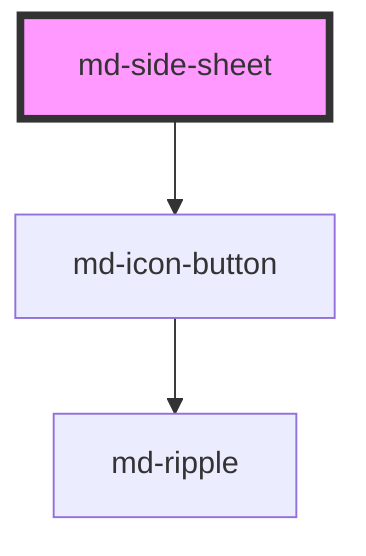

# md-side-sheet

<!-- llm:meta
tag: md-side-sheet
category: containment
status: md3-mapped
m3-guidelines: https://m3.material.io/components/side-sheets/guidelines
form-associated: false
depends-on: md-icon-button
used-by: none
-->

**Supplementary content along the side of the screen.** Standard (an inline,
non-modal region that sits beside your content) or modal (a fixed overlay with
a scrim and a focus trap), anchored to either logical edge, with an optional
back affordance for nested flows.

> Setup, theming, density and i18n are configured once for the whole library —
> see the library-wide specification, shipped next to these manuals as
> `main-llm.md` at the root of the `@awc-ui/core` package.

---

## When to use

- **Desktop / large-screen** supplementary content: filters, details, help, a
  properties panel.
- Content the user consults **alongside** the main view
  (`variant="standard"`).
- A focused side task over the content (`variant="modal"`).
- Nested navigation within the panel (`show-back`, modal only).

## When NOT to use

| Situation | Use instead |
|---|---|
| Mobile supplementary content | `md-bottom-sheet` |
| A blocking decision | `md-dialog` |
| Brief feedback | `md-snackbar` |
| App-level destination navigation | `md-navigation-rail` / `md-navigation-bar` |
| A short action list | `md-menu` |
| Primary content | A page |

## Decision cues

| Need | Setting |
|---|---|
| Sits beside content, no scrim, no focus trap | `variant="standard"` (default) |
| Over the content with a scrim and a focus trap | `variant="modal"` |
| Trailing edge (M3's usual choice) | `side="end"` (default) |
| Leading edge | `side="start"` |
| Floating, rounded, inset from the edge | `detached` |
| Back arrow for a nested view | `show-back` (modal only) + `mdBack` |
| No close button | `closeable="false"` |
| Your own close control | `slot="close"` (keep `closeable`) |
| Prevent click-away **and** Escape (modal) | `scrim-dismissible="false"` |
| Rule under the header | `top-divider` |
| Rule above the actions row | `bottom-divider` (needs `slot="actions"` content) |
| Open/close from code | `show()` / `close()`, or set `open` |

## API contract

```html
<md-side-sheet
  open                                 <!-- default: false; reflects -->
  variant="standard|modal"             <!-- default: standard -->
  side="start|end"                     <!-- default: end (logical) -->
  headline="Filters"                   <!-- default: "" -->
  closeable="true|false"               <!-- default: true -->
  show-back                            <!-- default: false (modal only) -->
  scrim-dismissible="true|false"       <!-- default: true (modal only) -->
  top-divider                          <!-- default: false -->
  bottom-divider                       <!-- default: false; needs slotted actions -->
  detached                             <!-- default: false -->
  aria-label="Filter panel"            <!-- default: "" -->
  density="-1|-2|-3|-4"                <!-- default: 0 (uncompacted; only -1…-4 have rules) -->
>
  <label><md-checkbox value="in-stock"></md-checkbox> In stock</label>
  <md-button slot="actions" variant="text">Reset</md-button>
  <md-button slot="actions" variant="filled">Apply</md-button>
</md-side-sheet>
```

**Events** — `mdOpen`, `mdClose`, `mdCancel`, `mdBack`, all `CustomEvent<void>`
and all default Stencil events (bubbling and composed).

**Methods** — `show(): Promise<void>` and `close(): Promise<void>`. Both just
set `open`, so `open` stays the single source of truth.

**Slots** — `(default)` main content · `headline` · `back` (rendered only when
`variant="modal"` and `show-back`) · `close` (rendered only when `closeable`) ·
`actions`.

**Parts** — `scrim` (modal only), `container`, `header`, `headline`, `close`,
`divider-top`, `content`, `divider-bottom`, `actions`.

### Behavioral contract worth knowing

- **`closeable` defaults to `true`** here — the opposite of `md-bottom-sheet`.
- **The two variants have different accessibility contracts.**
  `variant="standard"` renders `role="region"`, no scrim, no focus trap, no
  body-scroll lock, and no document-level Escape handler — the rest of the page
  stays fully interactive. `variant="modal"` renders `role="dialog"` +
  `aria-modal="true"`, a scrim, a focus trap, a body-scroll lock and Escape
  handling. Choose deliberately.
- **`scrim-dismissible="false"` also disables Escape** on a modal sheet — the
  Escape handler returns early after swallowing the key. Combine it with
  `closeable` or an actions-row cancel, or keyboard users have no way out.
- Escape on an open modal sheet is handled by a **capture-phase listener on
  `document`** with `preventDefault()` and `stopPropagation()`, so an outer
  Escape handler will not also fire.
- **`mdOpen` fires on mount for a sheet rendered with `open`** (the mount
  handler runs the open path), and again on every later change. `mdClose` fires
  on every close.
- `mdCancel` fires only on dismissal — a scrim click, Escape, or the built-in
  close button. `mdClose` fires on *every* close, including those, so a
  dismissal emits `mdCancel` **and** `mdClose`.
- **`mdBack` does not navigate and does not close the sheet.** It only reports
  the press; you swap the panel's content and usually clear `show-back`.
- **Slotted `close` / `back` / action elements are not wired.** Only the
  built-in `md-icon-button` fallbacks call `close()` / emit `mdBack`; your own
  controls must do it themselves.
- **`bottom-divider` is double-gated.** The bottom rule renders only when the
  flag is set **and** there is slotted `[slot="actions"]` content — the actions
  row is what it separates. `<md-side-sheet bottom-divider>` with no actions
  renders no rule at all. `top-divider` has no such gate.
- `side` is **logical**: `end` is the right edge in LTR and the left edge in
  RTL. There is no `left` / `right` value.
- A closed **standard** sheet is `display: none` — it occupies no layout space.
  A closed **modal** sheet stays in the DOM, slid off-screen, with the container
  `inert` and `aria-hidden="true"`.
- **Focus is handled for you on the modal variant only.** It focuses the first
  focusable element on open, keeps focus inside via sentinel guards plus a
  `focusin` listener, and restores focus to the previously focused element (with
  `preventScroll`) on close. The standard variant does none of this — its
  content simply joins the page tab order.
- **The header row always renders**, even with no `headline`, no `closeable`
  and no back button.
- `aria-labelledby` is wired only when the `headline` **prop** is non-empty. A
  headline supplied purely through `slot="headline"` shows visually but does not
  name the sheet — set `aria-label` (or the prop) as well.
- The default panel width is `max(280px, 360px + density × 16px)`, capped at
  `max(320px, 400px + density × 16px)` and never wider than the viewport (a
  modal sheet goes full-width on narrow screens rather than overflowing).
- The body scrolls vertically when the content overflows.

---

## Do / Don't

Sourced from [M3 · Side sheets · Guidelines](https://m3.material.io/components/side-sheets/guidelines).

| ✅ Do | ❌ Don't |
|---|---|
| Place the sheet along the screen edge — usually the trailing side, to stay clear of leading-edge navigation; a slight 16dp inset is fine | Don't inset it far beyond that margin — it makes position and scroll behaviour unclear and obscures primary content |
| Let it scroll vertically when content exceeds the screen height | Don't allow horizontal scrolling, or lay it out so it looks horizontally scrollable — the narrow width can't show wide items |
| Use `standard` when the user works with the sheet and the content together | Don't trap focus in a non-modal panel |
| Use `modal` when the side task should take over | Don't leave a modal sheet without a keyboard exit |
| Keep the panel narrow and its content single-column | Don't build a wide multi-column layout inside it |
| Give it a `headline` or `aria-label` | Don't ship a panel named only by the built-in English fallback |
| Use `show-back` for genuinely nested views | Don't show a back arrow that goes nowhere |

---

## Patterns

```html
<!-- Standard: filters that sit beside the results, page stays interactive -->
<div style="display: flex; block-size: 100vh;">
  <main style="flex: 1;">…results…</main>

  <md-side-sheet id="filters" open variant="standard" side="end"
                 headline="Filters" top-divider bottom-divider>
    <label><md-checkbox value="in-stock"></md-checkbox> In stock</label>
    <label><md-checkbox value="on-sale"></md-checkbox> On sale</label>
    <md-button slot="actions" variant="text" id="filters-reset">Reset</md-button>
    <md-button slot="actions" variant="filled" id="filters-apply">Apply</md-button>
  </md-side-sheet>
</div>

<script type="module">
  const sheet = document.getElementById('filters');
  // Slotted action buttons never close the sheet on their own.
  document.getElementById('filters-apply')
    .addEventListener('mdClick', () => sheet.close());
</script>
```

```html
<!-- Modal: a focused side task over the content -->
<md-button id="open-details">Show details</md-button>

<md-side-sheet id="details" variant="modal" headline="Details" detached>
  <p>Order #1043, placed 3 March.</p>
</md-side-sheet>

<script type="module">
  const sheet = document.getElementById('details');

  document.getElementById('open-details')
    .addEventListener('mdClick', () => sheet.show());

  // Focus is restored automatically on close — no extra code needed.
  sheet.addEventListener('mdCancel', () => console.log('dismissed'));
</script>
```

```html
<!-- Nested view: mdBack reports the press, you swap the content -->
<md-side-sheet id="panel" variant="modal" headline="Filters"></md-side-sheet>

<script type="module">
  const panel = document.getElementById('panel');

  function showAdvanced() {
    panel.headline = 'Advanced filters';
    panel.showBack = true;
  }

  panel.addEventListener('mdBack', () => {
    panel.headline = 'Filters';
    panel.showBack = false;
  });

  panel.show();
  showAdvanced();
</script>
```

```html
<!-- Custom, localized close button: keep `closeable` and wire it yourself -->
<md-side-sheet id="ayarlar" variant="modal" headline="Ayarlar">
  <md-icon-button slot="close" icon="close" aria-label="Kapat"
                  id="ayarlar-close"></md-icon-button>
  <p>Tercihleriniz.</p>
</md-side-sheet>

<script type="module">
  const sheet = document.getElementById('ayarlar');
  document.getElementById('ayarlar-close')
    .addEventListener('mdClick', () => sheet.close());
</script>
```

## Anti-patterns

| ❌ Wrong | ✅ Right | Why |
|---|---|---|
| `scrim-dismissible="false"` as the only change on a modal sheet | Keep `closeable` or add an actions-row cancel | It disables Escape too, so keyboard users get stuck. |
| Expecting `mdBack` to navigate or close | Swap the content yourself | It only reports the press. |
| Expecting a slotted `close` / `back` element to work | Wire it to `close()` / your handler | Only the built-in fallbacks are wired. |
| `show-back` on a `standard` sheet | Use `variant="modal"` | The back button renders only for the modal variant. |
| Focus-trapping or scroll-locking a `standard` sheet yourself | Use `modal` if you need that | Standard is a non-modal `role="region"` by design. |
| Writing restore-focus code around a modal sheet | Let it restore focus | It saves and restores the previous focus itself. |
| Assuming `mdOpen` won't fire for a sheet rendered with `open` | Expect it on mount | The mount handler runs the open path. |
| Handling `mdCancel` and `mdClose` as mutually exclusive | `mdCancel` implies `mdClose` | A dismissal emits both — you'll double-handle. |
| `side="right"` / `side="left"` | `side="end"` / `side="start"` | The prop is logical, not physical. |
| Assuming `closeable` defaults to `false` | It defaults to **true** here | Differs from `md-bottom-sheet`. |
| `--md-side-sheet-container-color` on a modal sheet | Restyle via `::part(container)` | The modal container's background is not driven by that property. |
| `<span slot="headline">` as the only name | Also set `headline` or `aria-label` | `aria-labelledby` is wired only from the prop. |
| A wide, multi-column side sheet | Keep it narrow, single column | M3 explicit rule. |
| Horizontal scrolling inside | Vertical only | M3 explicit rule. |
| Deeply insetting the sheet from the edge | ~16dp at most (`detached`) | M3 explicit rule. |
| A side sheet on mobile | `md-bottom-sheet` | Wrong surface for narrow viewports. |

## Accessibility, RTL, density, i18n

**Accessibility**
- `variant="standard"` is a non-modal `role="region"`: the rest of the page
  stays reachable, focus is **not** trapped, and there is no Escape handler.
  `variant="modal"` is `role="dialog"` with `aria-modal="true"`: focus moves
  into it on open, is kept inside, and returns to the opener on close.
- Name the sheet with the `headline` prop (wired to `aria-labelledby`) or the
  `aria-label` attribute. With neither, it falls back to the hard-coded English
  string "Side sheet".
- Keep a keyboard path out of a modal sheet: `closeable` (on by default), an
  actions-row cancel, or leave `scrim-dismissible` on so Escape works.
- The built-in close and back buttons carry hard-coded English names
  ("Close side sheet", "Back"). Slot your own `md-icon-button` with a localized
  `aria-label` — and wire its handler — to translate them.
- While a modal sheet is closed its container is `inert`, so nothing inside is
  reachable by keyboard or exposed to assistive tech.
- For a `standard` sheet, place it in the DOM where it belongs in the reading
  order — nothing moves it for you.

**RTL** — `side="start"` / `side="end"`, the adjacent-edge border and all
padding are logical, so the sheet lands on the correct edge under `dir="rtl"`
with no extra work. Swap a directional glyph if you slot your own back icon.

**Density** — set `density="-1"` … `density="-4"` for a local rung, or inherit a
global `data-density` ancestor. Rung `0` is the uncompacted default and has no
rule of its own, so `density="0"` does **not** opt a sheet out of an inherited
rung; use `style="--md-sys-density-scale: 0"` to reset the scale locally.
Density narrows the panel and compacts the header, icon buttons, content and
actions row.

**i18n** — translate `headline`, `aria-label`, action labels and body content,
and replace the built-in close/back buttons via `slot="close"` / `slot="back"`
when you need their labels translated. The panel is narrow — check that longer
translations don't wrap awkwardly in the header.

## Related components

`md-bottom-sheet` · `md-dialog` · `md-navigation-rail` · `md-menu` ·
`md-card` · `md-icon-button`

## Theming

| Custom property | Purpose | Default |
|---|---|---|
| `--md-side-sheet-container-color` | Surface background — **`standard` variant only** | `--md-sys-color-surface` |
| `--md-side-sheet-container-shape` | Corner radius; applied only when `detached` | `0px`, becoming `--md-sys-shape-corner-large` under `detached` |
| `--md-side-sheet-headline-color` | Headline text colour | `--md-sys-color-on-surface-variant` |
| `--md-side-sheet-content-color` | Body text colour | `--md-sys-color-on-surface` |
| `--md-side-sheet-scrim-color` | Modal backdrop colour | `rgba(0, 0, 0, 0.32)` |
| `--md-side-sheet-divider-color` | Top / bottom rules and the standard variant's edge border | `--md-sys-color-outline-variant` |
| `--md-side-sheet-icon-color` | Close / back glyph colour | `--md-sys-color-on-surface-variant` |
| `--md-side-sheet-width` | Panel inline size | `max(280px, 360px + density × 16px)` |
| `--md-side-sheet-max-width` | Panel maximum inline size | `max(320px, 400px + density × 16px)` |

The modal container's background is `--md-sys-color-surface-container-low` and
is not driven by `--md-side-sheet-container-color`; restyle it through
`::part(container)`.

**CSS parts** — `scrim` (modal only), `container`, `header`, `headline`,
`close`, `divider-top`, `content`, `divider-bottom`, `actions`.

```css
md-side-sheet.inspector {
  --md-side-sheet-width: 420px;
  --md-side-sheet-max-width: 480px;
  --md-side-sheet-divider-color: var(--md-sys-color-outline);
}

md-side-sheet.inspector[variant='modal']::part(container) {
  background-color: var(--md-sys-color-surface-container-highest);
}
```

<!-- Auto Generated Below -->


## Overview

MD3 Side sheet — anchored panel for secondary content and actions.

## Properties

| Property           | Attribute           | Description                                                                                                                                                                                           | Type                        | Default      |
| ------------------ | ------------------- | ----------------------------------------------------------------------------------------------------------------------------------------------------------------------------------------------------- | --------------------------- | ------------ |
| `bottomDivider`    | `bottom-divider`    | Show divider between content and actions                                                                                                                                                              | `boolean`                   | `false`      |
| `closeable`        | `closeable`         | Show close icon button                                                                                                                                                                                | `boolean`                   | `true`       |
| `density`          | `density`           | Local density rung. Drives the same `--md-sys-density-scale` signal that a global `data-density` ancestor sets, so a local value simply overrides the inherited one. 0 = default, -4 = ultra-compact. | `-1 \| -2 \| -3 \| -4 \| 0` | `0`          |
| `detached`         | `detached`          | Detached style with rounded corners and margin                                                                                                                                                        | `boolean`                   | `false`      |
| `headline`         | `headline`          | Headline text (or use the headline slot)                                                                                                                                                              | `string`                    | `''`         |
| `open`             | `open`              | Whether the sheet is visible                                                                                                                                                                          | `boolean`                   | `false`      |
| `scrimDismissible` | `scrim-dismissible` | Whether clicking the scrim closes the sheet (modal only)                                                                                                                                              | `boolean`                   | `true`       |
| `sheetAriaLabel`   | `aria-label`        | Custom aria-label for the container                                                                                                                                                                   | `string`                    | `''`         |
| `showBack`         | `show-back`         | Show optional back navigation icon (modal only)                                                                                                                                                       | `boolean`                   | `false`      |
| `side`             | `side`              | Which edge the sheet is anchored to                                                                                                                                                                   | `"end" \| "start"`          | `'end'`      |
| `topDivider`       | `top-divider`       | Show divider between header and content                                                                                                                                                               | `boolean`                   | `false`      |
| `variant`          | `variant`           | `standard` coexists with page content; `modal` overlays with scrim                                                                                                                                    | `"modal" \| "standard"`     | `'standard'` |


## Events

| Event      | Description                                        | Type                |
| ---------- | -------------------------------------------------- | ------------------- |
| `mdBack`   | Emits when the back button is pressed (modal only) | `CustomEvent<void>` |
| `mdCancel` | Emits when dismissed via scrim click or Escape     | `CustomEvent<void>` |
| `mdClose`  | Emits when the sheet closes                        | `CustomEvent<void>` |
| `mdOpen`   | Emits when the sheet opens                         | `CustomEvent<void>` |


## Methods

### `close() => Promise<void>`


#### Returns

Type: `Promise<void>`


### `show() => Promise<void>`


#### Returns

Type: `Promise<void>`


## Slots

| Slot         | Description                                               |
| ------------ | --------------------------------------------------------- |
|              | Main content                                              |
| `"actions"`  | Bottom action buttons (optional)                          |
| `"back"`     | Custom back icon element (modal only)                     |
| `"close"`    | Custom close element (replaces default close icon button) |
| `"headline"` | Custom headline content                                   |


## Shadow Parts

| Part               | Description                                  |
| ------------------ | -------------------------------------------- |
| `"actions"`        | Bottom action bar                            |
| `"close"`          | Close button wrapper                         |
| `"container"`      | Sheet surface                                |
| `"content"`        | Scrollable content area                      |
| `"divider-bottom"` | Bottom divider (between content and actions) |
| `"divider-top"`    | Top divider (between header and content)     |
| `"header"`         | Header row (headline + close)                |
| `"headline"`       | Headline text                                |
| `"scrim"`          | Modal scrim overlay                          |


## Dependencies

### Depends on

- [md-icon-button](../md-icon-button)

### Graph


----------------------------------------------

*Built with [StencilJS](https://stenciljs.com/)*
