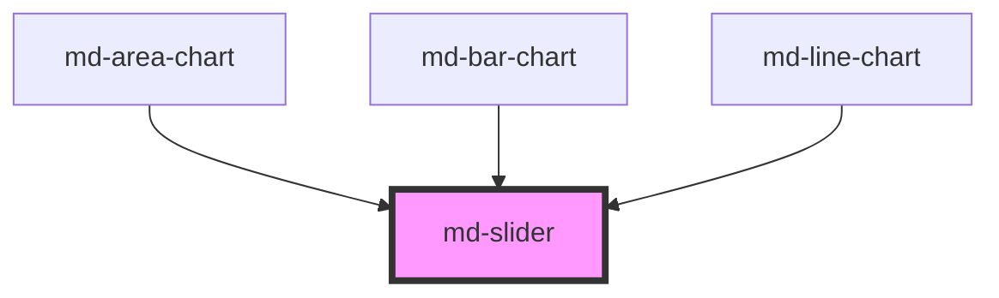

# md-slider

<!-- llm:meta
tag: md-slider
category: selection
status: md3-mapped
m3-guidelines: https://m3.material.io/components/sliders/guidelines
form-associated: true
depends-on: none
used-by: md-area-chart, md-bar-chart, md-line-chart
-->

**Choose a value, or a range, along a continuum.** Horizontal or vertical,
single or two-thumb range, discrete steps with tick marks, value indicators,
and an optional inset icon that travels with the handle.

> Setup, theming, density and i18n are configured once for the whole library —
> see [`main-llm.md`](../../../../../main-llm.md) at the repo root.

---

## When to use

- A value on a **bounded, continuous** scale where the relative position matters
  more than the exact number: volume, brightness, zoom, opacity.
- A **range** between two bounds (`range`): price filter, date span, thresholds.
- Immediate, visible feedback as the value changes.

## When NOT to use

| Situation | Use instead |
|---|---|
| A precise number the user knows | `md-text-field type="number"` |
| An unbounded value | `md-text-field` |
| A small set of discrete choices | `md-segmented-button-set` / `md-radio` |
| On/off | `md-switch` |
| A subjective score out of N | `md-rating` |
| Fine-grained input on touch | `md-text-field` alongside the slider |

## Decision cues

| Need | Setting |
|---|---|
| Single value | default |
| Two-thumb range | `range` + `value-start` / `value-end` |
| Fill from a midpoint (e.g. balance, ±) | `variant="centered"` |
| Discrete increments | `step` |
| Visible tick marks | `stops` |
| Value bubble above the thumb | `value-indicator` (always visible, not drag-only) |
| Icon inside the track that follows the handle | `inset-icon` + `icon` |
| Vertical | `orientation="vertical"` (+ `full-height`) |
| External state owner | `controlled` |

## API contract

```html
<md-slider
  min="0" max="100" value="50" step="1"
  range value-start="20" value-end="80"
  variant="standard|centered"
  size="xs|sm|md|lg|xl"          <!-- default: xs -->
  orientation="horizontal|vertical" full-height
  stops value-indicator
  inset-icon icon="volume_up"
  aria-label="Volume"
  label-start="Minimum price" label-end="Maximum price"
  value-text="50 percent" value-start-text="$200" value-end-text="$800"
  controlled disabled
  name="volume"                  <!-- submits into FormData -->
  name-start="from" name-end="to"  <!-- range only; both default to `name` -->
  density="-1|-2|-3|-4"          <!-- default: 0 = uncompacted -->
></md-slider>
```

`labeled` also exists but is **deprecated** — it is an exact alias of
`value-indicator`. Use `value-indicator`.

**Events** — all bubble and are composed, and all carry typed details:

| Event | Detail | Fires |
|---|---|---|
| `mdInput` | `MdSliderValueDetail` | Continuously while dragging / on arrow keys |
| `mdChange` | `MdSliderValueDetail` | On commit (drag end, key release) |
| `mdFocus` / `mdBlur` | `MdSliderThumbDetail` | Per-thumb focus |
| `mdDragStart` / `mdDragEnd` | `MdSliderDragDetail` | Drag lifecycle |

**Methods** — none.

**Slots** — `inset-icon` (custom glyph in place of `icon`); it only renders
when the inset area is active (see the behavioral contract). There is no
default slot.

**Parts** — `surface`, `track`, `track-inactive`, `track-active`, `inset`,
`thumb-knob`, `state-layer`, `value-indicator`.

### Behavioral contract worth knowing

- **Form-associated** — give it a `name` and it submits into `FormData` like a
  native `<input type="range">`. Reset restores the authored values, `disabled`
  removes it from submission, and no `name` means nothing is submitted.
- **A range slider submits two entries**, one per thumb: both under `name`
  (read with `formData.getAll(name)`), or under `name-start` / `name-end` when
  those are set. One name cannot carry two numbers.
- **No constraint validation, by design** — a slider always holds a value inside
  `[min, max]`, so `required` would have nothing to catch. Bound the choice with
  `min` / `max` instead.
- In `range` mode the meaningful props are `value-start` / `value-end`;
  plain `value` applies to single mode.
- `controlled` stops the slider from writing back to `value` /
  `value-start` / `value-end`: you apply the new value in response to
  `mdInput`/`mdChange`. The thumb still follows the pointer during the drag
  (internal live state), then snaps to whatever the props say once the drag
  commits — so if no handler updates them, it springs back to the old value.
- `mdInput` fires continuously during a drag — debounce expensive work, and
  save on `mdChange`.
- Naming: the host attribute for the single-thumb label is **`aria-label`**;
  range thumbs use **`label-start` / `label-end`** (deliberately not
  `aria-*`-prefixed, since custom `aria-` attributes fail `aria-valid-attr`).
- `value-text` / `value-start-text` / `value-end-text` set the human-readable
  announcement (`aria-valuetext`) — use them whenever the raw number isn't
  meaningful ("50" → "50 percent", or "$1,200").
- **The thumb overhangs the track ends** at 0% and 100% — the host, rail and
  thumb are all `overflow: visible` so it draws outside the track box. A wrapper
  with `overflow: hidden` will clip it, so leave room around the slider.
- **The knob is not the pointer target.** The thumb is `pointer-events: none`;
  a drag is picked up by the native `<input type="range">` that covers the track
  (or, for `range` and vertical sliders, by the rail). Sizing the slider so the
  track stays comfortably wide is what keeps the ends easy to grab.
- **Each thumb is a real `<input type="range">`** inside the shadow root. That
  is where the keyboard behaviour comes from: arrows step by `step`, `Home` /
  `End` jump to the bounds, `PageUp` / `PageDown` take a larger step.
- **The inset area is conditional**: `inset-icon` is honoured only on a
  single-thumb slider at `size` `md`, `lg` or `xl`. On `range`, or at `xs` /
  `sm`, the icon and its slot are not rendered at all.
- **Range thumbs push rather than block.** Dragging the start thumb past the
  end (or vice versa) moves both, and a pointer drag hands over to the other
  thumb — so the two values never cross.
- Changing `min` / `max` re-clamps `value`, `valueStart` and `valueEnd` into
  the new bounds.
- `mdDragStart` / `mdDragEnd` bracket **keyboard** interaction too: they fire on
  keydown/keyup of a slider key, not only on pointer drags.
- `value-indicator` shows the bubble permanently, not only during a drag. The
  number it shows is `value` rounded to the decimal places of `step`.
- The value the browser restores after a back/forward navigation is re-applied
  through `formStateRestoreCallback`.
- `labeled` is a deprecated alias of `value-indicator`; either one turns the
  bubble on.

---

## Do / Don't

Sourced from [M3 · Sliders · Guidelines](https://m3.material.io/components/sliders/guidelines).

| ✅ Do | ❌ Don't |
|---|---|
| Keep range sliders **horizontal** | Don't use a range slider vertically — the cognitive load is too high |
| Use an inset icon to reinforce what's being adjusted | Don't use an inset icon on a **range** slider |
| Use inset icons only on thick tracks | Don't use an inset icon when the track is under 40px |
| Let the inset icon change placement with the handle | Don't use an inset icon on a **centered** slider |
| Use `stops` when the increments are meaningful | Don't show ticks on a continuous scale — it implies false precision |
| Give every slider an accessible label | Don't ship an unlabelled slider |
| Provide `value-text` when the number needs units | Don't let a screen reader announce a bare "50" |
| Pair with a numeric field when precision matters | Don't force precise entry through dragging alone |
| Give it a `name` inside a form and let it submit itself | Don't mirror the value into a hidden input, or collect it from `mdChange` just to post it |
| Bound the choice with `min` / `max` | Don't reach for `required` — a slider always holds a value, so there is nothing to catch |

---

## Patterns

```html
<!-- Simple value with a live bubble -->
<md-slider aria-label="Volume" value="60" value-indicator
           value-text="60 percent"></md-slider>

<script type="module">
  const s = document.querySelector('md-slider');
  s.addEventListener('mdInput',  (e) => console.log('live', e.detail.value));
  s.addEventListener('mdChange', (e) => console.log('committed', e.detail.value));
</script>
```

```html
<!-- Price range -->
<md-slider range min="0" max="1000" step="10"
           value-start="200" value-end="800"
           label-start="Minimum price" label-end="Maximum price"
           value-start-text="$200" value-end-text="$800"
           value-indicator></md-slider>

<!-- Discrete steps with ticks -->
<md-slider min="1" max="5" step="1" stops value-indicator aria-label="Rating"></md-slider>

<!-- Centered: adjustment either side of zero -->
<md-slider variant="centered" min="-50" max="50" value="0" aria-label="Balance"></md-slider>

<!-- Inset icon, thick track, single value only -->
<md-slider size="lg" inset-icon icon="volume_up" aria-label="Volume"></md-slider>

<!-- Vertical -->
<md-slider orientation="vertical" full-height aria-label="Brightness"></md-slider>

<!-- Controlled: the slider never writes its own value -->
<md-slider controlled id="zoom" aria-label="Zoom"></md-slider>
<script type="module">
  const zoom = document.getElementById('zoom');
  zoom.addEventListener('mdInput', (e) => {
    zoom.value = Math.min(80, e.detail.value);   // your state, your cap
  });
</script>

<!-- In a form: it submits itself, and resets with the form -->
<form>
  <md-slider name="volume" value="60" aria-label="Volume"></md-slider>

  <!-- range: two entries under one key -> formData.getAll('price') -->
  <md-slider range name="price" value-start="20" value-end="80"
             label-start="Minimum" label-end="Maximum"></md-slider>

  <!-- ...or one key per thumb -->
  <md-slider range name-start="from" name-end="to" value-start="20" value-end="80"
             label-start="Minimum" label-end="Maximum"></md-slider>

  <button type="submit">Save</button>
  <button type="reset">Reset</button>
</form>
```

## Anti-patterns

| ❌ Wrong | ✅ Right | Why |
|---|---|---|
| Reading `mdChange` just to put the value in a form | Give it a `name` | It submits itself. |
| One `name` for a range slider and expecting one value | `formData.getAll(name)`, or `name-start`/`name-end` | Two thumbs, two entries. |
| `value` in `range` mode | `value-start` / `value-end` | `value` is the single-thumb prop. |
| `aria-label-start="…"` | `label-start="…"` | Custom `aria-*` attributes fail `aria-valid-attr`. |
| Saving on every `mdInput` | Save on `mdChange` | `mdInput` fires continuously during a drag. |
| `controlled` with no handler updating the value | Either drop `controlled` or set the value | The thumb tracks the drag, then springs back to the unchanged prop on commit. |
| Inset icon on a range or centered slider | Single-value sliders only | M3 forbids both combinations. |
| A vertical range slider | Keep range sliders horizontal | M3 explicit rule. |
| Slider for an exact numeric entry | Add a `md-text-field` beside it | Dragging can't be precise. |
| `overflow: hidden` on a tight wrapper | Leave room for the thumb overhang | The thumb draws outside the track at 0% / 100% and gets visually clipped. |
| No `value-text` on a unit-bearing value | Set it | Screen readers otherwise announce a bare number. |
| `labeled` | `value-indicator` | `labeled` is deprecated; the two are the same flag. |
| `inset-icon` on `size="xs"` or `"sm"` | Use `md`, `lg` or `xl` | The inset area is not rendered on thin tracks. |
| Expecting `value-indicator` to appear only while dragging | It is always visible | There is no drag-only bubble mode. |

## Accessibility, RTL, density, i18n

**Accessibility**
- Single-thumb: name it with `aria-label` on the host. Range: name each thumb
  with `label-start` / `label-end`.
- Set `value-text` (and the range equivalents) so the announcement carries
  units, not just a number.
- Keyboard: arrows step by `step`, with Home/End to the bounds; each thumb is
  focusable and emits `mdFocus`/`mdBlur`.
- Ensure the thumb hit area stays ≥48px on touch at deep density rungs.
- Don't wrap the slider in an `overflow: hidden` box tight enough to clip the
  thumb at the track ends.

**RTL** — the track direction and thumb travel mirror under `dir="rtl"`, and
arrow keys follow reading order. A directional inset icon needs swapping.

**Density** — `density="-1…-4"` locally overrides the inherited `data-density`
rung; rung `0` is the uncompacted default and is inert, so it is not an opt-out
from an ancestor rung (for that, set `style="--md-sys-density-scale: 0"`). Each
rung trims 4px from the track thickness (8px floor), the thumb block size
(24px floor) and the value bubble. Check the grab target before going deep on
touch.

**i18n** — translate `aria-label`, `label-start`, `label-end` and the
`*-text` announcements. Format numbers with `Intl` before putting them into
`value-text`.

## Related components

`md-text-field` · `md-rating` · `md-switch` · `md-segmented-button-set` ·
`md-progress-indicator` · `md-color-picker`

## Theming

| Custom property | Purpose | Default |
|---|---|---|
| `--md-slider-track-length` | Track extent (the vertical height; horizontal sliders are `100%` wide) | `200px` |
| `--md-slider-min-track-length` | Floor for a `full-height` vertical slider | `88px` |
| `--md-slider-track-height` | Track thickness | Per `size`, trimmed 4px per density rung (8px floor) |
| `--md-slider-track-shape` | Track corner radius | Per `size` |
| `--md-slider-active-color` | Filled part of the track | `--md-sys-color-primary` |
| `--md-slider-inactive-color` | Remaining track | `--md-sys-color-secondary-container` |
| `--md-slider-thumb-color` | Handle fill | `--md-sys-color-primary` |
| `--md-slider-thumb-width` / `--md-slider-thumb-height` | Handle box | Per `size` |
| `--md-slider-tick-active-color` | Tick sitting under the thumb | `--md-sys-color-primary` |
| `--md-slider-tick-filled-color` | Tick on the filled track | `--md-sys-color-on-primary` |
| `--md-slider-tick-inactive-color` | Tick on the unfilled track | `--md-sys-color-on-secondary-container` |
| `--md-slider-value-bg` / `--md-slider-value-color` | Value bubble fill / text | `--md-sys-color-inverse-surface` / `--md-sys-color-inverse-on-surface` |
| `--md-slider-value-shape` | Value bubble radius | `--md-sys-shape-corner-full` |
| `--md-slider-value-font-family` / `-size` / `-weight` / `-line-height` | Value bubble type | `label-medium` typescale |
| `--md-slider-value-padding-block` / `--md-slider-value-padding-inline` | Value bubble padding | `12px` / `16px` |
| `--md-slider-inset-icon-color` | Inset icon over the unfilled track | `--md-slider-tick-inactive-color` |
| `--md-slider-inset-icon-active-color` | Inset icon over the filled track | `--md-slider-tick-filled-color` |

**CSS parts** — `surface`, `track`, `track-inactive`, `track-active`, `inset`,
`thumb-knob`, `state-layer`, `value-indicator`.

```css
md-slider.brand {
  --md-slider-active-color: var(--md-sys-color-tertiary);
  --md-slider-thumb-color: var(--md-sys-color-tertiary);
}
```

<!-- Auto Generated Below -->


## Overview

MD3 Expressive slider: standard (from edge), centered (from midpoint), or range (dual thumb).

**Uncontrolled (default)** — the slider manages its own value. Listen to `mdChange` to observe commits.

**Controlled** (`controlled`) — the slider never mutates `value`/`valueStart`/`valueEnd`.
Listen to events and set the props yourself.  During drag the slider uses internal live
state for smooth visuals; on commit it snaps to the prop values.

## Properties

| Property          | Attribute          | Description                                                                                                                                                                                                                                                                                       | Type                                   | Default        |
| ----------------- | ------------------ | ------------------------------------------------------------------------------------------------------------------------------------------------------------------------------------------------------------------------------------------------------------------------------------------------- | -------------------------------------- | -------------- |
| `ariaLabelEnd`    | `label-end`        | Accessible label for the range-end thumb (becomes the thumb input's `aria-label`).                                                                                                                                                                                                                | `string`                               | `''`           |
| `ariaLabelStart`  | `label-start`      | Accessible label for the range-start thumb (becomes the thumb input's `aria-label`; overrides `aria-label`). NB: a plain (non-`aria-`) attribute name — `aria-label-start` is not a valid ARIA attribute and would just pollute the host with an invalid `aria-*`.                                | `string`                               | `''`           |
| `controlled`      | `controlled`       | When `true`, the slider never mutates `value` / `valueStart` / `valueEnd` on user interaction. Listen to `mdInput` (continuous) and `mdChange` (committed) events and write the props back yourself. During a drag gesture the slider uses internal live state for smooth visuals.                | `boolean`                              | `false`        |
| `density`         | `density`          | Local density rung. Drives the same `--md-sys-density-scale` signal that a global `data-density` ancestor sets, so a local value simply overrides the inherited one. 0 = default, -4 = ultra-compact.                                                                                             | `-1 \| -2 \| -3 \| -4 \| 0`            | `0`            |
| `disabled`        | `disabled`         |                                                                                                                                                                                                                                                                                                   | `boolean`                              | `false`        |
| `fullHeight`      | `full-height`      | Make a **vertical** slider fill its parent's block size (responsive height) instead of the fixed `--md-slider-track-length`. The parent needs a definite height; otherwise it falls back to the track-length floor so it never collapses. (Horizontal sliders are already full-width by default.) | `boolean`                              | `false`        |
| `icon`            | `icon`             | Material Symbols name when `inset-icon` and no slotted icon                                                                                                                                                                                                                                       | `string`                               | `''`           |
| `insetIcon`       | `inset-icon`       | Standard slider only: inset icon area (use `icon` or `inset-icon` slot)                                                                                                                                                                                                                           | `boolean`                              | `false`        |
| `labeled`         | `labeled`          | <span style="color:red">**[DEPRECATED]**</span> Use `value-indicator`<br/><br/>                                                                                                                                                                                                                   | `boolean`                              | `false`        |
| `max`      | `max`              |                                                                                                                                                                                                                                                                                                   | `number`                               | `100`          |
| `min`             | `min`              |                                                                                                                                                                                                                                                                                                   | `number`                               | `0`            |
| `name`            | `name`             | Form field name. With it the slider submits into `FormData` on submit, exactly like a native `<input type="range">`; without one it submits nothing. Reflected.                                                                                                                                    | `string`                               | `''`           |
| `nameEnd`         | `name-end`         | Range only — the key for the upper thumb. Defaults to `name`. Ignored outside `range`.                                                                                                                                                                                                          | `string`                               | `''`           |
| `nameStart`       | `name-start`       | Range only — the key for the lower thumb. Defaults to `name`, so both thumbs submit under one key (read them with `formData.getAll(name)`). Ignored outside `range`.                                                                                                                            | `string`                               | `''`           |
| `orientation`     | `orientation`      |                                                                                                                                                                                                                                                                                                   | `"horizontal" \| "vertical"`           | `'horizontal'` |
| `range`           | `range`            | Dual-thumb range                                                                                                                                                                                                                                                                                  | `boolean`                              | `false`        |
| `size`            | `size`             | Expressive size (default XS per MD3 spec)                                                                                                                                                                                                                                                         | `"lg" \| "md" \| "sm" \| "xl" \| "xs"` | `'xs'`         |
| `sliderAriaLabel` | `aria-label`       |                                                                                                                                                                                                                                                                                                   | `string`                               | `''`           |
| `step`            | `step`             |                                                                                                                                                                                                                                                                                                   | `number`                               | `1`            |
| `stops`           | `stops`            | Stop / tick marks at each step.                                                                                                                                                                                                                                                                   | `boolean`                              | `false`        |
| `value`           | `value`            |                                                                                                                                                                                                                                                                                                   | `number`                               | `50`           |
| `valueEnd`        | `value-end`        |                                                                                                                                                                                                                                                                                                   | `number`                               | `100`          |
| `valueEndText`    | `value-end-text`   | Human-readable text for the range-end value. Mapped to `aria-valuetext` on the end thumb.                                                                                                                                                                                                         | `string`                               | `''`           |
| `valueIndicator`  | `value-indicator`  | Show value label at thumb(s)                                                                                                                                                                                                                                                                      | `boolean`                              | `false`        |
| `valueStart`      | `value-start`      |                                                                                                                                                                                                                                                                                                   | `number`                               | `0`            |
| `valueStartText`  | `value-start-text` | Human-readable text for the range-start value. Mapped to `aria-valuetext` on the start thumb.                                                                                                                                                                                                     | `string`                               | `''`           |
| `valueText`       | `value-text`       | Human-readable text alternative for the current value (single slider). Mapped to `aria-valuetext`.                                                                                                                                                                                                | `string`                               | `''`           |
| `variant`         | `variant`          | Single-thumb layout: `standard` fills from min; `centered` fills from range midpoint to value.                                                                                                                                                                                                    | `"centered" \| "standard"`             | `'standard'`   |


## Events

| Event         | Description                                                                            | Type                               |
| ------------- | -------------------------------------------------------------------------------------- | ---------------------------------- |
| `mdBlur`      | Fires when a slider thumb loses focus.                                                 | `CustomEvent<MdSliderThumbDetail>` |
| `mdChange`    | Fires once when the user commits a value (pointer up, keyboard release, change event). | `CustomEvent<MdSliderValueDetail>` |
| `mdDragEnd`   | Fires when a drag/keyboard interaction ends.                                           | `CustomEvent<MdSliderDragDetail>`  |
| `mdDragStart` | Fires when a drag/keyboard interaction begins.                                         | `CustomEvent<MdSliderDragDetail>`  |
| `mdFocus`     | Fires when a slider thumb receives focus.                                              | `CustomEvent<MdSliderThumbDetail>` |
| `mdInput`     | Fires continuously while the user drags or presses arrow keys.                         | `CustomEvent<MdSliderValueDetail>` |


## Slots

| Slot           | Description                                                     |
| -------------- | --------------------------------------------------------------- |
| `"inset-icon"` | Custom icon inside track (standard only; use with `inset-icon`) |


## Shadow Parts

| Part                | Description |
| ------------------- | ----------- |
| `"inset"`           |             |
| `"state-layer"`     |             |
| `"surface"`         |             |
| `"thumb-knob"`      |             |
| `"track"`           |             |
| `"track-active"`    |             |
| `"track-inactive"`  |             |
| `"value-indicator"` |             |


## Dependencies

### Used by

 - [md-area-chart](../md-area-chart)
 - [md-bar-chart](../md-bar-chart)
 - [md-line-chart](../md-line-chart)

### Graph


----------------------------------------------

*Built with [StencilJS](https://stenciljs.com/)*
