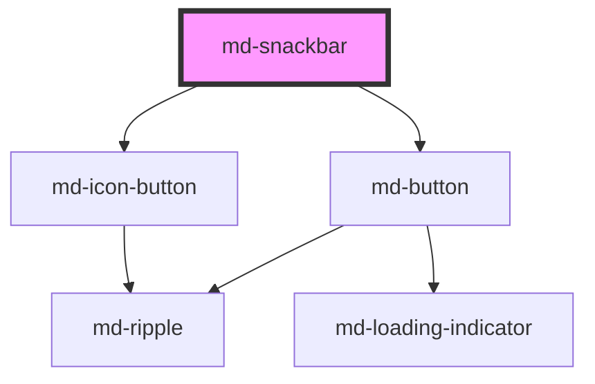

# md-snackbar

<!-- llm:meta
tag: md-snackbar
category: containment
status: md3-mapped
m3-guidelines: https://m3.material.io/components/snackbar/guidelines
form-associated: false
depends-on: md-button, md-icon-button
used-by: none
-->

**Brief, low-priority feedback about something that just happened.** Appears
over the content, auto-hides after 4 seconds, and can carry a single action —
canonically "Undo".

> Setup, theming, density and i18n are configured once for the whole library —
> see [`main-llm.md`](../../../../../main-llm.md) at the repo root.

---

## When to use

- Confirming an action completed: "Message archived", "Draft saved".
- Offering a **single, reversing action** — "Undo".
- Low-priority information the user can safely miss.

## When NOT to use

| Situation | Use instead |
|---|---|
| A decision that must block the flow | `md-dialog` |
| Critical errors the user must acknowledge | `md-dialog` |
| Explaining a control | `md-tooltip` |
| Persistent status | Inline text, `md-chip`, `md-badge` |
| A message needing an icon | `md-dialog` — M3 says avoid icons in snackbars |
| A message needing a link | Add a button instead, or a different component |
| Several messages at once | Queue them — never stack or place side by side |
| Form validation | Inline field errors |

## Decision cues

| Need | Setting |
|---|---|
| Standard bottom placement | `position="bottom"` (default) |
| Corner placement on desktop | `position="bottom-start"` / `"bottom-end"` etc. |
| Vertically centred, fade only (no slide) | `position="start"` / `"end"` / `"center"` |
| Single reversing action | `action="Undo"` |
| Long message + action on its own line | `stacked` |
| Persist until dismissed | `auto-hide="false"` **and** `closeable` |
| Longer read time | `auto-hide-duration="8000"` |
| Urgent announcement | `politeness="assertive"` |

## API contract

The authoritative, generated property/event tables are at the bottom of this
file. This is the short form an implementer needs.

```html
<md-snackbar
  open                                             <!-- default: false -->
  message="Message archived"
  action="Undo"                                    <!-- empty = no action -->
  closeable                                        <!-- default: false -->
  auto-hide                                        <!-- default: true -->
  auto-hide-duration="4000"                        <!-- default: 4000 -->
  position="bottom|bottom-start|bottom-end|top|top-start|top-end|start|end|center"
                                                   <!-- default: bottom -->
  stacked                                          <!-- default: false -->
  politeness="polite|assertive"                    <!-- default: polite -->
  dismiss-label="Dismiss"                          <!-- default: Dismiss -->
  density="-1|-2|-3|-4"                            <!-- default: 0 (uncompacted) -->
></md-snackbar>
```

**Events** — all three are default Stencil events: they bubble and are
`composed`, so a single delegated listener on an ancestor catches every
snackbar.

| Event | Detail | Fires |
|---|---|---|
| `mdOpen` | `void` | Whenever `open` flips to true — including on first load if the element is rendered with `open` |
| `mdAction` | `void` | The built-in action button was clicked |
| `mdClose` | `{ reason: 'auto' \| 'action' \| 'close' }` | Dismissed — **check the reason** |

**Methods** — `show()`, `hide(reason?)` (both `async`; `reason` defaults to
`'close'`).

**Slots** — default (supporting text; *overrides* the `message` prop), `action`
(replaces the built-in text button), `close` (replaces the built-in X icon
button).

**Parts** — `surface`, `message`, `actions`, `close`. The built-in close button
re-exports its glyph as `close-icon`.

### Behavioral contract worth knowing

- **The action button does NOT dismiss the snackbar.** Clicking it emits
  `mdAction` and *restarts* the auto-hide timer. If the action should close the
  snackbar, call `hide('action')` yourself from your `mdAction` handler — that
  is the only way `reason: 'action'` is ever produced.
- **Setting `open = false` directly does not emit `mdClose`.** Only `hide()`,
  the auto-hide timer, and the built-in close button emit it. Use `hide()` when
  you want listeners to hear about it.
- Auto-hide is **on by default** at 4000 ms. `auto-hide="false"` without
  `closeable` leaves a snackbar the user cannot dismiss.
- **The auto-hide timer pauses while the surface is hovered or holds focus**
  (WCAG 2.2.1) and resumes on mouse-leave / focus-out.
- **Escape dismisses only when `closeable` is set.** The key listener is on
  `window` and is active only while the snackbar is open. A slotted `close`
  element does *not* enable Escape — set `closeable` for that.
- The built-in close button dismisses ~150 ms after the click, so its ripple
  finishes before the exit animation starts.
- The host is a **fixed, full-viewport overlay** with `pointer-events: none`;
  only the surface takes pointer events, and only while open. Put the element
  anywhere in the document — `position` decides where it lands, not the DOM
  position.
- Opening a snackbar lifts it above any snackbars already open (a small
  per-instance z-index offset), so the newest one is always on top regardless
  of markup order.
- Below 600 px viewport width the surface stretches to the full available width
  and the min/max width bounds are dropped, per M3.
- `position="start" | "end" | "center"` fade in place; the `top*` and `bottom*`
  positions slide in from that edge. All transitions are removed under
  `prefers-reduced-motion: reduce`.
- **There is no queue.** One element shows one message. Showing two at once
  violates M3 — serialise them yourself.
- `action` renders a `md-button variant="text"`. M3 forbids filled/elevated
  buttons here, so don't slot one in.

---

## Do / Don't

Sourced from [M3 · Snackbar · Guidelines](https://m3.material.io/components/snackbar/guidelines).

| ✅ Do | ❌ Don't |
|---|---|
| Keep the text label to one line where possible (two on mobile) | Don't write a paragraph |
| Offer "Undo" so users can amend a choice | A dismiss action is usually unnecessary — it hides itself |
| Extend the container width in wide layouts for longer labels | Don't place snackbars flush to one edge of the layout |
| Put an action on a third line if it's long (`stacked`) | Don't cram a long action beside a long message |
| Place it in front of the main content | Avoid placing snackbars in front of navigation components |
| Size it so focused elements stay visible | Don't fully cover elements in focus |
| Keep it clear of the FAB | Don't place a snackbar in front of **or** behind a FAB |
| Show one at a time | Don't stack them, place them side by side, or run them consecutively without spacing |
| Use a text button for the action | Don't use a filled or elevated button — it draws too much attention |
| Keep the label colour distinct from the action | The text label shouldn't share the action button's colour |
| Keep the stock shape; slight container transparency is fine if text stays legible | Don't significantly alter the container shape |
| Use a different component if you need an icon or a link | Avoid icons, stylised text, and inline links |
| Animate the snackbar alone | Don't animate other components (like the FAB) along with it |

---

## Patterns

```html
<md-snackbar id="bar" action="Undo" position="bottom-start"></md-snackbar>

<script type="module">
  const bar = document.getElementById('bar');
  let pending = null;

  function archive(item) {
    hideRow(item);
    pending = item;
    bar.message = 'Message archived';
    bar.show();
  }

  // The action button never closes the snackbar by itself — do it here, and
  // pass the reason so the mdClose handler can tell Undo from a timeout.
  bar.addEventListener('mdAction', () => bar.hide('action'));

  bar.addEventListener('mdClose', (e) => {
    if (e.detail.reason === 'action') restoreRow(pending);  // Undo pressed
    else commitArchive(pending);                            // auto / close
    pending = null;
  });
</script>
```

```html
<!-- Long message with the action on its own line -->
<md-snackbar stacked message="Your export finished and is ready to download"
             action="Download"></md-snackbar>

<!-- Persistent: must be closeable -->
<md-snackbar auto-hide="false" closeable message="Connection lost"
             politeness="assertive" dismiss-label="Dismiss"></md-snackbar>

<!-- Rich message via the default slot: it overrides `message` entirely -->
<md-snackbar id="rich">
  Saved to <strong>Drafts</strong>
</md-snackbar>
```

```js
// No built-in queue — serialise. Only hide(), the auto-hide timer and the
// built-in close button emit mdClose, so this loop only advances when the
// snackbar closes one of those ways. Never close it with `bar.open = false`:
// that emits nothing and the await below hangs forever.
const bar = document.getElementById('bar');
const queue = [];

async function toast(message) {
  queue.push(message);
  if (queue.length > 1) return;
  while (queue.length) {
    bar.message = queue[0];
    await bar.show();
    await new Promise((r) => bar.addEventListener('mdClose', r, { once: true }));
    queue.shift();
  }
}
```

## Anti-patterns

| ❌ Wrong | ✅ Right | Why |
|---|---|---|
| Expecting the action button to close the snackbar | Call `hide('action')` from your `mdAction` handler | The built-in action only emits `mdAction` and restarts the timer. |
| Committing the action in `mdAction` **and** `mdClose` | Branch on `mdClose.detail.reason` | You'll run it twice. |
| `el.open = false` and waiting for `mdClose` | Call `el.hide()` | A direct property write emits nothing. |
| Two snackbars visible at once | Queue them | M3 forbids stacking or side-by-side. |
| `auto-hide="false"` without `closeable` | Add `closeable` | Otherwise it's undismissable. |
| Slotting a `close` element and relying on Escape | Set `closeable` | Escape is gated on the `closeable` prop. |
| A filled button in the `action` slot | Text button only | M3 explicit rule. |
| An icon in the message | Use a dialog | M3 explicit rule. |
| An inline link in the message | Use the action button | M3 explicit rule. |
| A snackbar over the FAB or navigation | Reposition | M3 explicit rule (both in front and behind are wrong). |
| `politeness="assertive"` for routine confirmations | Keep `polite` | Assertive interrupts screen-reader users. |
| A snackbar for a critical error | `md-dialog` | It auto-hides and is easy to miss. |
| Nesting the snackbar inside a scrolling container to "position" it | Leave it anywhere and set `position` | The host is `position: fixed` over the viewport. |

## Accessibility, RTL, density, i18n

**Accessibility**
- `politeness="polite"` (default) renders `role="status"` + `aria-live="polite"`;
  `politeness="assertive"` renders `role="alert"` + `aria-live="assertive"`.
  Both set `aria-atomic="true"`, so the whole message is re-announced. Reserve
  `assertive` for genuinely urgent messages.
- Auto-hide is a hazard for users who read slowly or use a screen reader — for
  anything with an action, consider a longer `auto-hide-duration`, and make sure
  the same action is reachable elsewhere in the UI. Hover and keyboard focus
  pause the timer automatically.
- Focus is **not** moved to the snackbar (correctly — it would be disruptive),
  so keyboard users may never reach the action. Never make a snackbar action the
  only route to an outcome.
- Give the close affordance a localized `dismiss-label` (it becomes the icon
  button's `aria-label`).
- Don't let it obscure the element the user is working on.

**RTL** — the layout uses logical properties throughout, so `position="start"` /
`"end"` and the `*-start` / `*-end` corners mirror under `dir="rtl"`.

**Density** — `density="-1…-4"` locally overrides the inherited `data-density`
rung, compacting the surface height, padding and text. Rung `0` is the
uncompacted default and is inert — it does **not** opt a snackbar out of an
inherited rung; for that, set `style="--md-sys-density-scale: 0"` on the
element.

**i18n** — translate `message`, `action`, and `dismiss-label`. Translations run
longer, so re-check the one-line rule and consider `stacked`.

## Related components

`md-dialog` · `md-tooltip` · `md-button` · `md-icon-button` ·
`md-bottom-sheet` · `md-progress-indicator`

## Theming

| Custom property | Purpose | Default |
|---|---|---|
| `--md-snackbar-container-color` | Surface background | `--md-sys-color-inverse-surface` |
| `--md-snackbar-message-color` | Supporting-text colour | `--md-sys-color-inverse-on-surface` |
| `--md-snackbar-action-color` | Action label, icon and ripple | `--md-sys-color-inverse-primary` |
| `--md-snackbar-close-color` | Close-icon colour | `--md-sys-color-inverse-on-surface` |
| `--md-snackbar-container-shape` | Border radius | `--md-sys-shape-corner-extra-small` (4px) |
| `--md-snackbar-min-width` | Minimum inline size | `288px` |
| `--md-snackbar-max-width` | Maximum inline size | `568px` |

**CSS parts** — `surface`, `message`, `actions`, `close` (plus `close-icon`,
exported from the built-in close button).

```css
md-snackbar.wide {
  --md-snackbar-max-width: 720px;
}
```

<!-- Auto Generated Below -->


## Properties

| Property           | Attribute            | Description                                                                                                                                                                                                                                         | Type                                                                                                              | Default     |
| ------------------ | -------------------- | --------------------------------------------------------------------------------------------------------------------------------------------------------------------------------------------------------------------------------------------------- | ----------------------------------------------------------------------------------------------------------------- | ----------- |
| `action`           | `action`             | Action button label (leave empty for no action)                                                                                                                                                                                                     | `string`                                                                                                          | `''`        |
| `autoHide`         | `auto-hide`          | Auto-dismiss after `autoHideDuration` ms (dismissive behavior)                                                                                                                                                                                      | `boolean`                                                                                                         | `true`      |
| `autoHideDuration` | `auto-hide-duration` | Time in ms before auto-dismiss                                                                                                                                                                                                                      | `number`                                                                                                          | `4000`      |
| `closeable`        | `closeable`          | Show a close (X) icon button                                                                                                                                                                                                                        | `boolean`                                                                                                         | `false`     |
| `density`          | `density`            | Local density rung. Drives the same `--md-sys-density-scale` signal that a global `data-density` ancestor sets, so a local value simply overrides the inherited one. 0 = default, -4 = ultra-compact.                                               | `-1 \| -2 \| -3 \| -4 \| 0`                                                                                       | `0`         |
| `dismissLabel`     | `dismiss-label`      | Accessible label for the close button. Localize per the page locale.                                                                                                                                                                                | `string`                                                                                                          | `'Dismiss'` |
| `message`          | `message`            | Primary supporting text                                                                                                                                                                                                                             | `string`                                                                                                          | `''`        |
| `open`             | `open`               | Whether the snackbar is visible                                                                                                                                                                                                                     | `boolean`                                                                                                         | `false`     |
| `politeness`       | `politeness`         | Live-region politeness. `'polite'` (default) → `role="status"` / `aria-live="polite"` (announced when idle). `'assertive'` → `role="alert"` / `aria-live="assertive"` — interrupts the screen reader; use sparingly for important / error messages. | `"assertive" \| "polite"`                                                                                         | `'polite'`  |
| `position`         | `position`           | Screen position                                                                                                                                                                                                                                     | `"bottom" \| "bottom-end" \| "bottom-start" \| "center" \| "end" \| "start" \| "top" \| "top-end" \| "top-start"` | `'bottom'`  |
| `stacked`          | `stacked`            | Stack action below text (for longer action labels)                                                                                                                                                                                                  | `boolean`                                                                                                         | `false`     |


## Events

| Event      | Description                                       | Type                                                      |
| ---------- | ------------------------------------------------- | --------------------------------------------------------- |
| `mdAction` | Emits when the action button is clicked           | `CustomEvent<void>`                                       |
| `mdClose`  | Emits when the snackbar is dismissed, with reason | `CustomEvent<{ reason: "auto" \| "close" \| "action"; }>` |
| `mdOpen`   | Emits when the snackbar becomes visible           | `CustomEvent<void>`                                       |


## Methods

### `hide(reason?: "auto" | "action" | "close") => Promise<void>`

Hide the snackbar with an optional reason

#### Parameters

| Name     | Type                            | Description |
| -------- | ------------------------------- | ----------- |
| `reason` | `"auto" \| "close" \| "action"` |             |

#### Returns

Type: `Promise<void>`


### `show() => Promise<void>`

Show the snackbar

#### Returns

Type: `Promise<void>`


## Slots

| Slot       | Description                                            |
| ---------- | ------------------------------------------------------ |
|            | Supporting text (overrides `message` prop)             |
| `"action"` | Custom action element (overrides `action` prop)        |
| `"close"`  | Custom close element (overrides default X icon button) |


## Shadow Parts

| Part        | Description             |
| ----------- | ----------------------- |
| `"actions"` | Action button wrapper   |
| `"close"`   | Close button wrapper    |
| `"message"` | Supporting text wrapper |
| `"surface"` | Outer container surface |


## Dependencies

### Depends on

- [md-button](../md-button)
- [md-icon-button](../md-icon-button)

### Graph


----------------------------------------------

*Built with [StencilJS](https://stenciljs.com/)*
