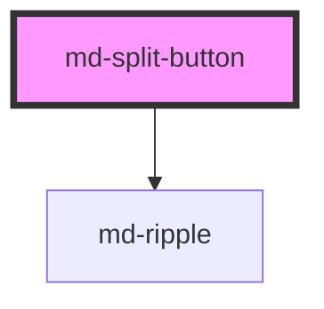

# md-split-button

<!-- llm:meta
tag: md-split-button
category: actions
status: md3-mapped
m3-guidelines: https://m3.material.io/components/split-button/guidelines
form-associated: false
depends-on: md-ripple
used-by: none
-->

**One default action plus a menu of variations.** Two fused segments: a leading
button that runs the default action, and a trailing toggle that opens a menu.
The component renders the button — **you supply and position the menu**.

> Setup, theming, density and i18n are configured once for the whole library —
> see [`main-llm.md`](../../../../../main-llm.md), the library-wide manual that ships
> alongside these files.

---

## When to use

- There is a clear **default action**, plus closely-related variants of it:
  *Save* / Save as…, *Send* / Schedule send, *Merge* / Squash / Rebase.
- Users pick the default the large majority of the time, and the alternatives
  are genuinely alternatives — not unrelated commands.

## When NOT to use

| Situation | Use instead |
|---|---|
| No obvious default among the options | `md-button` + `md-menu`, or `md-select` |
| The options are unrelated commands | `md-icon-button` + `md-menu` |
| Choosing a value rather than running an action | `md-select` / `md-segmented-button-set` |
| 2–5 equal, mutually exclusive choices | `md-segmented-button-set` |
| Several equal actions as a unit | `md-button-group` |
| A single action | `md-button` |
| The trailing side toggles state rather than opening a popup | `md-button toggle`, or set `haspopup="false"` |

## Decision cues

| Need | Setting |
|---|---|
| Standard emphasis | `variant="filled"` (default) |
| Secondary emphasis | `variant="tonal"` or `"outlined"` |
| Separation from a prominent background | `variant="elevated"` |
| Fill the container, truncating the label if tight | `full-width` |
| Trailing side opens a listbox, not a menu | `haspopup="listbox"` |
| Trailing side toggles state, opens nothing | `haspopup="false"` |
| Link the trigger to your popup for AT | `controls="<popup id>"` |

| `size` | Height | Leading icon |
|---|---|---|
| `xs` | 32px | 16px |
| `sm` | 40px | 18px — **default** |
| `md` | 56px | 24px |
| `lg` | 96px | 36px |
| `xl` | 136px | 48px |

Heights taper with density (24px floor); the icon sizes do not.

## API contract

```html
<md-split-button
  variant="filled|tonal|outlined|elevated"   <!-- default: filled -->
  size="xs|sm|md|lg|xl"                       <!-- default: sm -->
  icon="save" label="Save"
  trailing-icon="keyboard_arrow_down"         <!-- default -->
  trailing-checked
  menu-label="More save options"              <!-- accessible name of trailing btn -->
  haspopup="menu|listbox|dialog|grid|tree|true|false"
  controls="save-menu"
  full-width
  disabled | soft-disabled
  ripple
  density="-1|-2|-3|-4"                       <!-- omit for the default rung -->
></md-split-button>
```

**Slot** — `(default)`: extra leading-button content. It renders **after** the
`label`, not instead of it, so use one or the other. There is no slot for the
trailing segment — its glyph comes from `trailing-icon`.

**Methods** — none.

**Events**

| Event | Detail | Fires |
|---|---|---|
| `mdLeadingClick` | `void` | Leading (default action) segment activated |
| `mdTrailingClick` | `{ checked: boolean }` | Trailing toggle activated; `checked` is the new state |

**Parts** — `leading`, `leading-state-layer`, `icon`, `label`, `trailing`,
`trailing-state-layer`, `trailing-icon`.

### Behavioral contract worth knowing

- **The menu is not included.** The component emits `mdTrailingClick`; you open,
  position, and close your own `md-menu`, and you keep `trailing-checked` in
  sync with its open state.
- `trailing-checked` **flips itself** on every trailing activation and the new
  value is what `mdTrailingClick.detail.checked` reports. What it cannot know is
  your menu closing by some other route (outside click, `Escape`, item picked) —
  set it back to `false` from your menu's `mdClose`, or the chevron rotation
  desyncs.
- `aria-expanded` is mirrored from `trailing-checked` onto the trailing button
  **unconditionally**, including when `haspopup="false"`. If the trailing side
  genuinely toggles state rather than disclosing something, that is the
  attribute you are living with.
- `disabled` sets the **native** `disabled` attribute on both inner `<button>`s,
  so both segments leave the tab order entirely. `soft-disabled` leaves them
  focusable and only blocks activation.
- An `aria-label` on the host is forwarded to the leading button **only when
  `label` is empty**; with a `label` set, the label is the name and the host's
  `aria-label` is ignored.
- In dev builds, a split button with neither `label` nor a host `aria-label`
  logs a `console.warn` naming the WCAG failure.
- `menu-label` is the trailing button's **only** accessible name. It defaults to
  the English `"Toggle menu"` — localize it.
- `controls` wires `aria-controls` from the trailing button to your popup's
  `id`. Both must be in the same DOM scope for the IDREF to resolve — a popup
  inside another shadow root will not link.
- `full-width` grows the leading segment (label truncates with an ellipsis);
  the trailing toggle keeps its intrinsic width.

---

## Do / Don't

Sourced from [M3 · Split button · Guidelines](https://m3.material.io/components/split-button/guidelines).

| ✅ Do | ❌ Don't |
|---|---|
| Open a menu from the trailing side | Don't modify the menu in unusual ways — keep it a conventional menu |
| Keep the leading label short | Don't use very long labels |
| Keep the stock chevron as the trailing glyph | Don't change the trailing icon (see note) |
| Make the leading action the genuine default | Don't make users open the menu for the common case |
| Keep menu items as variations of the leading action | Don't fill the menu with unrelated commands |
| Localize `menu-label` | Don't ship the default `"Toggle menu"` in a translated app |
| Keep `trailing-checked` in sync with your menu | Don't let the chevron point the wrong way |

**Trailing-icon note.** M3 says don't change the trailing icon, yet
`trailing-icon` exists. Treat it as an escape hatch for genuinely different
popup semantics (e.g. an overflow `more_vert` when the trailing side opens a
full menu rather than variations) — not as decoration. Default to the chevron.

---

## Patterns

```html
<md-split-button
  id="save-split"
  icon="save" label="Save"
  menu-label="More save options"
  controls="save-menu"
></md-split-button>

<md-menu id="save-menu" anchor="save-split">
  <md-menu-item headline="Save as…"></md-menu-item>
  <md-menu-item headline="Save a copy"></md-menu-item>
  <md-menu-item headline="Save and close"></md-menu-item>
</md-menu>

<script type="module">
  const split = document.querySelector('md-split-button');
  const menu  = document.getElementById('save-menu');

  split.addEventListener('mdLeadingClick', () => console.log('save'));

  split.addEventListener('mdTrailingClick', async (e) => {
    if (e.detail.checked) await menu.show();
    else await menu.close();
  });

  // keep the chevron in sync when the menu closes by any other means.
  // md-menu's mdClose does NOT bubble or compose — listen on the menu itself.
  menu.addEventListener('mdClose', () => { split.trailingChecked = false; });
</script>
```

```html
<!-- Full-width primary CTA with variations -->
<md-split-button full-width variant="filled" size="md"
                 icon="send" label="Send now" menu-label="Send options"></md-split-button>

<!-- Trailing side toggles state rather than opening a popup -->
<md-split-button label="Follow" haspopup="false"
                 trailing-icon="expand_more" menu-label="Notification settings"></md-split-button>
```

## Anti-patterns

| ❌ Wrong | ✅ Right | Why |
|---|---|---|
| Expecting a built-in menu | Render your own `md-menu` and drive it | The component is the button only. |
| Leaving `menu-label` at its default in a localized app | Translate it | It's the trailing button's only accessible name. |
| Never updating `trailing-checked` | Sync it with the menu's open state | Otherwise the chevron rotation lies. |
| `controls` pointing at an id inside another shadow root | Keep trigger and popup in one scope | IDREFs don't cross shadow boundaries. |
| Unrelated commands in the menu | Keep them variations of the leading action | That's what makes it a *split* button. |
| Using it when there's no default action | `md-button` + `md-menu` | A split button asserts a default. |
| A long leading label | Shorten it | M3 calls out long labels; `full-width` truncates. |
| Two icons of independent meaning | Leading `icon` + chevron only | The trailing glyph is a disclosure affordance. |
| Listening for a single generic `click` | Use `mdLeadingClick` / `mdTrailingClick` | The segments stop propagation of their own clicks; you can't tell them apart otherwise. |
| Setting `trailing-checked` yourself inside `mdTrailingClick` | Read `e.detail.checked` | The component already flipped it before emitting — writing it again double-toggles. |
| `<md-menu-item label="…">` in the paired menu | `<md-menu-item headline="…">` | `md-menu-item` has no `label` prop. |
| Both `label` and slotted text on the leading segment | Pick one | The slot renders *after* the label, so you get both strings. |

## Accessibility, RTL, density, i18n

**Accessibility**
- Two separate buttons: the leading one is named by its label/slot; the trailing
  one **only** by `menu-label` (WCAG 4.1.2).
- `haspopup` sets `aria-haspopup` on the trailing button; `controls` sets
  `aria-controls`. Set `haspopup="false"` when nothing pops up.
- Manage `aria-expanded` through `trailing-checked`, keeping it truthful.
- `disabled` disables both segments and leaves the tab order; `soft-disabled`
  keeps them focusable.

**RTL** — the segments swap order automatically under `dir="rtl"`. The default
chevron (`keyboard_arrow_down`) is vertical, so it needs no mirroring; a custom
horizontal glyph does.

**Density** — `density="-1…-4"` shrinks both segments together (24px height
floor); only those four rungs exist and omitting the attribute is the
uncompacted default. `density="0"` does **not** opt out of an ancestor's
`data-density` rung — reset the scale with
`style="--md-sys-density-scale: 0"` instead. Icon sizes are fixed per `size`
and do not taper.

**i18n** — translate `label` (or slotted text) **and** `menu-label`. Translated
labels run longer; prefer `full-width` with truncation over a wrapping label.

## Related components

`md-button` · `md-button-group` · `md-menu` · `md-menu-item` ·
`md-segmented-button-set` · `md-icon-button` · `md-ripple`

## Theming

| Custom property | Purpose | Default |
|---|---|---|
| `--md-split-button-container-color` | Segment background | Per variant |
| `--md-split-button-label-color` | Label color | Per variant |
| `--md-split-button-icon-color` | Icon color | Follows the label color |
| `--md-split-button-outline-color` | `outlined` border color | `--md-sys-color-outline` |
| `--md-split-button-container-shape` | Outer corner radius | Half the size's height |
| `--md-split-button-icon-size` | Leading icon size | 16/18/24/36/48px per size |

The **trailing** chevron's size is fixed per `size` (22–50px) and has no
custom property; change the glyph with `trailing-icon`, not with CSS.

**CSS parts** — `leading`, `leading-state-layer`, `icon`, `label`, `trailing`,
`trailing-state-layer`, `trailing-icon`.

```css
md-split-button.brand {
  --md-split-button-container-color: var(--md-sys-color-tertiary);
  --md-split-button-label-color: var(--md-sys-color-on-tertiary);
}
```

<!-- Auto Generated Below -->


## Properties

| Property          | Attribute          | Description                                                                                                                                                                                                                    | Type                                                                       | Default                 |
| ----------------- | ------------------ | ------------------------------------------------------------------------------------------------------------------------------------------------------------------------------------------------------------------------------ | -------------------------------------------------------------------------- | ----------------------- |
| `controls`        | `controls`         | `id` of the element the trailing button controls (the menu/listbox it opens). Wires `aria-controls` so assistive tech links trigger → popup.                                                                                   | `string`                                                                   | `''`                    |
| `density`         | `density`          | Local density rung. Drives the same `--md-sys-density-scale` signal that a global `data-density` ancestor sets, so a local value simply overrides the inherited one. 0 = default, -4 = ultra-compact.                          | `-1 \| -2 \| -3 \| -4 \| 0`                                                | `0`                     |
| `disabled`        | `disabled`         | Disable the entire split button                                                                                                                                                                                                | `boolean`                                                                  | `false`                 |
| `fullWidth`       | `full-width`       | Stretch the split button to fill its container. The leading segment grows and its label truncates with an ellipsis when space is tight; the trailing toggle keeps its intrinsic width.                                         | `boolean`                                                                  | `false`                 |
| `haspopup`        | `haspopup`         | `aria-haspopup` value for the trailing button — the kind of popup it opens. Defaults to `'menu'` (the split-button menu-trigger pattern). Set to `'false'` when the trailing button toggles state rather than opening a popup. | `"dialog" \| "false" \| "grid" \| "listbox" \| "menu" \| "tree" \| "true"` | `'menu'`                |
| `icon`            | `icon`             | Material Symbols icon name for the leading button                                                                                                                                                                              | `string`                                                                   | `''`                    |
| `label`           | `label`            | Leading button label text                                                                                                                                                                                                      | `string`                                                                   | `''`                    |
| `menuLabel`       | `menu-label`       | Accessible label for the trailing (menu-toggle) button. Localize per the page locale. (WCAG 4.1.2 — the icon-only trailing button needs a name.)                                                                               | `string`                                                                   | `'Toggle menu'`         |
| `ripple`          | `ripple`           | Enable/disable ripple                                                                                                                                                                                                          | `boolean`                                                                  | `true`                  |
| `size`            | `size`             | Size                                                                                                                                                                                                                           | `"lg" \| "md" \| "sm" \| "xl" \| "xs"`                                     | `'sm'`                  |
| `softDisabled`    | `soft-disabled`    | Visually disabled but remains focusable for screen readers                                                                                                                                                                     | `boolean`                                                                  | `false`                 |
| `trailingChecked` | `trailing-checked` | Whether the trailing button is in "open/checked" state                                                                                                                                                                         | `boolean`                                                                  | `false`                 |
| `trailingIcon`    | `trailing-icon`    | Trailing button icon (default: keyboard_arrow_down)                                                                                                                                                                            | `string`                                                                   | `'keyboard_arrow_down'` |
| `variant`         | `variant`          | Color variant                                                                                                                                                                                                                  | `"elevated" \| "filled" \| "outlined" \| "tonal"`                          | `'filled'`              |


## Events

| Event             | Description                                | Type                                 |
| ----------------- | ------------------------------------------ | ------------------------------------ |
| `mdLeadingClick`  | Fired when the leading button is activated | `CustomEvent<void>`                  |
| `mdTrailingClick` | Fired when the trailing button is toggled  | `CustomEvent<{ checked: boolean; }>` |


## Shadow Parts

| Part                     | Description |
| ------------------------ | ----------- |
| `"icon"`                 |             |
| `"label"`                |             |
| `"leading"`              |             |
| `"leading-state-layer"`  |             |
| `"trailing"`             |             |
| `"trailing-icon"`        |             |
| `"trailing-state-layer"` |             |


## Dependencies

### Depends on

- [md-ripple](../md-ripple)

### Graph


----------------------------------------------

*Built with [StencilJS](https://stenciljs.com/)*
