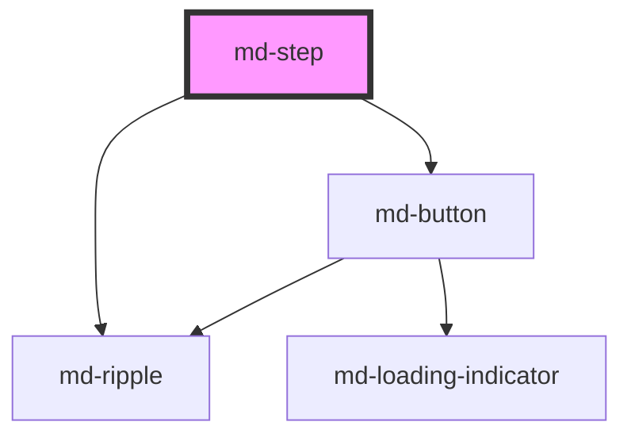

# md-step

<!-- llm:meta
tag: md-step
category: navigation
status: sub-component
parent: md-stepper
standalone: false
m3-guidelines: none — M3 has no stepper page
m3-derived-from: https://m3.material.io/components/progress-indicators/guidelines
form-associated: false
depends-on: md-ripple, md-button
used-by: none
-->

**One step inside an `md-stepper`.** An indicator (number, dot, check, pencil
or error glyph), a label, an optional supporting line, and — where the layout
calls for it — the step's own content panel.

> 🧩 **Sub-component.** Only valid inside `md-stepper`, which owns the active
> index, ordering, navigation and every localized word.

---

## When to use

- One stage of a sequential process, as a **direct child** of `md-stepper` —
  that parent collects only its own `md-step` children, so a wrapper element
  around them makes them invisible to it.

## When NOT to use

| Situation | Use instead |
|---|---|
| A tab panel | `md-tab-panel` |
| A collapsible section | `md-accordion-item` |
| A list row | `md-list-item` |
| A standalone form section | A heading plus content |
| A progress readout | `md-progress-indicator` |

## Decision cues

| Need | Setting |
|---|---|
| Skippable step | `optional` |
| A finished step users may revisit without losing later progress | `editable` |
| Show a validation failure | `error` + `error-text` |
| Custom indicator glyph | `icon` |
| Different completed / error glyphs | `completed-icon` / `error-icon` |
| Suppress this step's built-in Back / Continue | `hide-actions` |
| Override the announced name | `accessible-name` |
| Make a step unreachable | `disabled` |

## API contract

```html
<md-stepper>
  <md-step
    label="Payment"                    <!-- default: "" -->
    description="Card or bank transfer" <!-- default: "" -->
    completed                          <!-- default: false -->
    active                             <!-- default: false, set by the stepper -->
    error                              <!-- default: false -->
    error-text="Card declined"         <!-- default: "" -->
    optional                           <!-- default: false -->
    editable                           <!-- default: false -->
    disabled                           <!-- default: false -->
    icon="lock"                        <!-- default: "" (numbered bubble) -->
    completed-icon="check"             <!-- default: check -->
    error-icon="priority_high"         <!-- default: priority_high -->
    accessible-name="Payment details"  <!-- default: composed by the step -->
    hide-actions                       <!-- default: false -->
    density="-1|-2|-3|-4"              <!-- omit for the default rung -->
  >
    Step content goes here.
  </md-step>
</md-stepper>
```

**Events** — `mdStepClick`, `mdStepNext` and `mdStepBack`, each with detail
`{ index }`. All three are `bubbles: true, composed: false` **internal
coordination events**: the owning stepper listens for them and calls
`stopPropagation()`, so they do not escape the stepper — nothing above
`md-stepper` ever sees them (a listener bound directly to the `md-step` or the
`md-stepper` element still fires, since `stopPropagation()` only blocks
ancestors). Listen to the stepper's `mdBeforeChange` / `mdStepChange` /
`mdComplete` instead.

**Methods** — none.

**Slots** — one default slot for the step's content. It is only rendered when
this step has a panel (see below).

**Parts** — `inner`, `indicator`, `bubble`, `dot`, `state-layer`, `text`,
`label`, `optional`, `description`, `connector`, `connector-leading`,
`connector-trailing`, `content`, `actions`.

**Written by the parent — never set these by hand:** the `data-index`,
`data-total`, `data-active`, `data-orientation`, `data-indicator`, `data-mode`,
`data-position`, `data-panel-mode`, `data-nav`, `data-lazy`, `data-loading`,
`data-next-disabled`, `data-*-word` and `data-*-label` attributes, and the
`--md-step-idx` variable. The stepper rewrites them on every sync.

### Behavioral contract worth knowing

- **`active` and `completed` are stepper-managed.** The stepper's `active`
  index drives `active`, and its `auto-complete` drives `completed`; setting
  `active` on a step does not move the stepper. Set `completed` yourself only
  when the stepper has `auto-complete="false"`.
- Position, orientation, indicator style, linear mode and every localized word
  arrive from the parent as `data-*` attributes. A `md-step` outside a stepper
  falls back to index 0 of 0, horizontal, numbered, non-linear, English.
- **Indicator precedence.** With `indicator="dot"` on the stepper the step
  renders a bare dot and no glyph at all. Otherwise: `error` glyph, then
  `icon`, then — when `completed` — `edit` if `editable` else `completed-icon`,
  otherwise the 1-based step number.
- `error-text` replaces `description` in the supporting line while `error` is
  set, and is appended to the announced name.
- **Reachability is enforced here too.** In the parent's `mode="linear"`, a
  step is interactive only when its index is at or before the active one, or it
  is `completed`, or every earlier step is `completed` or `optional`. An
  unreachable step looks and behaves disabled — `aria-disabled`, `tabindex=-1`,
  no ripple — without carrying the `disabled` attribute.
- **Whether this step gets a panel is decided for you.** Vertical: a panel
  exists when the step has light-DOM content **or** the built-in actions are on
  (`nav` on the parent and no `hide-actions` here) — which is why a vertical
  step with no content still renders a Back / Continue row. Horizontal: only
  when the step has light-DOM content, and the parent has therefore switched
  the row into per-step panel mode.
- `hide-actions` removes only this step's Back / Continue, and only in the
  vertical layout — the horizontal Back / Continue bar belongs to the stepper,
  not to a step.
- Content is detected by watching this element's child list, so appending or
  removing children later re-evaluates the panel. Whitespace-only text does not
  count as content.
- The built-in action buttons are internal chrome: their composed `mdClick`
  retargets to this host and is stopped there, so a delegated listener on any
  ancestor sees only buttons you slotted yourself. `stopPropagation()` does not
  silence listeners bound to the `md-step` element itself — bind those to your
  own button, not to the step.
- The header is activated with click, `Enter` or `Space`; keyboard activation
  triggers the same centered ripple as a pointer press.
- The parent's `lazy` keeps only the active step's panel mounted; a closed
  non-lazy panel stays in the tree (so it can animate shut) but is
  hidden from the a11y tree and the tab order.

---

## Do / Don't

House rules, informed by
[M3 · Progress indicators](https://m3.material.io/components/progress-indicators/guidelines).

| ✅ Do | ❌ Don't |
|---|---|
| Keep `label` to one or two words | Don't write a sentence as the step label |
| Use `description` for the clarifying line | Don't cram detail into the label |
| Mark genuinely skippable steps `optional` | Don't mark every step optional |
| Set `editable` on steps users may revisit | Don't strand users on a completed step they need to fix |
| Show validation with `error` + `error-text` | Don't report a step error only in a toast |
| Let the stepper own `active` / `completed` | Don't drive them per step alongside the stepper |
| Use `hide-actions` for a custom final action | Don't leave two competing Continue buttons |
| Keep step content focused on one decision | Don't put three unrelated forms in one step |

---

## Patterns

```html
<!-- Errors are set on the step, the decision is taken on the stepper.
     Vertical: `hide-actions` only removes the built-in Back / Continue of a
     vertical step. On a horizontal stepper the bar belongs to the stepper —
     hide it with `nav="false"` there. -->
<md-stepper id="wiz" label="Sign-up" orientation="vertical">
  <md-step label="Account" description="Email and password">
    Account fields go here.
  </md-step>
  <md-step label="Payment" editable>Payment fields go here.</md-step>
  <md-step label="Extras" optional>Optional add-ons go here.</md-step>
  <md-step label="Review" hide-actions>
    Summary goes here.
    <md-button id="place" variant="filled">Place order</md-button>
  </md-step>
</md-stepper>

<script type="module">
  const wiz = document.getElementById('wiz');
  const valid = (index) => true; // your real validation

  wiz.addEventListener('mdBeforeChange', (e) => {
    const step = wiz.querySelectorAll('md-step')[e.detail.previous];
    if (valid(e.detail.previous)) {
      step.error = false;
    } else {
      e.preventDefault();
      step.error = true;
      step.errorText = 'Please complete this step';
    }
  });

  document.getElementById('place').addEventListener('mdClick', () => {
    wiz.dispatchEvent(new CustomEvent('submit-order'));
  });
</script>
```

```html
<!-- Manual completion: auto-complete off on the stepper -->
<md-stepper id="manual" auto-complete="false" label="Upload">
  <md-step label="Choose">Pick a file.</md-step>
  <md-step label="Upload">Uploading…</md-step>
</md-stepper>

<script type="module">
  const manual = document.getElementById('manual');
  const saveToServer = async () => true; // your real request

  const step = manual.querySelectorAll('md-step')[0];
  if (await saveToServer()) step.completed = true;
</script>
```

```html
<!-- A locked step: disabled keeps it announced but unreachable -->
<md-stepper label="Provisioning">
  <md-step label="Request">Fill in the request.</md-step>
  <md-step label="Approval" icon="lock" disabled
           description="Unlocks once your request is approved">
    Waiting for an approver.
  </md-step>
</md-stepper>
```

## Anti-patterns

| ❌ Wrong | ✅ Right | Why |
|---|---|---|
| Setting `active` on a step to navigate | Use the stepper's `active` / `goTo()` | A step's `active` is overwritten on the next sync. |
| Setting `completed` while `auto-complete` is on | Set `auto-complete="false"` on the stepper first | The stepper rewrites completion on every move. |
| Listening for `mdStepClick` / `mdStepNext` / `mdStepBack` | Use the stepper's events | They are `composed: false` and stopped by the parent. |
| A finished step with no `editable` in linear mode | Set `editable` | Revisiting a non-editable step un-completes it and everything after. |
| Translating "Optional" on the step | Set `optional-word` on the stepper | The parent owns that string. |
| Custom submit **and** the built-in actions on the last step | Add `hide-actions` | Two competing Continue buttons. |
| `hide-actions` on a horizontal stepper to hide its nav bar | Set `nav="false"` on the stepper | The horizontal bar belongs to the stepper. |
| Wrapping steps in a `<div>` inside the stepper | Keep every `md-step` a direct child | The stepper only collects its own children. |
| `md-step` outside `md-stepper` | Nest it | No ordering, indicator state, or navigation. |
| `--md-step-error-text` to set the error message | Set the `error-text` attribute | That custom property is the error bubble's *text colour*. |
| `density="0"` to escape an inherited rung | `style="--md-sys-density-scale: 0"` | There is no rung 0 — the attribute is inert. |
| Error shown only via a toast | `error` + `error-text` on the step | Keeps the problem where the fix is. |

## Accessibility, RTL, density, i18n

**Accessibility** — the host is a `listitem` inside the stepper's list, and the
header is a `button` carrying the composed name ("Step 2 of 4: Payment,
Optional, completed, current"), `aria-current="step"` while active,
`aria-disabled` when disabled or unreachable, and `aria-expanded` /
`aria-controls` when it owns a panel. `accessible-name` replaces that composed
string entirely. State is conveyed by glyph **and** text — a check, the error
glyph, the "Optional" caption — never by colour alone; `error-text` should be
specific and actionable, because it is what a screen-reader user hears when the
step fails. `disabled` keeps the step announced but out of the tab order.

**RTL** — the indicator, connectors, content padding and panel offset are built
on logical properties, so the whole step mirrors under `dir="rtl"`, including
the direction the connector fill grows in.

**Density** — `density="-1…-4"` locally overrides the inherited `data-density`
rung; only those four rungs exist, and omitting the attribute is the
uncompacted default. It shrinks the indicator, its hover ring and the connector
thickness. Usually you set it once on the stepper and let it cascade.
`density="0"` does **not** opt a step out of an ancestor's rung — to reset the
calc-driven scale use `style="--md-sys-density-scale: 0"` (the ancestor's
`--md-sys-spacing-*` payload still inherits).

**i18n** — translate `label`, `description`, `error-text` and, where you need
it, `accessible-name` here. The generic words ("Step", "of", "Optional",
"completed", "current", "error") live on the stepper as `step-word`, `of-word`,
`optional-word`, `completed-word`, `current-word` and `error-word`. Below
600px the horizontal layout hides the description and the "Optional" caption,
so never put load-bearing information only there.

## Related components

`md-stepper` · `md-tab-panel` · `md-accordion-item` ·
`md-progress-indicator` · `md-button` · `md-ripple`

## Theming

| Custom property | Purpose | Default |
|---|---|---|
| `--md-step-indicator-size` | Bubble diameter | `max(24px, 32px + density × 2px)` |
| `--md-step-indicator-ring` | Hover / ripple ring around the indicator | `max(4px, 8px + density × 1px)` |
| `--md-step-indicator-color` | Pending bubble background | `--md-sys-color-surface-container-highest` (`--md-sys-color-outline` for dots) |
| `--md-step-indicator-text` | Pending bubble text | `--md-sys-color-on-surface-variant` |
| `--md-step-active-color` | Active bubble / dot background | `--md-sys-color-primary` |
| `--md-step-active-text` | Active bubble text | `--md-sys-color-on-primary` |
| `--md-step-active-halo-color` | Soft halo around the active indicator | `--md-sys-color-primary` |
| `--md-step-completed-color` | Completed bubble / dot background | `--md-sys-color-primary` |
| `--md-step-completed-text` | Completed bubble text | `--md-sys-color-on-primary` |
| `--md-step-error-color` | Error bubble / dot background | `--md-sys-color-error` |
| `--md-step-error-text` | Error bubble **text colour** (not the message) | `--md-sys-color-on-error` |
| `--md-step-connector-color` | Unfilled connector track | `--md-sys-color-outline-variant` |
| `--md-step-connector-filled-color` | Filled connector | `--md-sys-color-primary` |
| `--md-step-connector-thickness` | Connector thickness | `max(2px, 4px + density × 0.5px)` |
| `--md-step-connector-duration` | Connector fill duration | `--md-sys-motion-duration-medium3` (350ms) |
| `--md-step-label-color` | Resting label colour | `--md-sys-color-on-surface-variant` |
| `--md-step-label-active-color` | Active label colour | `--md-sys-color-on-surface` |
| `--md-step-description-color` | Supporting / optional caption colour | `--md-sys-color-on-surface-variant` |
| `--md-step-state-layer-color` | Hover / focus / press overlay | `--md-sys-color-on-surface` |
| `--md-step-expand-duration` | Content panel expand duration | spatial spring (500ms) |
| `--md-step-collapse-duration` | Content panel collapse duration | `--md-sys-motion-duration-short4` (200ms) |

**CSS parts** — `inner`, `indicator`, `bubble`, `dot`, `state-layer`, `text`,
`label`, `optional`, `description`, `connector`, `connector-leading`,
`connector-trailing`, `content`, `actions`.

```css
md-step.brand {
  --md-step-active-color: var(--md-sys-color-tertiary);
  --md-step-active-text: var(--md-sys-color-on-tertiary);
  --md-step-connector-filled-color: var(--md-sys-color-tertiary);
}
md-step.brand::part(label) {
  letter-spacing: 0.02em;
}
```

<!-- Auto Generated Below -->


## Overview

`md-step` — one step inside an `<md-stepper>`.

Layout, position and i18n are pushed down from the parent stepper via
`data-*` attributes, so a step is almost always authored declaratively:

```html
<md-stepper active="1">
  <md-step label="Account" completed></md-step>
  <md-step label="Shipping" description="Address & method"></md-step>
  <md-step label="Payment" optional></md-step>
</md-stepper>
```

## Properties

| Property         | Attribute         | Description                                                                                                                                                                                                                      | Type                        | Default           |
| ---------------- | ----------------- | -------------------------------------------------------------------------------------------------------------------------------------------------------------------------------------------------------------------------------- | --------------------------- | ----------------- |
| `accessibleName` | `accessible-name` | Full override for the announced accessible name (i18n escape hatch).                                                                                                                                                             | `string \| undefined`       | `undefined`       |
| `active`         | `active`          | Whether this step is the active one. Usually managed by the parent.                                                                                                                                                              | `boolean`                   | `false`           |
| `completed`      | `completed`       | Whether this step is completed (shows a check / fills its connector).                                                                                                                                                            | `boolean`                   | `false`           |
| `completedIcon`  | `completed-icon`  | Glyph shown when completed (Material Symbols name).                                                                                                                                                                              | `string`                    | `'check'`         |
| `density`        | `density`         | Local density rung. Drives the same `--md-sys-density-scale` signal that a global `data-density` ancestor sets, so a local value simply overrides the inherited one. 0 = default, -4 = ultra-compact.                            | `-1 \| -2 \| -3 \| -4 \| 0` | `0`               |
| `description`    | `description`     | Supporting text beneath the label.                                                                                                                                                                                               | `string`                    | `''`              |
| `disabled`       | `disabled`        | Manually disable the step (parent's `mode="linear"` also gates reachability).                                                                                                                                                    | `boolean`                   | `false`           |
| `editable`       | `editable`        | Editable: a completed step shows an edit (pencil) affordance, and — with `auto-complete` on — revisiting it preserves downstream completion (review/edit in place). Revisiting a non-editable step restarts progress from there. | `boolean`                   | `false`           |
| `error`          | `error`           | Whether this step is in an error state.                                                                                                                                                                                          | `boolean`                   | `false`           |
| `errorIcon`      | `error-icon`      | Glyph shown when in error (Material Symbols name).                                                                                                                                                                               | `string`                    | `'priority_high'` |
| `errorText`      | `error-text`      | Error message shown beneath the label (overrides `description` on error).                                                                                                                                                        | `string`                    | `''`              |
| `hideActions`    | `hide-actions`    | Hide the built-in Back / Continue actions in the vertical content panel.                                                                                                                                                         | `boolean`                   | `false`           |
| `icon`           | `icon`            | Override the indicator glyph (Material Symbols name), e.g. "lock".                                                                                                                                                               | `string`                    | `''`              |
| `label`          | `label`           | Step caption ("Account info", "Shipping", …).                                                                                                                                                                                    | `string`                    | `''`              |
| `optional`       | `optional`        | Mark the step optional — shows an "Optional" caption and may be skipped.                                                                                                                                                         | `boolean`                   | `false`           |


## Events

| Event         | Description                                                                                                                                     | Type                              |
| ------------- | ----------------------------------------------------------------------------------------------------------------------------------------------- | --------------------------------- |
| `mdStepBack`  | Back pressed in this step's content panel. Consumed by `md-stepper`.                                                                            | `CustomEvent<{ index: number; }>` |
| `mdStepClick` | Bubbled to the parent stepper, which decides whether the move is allowed. Internal coordination event — consumed (and stopped) by `md-stepper`. | `CustomEvent<{ index: number; }>` |
| `mdStepNext`  | Continue pressed in this step's content panel. Consumed by `md-stepper`.                                                                        | `CustomEvent<{ index: number; }>` |


## Slots

| Slot | Description                                                                                                                                                                                                                                                                                                                  |
| ---- | ---------------------------------------------------------------------------------------------------------------------------------------------------------------------------------------------------------------------------------------------------------------------------------------------------------------------------- |
|      | Step content. **Vertical**: a spring-animated expanding panel when the step is active, with built-in Back / Continue actions unless `hide-actions` is set. **Horizontal**: a full-width panel under the step row — the parent opts the row into a grid automatically the moment any step has content. A horizontal stepper whose steps are all empty is unaffected and keeps taking one shared panel through `md-stepper`'s own `content` slot. |


## Shadow Parts

| Part                                                            | Description                                             |
| --------------------------------------------------------------- | ------------------------------------------------------- |
| `"actions"`                                                     | Back / Continue action row in the content panel.        |
| `"bubble"`                                                      | Numbered / icon indicator.                              |
| `"connector"`                                                   | Connector line (leading or trailing).                   |
| `"connector-leading"`                                           | The rail segment above the bubble (vertical).           |
| `"connector-trailing"`                                          | The rail/line segment after the bubble.                 |
| `"content"`                                                     | Vertical content panel.                                 |
| `"description"`                                                 | Supporting / helper text (or error / optional caption). |
| `"dot"`                                                         | Dot indicator (dot variant).                            |
| `"indicator"`                                                   | Circular wrapper around the bubble/dot (hover/ripple).  |
| `"inner"`                                                       | The clickable step header (indicator + text).           |
| `"label"`                                                       | Step label.                                             |
| `"optional"`                                                    | The "Optional" caption.                                 |
| `"state-layer"`                                                 | Hover / focus / press overlay inside the indicator.     |
| `"text"`                                                        | Label + supporting text wrapper.                        |


## Dependencies

### Depends on

- [md-ripple](../md-ripple)
- [md-button](../md-button)

### Graph


----------------------------------------------

*Built with [StencilJS](https://stenciljs.com/)*
