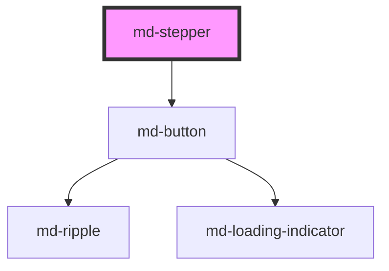

# md-stepper

<!-- llm:meta
tag: md-stepper
category: navigation
status: custom
m3-guidelines: none — M3 has no stepper page
m3-derived-from: https://m3.material.io/components/progress-indicators/guidelines, https://m3.material.io/components/tabs/guidelines
form-associated: false
depends-on: md-button
used-by: none
accepts-children: md-step
-->

**A sequential process broken into ordered steps.** Owns the active index, the
built-in navigation and whether the user may jump ahead, and pushes layout plus
every localized word down to its slotted `md-step` children.

> ⚠️ **Not a Material Design 3 component.** M3 has no stepper page; the guidance
> below is house rules informed by M3's progress-indicator and tab rules.

> Setup, theming, density and i18n are configured once for the whole library —
> see [`main-llm.md`](../../../../../main-llm.md) at the repo root.

---

## When to use

- A **sequential** task with a clear order: checkout, onboarding, a multi-page
  form, a setup wizard.
- Steps that must validate before the user advances (`mdBeforeChange` or
  `next-disabled`).
- The user benefits from seeing progress and what remains.

## When NOT to use

| Situation | Use instead |
|---|---|
| Peer views the user switches between freely | `md-tabs` |
| Independent collapsible sections | `md-accordion` |
| Top-level destinations | `md-navigation-bar` / `md-navigation-rail` |
| Simple progress reporting (one bar, no stages) | `md-progress-indicator` |
| Reporting stages nobody navigates | This, with `readonly` |
| A two-field form | Just show the form |
| Hierarchy, not sequence | `md-breadcrumbs` |

## Decision cues

| Need | Setting |
|---|---|
| Steps must be done in order | `mode="linear"` (default) |
| User may jump to any step | `mode="non-linear"` |
| Numbered circles | `indicator="numbered"` (default) |
| Minimal dots | `indicator="dot"` |
| Compact bar for narrow screens | `variant="mobile"` (+ a `content` slot) |
| Vertical layout with inline panels | `orientation="vertical"` |
| A panel per step (either orientation) | Put content inside each `md-step` |
| One shared panel you swap yourself | Put it in the stepper's `content` slot |
| Mount only the active step's panel | `lazy` |
| Gate Continue on the current form's validity | `next-disabled` |
| Async work behind Continue | `loading` |
| Supply your own buttons | `nav="false"` |
| Show where something already is, with nothing to press | `readonly` |
| Block a specific transition | Cancel `mdBeforeChange` |

## API contract

```html
<md-stepper
  orientation="horizontal|vertical"    <!-- default: horizontal -->
  indicator="numbered|dot"             <!-- default: numbered -->
  variant="default|mobile"             <!-- default: default -->
  mode="linear|non-linear"             <!-- default: linear -->
  active="0"                           <!-- default: 0, out-of-range clamps -->
  auto-complete="true"                 <!-- default: true -->
  nav="true"                           <!-- default: true -->
  readonly="false"                     <!-- default: false -->
  next-disabled="false"                <!-- default: false -->
  loading="false"                      <!-- default: false -->
  lazy="false"                         <!-- default: false -->
  label="Progress"                     <!-- default: Progress -->
  step-word="Step"                     <!-- default: Step -->
  of-word="of"                         <!-- default: of -->
  completed-word="completed"           <!-- default: completed -->
  current-word="current"               <!-- default: current -->
  error-word="error"                   <!-- default: error -->
  optional-word="Optional"             <!-- default: Optional -->
  next-label="Continue"                <!-- default: Continue -->
  back-label="Back"                    <!-- default: Back -->
  finish-label="Finish"                <!-- default: Finish -->
  density="-1|-2|-3|-4"                <!-- omit for the default rung -->
>
  <md-step label="Account">Account fields go here.</md-step>
  <md-step label="Payment">Payment fields go here.</md-step>
  <md-step label="Review">Summary goes here.</md-step>
</md-stepper>
```

**Events** — all three bubble and are composed, so you may listen on the
stepper or on an ancestor.

| Event | Cancelable | Detail | Fires |
|---|---|---|---|
| `mdBeforeChange` | **yes** | `{ index, previous }` | Before a user-driven move commits |
| `mdStepChange` | no | `{ index, previous }` | After `active` actually changed |
| `mdComplete` | no | `void` | Continue pressed on the last step |

**Methods** — `next()`, `prev()`, `goTo(index)`, `reset()`. All are async and
resolve to `void`.

**Slots** — the default slot takes `md-step` children; the named `content` slot
takes one shared panel rendered between the step row and the nav bar.

**Parts** — `list`, `content`, `nav`, `mobile-nav`, `mobile-progress`.

**Written by the component — never set these by hand:** the `data-panel-mode`
attribute and the `--md-stepper-step-count` variable on the host, and the
`data-index` / `data-total` / `data-active` / `data-orientation` /
`data-indicator` / `data-mode` / `data-position` / `data-nav` / `data-lazy` /
`data-loading` / `data-next-disabled` / `data-*-word` / `data-*-label`
attributes plus `--md-step-idx` that the stepper stamps on each `md-step`.

### Behavioral contract worth knowing

- **Steps must be direct children.** The stepper collects `md-step` elements
  from its own child list only — wrap them in a `<div>` and the step count is
  0, no nav bar renders and nothing is navigable.
- **`readonly` is a different thing from `nav="false"` and from `disabled`.**
  `nav="false"` only hides the Back / Continue bar; every header stays a button,
  so a trail built that way still invites a click that does nothing. `disabled`
  says "you may not", which is a refusal, and it dims the step to 0.38 —
  wrong for a stage that simply has not happened yet. `readonly` says there was
  never an action: the header drops `role="button"`, its tab stop, its ripple
  and its state layer, keeps `aria-current` so a reader still learns which stage
  is live, and keeps every step at full contrast. It also makes `mode`
  irrelevant, because nothing is navigating: linear gating no longer dims the
  stages ahead. A step you explicitly mark `disabled` stays disabled.
- `active` clamps into `0 … count - 1` (and to `0` when there are no steps),
  including the initial attribute value.
- **`mdBeforeChange` is the validation hook.** It fires for step clicks, the
  built-in Back / Continue, and `next()` / `prev()` / `goTo()`. Cancel it to
  keep the user where they are.
- **Assigning `active` yourself does not emit `mdBeforeChange`** — it still
  emits `mdStepChange` and still applies auto-complete. That is the sanctioned
  way to commit a transition you vetoed while you awaited something. Never call
  `next()` or `goTo()` from inside a handler that cancelled `mdBeforeChange`:
  they re-emit it and re-enter your handler.
- `auto-complete` (default **on**) moving **forward** marks every non-disabled
  step you passed over as `completed` and clears its `error`. Moving
  **backward** it un-completes the target and everything after it, so a later
  step can never stay checked while an earlier one is not — unless the target
  is `editable` **and** already `completed`, which is review-in-place and
  leaves downstream completion alone.
- `next()` on the last reachable step does not move: with `auto-complete` on it
  marks the current step completed, then emits `mdComplete`. `next()` and
  `prev()` skip `disabled` steps.
- `mode="linear"` gating: backward is always allowed; forward is allowed only
  when the target is already `completed`, or every earlier step is `completed`
  or `optional`. Unreachable step headers are `aria-disabled` and out of the
  tab order. `mode="non-linear"` allows any non-disabled step.
- **`next-disabled` and `loading` gate only the built-in Continue button.**
  Clicking a step header and calling `next()` / `goTo()` are unaffected — use
  `mode="linear"` and/or `mdBeforeChange` for those. `loading` also disables
  Back, which is what stops a double-submit.
- **Where the nav lives depends on orientation.** A horizontal stepper renders
  one Back / Continue bar below the content; a vertical stepper has each active
  step render its own Back / Continue inside its panel. Both are suppressed by
  `nav="false"`, and a vertical step opts out individually with `hide-actions`.
- `variant="mobile"` hides the entire step-header row and renders the compact
  Back · progress · Continue bar instead, so the active panel must go in the
  stepper's `content` slot. That bar is part of the navigation: with
  `nav="false"` nothing is rendered but the content slot.
- `lazy` mounts only the active step's panel; the others are out of layout and
  out of the a11y tree, with no collapse animation. It drops the *panel*, not
  your component — slotted custom elements stay connected in the light DOM, so
  a real teardown means conditionally rendering the content in your framework.
- **Panels live in one of two places, and the stepper picks the layout.** Put
  content inside each `md-step` and it panels per step — expanding in place when
  vertical, spanning the full width under the row when horizontal. Put one
  `<div slot="content">` on the stepper instead and you own a single region you
  swap on `mdStepChange`.
- **Per-step panels are detected, not configured.** There is no prop: the moment
  any step has light-DOM content, a horizontal stepper switches its row from a
  flex line to a grid so the panel can span every column underneath. A
  horizontal stepper whose steps are all empty is unaffected.

  This is why two placements exist at all — a slot cannot reach a *grandchild*,
  so `md-stepper` can never project a step's children into its own `content`
  region. Only `md-step` can render them, and the grid is what lets its panel
  escape a `flex: 1 1 0` column that would otherwise be 1/N of the row.
- The built-in buttons are internal chrome: their composed `mdClick` retargets
  to the stepper's host and is stopped there, so a delegated listener on any
  ancestor never sees Back or Continue. `stopPropagation()` does not silence
  listeners bound to the `<md-stepper>` element itself — those still fire for
  the built-in buttons, so don't delegate off the host. Listen for
  `mdStepChange` / `mdComplete` instead.

---

## Do / Don't

House rules, informed by
[M3 · Progress indicators](https://m3.material.io/components/progress-indicators/guidelines)
and [M3 · Tabs](https://m3.material.io/components/tabs/guidelines).

| ✅ Do | ❌ Don't |
|---|---|
| Use a stepper only for genuinely sequential work | Don't use one for peer views — that's tabs |
| Validate in `mdBeforeChange` and cancel on failure | Don't let users advance past an invalid step silently |
| Keep step labels to one or two words | Don't write sentences as step labels |
| Mark genuinely skippable steps `optional` | Don't mark everything optional |
| Show errors on the step with `error` + `error-text` | Don't surface step errors only in a dialog |
| Localize every `*-word` and `*-label` | Don't ship the English defaults |
| Use `mode="non-linear"` when order really doesn't matter | Don't force linear order artificially |
| Keep the step count small (3–5) | Don't build a twelve-step wizard |
| Use `loading` for async transitions | Don't leave the user unsure whether Continue worked |
| Put the panel inside each step when it belongs to that step | Don't hand-roll a `content` slot and swapping code you don't need |

---

## Patterns

```html
<!-- Gate every forward move on the current step's validity -->
<md-stepper id="wiz" label="Checkout progress">
  <md-step label="Account">Account fields go here.</md-step>
  <md-step label="Payment">Payment fields go here.</md-step>
  <md-step label="Review">Summary goes here.</md-step>
</md-stepper>

<script type="module">
  const wiz = document.getElementById('wiz');
  const validateStep = (index) => true; // your real validation

  wiz.addEventListener('mdBeforeChange', (e) => {
    const { index, previous } = e.detail;
    if (index > previous && !validateStep(previous)) e.preventDefault();
  });

  wiz.addEventListener('mdStepChange', (e) => console.log(e.detail.index));
  wiz.addEventListener('mdComplete', () => console.log('finished'));
</script>
```

```html
<!-- Async work behind Continue: veto, await, then COMMIT by setting `active`
     (calling next()/goTo() here would re-enter this handler). -->
<md-stepper id="signup" label="Sign-up">
  <md-step label="Email">Email field goes here.</md-step>
  <md-step label="Profile">Profile fields go here.</md-step>
</md-stepper>

<script type="module">
  const signup = document.getElementById('signup');
  const save = async () => true; // your real request

  signup.addEventListener('mdBeforeChange', async (e) => {
    e.preventDefault();
    signup.loading = true;
    const ok = await save();
    signup.loading = false;
    if (ok) signup.active = e.detail.index;
  });
</script>
```

```html
<!-- Declarative gate: bind next-disabled to the current form's validity -->
<md-stepper id="form-wiz" next-disabled label="Details">
  <md-step label="Name">
    <md-text-field id="name" label="Full name" required></md-text-field>
  </md-step>
  <md-step label="Done">All set.</md-step>
</md-stepper>

<script type="module">
  const formWiz = document.getElementById('form-wiz');
  const name = document.getElementById('name');
  name.addEventListener('mdInput', () => {
    formWiz.nextDisabled = !name.value.trim();
  });
</script>
```

```html
<!-- Vertical wizard: each step owns its panel and its Back / Continue -->
<md-stepper orientation="vertical" label="Setup">
  <md-step label="Workspace">Name your workspace.</md-step>
  <md-step label="Members" optional>Invite teammates.</md-step>
  <md-step label="Finish">Review and finish.</md-step>
</md-stepper>
```

```html
<!-- Mobile bar: headers are hidden, so the panel lives in the content slot -->
<md-stepper id="mob" variant="mobile" indicator="dot" label="Onboarding">
  <md-step label="Welcome"></md-step>
  <md-step label="Profile"></md-step>
  <md-step label="Done"></md-step>
  <div slot="content" id="mob-panel">Welcome!</div>
</md-stepper>

<script type="module">
  const mob = document.getElementById('mob');
  const panels = ['Welcome!', 'Tell us about you.', 'All done.'];
  mob.addEventListener('mdStepChange', (e) => {
    document.getElementById('mob-panel').textContent = panels[e.detail.index];
  });
</script>
```

```html
<!-- Your own navigation -->
<md-stepper id="own" nav="false" label="Manual">
  <md-step label="One">First.</md-step>
  <md-step label="Two">Second.</md-step>
</md-stepper>
<md-button id="own-back">Back</md-button>
<md-button id="own-next" variant="filled">Continue</md-button>

<script type="module">
  const own = document.getElementById('own');
  document.getElementById('own-back').addEventListener('click', () => own.prev());
  document.getElementById('own-next').addEventListener('click', () => own.next());
</script>
```

```html
<!-- Localized: every user-facing word is a prop -->
<md-stepper
  label="Progression"
  step-word="Étape" of-word="sur"
  completed-word="terminée" current-word="actuelle" error-word="erreur"
  optional-word="Facultatif"
  next-label="Continuer" back-label="Retour" finish-label="Terminer"
>
  <md-step label="Compte">Champs du compte.</md-step>
  <md-step label="Paiement">Champs de paiement.</md-step>
</md-stepper>
```

## Anti-patterns

| ❌ Wrong | ✅ Right | Why |
|---|---|---|
| Wrapping the steps in a `<div>` or a `<form>` element | Make every `md-step` a direct child | Only direct children are collected — a wrapper makes the stepper empty. |
| Validating in `mdStepChange` | Validate in `mdBeforeChange` and cancel | By `mdStepChange` the move already happened. |
| Calling `next()` / `goTo()` to commit after cancelling `mdBeforeChange` | Assign `stepper.active = index` | The methods re-emit `mdBeforeChange` and re-enter your handler. |
| Expecting `next-disabled` to block step clicks | Use `mode="linear"` or cancel `mdBeforeChange` | It only disables the built-in Continue button. |
| Leaving `auto-complete` on when completion needs server confirmation | Set `auto-complete="false"` and set `completed` yourself | Otherwise steps look done before they are. |
| Assuming a completed step stays completed after stepping back | Set `editable` on steps meant for review | Backward moves un-complete the target and everything after it. |
| `variant="mobile"` with content inside each `md-step` | Put the panel in the stepper's `content` slot | The mobile variant hides the whole step row, panels included. |
| `variant="mobile"` together with `nav="false"` | Keep `nav` on, or drop the mobile variant | The mobile bar *is* the navigation — nothing renders without it. |
| Per-step panels **and** a shared `content` slot on one stepper | Pick one | Both render — per-step panels inside the row, the shared region below it. |
| Expecting `lazy` to destroy a slotted component | Conditionally render it | `lazy` drops the panel; the slotted element stays connected. |
| Setting `data-active` / `data-index` / `--md-stepper-step-count` by hand | Set `active`, `orientation`, … | Those are written by the stepper and overwritten on every sync. |
| Shipping the English `*-word` props in a localized app | Translate them all | They're assembled into the announcements. |
| `density="0"` to escape an inherited rung | `style="--md-sys-density-scale: 0"` | There is no rung 0 — the attribute is inert. |
| A stepper for tabbed views | `md-tabs` | Steppers imply order. |
| A twelve-step wizard | Group into 3–5 phases | Cognitive load. |

## Accessibility, RTL, density, i18n

**Accessibility** — the host is a `navigation` landmark named by `label`
(default `Progress`), wrapping an ordered list of step headers. Each header is
a `button` with `aria-current="step"` when active, `aria-disabled` when
unreachable or disabled, and `aria-expanded` when it owns a panel. There is no
roving tabindex: every reachable header is its own tab stop, activated with
`Enter` or `Space`; unreachable and disabled headers are removed from the tab
order. Two visually-hidden live regions announce changes — a polite one for
"Step 2 of 4: Payment, current" and an assertive one when a step enters
`error`. After the built-in nav moves a vertical stepper, focus lands on the
new active header rather than falling to `<body>`. Cancelling `mdBeforeChange`
should be paired with a visible, announced reason — a silent block is invisible
to screen-reader users. Keep DOM order equal to step order.

**RTL** — the layout is built on logical properties, so the row, the connectors
and the nav bar mirror under `dir="rtl"`, including the direction the connector
fill grows in.

**Density** — `density="-1…-4"` locally overrides the inherited `data-density`
rung; only those four rungs exist, and omitting the attribute is the
uncompacted default. It compacts the indicators, connector thickness and the
nav spacing, and cascades to the slotted steps. `density="0"` does **not** opt
a stepper out of an ancestor's rung — to reset the calc-driven scale use
`style="--md-sys-density-scale: 0"` (the ancestor's `--md-sys-spacing-*`
payload still inherits).

**i18n** — every user-facing word is a prop: `label`, `step-word`, `of-word`,
`completed-word`, `current-word`, `error-word`, `optional-word`, `next-label`,
`back-label`, `finish-label`, plus each step's `label`, `description` and
`error-text`. The assembled order ("Step 2 of 4: Payment, current") is fixed,
so locales needing a different order should adjust the wording to fit, or
override a step's whole announced name with its `accessible-name`.

## Related components

`md-step` · `md-tabs` · `md-accordion` · `md-progress-indicator` ·
`md-breadcrumbs` · `md-button`

## Theming

| Custom property | Purpose | Default |
|---|---|---|
| `--md-stepper-gap` | Gap between steps (vertical only) | `0` |
| `--md-step-connector-color` | Pending mobile dot (and every step's connector track) | `--md-sys-color-outline` here, `--md-sys-color-outline-variant` in `md-step` |
| `--md-step-active-color` | Active / done mobile dot (and every step's active bubble) | `--md-sys-color-primary` |

`--md-stepper-gap` defaults to `0` on purpose: the vertical connector rail is
continuous only while adjacent step boxes touch, so any other value opens gaps
in it. Add padding inside the step content instead.

**CSS parts** — `list`, `content`, `nav`, `mobile-nav`, `mobile-progress`.

```css
md-stepper.brand {
  --md-step-active-color: var(--md-sys-color-tertiary);
  --md-step-connector-color: var(--md-sys-color-outline-variant);
}
md-stepper.brand::part(nav) {
  justify-content: space-between;
}
```

Everything else about a step's appearance is themed with the `--md-step-*`
properties documented in the `md-step` readme.

<!-- Auto Generated Below -->


## Overview

`md-stepper` — Material Design 3 stepper. Orchestrates a set of slotted
`md-step` children: it owns the active index and navigation, and pushes
layout / i18n down to each step.

**Controlled, with optional auto-progress.** The stepper owns `active`
(updated on click / `next` / `prev` / `goTo`, emitting `mdStepChange`). With
`auto-complete` (default), advancing marks the step you leave as `completed`,
so the progress line + checks "just work" — no manual wiring. Set
`auto-complete="false"` to own `completed` yourself.

```html
<md-stepper active="0">
  <md-step label="Account"><p>…</p></md-step>
  <md-step label="Shipping" optional><p>…</p></md-step>
  <md-step label="Payment" editable><p>…</p></md-step>
</md-stepper>
```

## Properties

| Property        | Attribute        | Description                                                                                                                                                                                                                                                                                                                                                                          | Type                         | Default        |
| --------------- | ---------------- | ------------------------------------------------------------------------------------------------------------------------------------------------------------------------------------------------------------------------------------------------------------------------------------------------------------------------------------------------------------------------------------ | ---------------------------- | -------------- |
| `active`        | `active`         | Index of the active step. Two-way bindable. Out-of-range values clamp.                                                                                                                                                                                                                                                                                                               | `number`                     | `0`            |
| `autoComplete`  | `auto-complete`  | When advancing (via `next()` or a step's built-in Continue button), mark the step being left as `completed`. Default `true`. Turn off to fully control completion yourself.                                                                                                                                                                                                          | `boolean`                    | `true`         |
| `backLabel`     | `back-label`     | Label for the built-in Back button.                                                                                                                                                                                                                                                                                                                                                  | `string`                     | `'Back'`       |
| `completedWord` | `completed-word` | Localized word announced for a completed step ("…, completed").                                                                                                                                                                                                                                                                                                                      | `string`                     | `'completed'`  |
| `currentWord`   | `current-word`   | Localized word announced for the current step ("…, current").                                                                                                                                                                                                                                                                                                                        | `string`                     | `'current'`    |
| `density`       | `density`        | Local density rung. Drives the same `--md-sys-density-scale` signal that a global `data-density` ancestor sets, so a local value simply overrides the inherited one. 0 = default, -4 = ultra-compact.                                                                                                                                                                                | `-1 \| -2 \| -3 \| -4 \| 0`  | `0`            |
| `errorWord`     | `error-word`     | Localized word announced for a step in error ("…, error: message").                                                                                                                                                                                                                                                                                                                  | `string`                     | `'error'`      |
| `finishLabel`   | `finish-label`   | Label for the built-in Continue button on the last step.                                                                                                                                                                                                                                                                                                                             | `string`                     | `'Finish'`     |
| `indicator`     | `indicator`      | Indicator style: `numbered` circles or minimal `dot`s.                                                                                                                                                                                                                                                                                                                               | `"dot" \| "numbered"`        | `'numbered'`   |
| `label`         | `label`          | Accessible name for the navigation landmark.                                                                                                                                                                                                                                                                                                                                         | `string`                     | `'Progress'`   |
| `lazy`          | `lazy`           | Only mount the **active** vertical step's content panel; inactive panels are removed from layout and the a11y tree (no collapse animation). Use for wizards with heavy per-step content. Note: slotted custom elements stay *connected* in the light DOM — for full teardown, conditionally render the content in your framework.                                                    | `boolean`                    | `false`        |
| `loading`       | `loading`        | Put the built-in **Continue / Finish** button into a loading state (spinner + interactive-disabled) and disable **Back**, for async submit-on-Continue (prevents double-submit). Toggle it around your `await` — typically inside an `mdBeforeChange` handler that `preventDefault()`s, does async work, then commits by setting `active`.                                           | `boolean`                    | `false`        |
| `mode`          | `mode`           | - `linear` (default) — steps must be completed in order; future steps are   not reachable until the prior ones are done or optional (an `editable`   completed step can always be revisited). - `non-linear` — any step can be selected.                                                                                                                                             | `"linear" \| "non-linear"`   | `'linear'`     |
| `nav`           | `nav`            | Show the built-in **Back / Continue** navigation (default `true`) so users always have a clear way to move through the flow: - vertical → the buttons sit under each active step (Material wizard style), - horizontal → a single button bar below the stepper. Set `nav="false"` to drive navigation entirely yourself (clicking steps, `next()` / `prev()`, or your own controls). | `boolean`                    | `true`         |
| `nextDisabled`  | `next-disabled`  | Disable the built-in **Continue / Finish** button without disabling Back or the whole step. Bind this to your current step's form validity to gate advancement declaratively (the most common wizard need). Step clicks and the `next()`/`goTo()` methods are unaffected — use `mode="linear"` and/or `mdBeforeChange` for those.                                                    | `boolean`                    | `false`        |
| `nextLabel`     | `next-label`     | Label for the built-in Continue button.                                                                                                                                                                                                                                                                                                                                              | `string`                     | `'Continue'`   |
| `ofWord`        | `of-word`        | Localized word for "of" in each step's announced name ("Step 2 of 4").                                                                                                                                                                                                                                                                                                               | `string`                     | `'of'`         |
| `optionalWord`  | `optional-word`  | Caption + announced word for optional steps.                                                                                                                                                                                                                                                                                                                                         | `string`                     | `'Optional'`   |
| `orientation`   | `orientation`    | Layout orientation.                                                                                                                                                                                                                                                                                                                                                                  | `"horizontal" \| "vertical"` | `'horizontal'` |
| `readonly`      | `readonly`       | Render the stepper as a **status trail**: something to read, not to drive. Every step header stops being a button — no click, no keyboard activation, no ripple, no hover state layer, no tab stop, no `role="button"` — while `aria-current` still says which stage it is on. Not the same as `nav="false"`, which only hides the Back / Continue bar.                              | `boolean`                    | `false`        |
| `stepWord`      | `step-word`      | Localized word for "Step" in each step's announced name ("Step 2 of 4").                                                                                                                                                                                                                                                                                                             | `string`                     | `'Step'`       |
| `variant`       | `variant`        | Layout variant: - `default` — the full step row (headers + connectors). - `mobile` — a compact MUI-style bar for narrow screens: **Back**, a centered   progress (dots for `indicator="dot"`, else a "Step N of M" caption), and   **Continue / Finish**. The step headers are hidden; put the active step's   panel in the `content` slot and swap it on `mdStepChange`.            | `"default" \| "mobile"`      | `'default'`    |


## Events

| Event            | Description                                                                                                                                                                                                                                                                                                                                                                                                                                          | Type                                                |
| ---------------- | ---------------------------------------------------------------------------------------------------------------------------------------------------------------------------------------------------------------------------------------------------------------------------------------------------------------------------------------------------------------------------------------------------------------------------------------------------- | --------------------------------------------------- |
| `mdBeforeChange` | Fires BEFORE a user-driven step change commits (step click, built-in nav, or `next()`/`prev()`/`goTo()`). Cancelable: call `event.preventDefault()` to veto the transition (e.g. block Continue until the current step validates). `detail.index` is the requested step, `detail.previous` the current one. Does not fire for a direct `active` property assignment — set `active` yourself to commit authoritatively (e.g. after async validation). | `CustomEvent<{ index: number; previous: number; }>` |
| `mdComplete`     | Continue pressed on the last step (the flow is finished).                                                                                                                                                                                                                                                                                                                                                                                            | `CustomEvent<void>`                                 |
| `mdStepChange`   | Active step changed (after it commits).                                                                                                                                                                                                                                                                                                                                                                                                              | `CustomEvent<{ index: number; previous: number; }>` |


## Methods

### `goTo(index: number) => Promise<void>`

Jump to a step (out-of-range clamps; honors `linear` reachability; emits
`mdBeforeChange`).

#### Parameters

| Name    | Type     | Description |
| ------- | -------- | ----------- |
| `index` | `number` |             |

#### Returns

Type: `Promise<void>`


### `next() => Promise<void>`

Advance to the next non-disabled step (emitting a cancelable
`mdBeforeChange`). When `auto-complete` is on, the step you leave is marked
completed; past the last reachable step it emits `mdComplete`.

#### Returns

Type: `Promise<void>`


### `prev() => Promise<void>`

Step backward to the previous non-disabled step (emitting `mdBeforeChange`).

#### Returns

Type: `Promise<void>`


### `reset() => Promise<void>`

Reset to the first step and clear completed / error state.

#### Returns

Type: `Promise<void>`


## Slots

| Slot        | Description                                                                                                                                                                                                                                                 |
| ----------- | ----------------------------------------------------------------------------------------------------------------------------------------------------------------------------------------------------------------------------------------------------------- |
|             | `md-step` children.                                                                                                                                                                                                                                         |
| `"content"` | Content area for **horizontal** steppers, rendered between           the step row and the built-in nav bar. Put the active step's           panel here and swap it on `mdStepChange` (vertical steppers           render content inside each step instead). |


## Shadow Parts

| Part                | Description                                               |
| ------------------- | --------------------------------------------------------- |
| `"content"`         | Wrapper around the `content` slot.                        |
| `"list"`            | The ordered list wrapping the steps.                      |
| `"mobile-nav"`      | The compact `variant="mobile"` bar.                       |
| `"mobile-progress"` | The centered progress (dots / caption) in the mobile bar. |
| `"nav"`             | The horizontal Back / Continue button bar.                |


## Dependencies

### Depends on

- [md-button](../md-button)

### Graph


----------------------------------------------

*Built with [StencilJS](https://stenciljs.com/)*
