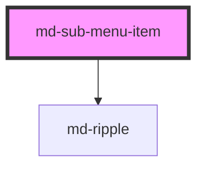

# md-sub-menu-item

<!-- llm:meta
tag: md-sub-menu-item
category: navigation
status: sub-component
parent: md-menu
standalone: false
m3-guidelines: https://m3.material.io/components/menus/guidelines
form-associated: false
depends-on: md-ripple
used-by: none
accepts-children: md-menu
-->

**A menu row that opens a nested submenu.** Same anatomy as `md-menu-item`, plus
a `submenu` slot that you fill with a second `md-menu`.

> 🧩 **Sub-component.** Only valid inside `md-menu` — its parent. M3 notes
> submenus are a pointer/keyboard affordance: they don't translate to touch, so
> use them sparingly.

---

## When to use

- Inside `md-menu`, the parent that owns it, for a command that branches into a
  **small** set of related sub-commands: "Export ▸ PDF / CSV / JSON",
  "Move to ▸ …".
- Desktop-oriented UIs where hover and keyboard traversal are natural.

## When NOT to use

| Situation | Use instead |
|---|---|
| A flat command | `md-menu-item` |
| A labelled section (not nested) | `md-menu-item-group` |
| Deep hierarchies (3+ levels) | A dialog or a dedicated page |
| Touch-first / mobile UIs | A flat menu or `md-bottom-sheet` |
| Choosing a value | `md-select` |
| Expandable page content | `md-accordion-item` |

## API contract

```html
<md-menu anchor="trigger">
  <md-sub-menu-item
    headline="Export"                    <!-- default: "" -->
    supporting-text="Choose a format"    <!-- default: "" -->
    badge="3"                            <!-- default: "" -->
    divider                              <!-- default: false; rule below the row -->
    gap                                  <!-- default: false; space below the row -->
    disabled                             <!-- default: false -->
    density="-1|-2|-3|-4"                <!-- default: 0 (uncompacted; there is no density="0" rule) -->
    open-delay="100"                     <!-- default: 100 (ms of hover before the flyout opens) -->
    close-delay="400"                    <!-- default: 400 (ms the flyout survives the pointer leaving) -->
  >
    <span slot="leading-icon" class="material-symbols-outlined">download</span>

    <!-- the nested menu: no `anchor`, the row positions it -->
    <md-menu slot="submenu">
      <md-menu-item headline="PDF"></md-menu-item>
      <md-menu-item headline="CSV"></md-menu-item>
    </md-menu>
  </md-sub-menu-item>
</md-menu>
```

**Event** — `mdClick`, a `CustomEvent<void>` with no payload, emitted with
Stencil's defaults (`bubbles: true, composed: true`). It fires when the **row
itself** is clicked; nested rows emit their own `mdClick`, which also bubbles
through this one.

**Method** — `collapse(): Promise<void>` — closes this row's submenu and clears
its visual state. There is no `expand()`: opening is user-driven.

**Slots** — `submenu` (**the nested `md-menu`**), `leading-icon`.

**Parts** — `state-layer`, `leading-icon`, `content`, `headline`,
`supporting-text`, `badge`.

There is **no default slot** and no `type` / `selected` / `keep-open` /
`check-position` / `trailing-text` / `presentation` — a submenu row is a branch,
not a selectable option.

### Behavioral contract worth knowing

- **You supply the nested menu.** Put an `<md-menu slot="submenu">` inside the
  row. Do **not** give that menu an `anchor`: the row positions the flyout
  itself and calls the nested menu's `show()` / `close()`.
- **Clicking the row does not open the submenu.** A click only emits `mdClick`.
  The submenu opens on `mouseenter`, and on `ArrowRight`, `Enter` or `Space`
  from the keyboard. `ArrowLeft` and `Escape` close it and return focus to the
  row.
- Hover-open does not move focus; keyboard-open does, and hands the visible
  focus ring to the first item of the nested menu.
- **Hover intent, both ways.** The pointer must rest on the row for
  `open-delay` (**default 100 ms**) before the flyout opens, and an open flyout
  survives the pointer leaving for `close-delay` (**default 400 ms**) before it
  closes. A flyout sits BESIDE its row and is taller than it, so the natural
  path to anything below its first item is a diagonal that crosses the rows
  underneath — the close delay is what stops those crossings switching the
  flyout out from under the pointer, and the open delay is what stops the rows
  being crossed from opening. A pending open is dropped the moment the pointer
  leaves; a pending close is dropped the moment it comes back — including when
  it comes back into the **flyout** rather than the row, which is what a
  corner-cutting diagonal actually does. Set either to `0` for the old
  open-on-contact behaviour.
- **The keyboard never waits.** `ArrowRight` / `Enter` / `Space` open on the
  keystroke and `ArrowLeft` / `Escape` close on it, whatever the two delays are
  set to. A keystroke also cancels a hover open still counting down, so the two
  models can't queue up behind each other.
- **A pointer walking into an open flyout keeps it.** While a flyout is open the
  row watches pointer movement across the parent menu; a move aimed into the
  flyout's near edge briefly holds the sibling rows off, so even a slow,
  deliberate diagonal does not lose the flyout halfway. It can only ever delay a
  sibling's open, never prevent it — stop moving, or turn away, and the sibling
  opens on its own delay.
- **One flyout per menu.** Opening a row collapses every sibling row of the same
  menu, so the close delay can never leave two branches expanded at once.
- The flyout opens toward the inline end and flips to the inline start when that
  would leave the viewport; it also drops to bottom-aligned when it would
  overflow the bottom edge. Both flips are computed in logical terms, so RTL
  mirrors for free.
- **The flyout is measured before it is painted, never after.** It is laid out
  invisibly for the frame it takes to measure it, so the side it flips to is
  decided from its real width and the first frame you see is the final position
  — no one-frame paint at the unflipped edge.
- The row is `role="menuitem"` with `aria-haspopup="menu"` and a live
  `aria-expanded` — you do not add those yourself.
- **A menu containing a `md-sub-menu-item` does not scroll.** The parent
  `md-menu` keeps `overflow: visible` so flyouts are not clipped, which means
  `max-height` on that menu has no effect. Keep submenu-bearing menus short.
- When the ancestor `md-menu` closes it calls `collapse()` on every descendant
  row, so reopening the tree always starts fresh rather than restoring the last
  open branch.
- `disabled` blocks both the hover-open and the keyboard-open, and swallows the
  click, while keeping the row announced.

---

## Do / Don't

Sourced from [M3 · Menus · Guidelines](https://m3.material.io/components/menus/guidelines).

| ✅ Do | ❌ Don't |
|---|---|
| Keep submenus to **one** level of nesting | Don't build three-level menu trees |
| Keep the branch small — a handful of sub-commands | Don't hide a long list behind a submenu |
| Use a headline that reads as a category ("Export") | Don't use a verb that implies immediate action |
| Reserve submenus for pointer/keyboard UIs | Don't rely on submenus on touch — they're a pointer affordance |
| Provide a flat alternative on small screens | Don't ship a submenu-only path to an important action |
| Put a plain `md-menu` in the `submenu` slot | Don't put arbitrary widgets in the `submenu` slot |

## Patterns

```html
<md-icon-button id="more" icon="more_vert" aria-label="More actions"></md-icon-button>

<md-menu id="menu" anchor="more">
  <md-menu-item headline="Rename"></md-menu-item>

  <md-sub-menu-item headline="Export">
    <span slot="leading-icon" class="material-symbols-outlined">download</span>
    <md-menu slot="submenu">
      <md-menu-item headline="PDF"></md-menu-item>
      <md-menu-item headline="CSV"></md-menu-item>
      <md-menu-item headline="JSON"></md-menu-item>
    </md-menu>
  </md-sub-menu-item>

  <md-menu-item headline="Delete" divider></md-menu-item>
</md-menu>

<script type="module">
  const menu = document.getElementById('menu');
  document.getElementById('more').addEventListener('mdClick', () => menu.show());

  // mdClick bubbles out of the nested menu too — scope the delegate.
  menu.addEventListener('mdClick', (e) => {
    const item = e.target.closest('md-menu-item');
    if (item && item.closest('md-sub-menu-item')) {
      console.log('export as', item.headline);
    }
  });
</script>
```

```html
<!-- Close one branch programmatically (e.g. after a background job finishes) -->
<script type="module">
  const branch = document.querySelector('md-sub-menu-item');
  await branch.collapse();
</script>
```

```html
<!--
  Retuning hover intent. The defaults (100 / 400) suit a menu whose flyouts are
  taller than one row — the case where the pointer has to travel diagonally past
  siblings. A branch whose flyout is only two or three rows tall needs less
  patience, because there is barely a diagonal to protect.
-->
<md-sub-menu-item headline="Move to" open-delay="80" close-delay="250">
  <md-menu slot="submenu">
    <md-menu-item headline="Inbox"></md-menu-item>
    <md-menu-item headline="Archive"></md-menu-item>
  </md-menu>
</md-sub-menu-item>
```

## Anti-patterns

| ❌ Wrong | ✅ Right | Why |
|---|---|---|
| Expecting the row to create its submenu | Slot a `md-menu` into `submenu` | You own the nested content. |
| `anchor` on the nested `md-menu` | Slot it with no `anchor` | The row positions the flyout itself. |
| Expecting a click on the row to open the branch | Hover, or `ArrowRight`/`Enter`/`Space` | A click only emits `mdClick`. |
| `open-delay="0" close-delay="0"` to feel "snappier" | Leave the defaults | Zero is the behaviour the delays exist to fix: every row the pointer crosses on its way to a flyout opens, and the flyout it was heading for closes. |
| A `setTimeout` in your own `mouseenter` to debounce the branch | `open-delay` / `close-delay` | The row already owns both timers and cancels them against each other; a second one outside it cannot see the flyout being entered. |
| Looking for `selected` / `type` / `keep-open` | Use `md-menu-item` for options | A submenu row is a branch. |
| `max-height` on the parent menu | Shorten the menu | A submenu-bearing menu keeps `overflow: visible` and ignores the cap. |
| Three levels of nesting | Flatten, or use a dialog | Unusable, especially with a keyboard. |
| Submenu as the only path on mobile | Provide a flat alternative | Submenus don't work on touch. |
| Styling with `--md-sub-menu-item-*` or `--md-menu-item-*` | Use the `--md-sys-*` tokens or the CSS parts | The row reads no component-scoped custom properties at all. |
| `md-sub-menu-item` outside `md-menu` | Nest it | No positioning, no keyboard model, no collapse-on-close. |

## Accessibility, RTL, density, i18n

**Accessibility** — the row is `role="menuitem"` with `aria-haspopup="menu"` and
`aria-expanded` tracking the flyout, and `aria-disabled` when disabled. The
parent `md-menu` supplies the roving-focus model; `ArrowRight`/`Enter`/`Space`
step into the branch and `ArrowLeft`/`Escape` step back out with focus and the
focus ring restored to this row — **none of which waits on `open-delay` or
`close-delay`**, which are pointer-only. A keyboard user never sits through a
hover delay, and `aria-expanded` flips on the keystroke, not after it.
`headline` is the accessible name — keep it
categorical. The leading icon and the arrow glyph are `aria-hidden`. Because
submenus are a pointer-and-keyboard affordance, **never make a submenu the only
route** to an action.

**RTL** — the flyout opens toward the inline end and flips to the inline start,
resolved from the nearest explicit `dir` attribute, so it mirrors under
`dir="rtl"`. Set `dir` on an ancestor element rather than relying on a
stylesheet `direction`.

**Density** — inherited from the menu's rung; a local override is
`density="-1"` through `density="-4"`. `0` is the uncompacted default and has no
rule of its own, so it cannot opt the row out of an inherited rung — use
`style="--md-sys-density-scale: 0"` for that, and note the ancestor's
`--md-sys-spacing-*` values still inherit.

**i18n** — translate `headline`, `supporting-text` and `badge`. The row and its
flyout are measured independently, so check the **combined** width of a long
translation plus its nested menu against the viewport.

## Related components

`md-menu` · `md-menu-item` · `md-menu-item-group` · `md-bottom-sheet` ·
`md-dialog` · `md-ripple`

## Theming

The row reads **no component-scoped CSS custom properties** — not
`--md-sub-menu-item-*` and not `--md-menu-item-*`. Its metrics come from the
`--md-sys-*` token layer (colour roles, `--md-sys-spacing-*`, and
`--md-sys-density-scale` for the row height and icon size), so theme it through
those tokens or through its CSS parts.

**CSS parts** — `state-layer`, `leading-icon`, `content`, `headline`,
`supporting-text`, `badge`.

```css
md-sub-menu-item::part(headline) {
  font-weight: 500;
}
md-sub-menu-item::part(badge) {
  background: var(--md-sys-color-tertiary-container);
}
```

<!-- Auto Generated Below -->


## Properties

| Property         | Attribute         | Description                                                                                                                                                                                           | Type                        | Default |
| ---------------- | ----------------- | ----------------------------------------------------------------------------------------------------------------------------------------------------------------------------------------------------- | --------------------------- | ------- |
| `badge`          | `badge`           | Small badge label (e.g. "New") displayed before the trailing arrow.                                                                                                                                   | `string`                    | `''`    |
| `closeDelay`     | `close-delay`     | Hover intent — milliseconds an open flyout survives the pointer leaving the row, so a diagonal from the row to the flyout can cross the sibling rows in between without the flyout switching. Cancelled the moment the pointer re-enters the row OR the flyout. `0` closes on exit. Escape and ArrowLeft never wait. | `number`                    | `400`   |
| `density`        | `density`         | Local density rung. Drives the same `--md-sys-density-scale` signal that a global `data-density` ancestor sets, so a local value simply overrides the inherited one. 0 = default, -4 = ultra-compact. | `-1 \| -2 \| -3 \| -4 \| 0` | `0`     |
| `disabled`       | `disabled`        | Whether the item is disabled.                                                                                                                                                                         | `boolean`                   | `false` |
| `divider`        | `divider`         | Render a divider line below this item.                                                                                                                                                                | `boolean`                   | `false` |
| `gap`            | `gap`             | Render a gap (extra space) below this item — an alternative separator to divider.                                                                                                                     | `boolean`                   | `false` |
| `headline`       | `headline`        | Primary label text.                                                                                                                                                                                   | `string`                    | `''`    |
| `openDelay`      | `open-delay`      | Hover intent — milliseconds the pointer must rest on the row before the flyout opens. Keeps a pointer that is merely passing over the row on its way elsewhere from opening it. `0` opens on contact. The KEYBOARD never waits: ArrowRight / Enter / Space open immediately whatever this is set to. | `number`                    | `100`   |
| `supportingText` | `supporting-text` | Secondary descriptive text below the headline.                                                                                                                                                        | `string`                    | `''`    |


## Events

| Event     | Description                                                  | Type                |
| --------- | ------------------------------------------------------------ | ------------------- |
| `mdClick` | Fires when the item row itself is clicked (not the submenu). | `CustomEvent<void>` |


## Methods

### `collapse() => Promise<void>`

Collapse this row's submenu and reset its visual state. Called by an
ancestor menu when it closes, so reopening the menu tree always starts
fresh instead of restoring the previously-open submenu and focus ring.

#### Returns

Type: `Promise<void>`


## Shadow Parts

| Part                | Description |
| ------------------- | ----------- |
| `"badge"`           |             |
| `"content"`         |             |
| `"headline"`        |             |
| `"leading-icon"`    |             |
| `"state-layer"`     |             |
| `"supporting-text"` |             |


## Dependencies

### Depends on

- [md-ripple](../md-ripple)

### Graph


----------------------------------------------

*Built with [StencilJS](https://stenciljs.com/)*
