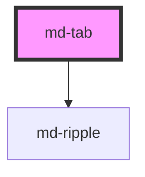

# md-tab

<!-- llm:meta
tag: md-tab
category: navigation
status: sub-component
parent: md-tabs
standalone: false
m3-guidelines: https://m3.material.io/components/tabs/guidelines
form-associated: false
depends-on: md-ripple
used-by: none
-->

**One tab in a `md-tabs` strip.** A label and/or icon, an optional badge, and
the active indicator that `md-tabs` glides between tabs.

> 🧩 **Sub-component.** Only valid inside `md-tabs`, which owns the active
> index, the roving tab stop, the `variant` and the indicator animation.

---

## When to use

- One category within a `md-tabs` strip. `md-tabs` is the only valid parent —
  it is what makes the tab focusable, selectable and animated.

## When NOT to use

| Situation | Use instead |
|---|---|
| A navigation destination | `md-navigation-tab` / `md-navigation-rail-tab` |
| A step in a flow | `md-step` |
| A mode/value toggle | `md-segmented-button` |
| A menu row | `md-menu-item` |
| A standalone button | `md-button` |

## Decision cues

| Need | Setting |
|---|---|
| Text tab | `label` |
| Icon above the label | `icon` (Material Symbols name) |
| Icon beside the label | `icon` + `inline-icon` |
| Your own glyph or SVG | the `icon` slot, present in the initial markup |
| Count on the tab | `badge="3"` |
| A plain dot, no number | `badge=""` |
| Link the tab to its panel | `controls="<panel id>"` |
| Compact tab | `density="-1…-4"` |

## API contract

```html
<md-tabs aria-label="Sections">
  <md-tab
    label="Activity"          <!-- default: '' -->
    icon="history"            <!-- default: '' -->
    inline-icon               <!-- default: absent (icon stacks above the label) -->
    badge="3"                 <!-- default: absent; badge="" renders a dot -->
    controls="panel-activity" <!-- default: '' -->
    disabled                  <!-- default: absent -->
    density="-1|-2|-3|-4"     <!-- default: 0 — the uncompacted rung, which is inert -->
  ></md-tab>
</md-tabs>
```

**Events** — `mdTabClick` (`CustomEvent<void>`, bubbles and composed) —
**internal**; application code listens to the strip's `mdTabChange` instead.

**Methods** — none.

**Slots** — `icon` (replaces the built-in glyph), `badge` (replaces the
built-in badge). Default-slot text is **not** rendered — the label is the
`label` prop.

**Parts** — `content`, `icon`, `label`, `indicator`, `divider`, `state-layer`.

**Parent-managed props — never set these by hand:** `active` and `variant`.
`md-tabs` writes both, plus `tabindex` and `id`, on every child tab.

### Behavioral contract worth knowing

- `active` is **managed by `md-tabs`** through its `active-tab-index`. Setting
  it by hand puts two writers on the indicator and desyncs the strip.
- `variant` is **stamped onto every tab by the strip** on slot change and
  whenever the strip's own `variant` changes. Set it on `md-tabs`, not here.
- Only the `primary` variant renders the indicator under the icon/label
  cluster; `secondary` renders it as a full-width bar along the tab's bottom
  edge. Both animate via the parent's glide.
- `controls` takes the **panel's `id`** and becomes `aria-controls`; both must
  live in the same DOM scope, since IDREFs can't cross shadow boundaries.
  `md-tab-panels` sets it for you when you leave it off.
- `mdTabClick` has no payload and is the low-level signal, emitted on click and
  on `Enter` / `Space`. The strip's `mdTabChange` (`{ index, previousIndex }`)
  is what application code should use.
- The `icon` slot is only rendered when the tab already has an icon — i.e. the
  `icon` prop is set, or a `[slot="icon"]` child was present in the initial
  markup. **Appending a slotted icon later to a tab with no `icon` prop will
  not appear.**
- The `badge` slot renders over the icon when there is one, and inline after
  the label when there isn't. A badge on a tab with neither icon nor label
  renders nothing.
- `disabled` sets `pointer-events: none` and `aria-disabled`, and tells the
  strip to re-rove so the tab never holds the tab stop.
- In development builds an icon-bearing tab with no accessible name (no
  `label`, `aria-label`, `aria-labelledby` or `title`) logs a console warning.
- Unlike `md-tabs`, this component **does** have a `density` prop.

---

## Do / Don't

Sourced from [M3 · Tabs · Guidelines](https://m3.material.io/components/tabs/guidelines).

| ✅ Do | ❌ Don't |
|---|---|
| Keep labels short enough not to truncate | Don't truncate unless forced — it impedes comprehension |
| Use the same anatomy on every tab in the set | Don't mix icon+text tabs with text-only or icon-only tabs |
| Use globally recognised icons for icon-only tabs | Don't use ambiguous glyphs without a label |
| Give icon-only tabs an accessible name | Don't ship a nameless tab |
| Use `badge` for a meaningful count | Don't decorate tabs with badges that never change |
| Let the strip own `active` and `variant` | Don't hand-manage selection per tab |
| Keep one anatomy and one variant across a strip | Don't mix primary and secondary in one strip |

## Patterns

```html
<!-- Text tabs, one with a count -->
<md-tabs aria-label="Sections">
  <md-tab label="Overview" controls="p1"></md-tab>
  <md-tab label="Activity" controls="p2" badge="3"></md-tab>
</md-tabs>

<!-- Icon above label, consistently across the set -->
<md-tabs aria-label="Library">
  <md-tab label="Songs"  icon="music_note"></md-tab>
  <md-tab label="Albums" icon="album"></md-tab>
</md-tabs>

<!-- Icon beside label -->
<md-tabs aria-label="Filters">
  <md-tab label="Starred" icon="star" inline-icon></md-tab>
  <md-tab label="Recent"  icon="schedule" inline-icon></md-tab>
</md-tabs>

<!-- Icon-only: name every tab -->
<md-tabs aria-label="View mode">
  <md-tab icon="grid_view" aria-label="Grid"></md-tab>
  <md-tab icon="view_list" aria-label="List"></md-tab>
</md-tabs>
```

```html
<!-- Custom glyph and badge. Both must be in the initial markup. -->
<md-tabs aria-label="Mail">
  <md-tab label="Inbox">
    <span slot="icon" class="material-symbols-outlined">inbox</span>
    <md-badge slot="badge" value="12"></md-badge>
  </md-tab>
  <md-tab label="Sent" icon="send"></md-tab>
</md-tabs>
```

```html
<!-- Application logic listens to the STRIP, never to md-tab -->
<md-tabs id="strip" aria-label="Sections">
  <md-tab label="Overview"></md-tab>
  <md-tab label="Activity"></md-tab>
</md-tabs>

<script type="module">
  document.getElementById('strip')
    .addEventListener('mdTabChange', (e) => console.log(e.detail.index));
</script>
```

## Anti-patterns

| ❌ Wrong | ✅ Right | Why |
|---|---|---|
| Setting `active` on tabs directly | Use the strip's `active-tab-index` / `selectTab()` | Two sources of truth desync the indicator. |
| Setting `variant` on each tab | Set it on `md-tabs` | The strip overwrites the child's `variant`. |
| Listening to `mdTabClick` for app logic | Use the strip's `mdTabChange` | It's the internal signal, with no payload. |
| Putting the label as slotted text | Use the `label` prop | There is no default slot; the text would never render. |
| `controls` pointing across a shadow boundary | Keep tab and panel in one scope | IDREFs don't cross. |
| Adding a `[slot="icon"]` child after first render, with no `icon` prop | Ship the slotted icon in the initial markup | The icon slot isn't rendered, so it can never assign. |
| Icon-only tab with no `aria-label` | Add one | No accessible name otherwise (dev builds warn). |
| Mixed anatomy across the strip | Pick one and apply it to all | M3 explicit rule. |
| `md-tab` outside `md-tabs` | Nest it | No roving focus, no selection, no indicator. |
| Long labels relying on truncation | Shorten them | M3 explicit rule. |
| Writing `--md-tab-glide-x` / `--md-tab-glide-scale` yourself | Leave them alone | `md-tabs` sets and clears them per transition. |

## Accessibility, RTL, density, i18n

**Accessibility**
- The host carries `role="tab"`, `aria-selected` tracking `active`, and
  `aria-disabled` when `disabled`. The parent strip provides the tablist
  semantics and the roving tab stop; each tab is one stop within it.
- `label` is the accessible name; icon-only tabs need `aria-label` (dev builds
  log a warning when one is missing).
- `controls` exposes the tab→panel relationship — set it, or let
  `md-tab-panels` assign it.
- `disabled` keeps the tab announced but unselectable; prefer it to removing a
  tab when users should know the section exists.
- A `badge` is decorative to the label — if the count matters, put it in the
  tab's accessible name too.
- Focus ring: 3px `secondary`, inset by 3px. Under `forced-colors` the
  indicator uses `SelectedItem` and the active label is underlined.

**RTL** — the tab's box metrics use logical properties, so the icon side, badge
side and divider mirror automatically. Arrow-key direction is handled by the
strip.

**Density** — `density="-1…-4"` compacts the tab (height, min-width, padding,
icon and label size); set it here, not on the strip. Only those four rungs
exist. Rung `0` is the uncompacted default and is inert — `density="0"` does
**not** opt the tab out of an ancestor's `data-density` rung; use
`style="--md-sys-density-scale: 0"` for that (the ancestor's
`--md-sys-spacing-*` payload still inherits).

**i18n** — translate `label` and any `aria-label`. Long translations ellipsize
rather than widening a fixed track, so re-check per locale.

## Related components

`md-tabs` · `md-tab-panels` · `md-tab-panel` · `md-navigation-tab` ·
`md-segmented-button` · `md-badge` · `md-ripple`

## Theming

| Custom property | Purpose | Default |
|---|---|---|
| `--md-tab-container-color` | Tab background | `transparent` |
| `--md-tab-active-label-color` | Active label colour | `--md-sys-color-primary`; `--md-sys-color-on-surface` for `secondary` |
| `--md-tab-inactive-label-color` | Inactive label colour | `--md-sys-color-on-surface-variant` |
| `--md-tab-active-icon-color` | Active icon colour | `--md-sys-color-primary` |
| `--md-tab-inactive-icon-color` | Inactive icon colour | `--md-sys-color-on-surface-variant` |
| `--md-tab-active-indicator-color` | Indicator bar colour | `--md-sys-color-primary` |
| `--md-tab-active-indicator-height` | Indicator bar thickness | `3px`; `2px` for `secondary` |
| `--md-tab-divider-color` | Bottom divider colour | `--md-tabs-divider-color`, then `--md-sys-color-outline-variant` |
| `--md-tab-glide-duration` | Indicator glide duration | `--md-sys-motion-duration-medium4` (400ms) |

`--md-tab-glide-x` and `--md-tab-glide-scale` are also read by the stylesheet,
but `md-tabs` writes and clears them per transition — treat them as internal.

**CSS parts** — `content`, `icon`, `label`, `indicator`, `divider`,
`state-layer`. Note that `::part(icon)` matches only the built-in glyph; a
slotted icon replaces it.

```css
md-tab {
  --md-tab-active-indicator-height: 2px;
  --md-tab-inactive-label-color: var(--md-sys-color-outline);
}
```

<!-- Auto Generated Below -->


## Properties

| Property     | Attribute     | Description                                                                                                                                                                                           | Type                        | Default     |
| ------------ | ------------- | ----------------------------------------------------------------------------------------------------------------------------------------------------------------------------------------------------- | --------------------------- | ----------- |
| `active`     | `active`      | Whether this tab is the active / selected tab                                                                                                                                                         | `boolean`                   | `false`     |
| `badge`      | `badge`       | Optional badge text (empty string = dot badge)                                                                                                                                                        | `string \| undefined`       | `undefined` |
| `controls`   | `controls`    | ID of the associated tabpanel (sets `aria-controls`)                                                                                                                                                  | `string`                    | `''`        |
| `density`    | `density`     | Local density rung. Drives the same `--md-sys-density-scale` signal that a global `data-density` ancestor sets, so a local value simply overrides the inherited one. 0 = default, -4 = ultra-compact. | `-1 \| -2 \| -3 \| -4 \| 0` | `0`         |
| `disabled`   | `disabled`    | Prevents interaction                                                                                                                                                                                  | `boolean`                   | `false`     |
| `icon`       | `icon`        | Material Symbols icon name (or use the `icon` slot for custom icons)                                                                                                                                  | `string`                    | `''`        |
| `inlineIcon` | `inline-icon` | Display icon and label side-by-side instead of stacked                                                                                                                                                | `boolean`                   | `false`     |
| `label`      | `label`       | Tab label text                                                                                                                                                                                        | `string`                    | `''`        |
| `variant`    | `variant`     | Visual variant — set automatically by parent `md-tabs`                                                                                                                                                | `"primary" \| "secondary"`  | `'primary'` |


## Events

| Event        | Description                                          | Type                |
| ------------ | ---------------------------------------------------- | ------------------- |
| `mdTabClick` | Emits when the tab is activated by click or keyboard | `CustomEvent<void>` |


## Slots

| Slot      | Description                                 |
| --------- | ------------------------------------------- |
| `"badge"` | Badge overlay on the icon                   |
| `"icon"`  | Custom leading icon (overrides `icon` prop) |


## Shadow Parts

| Part            | Description                          |
| --------------- | ------------------------------------ |
| `"content"`     | Inner content wrapper (icon + label) |
| `"divider"`     | Bottom divider line                  |
| `"icon"`        | Icon element                         |
| `"indicator"`   | Active indicator bar                 |
| `"label"`       | Label text element                   |
| `"state-layer"` | Hover / focus / press overlay        |


## Dependencies

### Depends on

- [md-ripple](../md-ripple)

### Graph


----------------------------------------------

*Built with [StencilJS](https://stenciljs.com/)*
