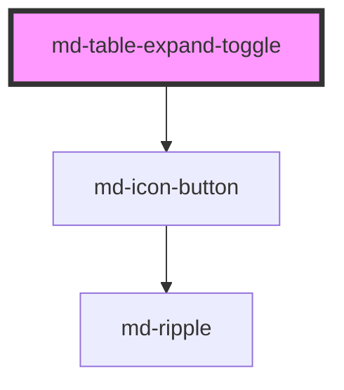

# md-table-expand-toggle

<!-- llm:meta
tag: md-table-expand-toggle
category: data
status: sub-component
parent: md-table-row
standalone: false
m3-guidelines: none — M3 has no data-table page
form-associated: false
depends-on: md-icon-button
used-by: none
-->

**The chevron that expands a table row.** A stateless wrapper around an
`md-icon-button` that finds its owning `md-table-row`, toggles it on click, and
rotates with the row's `expanded` state.

> 🧩 **Sub-component.** Belongs in a **cell** of an `expandable` `md-table-row`.

---

## When to use

- The expand affordance for an `expandable` `md-table-row`, usually inside the
  row's first cell.

## When NOT to use

| Situation | Use instead |
|---|---|
| A general icon action | `md-icon-button` |
| An accordion header | `md-accordion-item` |
| A submenu affordance | `md-sub-menu-item` |
| A list row that expands | `md-list-item expandable` |

## API contract

```html
<md-table-row expandable value="inv-1">
  <md-table-cell padding="checkbox">
    <md-table-expand-toggle
      button-label="Expand row"   <!-- default: "Expand row" -->
      icon="chevron_right"        <!-- default: chevron_right -->
    ></md-table-expand-toggle>
  </md-table-cell>
  <md-table-cell>Acme Corporation</md-table-cell>
  <div slot="expanded">Line items…</div>
</md-table-row>
```

**Events** — none of its own; the owning row emits `mdRowExpandedChange`
`{ expanded }`.

**Methods** — none; call `row.toggle()` on the `md-table-row` instead.

**Slots** — none (it renders no `<slot>`; the caret is internal).

**Parts** — none. The internal `md-icon-button` is not exported, so
`::part()` cannot reach it — restyle it with the `--md-icon-button-*` custom
properties on the host instead.

### Behavioral contract worth knowing

- **It holds no state.** On connect it walks `closest('md-table-row')`, mirrors
  that row's `expanded` for the caret rotation, and subscribes to the row's
  `mdRowExpandedChange`. Read and write expansion on the **row**.
- Clicking calls `row.toggle()`, which is a **no-op unless the row has
  `expandable`** — a toggle in a plain row renders but does nothing.
- The click is stopped at the toggle, so it never becomes a row click or a
  selection change.
- It must live **inside a cell**, never as a bare child of the row: rows are
  subgrid containers, so any extra direct child consumes a column track.
- Re-binding happens on every connect, so the `appendChild` reorder pattern
  (sorting, paging) leaves the toggle working.
- The caret **rotates rather than swaps** — `--md-table-expand-toggle-rotation`
  (default `90deg`) is applied while expanded, on the MD3 spatial spring. Pick a
  glyph that points "collapsed" at rest, like the default `chevron_right`.
- It has **no `density` prop**: the button is a fixed `xs` (32px) size that
  fits every row density.

---

## Do / Don't

House rules — M3 has no data-table guidelines page.

| ✅ Do | ❌ Don't |
|---|---|
| Put it in the row's first cell | Don't scatter expand affordances across columns |
| Give it a row-specific `button-label` | Don't leave every row labelled "Expand row" |
| Use a directional glyph | Don't use a symmetric icon — rotation would look wrong |
| Listen for `mdRowExpandedChange` on the row | Don't try to read state from the toggle |
| Use `padding="checkbox"` on its cell | Don't leave full padding around a small control |
| Localize `button-label` | Don't ship the English default |
| Keep detail in the row's `expanded` slot | Don't inject a sibling detail row |

## Patterns

```html
<md-table column-template="48px 2fr 1fr" label="Invoices">
  <md-table-body>
    <md-table-row expandable value="inv-1" id="r1">
      <md-table-cell padding="checkbox">
        <md-table-expand-toggle button-label="Expand invoice for Acme Corporation">
        </md-table-expand-toggle>
      </md-table-cell>
      <md-table-cell head scope="row">Acme Corporation</md-table-cell>
      <md-table-cell numeric>$1,200.00</md-table-cell>
      <div slot="expanded">3 line items, issued 12 May 2026</div>
    </md-table-row>
  </md-table-body>
</md-table>

<script type="module">
  // Expansion state lives on the ROW.
  const row = document.getElementById('r1');
  row.addEventListener('mdRowExpandedChange', (e) => {
    console.log('expanded:', e.detail.expanded);
  });

  // Programmatic open/close, also from the row:
  await customElements.whenDefined('md-table-row');
  await row.toggle();
</script>
```

```html
<!-- A different glyph, with a matching rotation. -->
<md-table-expand-toggle
  icon="expand_circle_right"
  style="--md-table-expand-toggle-rotation: 90deg"
></md-table-expand-toggle>

<!-- Localized -->
<md-table-expand-toggle button-label="Développer la ligne"></md-table-expand-toggle>
```

## Anti-patterns

| ❌ Wrong | ✅ Right | Why |
|---|---|---|
| Reading expanded state from the toggle | Read the row's `expanded` | The toggle mirrors, it doesn't own. |
| `toggle.toggle()` | `row.toggle()` | The method is on `md-table-row`. |
| Every row labelled "Expand row" | Include the row's subject in the label | Otherwise it's ambiguous across many rows. |
| A symmetric glyph (e.g. `add`) | A chevron | The component rotates the glyph, it doesn't swap it. |
| A toggle in a row without `expandable` | Set `expandable` on the row | `row.toggle()` returns early. |
| The toggle as a direct child of the row | Wrap it in an `md-table-cell` | Rows are grid containers — it would eat a column track. |
| Detail rendered as a sibling row | The row's `expanded` slot | Keeps the detail associated with its row. |
| Looking for a `density` prop | It has none | The button is a fixed 32px that suits every rung. |
| `::part()` on the inner button | `--md-icon-button-*` on the host | The internal button exports no parts. |
| Shipping the English default label | Translate `button-label` | It's the toggle's only accessible name. |

## Accessibility, RTL, density, i18n

**Accessibility** — the internal `md-icon-button` carries the `aria-label` from
`button-label` and an `aria-expanded` that tracks the row. The **most common
defect** is leaving the label at its default, so a screen-reader user hears
"Expand row" twenty times with no idea which row — include the row's
identifying value. There is no `aria-controls` (the detail zone lives in the
row's shadow root, which an IDREF cannot cross), so keep the detail in the
row's `expanded` slot where it follows its row in the reading order.

**RTL** — the glyph is **not** mirrored automatically: `chevron_right` still
points right under `dir="rtl"`, and the expanded rotation is always the same
`90deg`. Set `icon="chevron_left"` for RTL layouts if you want the resting
caret mirrored.

**Density** — none of its own; it renders a fixed `xs` (32px) icon button that
fits every row density.

**i18n** — translate `button-label`, per row.

## Related components

`md-table-row` · `md-table-cell` · `md-table` · `md-icon-button` ·
`md-list-item` · `md-accordion-item`

## Theming

| Custom property | Purpose | Default |
|---|---|---|
| `--md-table-expand-toggle-rotation` | Rotation applied while expanded | `90deg` |

The caret's own appearance comes from the internal `md-icon-button`, so set the
`--md-icon-button-*` properties on this host — they inherit through the shadow
boundary.

```css
md-table-expand-toggle {
  --md-icon-button-icon-color: var(--md-sys-color-on-surface-variant);
  --md-table-expand-toggle-rotation: 180deg;
}
```

<!-- Auto Generated Below -->


## Overview

Material Design 3 — Table Expand Toggle.

The STANDARD expand caret for an expandable `<md-table-row>`: one consistent
size (xs / 32px — fits every density incl. compact rows, matching the 32px
checkbox precedent), a chevron that rotates 90° on the spatial spring when
the row opens, wired click→row.toggle() and aria-expanded out of the box.

Slot it INSIDE a cell of the expandable row (never as a bare row child —
rows are subgrid containers where any extra child would consume a column
track):

```html
<md-table-row expandable>
  <md-table-cell padding="checkbox"><md-table-expand-toggle></md-table-expand-toggle></md-table-cell>
  <md-table-cell>…</md-table-cell>
  <div slot="expanded">Details…</div>
</md-table-row>
```

## Properties

| Property      | Attribute      | Description                                                                                                                                                                                                                                                   | Type     | Default           |
| ------------- | -------------- | ------------------------------------------------------------------------------------------------------------------------------------------------------------------------------------------------------------------------------------------------------------- | -------- | ----------------- |
| `buttonLabel` | `button-label` | Accessible label of the toggle button.                                                                                                                                                                                                                        | `string` | `'Expand row'`    |
| `icon`        | `icon`         | Caret icon (Material Symbols ligature). The expanded rotation still applies (--md-table-expand-toggle-rotation, default 90deg) — pick a "collapsed-pointing" glyph like the default chevron_right, or pair e.g. "expand_circle_right" with a custom rotation. | `string` | `'chevron_right'` |


## Dependencies

### Depends on

- [md-icon-button](../md-icon-button)

### Graph


----------------------------------------------

*Built with [StencilJS](https://stenciljs.com/)*
