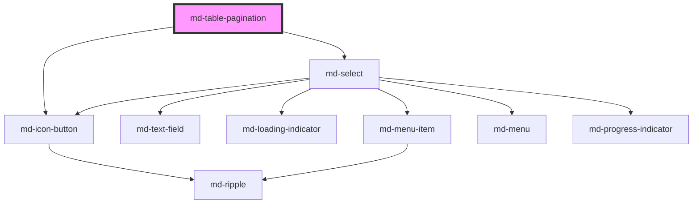

# md-table-pagination

<!-- llm:meta
tag: md-table-pagination
category: data
status: sub-component
parent: md-table-container
standalone: false
m3-guidelines: none — M3 has no data-table page
form-associated: false
depends-on: md-select, md-icon-button
used-by: none
-->

**The page controls under a table.** A "1–10 of 120" readout, a rows-per-page
selector and previous/next (optionally first/last) navigation. It reports
intent through events — it never slices your data.

> 🧩 **Sub-component.** Goes in `md-table-container`'s `bottom` slot so it stays
> put while the table scrolls.

---

## When to use

- Paging a table — client-side or server-side.
- Letting the user change how many rows are shown.

## When NOT to use

| Situation | Use instead |
|---|---|
| Infinite scroll | Load-on-scroll, no pagination |
| Fewer rows than one page | Nothing |
| Paging a list of cards | Your own control |
| Filtering | `md-table-toolbar` actions |
| A "Load more" button | `md-button` |

## Decision cues

| Need | Setting |
|---|---|
| Jump to first/last | `show-first-last` |
| Custom page sizes | `rows-per-page-options="10,25,100"` |
| An "All" option | put `all` in the list: `rows-per-page-options="10,25,all"` |
| Narrow layouts | `compact` |
| Freeze the bar during a fetch | `disabled` |
| Extra controls beside the arrows | the `actions` slot |

## API contract

```html
<md-table-container>
  <md-table label="Invoices"></md-table>
  <md-table-pagination
    slot="bottom"
    count="120"                          <!-- default: 0 -->
    page="0"                             <!-- default: 0 (zero-based) -->
    rows-per-page="10"                   <!-- default: 10 -->
    rows-per-page-options="5,10,25,50"   <!-- default: "5,10,25,50" -->
    show-first-last                      <!-- default: false -->
    compact                              <!-- default: false -->
    disabled                             <!-- default: false -->
    label-displayed-rows="%from%–%to% of %count%"   <!-- default: same -->
    label-rows-per-page="Rows per page:" <!-- default: same -->
    label-first-page="First page"        <!-- default: same -->
    label-previous-page="Previous page"  <!-- default: same -->
    label-next-page="Next page"          <!-- default: same -->
    label-last-page="Last page"          <!-- default: same -->
    label-all="All"                      <!-- default: "All" -->
    density="-1|-2|-3|-4"                <!-- default: 0 = no local rung -->
  ></md-table-pagination>
</md-table-container>
```

**Events** — `mdPageChange` `{ page }` and `mdRowsPerPageChange`
`{ rowsPerPage }`. Both bubble and are composed.

**Methods** — `goToPage(page: number)` (clamped to `0…lastPage`; a no-op and
silent when the page is unchanged) and `setRowsPerPage(rpp: number)` (a no-op
for values `<= 0` or unchanged; otherwise resets `page` to 0 and emits **both**
events).

**Slots** — `actions`: extra controls appended after the navigation buttons.

**Parts** — `display`, `rpp`, `rpp-select`, `nav`, `first-button`,
`prev-button`, `next-button`, `last-button`.

### Behavioral contract worth knowing

- **`page` is zero-based.** The first page is `page="0"`; the readout shows
  `1–10`.
- **It doesn't slice your data.** It reports intent; you re-render the rows and
  keep `count`, `page` and `rows-per-page` truthful.
- **Changing rows-per-page resets `page` to 0 for you** and emits
  `mdRowsPerPageChange` *then* `mdPageChange` with `{ page: 0 }`. Don't reset it
  again in the handler — read the new size off the event and fetch page 0.
- `page` and `rows-per-page` are **mutable and reflected**: the component
  writes them back to the attribute when the user navigates.
- Whenever `count` or `rows-per-page` changes, `page` is **clamped** down to the
  new last page. Shrinking a filtered dataset can therefore move `page` on its
  own — read it back rather than assuming.
- `rows-per-page-options` is a **comma-separated string attribute**, not an
  array. Entries that aren't positive numbers are dropped. The literal `all`
  (case-insensitive) becomes an option whose value is the current `count` —
  and it disappears entirely while `count` is 0.
- **`label-displayed-rows` uses `%from%`, `%to%` and `%count%`** — percent
  tokens, matching `md-table-toolbar` and *unlike* the `{…}` tokens used
  elsewhere in the library. All three are replaced once, in that order.
- **Internal chrome events are swallowed.** The `mdClick`, `mdChange`, `mdOpen`
  and `mdClose` events of the internal `md-icon-button`s and `md-select` are
  stopped at the host, so a delegated app-level listener sees only
  `mdPageChange` / `mdRowsPerPageChange`.
- Inside an `md-table-container`, both events are also heard by the container
  in the capture phase, which arms the table's row-reorder animation — so a
  **synchronous** re-render in your handler animates for free.
- `disabled` dims the bar and sets `pointer-events: none`, and also disables the
  rows-per-page `md-select`.

---

## Do / Don't

House rules — M3 has no data-table guidelines page.

| ✅ Do | ❌ Don't |
|---|---|
| Keep `count`, `page` and `rows-per-page` in sync with your data | Don't let the readout drift from what's shown |
| Read `page` back after changing `count` | Don't assume the page survived a shrinking dataset |
| Use `disabled` while a page is loading | Don't let users queue up page changes mid-fetch |
| Offer `show-first-last` for large datasets | Don't make users click next twenty times |
| Keep `%from%` / `%to%` / `%count%` when translating | Don't drop the tokens |
| Put it in the container's `bottom` slot | Don't let it scroll with the rows |
| Give sensible `rows-per-page-options` | Don't offer 1000 rows per page |
| Localize every label | Don't ship the English defaults |

## Patterns

```html
<md-table-container>
  <md-table id="grid" label="Invoices" column-template="2fr 1fr">
    <md-table-body id="rows"></md-table-body>
  </md-table>
  <md-table-pagination
    id="pager" slot="bottom"
    count="120" rows-per-page="25" rows-per-page-options="10,25,50,all"
    show-first-last
  ></md-table-pagination>
</md-table-container>

<script type="module">
  const pager = document.getElementById('pager');
  const rows = document.getElementById('rows');

  const DATA = Array.from({ length: 120 }, (_, i) => ({
    name: `Customer ${i + 1}`,
    amount: (i + 1) * 100,
  }));

  function renderPage() {
    const start = pager.page * pager.rowsPerPage;
    rows.innerHTML = DATA.slice(start, start + pager.rowsPerPage)
      .map((r) => `<md-table-row><md-table-cell>${r.name}</md-table-cell>` +
                  `<md-table-cell numeric>${r.amount}</md-table-cell></md-table-row>`)
      .join('');
  }

  // Both handlers run synchronously, so the container's row animation applies.
  pager.addEventListener('mdPageChange', renderPage);
  pager.addEventListener('mdRowsPerPageChange', renderPage);

  renderPage();
</script>
```

```html
<!-- Server-side paging: disable while the request is in flight. -->
<md-table-pagination id="remote" slot="bottom" count="0" rows-per-page="25"></md-table-pagination>

<script type="module">
  const remote = document.getElementById('remote');

  async function load() {
    remote.disabled = true;
    try {
      const res = await fetch(`/api/rows?page=${remote.page}&size=${remote.rowsPerPage}`);
      const { total } = await res.json();
      remote.count = total;             // may clamp `page` down
    } finally {
      remote.disabled = false;
    }
  }

  remote.addEventListener('mdPageChange', load);
  remote.addEventListener('mdRowsPerPageChange', load);
</script>
```

```html
<!-- Localized -->
<md-table-pagination
  label-displayed-rows="%from%–%to% sur %count%"
  label-rows-per-page="Lignes par page :"
  label-first-page="Première page"
  label-previous-page="Page précédente"
  label-next-page="Page suivante"
  label-last-page="Dernière page"
  label-all="Toutes"
></md-table-pagination>
```

## Anti-patterns

| ❌ Wrong | ✅ Right | Why |
|---|---|---|
| Treating `page` as one-based | It's zero-based | Off-by-one in every fetch. |
| Expecting it to slice the data | Re-render in `mdPageChange` | It's a control, not a data source. |
| `el.rowsPerPageOptions = [10, 25]` | `rows-per-page-options="10,25"` | It's a comma-separated string, not an array. |
| `rows-per-page-options="10,25,-1"` for "All" | `rows-per-page-options="10,25,all"` | Non-positive entries are dropped; `all` maps to `count`. |
| `{count}` in `label-displayed-rows` | `%count%` | This component uses percent tokens. |
| Resetting `page = 0` inside `mdRowsPerPageChange` | Just fetch page 0 | The component already reset it and emitted `mdPageChange`. |
| Listening for the inner `md-select`'s `mdChange` | Listen for `mdRowsPerPageChange` | Internal chrome events are stopped at the host. |
| Leaving it enabled during a fetch | Set `disabled` | Users queue conflicting page changes. |
| Placing it in the container's default slot | `slot="bottom"` | It would scroll away with the rows. |
| Shipping the English labels | Translate them all | The icon buttons have no other accessible name. |

## Accessibility, RTL, density, i18n

**Accessibility** — the host is a `role="navigation"` landmark whose
`aria-label` is the fixed string `Pagination`. The four navigation buttons are
icon-only, so `label-first-page`, `label-previous-page`, `label-next-page` and
`label-last-page` are their **only** accessible names — untranslated, they are
English buttons in a translated app. The range readout sits in an
`aria-live="polite"` region, so the new range is announced after a page change;
still consider moving focus sensibly, since the table body swaps silently.
Disable the controls during a fetch so the announced state stays truthful.

**RTL** — the bar is laid out with logical properties, and the chevron buttons
are mirrored under `dir="rtl"`.

**Density** — `density="-1…-4"` locally overrides the inherited `data-density`
rung (rung 0 is the uncompacted default and has no rule of its own); padding,
gaps, type and the nav buttons all derive from that one signal. `compact` is a
separate switch that forces a 12px gap and 4px block padding. The rows-per-page
`md-select` is always rendered at rung -2 or tighter, whatever the bar's rung.

**i18n** — translate all seven label props; keep `%from%`, `%to%` and
`%count%` in `label-displayed-rows`. The `Pagination` landmark name **cannot be
overridden**: `render()` writes `aria-label="Pagination"` onto the host on every
render, so an author-set `aria-label` survives the first paint and is then
rewritten back to English the first time the user changes page or rows-per-page.
Put your translation effort into the label props — they name the controls a
screen-reader user actually operates.

## Related components

`md-table` · `md-table-container` · `md-table-toolbar` · `md-select` ·
`md-icon-button`

## Theming

| Custom property | Purpose | Default |
|---|---|---|
| `--md-table-pagination-color` | Foreground | `--md-sys-color-on-surface-variant` |
| `--md-table-pagination-bg` | Background | `transparent` |
| `--md-table-pagination-padding-block` | Vertical padding (ignored while `compact`) | `--md-sys-spacing-inset-sm` (8px) |
| `--md-table-pagination-select-width` | Rows-per-page select width | `80px`, tightening with the density rung |

**CSS parts** — `display`, `rpp`, `rpp-select`, `nav`, `first-button`,
`prev-button`, `next-button`, `last-button`.

```css
md-table-pagination.on-container {
  --md-table-pagination-bg: var(--md-sys-color-surface-container);
  --md-table-pagination-select-width: 96px;
}
```

<!-- Auto Generated Below -->


## Overview

Material Design 3 — Table Pagination.

Drop into a `<md-table-container slot="bottom">` for a complete data table.
Mirrors the MUI `<TablePagination>` API surface. Built from house
primitives: `md-icon-button` navigation and an `md-select` rows-per-page
picker (proper dismissal, keyboard support and theming for free).

Emits:
  - `mdPageChange` — when the page changes
  - `mdRowsPerPageChange` — when the rows-per-page selector changes

## Properties

| Property             | Attribute               | Description                                                                                                                                                                                           | Type                        | Default                    |
| -------------------- | ----------------------- | ----------------------------------------------------------------------------------------------------------------------------------------------------------------------------------------------------- | --------------------------- | -------------------------- |
| `compact`            | `compact`               | Compact pagination layout (good for embedding inside cards).                                                                                                                                          | `boolean`                   | `false`                    |
| `count`              | `count`                 | Total number of rows in the dataset.                                                                                                                                                                  | `number`                    | `0`                        |
| `density`            | `density`               | Local density rung. Drives the same `--md-sys-density-scale` signal that a global `data-density` ancestor sets, so a local value simply overrides the inherited one. 0 = default, -4 = ultra-compact. | `-1 \| -2 \| -3 \| -4 \| 0` | `0`                        |
| `disabled`           | `disabled`              | Disabled state.                                                                                                                                                                                       | `boolean`                   | `false`                    |
| `labelAll`           | `label-all`             | Label of the "All" rows-per-page option.                                                                                                                                                              | `string`                    | `'All'`                    |
| `labelDisplayedRows` | `label-displayed-rows`  | Custom label used to display the current row range (e.g. `"Showing %from%–%to% of %count%"`). Tokens: `%from%`, `%to%`, `%count%`.                                                                    | `string`                    | `'%from%–%to% of %count%'` |
| `labelFirstPage`     | `label-first-page`      | Accessible label for the first-page button.                                                                                                                                                           | `string`                    | `'First page'`             |
| `labelLastPage`      | `label-last-page`       | Accessible label for the last-page button.                                                                                                                                                            | `string`                    | `'Last page'`              |
| `labelNextPage`      | `label-next-page`       | Accessible label for the next-page button.                                                                                                                                                            | `string`                    | `'Next page'`              |
| `labelPreviousPage`  | `label-previous-page`   | Accessible label for the previous-page button.                                                                                                                                                        | `string`                    | `'Previous page'`          |
| `labelRowsPerPage`   | `label-rows-per-page`   | Label for the rows-per-page selector.                                                                                                                                                                 | `string`                    | `'Rows per page:'`         |
| `page`               | `page`                  | Current zero-based page.                                                                                                                                                                              | `number`                    | `0`                        |
| `rowsPerPage`        | `rows-per-page`         | Rows shown per page.                                                                                                                                                                                  | `number`                    | `10`                       |
| `rowsPerPageOptions` | `rows-per-page-options` | Comma-separated list of options for the rows-per-page selector (e.g. `"5,10,25,50"`). Use `"all"` (case-insensitive) to add an "All" option that maps to the total count.                             | `string`                    | `'5,10,25,50'`             |
| `showFirstLast`      | `show-first-last`       | Show the first / last page buttons.                                                                                                                                                                   | `boolean`                   | `false`                    |


## Events

| Event                 | Description                                | Type                                    |
| --------------------- | ------------------------------------------ | --------------------------------------- |
| `mdPageChange`        | Fired when the user changes the page.      | `CustomEvent<{ page: number; }>`        |
| `mdRowsPerPageChange` | Fired when the user changes rows-per-page. | `CustomEvent<{ rowsPerPage: number; }>` |


## Methods

### `goToPage(page: number) => Promise<void>`

Programmatically jump to a page.

#### Parameters

| Name   | Type     | Description |
| ------ | -------- | ----------- |
| `page` | `number` |             |

#### Returns

Type: `Promise<void>`


### `setRowsPerPage(rpp: number) => Promise<void>`

Programmatically set rows-per-page.

#### Parameters

| Name  | Type     | Description |
| ----- | -------- | ----------- |
| `rpp` | `number` |             |

#### Returns

Type: `Promise<void>`


## Slots

| Slot        | Description                                                                                       |
| ----------- | ------------------------------------------------------------------------------------------------- |
| `"actions"` | Custom pagination actions appended after the nav buttons           (MUI ActionsComponent parity). |


## Shadow Parts

| Part             | Description |
| ---------------- | ----------- |
| `"display"`      |             |
| `"first-button"` |             |
| `"last-button"`  |             |
| `"nav"`          |             |
| `"next-button"`  |             |
| `"prev-button"`  |             |
| `"rpp"`          |             |
| `"rpp-select"`   |             |


## Dependencies

### Used by
### Depends on

- [md-select](../md-select)
- [md-icon-button](../md-icon-button)

### Graph


----------------------------------------------

*Built with [StencilJS](https://stenciljs.com/)*
