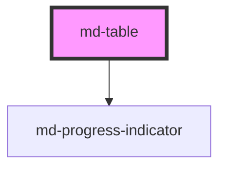

# md-table

<!-- llm:meta
tag: md-table
category: data
status: custom
m3-guidelines: none — M3 has no data-table page
m3-derived-from: https://m3.material.io/components/lists/guidelines
form-associated: false
depends-on: md-progress-indicator
used-by: none
accepts-children: md-table-head, md-table-body, md-table-foot, md-table-row
-->

**The composable table primitive.** You author every row; the table owns the
CSS-Grid layout, sticky and frozen headers, column pinning and visibility,
sort and selection state, striping, expressive reorder motion, and the loading
and empty states.

> ⚠️ **Not a Material Design 3 component.** M3 has no data-table page, so the
> Do / Don't below is house rules derived from the M3 list guidance and the WAI
> table patterns.

> ⚠️ **Two table families exist in this library and they are separate
> implementations with separate CSS.** `md-table` is **hand-authored** — you
> write every row, and it never fetches, sorts or filters your data.

> Setup, theming, density and i18n are configured once for the whole library —
> see [`main-llm.md`](../../../../../main-llm.md) at the repo root.

---

## When to use

- A table whose rows you **compose by hand**: mixed content, embedded controls,
  bespoke cells, server-rendered markup.
- You need frozen headers, pinned columns, or column show/hide.
- You want selection, sorting affordances and reorder motion while keeping the
  data pipeline entirely yours.

## When NOT to use

| Situation | Use instead |
|---|---|
| A vertical list of records | `md-list` |
| Rich, self-contained items | `md-card` collection |
| Hierarchy / reporting lines | `md-organization-chart` |
| Comparing two values | Plain text |
| Layout (the old `<table>` misuse) | CSS Grid |

## Decision cues

| Need | Setting |
|---|---|
| Explicit column widths | `column-template` (a CSS `grid-template-columns` value) |
| Just a column count | `columns` (equal `1fr` tracks) |
| Header stays put inside the scroller | `sticky-header` + a bounded `md-table-container` |
| Header outside the scroll area, scrollbar on the body only | `frozen-header` |
| Column pinning or hiding | `column-template` (no `repeat()`) + `pinColumn()` / `setColumnVisibility()` |
| Several pinned columns all visible | `pin-mode="static"` |
| Zebra striping | `striped` |
| Row selection | `selection="single"` or `"multiple"` |
| Sorted state shown in the header | `sort-by` + `sort-order` (+ `md-table-sort-label`) |
| Loading | `loading` + `loading-mode="overlay"` or `"skeleton"` |
| Empty state | `empty` (+ the `empty` slot) |
| Row heights | `density="compact\|standard\|comfortable"`, or the numeric rungs `-1`…`-4` |
| Correct AT positions while paginating | `row-offset` + `row-count` |

## API contract

```html
<md-table-container max-height="60vh">
  <md-table
    column-template="2fr 1fr 1fr"          <!-- default: "" -->
    columns="0"                            <!-- default: 0 (derive from row 1) -->
    min-width="640px"                      <!-- default: "" -->
    density="compact|standard|comfortable" <!-- default: standard; also -1…-4 -->
    sticky-header                          <!-- default: false -->
    frozen-header                          <!-- default: false -->
    sticky-footer                          <!-- default: false -->
    keep-height="true"                     <!-- default: true -->
    scrollbar="overlay|gutter"             <!-- default: overlay (frozen mode) -->
    pin-mode="stack|static"                <!-- default: stack -->
    pin-icon=""                            <!-- default: "" (built-in push-pin) -->
    striped                                <!-- default: false -->
    no-dividers                            <!-- default: false -->
    hoverable                              <!-- default: true -->
    motion="expressive|none"               <!-- default: expressive -->
    selection="none|single|multiple"       <!-- default: none -->
    sort-by="name"                         <!-- default: "" -->
    sort-order="asc|desc|none"             <!-- default: asc -->
    loading                                <!-- default: false -->
    loading-mode="overlay|skeleton"        <!-- default: overlay -->
    loading-rows="4"                       <!-- default: 4 -->
    empty                                  <!-- default: false -->
    label="Invoices"                       <!-- default: "" -->
    caption=""                             <!-- default: "" -->
    summary=""                             <!-- default: "" -->
    row-offset="0"                         <!-- default: 0 -->
    row-count="0"                          <!-- default: 0 (use rendered count) -->
  >
    <md-table-head>
      <md-table-row rowgroup="head">
        <md-table-cell head scope="col">Client</md-table-cell>
        <md-table-cell head scope="col" numeric>Amount</md-table-cell>
        <md-table-cell head scope="col">Status</md-table-cell>
      </md-table-row>
    </md-table-head>
    <md-table-body>
      <md-table-row value="inv-1">
        <md-table-cell>Acme Corp</md-table-cell>
        <md-table-cell numeric>$1,200</md-table-cell>
        <md-table-cell>Paid</md-table-cell>
      </md-table-row>
    </md-table-body>
  </md-table>
</md-table-container>
```

**Events** (all bubble and cross shadow boundaries) —
`mdSortChange` `{ column, order }`,
`mdSelectionChange` `{ count, total, values, all, indeterminate }`,
`mdPinChange` `{ column, side }`,
`mdColumnVisibilityChange` `{ column, visible, hidden }`,
`mdScroll` `{ scrollLeft, scrollTop }` (frozen mode only, one per frame).

**Methods** (all async — `await` them) — `getSelection()`, `selectAll()`,
`deselectAll()`, `toggleSelectAll()`, `setSort(column, order)`,
`pinColumn(column, 'start' | 'end' | 'none')`,
`setColumnVisibility(column, visible)`, `animateNextChange()`.

**Slots** — the default slot takes the rowgroups (`md-table-head` /
`md-table-body` / `md-table-foot`) or bare rows; `empty` replaces the built-in
"No data" message; `loader` replaces the built-in progress line (`loading` is
the older alias for it). The `head` slot is **assigned by the table itself** in
`frozen-header` mode — never write `slot="head"` by hand.

**Parts** — `grid`, `header-grid`, `caption`, `empty`, `skeleton-row`,
`loading`, `progress`, `hscrollbar`, `hscrollbar-thumb`, `vscrollbar`,
`vscrollbar-thumb`.

### Behavioral contract worth knowing

- **The layout is CSS Grid, not a real `<table>`.** The shadow grid owns the
  tracks and every row is a real grid item that subgrids its cells onto them.
  The rowgroups are `display: contents`. Consequences: declare the tracks
  (`column-template` or `columns`, else they are derived from the first row's
  cell count), keep `md-table-cell` as the direct children of a row, and never
  wrap rows in your own element.
- **`md-table` sorts nothing and selects no data by itself.** `sort-by` /
  `sort-order` are display state, and `mdSortChange` is a *request* — you
  reorder the rows in the handler. Clicking an `md-table-sort-label` cycles that
  column: its `default-order`, then the opposite, then off (`sort-by` clears and
  `sort-order` resets to `asc`).
- **Selection checkboxes are auto-wired.** With `selection` set, an
  `md-checkbox` slotted into a body row toggles that row, and one slotted into
  `md-table-head` is the select-all. The table pushes the model back into
  those checkboxes (`checked`, `indeterminate`, `disabled`), so no wiring is
  needed — and adding your own handler is safe, because the table's side is
  declarative rather than a toggle.
- In `selection="single"` selecting a row deselects every other one, and the
  select-all checkbox is **disabled** — `selectAll()` is a no-op outside
  `selection="multiple"`. Head and foot rows never join the selection model.
- `mdSelectionChange` fires on user *and* programmatic selection changes, but
  **not** on first load; call `await table.getSelection()` for the initial
  snapshot.
- `sticky-header` keeps the header in the scroll region (bound the scroller with
  `md-table-container[max-height]`). **`frozen-header` is a different
  architecture**: the header gets its own grid outside the scroll area, the body
  becomes a focusable scroll region with custom always-visible scrollbars, and
  horizontal scroll is mirrored between the two. Size the frozen body with
  `md-table-container[max-height]` (it forwards the value) or the
  `--md-table-body-max-h` property. `mdScroll` and the `scrollbar` prop only
  apply in frozen mode.
- **`keep-height` is ON by default**: after the first render the table never
  shrinks below its initial height, so paging or filtering to fewer rows cannot
  make the page jump. Set `keep-height="false"` for a table that should resize.
- **`pinColumn()` and `setColumnVisibility()` have preconditions**: an explicit
  `column-template` **without `repeat()`**, no `colspan` cells, and every row
  carrying one cell per column. They warn to the console and no-op otherwise.
  Indexes are always the *original* column positions; the table re-sequences the
  cells, rewrites the host's `column-template` attribute, and keeps hidden cells
  in the DOM so their state survives. The last visible column cannot be hidden.
- `motion="expressive"` (the default) **already brackets sort and pagination**:
  the table FLIPs its rows around `mdSortChange`, and `md-table-container` arms
  it for a slotted `md-table-pagination`. Call `animateNextChange()` only for
  mutations of your own (filters, async refetch), immediately before the
  synchronous DOM change. `prefers-reduced-motion` always wins.
- `density` is **dual-typed** here: the semantic sizes `compact` / `standard` /
  `comfortable` (36 / 52 / 60px rows) *or* the numeric rungs `-1`…`-4` used by
  the rest of the library. `0` is accepted by the type but inert — it is the
  uncompacted default. The two combine: `density="compact"` inside a
  `data-density="-2"` region condenses further.
- `label`, `caption` and `summary` all feed accessibility: `aria-label` is
  `label` → `caption` → `"Data table"`, the caption is rendered visually but
  `aria-hidden` (so it is not announced twice), and `summary` becomes
  `aria-description`.
- The structural role **promotes from `table` to `treegrid`** as soon as any row
  carries `expandable`, because only a treegrid row may expose `aria-expanded`.
- The table stamps `rowgroup`, `data-stripe`, `data-sticky`, `data-last`,
  `data-adjacent-foot`, `aria-rowindex`, `aria-selected` and `aria-sort` onto
  your rows and cells on load and on every slot change. Don't write them
  yourself.
- `empty` swaps in the empty state and announces "No data" politely; `loading`
  sets `aria-busy`. `loading-mode="overlay"` dims the body under a progress
  line, `"skeleton"` replaces the body with `loading-rows` shimmer rows.

---

## Do / Don't

House rules, derived from
[M3 · Lists · Guidelines](https://m3.material.io/components/lists/guidelines)
and the WAI table patterns — M3 has no data-table page.

| ✅ Do | ❌ Don't |
|---|---|
| Declare `column-template` or `columns` | Don't rely on content to define the grid — only the first row's cell count is derived |
| Keep `md-table-row` / `md-table-cell` as the direct structure | Don't wrap rows in your own elements — `display: contents` depends on it |
| Give the table a `label` or `caption` | Don't ship an unnamed data grid |
| Use `md-table-cell head scope="col"` for headers | Don't style a body cell to look like a header |
| Reorder your own data in `mdSortChange` | Don't expect the table to sort |
| Use `numeric` on number cells | Don't left-align numbers |
| Use `frozen-header` or `sticky-header` for long tables | Don't make users scroll back for context |
| Use the `empty` slot for a real empty state | Don't render a zero-row table with no explanation |
| Set `row-offset` / `row-count` when paginating | Don't let AT announce "row 1 of 20" on page 5 |

---

## Patterns

```html
<!-- Sortable + selectable table with a toolbar and pagination -->
<md-table-container variant="outlined" max-height="60vh">
  <md-table-toolbar slot="top" headline="Invoices"></md-table-toolbar>

  <md-table id="invoices" column-template="auto 2fr 1fr 1fr" sticky-header striped
            selection="multiple" label="Invoices">
    <md-table-head>
      <md-table-row rowgroup="head">
        <md-table-cell head padding="checkbox"><md-checkbox></md-checkbox></md-table-cell>
        <md-table-cell head scope="col">
          <md-table-sort-label column="name">Client</md-table-sort-label>
        </md-table-cell>
        <md-table-cell head scope="col" numeric>
          <md-table-sort-label column="amount" default-order="desc">Amount</md-table-sort-label>
        </md-table-cell>
        <md-table-cell head scope="col">Status</md-table-cell>
      </md-table-row>
    </md-table-head>

    <md-table-body id="invoice-rows">
      <md-table-row value="inv-1">
        <md-table-cell padding="checkbox"><md-checkbox></md-checkbox></md-table-cell>
        <md-table-cell>Acme Corp</md-table-cell>
        <md-table-cell numeric>$1,200</md-table-cell>
        <md-table-cell><md-chip label="Paid" color="success"></md-chip></md-table-cell>
      </md-table-row>
    </md-table-body>
  </md-table>

  <md-table-pagination slot="bottom" count="120" rows-per-page="25"></md-table-pagination>
</md-table-container>

<script type="module">
  const table = document.getElementById('invoices');

  // The table already brackets the reorder with its FLIP motion — just
  // re-render the rows synchronously in the handler.
  table.addEventListener('mdSortChange', (e) => {
    renderRows(sortData(e.detail.column, e.detail.order));
  });

  table.addEventListener('mdSelectionChange', (e) => {
    console.log(e.detail.count, 'of', e.detail.total, e.detail.values);
  });

  // Initial snapshot: mdSelectionChange does not fire on load.
  console.log(await table.getSelection());
</script>
```

```html
<!-- Frozen header + pinned first column -->
<md-table-container max-height="420px">
  <md-table id="grid" frozen-header pin-mode="static"
            column-template="200px 120px 120px 120px" label="Metrics">
    <md-table-head>
      <md-table-row rowgroup="head">
        <md-table-cell head scope="col" sticky="start">Region</md-table-cell>
        <md-table-cell head scope="col" numeric>Q1</md-table-cell>
        <md-table-cell head scope="col" numeric>Q2</md-table-cell>
        <md-table-cell head scope="col" numeric>Q3</md-table-cell>
      </md-table-row>
    </md-table-head>
    <md-table-body>
      <md-table-row value="emea">
        <md-table-cell head scope="row" sticky="start">EMEA</md-table-cell>
        <md-table-cell numeric>120</md-table-cell>
        <md-table-cell numeric>135</md-table-cell>
        <md-table-cell numeric>141</md-table-cell>
      </md-table-row>
    </md-table-body>
  </md-table>
</md-table-container>

<script type="module">
  const grid = document.getElementById('grid');
  // Original 0-based column index; needs a repeat()-free column-template.
  await grid.pinColumn(1, 'end');
  await grid.setColumnVisibility(2, false);
</script>
```

```html
<!-- Loading and empty states -->
<md-table loading loading-mode="skeleton" loading-rows="6"
          column-template="2fr 1fr" label="Invoices"></md-table>

<md-table empty column-template="2fr 1fr" label="Invoices">
  <div slot="empty">No invoices yet.</div>
</md-table>

<md-table loading column-template="2fr 1fr" label="Invoices">
  <md-progress-indicator slot="loader" variant="circular" indeterminate
                         aria-label="Loading"></md-progress-indicator>
</md-table>
```

```html
<!-- Filtering your own rows, with the reorder animation -->
<script type="module">
  const table = document.getElementById('invoices');
  async function applyFilter(term) {
    await table.animateNextChange();   // arm BEFORE the mutation
    renderRows(data.filter((r) => r.client.includes(term)));
  }
</script>
```

## Anti-patterns

| ❌ Wrong | ✅ Right | Why |
|---|---|---|
| No `column-template` / `columns` on a table whose first row is not representative | Declare the tracks | Only the first row's cell count is derived. |
| Wrapping rows in a `<div>` for layout | Keep the rowgroup structure | `display: contents` and subgrid both break. |
| `column-template="repeat(4, 1fr)"` then `pinColumn()` | Write the four tracks out | Pinning refuses a template containing `repeat()`. |
| Calling `animateNextChange()` inside a `mdSortChange` handler | Just re-render | Sort and slotted pagination are bracketed automatically. |
| `table.getSelection()` used as a plain value | `await table.getSelection()` | Every `@Method` returns a Promise. |
| Waiting for `mdSelectionChange` to learn the initial state | `await table.getSelection()` | It does not fire on load. |
| `density="0"` expecting it to opt out of an inherited `data-density` | `style="--md-sys-density-scale: 0"` | Rung `0` is inert; only `-1`…`-4` have rules. |
| `sticky-header` with an unbounded container | `md-table-container[max-height]` | There is no finite scroll box to stick inside. |
| Writing `slot="head"` on `md-table-head` | Set `frozen-header` on the table | The table assigns and removes that slot itself. |
| Setting `aria-selected` / `data-stripe` on rows | Let the table stamp them | They are rewritten on every sync. |
| A table with no `label`/`caption` | Name it | Screen-reader users can't identify it. |
| Using a table for page layout | CSS Grid | Semantics. |

## Accessibility, RTL, density, i18n

**Accessibility**
- Because the layout is CSS Grid rather than a native `<table>`, ARIA carries the
  semantics: the inner structural element is `role="table"` (or `treegrid` once
  any row is `expandable`), the rowgroups are `rowgroup`, `md-table-row` is
  `row`, and `md-table-cell` is a cell or a column/row header via `head` +
  `scope`. **Get `scope` right** — it is what makes a cell announce with its
  column.
- `label`, `caption` and `summary` name and describe the grid; a caption alone
  is enough to name it.
- For a paginated table set `row-offset` and `row-count`, so AT announces
  "row 21 of 120" rather than "row 1 of 20".
- `aria-sort` is written onto the header cell for you whenever an
  `md-table-sort-label` is inside it.
- In `frozen-header` mode the body is a focusable scroll region (Tab reaches
  it) — required because the custom horizontal scrollbar is pointer-only. Left
  and Right arrows scroll horizontally, and Ctrl/Cmd + Home / End jump to the
  horizontal ends; all of that is inert unless the body actually overflows
  horizontally. Vertical scrolling (Up/Down, PageUp/PageDown, plain Home/End)
  is the browser's native behaviour.
- Sticky and frozen headers must not cover the focused row — check keyboard
  scrolling.
- `motion="none"` opts out of the reorder animation;
  `prefers-reduced-motion: reduce` already does.

**RTL** — the table uses logical properties throughout, and horizontal scrolling,
pin sides and the custom scrollbar thumbs all normalise the RTL `scrollLeft`
convention. `column-template` is a raw grid value, so a hardcoded asymmetric
template still needs checking per direction.

**Density** — `density="compact|standard|comfortable"`, or the numeric rungs
`-1`…`-4` (rung `0` exists in the type but has no rule — it is the default).
The table also follows a global `data-density` ancestor, and the semantic sizes
stack on top of it. Row heights are independently settable via
`--md-table-row-height-*`.

**i18n** — headers, cells, the caption and the empty state are your content.
Longer translations change column widths; prefer `fr` units over fixed `px` in
`column-template`, and format numbers and dates with `Intl`.

## Related components

`md-table-container` · `md-table-head` · `md-table-body` · `md-table-foot` ·
`md-table-row` · `md-table-cell` · `md-table-toolbar` · `md-table-pagination` ·
`md-table-sort-label` · `md-table-expand-toggle` · `md-list`

## Theming

| Custom property | Purpose | Default |
|---|---|---|
| `--md-table-row-height-standard` | Row height at `density="standard"` | `calc(52px + density scale × 4px)` |
| `--md-table-row-height-compact` | Row height at `density="compact"` | `max(28px, 36px + density scale × 4px)` |
| `--md-table-row-height-comfortable` | Row height at `density="comfortable"` | `max(40px, 60px + density scale × 4px)` |
| `--md-table-header-height` | Header row height | `max(40px, 56px + density scale × 4px)` |
| `--md-table-cell-padding-inline` | Cell inline padding | `--md-sys-spacing-inset-lg` (16px); 12px compact, 20px comfortable |
| `--md-table-cell-padding-block` | Cell block padding | `--md-sys-spacing-inset-sm` (8px); 4px compact |
| `--md-table-divider-color` | Rule between rows | `--md-sys-color-outline-variant` |
| `--md-table-stripe-color` | `striped` alternate-row overlay | `on-surface` at half the hover-layer opacity |
| `--md-table-head-bg` | Header row background | `--md-sys-color-surface-container` |
| `--md-table-head-color` | Header text color | `--md-sys-color-on-surface-variant` |
| `--md-table-foot-bg` | Footer row background | `--md-sys-color-surface-container-low` |
| `--md-table-row-hover-color` | Row hover state-layer color | `--md-sys-color-on-surface` |
| `--md-table-row-selected-bg` | Selected row background | `--md-sys-color-secondary-container` |
| `--md-table-row-selected-color` | Selected row text | `--md-sys-color-on-secondary-container` |
| `--md-table-columns-template` | `grid-template-columns` when no `column-template` prop is set | none |
| `--md-table-min-width` | Minimum grid width | `max-content` |
| `--md-table-empty-min-height` | Height of the empty state | `160px` |
| `--md-table-body-max-h` | Cap on the frozen body's scroll area | `none` (set for you by `md-table-container[max-height]`) |

**CSS parts** — `grid`, `header-grid`, `caption`, `empty`, `skeleton-row`,
`loading`, `progress`, `hscrollbar`, `hscrollbar-thumb`, `vscrollbar`,
`vscrollbar-thumb`.

```css
md-table {
  --md-table-head-bg: var(--md-sys-color-primary-container);
  --md-table-row-height-standard: 44px;
}
md-table::part(hscrollbar-thumb) {
  background: var(--md-sys-color-primary);
}
```

<!-- Auto Generated Below -->


## Overview

Material Design 3 — Table

The core composable table primitive for hand-authored tables.

Layout architecture: the shadow `.md-table__grid` owns the column tracks
(`grid-template-columns`), and every slotted `md-table-row` is a REAL grid
item spanning all tracks that lays its cells on the shared tracks via
`grid-template-columns: subgrid`. Rows being real boxes is what makes row
hover, stripes, dividers, sticky headers and focus rings actually work —
and a wrong cell count skews one row, never the whole table.

Coordination is push-based (the house pattern): the table stamps context
onto its rows (`rowgroup`, stripe parity, stickiness) and pushes sort state
into `md-table-sort-label`s — no MutationObservers, no `:host-context()`.

High-level features:
  - Density: `compact` | `standard` | `comfortable`
  - Sticky header / footer (pair with `md-table-container` for the scroll box)
  - Sticky first / last column via cell `sticky="start" | "end"`
  - Sortable columns via `<md-table-sort-label>` (3-state asc → desc → none)
  - Selection coordination — emits `mdSelectionChange`; `selectAll()` /
    `deselectAll()` / `toggleSelectAll()` for the select-all checkbox
  - Horizontal scroll when the content is wider than the container
  - Loading + empty-state slots, striped rows, configurable dividers

## Properties

| Property         | Attribute         | Description                                                                                                                                                                                                                                                                                                                                                                                                                                                                                                                                                                                                                                       | Type                                                                    | Default        |
| ---------------- | ----------------- | ------------------------------------------------------------------------------------------------------------------------------------------------------------------------------------------------------------------------------------------------------------------------------------------------------------------------------------------------------------------------------------------------------------------------------------------------------------------------------------------------------------------------------------------------------------------------------------------------------------------------------------------------- | ----------------------------------------------------------------------- | -------------- |
| `caption`        | `caption`         | Optional caption rendered above the table head.                                                                                                                                                                                                                                                                                                                                                                                                                                                                                                                                                                                                   | `string`                                                                | `''`           |
| `columnTemplate` | `column-template` | CSS `grid-template-columns` value (e.g. `"auto 1fr 120px"`). Takes precedence over the `columns` prop. Use this for fine control, including using `minmax()`, `fr` units and `auto`.                                                                                                                                                                                                                                                                                                                                                                                                                                                              | `string`                                                                | `''`           |
| `columns`        | `columns`         | Number of columns when no `column-template` is provided. The grid uses `repeat(<columns>, minmax(0, 1fr))`. When neither is set, the column count is derived from the first row's cells.                                                                                                                                                                                                                                                                                                                                                                                                                                                          | `number`                                                                | `0`            |
| `density`        | `density`         | Layout density. Accepts BOTH vocabularies:  - the semantic sizes `'compact' \| 'standard' \| 'comfortable'` (row heights   36 / 52 / 60px), which is this component's original API, and - a numeric rung `0 \| -1 \| -2 \| -3 \| -4`, the scale every other component in   the library uses.  A numeric value drives `--md-sys-density-scale` on the host (see the DENSITY block in the CSS) exactly as a global `data-density` ancestor would, and takes the `standard` row-height base. The two are not exclusive: the semantic sizes are themselves scale-aware, so `density="compact"` inside a `data-density="-2"` region condenses further. | `"comfortable" \| "compact" \| "standard" \| -1 \| -2 \| -3 \| -4 \| 0` | `'standard'`   |
| `empty`          | `empty`           | Render the empty-state slot when true.                                                                                                                                                                                                                                                                                                                                                                                                                                                                                                                                                                                                            | `boolean`                                                               | `false`        |
| `frozenHeader`   | `frozen-header`   | Frozen-header architecture: the header is rendered OUTSIDE the vertical scroll area, so the scrollbar spans only the body and runs UNDER the head Pair with `md-table-container[max-height]` to cap the body — max-height controls the SIZE, this prop controls the ARCHITECTURE. Without it, a max-height container scrolls the whole table (use `sticky-header` there for the classic in-flow pinned header). | `boolean` | `false` |
| `hoverable`      | `hoverable`       | Hover surface on rows.                                                                                                                                                                                                                                                                                                                                                                                                                                                                                                                                                                                                                            | `boolean`                                                               | `true`         |
| `keepHeight`     | `keep-height`     | Height ratchet (default ON): once the table has rendered, it never shrinks below that initial height. Paging, filtering to fewer/zero rows, or an async refetch that momentarily empties the body keep the table (and therefore the page) geometrically stable — no content below jumps up, and no scrollbar can flash from a transient collapse (async rebuilds have a few frames where fresh rows haven't hydrated and measure 0). Set `keep-height="false"` for tables that intentionally resize (e.g. a density-toggle demo).                                                                                                                 | `boolean`                                                               | `true`         |
| `label`          | `label`           | Accessible name for the `role="table"`. When omitted, the `caption` text names the table (WAI: a caption identifies the table for screen-reader users browsing in tables mode); the generic "Data table" is the last resort. IDREFs cannot cross the shadow boundary, so the caption text is mirrored into `aria-label` rather than referenced via `aria-labelledby`.                                                                                                                                                                                                                                                                             | `string`                                                                | `''`           |
| `loading`        | `loading`         | Show the loading state.                                                                                                                                                                                                                                                                                                                                                                                                                                                                                                                                                                                                                           | `boolean`                                                               | `false`        |
| `loadingMode`    | `loading-mode`    | Loading presentation: - `overlay` (default) — an indeterminate progress line under the header   plus a scrim that dims/disables the body while the header/footer stay put. - `skeleton` — the body is replaced by shimmering skeleton rows; the   header and footer are untouched.                                                                                                                                                                                                                                                                                                                                                                | `"overlay" \| "skeleton"`                                               | `'overlay'`    |
| `loadingRows`    | `loading-rows`    | Number of skeleton rows rendered in `loading-mode="skeleton"`.                                                                                                                                                                                                                                                                                                                                                                                                                                                                                                                                                                                    | `number`                                                                | `4`            |
| `minWidth`       | `min-width`       | Minimum table width (e.g. `"640px"`). When the container is narrower, the grid keeps this width and the container shows a horizontal scrollbar instead of squishing the columns. Also settable via `--md-table-min-width`.                                                                                                                                                                                                                                                                                                                                                                                                                        | `string`                                                                | `''`           |
| `motion`         | `motion`          | Built-in expressive motion. With `expressive` (the default) the table FLIP-animates its rows around sort and page changes: it snapshots the row boxes when the triggering event fires (`mdSortRequest`, or a pagination event heard by the surrounding `md-table-container`), lets the consumer's synchronous handler mutate the rows, then glides survivors to their new positions and fades + rises entrants. Async mutations settle as a clean no-op. `prefers-reduced-motion` always wins; set `none` to opt out — e.g. when driving your own `flipRows` wiring around the same events.                                                       | `"expressive" \| "none"`                                                | `'expressive'` |
| `noDividers`     | `no-dividers`     | Hide the dividers between rows.                                                                                                                                                                                                                                                                                                                                                                                                                                                                                                                                                                                                                   | `boolean`                                                               | `false`        |
| `pinIcon`        | `pin-icon`        | Table-wide custom pin-indicator icon (Material Symbols ligature, e.g. "anchor"). Cast to every pinned header cell so consumers set it once; a cell's own `pin-icon` attribute wins over the cast. Empty = built-in push-pin SVG.                                                                                                                                                                                                                                                                                                                                                                                                                  | `string`                                                                | `''`           |
| `pinMode`        | `pin-mode`        | How MULTIPLE pinned columns on the same side behave during horizontal scroll: - `stack` (default) — every pinned column sticks at the same edge, so   later ones slide OVER earlier ones while scrolling (a deck-of-cards   effect; only the top one stays fully visible). - `static` — each pinned column gets a cumulative inset equal to the   widths of the pinned columns before it, so ALL of them stay visible   side-by-side (spreadsheet-style).                                                                                                                                                                                         | `"stack" \| "static"`                                                   | `'stack'`      |
| `rowCount`       | `row-count`       | Total row count for assistive tech when only a subset is rendered (pagination / virtualization). 0 = use the rendered count.                                                                                                                                                                                                                                                                                                                                                                                                                                                                                                                      | `number`                                                                | `0`            |
| `rowOffset`      | `row-offset`      | Absolute 0-based index of the FIRST rendered body row within the full dataset (WAI/ARIA pagination): with `row-count` set, each row gets an `aria-rowindex` so AT reports "row 42 of 5000" instead of a position within the rendered page. Update it on every page change.                                                                                                                                                                                                                                                                                                                                                                        | `number`                                                                | `0`            |
| `scrollbar`      | `scrollbar`       | Vertical scrollbar presentation (frozen mode): - `overlay` (default) — a custom always-visible thumb FLOATS over the   rows' right edge; no gutter is reserved, so row backgrounds and   dividers run the full width and the bar never takes layout space. - `gutter` — classic inset bar in a reserved gap: `scrollbar-gutter:   stable` keeps a fixed strip inside the table (rows stop short of the   edge) and the native bar renders in it, crossing the row borders.                                                                                                                                                                        | `"gutter" \| "overlay"`                                                 | `'overlay'`    |
| `selection`      | `selection`       | Selection mode. - `none`     — no selection (default) - `single`   — radio-like: selecting a row DESELECTS every other row;                `selectAll()`/the select-all checkbox are inert (disabled) - `multiple` — checkbox-like; select-all checkbox + selectAll() available                                                                                                                                                                                                                                                                                                                                                                           | `"multiple" \| "none" \| "single"`                                      | `'none'`       |
| `sortBy`         | `sort-by`         | Currently active sort column id. Read by `<md-table-sort-label column="…">` to render its arrow. Empty = no sort.                                                                                                                                                                                                                                                                                                                                                                                                                                                                                                                                 | `string`                                                                | `''`           |
| `sortOrder`      | `sort-order`      | Currently active sort direction.                                                                                                                                                                                                                                                                                                                                                                                                                                                                                                                                                                                                                  | `"asc" \| "desc" \| "none"`                                             | `'asc'`        |
| `stickyFooter`   | `sticky-footer`   | Stick the foot row(s) to the bottom of the scroll container.                                                                                                                                                                                                                                                                                                                                                                                                                                                                                                                                                                                      | `boolean`                                                               | `false`        |
| `stickyHeader`   | `sticky-header`   | Stick the head row(s) to the top of the scroll container.                                                                                                                                                                                                                                                                                                                                                                                                                                                                                                                                                                                         | `boolean`                                                               | `false`        |
| `striped`        | `striped`         | Show alternating row colors.                                                                                                                                                                                                                                                                                                                                                                                                                                                                                                                                                                                                                      | `boolean`                                                               | `false`        |
| `summary`        | `summary`         | Long description of a COMPLEX table's structure (WAI caption & summary pattern) — e.g. "Columns are grouped under Profile and Employment". Exposed as `aria-description` on the table; invisible otherwise.                                                                                                                                                                                                                                                                                                                                                                                                                                       | `string`                                                                | `''`           |


## Events

| Event                      | Description                                                           | Type                                                                   |
| -------------------------- | --------------------------------------------------------------------- | ---------------------------------------------------------------------- |
| `mdColumnVisibilityChange` | Emits when a column is hidden/shown via `setColumnVisibility`.        | `CustomEvent<{ column: number; visible: boolean; hidden: number[]; }>` |
| `mdPinChange`              | Emits when a column is pinned/unpinned via `pinColumn`.               | `CustomEvent<{ column: number; side: "start" \| "end" \| null; }>`     |
| `mdScroll`                 | rAF-throttled scroll position of the frozen body scroller.            | `CustomEvent<{ scrollLeft: number; scrollTop: number; }>`              |
| `mdSelectionChange`        | Emitted whenever the row selection state changes.                     | `CustomEvent<MdTableSelectionState>`                                   |
| `mdSortChange`             | Emitted when sort changes (after a `md-table-sort-label` is clicked). | `CustomEvent<MdTableSortState>`                                        |


## Methods

### `animateNextChange() => Promise<void>`

Snapshot the current row boxes and FLIP-animate whatever the next
SYNCHRONOUS DOM mutation does to them. Call it right before you reorder /
show-hide rows outside the table's own events (custom filters, async
refetch completion, …); sort and pagination are bracketed automatically.

#### Returns

Type: `Promise<void>`


### `deselectAll() => Promise<void>`

Programmatically deselect every row.

#### Returns

Type: `Promise<void>`


### `getSelection() => Promise<MdTableSelectionState>`

Returns the current selection state (synchronous snapshot).

#### Returns

Type: `Promise<MdTableSelectionState>`


### `pinColumn(column: number, side: "start" | "end" | "none") => Promise<"start" | "end" | null>`

Pin a column to an edge (or unpin with `'none'`). `column` is the ORIGINAL
0-based column index (its position before any pinning). The table owns the
whole mechanic: it physically re-sequences every row's cells (selection and
expansion state survive — the elements just move), maintains `sticky`
attributes, permutes the column template, and re-floors the header tracks
so pin icons / sort arrows never clip in frozen mode. The move itself is an
intentional SNAP (no FLIP) — the frozen header re-measures its tracks over
the next frames, and animating against that settling would jitter.
Resolves to the column's effective side after the call.

#### Parameters

| Name     | Type                         | Description |
| -------- | ---------------------------- | ----------- |
| `column` | `number`                     |             |
| `side`   | `"none" \| "start" \| "end"` |             |

#### Returns

Type: `Promise<"start" | "end" | null>`


### `selectAll() => Promise<void>`

Selects every body row that is not `disabled` (no-op unless selection="multiple"). Note that `selectable="false"` rows are selected too — that flag only removes a row from the selection totals.

#### Returns

Type: `Promise<void>`


### `setColumnVisibility(column: number, visible: boolean) => Promise<boolean>`

Hide or show a column. `column` is the ORIGINAL 0-based index (same
addressing as `pinColumn`). Hidden cells stay in the DOM (state
survives — they just stop displaying) and their track leaves the
template. The last visible column cannot be hidden. Resolves to the
column's effective visibility.

#### Parameters

| Name      | Type      | Description |
| --------- | --------- | ----------- |
| `column`  | `number`  |             |
| `visible` | `boolean` |             |

#### Returns

Type: `Promise<boolean>`


### `setSort(column: string, order: MdTableSortOrder) => Promise<void>`

Set the active sort column / order programmatically.

#### Parameters

| Name     | Type                        | Description |
| -------- | --------------------------- | ----------- |
| `column` | `string`                    |             |
| `order`  | `"none" \| "desc" \| "asc"` |             |

#### Returns

Type: `Promise<void>`


### `toggleSelectAll() => Promise<void>`

Toggle the "all selected" state (used by the select-all checkbox).

#### Returns

Type: `Promise<void>`


## Shadow Parts

| Part                 | Description |
| -------------------- | ----------- |
| `"caption"`          |             |
| `"empty"`            |             |
| `"grid"`             |             |
| `"header-grid"`      |             |
| `"hscrollbar"`       |             |
| `"hscrollbar-thumb"` |             |
| `"loading"`          |             |
| `"progress"`         |             |
| `"skeleton-row"`     |             |
| `"vscrollbar"`       |             |
| `"vscrollbar-thumb"` |             |


## Dependencies

### Depends on

- [md-progress-indicator](../md-progress-indicator)

### Graph


----------------------------------------------

*Built with [StencilJS](https://stenciljs.com/)*
