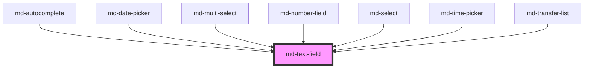

# md-text-field

<!-- llm:meta
tag: md-text-field
category: text-input
status: md3-mapped
m3-guidelines: https://m3.material.io/components/text-fields/guidelines
form-associated: true
depends-on: none
used-by: md-autocomplete, md-date-picker, md-multi-select, md-number-field, md-select, md-time-picker, md-transfer-list
-->

**The library's single text-entry primitive.** Filled and outlined variants,
single-line or multiline, with optional clear / password-toggle / speech-to-text
affordances, display masking via `formatter`/`parser`, a debounced/throttled
search event, and the full constraint-validation API through ElementInternals.

> Setup, theming, density and i18n are configured once for the whole library —
> see [`main-llm.md`](../../../../../main-llm.md), shipped beside these manuals in
> the package's `docs/` folder.

---

## When to use

- **Any** free-text or numeric entry: names, emails, passwords, amounts,
  comments.
- Multi-line entry (`multiline="auto-grow"` or `multiline="fixed"`).
- As the input surface inside a composite you are building — it exposes
  `getInputElement()` and `input-role="combobox"` for exactly that.

## When NOT to use

| Situation | Use instead |
|---|---|
| Entry with a suggestion list | `md-autocomplete` |
| App-wide search with a results surface | `md-search` |
| Choosing from a fixed set | `md-select` / `md-multi-select` |
| A number with steppers and clamping | `md-number-field` |
| A one-time passcode split into boxes | `md-otp-field` |
| A date or a time | `md-date-picker` / `md-time-picker` |
| A bounded numeric range the user should feel | `md-slider` |
| A colour | `md-color-picker` |
| A yes/no | `md-checkbox` / `md-switch` |
| Rich text | Not in this library — integrate a third-party editor |

## Decision cues

| Need | Setting |
|---|---|
| Default look | `variant="filled"` |
| On a busy surface, or beside other outlined fields | `variant="outlined"` |
| Growing comment box | `multiline="auto-grow"` (2 rows by default) |
| Fixed-height, scrolling textarea | `multiline="fixed"` (4 rows by default) |
| A clear button that empties the field | `clearable="internal"` |
| A clear button you handle yourself | `clearable="external"` |
| Show/hide password | `password-toggle="internal"` with `type="password"` |
| Dictation | `speech-to-text="internal"` + `speech-lang` |
| Currency / phone masking | `formatter` + `parser` (+ `format-on`) |
| Block disallowed characters as typed | `restrict` |
| Avoid layout jump when an error appears | `reserve-supporting-space` |
| Search-as-you-type | `debounce="300"` + listen for `mdSearch` |
| Character counter | `max-length` |
| Keep the field looking focused while a popup is open | `appear-focused` |
| Build a combobox on top of this field | `input-role="combobox"` |

## API contract

```html
<md-text-field
  variant="filled|outlined"                  <!-- default: filled -->
  label="Email"
  value=""
  placeholder=""
  type="text"                                <!-- default: text; any input type -->
  name="email"
  required
  pattern=".+@.+"
  min-length="3" max-length="80"
  min="" max="" step=""
  autocomplete="email"
  inputmode="email"
  enterkeyhint="done"
  autocapitalize="none"
  spellcheck="false"
  supporting-text="We'll never share it"
  error error-text="Enter a valid email"
  reserve-supporting-space
  prefix-text="$" suffix-text="kg"
  clearable="internal|external"              <!-- default: off -->
  password-toggle="internal|external"        <!-- default: off -->
  speech-to-text="internal|external"         <!-- default: off -->
  speech-lang="en-US"
  multiline="auto-grow|fixed"                <!-- default: off (single line) -->
  rows="4"                                   <!-- default: 2 auto-grow, 4 fixed -->
  restrict="numeric|integer|decimal|alpha|alphanumeric|[0-9+() -]"
  format-on="blur|input"                     <!-- default: blur -->
  focus-border-width="3"                     <!-- default: 3 -->
  appear-focused
  chips-wrap
  debounce="0" throttle="0"                  <!-- default: 0 (both off) -->
  disabled readonly
  density="-1|-2|-3|-4"                      <!-- default: 0 (uncompacted) -->
  input-role="combobox"                      <!-- default: '' -->
  input-expanded
  input-aria-autocomplete="none|inline|list|both"
></md-text-field>
```

`formatter` and `parser` are **function props** — set them in JS, never as
attributes:

```js
const field = document.querySelector('md-text-field');
field.formatter = (raw) => new Intl.NumberFormat('en-US').format(Number(raw));
field.parser = (shown) => shown.replace(/,/g, '');
```

**Events**

| Event | Detail | Fires |
|---|---|---|
| `mdInput` | `string` | Every keystroke, and on clear / speech result. Never debounced |
| `mdChange` | `string` | On the inner input's native `change` (commit), on clear, and when speech recognition ends |
| `mdSearch` | `string` | Typing and clearing only, gated by `debounce` / `throttle` and skipped when the value has not changed since the last emit. Speech results do **not** raise it |
| `mdClear` | `void` | Clear button pressed, or Escape with `clearable="internal"` |
| `mdPasswordToggle` | `{ visible: boolean }` | Password visibility button pressed |
| `mdSpeechResult` | `{ transcript: string; listening: boolean }` | Speech recognition update |
| `mdValidityChange` | `{ valid, validationMessage, flags }` | Validity actually changed — `bubbles: true`, **`composed: false`** |

The host also re-dispatches a bubbling native `change` event, so form-level
`change` delegation works.

**Methods** — `setFocus()`, `select()`, `getInputElement()`, `getValidity()`,
`checkValidity()`, `reportValidity()`, `setCustomValidity(message)`.

**Slots** — `leading-icon`, `trailing-icon`, `chips`, `clear-icon`,
`password-toggle-icon`, `speech-icon`, `error-icon`.

**Parts** — `container`, `label`, `input`, `chips`, `supporting-text`, `counter`.

### Behavioral contract worth knowing

- **`error-text` replaces `supporting-text`** when `error` is set. Setting
  `error-text` alone does nothing — the field only switches to the error look,
  the error icon and the `role="alert"` message line when `error` is present.
- Without `reserve-supporting-space` the message row is rendered only when there
  is a message or a counter, so the first error pushes everything below it down.
- `clearable`, `password-toggle` and `speech-to-text` are **three-way enums**,
  not booleans. Writing them as a bare attribute (`clearable`) is read as
  `"internal"`, and so is the boolean `true` a framework binding writes for that
  same bare form (`<md-text-field clearable />` in JSX). Any other string value
  (`clearable="true"` as an *attribute*) shows the button but behaves as
  `"external"` — it emits `mdClear` and never empties the field.
- `value` is **not reflected** to an attribute, deliberately: typed values
  including passwords must not appear in the DOM.
- In single-line mode newlines are stripped from `value`, on initial render and
  on programmatic writes, matching a native `<input>`.
- Pressing **Enter** in a single-line field submits the owning form via
  `requestSubmit()`, activating that form's default submit button.
- Pressing **Escape** clears the field when `clearable="internal"`, the field has
  a value and is neither `readonly` nor `disabled`. The keypress is stopped, so a
  surrounding `<dialog>` does not also close on that press.
- `readonly` blocks the clear button and the mic; `disabled` blocks all three
  affordances. `disabled` also follows an ancestor `<form>`/`<fieldset>` being
  disabled.
- `formatter` renders the display string; `parser` converts it back. `value`,
  `mdInput`, `mdChange` and the submitted FormData always carry the **parsed**
  value. `format-on="input"` **requires** a `parser`; without one the component
  falls back to `"blur"` and warns in dev builds.
- With `format-on="blur"` (the default) the raw value is shown while focused and
  the formatted value while blurred.
- `restrict` accepts the presets `numeric`, `integer`, `decimal`, `alpha`,
  `alphanumeric`, or a character-class string such as `[0-9+() -]`. Disallowed
  characters are stripped as typed and the caret is preserved. With `restrict`
  set, `max-length` is enforced **after** stripping, so pasting
  `(555) 123-4567` into a numeric field keeps all ten digits.
- The counter shows `value.length / max-length`, except with a live formatter
  where it counts the value with `-`, `/` and whitespace removed.
- `mdValidityChange` does **not** fire on mount — the first evaluation only
  primes the baseline — and never fires twice for the same state.
- `mdValidityChange` is **not composed**, so it does not escape the shadow root
  of a composite that embeds this field. Listen on the `md-text-field` element
  itself, or on a `<form>`/app root in the same tree.
- `getValidity()` / `checkValidity()` report on the **submitted** value, not on
  the formatted display string.
- An `aria-label` set on the host is moved onto the inner input at load and
  removed from the host (a role-less host may not carry `aria-label`) — but
  **only when no `label` is set**. With a `label` present the host keeps its
  `aria-label` attribute and it is ignored: the `label` is the accessible name.
- `aria-haspopup="dialog"` and `aria-haspopup="listbox"` set on the host are
  mirrored onto the inner input. `aria-controls` is never mirrored — an IDREF
  cannot resolve across the shadow boundary.
- To build a combobox on this field, set `input-role="combobox"`. Only then are
  `input-expanded` and `input-aria-autocomplete` applied. Setting
  `role="combobox"` on the host instead does nothing useful.
- Dictation raises `mdInput` (and `mdChange` when recognition ends) but never
  `mdSearch`. With `speech-to-text` and a debounced search, run the fetch from
  `mdInput` as well, or a dictated query is silently dropped.
- `password-toggle` is ignored in multiline mode.
- IME composition is respected: `restrict`, `parser` and `formatter` run once on
  `compositionend`, not on every intermediate keystroke.

---

## Do / Don't

Sourced from [M3 · Text fields · Guidelines](https://m3.material.io/components/text-fields/guidelines).

| ✅ Do | ❌ Don't |
|---|---|
| Separate `filled` and `outlined` fields by region | Don't put both variants next to each other or in the same form |
| Keep the label short, clear and fully visible | Don't truncate label text |
| Keep labels to one line | Don't let label text wrap to multiple lines |
| **Swap** supporting text for error text | Don't try to show error text in addition to supporting text |
| Leave enough space between fields for a wrapped error | Don't let a multi-line error bump the layout — use `reserve-supporting-space` |
| Constrain field width on large screens | Don't let text fields span the full width of a large screen |
| Always provide a `label` | Don't rely on `placeholder` as the label |
| Use `type`/`inputmode`/`autocomplete` accurately | Don't ship `type="text"` for emails and numbers |

---

## Patterns

```html
<!-- Standard validated field inside a form.
     `error-text` renders only while `error` is set, so the app flips `error`. -->
<form id="signup">
  <md-text-field
    id="email"
    label="Email" type="email" name="email" required
    autocomplete="email" inputmode="email"
    supporting-text="We'll never share it"
    error-text="Enter a valid email address"
    reserve-supporting-space
  ></md-text-field>
  <md-button type="submit">Sign up</md-button>
</form>
<script type="module">
  const email = document.getElementById('email');
  // Validate at commit points, not on every keystroke.
  email.addEventListener('mdChange', async () => {
    email.error = !(await email.checkValidity());
  });
</script>
```

```html
<!-- Password with a visibility toggle -->
<md-text-field
  label="Password" type="password" name="password"
  password-toggle="internal" min-length="8" required
></md-text-field>
```

```html
<!-- Auto-growing comment box with a counter -->
<md-text-field
  label="Notes" multiline="auto-grow" rows="3" max-length="500"
></md-text-field>
```

```html
<!-- Search-as-you-type: mdInput is per-keystroke, mdSearch is debounced -->
<md-text-field
  id="q" label="Search" type="search" clearable="internal" debounce="300"
></md-text-field>
<script type="module">
  const field = document.getElementById('q');
  field.addEventListener('mdSearch', (e) => {
    console.log('debounced query:', e.detail);
  });
</script>
```

```html
<!-- Masked currency: value stays numeric, display is grouped -->
<md-text-field
  id="amount" label="Amount" prefix-text="$"
  inputmode="decimal" restrict="decimal"
></md-text-field>
<script type="module">
  const f = document.getElementById('amount');
  f.formatter = (raw) => (raw ? new Intl.NumberFormat('en-US').format(Number(raw)) : '');
  f.parser = (shown) => shown.replace(/,/g, '');
  f.addEventListener('mdChange', (e) => console.log(Number(e.detail))); // parsed
</script>
```

```html
<!-- Server-side validation -->
<md-text-field id="user" label="Username" name="username"></md-text-field>
<script type="module">
  const el = document.getElementById('user');
  el.addEventListener('mdValidityChange', (e) => console.log(e.detail.valid));
  await el.setCustomValidity('That username is already taken');
  // clear it again with:
  // await el.setCustomValidity('');
</script>
```

```html
<!-- Error state driven by the app -->
<md-text-field
  id="code" label="Invite code" error error-text="Code not recognised"
  reserve-supporting-space
></md-text-field>
```

## Anti-patterns

| ❌ Wrong | ✅ Right | Why |
|---|---|---|
| `placeholder` used instead of `label` | Set `label` | The placeholder is only rendered once the label has floated, and it is not an accessible name. |
| `error-text` set without `error` | Set both | `error-text` alone leaves the field in its normal state. |
| Showing supporting **and** error text | Swap one for the other | `error-text` replaces `supporting-text` — you cannot render both. |
| `clearable="true"` **as an attribute** | `clearable="internal"` or bare `clearable` | Any *string* other than `internal` behaves as `external`: the button shows but never empties the field. The boolean `true` a framework writes for bare `clearable` is fine — it normalises to `internal`. |
| `formatter="..."` as an attribute | `el.formatter = fn` in JS | Function props do not cross the attribute boundary. |
| `format-on="input"` with only a `formatter` | Supply a `parser` too | Without a parser the component silently falls back to `format-on="blur"`. |
| Reading `value` expecting the formatted string | `value` is the **parsed** value | `formatter` affects display only. |
| Debouncing by listening to `mdInput` | Listen to `mdSearch` and set `debounce` | `debounce`/`throttle` gate `mdSearch` only; `mdInput` always fires per keystroke. |
| Listening for `mdValidityChange` on an ancestor shadow host | Listen on the `md-text-field` itself | It is `composed: false` by design. |
| `role="combobox"` on the host | `input-role="combobox"` | The role must land on the real inner textbox; a host attribute never reaches it. |
| A hidden `<input>` to get the value into `FormData` | Give the field a `name` | It is already form-associated via ElementInternals. |
| `type="number"` for phone numbers | `type="tel"` + `inputmode="tel"` | Spinners and locale parsing get in the way. |
| Mixing `filled` and `outlined` in one form | Pick one per region | M3 explicit rule. |
| `density="0"` to escape an inherited rung | `style="--md-sys-density-scale: 0"` | There is no `density="0"` rule; rung 0 is the default and is inert. |

## Accessibility, RTL, density, i18n

**Accessibility** — `label` becomes the inner input's accessible name; always
set it. An `aria-label` on the host is relocated onto the input only when there
is no `label`; with a `label` present the host attribute stays put and is
ignored.
The supporting line carries `role="alert"` while `error` is set, so the message
is announced. `max-length` renders a counter that is wired in through
`aria-describedby`, as is the supporting text. The clear, password and mic
buttons carry their own English labels (`Clear`, `Show password` /
`Hide password`, `Start voice input` / `Stop listening`); replace their glyphs
through the `clear-icon`, `password-toggle-icon` and `speech-icon` slots.
`readonly` stays focusable; `disabled` does not. The host uses
`delegatesFocus`, so `element.focus()` and a click anywhere in the container
land in the input. `focus-border-width` (1, 2 or 3) sets the focused border
thickness — do not lower it below the contrast your design needs.

**RTL** — the container, prefix/suffix and icon sides mirror automatically from
the document's `dir`. Check that a currency prefix still lands where the locale
expects.

**Density** — set `density="-1"` … `density="-4"` for a local override, or let
the field inherit an ancestor's `data-density` rung. Both drive the same
`--md-sys-density-scale` signal; the local prop wins because it is set on the
host. There is no `density="0"` rule — rung 0 is the uncompacted default.

**i18n** — translate `label`, `placeholder`, `supporting-text`, `error-text`,
`prefix-text` and `suffix-text`. Set `speech-lang` per locale. Use `Intl`
inside `formatter` for locale-correct numbers and currency. Note that speech
input depends on the browser's Web Speech API and is unavailable in browsers
that do not implement it — the component logs a warning and does nothing.

## Related components

`md-autocomplete` · `md-search` · `md-number-field` · `md-otp-field` ·
`md-select` · `md-multi-select` · `md-date-picker` · `md-time-picker` ·
`md-color-picker` · `md-icon-button`

## Theming

| Custom property | Purpose | Default |
|---|---|---|
| `--md-text-field-container-color` | Filled container background | `--md-sys-color-surface-container-highest` |
| `--md-text-field-input-color` | Input text and caret colour | `--md-sys-color-on-surface` |
| `--md-text-field-label-color` | Label colour | `--md-sys-color-on-surface-variant` |
| `--md-text-field-active-indicator-color` | Filled underline | `--md-sys-color-primary` |
| `--md-text-field-outline-color` | Outlined border | `--md-sys-color-outline` |
| `--md-text-field-error-color` | Error state colour | `--md-sys-color-error` |
| `--md-text-field-supporting-text-color` | Supporting / counter line | `--md-sys-color-on-surface-variant` |
| `--md-text-field-icon-color` | Leading and trailing icon colour | `--md-sys-color-on-surface-variant` |
| `--md-text-field-icon-size` | Leading and trailing icon size | density-scaled, `24px` at rung 0 |
| `--md-text-field-container-shape` | Corner radius | `--md-sys-shape-corner-extra-small` (4px) |
| `--md-text-field-filled-pill` | Set to `1` for a pill-shaped filled variant | `0` |
| `--md-text-field-padding-inline-start` | Leading inline padding | `--md-sys-spacing-inset-lg` + 7px (23px at rung 0) |
| `--md-text-field-padding-inline-end` | Trailing inline padding | `--md-sys-spacing-inset-lg` + 7px (23px at rung 0) |
| `--md-text-field-focus-border-width` | Focused border / underline thickness | `3px` |
| `--md-text-field-focus-inset` | Focused outline inset | `-2px` |
| `--md-text-field-optical-nudge` | Vertical optical nudge of the outlined input | `0px` |
| `--md-text-field-cursor` | Cursor over the container and input | `text` |

**CSS parts** — `container`, `label`, `input`, `chips`, `supporting-text`,
`counter`.

```css
md-text-field {
  --md-text-field-container-shape: 12px;
  --md-text-field-focus-border-width: 2px;
}
md-text-field::part(input) {
  font-variant-numeric: tabular-nums;
}
```

<!-- Auto Generated Below -->


## Properties

| Property                 | Attribute                  | Description                                                                                                                                                                                                                                                                                                                                                                                                                                                                                                                                                                                                                                                                                                                                                                                             | Type                                              | Default     |
| ------------------------ | -------------------------- | ------------------------------------------------------------------------------------------------------------------------------------------------------------------------------------------------------------------------------------------------------------------------------------------------------------------------------------------------------------------------------------------------------------------------------------------------------------------------------------------------------------------------------------------------------------------------------------------------------------------------------------------------------------------------------------------------------------------------------------------------------------------------------------------------------- | ------------------------------------------------- | ----------- |
| `appearFocused`          | `appear-focused`           | Force the field to render in its focused visual state regardless of the underlying input's actual focus. Use when the field acts as an *anchor* for a popover, dialog, or menu, and the OS focus has moved into that surface — for example the `md-time-picker` keeps its trigger field in the focused look while the picker modal is open, so the trigger and the modal read as one connected control.  Visual-only: affects the notched-outline width / colour, the floating label position, and the leading-icon colour through md-text-field's existing `.md-text-field--focused` rules. Does NOT alter formatter / blur-format behaviour (those keep tracking real focus events), so `formatOn="blur"` still flips between formatted and raw on real focus/blur even while `appear-focused` is on. | `boolean`                                         | `false`     |
| `autoCapitalize`         | `autocapitalize`           |                                                                                                                                                                                                                                                                                                                                                                                                                                                                                                                                                                                                                                                                                                                                                                                                         | `string`                                          | `''`        |
| `autocomplete`           | `autocomplete`             | Input behavior passthrough (password managers / mobile keyboards).                                                                                                                                                                                                                                                                                                                                                                                                                                                                                                                                                                                                                                                                                                                                      | `string`                                          | `''`        |
| `chipsWrap`              | `chips-wrap`               | When leading `chips` are slotted, allow them to WRAP onto multiple rows so the field grows to fit them. Default `false`: chips stay on a single line and the field keeps its normal height (the consumer, e.g. md-multi-select, is responsible for handling overflow — clipping or a "+N" counter).                                                                                                                                                                                                                                                                                                                                                                                                                                                                                                     | `boolean`                                         | `false`     |
| `clearable`              | `clearable`                | Show a clear icon button. 'internal' clears the value directly; 'external' emits mdClear and leaves value control to the consumer.                                                                                                                                                                                                                                                                                                                                                                                                                                                                                                                                                                                                                                                                      | `"external" \| "internal" \| boolean`             | `false`     |
| `debounce`               | `debounce`                 | Debounce delay (ms) for the mdSearch event. Emits after the user stops typing for this duration. 0 = disabled.                                                                                                                                                                                                                                                                                                                                                                                                                                                                                                                                                                                                                                                                                          | `number`                                          | `0`         |
| `density`                | `density`                  | Density scale: 0 (default 56px), -1 (52px), -2 (48px), -3 (44px).                                                                                                                                                                                                                                                                                                                                                                                                                                                                                                                                                                                                                                                                                                                                       | `-1 \| -2 \| -3 \| -4 \| 0`                       | `0`         |
| `disabled`               | `disabled`                 |                                                                                                                                                                                                                                                                                                                                                                                                                                                                                                                                                                                                                                                                                                                                                                                                         | `boolean`                                         | `false`     |
| `enterKeyHint`           | `enterkeyhint`             |                                                                                                                                                                                                                                                                                                                                                                                                                                                                                                                                                                                                                                                                                                                                                                                                         | `string`                                          | `''`        |
| `error`                  | `error`                    |                                                                                                                                                                                                                                                                                                                                                                                                                                                                                                                                                                                                                                                                                                                                                                                                         | `boolean`                                         | `false`     |
| `errorText`              | `error-text`               |                                                                                                                                                                                                                                                                                                                                                                                                                                                                                                                                                                                                                                                                                                                                                                                                         | `string`                                          | `''`        |
| `focusBorderWidth`       | `focus-border-width`       | Border width when focused: 1, 2, or 3 pixels.                                                                                                                                                                                                                                                                                                                                                                                                                                                                                                                                                                                                                                                                                                                                                           | `number`                                          | `3`         |
| `formatOn`               | `format-on`                | When to apply the formatter. - 'blur': format on blur, show raw value on focus (default) - 'input': format on every keystroke (live formatting)                                                                                                                                                                                                                                                                                                                                                                                                                                                                                                                                                                                                                                                         | `"blur" \| "input"`                               | `'blur'`    |
| `formatter`              | --                         | Formats the raw value for display. Set via JS: `el.formatter = (v) => Number(v).toLocaleString()`.                                                                                                                                                                                                                                                                                                                                                                                                                                                                                                                                                                                                                                                                                                      | `((value: string) => string) \| undefined`        | `undefined` |
| `inputAriaAutocomplete`  | `input-aria-autocomplete`  | `aria-autocomplete` for the combobox — how typing relates to the popup.                                                                                                                                                                                                                                                                                                                                                                                                                                                                                                                                                                                                                                                                                                                                 | `"" \| "both" \| "inline" \| "list" \| "none"`    | `''`        |
| `inputExpanded`          | `input-expanded`           | Expanded state of the owner's popup. Emitted only with `input-role="combobox"`, where `aria-expanded` is an allowed attribute (it is not on a bare textbox).                                                                                                                                                                                                                                                                                                                                                                                                                                                                                                                                                                                                                                            | `boolean`                                         | `false`     |
| `inputMode`              | `inputmode`                |                                                                                                                                                                                                                                                                                                                                                                                                                                                                                                                                                                                                                                                                                                                                                                                                         | `string`                                          | `''`        |
| `inputRole`              | `input-role`               | Promote the inner input to a WAI-ARIA **combobox**, for a composite that owns the popup (md-autocomplete). The role has to live on the real textbox — the one AT reads when it has focus — and this field renders it, so the owner cannot put it there itself.  Whitelisted to `combobox`: it is the only role an owner has a legitimate reason to place on a text input, and an open-ended role prop here would let a consumer lie about the control.                                                                                                                                                                                                                                                                                                                                                  | `"" \| "combobox"`                                | `''`        |
| `label`                  | `label`                    |                                                                                                                                                                                                                                                                                                                                                                                                                                                                                                                                                                                                                                                                                                                                                                                                         | `string`                                          | `''`        |
| `max`                    | `max`                      |                                                                                                                                                                                                                                                                                                                                                                                                                                                                                                                                                                                                                                                                                                                                                                                                         | `number \| string \| undefined`                   | `undefined` |
| `maxLength`              | `max-length`               |                                                                                                                                                                                                                                                                                                                                                                                                                                                                                                                                                                                                                                                                                                                                                                                                         | `number \| undefined`                             | `undefined` |
| `min`                    | `min`                      |                                                                                                                                                                                                                                                                                                                                                                                                                                                                                                                                                                                                                                                                                                                                                                                                         | `number \| string \| undefined`                   | `undefined` |
| `minLength`              | `min-length`               |                                                                                                                                                                                                                                                                                                                                                                                                                                                                                                                                                                                                                                                                                                                                                                                                         | `number \| undefined`                             | `undefined` |
| `multiline`              | `multiline`                | Multi-line mode. - false: single-line <input> (default) - 'auto-grow': <textarea> that expands as content grows (multi-line field) - 'fixed': <textarea> with fixed height that scrolls (text area)                                                                                                                                                                                                                                                                                                                                                                                                                                                                                                                                                                                                     | `"auto-grow" \| "fixed" \| boolean`               | `false`     |
| `name`                   | `name`                     | Form field name (host attribute — ElementInternals submits under it).                                                                                                                                                                                                                                                                                                                                                                                                                                                                                                                                                                                                                                                                                                                                   | `string`                                          | `''`        |
| `parser`                 | --                         | Parses the display value back to a raw value. Set via JS: `el.parser = (v) => v.replace(/[^0-9.-]/g, '')`.                                                                                                                                                                                                                                                                                                                                                                                                                                                                                                                                                                                                                                                                                              | `((displayValue: string) => string) \| undefined` | `undefined` |
| `passwordToggle`         | `password-toggle`          | Show a password visibility toggle. 'internal' toggles the input type directly; 'external' emits mdPasswordToggle and leaves type control to the consumer.                                                                                                                                                                                                                                                                                                                                                                                                                                                                                                                                                                                                                                               | `"external" \| "internal" \| boolean`             | `false`     |
| `pattern`                | `pattern`                  | Constraint validation (forwarded to the inner input; surfaced via ElementInternals).                                                                                                                                                                                                                                                                                                                                                                                                                                                                                                                                                                                                                                                                                                                    | `string`                                          | `''`        |
| `placeholder`            | `placeholder`              |                                                                                                                                                                                                                                                                                                                                                                                                                                                                                                                                                                                                                                                                                                                                                                                                         | `string`                                          | `''`        |
| `prefixText`             | `prefix-text`              |                                                                                                                                                                                                                                                                                                                                                                                                                                                                                                                                                                                                                                                                                                                                                                                                         | `string`                                          | `''`        |
| `readOnly`               | `readonly`                 |                                                                                                                                                                                                                                                                                                                                                                                                                                                                                                                                                                                                                                                                                                                                                                                                         | `boolean`                                         | `false`     |
| `required`               | `required`                 |                                                                                                                                                                                                                                                                                                                                                                                                                                                                                                                                                                                                                                                                                                                                                                                                         | `boolean`                                         | `false`     |
| `reserveSupportingSpace` | `reserve-supporting-space` | Always occupy the supporting-text line, even when there is no message.  The row is otherwise rendered only when there is something to show, so the first validation error CREATES a line and shoves everything below it down — the whole form jumps as you tab through it. Reserving the space is opt-in because a field with no message would otherwise carry an empty line everywhere, including dense and inline layouts. createFormController turns it on automatically for the fields it manages, since those are exactly the ones whose messages appear and disappear.                                                                                                                                                                                                                            | `boolean`                                         | `false`     |
| `restrict`               | `restrict`                 | Restrict input to allowed characters. Presets: 'numeric', 'integer', 'decimal', 'alpha', 'alphanumeric'. Custom: a regex character class string, e.g. '[0-9+() -]'.                                                                                                                                                                                                                                                                                                                                                                                                                                                                                                                                                                                                                                     | `string`                                          | `''`        |
| `rows`                   | `rows`                     | Number of visible text rows for multiline modes. Defaults to 2 for auto-grow, 4 for fixed.                                                                                                                                                                                                                                                                                                                                                                                                                                                                                                                                                                                                                                                                                                              | `number \| undefined`                             | `undefined` |
| `speechLang`             | `speech-lang`              | Language/locale for internal speech recognition (e.g. 'en-US', 'de-DE'). Defaults to browser locale.                                                                                                                                                                                                                                                                                                                                                                                                                                                                                                                                                                                                                                                                                                    | `string`                                          | `''`        |
| `speechToText`           | `speech-to-text`           | Speech-to-text via Web Speech API. - 'internal': manages recognition internally, appends transcript to value - 'external': emits mdSpeechResult on mic click, letting the consumer handle recognition                                                                                                                                                                                                                                                                                                                                                                                                                                                                                                                                                                                                   | `"external" \| "internal" \| boolean`             | `false`     |
| `spellcheck`             | `spellcheck`               |                                                                                                                                                                                                                                                                                                                                                                                                                                                                                                                                                                                                                                                                                                                                                                                                         | `boolean \| undefined`                            | `undefined` |
| `step`                   | `step`                     |                                                                                                                                                                                                                                                                                                                                                                                                                                                                                                                                                                                                                                                                                                                                                                                                         | `number \| string \| undefined`                   | `undefined` |
| `suffixText`             | `suffix-text`              |                                                                                                                                                                                                                                                                                                                                                                                                                                                                                                                                                                                                                                                                                                                                                                                                         | `string`                                          | `''`        |
| `supportingText`         | `supporting-text`          |                                                                                                                                                                                                                                                                                                                                                                                                                                                                                                                                                                                                                                                                                                                                                                                                         | `string`                                          | `''`        |
| `throttle`               | `throttle`                 | Throttle interval (ms) for the mdSearch event. Emits at most once per interval while typing. 0 = disabled.                                                                                                                                                                                                                                                                                                                                                                                                                                                                                                                                                                                                                                                                                              | `number`                                          | `0`         |
| `type`                   | `type`                     |                                                                                                                                                                                                                                                                                                                                                                                                                                                                                                                                                                                                                                                                                                                                                                                                         | `string`                                          | `'text'`    |
| `value`                  | `value`                    | NOT reflected: typed values (incl. passwords) must never appear as a DOM attribute.                                                                                                                                                                                                                                                                                                                                                                                                                                                                                                                                                                                                                                                                                                                     | `string`                                          | `''`        |
| `variant`                | `variant`                  |                                                                                                                                                                                                                                                                                                                                                                                                                                                                                                                                                                                                                                                                                                                                                                                                         | `"filled" \| "outlined"`                          | `'filled'`  |


## Events

| Event              | Description                                                                                                                                                                                                                                                                                                                                                                                                                                                                                                                                                              | Type                                                                                          |
| ------------------ | ------------------------------------------------------------------------------------------------------------------------------------------------------------------------------------------------------------------------------------------------------------------------------------------------------------------------------------------------------------------------------------------------------------------------------------------------------------------------------------------------------------------------------------------------------------------------ | --------------------------------------------------------------------------------------------- |
| `mdChange`         |                                                                                                                                                                                                                                                                                                                                                                                                                                                                                                                                                                          | `CustomEvent<string>`                                                                         |
| `mdClear`          |                                                                                                                                                                                                                                                                                                                                                                                                                                                                                                                                                                          | `CustomEvent<void>`                                                                           |
| `mdInput`          |                                                                                                                                                                                                                                                                                                                                                                                                                                                                                                                                                                          | `CustomEvent<string>`                                                                         |
| `mdPasswordToggle` |                                                                                                                                                                                                                                                                                                                                                                                                                                                                                                                                                                          | `CustomEvent<{ visible: boolean; }>`                                                          |
| `mdSearch`         | Emitted with debounce/throttle control. Useful for search-as-you-type, API calls, or filtering.                                                                                                                                                                                                                                                                                                                                                                                                                                                                          | `CustomEvent<string>`                                                                         |
| `mdSpeechResult`   |                                                                                                                                                                                                                                                                                                                                                                                                                                                                                                                                                                          | `CustomEvent<{ transcript: string; listening: boolean; }>`                                    |
| `mdValidityChange` | Fires when this control's validity CHANGES — never on every keystroke, and never for a re-publish that lands on the same state.  `composed: false` is deliberate. Composites like md-select embed an md-text-field, and a composed event escapes that inner shadow root, so a listener on md-select would receive the inner field's event as well as the host's — two events, different payloads, for one logical control. Keeping it uncomposed means each component reports only for itself, while `bubbles: true` still lets a <form> or app root hear every control. | `CustomEvent<{ valid: boolean; validationMessage: string; flags: Record<string, boolean>; }>` |


## Methods

### `checkValidity() => Promise<boolean>`

Constraint-validation API, delegated to the inner input.

#### Returns

Type: `Promise<boolean>`


### `getInputElement() => Promise<HTMLInputElement | HTMLTextAreaElement | null>`

The real `<input>` / `<textarea>` this field renders.

A composite that owns a popup (md-autocomplete, the date/time pickers)
needs the actual textbox to wire combobox ARIA onto — its role, its
expanded state, and the element references that point at a listbox living
in the PARENT's shadow root. Handing it over explicitly replaces the
shadow-piercing `querySelector('.md-text-field__input')` those components
were doing against a private class name.

Returns null before the first render.

#### Returns

Type: `Promise<HTMLInputElement | HTMLTextAreaElement | null>`


### `getValidity() => Promise<{ valid: boolean; validationMessage: string; flags: Record<string, boolean>; }>`

Native-parity validity readback: flags + message + willValidate.

#### Returns

Type: `Promise<{ valid: boolean; validationMessage: string; flags: Record<string, boolean>; }>`


### `reportValidity() => Promise<boolean>`


#### Returns

Type: `Promise<boolean>`


### `select() => Promise<void>`

Select the input's full contents.

#### Returns

Type: `Promise<void>`


### `setCustomValidity(message: string) => Promise<void>`

App/server-side validation: a non-empty message marks the field
invalid for its form until cleared with an empty string.

#### Parameters

| Name      | Type     | Description |
| --------- | -------- | ----------- |
| `message` | `string` |             |

#### Returns

Type: `Promise<void>`


### `setFocus() => Promise<void>`

Focus the inner input (host.focus() also works via delegatesFocus).

#### Returns

Type: `Promise<void>`


## Shadow Parts

| Part                | Description |
| ------------------- | ----------- |
| `"chips"`           |             |
| `"container"`       |             |
| `"counter"`         |             |
| `"input"`           |             |
| `"label"`           |             |
| `"supporting-text"` |             |


## Dependencies

### Used by

 - [md-autocomplete](../md-autocomplete)
 - [md-date-picker](../md-date-picker)
 - [md-multi-select](../md-multi-select)
 - [md-number-field](../md-number-field)
 - [md-select](../md-select)
 - [md-time-picker](../md-time-picker)
 - [md-transfer-list](../md-transfer-list)

### Graph


----------------------------------------------

*Built with [StencilJS](https://stenciljs.com/)*
