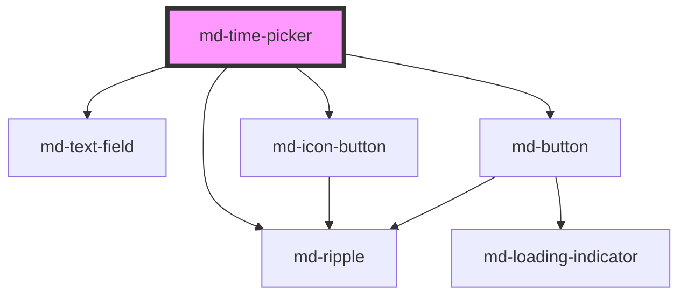

# md-time-picker

<!-- llm:meta
tag: md-time-picker
category: pickers
status: md3-mapped
m3-guidelines: https://m3.material.io/components/time-pickers/guidelines
form-associated: true
depends-on: md-text-field, md-ripple, md-icon-button, md-button
used-by: none
-->

**Choose a time, by dial or by typing.** 12h/24h formats, min/max bounds with
templated validation messages, overnight ranges, and full constraint validation.

> Setup, theming, density and i18n are configured once for the whole library —
> see [`main-llm.md`](../../../../../main-llm.md), the library-wide specification shipped
> alongside these manuals.

---

## When to use

- Any **time-of-day** entry: appointments, reminders, opening hours.
- Where a coarse selection is typical (`minute-step="5"` / `"15"`).
- Where a form must submit a `HH:MM` value like a native `<input type="time">`.

## When NOT to use

| Situation | Use instead |
|---|---|
| A date | `md-date-picker` |
| A duration ("90 minutes") | `md-text-field type="number"` / `md-select` |
| A time range | Two pickers with `min`/`max` wired |
| A few fixed slots | `md-select` / `md-chip` |
| A timestamp the user shouldn't edit | Formatted text |
| Timezone selection | `md-select` |

## Decision cues

| Need | Setting |
|---|---|
| Keyboard entry first | `variant="input"` (default) |
| Clock dial first | `variant="dial"` |
| 12-hour with AM/PM | `format="12h"` (default) |
| 24-hour | `format="24h"` |
| Coarse minutes on the dial | `minute-step="5"` / `"15"` |
| Bound the range | `min` / `max` (`HH:MM`) |
| Overnight window (22:00 → 06:00) | `min="22:00" max="06:00"` — reversed is supported |
| Adapt dial/input to the viewport | `responsive` |
| Landscape dial | `orientation="horizontal"` |
| AM/PM side by side | `period-layout="horizontal"` |
| Embed without the built-in trigger | `hide-trigger` + `show()` |

## API contract

```html
<md-time-picker
  variant="input|dial"                 <!-- default: input -->
  format="12h|24h"                     <!-- default: 12h -->
  value="14:30"
  name="start"
  min="09:00"
  max="17:00"
  required
  disabled
  open
  minute-step="5"                      <!-- default: 1 -->
  period-layout="vertical|horizontal"  <!-- default: vertical -->
  orientation="vertical|horizontal"    <!-- default: vertical; dial variant only -->
  responsive                           <!-- default: false -->
  hide-trigger                         <!-- default: false -->
  density="-1|-2|-3|-4"                <!-- omit for the default rung -->
></md-time-picker>
```

Every visible string is a prop, each defaulting to English:

```html
<md-time-picker
  label="Select time"
  headline=""                          <!-- overrides both headline-*-label -->
  headline-input-label="Enter time"
  headline-dial-label="Select time"
  am-label="AM"
  pm-label="PM"
  hour-label="Hour"
  minute-label="Minute"
  period-label="Period"
  cancel-label="Cancel"
  ok-label="OK"
  toggle-dial-label="Toggle dial picker"
  toggle-input-label="Toggle keyboard input"
  value-missing-label="Please select a time."
  range-underflow-label="Please select a time at or after {min}."
  range-overflow-label="Please select a time at or before {max}."
  range-outside-label="Please select a time at or after {min} or at or before {max}."
></md-time-picker>
```

**Events** — `mdChange` (committed) and `mdInput` (every intermediate change)
both carry the same `MdTimePickerChangeDetail`; `mdOpen` / `mdClose` /
`mdCancel` carry no detail; `mdModeChange` carries `{ mode, previousMode }`;
`mdValidityChange` is `bubbles: true`, **`composed: false`** — listen on the
element or a light-DOM ancestor, never across a shadow boundary.

`MdTimePickerChangeDetail` gives you four representations of one time so you
never re-format it yourself:

```js
{
  value: '14:30',                          // canonical, matches the `value` prop
  iso: '14:30:00',                         // HH:MM:SS local time
  isoDateTime: '2026-05-21T14:30:00.000Z', // today's date, serialized to UTC
  date: Date,                              // today's date with these H/M, s+ms zeroed
  hours: 14,                               // 0–23
  minutes: 30,                             // 0–59
  period: 'PM'                             // derived from hours, always present
}
```

**Methods** — `show()`, `hide()`, `getValidity()`, `checkValidity()`,
`reportValidity()`. All are async; `await` them.

**Slots** — none. The component renders no `<slot>`; every string is a prop, so
localization and layout stay under the component's control. Restyle through the
CSS parts.

**Parts** — `trigger`, `trigger-icon`, `scrim`, `dialog`, `headline`, `body`,
`time-area`, `input-area`, `input-hour`, `input-minute`, `period-toggle`,
`period-am`, `period-am-ripple`, `period-pm`, `period-pm-ripple`, `dial-wrap`,
`dial`, `dial-hand`, `footer`, `toggle-mode`, `actions`, `cancel-button`,
`confirm-button`.

### Behavioral contract worth knowing

- **`value` is a 24-hour `HH:MM` string regardless of `format`.** `format="12h"`
  only changes the display; a consumer parsing `value` never handles AM/PM.
  `min` and `max` use the same form.
- **`value` is canonicalized on load.** `"9:05"` becomes `"09:05"`, so the
  reflected attribute and `FormData` never change shape later. A malformed
  `value` is rejected and treated as empty (with a dev-build console warning).
- **`mdChange` only fires on commit** — the OK button, or Enter in the HH/MM
  fields while both buffers are valid. `mdInput` fires on every intermediate
  change: dial drag, dial keyboard entry, the AM/PM toggle, and input-variant
  keystrokes that produce a valid `HH:MM`.
- **Cancel, `Escape` and a scrim click all emit `mdCancel`** and restore the
  previously committed time. `hide()` is treated as a Cancel and emits it too.
  `mdClose` fires on every close, commit or cancel alike.
- **Close it with `hide()`, not `close()`** — this is the one picker in the
  family using `hide()`. (`md-date-picker` uses `close()`.)
- **A reversed `min`/`max` is an overnight window**, matching native
  `<input type="time">`: `min="22:00" max="06:00"` accepts 23:30 and 05:00. A
  value in the excluded middle sets **both** `rangeUnderflow` and
  `rangeOverflow` and reports `range-outside-label`.
- The three range messages are **templates**: `{min}` and `{max}` interpolate,
  every occurrence. **Keep those tokens when translating.**
- `minute-step` snaps the **dial** only. The HH/MM fields always accept
  1-minute granularity.
- `orientation` applies to `variant="dial"` only; the input dialog is always the
  vertical ~328px layout. `period-layout` is ignored when `format="24h"`, since
  there is no AM/PM toggle to lay out. A horizontal dial dialog always uses the
  horizontal AM/PM pill regardless of `period-layout`.
- `responsive` treats `variant` / `orientation` as a *preference*: it falls back
  to the input variant below ~460px of viewport height, and promotes the dial to
  horizontal at ≥720px wide in landscape (demoting again below ~620px, so the
  two thresholds do not oscillate). It only overrides when the viewport cannot
  fit what you asked for.
- `hide-trigger` renders no field at all and makes the host `display: contents`
  — open it yourself with `show()`.
- **Form-associated via `ElementInternals`.** With a `name` it submits the
  committed `HH:MM` under that name (an empty selection submits an empty entry,
  like a native time input). Form reset restores the `value` the element had at
  first render, not empty. A wrapping `<fieldset disabled>` disables it through
  `formDisabledCallback` and closes an open dialog.
- `mdValidityChange` never fires on mount — the first evaluation only primes the
  baseline — and never re-fires for a state that did not change.
- **Users can switch modes from inside the open dialog** via the footer toggle,
  whatever `variant` you set. `mdModeChange` reports the switch; `variant`
  itself is not mutated.
- The trigger is a read-only `md-text-field`: Tab focuses it, click and
  Enter/Space open the dialog, and free text cannot be typed into it.

---

## Do / Don't

Sourced from [M3 · Time pickers · Guidelines](https://m3.material.io/components/time-pickers/guidelines).

| ✅ Do | ❌ Don't |
|---|---|
| Offer keyboard entry for a known time | Don't force dial interaction for a time the user can type |
| Use the dial for approximate or exploratory selection | Don't use a dial where precision to the minute matters |
| Match `format` to the user's locale convention | Don't force 12h on a 24h locale (or the reverse) |
| Use `minute-step` matching real granularity | Don't offer minute precision for hour-long slots |
| Bound with `min` / `max` | Don't accept an out-of-hours time then reject it |
| Keep `{min}` / `{max}` when translating range messages | Don't drop the tokens — the message loses the values |
| Localize every label prop | Don't ship the English defaults |
| Show validation inline | Don't rely on the browser balloon |
| Turn on `responsive` on new integrations | Don't pin `orientation="horizontal"` on a phone-portrait layout |

---

## Patterns

```html
<!-- Bounded, validated, submitted with a form -->
<form id="shift">
  <md-time-picker
    id="start" label="Start time" name="start"
    format="24h" min="09:00" max="17:00" minute-step="15" required
    range-underflow-label="Please choose a time at or after {min}."
    range-overflow-label="Please choose a time at or before {max}."
  ></md-time-picker>
  <md-button type="submit">Save</md-button>
</form>

<script type="module">
  const t = document.getElementById('start');
  t.addEventListener('mdChange', (e) => console.log(e.detail.value));  // "09:30"
  t.addEventListener('mdCancel', () => console.log('dismissed'));

  document.getElementById('shift').addEventListener('submit', (e) => {
    e.preventDefault();
    console.log(new FormData(e.currentTarget).get('start'));  // "09:30"
  });
</script>
```

```html
<!-- Dial first, adaptive layout -->
<md-time-picker variant="dial" orientation="horizontal" responsive></md-time-picker>
```

```html
<!-- A range, as two coupled pickers -->
<md-time-picker id="from" label="From"></md-time-picker>
<md-time-picker id="to"   label="To"></md-time-picker>

<script type="module">
  const from = document.getElementById('from');
  const to = document.getElementById('to');

  // mdChange, not mdInput: bounds applied mid-edit fight the user as they type.
  from.addEventListener('mdChange', () => { to.min = from.value; });
  to.addEventListener('mdChange', () => { from.max = to.value; });
</script>
```

```html
<!-- Embedded, no built-in trigger; close with hide(), not close() -->
<md-button id="open-tp">Pick a time</md-button>
<md-time-picker hide-trigger id="tp"></md-time-picker>

<script type="module">
  const tp = document.getElementById('tp');
  document.getElementById('open-tp').addEventListener('mdClick', () => tp.show());
</script>
```

```html
<!-- Overnight window: valid at or after 22:00 OR at or before 06:00 -->
<md-time-picker
  label="Night shift start" format="24h"
  min="22:00" max="06:00"
  range-outside-label="Night shifts start between {min} and {max}."
></md-time-picker>
```

### Ranges

There is no range variant. Two pickers make one by feeding each other's bounds
(see the pattern above). Each keeps its own constraint validation, so a value
past the bound it was given reports `rangeUnderflow` / `rangeOverflow` with the
localized message.

## Anti-patterns

| ❌ Wrong | ✅ Right | Why |
|---|---|---|
| Coupling a range on `mdInput` | Couple on `mdChange` | Bounds applied mid-edit fight the user as they type. |
| Expecting `value` to be `"2:30 PM"` with `format="12h"` | It is always `"14:30"` | `format` affects display only. |
| `picker.close()` | `picker.hide()` | This component uses `hide()`, unlike `md-date-picker`. |
| Translating range messages without `{min}` / `{max}` | Keep the tokens | The bounds interpolate into them. |
| Wiring both `mdInput` and `mdChange` to a save | Use `mdChange` | `mdInput` fires on every intermediate change. |
| `minute-step="1"` for 30-minute slots | Match the real granularity | Needless precision on the dial. |
| Expecting `minute-step` to constrain the HH/MM fields | It snaps the dial only | Typed entry is always 1-minute. |
| Hardcoding `format="12h"` for all locales | Set it per locale | Wrong convention for most of the world. |
| Setting `period-layout` with `format="24h"` | Drop it | There is no AM/PM toggle in 24h mode. |
| Shipping the English label props | Translate all of them | Half-localized dialog otherwise. |
| Listening for `mdValidityChange` on a shadow ancestor | Listen on the element itself | It is `composed: false`. |
| A hidden `<input>` to submit the time | Give the picker a `name` | It is already form-associated. |
| `md-time-picker` for a duration | `md-text-field` / `md-select` | Different concept — a duration has no clock face. |
| Slotting custom content into the dialog | Use the label props and CSS parts | The component renders no `<slot>`. |

## Accessibility, RTL, density, i18n

**Accessibility** — the dial and the HH/MM fields are both keyboard operable.
`hour-label`, `minute-label` and `period-label` are the accessible names of the
entry fields and of the AM/PM `radiogroup`, which also implements the WAI-ARIA
radio keyboard pattern (arrows, Home, End) so PM is reachable without Tab.
`toggle-dial-label` / `toggle-input-label` name the mode switch — translate
them. The dialog is `role="dialog" aria-modal="true"`, labelled by its headline;
it traps Tab, and Escape is handled by the topmost open picker only, so stacked
pickers close one at a time. Focus returns to the trigger on close. The trigger
carries `aria-haspopup="dialog"` and a live `aria-expanded`. Validation messages
are anchored on the trigger field; the templated range messages are far more
useful than a generic "invalid" because they state the bound.

**RTL** — the dialog, the field order and the AM/PM toggle mirror under
`dir="rtl"`. The clock dial itself keeps clockwise numbering — that is not
directional.

**Density** — `density="-1…-4"` locally overrides the inherited `data-density`
rung; only those four rungs exist, and omitting the attribute is the uncompacted
default. `density="0"` does **not** opt a picker out of an ancestor's rung — for
that, set `style="--md-sys-density-scale: 0"`. The trigger icon, headline, HH/MM
tiles, AM/PM label and dial numerals all taper; the **dial face keeps its 256px
diameter and its 48px hit targets at every rung**, so a compact form never
produces a dial you cannot hit.

**i18n** — translate every label prop listed in the API contract, keep
`{min}` / `{max}` in the range messages, and set `format` from the locale's
convention. The picker does no `Intl` formatting of its own: `value` is always
canonical `HH:MM`.

## Related components

`md-date-picker` · `md-text-field` · `md-select` · `md-dialog` ·
`md-icon-button` · `md-button`

## Theming

| Custom property | Purpose | Default |
|---|---|---|
| `--md-time-picker-trigger-color` | Trigger field text | `--md-sys-color-on-surface` |
| `--md-time-picker-trigger-outline-color` | Trigger field outline | `--md-sys-color-outline` |
| `--md-time-picker-trigger-hover-color` | Trigger hover text | `--md-sys-color-on-surface` |
| `--md-time-picker-trigger-focus-color` | Trigger focused outline / label | `--md-sys-color-primary` |
| `--md-time-picker-trigger-icon-color` | Trigger clock glyph | `--md-sys-color-on-surface-variant` |
| `--md-time-picker-trigger-icon-size` | Trigger glyph size | 24px, tapering 1px per density rung (18px floor) |
| `--md-time-picker-trigger-shape` | Trigger corner radius | `--md-sys-shape-corner-extra-small` (4px) |
| `--md-time-picker-trigger-min-width` | Trigger min inline size | `240px` |
| `--md-time-picker-dialog-color` | Dialog surface | `--md-sys-color-surface-container-high` |
| `--md-time-picker-dialog-on-color` | Dialog foreground | `--md-sys-color-on-surface` |
| `--md-time-picker-dialog-shape` | Dialog corner radius | `--md-sys-shape-corner-extra-large` (28px) |
| `--md-time-picker-dialog-elevation` | Dialog shadow | `--md-sys-elevation-3` |
| `--md-time-picker-dialog-padding` | Dialog inset | `--md-sys-spacing-inset-xl` (24px) |
| `--md-time-picker-dialog-min-width` | Vertical dialog width | `328px` |
| `--md-time-picker-dialog-horizontal-width-12h` | Landscape dialog width, 12h | `572px` |
| `--md-time-picker-dialog-horizontal-width-24h` | Landscape dialog width, 24h | `608px` |
| `--md-time-picker-scrim-color` | Backdrop | `rgba(0, 0, 0, 0.32)` |
| `--md-time-picker-headline-color` | Headline text | `--md-sys-color-on-surface-variant` |
| `--md-time-picker-headline-font-size` | Headline size | 12px, tapering 0.5px per rung (10px floor) |
| `--md-time-picker-headline-font-weight` | Headline weight | `500` |
| `--md-time-picker-headline-spacing` | Headline to body gap | 20px, tapering 2px per rung (4px floor) |
| `--md-time-picker-input-bg` | HH/MM tile background | `--md-sys-color-surface-container-highest` |
| `--md-time-picker-input-color` | HH/MM tile digits | `--md-sys-color-on-surface` |
| `--md-time-picker-input-active-bg` | Selected tile background | `--md-sys-color-primary-container` |
| `--md-time-picker-input-active-color` | Selected tile digits | `--md-sys-color-on-primary-container` |
| `--md-time-picker-input-outline-color` | Tile outline | `transparent` |
| `--md-time-picker-input-active-outline-color` | Selected tile outline | `--md-sys-color-primary` |
| `--md-time-picker-input-error-color` | Tile error outline / text | `--md-sys-color-error` |
| `--md-time-picker-input-hint-color` | "Hour" / "Minute" hint text | `--md-sys-color-on-surface-variant` |
| `--md-time-picker-input-shape` | Tile corner radius | `--md-sys-shape-corner-small` (8px) |
| `--md-time-picker-input-font-size` | Tile digit size | 45px, tapering 2px per rung (32px floor) |
| `--md-time-picker-input-height` / `-input-width` | Tile box | Derived from the digit size (72 × 96 at rung 0) |
| `--md-time-picker-input-border-width` | Tile outline width | `2px` |
| `--md-time-picker-input-separator-color` / `-separator-width` | The ":" between tiles | Dialog foreground / `24px` |
| `--md-time-picker-period-bg` / `-period-color` | AM/PM resting | `transparent` / `--md-sys-color-on-surface` |
| `--md-time-picker-period-active-bg` / `-period-active-color` | AM/PM selected | `--md-sys-color-tertiary-container` / `--md-sys-color-on-tertiary-container` |
| `--md-time-picker-period-outline-color` / `-period-outline-width` | AM/PM outline | `--md-sys-color-outline` / `1px` |
| `--md-time-picker-period-shape` | AM/PM corner radius | `--md-sys-shape-corner-small` (8px) |
| `--md-time-picker-period-vertical-width` / `-vertical-height` | Vertical AM/PM pill | `52px` / `80px` (72px in the input variant) |
| `--md-time-picker-period-horizontal-width` / `-horizontal-height` | Horizontal AM/PM pill | `216px` / `38px` |
| `--md-time-picker-dial-bg` | Dial face | `--md-sys-color-surface-container-highest` |
| `--md-time-picker-dial-size` | Dial diameter (does **not** taper) | `256px` |
| `--md-time-picker-dial-target-size` | Numeral hit target | `48px` |
| `--md-time-picker-dial-hand-color` / `-hand-width` | Selection hand | `--md-sys-color-primary` / `2px` |
| `--md-time-picker-dial-center-size` | Hand pivot dot | `8px` |
| `--md-time-picker-dial-number-color` / `-number-active-color` | Dial numerals | `--md-sys-color-on-surface` / `--md-sys-color-on-primary` |
| `--md-time-picker-dial-number-font-size` | Dial numeral size | 16px, tapering 0.5px per rung (13px floor) |
| `--md-time-picker-action-color` / `-action-primary-color` | Cancel / OK labels | `--md-sys-color-primary` |
| `--md-time-picker-action-cancel-bg` / `-action-confirm-bg` | Action backgrounds | `transparent` |
| `--md-time-picker-action-shape` | Action corner radius | `--md-sys-shape-corner-full` |
| `--md-time-picker-footer-gap` / `-actions-gap` | Footer spacing | `--md-sys-spacing-gap-sm` (8px) |
| `--md-time-picker-toggle-bg` / `-toggle-shape` | Mode-toggle button | `transparent` / `--md-sys-shape-corner-full` |
| `--md-time-picker-toggle-icon-color` / `-toggle-icon-size` | Mode-toggle glyph | `--md-sys-color-on-surface-variant` / 24px, tapering 1px per rung |
| `--md-time-picker-dialog-enter-duration` | Dialog entrance | `--md-sys-motion-duration-long2` (500ms) |
| `--md-time-picker-mode-swap-duration` | Dial ⇄ input swap | `--md-sys-motion-duration-long1` (450ms) |
| `--md-time-picker-motion-easing` | Both of the above | `--md-sys-motion-easing-emphasized-decelerate` |

**CSS parts** — see the **Parts** list in the API contract; the full generated
list is in **Shadow Parts** below.

```css
md-time-picker.brand {
  --md-time-picker-dial-hand-color: var(--md-sys-color-tertiary);
  --md-time-picker-input-active-bg: var(--md-sys-color-tertiary-container);
  --md-time-picker-input-active-color: var(--md-sys-color-on-tertiary-container);
}
```

<!-- Auto Generated Below -->


## Properties

| Property              | Attribute               | Description                                                                                                                                                                                                                                                                                                                                                                                                                                                                                                                                                                                                                                                                                                                                                                                                                                                                                                                                                                                                                                                                                                                                                           | Type                         | Default                                                           |
| --------------------- | ----------------------- | --------------------------------------------------------------------------------------------------------------------------------------------------------------------------------------------------------------------------------------------------------------------------------------------------------------------------------------------------------------------------------------------------------------------------------------------------------------------------------------------------------------------------------------------------------------------------------------------------------------------------------------------------------------------------------------------------------------------------------------------------------------------------------------------------------------------------------------------------------------------------------------------------------------------------------------------------------------------------------------------------------------------------------------------------------------------------------------------------------------------------------------------------------------------- | ---------------------------- | ----------------------------------------------------------------- |
| `amLabel`             | `am-label`              | Localized AM label (12-hour mode).                                                                                                                                                                                                                                                                                                                                                                                                                                                                                                                                                                                                                                                                                                                                                                                                                                                                                                                                                                                                                                                                                                                                    | `string`                     | `'AM'`                                                            |
| `cancelLabel`         | `cancel-label`          | Localized label for the Cancel action.                                                                                                                                                                                                                                                                                                                                                                                                                                                                                                                                                                                                                                                                                                                                                                                                                                                                                                                                                                                                                                                                                                                                | `string`                     | `'Cancel'`                                                        |
| `density`             | `density`               | Local density rung. Drives the same `--md-sys-density-scale` signal that a global `data-density` ancestor sets, so a local value simply overrides the inherited one. 0 = default, -4 = ultra-compact.                                                                                                                                                                                                                                                                                                                                                                                                                                                                                                                                                                                                                                                                                                                                                                                                                                                                                                                                                                 | `-1 \| -2 \| -3 \| -4 \| 0`  | `0`                                                               |
| `disabled`            | `disabled`              | Disables the trigger and prevents the dialog from opening.                                                                                                                                                                                                                                                                                                                                                                                                                                                                                                                                                                                                                                                                                                                                                                                                                                                                                                                                                                                                                                                                                                            | `boolean`                    | `false`                                                           |
| `format`              | `format`                | 12-hour (with AM/PM) or 24-hour clock.                                                                                                                                                                                                                                                                                                                                                                                                                                                                                                                                                                                                                                                                                                                                                                                                                                                                                                                                                                                                                                                                                                                                | `"12h" \| "24h"`             | `'12h'`                                                           |
| `headline`            | `headline`              | Headline copy shown above the dial / inputs. Overrides the mode-specific defaults (`headline-input-label` / `headline-dial-label`) when set.                                                                                                                                                                                                                                                                                                                                                                                                                                                                                                                                                                                                                                                                                                                                                                                                                                                                                                                                                                                                                          | `string`                     | `''`                                                              |
| `headlineDialLabel`   | `headline-dial-label`   | Localized default headline for the dial variant (used when `headline` is empty).                                                                                                                                                                                                                                                                                                                                                                                                                                                                                                                                                                                                                                                                                                                                                                                                                                                                                                                                                                                                                                                                                      | `string`                     | `'Select time'`                                                   |
| `headlineInputLabel`  | `headline-input-label`  | Localized default headline for the input variant (used when `headline` is empty).                                                                                                                                                                                                                                                                                                                                                                                                                                                                                                                                                                                                                                                                                                                                                                                                                                                                                                                                                                                                                                                                                     | `string`                     | `'Enter time'`                                                    |
| `hideTrigger`         | `hide-trigger`          | When true the built-in field trigger is not rendered; open the dialog programmatically via `.show()`.                                                                                                                                                                                                                                                                                                                                                                                                                                                                                                                                                                                                                                                                                                                                                                                                                                                                                                                                                                                                                                                                 | `boolean`                    | `false`                                                           |
| `hourLabel`           | `hour-label`            | Localized accessible label for the Hour input field. Matches the [MD3 Time picker accessibility spec](https://m3.material.io/components/time-pickers/accessibility) which mandates an "Hour" label on the hour text input.                                                                                                                                                                                                                                                                                                                                                                                                                                                                                                                                                                                                                                                                                                                                                                                                                                                                                                                                            | `string`                     | `'Hour'`                                                          |
| `label`               | `label`                 | Trigger field label (acts as the floating label of the text-field-shaped trigger).                                                                                                                                                                                                                                                                                                                                                                                                                                                                                                                                                                                                                                                                                                                                                                                                                                                                                                                                                                                                                                                                                    | `string`                     | `'Select time'`                                                   |
| `max`                 | `max`                   | Latest selectable time as a 24-hour `HH:MM` string. A committed value after it fails constraint validation with `rangeOverflow`.                                                                                                                                                                                                                                                                                                                                                                                                                                                                                                                                                                                                                                                                                                                                                                                                                                                                                                                                                                                                                                      | `string`                     | `''`                                                              |
| `min`                 | `min`                   | Earliest selectable time as a 24-hour `HH:MM` string. A committed value before it fails constraint validation with `rangeUnderflow`.                                                                                                                                                                                                                                                                                                                                                                                                                                                                                                                                                                                                                                                                                                                                                                                                                                                                                                                                                                                                                                  | `string`                     | `''`                                                              |
| `minuteLabel`         | `minute-label`          | Localized accessible label for the Minute input field. Matches the [MD3 Time picker accessibility spec](https://m3.material.io/components/time-pickers/accessibility) which mandates a "Minute" label on the minute text input.                                                                                                                                                                                                                                                                                                                                                                                                                                                                                                                                                                                                                                                                                                                                                                                                                                                                                                                                       | `string`                     | `'Minute'`                                                        |
| `minuteStep`          | `minute-step`           | Minute snap increment on the dial (1, 5, 10, 15, 30…). Inputs always accept 1-minute granularity.                                                                                                                                                                                                                                                                                                                                                                                                                                                                                                                                                                                                                                                                                                                                                                                                                                                                                                                                                                                                                                                                     | `number`                     | `1`                                                               |
| `name`                | `name`                  | Form field name — the picker is form-associated and submits its `value` under this name in `FormData`, like a native `<input type="time">`.                                                                                                                                                                                                                                                                                                                                                                                                                                                                                                                                                                                                                                                                                                                                                                                                                                                                                                                                                                                                                           | `string`                     | `''`                                                              |
| `okLabel`             | `ok-label`              | Localized label for the confirm action.                                                                                                                                                                                                                                                                                                                                                                                                                                                                                                                                                                                                                                                                                                                                                                                                                                                                                                                                                                                                                                                                                                                               | `string`                     | `'OK'`                                                            |
| `open`                | `open`                  | Whether the picker dialog is open. Two-way bindable / reflected.                                                                                                                                                                                                                                                                                                                                                                                                                                                                                                                                                                                                                                                                                                                                                                                                                                                                                                                                                                                                                                                                                                      | `boolean`                    | `false`                                                           |
| `orientation`         | `orientation`           | Dialog orientation for the dial variant.  - `vertical` (default) — single-column portrait layout (~328px wide). - `horizontal` — two-column landscape layout (~572px wide in both   12h and 24h modes since the HH/MM input tiles are 96px in either   format). Forces the AM/PM pill into the 216×38px horizontal   variant since the 52×72px vertical pill cannot share the left   column cleanly. Has no effect when `variant="input"`.                                                                                                                                                                                                                                                                                                                                                                                                                                                                                                                                                                                                                                                                                                                            | `"horizontal" \| "vertical"` | `'vertical'`                                                      |
| `periodLabel`         | `period-label`          | Localized accessible label for the AM/PM radio group container. Wraps the two radio children; individual radio names come from `am-label` / `pm-label`.                                                                                                                                                                                                                                                                                                                                                                                                                                                                                                                                                                                                                                                                                                                                                                                                                                                                                                                                                                                                               | `string`                     | `'Period'`                                                        |
| `periodLayout`        | `period-layout`         | Layout for the AM/PM period selector. Has no effect when `format="24h"` (the toggle is not rendered).  - `vertical` — 52×72px stack next to the minute tile (default). - `horizontal` — 216×38px segmented button below HH:MM.                                                                                                                                                                                                                                                                                                                                                                                                                                                                                                                                                                                                                                                                                                                                                                                                                                                                                                                                        | `"horizontal" \| "vertical"` | `'vertical'`                                                      |
| `pmLabel`             | `pm-label`              | Localized PM label (12-hour mode).                                                                                                                                                                                                                                                                                                                                                                                                                                                                                                                                                                                                                                                                                                                                                                                                                                                                                                                                                                                                                                                                                                                                    | `string`                     | `'PM'`                                                            |
| `rangeOutsideLabel`   | `range-outside-label`   | Localized validation message for a reversed (overnight) `min`/`max` window when the time falls in the excluded middle. `{min}` and `{max}` are substituted.                                                                                                                                                                                                                                                                                                                                                                                                                                                                                                                                                                                                                                                                                                                                                                                                                                                                                                                                                                                                           | `string`                     | `'Please select a time at or after {min} or at or before {max}.'` |
| `rangeOverflowLabel`  | `range-overflow-label`  | Localized validation message when the committed time is after `max`. `{max}` is substituted.                                                                                                                                                                                                                                                                                                                                                                                                                                                                                                                                                                                                                                                                                                                                                                                                                                                                                                                                                                                                                                                                          | `string`                     | `'Please select a time at or before {max}.'`                      |
| `rangeUnderflowLabel` | `range-underflow-label` | Localized validation message when the committed time is before `min`. `{min}` is substituted.                                                                                                                                                                                                                                                                                                                                                                                                                                                                                                                                                                                                                                                                                                                                                                                                                                                                                                                                                                                                                                                                         | `string`                     | `'Please select a time at or after {min}.'`                       |
| `required`            | `required`              | Requires a committed value for the host form to validate (`valueMissing` otherwise).                                                                                                                                                                                                                                                                                                                                                                                                                                                                                                                                                                                                                                                                                                                                                                                                                                                                                                                                                                                                                                                                                  | `boolean`                    | `false`                                                           |
| `responsive`          | `responsive`            | Adaptive layout policy. Per the MD3 spec the picker should swap orientation or variant based on the viewport so the dial never has to scroll. When `responsive` is enabled the dialog automatically:    • Falls back to `variant="input"` when the viewport height is     too short to fit the 256px dial (default threshold: 460px),     matching the spec line "Time pickers can fallback to the     input time picker when there isn't enough vertical real     estate to present the landscape orientation without     scrolling".   • Promotes the dial variant to `orientation="horizontal"`     when the viewport is wide enough for the 572/608px landscape     dialog (default threshold: width ≥ 720px AND width > height),     matching "the time picker can change to landscape orientation     on larger breakpoints or when viewport height is limited".  The `variant` / `orientation` props remain the *preference* the picker tries to honor — adaptive overrides only kick in when the viewport literally cannot fit them. Default `false` for backward compatibility; flip to `true` on new integrations to get the canonical MD3 adaptive layout. | `boolean`                    | `false`                                                           |
| `toggleDialLabel`     | `toggle-dial-label`     | Localized accessible label for the mode-toggle icon button when the picker is currently in the *input* variant (clock icon shown — click to switch to the dial). Matches the MD3 accessibility spec entry "Clock button → Toggle dial picker".                                                                                                                                                                                                                                                                                                                                                                                                                                                                                                                                                                                                                                                                                                                                                                                                                                                                                                                        | `string`                     | `'Toggle dial picker'`                                            |
| `toggleInputLabel`    | `toggle-input-label`    | Localized accessible label for the mode-toggle icon button when the picker is currently in the *dial* variant (keyboard icon shown — click to switch back to the input). Symmetric extension of the MD3 "Toggle dial picker" naming pattern, since the spec only documents the input-mode label explicitly.                                                                                                                                                                                                                                                                                                                                                                                                                                                                                                                                                                                                                                                                                                                                                                                                                                                           | `string`                     | `'Toggle keyboard input'`                                         |
| `value`               | `value`                 | Selected time as a 24-hour `HH:MM` string (e.g. `"14:30"`).                                                                                                                                                                                                                                                                                                                                                                                                                                                                                                                                                                                                                                                                                                                                                                                                                                                                                                                                                                                                                                                                                                           | `string`                     | `''`                                                              |
| `valueMissingLabel`   | `value-missing-label`   | Localized constraint-validation message when `required` and no time is committed.                                                                                                                                                                                                                                                                                                                                                                                                                                                                                                                                                                                                                                                                                                                                                                                                                                                                                                                                                                                                                                                                                     | `string`                     | `'Please select a time.'`                                         |
| `variant`             | `variant`               | Picker mode shown when the dialog first opens. Defaults to `input` (keyboard-first); users can toggle to `dial` from the footer icon.                                                                                                                                                                                                                                                                                                                                                                                                                                                                                                                                                                                                                                                                                                                                                                                                                                                                                                                                                                                                                                 | `"dial" \| "input"`          | `'input'`                                                         |


## Events

| Event              | Description                                                                                                                                                                                                                                                                                                                                                                                                                                                                                                                                                              | Type                                                                                          |
| ------------------ | ------------------------------------------------------------------------------------------------------------------------------------------------------------------------------------------------------------------------------------------------------------------------------------------------------------------------------------------------------------------------------------------------------------------------------------------------------------------------------------------------------------------------------------------------------------------------ | --------------------------------------------------------------------------------------------- |
| `mdCancel`         | Emitted when the picker is cancelled or dismissed without committing.                                                                                                                                                                                                                                                                                                                                                                                                                                                                                                    | `CustomEvent<void>`                                                                           |
| `mdChange`         | Emitted when the user confirms the chosen time (OK button, or Enter inside the HH/MM fields while the buffers are valid). This is the canonical "the user has committed a value" event — use it for form integration, persistence, and analytics.  The detail bundle includes both the human-friendly `value` and three industry-standard ISO / Date representations so downstream code never has to re-format the time itself.                                                                                                                                          | `CustomEvent<MdTimePickerChangeDetail>`                                                       |
| `mdClose`          | Emitted when the picker closes (whether confirmed, cancelled, or dismissed).                                                                                                                                                                                                                                                                                                                                                                                                                                                                                             | `CustomEvent<void>`                                                                           |
| `mdInput`          | Emitted on every intermediate change while the dialog is open — dial drag, dial-mode keyboard typing, AM/PM toggle, and input-variant keystrokes that produce a valid HH:MM.  Mirrors the HTML `input` event semantics ("fires for every user-driven mutation") and matches the pattern used by `md-date-picker` / `md-text-field`. Use `mdInput` for live previews and `mdChange` for the final commit. The detail shape is identical to `mdChange` so a previewer can read the same fields regardless of which event arrived.                                          | `CustomEvent<MdTimePickerChangeDetail>`                                                       |
| `mdModeChange`     | Emitted when the user switches between the dial and input variants via the dialog's keyboard / clock toggle. Lets analytics or sibling UI react to the variant change (e.g. announce the new mode to screen readers, or resize a hosting dialog wrapper).                                                                                                                                                                                                                                                                                                                | `CustomEvent<MdTimePickerModeChangeDetail>`                                                   |
| `mdOpen`           | Emitted when the picker opens.                                                                                                                                                                                                                                                                                                                                                                                                                                                                                                                                           | `CustomEvent<void>`                                                                           |
| `mdValidityChange` | Fires when this control's validity CHANGES — never on every keystroke, and never for a re-publish that lands on the same state.  `composed: false` is deliberate. Composites like md-select embed an md-text-field, and a composed event escapes that inner shadow root, so a listener on md-select would receive the inner field's event as well as the host's — two events, different payloads, for one logical control. Keeping it uncomposed means each component reports only for itself, while `bubbles: true` still lets a <form> or app root hear every control. | `CustomEvent<{ valid: boolean; validationMessage: string; flags: Record<string, boolean>; }>` |


## Methods

### `checkValidity() => Promise<boolean>`

Constraint-validation parity with native form controls: true when
the committed value satisfies `required` / `min` / `max`.

#### Returns

Type: `Promise<boolean>`


### `getValidity() => Promise<{ valid: boolean; validationMessage: string; } & Partial<ValidityState>>`

Snapshot of the host's ValidityState + message (ElementInternals).

#### Returns

Type: `Promise<{ valid: boolean; validationMessage: string; } & Partial<ValidityState>>`


### `hide() => Promise<void>`

Programmatically close the picker dialog (treated as Cancel).

#### Returns

Type: `Promise<void>`


### `reportValidity() => Promise<boolean>`

Like `checkValidity()` but also surfaces the browser's validation
UI anchored on the trigger field (matches md-text-field).

#### Returns

Type: `Promise<boolean>`


### `show() => Promise<void>`


#### Returns

Type: `Promise<void>`


## Shadow Parts

| Part                 | Description |
| -------------------- | ----------- |
| `"actions"`          |             |
| `"body"`             |             |
| `"cancel-button"`    |             |
| `"confirm-button"`   |             |
| `"dial"`             |             |
| `"dial-hand"`        |             |
| `"dial-wrap"`        |             |
| `"dialog"`           |             |
| `"footer"`           |             |
| `"headline"`         |             |
| `"input-area"`       |             |
| `"input-hour"`       |             |
| `"input-minute"`     |             |
| `"period-am"`        |             |
| `"period-am-ripple"` |             |
| `"period-pm"`        |             |
| `"period-pm-ripple"` |             |
| `"period-toggle"`    |             |
| `"scrim"`            |             |
| `"time-area"`        |             |
| `"toggle-mode"`      |             |
| `"trigger"`          |             |
| `"trigger-icon"`     |             |


## Dependencies

### Depends on

- [md-text-field](../md-text-field)
- [md-ripple](../md-ripple)
- [md-icon-button](../md-icon-button)
- [md-button](../md-button)

### Graph


----------------------------------------------

*Built with [StencilJS](https://stenciljs.com/)*
