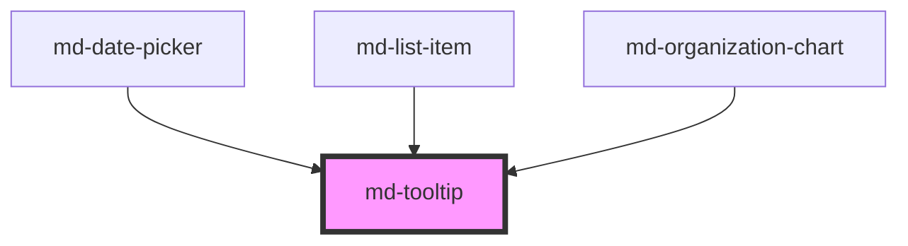

# md-tooltip

<!-- llm:meta
tag: md-tooltip
category: containment
status: md3-mapped
m3-guidelines: https://m3.material.io/components/tooltips/guidelines
form-associated: false
depends-on: none
used-by: md-date-picker, md-list-item, md-organization-chart
-->

**A short explanation of a UI element, shown on hover or focus.** Plain tooltips
label icon-only controls; rich tooltips add a subhead, body text and actions.
You wrap the trigger in the default slot and the component positions, flips and
clamps the popup for you.

> Setup, theming, density and i18n are configured once for the whole library —
> see the [AWC UI documentation](https://awcui.io).

---

## When to use

- **Plain**: naming an icon-only control — the primary use.
- **Rich**: extra context about a feature, optionally with a link or action.
- Explaining a constraint or why something is unavailable.

## When NOT to use

| Situation | Use instead |
|---|---|
| The element already has visible label text | Nothing — M3: a plain tooltip is unnecessary |
| Critical information the user must not miss | `md-dialog` |
| Validation or helper text for a field | The field's `supporting-text` / `error-text` |
| A menu of actions | `md-menu` |
| Transient feedback after an action | `md-snackbar` |
| Long-form content | A dialog, sheet, or page |
| A persistent rich tooltip on an icon button | Nothing — M3 forbids this combination |

## Decision cues

| Need | Setting |
|---|---|
| Label an icon button | `variant="plain"` (default) + `text` |
| Headline, body and actions | `variant="rich"` + `subhead` / `content` / `actions` |
| Fixed side, never flipped | `position="…"` + `auto-position="false"` |
| Flip when it would overflow | `auto-position` (default **on**) |
| Faster or slower reveal | `show-delay` (default `500`) |
| Longer grace period to reach the popup | `hide-delay` (default `200`) |
| More or less clearance from the trigger | `offset` (default `8`) |
| Nudge along the perpendicular axis | `cross-offset` (default `0`) |
| Programmatic control | `open`, `show()`, `hide()` |
| Turn it off without unmounting it | `disabled` |

## API contract

```html
<md-tooltip
  text="Download"                <!-- default: "" — plain body, or rich supporting text -->
  subhead="New feature"          <!-- default: "" — rich variant only -->
  variant="plain|rich"           <!-- default: plain -->
  position="top|top-start|top-end|bottom|bottom-start|bottom-end|left|left-start|left-end|right|right-start|right-end"
                                 <!-- default: top -->
  auto-position="true"           <!-- default: true -->
  offset="8"                     <!-- default: 8 (px, main axis) -->
  cross-offset="0"               <!-- default: 0 (px, perpendicular axis) -->
  open                           <!-- default: false -->
  show-delay="500"               <!-- default: 500 (ms) -->
  hide-delay="200"               <!-- default: 200 (ms) -->
  disabled                       <!-- default: false -->
  density="-1|-2|-3|-4"          <!-- default: 0 (uncompacted; there is no density="0" rule) -->
>
  <md-icon-button icon="download" aria-label="Download"></md-icon-button>
</md-tooltip>
```

**Events** — `mdOpen`, `mdClose`, both `CustomEvent<void>` and both declared
`bubbles: false, composed: false`. They fire **only on the `md-tooltip` element
itself** — a listener on a parent element or on a host that embeds the tooltip
will never fire.

**Methods** — `show()`, `hide()`, both returning promises. `show()` is a no-op
while `disabled`.

**Slots** — `(default)`: **the trigger element** (the first assigned element is
the one bound). `content`: rich supporting text, overriding the `text` prop.
`subhead`: rich subhead, overriding the `subhead` prop. `actions`: rich action
buttons.

**Parts** — `popup`, `text` (plain), `subhead`, `supporting-text`, `actions`
(rich).

### Behavioral contract worth knowing

- **The trigger goes in the default slot** — you wrap the control rather than
  pointing at it by id. Only the **first** assigned element is bound, so wrap
  exactly one trigger per tooltip.
- ⚠️ **A tooltip is not an accessible name.** The component sets
  `aria-description` on the trigger (chosen because it works across shadow
  boundaries, unlike an `aria-describedby` IDREF) — a *description*, never a
  name. An icon-only trigger still needs its own `aria-label`.
- The description is recomputed from `text`, then `subhead`, then the text
  content of the slotted `subhead` / `content` elements, and it stays in sync
  when those change. Slotted `actions` are deliberately excluded.
- Reveal is on **hover and focus**, both delayed by `show-delay`. Moving the
  pointer onto the popup keeps it open, and `hide-delay` is the grace period for
  crossing the gap — that is WCAG 1.4.13 "hoverable", so don't set
  `hide-delay="0"`.
- `Escape` dismisses from anywhere while the tooltip is visible. Focus is
  returned to the trigger only when focus was already inside the tooltip or on
  the trigger, and re-showing is suppressed until the pointer or focus leaves the
  trigger and comes back.
- **Non-interactive triggers get host-level hover.** If the slotted trigger is
  not a `button` / `a` / `input` / `select` / `textarea`, not an `md-*` element,
  and has no focusable `tabindex`, hover is tracked on the `md-tooltip` host
  instead. Such a trigger cannot be focused, so it has no keyboard reveal — give
  it a `tabindex="0"` if keyboard users need the tooltip.
- `auto-position` **flips only along the main axis** (top↔bottom, left↔right).
  Overflow along the perpendicular axis is fixed by clamping the popup 8px
  inside the viewport, so an edge-anchored `position="top"` tooltip keeps its
  side and slides sideways instead of flipping.
- The popup is `position: fixed` and tracks the trigger every frame while
  visible, so it survives scrolling, resizes and ancestors that become
  containing blocks mid-animation. Nothing to call after a layout change.
- `disabled` clears the timers, forces `open` to `false` and removes the
  trigger's `aria-description`; `show()` will not reopen it until `disabled` is
  cleared.
- `open` is reflected and two-way: the hover/focus/Escape paths set it, and your
  code can set it directly instead of calling `show()`/`hide()`.
- In the rich variant `text` is the **fallback** for the `content` slot and
  `subhead` is the fallback for the `subhead` slot; the subhead region is only
  rendered when one of the two is present.
- Only one tooltip should be visible at a time (M3). The component does not
  coordinate across instances, so don't open several programmatically.

---

## Do / Don't

Sourced from [M3 · Tooltips · Guidelines](https://m3.material.io/components/tooltips/guidelines).

| ✅ Do | ❌ Don't |
|---|---|
| Use plain tooltips to label icon-only buttons | Plain tooltips aren't needed when the element already has label text |
| Use rich tooltips for extra information or actions about an element or new feature | Don't hide critical information in a tooltip — it's easy to miss; use a dialog |
| Briefly describe the element | Avoid wrapping to multiple lines or packing in many facts |
| Summarise in a few words | Avoid wrapping to more than one line |
| Show one tooltip at a time | Don't display several simultaneously |
| Keep rich-tooltip actions to a single row | Avoid stacking buttons |
| Use hover/focus reveal | Don't use a persistent rich tooltip on an icon button |
| Also set `aria-label` on the trigger | Don't rely on the tooltip for the accessible name |

---

## Patterns

```html
<!-- Plain: label an icon button. Note BOTH aria-label and tooltip. -->
<md-tooltip text="Download">
  <md-icon-button icon="download" aria-label="Download"></md-icon-button>
</md-tooltip>
```

```html
<!-- Rich: feature introduction with an action -->
<md-tooltip variant="rich" subhead="Smart filters" hide-delay="400">
  <md-button variant="text">Filters</md-button>
  <span slot="content">Save a filter set and reuse it across boards.</span>
  <md-button slot="actions" variant="text">Learn more</md-button>
</md-tooltip>
```

```html
<!-- Fixed side, no flipping -->
<md-tooltip text="Sort ascending" position="bottom" auto-position="false">
  <md-icon-button icon="arrow_upward" aria-label="Sort ascending"></md-icon-button>
</md-tooltip>
```

```html
<!-- A non-interactive trigger needs a tabindex to be keyboard-reachable -->
<md-tooltip text="Read-only field">
  <span tabindex="0" class="badge">SKU-1183</span>
</md-tooltip>
```

```html
<!-- Programmatic, e.g. a one-time coach mark -->
<md-tooltip id="tip" variant="rich" subhead="New here?" text="Filters live in this menu.">
  <md-icon-button icon="filter_list" aria-label="Filters"></md-icon-button>
</md-tooltip>

<script type="module">
  const tip = document.getElementById('tip');
  // mdOpen/mdClose neither bubble nor cross shadow roots — listen on the element.
  tip.addEventListener('mdClose', () => localStorage.setItem('seen-coach-mark', '1'));

  if (!localStorage.getItem('seen-coach-mark')) {
    await tip.show();
    setTimeout(() => tip.hide(), 4000);
  }
</script>
```

## Anti-patterns

| ❌ Wrong | ✅ Right | Why |
|---|---|---|
| Tooltip as the icon button's only label | Set `aria-label` **and** the tooltip | The component sets `aria-description`, which is a description, not a name. |
| `document.addEventListener('mdOpen', …)` or listening on a wrapper | Listen on the `md-tooltip` element | The events are `bubbles: false, composed: false`. |
| Two trigger elements in the default slot | One trigger per tooltip | Only the first assigned element is bound. |
| Referencing the trigger by id | Wrap the trigger in the default slot | That's the composition model. |
| `hide-delay="0"` | Keep a grace period | The pointer must be able to reach the popup (WCAG 1.4.13). |
| A plain `<span>` trigger for a keyboard-reachable tooltip | Add `tabindex="0"` | A non-focusable trigger gets hover only. |
| Expecting `auto-position` to flip sideways overflow | It clamps instead | Flipping is main-axis only by design. |
| Calling a reposition method after a layout change | Do nothing | The popup re-measures every frame while visible. |
| A tooltip on a control that already has visible text | Drop it | M3 explicit rule. |
| Essential information in a tooltip | `md-dialog`, or inline text | Invisible on touch, easy to miss. |
| Three sentences of `text` | A few words | M3: avoid wrapping past one line. |
| A persistent rich tooltip on an icon button | Use a plain tooltip, or a dialog | M3 explicit rule. |
| Several tooltips open at once | One at a time | M3 explicit rule; the component does not coordinate. |
| Stacked action buttons in a rich tooltip | One row | M3 caution. |
| Very short `show-delay` on a dense toolbar | Keep the default | Tooltips firing on every pass are noise. |

## Accessibility, RTL, density, i18n

**Accessibility**
- ⚠️ The most important rule: **the tooltip does not name the trigger.** It sets
  `aria-description`; give icon-only triggers their own `aria-label`.
- Tooltips appear on **keyboard focus**, not just hover — that is built in, so
  don't suppress it. A trigger that cannot receive focus (a bare `<span>`) gets
  hover only; add `tabindex="0"`.
- `Escape` dismisses without moving focus away from whatever the user is
  actually working on — it only returns focus to the trigger when focus was
  already inside the tooltip.
- Rich tooltips with actions must be reachable by keyboard; focus moving from
  the trigger into the popup keeps it open, so don't shorten `hide-delay` to the
  point where the pointer path is unusable.
- The popup is `role="tooltip"` and carries `aria-hidden="true"` while dismissed.
- Nothing critical should live only here: touch users get no hover, and the
  content is transient.
- The reveal animation is dropped under `prefers-reduced-motion: reduce`.

**RTL** — `position` mirrors under `dir="rtl"`: `left`/`right` swap, and the
`-start`/`-end` suffix swaps for `top`/`bottom` placements (where it is inline
alignment) but not for `left`/`right` (where it is block alignment). `offset`
and `cross-offset` are **physical pixel** values and do not mirror.

**Density** — a local override is `density="-1"` through `density="-4"`; it
tightens the plain tooltip's height and the plain/rich text sizes. `0` is the
uncompacted default and has no rule of its own, so it cannot opt the tooltip out
of an inherited `data-density` rung — use `style="--md-sys-density-scale: 0"`
for that, and note the ancestor's `--md-sys-spacing-*` values still inherit.

**i18n** — translate `text`, `subhead` and slotted content. Translations run
longer than English, so re-check M3's one-line rule per locale and consider a
rich tooltip where a plain one would wrap; the plain popup caps at
`--md-tooltip-plain-max-inline-size`.

## Related components

`md-icon-button` · `md-dialog` · `md-snackbar` · `md-menu` · `md-text-field` ·
`md-list-item`

## Theming

| Custom property | Purpose | Default |
|---|---|---|
| `--md-tooltip-plain-container-color` | Plain popup background | `var(--md-sys-color-inverse-surface, #313033)` |
| `--md-tooltip-plain-text-color` | Plain popup text colour | `var(--md-sys-color-inverse-on-surface, #F4EFF4)` |
| `--md-tooltip-plain-max-inline-size` | Plain popup width cap | `280px` (also clamped to `100vw - 16px`) |
| `--md-tooltip-container-shape` | Plain popup corner radius | `var(--md-sys-shape-corner-extra-small, 4px)` |
| `--md-tooltip-rich-container-color` | Rich popup background | `var(--md-sys-color-surface-container, #F3EDF7)` |
| `--md-tooltip-rich-subhead-color` | Rich subhead colour | `var(--md-sys-color-on-surface-variant, #49454F)` |
| `--md-tooltip-rich-text-color` | Rich supporting-text colour | `var(--md-sys-color-on-surface-variant, #49454F)` |
| `--md-tooltip-rich-action-color` | Rich action button colour | `var(--md-sys-color-primary, #6750A4)` |
| `--md-tooltip-rich-container-shape` | Rich popup corner radius | `var(--md-sys-shape-corner-medium, 12px)` |
| `--md-tooltip-rich-min-inline-size` | Rich popup minimum width | `120px` |
| `--md-tooltip-rich-max-inline-size` | Rich popup width cap | `320px` (also clamped to `100vw - 16px`) |

**CSS parts** — `popup` (the floating container), `text` (plain body), `subhead`,
`supporting-text` and `actions` (rich regions).

```css
md-tooltip {
  --md-tooltip-plain-container-color: #1a1a1a;
  --md-tooltip-plain-max-inline-size: 220px;
}
md-tooltip::part(popup) {
  box-shadow: 0 4px 12px rgb(0 0 0 / 0.2);
}
```

<!-- Auto Generated Below -->


## Properties

| Property       | Attribute       | Description                                                                                                                                                                                           | Type                                                                                                                                                                 | Default   |
| -------------- | --------------- | ----------------------------------------------------------------------------------------------------------------------------------------------------------------------------------------------------- | -------------------------------------------------------------------------------------------------------------------------------------------------------------------- | --------- |
| `autoPosition` | `auto-position` | Automatically reposition if overflowing the viewport                                                                                                                                                  | `boolean`                                                                                                                                                            | `true`    |
| `crossOffset`  | `cross-offset`  | Cross-axis offset in pixels                                                                                                                                                                           | `number`                                                                                                                                                             | `0`       |
| `density`      | `density`       | Local density rung. Drives the same `--md-sys-density-scale` signal that a global `data-density` ancestor sets, so a local value simply overrides the inherited one. 0 = default, -4 = ultra-compact. | `-1 \| -2 \| -3 \| -4 \| 0`                                                                                                                                          | `0`       |
| `disabled`     | `disabled`      | When true, hover/focus handlers are ignored and any open tooltip is dismissed.                                                                                                                        | `boolean`                                                                                                                                                            | `false`   |
| `hideDelay`    | `hide-delay`    | Delay before hiding (ms) — for rich variant hover-out grace period                                                                                                                                    | `number`                                                                                                                                                             | `200`     |
| `offset`       | `offset`        | Distance from the trigger in pixels                                                                                                                                                                   | `number`                                                                                                                                                             | `8`       |
| `open`         | `open`          | Programmatic open state                                                                                                                                                                               | `boolean`                                                                                                                                                            | `false`   |
| `position`     | `position`      | Preferred placement relative to the trigger                                                                                                                                                           | `"bottom" \| "bottom-end" \| "bottom-start" \| "left" \| "left-end" \| "left-start" \| "right" \| "right-end" \| "right-start" \| "top" \| "top-end" \| "top-start"` | `'top'`   |
| `showDelay`    | `show-delay`    | Delay before showing (ms)                                                                                                                                                                             | `number`                                                                                                                                                             | `500`     |
| `subhead`      | `subhead`       | Rich tooltip subhead (headline)                                                                                                                                                                       | `string`                                                                                                                                                             | `''`      |
| `text`         | `text`          | Plain tooltip text, or rich tooltip supporting text                                                                                                                                                   | `string`                                                                                                                                                             | `''`      |
| `variant`      | `variant`       | Visual variant                                                                                                                                                                                        | `"plain" \| "rich"`                                                                                                                                                  | `'plain'` |


## Events

| Event     | Description                                                                                                                                                                                                                                          | Type                |
| --------- | ---------------------------------------------------------------------------------------------------------------------------------------------------------------------------------------------------------------------------------------------------- | ------------------- |
| `mdClose` | Emits when the tooltip is dismissed (does not bubble or cross shadow boundaries).                                                                                                                                                                    | `CustomEvent<void>` |
| `mdOpen`  | Emits when the tooltip becomes visible. `bubbles:false` + `composed:false` keep it from crossing the shadow boundary and retargeting onto an embedding host (the repo's documented composed-event-leak class — see md-date-picker's swallow guards). | `CustomEvent<void>` |


## Methods

### `hide() => Promise<void>`

Dismiss the tooltip programmatically.

#### Returns

Type: `Promise<void>`


### `show() => Promise<void>`

Show the tooltip programmatically (no-op while `disabled`).

#### Returns

Type: `Promise<void>`


## Slots

| Slot        | Description                                          |
| ----------- | ---------------------------------------------------- |
|             | Trigger element the tooltip is anchored to           |
| `"actions"` | Rich tooltip action buttons                          |
| `"content"` | Rich tooltip supporting text (overrides `text` prop) |
| `"subhead"` | Rich tooltip subhead (overrides `subhead` prop)      |


## Shadow Parts

| Part                | Description                          |
| ------------------- | ------------------------------------ |
| `"actions"`         | Rich tooltip action button wrapper   |
| `"popup"`           | Tooltip popup container              |
| `"subhead"`         | Rich tooltip subhead wrapper         |
| `"supporting-text"` | Rich tooltip supporting text wrapper |
| `"text"`            | Plain tooltip text wrapper           |


## Dependencies

### Used by

 - [md-date-picker](../md-date-picker)
 - [md-list-item](../md-list-item)
 - [md-organization-chart](../md-organization-chart)

### Graph


----------------------------------------------

*Built with [StencilJS](https://stenciljs.com/)*
